# 15 Best Leadership Books

*That made a better leader from me.*

This reading guide is for you, as a leader, to navigate and upgrade your **leadership skills**. It is a curated list of the best books on leadership to read during the holiday season. But it is not just a numbered list of books to read. It is a guide informed by my selection from many books I’ve read and discussed with many leaders in the field.

These books offer more than theory; **they show how real people find better ways to communicate, think, and inspire**. Consider this list as a set of tools. Pick one that fits your current needs. Whether it’s building trust, encouraging creativity, or understanding how people make decisions, you’ll find something here to sharpen your leadership game.

Let’s dive in.

---

I was often asked which leadership resources I could recommend, so here is a visual guide to the 15+ leadership books that had the most influence on me as a leader.

[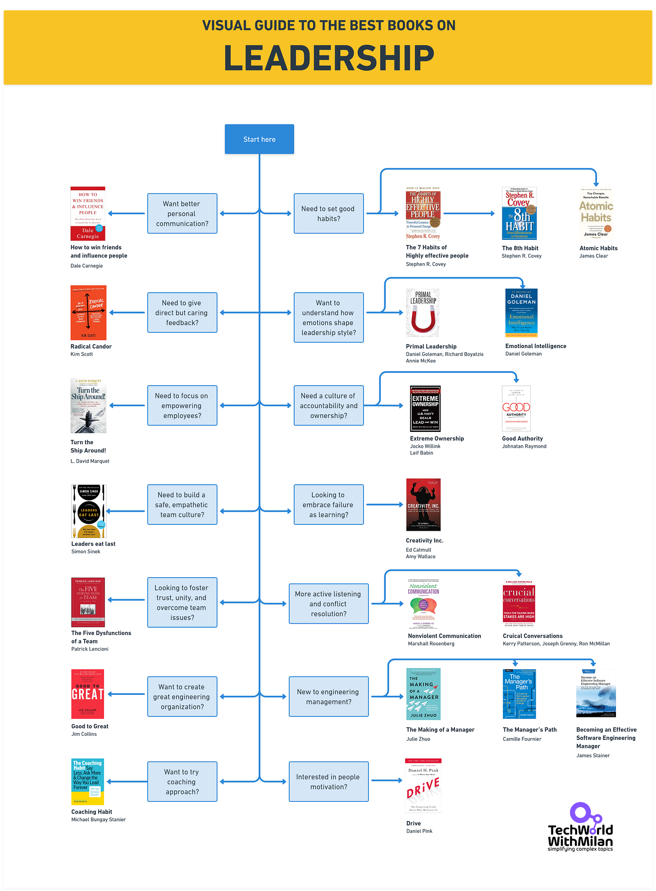](https://substackcdn.com/image/fetch/$s_!uC7y!,f_auto,q_auto:good,fl_progressive:steep/https%3A%2F%2Fsubstack-post-media.s3.amazonaws.com%2Fpublic%2Fimages%2F886b86b9-c5fd-444b-81d8-3da2576465cf_3180x4316.png)A visual guide to the best books on leadership

So, let’s start with the first and probably the most important book of all:

## 1. [How to Win Friends and Influence People](https://amzn.to/4gnVN3A)

[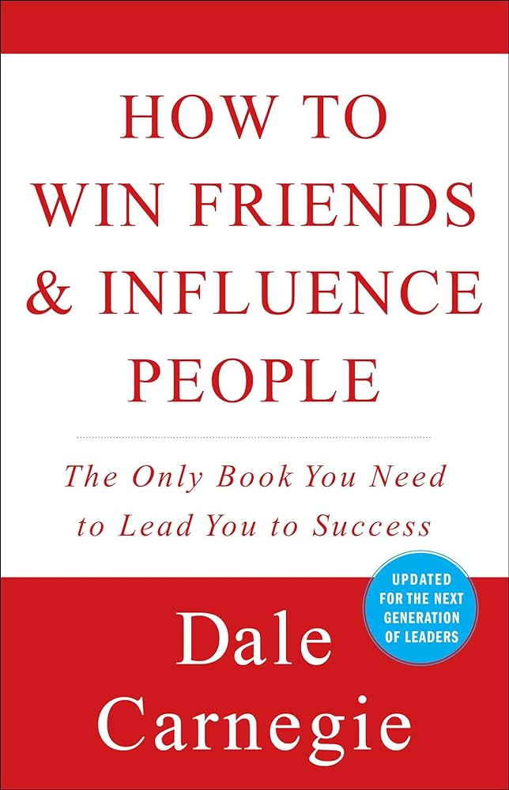](https://amzn.to/4gnVN3A)[How to win friends & influence people](https://amzn.to/4gnVN3A), by Dale Carnegie

It's probably the most important book on this list. Written by Dale Carnegie in 1936, it is still as relevant today as it was back then, as human nature remains constant. Published during the height of the Great Depression, the book emerged at a time when people desperately needed strategies to connect, survive, and thrive in challenging economic circumstances.

It covers basic human behavior and shows **how simple changes in attitude and approach can reshape relationships**. Instead of manipulating people, it focuses on empathy, listening, and finding common ground.

Leaders can find value in these lessons when guiding teams and creating positive environments. This **book is suitable for those who want to improve communication skills and earn respect rather than demand it**. If you want a less tense office where people trust each other, this book can help.

Here are some **lessons that I learned from it**:

- Smile
- Listen actively
- Avoid criticism
- Admit your mistakes
- Let others feel the idea is theirs
- Encourage talking about themselves
- Ask questions rather than give orders
- Be genuinely interested in other people
- Talk in terms of other people's interests
- Remember and use the other person's name
- Always make the other person feel important
- Challenge people in a way that motivates them
- See things from the other person's perspective
- If you're wrong, admit it openly and with enthusiasm
- Begin with praise and honest appreciation, then discuss issues

## 2. [7 Habits of Highly Effective People](https://www.amazon.com/Habits-Highly-Effective-People-Powerful/dp/0743269519)

[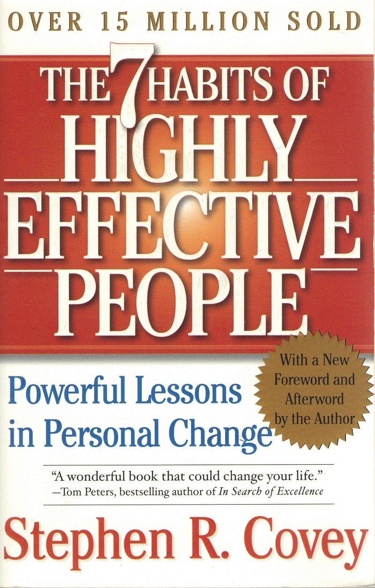](https://www.amazon.com/Habits-Highly-Effective-People-Powerful/dp/0743269519)[The 7 Habits of Highly Effective People: Powerful Lessons in Personal Change](https://www.amazon.com/Habits-Highly-Effective-People-Powerful/dp/0743269519), by Stephen R. Covey

It was first published in 1990 and is one of the classics. It teaches how to use a principle-centered approach to solving challenges in life. After 25 years of dealing with successful people in business, universities, and relationship settings, Stephen R. Covey noticed that great achievers were frequently troubled by emptiness. He read self-help, self-improvement, and popular psychology books from the past 200 years to comprehend why. Here, he observed a striking historical disparity between **two kinds of success**.

According to Covey, **developing your character rather than your personality is the key to long-term success**. More than what we say or do, who we are speaks volumes. A set of guiding principles is the foundation for the "**Character Ethic**." According to Covey, most religious, social, and ethical systems uphold these ideas as self-evident and timeless. They are applicable everywhere.

The 7 habits are:

1. **🚀 Be proactive:** Take initiative and responsibility for your actions. Don't blame others or circumstances; focus on what you can influence. This is the most important lesson I learned from the book.
2. **🎯 Begin with the end in mind:** Define clear, personal, and professional goals. Visualize the outcomes you desire, shaping your actions toward achieving them.
3. **🗂️ Put first things first:** Prioritize tasks based on importance, not urgency. Invest time in activities that align with your core values and goals.
4. **🤝 Think win-win:** Seek mutually beneficial solutions in interactions. It's not about being nice; it's about being practical, valuing and respecting others.
5. **👂 Seek first to understand, then to be understood:** Listen empathetically. Understanding others' perspectives can significantly improve relationships and problem-solving.
6. **🌐 Synergize:** Combine people's strengths through teamwork to achieve goals no individual could. Value differences and leverage them for collective success.
7. **🪚 Sharpen the saw:** Regularly renew and enhance yourself in four areas: physical, mental, social/emotional, and spiritual. This habit ensures longevity and effectiveness in your other habits.

The book's emphasis on character development over personality enhancement resonates with readers seeking meaningful, sustainable success in all areas of life. It is highly recommended reading for everyone.

➡️ Read more about it in my article:
[
Tech World With Milan NewsletterThe habits of highly effective peopleAfter 25 years of dealing with successful people in business, universities, and relationship settings, Stephen R. Covey noticed that great achievers were frequently troubled by emptiness. To comprehend why, he read self-help, self-improvement, and popular psychology books from the past 200 years. Here, he observed a striking historical disparity between…Read more2 years ago · 43 likes · Dr Milan Milanović](https://newsletter.techworld-with-milan.com/p/the-habits-of-highly-effective-people?utm_source=substack&utm_campaign=post_embed&utm_medium=web)
> **📙***Covey also wrote a book called “**[The 8th Habit](https://amzn.to/3TBd418)**”, where we clarified earlier declarations that "interdependence is a higher value than independence." This means finding one’s own “voice” and inspiring others to discover theirs is essential.*

## 3. [Atomic Habits](https://amzn.to/3Kjody5)

[Atomic Habits](https://amzn.to/3Kjody5), by James Clear

A great book on adapting proper habits is **[Atomic Habits](https://amzn.to/3Kjody5)**by James Clear, which has sold over 20 million copies. It explores the science of habit formation and explains how small, consistent changes can lead to remarkable long-term results.

The book offers a practical framework for building good habits and breaking bad ones. It focuses on the "**habit loop**" and uses cues, cravings, responses, and rewards to create a system that will transform one's behavior.

An example of running:

- **🛎️ Cue**: A trigger that initiates the behavior (e.g., seeing your running shoes by the door).
- **🔥 Craving**: The motivation or desire to take action (e.g., the desire for accomplishment after a run).
- **🏃‍♂️ Response**: The actual habit or action you perform (e.g., going for the run).
- **✨ Reward**: The benefit or satisfaction you gain from completing the habit (e.g., feeling energized and healthy).

To use the habit loop effectively, design clear **cues**, like setting reminders or placing objects in plain sight, to trigger the behavior. Amplify your **cravings** by linking habits to positive emotions or desired outcomes, and simplify the **response** to make the habit easy to perform, starting with small steps. Finally, reinforce the loop with **rewards**, such as celebrating small wins, to encourage repetition and **make the habit stick**. Science says **the habit is formed after 2 months of doing something** ([source](https://jamesclear.com/new-habit)).

This book is a **must-read for everyone**!

[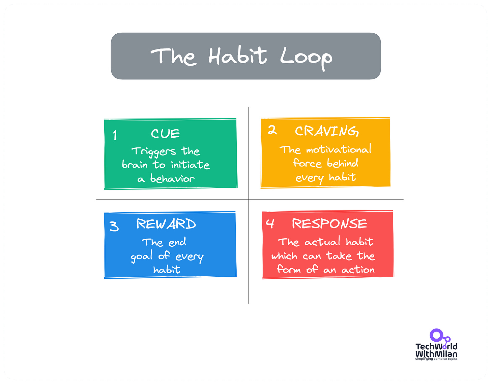](https://substackcdn.com/image/fetch/$s_!qx4r!,f_auto,q_auto:good,fl_progressive:steep/https%3A%2F%2Fsubstack-post-media.s3.amazonaws.com%2Fpublic%2Fimages%2Fcb5ac6bd-cf36-4e80-b8ea-1779bbddc5a3_2476x1940.png)

> “*People do not decide their futures, they decide their habits and their habits decide their futures.*” ― F. M. Alexander

## 4. [Radical Candor](https://amzn.to/3VrtNUS)

[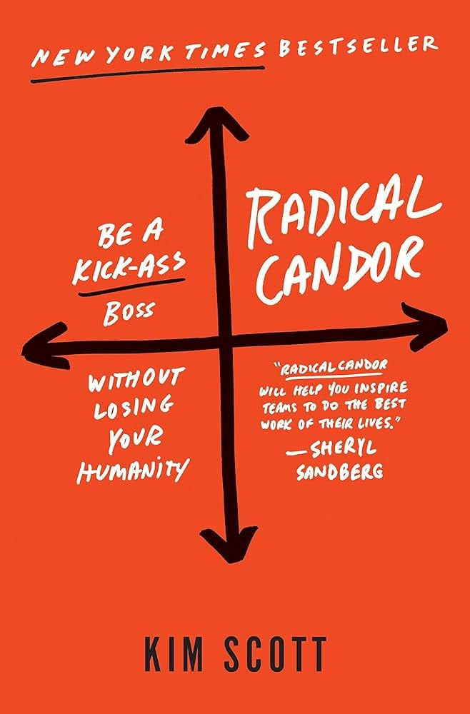](https://amzn.to/3VrtNUS)[Radical Candor: Be a Kick-Ass Boss Without Losing Your Humanity](https://amzn.to/3VrtNUS) by Kim Scott

This book tackles a common problem: **giving honest feedback without being a jerk**. It explains that caring personally and challenging directly can live together. By applying these ideas, leaders create trust and inspire teams to grow, hitting the right point.

Radical Candor is the capacity to **question directly while demonstrating a genuine concern for the other person**. If done correctly, it will assist you in producing the best work of your/their lives and cultivate dependable connections throughout your professional life.

Although providing constructive criticism might seem like a no-brainer for improving a team's communication and level of trust, it is not so common. Practical criticism and appreciation **require a personal connection**. Radical Candor is not a brutal honesty; it has a negative connotation, as we can’t always be honest. Radical Candor is thoughtful and helpful.

When giving feedback, take the person to a private place (don’t embarrass them) and clearly say the parts you like about their work and what you didn’t like. Pay attention to their reactions. If the person reacts positively, continue. If not, acknowledge their feelings, **but continue what you need to say**. Don’t let their reaction deter you from making your main point.

➡️ Read more about it in my text **[here](https://newsletter.techworld-with-milan.com/i/136186554/how-do-you-give-direct-feedback-while-still-caring-about-your-people)** and check 10 resources to help you practice it **[here](https://www.radicalcandor.com/blog/how-to-practice-radical-candor/)**.

## 5. [Primal Leadership](https://amzn.to/41hyrZo)

[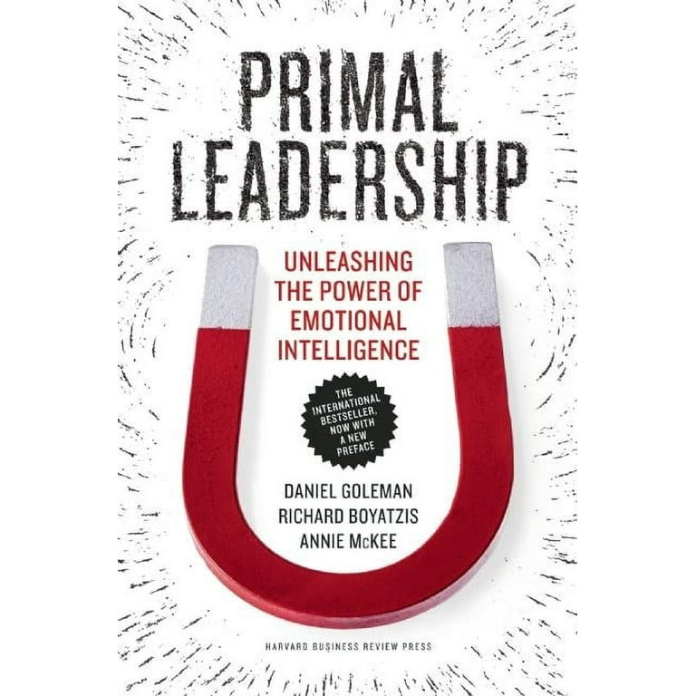](https://amzn.to/41hyrZo)[Primal Leadership, With a New Preface by the Authors: Unleashing the Power of Emotional Intelligence](https://amzn.to/41hyrZo), by Daniel Goleman, Richard Boyatzic, Annie McKee

This book builds on the idea that emotions affect everything at work, as Daniel Goleman (the author of [Emotional Intelligence](https://amzn.to/3D14SBb)) stated. It shows why understanding and **managing emotions—your own and your team’s—improves results**. Emotional intelligence isn’t soft; it’s practical and shapes how people collaborate.

The book introduces the concept of "**resonant leadership**," a model in which leaders create emotional environments that inspire, motivate, and drive collective performance. Goleman demonstrates **how leaders' emotional intelligence—their ability to understand and manage their emotions and those of their team—directly impacts organizational effectiveness**, employee engagement, and innovation.

Through extensive research and case studies, Goleman reveals that **technical skills and expertise are insufficient for a great leader**. The most effective leaders can create emotional connections, manage team dynamics, and cultivate a positive, supportive workplace atmosphere that brings out the best in their people.

➡️ Read more about using the right leadership styles for your organization in my text **[here](https://newsletter.techworld-with-milan.com/p/are-you-aware-that-you-should-use)** and an **[original blog post](https://hbr.org/2001/12/primal-leadership-the-hidden-driver-of-great-performance)** in HBR on this topic from 2001.

## 6. [High output management](https://amzn.to/3B7ePfZ)

[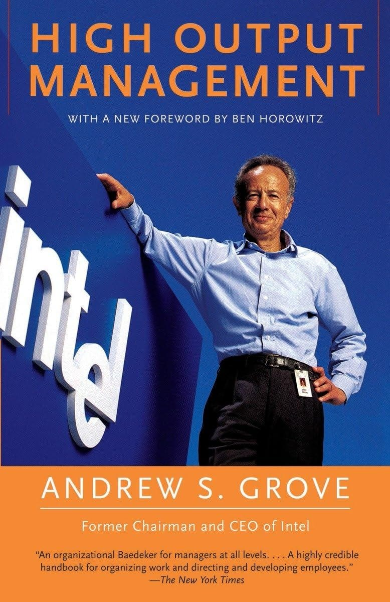](https://amzn.to/3B7ePfZ)[High Output Management](https://amzn.to/3B7ePfZ) by Andrew Grove

One of my favorite books by Andrew Grove provides a comprehensive overview of a manager's role. **It is one of the bibles of management**. Andrew Grove, the legendary CEO who transformed Intel into a global technology powerhouse (not so much today), offers a systematic, pragmatic approach to management in High Output Management.

In the book, he introduces innovative concepts like **viewing management activities as a production process**, understanding leverage points in organizational systems, and creating structures that enable consistently high performance.

The book is particularly valuable for its no-nonsense approach to problem-solving. Grove teaches managers to design **effective meetings, provide meaningful feedback, make critical decisions, and create systems that amplify team capabilities**.

This book is a good choice for those who like practical guidance for daily management tasks.

## 7. [Turn that Ship Around](https://amzn.to/4faQp2S)

[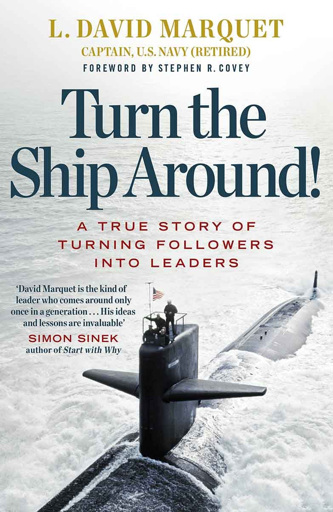](https://amzn.to/4faQp2S)[Turn the Ship Around!: A True Story of Turning Followers into Leaders](https://amzn.to/4faQp2S), David Marquet, Stephen Covey

This is a book about great leadership styles applied in a submarine. It explains that everyone can be a leader. As captain of the USS Santa Fe, Marquet pioneered a revolutionary leadership approach called **servant leadership** that challenged fundamental assumptions about hierarchical management and people empowerment.

The book follows the author's journey of transforming the Navy's worst-performing submarine into the best by fundamentally reimagining leadership. Instead of relying on top-down directives, **he created a culture of distributed leadership where every team member was encouraged to think critically, make decisions, and take ownership of their responsibilities at the lowest level of the hierarchy**. His approach shifted from a model of leaders giving orders to one where leaders create environments that enable others to lead.

It's recommended **for leaders who want less top-down authority**. If your team seems passive, this book can show you how to inspire initiative. You can learn ways to let people lead themselves and share responsibility.

➡️ Learn more about the approach **[here](https://newsletter.techworld-with-milan.com/i/136186554/why-should-you-be-a-servant-leader)**, or watch the video from **Talks at Google**:

> **📗***Also, check David's follow-up book, “**[Leadership is a Language](https://amzn.to/3Zokiqw)**,” where he discusses how to modify your approach to reach new heights of organizational success.*

## 8. [Extreme Ownership](https://amzn.to/4f1NWYE)

[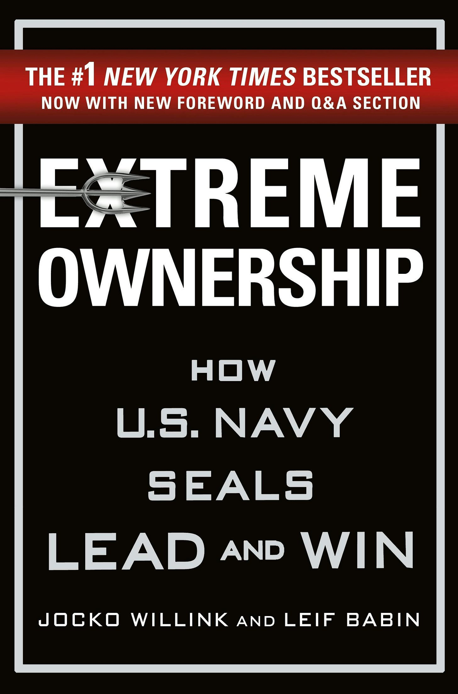](https://amzn.to/4f1NWYE)[Extreme Ownership](https://amzn.to/4f1NWYE), Jocko Willink, and Leif Babin

This book focuses on full accountability. **Leaders who take responsibility set a tone that no excuses are allowed**. This mindset flows down the leadership chain, making everyone more engaged and careful.

Jocko Willink and Leif Babin translate their high-stakes military experiences (Navy SEAL combat operations) into universal leadership principles that challenge leaders to take complete responsibility for their world. The core premise of Extreme Ownership is that **there are no bad teams, only bad leaders**. The authors argue that every failure, challenge, and team dysfunction can be traced back to leadership. This isn't about blame but recognizing that true leaders have the power and responsibility to create solutions, build resilient teams, and drive meaningful change.

They show how **taking complete responsibility**—for mission failure, team performance, and individual team member development—can fundamentally transform organizational culture and personal performance. This book is suitable for leaders **who struggle with blame games**. If your team points fingers, this book can show you how to fix that. It’s recommended for those who want a more reliable, disciplined team that owns results.

> “*After all, there can be no leadership where there is no team*” - Jocko Willink and Leif Babin

➡️ Learn more about how to be accountable:
[
Tech World With Milan NewsletterHow to be Accountable?This week’s issue brings to you the following…Read more2 years ago · 35 likes · Dr Milan Milanović](https://newsletter.techworld-with-milan.com/p/how-to-be-accountable?utm_source=substack&utm_campaign=post_embed&utm_medium=web)
## 9. [Leaders Eat Last](https://amzn.to/4glJkh5)

[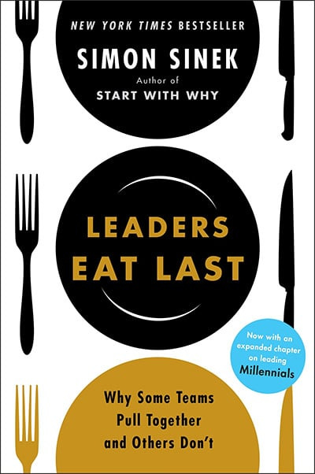](https://amzn.to/4glJkh5)[Leaders Eat Last](https://amzn.to/4glJkh5), Simon Sinek

A famous piece by [Simon Sinek](https://simonsinek.com/) argues that leaders should sacrifice their comfort to benefit those who follow them. It’s about creating an environment of safety where people feel valued, not threatened. Over time, this leads to better loyalty and performance.

The book's title comes from a powerful leadership observation in military units: Leaders eat last, **ensuring their team's needs are met before their own**. Sinek expands this metaphor into a leadership philosophy that challenges the usual corporate narrative of managers’ self-interest. He argues that the most effective **leaders create "circles of safety" where team members feel protected, valued, and empowered to take risks and innovate**.

This is good for leaders who think morale matters. Consider this book if you want a culture where people support each other. Remember, when you become a leader, everything is about them, not you anymore.

> 🎥 Check out Simon's TED talks on “*[How great leaders inspire actions](https://www.ted.com/talks/simon_sinek_how_great_leaders_inspire_action?subtitle=en)*” and “*[Why good leaders make you feel safe](https://www.ted.com/talks/simon_sinek_why_good_leaders_make_you_feel_safe?subtitle=en)*.”

## 10. [Creativity Inc](https://amzn.to/4gkkJsU)

[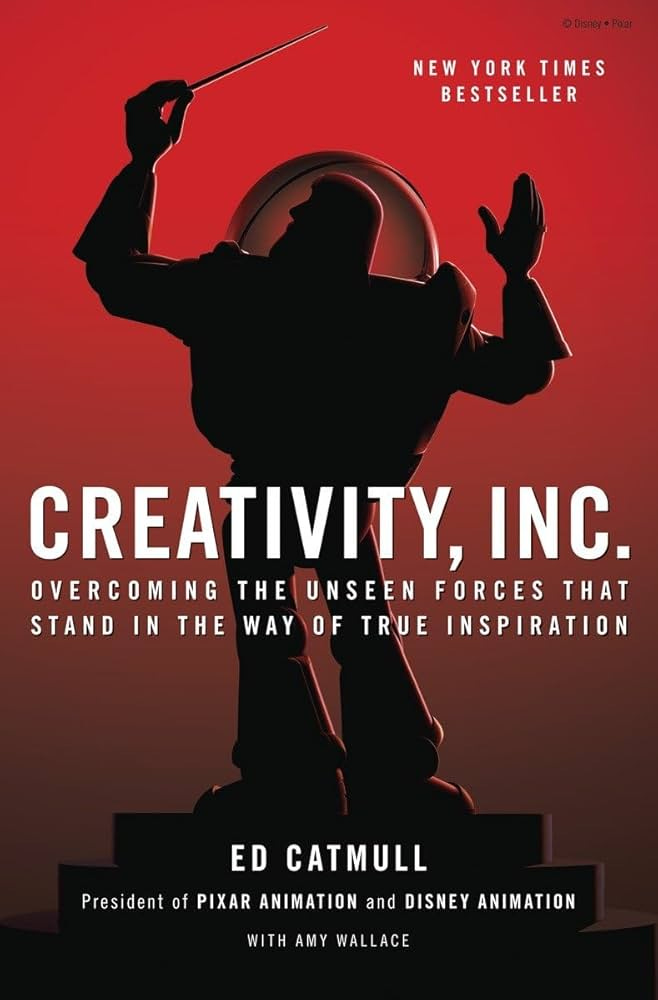](https://amzn.to/4gkkJsU)[Creativity, Inc.](https://amzn.to/4gkkJsU) by Ed Catmull

This book shows that great ideas often come from failure and honest feedback. Its lessons come from Pixar’s experience creating a culture that values risk and open discussion. **People feel safe sharing opinions, knowing it’ll help, not hurt**.

The author reveals the mechanisms behind Pixar's legendary creative process, showing how they systematically combat the natural human tendencies that stifle innovation. He introduces concepts like "**candid feedback cultures,**" embracing failure as a learning mechanism, and **creating psychological safety** that allows team members to take creative risks without fear of ridicule or punishment.

The book is a masterclass in understanding **how great creative organizations are built**. If your team needs more courage to test ideas, consider these methods from the book.

## 11. [Emotional Intelligence](https://amzn.to/3D14SBb)

[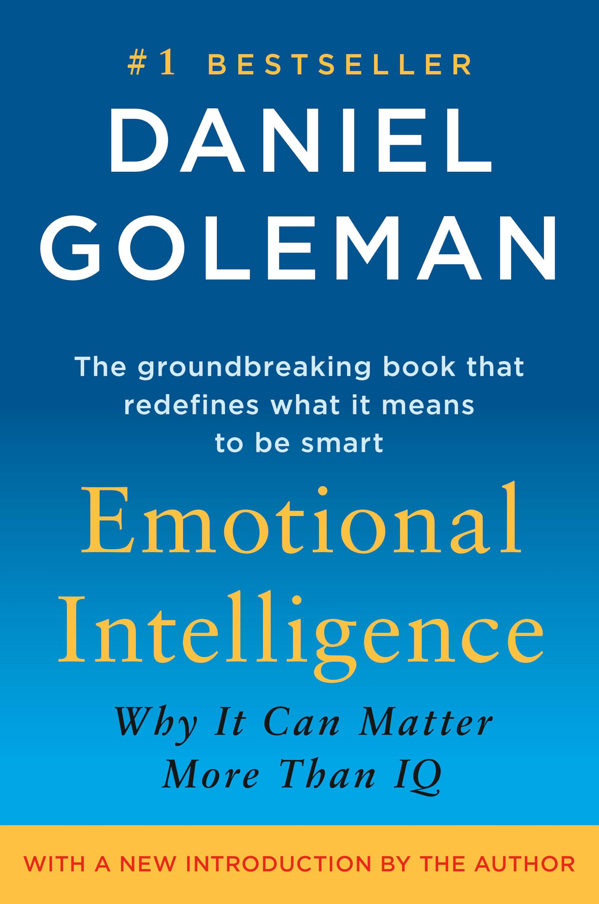](https://amzn.to/3D14SBb)[Emotional Intelligence](https://amzn.to/3D14SBb) by Daniel Goleman

A famous book based on Daniel Goleman's research offers new insights into two minds: rational and emotional. This book digs into the **link between emotions and decision-making** and explains how understanding both logical and emotional sides can lead to more competent leadership.

The author reveals how self-awareness, empathy, and emotional management are not soft skills but critical competencies that determine leadership effectiveness, team performance, and personal success. The book challenges traditional notions of intelligence, **showing that IQ is just one small part of human capability**.

There are 4 core competencies of Emotional Intelligence:

- **🪞 Self-Awareness** involves knowing your emotions, strengths, limitations, and values.
- **🌍 Social Awareness** means understanding others' emotions, perspectives, and dynamics around you.
- **🎛️ Self-Management** - It’s about controlling your emotions and behaviors to adapt to changing circumstances.
- **🤝 Relationship Management** - Building and maintaining strong, supportive relationships through effective communication and conflict resolution.

Recommended if you want to understand why people react the way they do and how to respond well.

[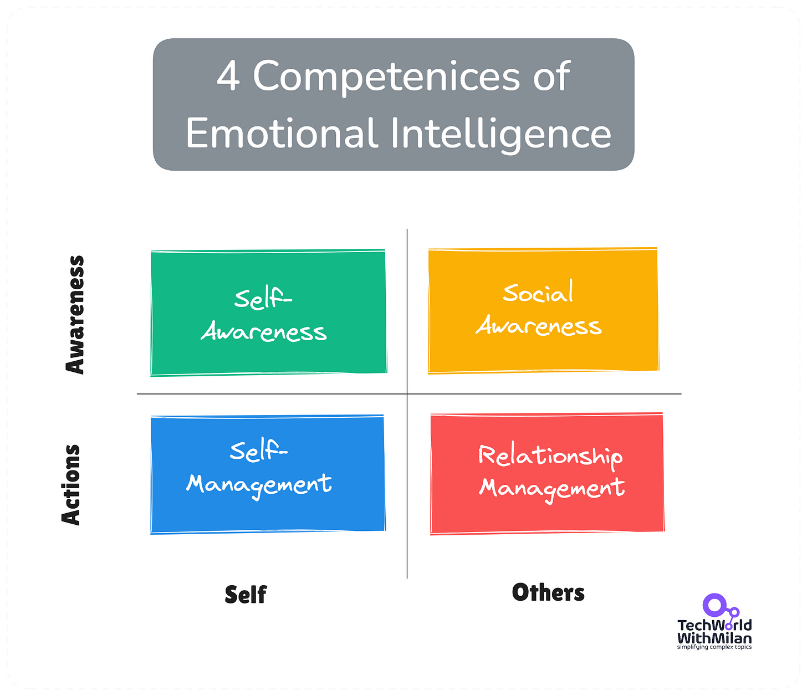](https://substackcdn.com/image/fetch/$s_!uC-v!,f_auto,q_auto:good,fl_progressive:steep/https%3A%2F%2Fsubstack-post-media.s3.amazonaws.com%2Fpublic%2Fimages%2F729a8b68-e26f-4e2c-abbc-7e99a5e6128f_2296x1980.png)4 Competencies of Emotional Intelligence

## 12. [The Five Dysfunctions of a Team](https://amzn.to/3Z20fwW)

[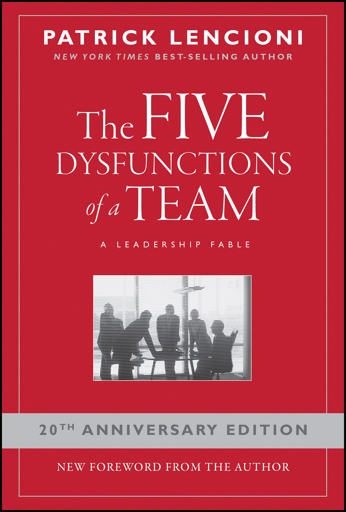](https://amzn.to/3Z20fwW)[The Five Dysfunctions of a Team](https://amzn.to/3Z20fwW), Patrick Lencioni

One of the most critical components of your leadership is the well-being of your team. A great team must have the trust, commitment, and accountability necessary for high performance. Yet, there is no simple cure for all of these issues. And I often see that **managers don't understand that some conflicts in a team are healthy**.

In his book **[The Five Dysfunctions of a Team](https://amzn.to/3UMLInp)**, Patrick Lencioni identified five dysfunctions: absence of trust, fear of conflict, lack of commitment, avoidance of accountability, and inattention to results. Lencioni argues that these **dysfunctions are not isolated problems but form a cascading system where each dysfunction enables and amplifies the others**.

Leaders who see repeated issues can use this book as a checklist. It’s good for clearing out problems that keep showing up. It is recommended for those serious about long-term teamwork improvements.

[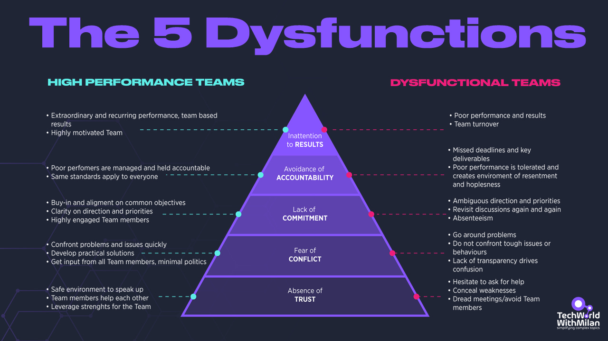](https://substackcdn.com/image/fetch/$s_!Ct4e!,f_auto,q_auto:good,fl_progressive:steep/https%3A%2F%2Fsubstack-post-media.s3.amazonaws.com%2Fpublic%2Fimages%2F25c9df59-6269-43b2-a256-a8c5a4508445_1280x720.png)

➡️ Learn more about the book in my text **[here](https://newsletter.techworld-with-milan.com/i/115003073/how-do-you-handle-dysfunctions-in-a-team)**.

## 12. [Nonviolent Communication](https://amzn.to/4f74e2c)

[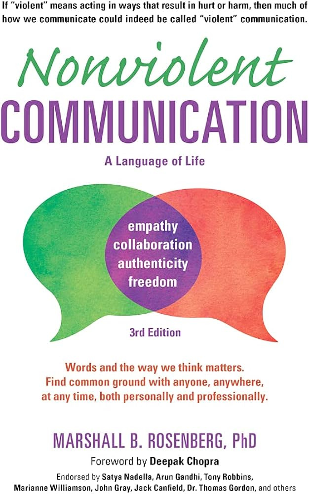](https://amzn.to/4f74e2c)[Nonviolent Communication](https://amzn.to/4f74e2c) by Marshall Rosenberg

This book focuses on how we talk and listen. It argues that empathy and honesty can help us avoid negative cycles and improve relationships. The method is straightforward, **aiming at clarity and understanding rather than winning arguments**.

The author argues that **most human conflicts arise from communication patterns that disconnect us from our own needs and the needs of others**. By teaching a transparent, honest expression and deep listening language, he provides tools for resolving conflicts, building genuine connections, and creating more collaborative environments. It includes a **four-step NVC framework**, which starts from observing things, over feelings and needs, towards requests we need to make.

It suits leaders **dealing with tension or unclear communication** and can help reduce misunderstandings and build trust.

[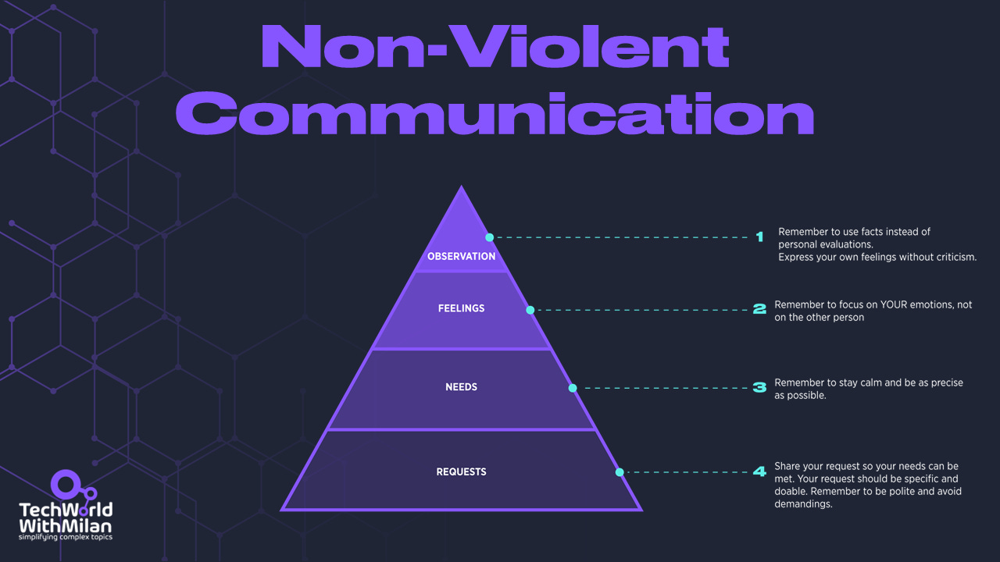](https://substackcdn.com/image/fetch/$s_!B-f1!,f_auto,q_auto:good,fl_progressive:steep/https%3A%2F%2Fsubstack-post-media.s3.amazonaws.com%2Fpublic%2Fimages%2F1b006293-a2de-457b-a3ea-f6d99e2cf243_1280x720.png)

➡️ Read more about how to deal with difficult conversations:
[
Tech World With Milan NewsletterHow to deal with difficult conversations?Leadership is often defined by navigating challenging conversations with grace and empathy. In today's complex workplaces, where different perspectives and high-stakes interactions are everyday issues, mastering effective communication isn't just a skill—it's a critical strategic advantage. This article explores two powerful frameworks that can transfor…Read morea year ago · 21 likes · 2 comments · Dr Milan Milanović](https://newsletter.techworld-with-milan.com/p/how-to-deal-with-difficult-conversations?utm_source=substack&utm_campaign=post_embed&utm_medium=web)
> 📘*One book that can help you with tough conversations with people is **[Crucial Conversations](https://amzn.to/3COhyeL)** by Kerry Patterson et al. It can help you when stakes are high, opinions vary, and emotions are strong.*

## 13. [The Making of a Manager](https://amzn.to/4fZ9IgQ)

[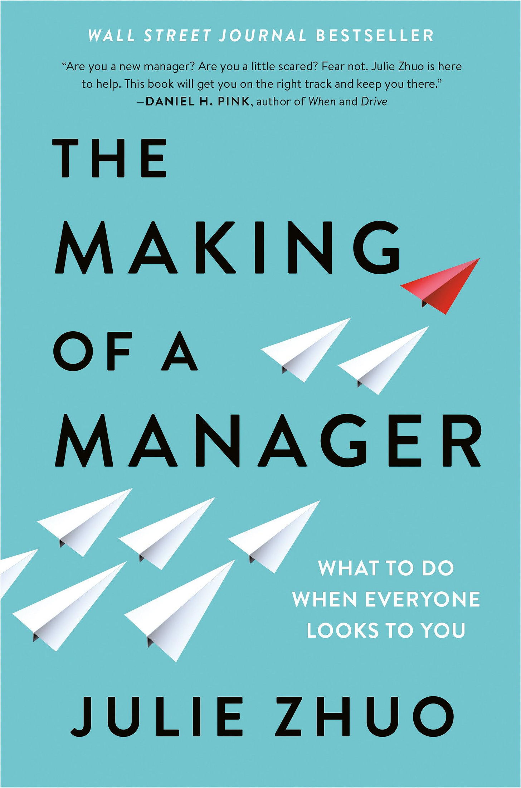](https://amzn.to/4fZ9IgQ)[The Making of a Manager](https://amzn.to/4fZ9IgQ), by Julie Zhuo

Written by [Julie Zhuo](https://www.juliezhuo.com/), a former VP of Design at Meta, it explores what new (engineering) managers can do in their first three months and beyond to ensure their team gets excellent results. It’s one of **the best books for first-time engineering managers**, but even experienced leaders might pick up pointers for new ideas and perspectives.

The book recognizes that becoming a manager is not just about acquiring new skills but fundamentally changing one's professional identity. Zhuo provides a nice overview of critical challenges like **setting clear expectations, providing meaningful feedback, making difficult personnel decisions, and creating a positive team culture**. She addresses leadership's emotional and psychological challenges with honesty and empathy.

> 📝*Also, check [Julie Zhuo's blog on Medium](https://joulee.medium.com/https://joulee.medium.com/).*

Two more books I can recommend in this category are:

- **📘 [The Manager’s Path](https://amzn.to/4gpStoG)** by Camille Fournier.
- **📕 [Becoming an Effective Software Engineering Manager](https://amzn.to/41pOYKK)** by James Stainer.

## 14. [Drive](https://amzn.to/43zeP1x)

[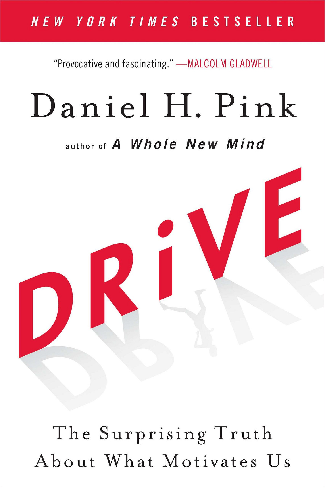](https://amzn.to/43zeP1x)[Drive](https://amzn.to/43zeP1x) by Daniel Pink

When it comes to motivating teams, research has found that when we give people **autonomy**over their work, **ownership**of the task at hand, and a **sense of purpose** in their contribution, they will do more than work—**they'll be motivated**. Here, we can take a lesson from Daniel Pink’s book “**[Drive](https://amzn.to/43zeP1x)**,” which says people are driven to do great things because of intrinsic rewards, not only relying on external rewards like promotions or bonuses.

To motivate people, give them a meaningful purpose and autonomy over their work, and help them build mastery. These incentives have been known to bring out the best in people and help **create a sense of pride and accomplishment**.

It’s suitable for leaders who want more engagement. If your team feels flat, it may be time to rethink motivation.

➡️ Learn more about the book in my text **[here](https://newsletter.techworld-with-milan.com/i/115003073/how-would-you-like-to-motivate-your-team)**.

## 15. [Good to Great](https://amzn.to/3Biiibs)

[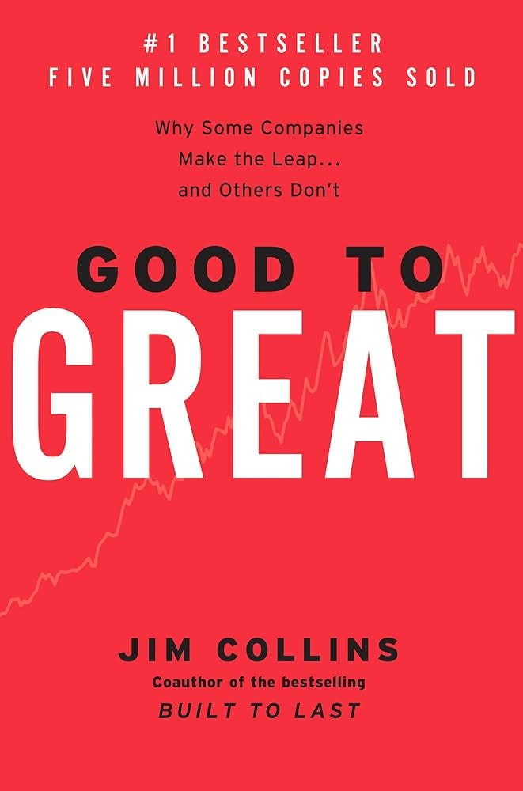](https://amzn.to/3Biiibs)[Good to Great](https://amzn.to/3Biiibs), by Jim Collins

The book is based on the premise that "**good is the enemy of great**." It explores why some companies climb beyond average and stay there. It highlights traits that set them apart, like disciplined people and long-term thinking.

The book introduces revolutionary concepts like the "**Level 5 Leader**"—executives who combine personal humility with professional will and prioritize the organization's success over individual glory. Collins reveals that **great companies are not built through charismatic, heroic leadership but through disciplined people, thought, and action**.

One of the book's most powerful insights is the "**Hedgehog Concept**," the idea that great organizations focus intensely on what they excel at, what drives their economic engine, and what they are deeply passionate about.

## Honorable mentions

Along with the mentioned leadership and personal development books, many more are in this category. Some are good; some are not so much. I would also add a few more to this list:

- **📔 [Multiplier](https://amzn.to/4gr7gzJ)**by****Liz Wiseman. This book shows how confident leaders make everyone around them more intelligent and more effective. It looks at what these “Multipliers” do differently: they challenge, listen, and push others to do their best rather than overshadowing them. Read more about it in my text **[here](https://newsletter.techworld-with-milan.com/p/how-to-be-a-multiplier-as-a-leader)**.
- **📕 [The Tipping Point](https://amzn.to/3Pt1DVS)** by Malcolm Gladwell**.** In this book, Malcolm Gladwell tries to identify why some ideas spread quickly among people while others do not and what factors influence the spread of these ideas. He remembered the benefits of keeping groups under 150 people (called "**The Rule of 150**"). Read more about it in my text **[here](https://newsletter.techworld-with-milan.com/p/your-architecture-is-complex-as-your)**.
- **📗 [Deep Work](https://amzn.to/4a2y8mT)**by Cal Newport. This book emphasizes the importance of intense focus in a world of distractions. It argues that working intensely on a single task for a longer time can produce better results, increase personal satisfaction, and help you master complex skills. This book helped me organize my time over 3-4 hours of focused time.
- **📘 [Mindset](https://amzn.to/4g2jrmz)**by Carol Dweck. This book introduces the concept of a growth mindset (very important!). It shows how believing that abilities can be developed through effort leads to resilience, learning, and better results than believing talent is static. If we don’t know something, we should say: "*I don’t know this yet, but I will learn,*” and see challenges as opportunities to grow.
- **📙 [Influence: The Psychology of Persuasion](https://amzn.to/3ZpaYmj)**by Robert B. Cialdini. This book explains why people say “yes.” It identifies key principles—reciprocity, authority, and social proof—that shape our decisions. Understanding these principles can help leaders influence ethically and be more aware of others’ tactics.
- **📓 [The Laws of Human Nature](https://www.amazon.com/Laws-Human-Nature-Robert-Greene-ebook/dp/B07C87SQ53)**by Robert Greene explores human psychology to explain why people act as they do. It offers insights into our drives, desires, and fears so leaders can more thoughtfully understand, predict, and respond to human behavior.
- **📒 [Thinking Fast and Slow](https://www.amazon.com/Thinking-Fast-Slow-Daniel-Kahneman-ebook/dp/B005MJFA2W)** by Daniel Kahneman (Nobel laureate in economics in 2002. for his work on understanding how people make economic decisions) explores the two systems in our minds: one that thinks quickly and emotionally and one that thinks slowly and logically (Type 1 and Type 2). Understanding how these systems work helps leaders recognize biases, make more deliberate choices, and improve decision-making under pressure. Read more about making better decisions by considering biases and mental models in my text **[here](https://newsletter.techworld-with-milan.com/p/how-to-make-better-decisions-with)**.
- **📖 [The Culture Map](https://amzn.to/3uzBPAz)** by Erin Meyer explores the complexities of cross-cultural communication and how cultural differences impact work dynamics. Using real-world examples and a framework of eight dimensions, the book highlights key areas like communication styles, decision-making, trust-building, and feedback preferences across different cultures—highly recommended in today's interconnected world. Read more about the book in my text **[here](https://newsletter.techworld-with-milan.com/p/how-to-work-with-different-cultures)**.
- **📗 [Coaching Habit](https://www.mbs.works/coaching-habit-book/)**by****Michael Bungay Stainer. This book shows how to ask the right questions and let others find their answers instead of telling them what to do. This approach leads to better problem-solving and more ownership because people gain confidence and motivation by discovering their solutions. It is strongly recommended for any leader, especially those leading more senior members, where there is no easy answer to questions and mentorship cannot help. It's one of my favorite coaching books for managers.

> ➡️ Learn more about **how to build great teams** in my text:
[
Tech World With Milan NewsletterBuilding High-Performing TeamsIn this issue, we are going to talk about the following…Read more3 years ago · 42 likes · 4 comments · Dr Milan Milanović](https://newsletter.techworld-with-milan.com/p/building-high-performing-teams?utm_source=substack&utm_campaign=post_embed&utm_medium=web)
Also, here are some **interesting blogs and newsletters** to follow on leadership that I read regularly:

- **📝 [Lara Hogan](https://larahogan.me/blog/2/)** is an author, public speaker, and coach for managers. You can learn more about one-to-ones, feedback, hiring, meetings, etc.
- **📝 [Lena Reinhard](https://www.lenareinhard.com/leadership-guides)**is an engineering executive, leadership coach, and mentor. You can learn more about engineering productivity, communication, managing up, leadership, and more.
- **📝 [Laura Tacho](https://lauratacho.com/)** is an engineering leadership coach and CTO. You can learn more about engineering management, productivity, and more.
- **📰 [Harvard Business Review](https://hbr.org/topic/subject/leadership)**(+ [Managing Oneself](https://hbr.org/2005/01/managing-oneself) article by Peter F. Drucker). It is one of the most important magazines for leaders and managers.
- **📰 [Leadership In Tech](https://leadershipintech.com/)** weekly free newsletter with interesting articles on leadership.

Anything else should be added to this list? Feel free to reply to this e-mail.

---

## 🎁 [Shopify Winter ‘25 Edition (Sponsored)](http://shopify.com/editions/winter2025?utm_source=tech_world&utm_medium=external&utm_campaign=winter25edition-launch&utm_content=all-en-en)

*This week’s issue is sponsored by Shopify, whose Winter ‘25 Edition just launched–and this time it’s focused on improving existing products and ensuring everything works well together.*

[Check it out!](http://shopify.com/editions/winter2025?utm_source=tech_world&utm_medium=external&utm_campaign=winter25edition-launch&utm_content=all-en-en)

---

## **📕**Bonus: Free book on building great teams - “[Debugging Teams](https://www.debuggingteams.com/)”

If you’re a team leader or want to become one, check out this great book. You will learn more about the team culture, the importance of humility in a team environment, conflict resolution, and the concept of “poisonous people.”

It is split into the following chapters:

- **The Myth of the Genius Programmer**
- **Building an Awesome Team Culture**
- **Every Boat Needs a Captain**
- **Dealing with Poisonous People**
- **The Art of Organizational Manipulation**
- **Users are People, Too**

[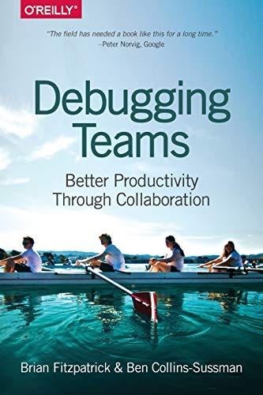](https://www.debuggingteams.com/https://www.debuggingteams.com/)[Debugging Teams](https://www.debuggingteams.com/) by Brian Fitzpatrick & Ben Collins-Sussman

➡️ Read the book for free **[here](https://www.debuggingteams.com/)**.

---

## SPONSOR TECH WORLD WITH MILAN

Get your product in front of **more than 350,000+ tech professionals** who make or influence significant tech decisions. Our readership includes senior engineers and leaders who care about practical tools and services.

Ad space often books up weeks ahead. If you want to secure a spot, **[contact me](https://milan.milanovic.org/#contact)**.

I have free slots **starting on January 9th** and am seeking a **general sponsor to support my work for longer**. Let’s grow together!

[Sponsor Tech World With Milan](https://newsletter.techworld-with-milan.com/p/sponsorship-of-tech-world-with-milan)

---

## More ways I can help you

1. **[LinkedIn Content Creator Masterclass](https://www.patreon.com/techworld_with_milan/shop/short-linkedin-content-creator-311232?utm_medium=clipboard_copy&utm_source=copyLink&utm_campaign=productshare_creator&utm_content=join_link).**In this masterclass, I share my strategies for growing your influence on LinkedIn in the Tech space. You'll learn how to define your target audience, master the LinkedIn algorithm, create impactful content using my writing system, and create a content strategy that drives impressive results.
2. **[Resume Reality Check](https://www.patreon.com/techworld_with_milan/shop/resume-reality-check-311008?source=storefront)**. I can now offer you a service where I’ll review your CV and LinkedIn profile, providing instant, honest feedback from a CTO’s perspective. You’ll discover what stands out, what needs improvement, and how recruiters and engineering managers view your resume at first glance.
3. **[Join my Patreon community](https://www.patreon.com/techworld_with_milan)**: This is your way of supporting me, saying “**thanks**," and getting more benefits. You will get exclusive benefits, including all of my books and templates on Design Patterns, Setting priorities, and more, worth $100, early access to my content, insider news, helpful resources and tools, priority support, and the possibility to influence my work.
4. **1:1 Coaching:** [Book a working session with me](https://newsletter.techworld-with-milan.com/p/coaching-services). 1:1 coaching is available for personal and organizational/team growth topics. I help you become a high-performing leader and engineer 🚀.

---

Thanks for reading Tech World With Milan Newsletter! Subscribe for free to receive new posts and support my work.