# 5 books that changed my engineering career forever

I love books. When I look at the 5000 books on my bookshelf, I see more than paper and ink; I see **a personal board of mentors I never had**. Over the years, as an avid reader, I have found that these books have *quietly* reshaped how I approach coding, leadership, and even thinking itself.

Early in my career, I assumed improving my skills was all about writing more code or learning the latest framework, like everyone else. But the most significant improvements in my growth came from hours spent **flipping pages in some of the best books out there**.

There’s something tactile and deliberate about reading, scribbling notes in the margins, dog-earing pages, that forces me to slow down and reflect.

In this newsletter, I want to share five books that have influenced my journey from engineer to CTO the most. Each of **these books contributed beyond just technical knowledge**; they challenged my assumptions, introduced new mental models, and ultimately changed how I work and lead teams.

[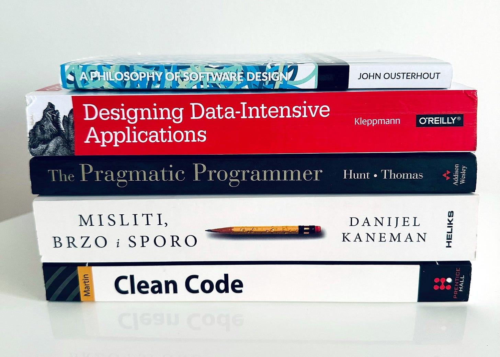](https://substackcdn.com/image/fetch/$s_!TMUC!,f_auto,q_auto:good,fl_progressive:steep/https%3A%2F%2Fsubstack-post-media.s3.amazonaws.com%2Fpublic%2Fimages%2F01c22b39-796c-4ba1-bc45-cf8039816a85_3008x2151.jpeg)Books that improved my life (note: *note all are in the image*)

Here, I’ll explain *why each book mattered to me* and *how it changed my approach* as a technologist and leader, from timeless principles of personal effectiveness to systems architecture.

Together, these books became my off-hours crash course in becoming a better engineer, architect, and decision-maker.

So, let’s dive in.

## 1. **[The Pragmatic Programmer](https://amzn.to/3GZ6u0K)**

**Authors**: *David Thomas, Andrew Hunt*

One book I always recommend to developers is "**[The Pragmatic Programmer](https://amzn.to/3GZ6u0K)**" by David Thomas and Andrew Hunt. Although it is not new, it builds on a foundation that is important today and will remain so.

When it was released in 1999, it was revolutionary for me because it wrote about what makes developers professionals in a highly unregulated profession. When I read it, I understand that.

Here are a few lessons that stayed with me:

1. **Write good enough software**. Striving for perfection can lead to never-ending projects. Instead, aim for "good enough" and iterate quickly. Deliver value early and often (all of this was before Scrum). Write code that works, prove it by writing tests, and ensure they are executed automatically.
2. **Use Tracer bullets**. Use tracer code or prototypes to validate your understanding of a problem. This helps in clarifying requirements before fully implementing a feature. This was all before the MVP approach.
3. **Don’t blame, fix!** Sometimes you will find bad code written by someone else. Sometimes, you will find bad code that you wrote some time ago. Pragmatic programmers don't say, "*I didn't write this, so I will not fix it*," but do something about it and open a team-wide debate about why.
4. **Don’t live with broken windows**. In the book, you will learn about the "*Broken Windows Theory*," which states that if something is broken, others will break it even more in the future. As a pragmatic programmer, you should try to fix all major problems you find in the system while working on it.

[Broken window theory](https://en.wikipedia.org/wiki/Broken_windows_theory) (a term taken from psychology)
5. **Keep your knowledge up to date, always**. Continuous learning is essential. Stay updated with new tools, technologies, and best practices. Learn at least one programming language or tech stack every year. Read technical and non-technical books every once in a while (yes!). This investment in your skills pays off in your career growth.
6. **Be DRY**. Redundant code is more complex to maintain. When you notice duplication, refactor it into a shared function or module. This will promote consistency and reduce errors.

Learn more in the book:

[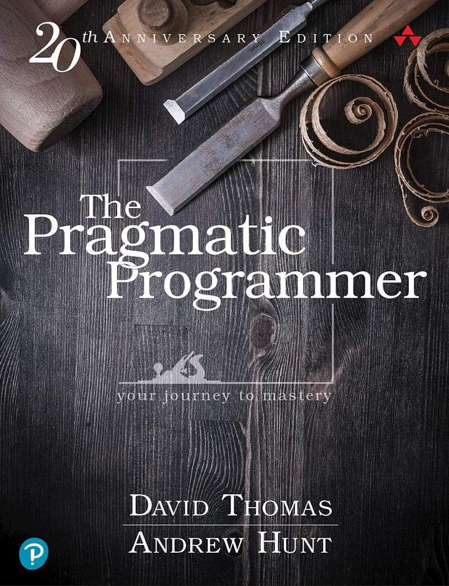](https://amzn.to/3GZ6u0K)“[The Pragmatic Programmer](https://amzn.to/3GZ6u0K)”, 20th anniversary edition, released in 2019.

*The Pragmatic Programmer* taught me that sound engineering isn’t just about writing code that works; it’s about building code that **stays** working, adaptable, and clean for years to come.

Here is **the unified mind map** of the whole book with chapters and tips:

[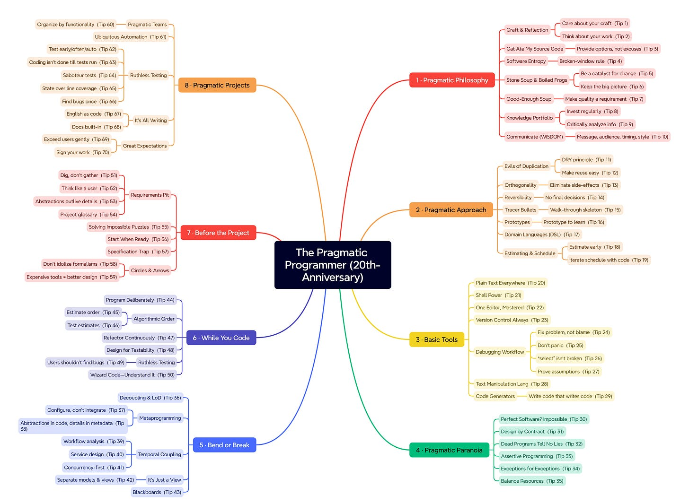](https://substackcdn.com/image/fetch/$s_!lNTh!,f_auto,q_auto:good,fl_progressive:steep/https%3A%2F%2Fsubstack-post-media.s3.amazonaws.com%2Fpublic%2Fimages%2F2b7b226f-7bc5-4a6d-b848-d6d89c3f034d_5682x4160.png)“The Pragmatic Programmer”, the unified mind map

> ℹ️*A similar book to “The Pragmatic Programmer” is “**[Code Complete](https://amzn.to/458Ziag)**”. This book provides similar valuable tips, but is a bit longer and harder to follow.*
> 
> *The third book in this group is “**[The Clean Coder](https://amzn.to/4mkP8dt)**”, a manifesto of professionalism in software development by Robert Martin.*

## 2. [Designing Data-Intensive Applications](https://amzn.to/41bWQ1u)

**Author**: *Martin Kleppman*

Even with two decades in software, I found [Martin Kleppmann](https://martin.kleppmann.com/)’s *Designing Data-Intensive Applications (DDIA)* a humbling and **mind-expanding** read. It’s often dubbed the *encyclopedia of modern data systems*, and for good reason.

Before DDIA, terms like *replication*, *partitioning*, and *CAP theorem* were things I thought I understood. Reading this book (twice) was like getting a masterclass in how data systems work.

The CAP Theorem

We can say that it is one of **the most influential books in backend engineering**, and I can see why.

Here are a few things I learned in the book:

1. One key takeaway was learning to **recognize trade-offs** in any architectural decision. For example, the book discusses how specific databases favor consistency over availability (and vice versa), and how *there’s no free lunch*; you must choose based on your requirements. This helped me understand that there is no single best choice to use for everything. Instead, I started asking “*What problem are we solving, and what trade-off fits best here*?”
2. **Focus on fundamentals**. I also appreciated how DDIA emphasized the fundamentals: storage engines, indexing, and distributed consensus, which remain unchanged even when new products come along. Concretely, after reading, I revisited our data architecture and improved how we handle data replication and consistency in our systems. For instance, we had a microservice that occasionally served stale data under high load. Applying principles from DDIA, we refined our approach to **replication lag and read replicas** to enable the service to scale without sacrificing data freshness.
3. **Evaluating databases**. I also became more rigorous in assessing databases: instead of going by vendor hype, I’d map each option to the use case (does it need transactions? horizontal scaling? etc.). Then, select the proper database type and vendor.
4. **Deep dive into distributed transactions**. Kleppmann’s detailed explanation of concepts such as **distributed transactions and log-based streaming** provided insights into diagnosing system behavior in complex distributed systems.

More than anything, this book taught me to think in terms of *reliability, scalability, and maintainability* as first-class design goals. It shifted my mindset to see system design as about making clear-headed trade-offs, not just following trends.

The result is I now approach new architecture decisions with far more confidence and clarity. DDIA truly “bridged the gap” between what I thought I knew and how things work under the hood.

[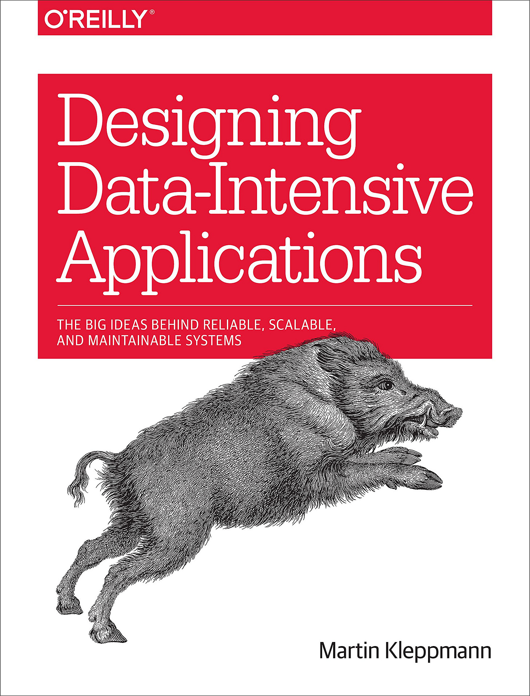](https://amzn.to/41bWQ1u)“[Designing Data-Intensive Applications](https://amzn.to/41bWQ1u)”, Martin Kleppman

It is worth mentioning that DIA isn't light reading; it's 500 pages of dense material. People who should read it include mid-career engineers designing systems and anyone preparing for systems design interviews.

Still, I consider it not suitable for junior developers or those looking for quick tutorials.

Here are my notes from the book:

[Notes](https://milan-milanovic.notion.site/Designing-Data-Intensive-Applications-Notes-by-Dr-Milan-Milanovic-1ac22f7b9a5f80eda8a0ebff46919989) from the book “[Designing Data-Intensive Applications](https://amzn.to/3ZX4uMv)” by [Martin Klepmann](https://martin.kleppmann.com/)

➡️ Read my **full book review**:
[
Tech World With Milan NewsletterWhat I learned from the book Designing Data-Intensive ApplicationsAfter two decades in software engineering, I thought I had a solid understanding of various topics, including NoSQL, Big Data, transactions, sharding, and more…Read more8 months ago · 421 likes · 21 comments · Dr Milan Milanović](https://newsletter.techworld-with-milan.com/p/what-i-learned-from-the-book-designing?utm_source=substack&utm_campaign=post_embed&utm_medium=web)
## 3. **[A Philosophy of Software Design](https://amzn.to/3IwzyK8)**

**Author:** *John Ousterhout*

As an engineer, I’ve seen how **code complexity** can become the silent killer of productivity (and projects). Prof. John Ousterhout’s *[A Philosophy of Software Design](https://amzn.to/3IwzyK8)* gave me a vocabulary and mindset to attack this problem at the source.

The book is relatively short but packed with wisdom on breaking down systems into simpler, more manageable modules and **on designing for readability and maintainability**. Ousterhout defines complexity as anything related to code that makes it harder to modify or reason about, and then systematically shows how to reduce it.

He argues that code should be written for **ease of human reading**, not just for ease of compilation. This gave me a new lens for code reviews. I now ask, *Will someone understand this in a year?* - and if not, we need to simplify.

One of the most powerful concepts I learned was the idea of **“deep modules”**: modules with simple interfaces but rich functionality under the hood (the opposite of Clean Code). If an interface hides a lot of complexity, the module is doing its job well.

[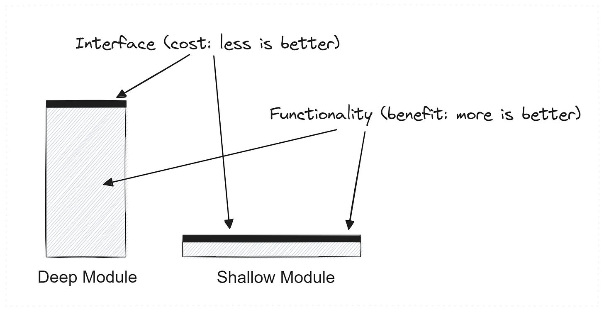](https://substackcdn.com/image/fetch/$s_!VEV5!,f_auto,q_auto:good,fl_progressive:steep/https%3A%2F%2Fsubstack-post-media.s3.amazonaws.com%2Fpublic%2Fimages%2F336838cd-f236-49e4-8883-a0b7801d7bf3_2015x1041.png)

This was eye-opening; it flipped my approach to abstraction. Instead of pushing complexity onto callers (shallow modules), I now try to have more complexity inside modules, exposing only what’s necessary. This concept of **deep vs. shallow modules** fundamentally changed how I structure libraries and services, encouraging me to *invest more effort in designing clean interfaces* up front.

The book also provides a list of ***red flags*** for bad design, things like “classes that are too big” or “primitive obsession,” which I began using as an early warning system in code reviews.

[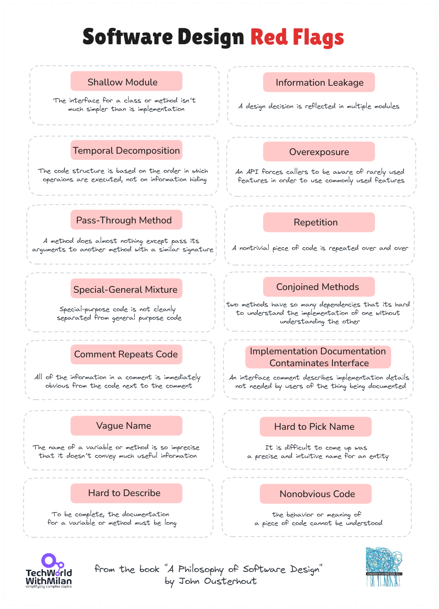](https://substackcdn.com/image/fetch/$s_!uEqg!,f_auto,q_auto:good,fl_progressive:steep/https%3A%2F%2Fsubstack-post-media.s3.amazonaws.com%2Fpublic%2Fimages%2F8f39b0a8-8179-49b7-95fa-9546d3ffa3b4_1293x1791.png)

I remember after reading Ousterhout’s philosophy, I went back to one of our core projects and refactored a tangle of classes into a few modules with clearer APIs. The result was that onboarding new developers became easier, and the number of bugs dropped because the code’s intent was more explicit.

Another quote from the book stayed with me: *“**complexity is incremental**,” creeping in a little at a time* through small decisions. This prompted me to be more vigilant; I now tackle potential complexity at the design stage before it becomes larger.

In short, this book taught me that **working code isn’t enough**; if the code isn’t clean and simple, it’s a liability. That perspective has made me a more pragmatic architect who values quality over quick fixes.

[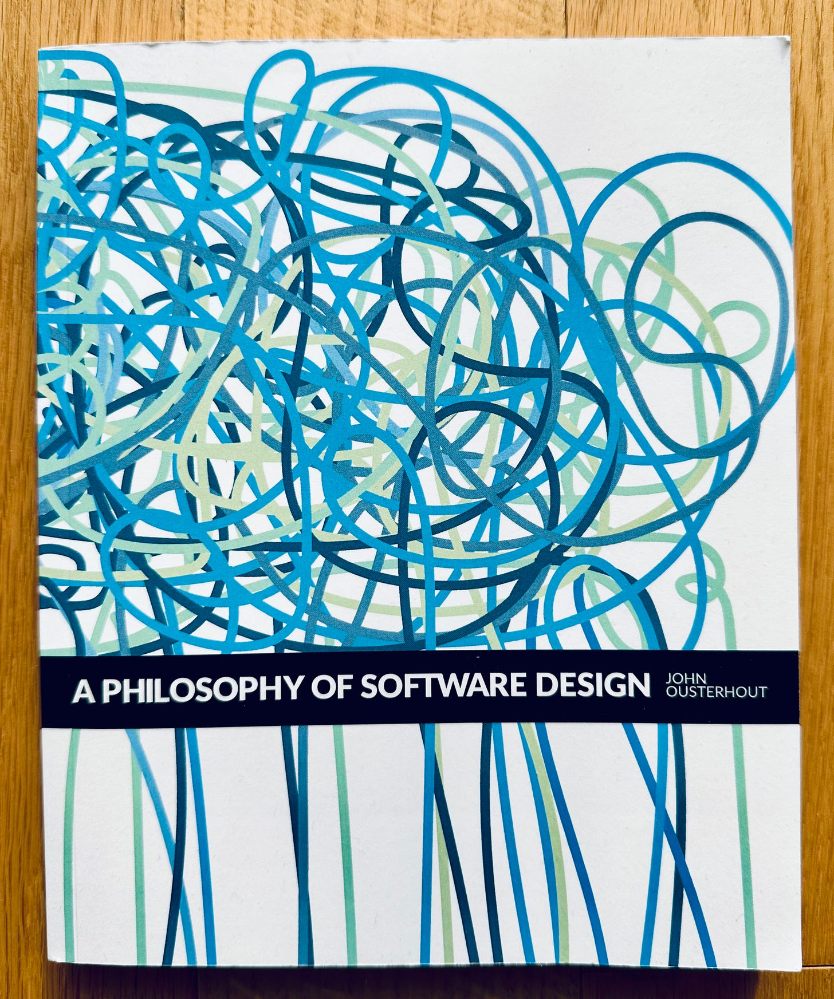](https://substackcdn.com/image/fetch/$s_!MHbe!,f_auto,q_auto:good,fl_progressive:steep/https%3A%2F%2Fsubstack-post-media.s3.amazonaws.com%2Fpublic%2Fimages%2Fbdc5809b-903e-4202-9124-2e189fa85703_1567x1878.png)**“**[A Philosophy of Software Design](https://amzn.to/3IwzyK8)” by John Ousterhout

➡️ Read my **full book review**:
[
Tech World With Milan NewsletterMy learnings from the book "A Philosophy of Software Design"I recently read "A Philosophy of Software Design" 2nd Edition by Prof. John Ousterhout, and this is my review…Read more2 years ago · 48 likes · 1 comment · Dr Milan Milanović](https://newsletter.techworld-with-milan.com/p/my-learnings-from-the-book-a-philosophy?utm_source=substack&utm_campaign=post_embed&utm_medium=web)
## 4. [Thinking, Fast and Slow](https://amzn.to/41e3yUJ)

**Author:** *Daniel Kahneman*

[Daniel Kahneman](https://en.wikipedia.org/wiki/Daniel_Kahneman) showed the world that we don’t think as rationally as we believe, and won a Nobel Prize for that (in behavioral economics).

His book *[Thinking, Fast and Slow](https://amzn.to/41e3yUJ)* turned decades of research into a global bestseller, making his ideas accessible to everyone, not only to scientists.

[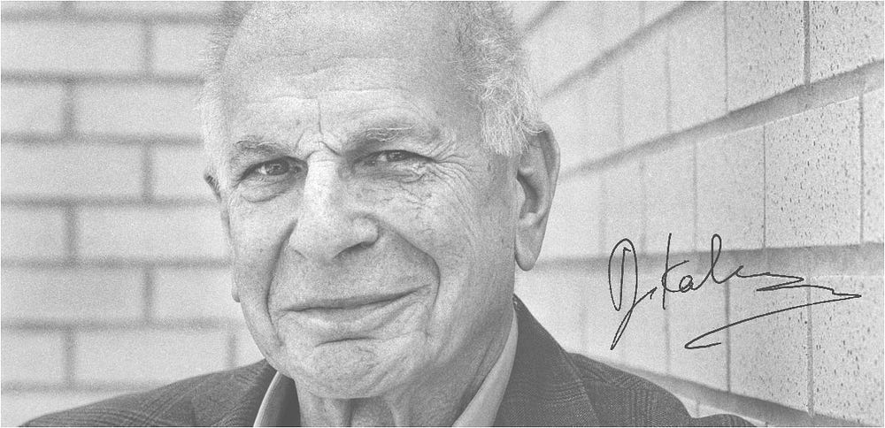](https://substackcdn.com/image/fetch/$s_!JWj7!,f_auto,q_auto:good,fl_progressive:steep/https%3A%2F%2Fsubstack-post-media.s3.amazonaws.com%2Fpublic%2Fimages%2F5024630d-38ef-47e0-bf75-5c9987c63206_1000x484.png)Daniel Kahneman passed away in 2024. (Image: [Kurzweil](https://www.thekurzweillibrary.com/book-thinking-fast-and-slow))

This is one of the books that improved my critical thinking the most. Kahneman’s research focuses on how our minds operate in two modes:

- **System 1 (Fast)**. Intuitive, automatic, emotional, our default setting. We use it for quick judgments and everyday decisions.
- **System 2 (Slow)**. Analytical, effortful, and deliberate, the system we use consciously for critical thinking. We use it for complex problems that require focused effort.

As it turns out, we humans, even the best engineers, are often overconfident in our intuition and routinely trick ourselves without knowing it.

[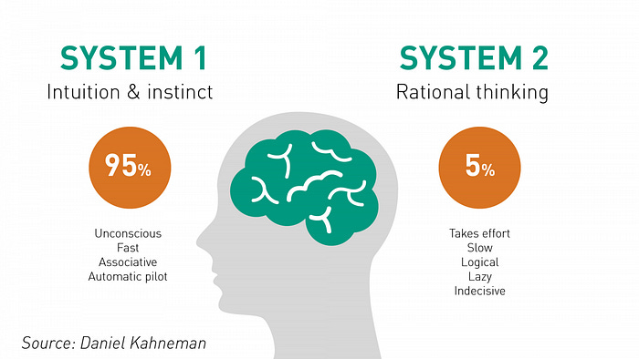](https://substackcdn.com/image/fetch/$s_!gYHY!,f_auto,q_auto:good,fl_progressive:steep/https%3A%2F%2Fsubstack-post-media.s3.amazonaws.com%2Fpublic%2Fimages%2F66958ea8-a436-47cd-9d24-0dac7219f9b3_700x394.png)System 1 and 2 thinking (image: [Roger Leishman](https://www.rogerleishman.com/2017/12/thing1.html))

Reading this book was so revealing for me. I realized that many of the bugs, design flaws, and even management slip-ups in my career boiled down to cognitive biases and snap judgments.

Before, when I was debugging a problem or making a system design decision, I often trusted my gut when choosing a solution. **Afterward, I started forcing myself to slow down.** I’d ask: *What assumption am I making? Could I be jumping to conclusions?*

For example, if an outage happened, instead of immediately blaming the newest deployment (a System 1 reaction), I now methodically gather data and consider multiple hypotheses, a more System 2 approach.

Kahneman also introduced me to ideas like **the anchoring effect** and **confirmation bias**, which made me more willing to question my initial impressions.

One powerful concept that stuck with me was **WYSIATI (What You See Is All There Is)**. It describes how quickly we jump to conclusions, often missing essential facts. “*Information that is not retrieved (even unconsciously) from memory might as well not exist*,” Kahneman states. Our minds search for good stories, yet they show a stubborn resistance to the quality and quantity of objective information that informs those narratives.

[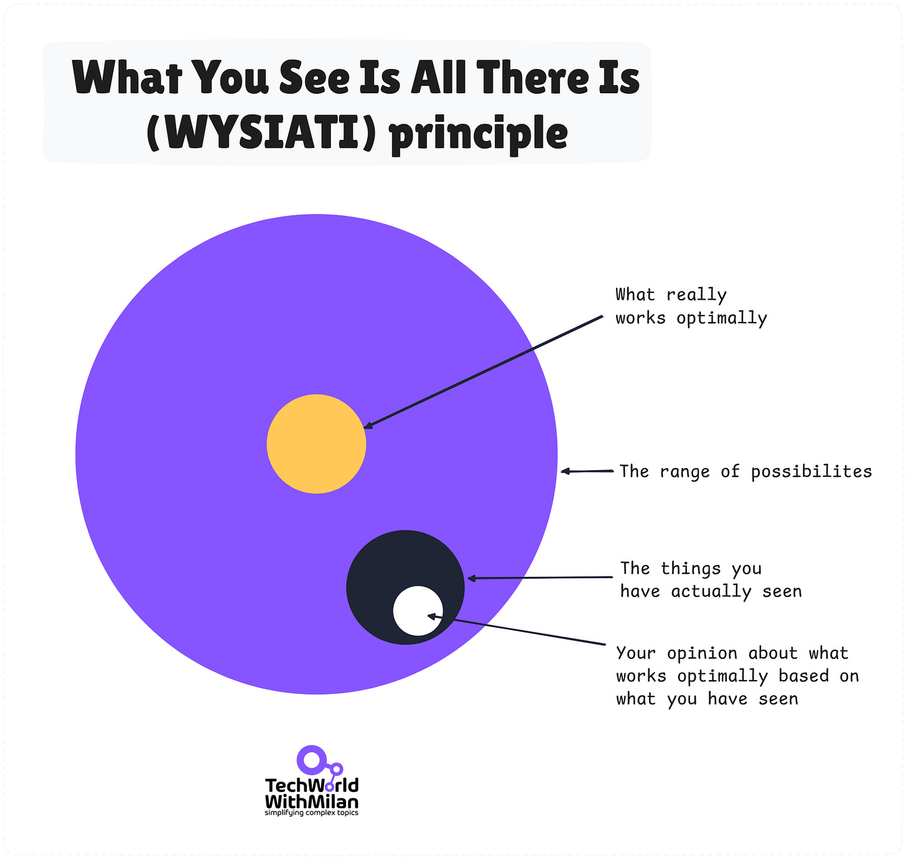](https://substackcdn.com/image/fetch/$s_!E2HR!,f_auto,q_auto:good,fl_progressive:steep/https%3A%2F%2Fsubstack-post-media.s3.amazonaws.com%2Fpublic%2Fimages%2F57a7f2da-b592-4e4a-9f39-c15e6882a111_2063x1956.png)WYSIATI principle from the book  “[Thinking, Fast and Slow](https://amzn.to/41e3yUJ)”

This phenomenon explained many frustrations I had experienced as a leader: why people made wrong (but fast) judgments, ignored contrary evidence, or stubbornly stuck to incomplete stories.

After reading Kahneman, I became intensely aware of how biases influence technical decisions and team dynamics. Perhaps most importantly, it changed **how I interact with my team**. I listen more carefully, and I’m quicker to admit when I might be wrong, echoing Kahneman’s central lesson that *we’re all fallible, and that’s okay*. In meetings, I’ll say, “*This is my intuition speaking, but let’s verify it with data*.”

This book taught me that being a better engineer or CTO isn’t just about what you know; it’s about recognizing your **blind spots**and compensating for them. It’s a mental toolkit that helped me make better decisions.

The book is **an absolute must-read for everyone!**

[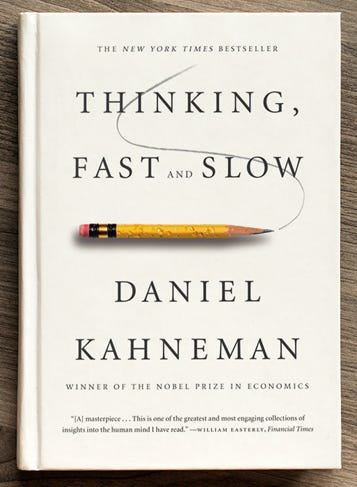](https://amzn.to/41e3yUJ)“[Thinking, Fast and Slow](https://amzn.to/41e3yUJ)”, Daniel Kahneman

➡️ Learn more about **how biases and mental models shape your life** and projects:
[
Tech World With Milan NewsletterHow to make better decisions with Second-Order ThinkingIn the complex software development and management world, the quality of our thinking often determines the success of our projects and teams. Mental models and cognitive biases are crucial in approaching problems, making decisions, and interacting with others…Read morea year ago · 94 likes · 8 comments · Dr Milan Milanović](https://newsletter.techworld-with-milan.com/p/how-to-make-better-decisions-with?utm_source=substack&utm_campaign=post_embed&utm_medium=web)
## 5. [The 7 Habits of Highly Effective People](https://www.amazon.com/Habits-Highly-Effective-People-Powerful/dp/0743269519)

**Author**:*Stephen Covey*

Covey’s book taught me that effective engineering leadership starts with *personal* leadership. It gives a framework of seven habits, from being proactive and **“beginning with the end in mind”** to seeking win-win solutions and sharpening the saw (continuous improvement).

These habits might sound like common sense to most people, but reading this book was a wake-up call for me. Covey challenged me to take responsibility for my growth and to prioritize principles over urgency.

I consider it one of those books **that changed my life and career*****10x*****.**

The concept of the ***Circle of Influence*****vs.*****Circle of Concern*** resonated with me (it originates from [Stoicism](https://en.wikipedia.org/wiki/Stoicism)). I learned to focus my energy on things I can impact (like mastering a new technology or helping a teammate), rather than worrying about external factors I can’t control, e.g., other people's opinions.

3 Circles of Influence (inspired by Stephen Covey)

Another lesson was “**seek first to understand, then to be understood**,” which transformed how I communicate with my team (and listen actively). As Covey famously put it, *“Most people do not listen with the intent to understand; they listen with the intent to reply.”*When I read that line, I had to pause; it rang so true.

How often had I been in code reviews or planning meetings, already formulating my response instead of truly listening? Covey’s message: **slow down and listen first.**

Now, when a teammate comes to me with an issue, **I make a conscious effort to understand their perspective fully before I chime in**. It’s improved trust and clarity in our conversations immensely.

Another habit that resonated with me was **“Sharpen the saw,”** Covey’s way of saying, “invest in yourself continuously.” It reminded me that taking time to read, learn new skills, or even recharge isn’t downtime; it’s an investment in effectiveness. I started blocking out a little time each week for self-improvement (sometimes that means reading a new book or exploring a tech I’m curious about).

It’s ironic, but by stepping away from the day-to-day hustle to *sharpen my saw*, I come back to work sharper and more productive.

After reading Covey, I began weekly **planning with my long-term goals in mind**, ensuring that, even as an engineer buried in code, I never lost sight of broader objectives. And this means creating [proper long-term and short-term goals](https://www.patreon.com/techworld_with_milan/shop/how-to-set-and-achieve-any-goal-e-book-312287).

[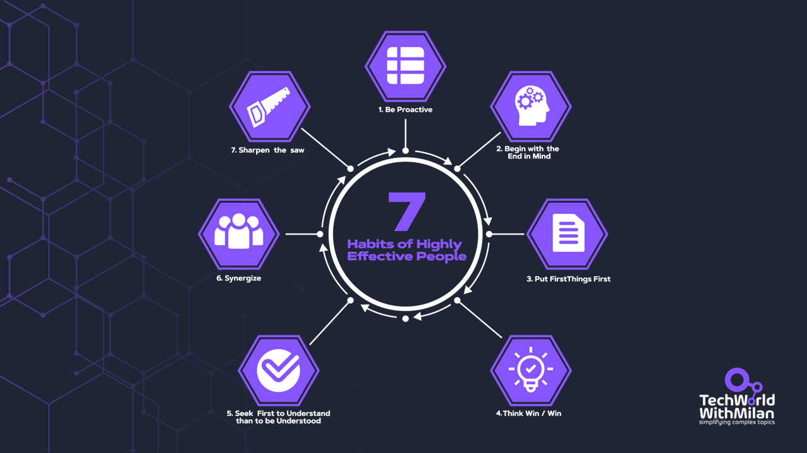](https://substackcdn.com/image/fetch/$s_!1MuY!,f_auto,q_auto:good,fl_progressive:steep/https%3A%2F%2Fsubstack-post-media.s3.amazonaws.com%2Fpublic%2Fimages%2F3fa1d566-aca0-48ef-adf7-5ac0c4eb7d66_1280x720.png)7 Habits of Highly Effective People

This book’s *timeless principles* became **the foundation of how I operate**: it instilled discipline, proactivity, empathy, and a habit of continuous improvement, preparing me for the challenges of CTO life.

This book is like a mirror; it forces you to **reflect on your habits and mindset**. For me, that reflection led to tangible changes in how I lead my engineering team.

[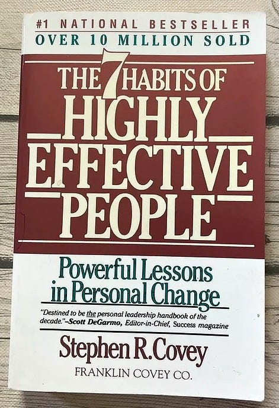](https://substackcdn.com/image/fetch/$s_!QRYb!,f_auto,q_auto:good,fl_progressive:steep/https%3A%2F%2Fsubstack-post-media.s3.amazonaws.com%2Fpublic%2Fimages%2Fbb18f29b-e8f5-4f1e-9e04-631e860022e6_471x688.jpeg)“[The 7 Habits of Highly Effective People](https://www.amazon.com/Habits-Highly-Effective-People-Powerful/dp/0743269519)”, Stephen Covey

➡️ Read my book review, including Covey's book “**[The 8th Habit](https://amzn.to/4l14RO0)**”:
[
Tech World With Milan NewsletterThe habits of highly effective peopleAfter 25 years of dealing with successful people in business, universities, and relationship settings, Stephen R. Covey noticed that great achievers were frequently troubled by emptiness. To comprehend why, he read self-help, self-improvement, and popular psychology books from the past 200 years. Here, he observed a striking historical disparity between…Read more2 years ago · 50 likes · Dr Milan Milanović](https://newsletter.techworld-with-milan.com/p/the-habits-of-highly-effective-people?utm_source=substack&utm_campaign=post_embed&utm_medium=web)
## 6. Conclusion

Writing this, I noticed something: none of these books taught me a new programming language or how to use a specific framework. Yet each one was transformational in my growth as an engineer and a leader.

They expanded my perspective, from how I manage myself, to how I design software, to how I make decisions. Together, these books became a sort of *continuing education curriculum* that no formal degree or job training could offer. They reminded me that our **shelf of books can double as a shelf of mentors**, each one imparting lessons whenever we’re ready to absorb them.

If there’s one thing I hope you take away, it’s that investing in your growth doesn’t always mean writing more code or attending more meetings. Sometimes, it’s reading and reflecting. I often encourage younger engineers to build their own “**mentor bookshelf**” to find books that challenge their thinking.

The five I shared here are just a starting point, and your list might be different. What matters is staying curious and **never thinking you’re done growing**.

As a CTO, I’m still that engineer with a book in hand after work, excited about the next insight that will make me better.

So, what books will you reach for on your journey?

The answers might shape your career in ways you can’t imagine today.

Happy reading, and happy growing!

-- Milan

[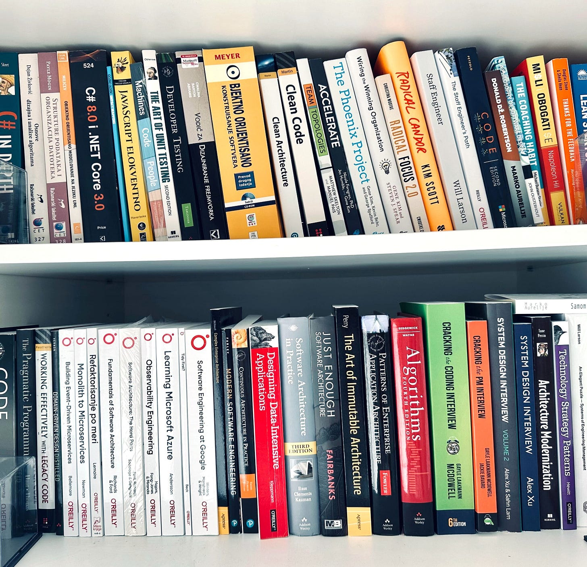](https://substackcdn.com/image/fetch/$s_!ZGsN!,f_auto,q_auto:good,fl_progressive:steep/https%3A%2F%2Fsubstack-post-media.s3.amazonaws.com%2Fpublic%2Fimages%2F5d29e636-2e61-46d0-9e87-b540169abe0c_3063x2959.jpeg)A part of my physical bookshelf (many more on Kindle)

➡️ Check my review of **the best books** I’ve read and recommend to everyone:
[
Tech World With Milan NewsletterLearn things that don't change Have you ever wondered why some technologies are still around, and some have disappeared? The Lindy effect tells me developers will still use C# and SQL when I retire. This concept in technology and innovation suggests that the future life expectancy of a non-perishable item is proportional to its current age. In other words…Read more2 years ago · 1059 likes · 23 comments · Dr Milan Milanović](https://newsletter.techworld-with-milan.com/p/learn-things-that-dont-change?utm_source=substack&utm_campaign=post_embed&utm_medium=web)
---

## Honorable mentions

If you're interested in expanding your perspective on how systems work and how to make good decisions, I highly recommend the following two books:

### **1. [Thinking in Systems](https://amzn.to/4fgm1pD)**

**Author:** *Donella Meadows*

I learned from the book that structure drives behavior, which is something most people don't see.

When sales drop, teams add features. Systems thinkers ask: What structure created this decline? Maybe the real problem is customer onboarding, not the product itself.

The book teaches you to spot feedback loops everywhere. Once you see them, you stop fixing symptoms and start fixing causes.

Learn to change the system, not the output.

### 2. [Algorithms to live by](https://amzn.to/4ofUKro)

**Authors:** *Brian Christian and Tom Griffiths*

This book applies computer science principles to everyday life. It shows how algorithms can optimize your personal and professional challenges, from decision-making to scheduling.

You will learn more about algorithms such as optimal stopping, explore-exploit trade-offs, and caching, and gain actionable advice for managing time, resources, and uncertainty.

What is the best hiring strategy? Look at the first 37% of candidates, then hire the next one who beats them all.

The "optimal stopping" rule applies everywhere: house hunting, dating, even picking a parking spot. And we already have this solved by computer science.

I learn from the book that algorithms aren't just for code; they're patterns for better everyday decisions.

[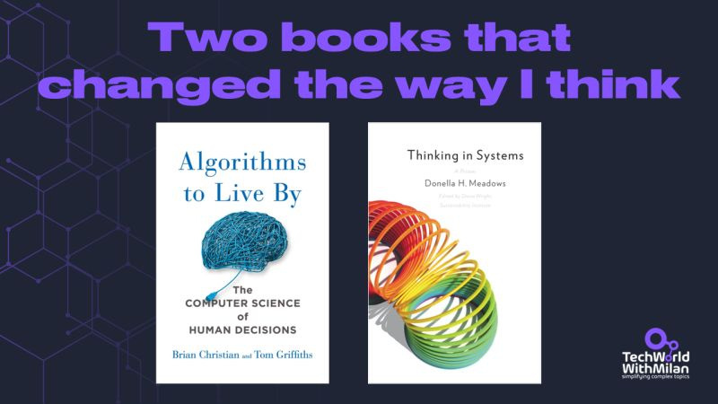](https://substackcdn.com/image/fetch/$s_!Y-zl!,f_auto,q_auto:good,fl_progressive:steep/https%3A%2F%2Fsubstack-post-media.s3.amazonaws.com%2Fpublic%2Fimages%2F1909385c-5f8a-4d3f-ae6a-c792488ee1bf_800x450.jpeg)Two books that changed the way I think

Both books are packed with insights that resonate far beyond their topics.

I highly recommend it for engineers, managers, and anyone curious about improving their thinking.

---

## Bonus: 100+ books that changed my life

Do you want to learn more from my journey with thousands of books? I prepared something special for you.

Here is the mini‑book, where you’ll find one‑page briefs on the 100 best books, organized by craft (architecture, leadership, productivity, thinking, wealth, and more), taken from my notes.

Each brief tags **Why it mattered** and **How I used it**, so you see the principle and the practice side‑by‑side.

I layered personal margin notes throughout, detailing what I challenged, where I failed, and the tweaks that ultimately worked.

You’ll also receive a bonus section, **my four-step method for reading** non-fiction so the ideas stick and compound (hint: it starts before you open the cover).

[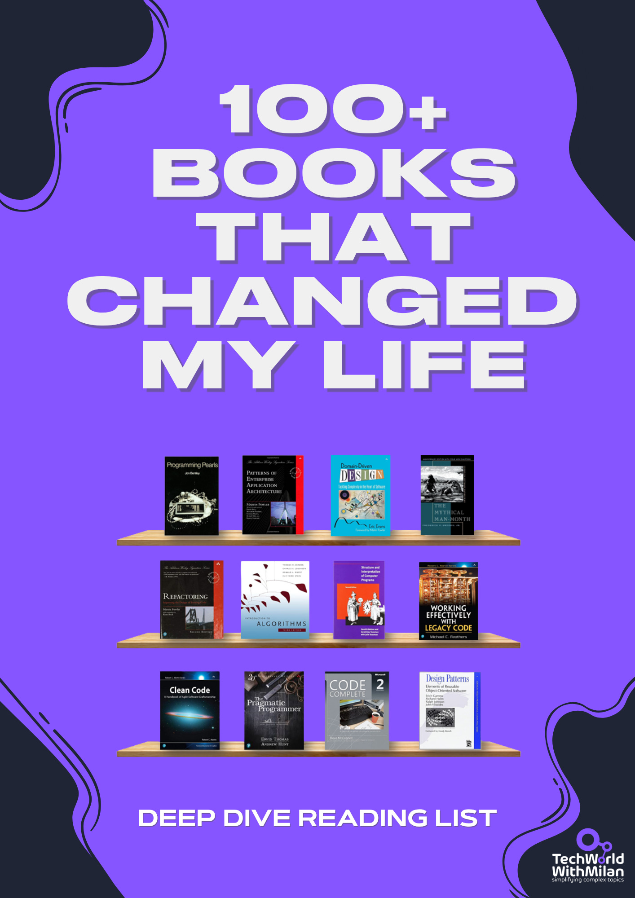](https://substackcdn.com/image/fetch/$s_!m9lI!,f_auto,q_auto:good,fl_progressive:steep/https%3A%2F%2Fsubstack-post-media.s3.amazonaws.com%2Fpublic%2Fimages%2F650954c2-bc89-4d13-8048-2b13d6f6bb1a_1414x2000.png)

➡️ Get the book by **subscribing to my newsletter**:

---

## **More ways I can help you:**

- [📚](https://www.patreon.com/techworld_with_milan/shop/ultimate-net-bundle-for-2025-1519389?utm_medium=clipboard_copy&utm_source=copyLink&utm_campaign=productshare_creator&utm_content=join_link)**[The Ultimate .NET Bundle 2025](https://www.patreon.com/techworld_with_milan/shop/ultimate-net-bundle-for-2025-1519389?utm_medium=clipboard_copy&utm_source=copyLink&utm_campaign=productshare_creator&utm_content=join_link)** 🆕. 500+ pages distilled from 30 real projects show you how to own modern C#, ASP.NET Core, patterns, and the whole .NET ecosystem. You also get 200+ interview Q&As, a C# cheat sheet, and bonus guides on middleware and best practices to improve your career and land new .NET roles. **[Join 1,000+ engineers](https://www.patreon.com/techworld_with_milan/shop/ultimate-net-bundle-for-2025-1519389?utm_medium=clipboard_copy&utm_source=copyLink&utm_campaign=productshare_creator&utm_content=join_link)**.
- [📦](https://www.patreon.com/techworld_with_milan/shop/premium-resume-package-1721454?utm_medium=clipboard_copy&utm_source=copyLink&utm_campaign=productshare_creator&utm_content=join_link)**[Premium Resume Package](https://www.patreon.com/techworld_with_milan/shop/premium-resume-package-1721454?utm_medium=clipboard_copy&utm_source=copyLink&utm_campaign=productshare_creator&utm_content=join_link) 🆕**. Built from over 300 interviews, this system enables you to quickly and efficiently craft a clear, job-ready resume. You get ATS-friendly templates (summary, project-based, and more), a cover letter, AI prompts, and bonus guides on writing resumes and prepping LinkedIn. **[Join 500+ people](https://www.patreon.com/techworld_with_milan/shop/premium-resume-package-1721454?utm_medium=clipboard_copy&utm_source=copyLink&utm_campaign=productshare_creator&utm_content=join_link)**.
- [📄](https://www.patreon.com/techworld_with_milan/shop/complete-tech-resume-reality-check-311008?utm_medium=clipboard_copy&utm_source=copyLink&utm_campaign=productshare_creator&utm_content=join_link)**[Resume Reality Check](https://www.patreon.com/techworld_with_milan/shop/complete-tech-resume-reality-check-311008?utm_medium=clipboard_copy&utm_source=copyLink&utm_campaign=productshare_creator&utm_content=join_link)**. Get a CTO-level teardown of your CV and LinkedIn profile. I flag what stands out, fix what drags, and show you how hiring managers judge you in 30 seconds. **[Join 100+ people](https://www.patreon.com/techworld_with_milan/shop/complete-tech-resume-reality-check-311008?utm_medium=clipboard_copy&utm_source=copyLink&utm_campaign=productshare_creator&utm_content=join_link)**.
- [📢](https://www.patreon.com/techworld_with_milan/shop/short-linkedin-content-creator-311232?utm_medium=clipboard_copy&utm_source=copyLink&utm_campaign=productshare_creator&utm_content=join_link)**[LinkedIn Content Creator Masterclass](https://www.patreon.com/techworld_with_milan/shop/short-linkedin-content-creator-311232?utm_medium=clipboard_copy&utm_source=copyLink&utm_campaign=productshare_creator&utm_content=join_link)**. I share the system that grew my tech following to over 100,000 in 6 months (now over 255,000), covering audience targeting, algorithm triggers, and a repeatable writing framework. Leave with a 90-day content plan that turns expertise into daily growth. **[Join 1,000+ creators](https://www.patreon.com/techworld_with_milan/shop/short-linkedin-content-creator-311232?utm_medium=clipboard_copy&utm_source=copyLink&utm_campaign=productshare_creator&utm_content=join_link)**.
- [✨](https://www.patreon.com/c/techworld_with_milan)**[Join My Patreon](https://www.patreon.com/c/techworld_with_milan)**[https://www.patreon.com/c/techworld_with_milan](https://www.patreon.com/c/techworld_with_milan)**[Community](https://www.patreon.com/c/techworld_with_milan) and [My Shop](https://www.patreon.com/c/techworld_with_milan/shop)**. Unlock every book, template, and future drop, plus early access, behind-the-scenes notes, and priority requests. Your support enables me to continue writing in-depth articles at no cost. **[Join 2,000+ insiders](https://www.patreon.com/c/techworld_with_milan)**.
- [🤝](https://newsletter.techworld-with-milan.com/p/coaching-services)**[1:1 Coaching](https://newsletter.techworld-with-milan.com/p/coaching-services)** – Book a focused session to crush your biggest engineering or leadership roadblock. I’ll map next steps, share battle-tested playbooks, and hold you accountable. **[Join 100+ coachees](https://newsletter.techworld-with-milan.com/p/coaching-services)**.

---

## **Want to advertise in Tech World With Milan? 📰**

If your company is interested in reaching founders, executives, and decision-makers, you may want to **[consider advertising with us](https://newsletter.techworld-with-milan.com/p/sponsorship-of-tech-world-with-milan)**.

---

## **Love Tech World With Milan Newsletter? Tell your friends and get rewards.**

Share it with your friends by using the button below to get benefits (my books and resources).

[Share Tech World With Milan Newsletter](https://newsletter.techworld-with-milan.com/?utm_source=substack&utm_medium=email&utm_content=share&action=share)

[Track your referrals here](https://newsletter.techworld-with-milan.com/leaderboard).