# 70% Of Developers Adopt AI, Stack Overflow Survey 2023 Reveals

*While Rust is the most admired programming language.*

The results of the **[Stack Overflow Developer Survey 2023](https://survey.stackoverflow.co/2023/)**have been released. Over 90,000 developers from 185 countries were polled for the global survey on their education, income, working styles, and favorite and least favorite technologies.

And here are the main insights:

## Developer Profile

A degree remains a common path to becoming a professional developer, **with 75% of respondents obtaining one**. However, many developers need a degree to enter the field. Most experienced developers hold a **Bachelor’s degree (47%) or a Master’s (26%)**. As for those currently learning to code, a significant portion falls within the 18-24 age group.

[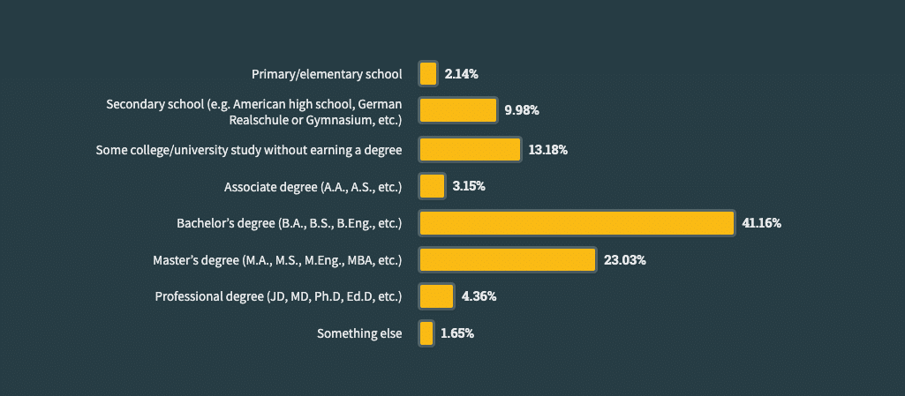](https://substackcdn.com/image/fetch/$s_!wgU1!,f_auto,q_auto:good,fl_progressive:steep/https%3A%2F%2Fsubstack-post-media.s3.amazonaws.com%2Fpublic%2Fimages%2F59b01b6a-7cfd-49d1-8b6a-118eb3c7a537_1025x449.png)[Developer education](http://Developer education)

Most developers **learn from online resources**. This increased from 70 to 80% since the 2022 survey. The age group of respondents who use online learning materials (such as blogs, forums, and videos) **the most** **is 18 and younger**. The largest age group of respondents, aged 25 to 34, reported learning from online courses or certifications (52%). However, they still preferred **traditional education (55%)**.

[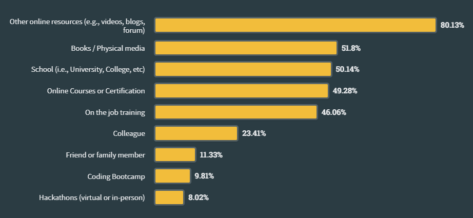](https://substackcdn.com/image/fetch/$s_!lC3l!,f_auto,q_auto:good,fl_progressive:steep/https%3A%2F%2Fsubstack-post-media.s3.amazonaws.com%2Fpublic%2Fimages%2F770b08a3-d29e-4552-a44c-55c545c1434e_922x425.png)[Learning how to code](https://survey.stackoverflow.co/2023/#section-learning-to-code-learning-how-to-code)

The most well-liked platform for taking online coding classes and earning certifications continues to be **Udemy**.

[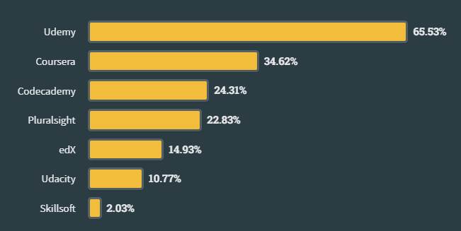](https://substackcdn.com/image/fetch/$s_!E17f!,f_auto,q_auto:good,fl_progressive:steep/https%3A%2F%2Fsubstack-post-media.s3.amazonaws.com%2Fpublic%2Fimages%2F6f25aaae-8ab0-4c91-a797-803b61f5f628_651x327.png)[Online course platforms to learn how to code](https://survey.stackoverflow.co/2023/#section-learning-to-code-online-course-platforms-to-learn-how-to-code)

For books, check my recommendations.
[
Tech World With Milan NewsletterBooks Every Software Engineer Must Read in 2023.You probably already noticed that I'm a big fan of reading. I usually read 3-4 books per month. You can learn from knowledgeable people in two ways: to work directly with them or to read what they have written. The first is the best option, yet it is often impossible. We have books written by people who are the best at this in the world at the time of w…Read more3 years ago · 40 likes · 4 comments · Dr. Milan Milanović](https://newsletter.techworld-with-milan.com/p/books-every-software-engineer-must?utm_source=substack&utm_campaign=post_embed&utm_medium=web)
Regarding years of coding, **48% of respondents have been coding for less than ten years**.

[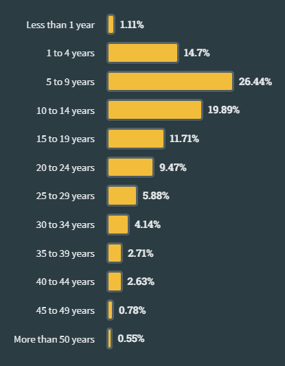](https://substackcdn.com/image/fetch/$s_!FCtm!,f_auto,q_auto:good,fl_progressive:steep/https%3A%2F%2Fsubstack-post-media.s3.amazonaws.com%2Fpublic%2Fimages%2F7009c519-0a4f-4cbe-9e73-158adb7ae8a1_415x533.png)[Years of coding](https://survey.stackoverflow.co/2023/#section-experience-years-coding)

Most responses are still **full-stack, back-end, front-end, and desktop/enterprise app developers**. For the first time this year, they surveyed developers and found that almost.3% of them identify as **developer advocates**.

[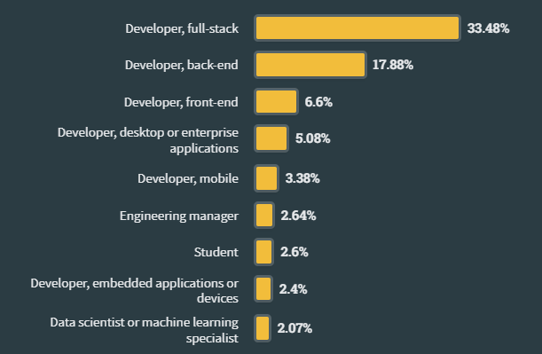](https://substackcdn.com/image/fetch/$s_!pmNy!,f_auto,q_auto:good,fl_progressive:steep/https%3A%2F%2Fsubstack-post-media.s3.amazonaws.com%2Fpublic%2Fimages%2Fa7763287-24bf-4e09-965d-8ab616252c31_611x399.png)[Developer type](https://survey.stackoverflow.co/2023/#section-developer-roles-developer-type)

## Technology

For the eleventh year, **JavaScript will continue to be the most widely used programming language in 2023**. As the third most popular language, **Python**has surpassed **SQL**, but it ranks top among "Other Coders," or programmers who are not programmers or developers in the traditional sense.

Regarding the most admired and desired technologies, **Rust** is the most admired language (especially from [embedded software](https://tweedegolf.nl/en/blog/96/why-rust-is-a-great-fit-for-embedded-software-2023-update)); more than 80% of developers want to use it again next year. PostgreSQL**, Redis, and Datomic** are the most admired databases.

[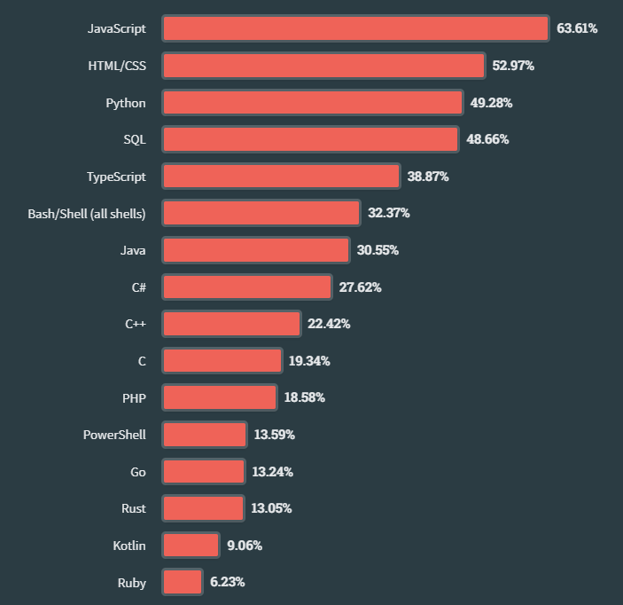](https://substackcdn.com/image/fetch/$s_!YDZT!,f_auto,q_auto:good,fl_progressive:steep/https%3A%2F%2Fsubstack-post-media.s3.amazonaws.com%2Fpublic%2Fimages%2Fcb88f3d3-ba71-42af-bc99-991df525b849_703x682.png)[Most popular programming languages](https://survey.stackoverflow.co/2023/#section-most-popular-technologies-programming-scripting-and-markup-languages)

Regarding the databases,**MySQL lost out to PostgreSQL for the top rank**. Professional developers are more likely to use PostgreSQL (50%) than those learning to code, whereas those learning are more likely to use MySQL (54%).

[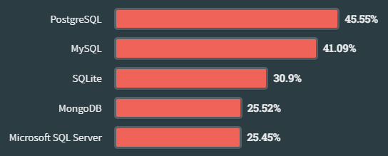](https://substackcdn.com/image/fetch/$s_!4FhA!,f_auto,q_auto:good,fl_progressive:steep/https%3A%2F%2Fsubstack-post-media.s3.amazonaws.com%2Fpublic%2Fimages%2F588047da-fd9f-41e6-bbe3-7e22079e9814_544x219.png)[Databases](https://survey.stackoverflow.co/2023/#section-most-popular-technologies-databases)

When it comes to **cloud platforms**, for all respondents, **AWS is still the most popular cloud computing platform**, while **Hetzner**, a German company, earned high admiration. Together with Vercel, Cloudflare, and Fly.io, i**t was more admired than AWS and other platforms**. **Heroku**experienced a significant decline in popularity.

[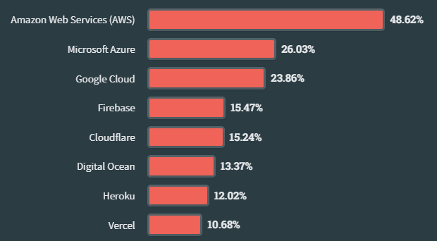](https://substackcdn.com/image/fetch/$s_!-oZO!,f_auto,q_auto:good,fl_progressive:steep/https%3A%2F%2Fsubstack-post-media.s3.amazonaws.com%2Fpublic%2Fimages%2Fb61bc738-b766-4f3c-a804-d7f566c7310d_620x342.png)[Cloud platforms](https://survey.stackoverflow.co/2023/#section-most-popular-technologies-cloud-platforms)

**Node.js and React.js** are the two most common web technologies all respondents use. **Next.js** moved from 11th place in 2022 to 6th this year, likely driven by its popularity with those learning to code.

Also, more developers will choose to work with **Phoenix**again than those who have utilized the three most popular web technologies, React, Node.js, and Next.js. **Phoenix**is the most admired web framework and technology, followed by **Svelte**.

[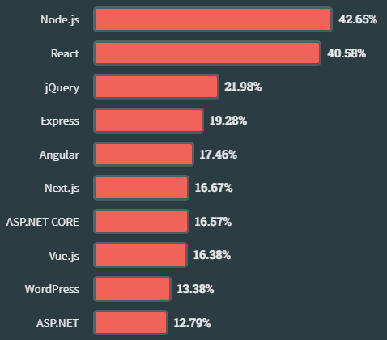](https://substackcdn.com/image/fetch/$s_!zIgW!,f_auto,q_auto:good,fl_progressive:steep/https%3A%2F%2Fsubstack-post-media.s3.amazonaws.com%2Fpublic%2Fimages%2F317d2e72-ddbb-435a-ba44-4c29c897e951_478x420.png)Web frameworks

When it comes to the **other frameworks, .NET (5+) is the most popular and admired**, followed by NumPy and Pandas. .NET Framework (1.0-4.8) is in fourth place, but if we added the .NET (5), overall, it would be the most popular other framework by far. **Tauri**is the most desired one.

[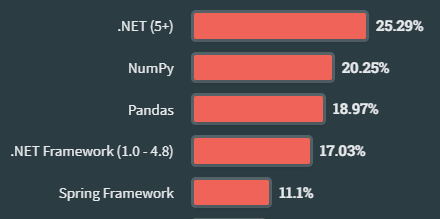](https://substackcdn.com/image/fetch/$s_!hnyH!,f_auto,q_auto:good,fl_progressive:steep/https%3A%2F%2Fsubstack-post-media.s3.amazonaws.com%2Fpublic%2Fimages%2Fa066b0ff-a4c3-4c94-aaf8-03e81687ede6_440x219.png)[Other frameworks](http://Other frameworks)

Since last year, **Docker has risen from second place to the top-used other tool**among all respondents (53%) this year. Those learning to code are more likely to use **npm or pip** (50% and 37%, respectively, vs. 26%) than Docker. Both are used alongside popular student languages (Python and JavaScript). **Cargo**is the most desired one.

[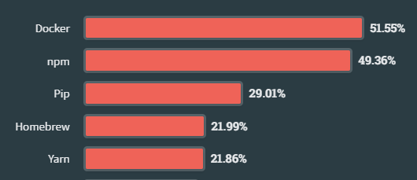](https://substackcdn.com/image/fetch/$s_!lSoP!,f_auto,q_auto:good,fl_progressive:steep/https%3A%2F%2Fsubstack-post-media.s3.amazonaws.com%2Fpublic%2Fimages%2F96f5f1a6-bc44-4618-9a5c-172e0ca4e509_530x229.png)[Other tools](http://Top Paying Technologies)

All developers favor **Visual Studio Code as their favorite IDE**, with learner developers using it more frequently than professional developers (78% vs. 74%, respectively), while **Neovim**is the most desired.

[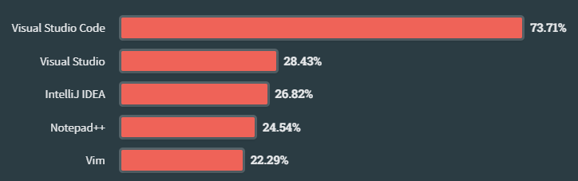](https://substackcdn.com/image/fetch/$s_!ZINg!,f_auto,q_auto:good,fl_progressive:steep/https%3A%2F%2Fsubstack-post-media.s3.amazonaws.com%2Fpublic%2Fimages%2Fbead85db-853d-4661-b5c4-94e828ad9bd7_724x227.png)[Most popular IDE](http://Top Paying Technologies)

Most Professional Developers claim that their company offers **CI/CD, automated testing, and DevOps**. Developers report using observability tools rather than a developer portal to find tools and services more easily (39% vs. 37%).

[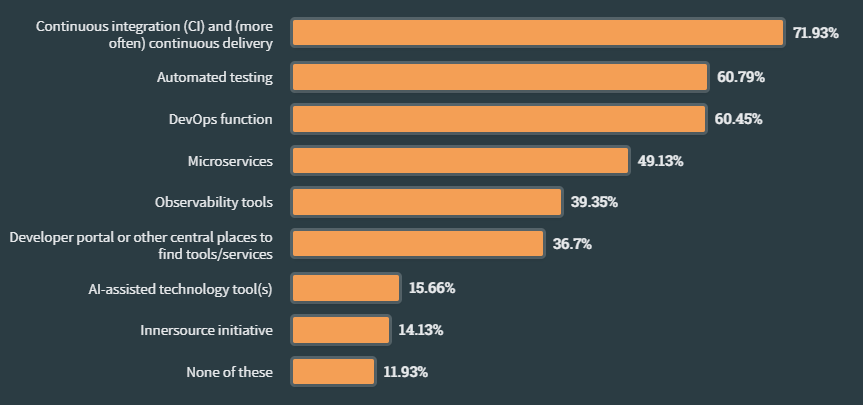](https://substackcdn.com/image/fetch/$s_!F7Bn!,f_auto,q_auto:good,fl_progressive:steep/https%3A%2F%2Fsubstack-post-media.s3.amazonaws.com%2Fpublic%2Fimages%2F93744d17-e824-4dd1-9544-cbd927a51d1a_863x405.png)[Developer Experience](https://survey.stackoverflow.co/2023/#section-developer-experience-developer-experience-processes-tools-and-programs-within-an-organization)

For **documentation**, developers mostly use **Jira and Confluence**, while **markdown**file is in third place (26%). Developers use mostly **Teams, Slack, and Zoom** for communication.

## Salaries and Work Conditions

Among the niche languages, **ZIG, Erlang, and F#** stood out as the highest-paid. Zig took first place with an annual salary of $103,611, Erlang with $99,492, and F# worth $99,311. **Ruby**surprisingly claimed the title of the highest-paid language, with $98.522. Most languages experienced **salary increases of 10%** or more from the previous year.

[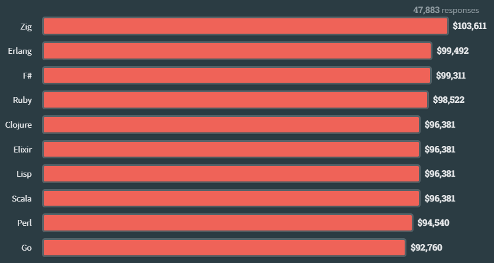](https://substackcdn.com/image/fetch/$s_!O9cP!,f_auto,q_auto:good,fl_progressive:steep/https%3A%2F%2Fsubstack-post-media.s3.amazonaws.com%2Fpublic%2Fimages%2F83028cd4-a962-418e-b3dc-be284e3c9e1f_835x445.png)[Top Paying Technologies](http://Top Paying Technologies)

The number of "**Independent contractor, freelancer, or self-employed**" respondents *increased slightly* for all respondents this year compared to last year, while the percentage of full-time students decreased somewhat (1%). Other job statuses changed less significantly.

[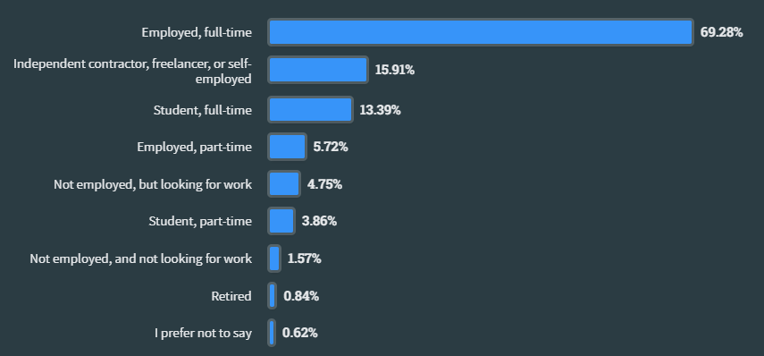](https://substackcdn.com/image/fetch/$s_!6n40!,f_auto,q_auto:good,fl_progressive:steep/https%3A%2F%2Fsubstack-post-media.s3.amazonaws.com%2Fpublic%2Fimages%2Fb3acf3b3-8691-45c0-a9a1-3c0ea1369531_855x398.png)[Employment status](https://survey.stackoverflow.co/2023/#section-employment-employment-status)

For larger firms, **hybrid is here to stay**; more than half of employees in organizations with 5,000+ employees are hybrid. One out of every five firms with fewer than 20 employees reports conducting business in person. **Developers are working on-site this year (+2%) more than last year**. Leaving aside initiatives to return to the office, coding lends itself well to entirely remote work, and at least one-third of all organization sizes still utilize this model.

[Work environment](https://survey.stackoverflow.co/2023/#work-environment)

Most **Professional Developers (70% of them) code as a hobby outside of work**, while 37% do it for self-paced online learning or professional development.

[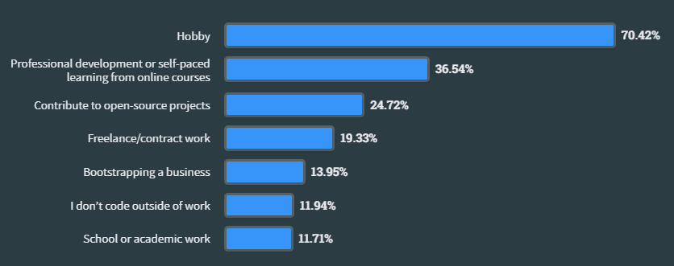](https://substackcdn.com/image/fetch/$s_!BqFJ!,f_auto,q_auto:good,fl_progressive:steep/https%3A%2F%2Fsubstack-post-media.s3.amazonaws.com%2Fpublic%2Fimages%2F5150b738-8826-4958-a811-5ea6f1d4d422_836x331.png)[Coding outside of work](https://survey.stackoverflow.co/2023/#coding-outside-of-work)

## AI

Regarding the **AI development tools**. With 55% of respondents using it the previous year, **GitHub Copilot** is the most popular AI developer tool overall, more than four times as popular as **Tabnine**, which came in second place with 13%.

Nearly**70% of all respondents were already using or were planning to use AI tools** in their development processes this year. However, 30% of developers plan to abstain from using AI in their work, as most of the developers don’t trust highly the accuracy of the AI output. The top selection for **AI search tools was ChatGPT, followed by Bing AI**.

[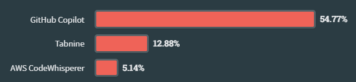](https://substackcdn.com/image/fetch/$s_!j_1b!,f_auto,q_auto:good,fl_progressive:steep/https%3A%2F%2Fsubstack-post-media.s3.amazonaws.com%2Fpublic%2Fimages%2Fc4009ee5-1ff0-4aa4-b7e4-26532382fe97_610x141.png)[AI Developer tools](https://survey.stackoverflow.co/2023/#section-most-popular-technologies-ai-developer-tools)

Most people presently using AI tools claim benefits from **writing code**, but those not interested in utilizing AI tools find this to be the least advantageous.

[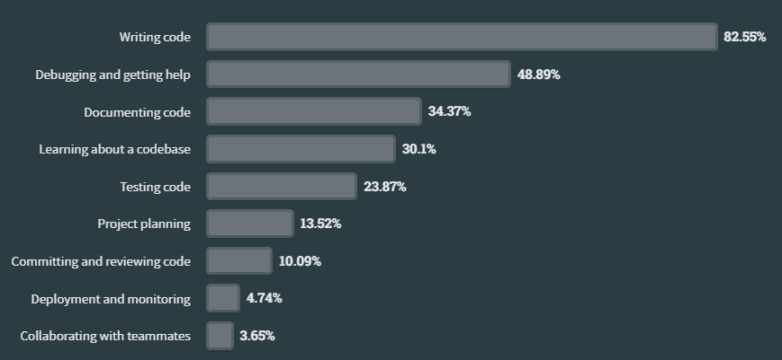](https://substackcdn.com/image/fetch/$s_!5vLo!,f_auto,q_auto:good,fl_progressive:steep/https%3A%2F%2Fsubstack-post-media.s3.amazonaws.com%2Fpublic%2Fimages%2F9466d191-e492-4836-854c-aae546d3420c_869x401.png)[AI in the development workflow](https://survey.stackoverflow.co/2023/#ai-in-the-development-workflow)

---

The 🔥**[Future Data Driven Summit](https://datadrivencommunity.com/FutureDataDriven2023.html)** is back for its third year, and it’s bigger than ever with ✔5 Tracks! ✔10 hours! ✔53 speakers! 👉Don’t miss this opportunity to network, learn, and discover new ways to harness the power of data for your needs from industry leaders and experts as they share their insights on the latest trends and innovations.

---

Thanks for reading Tech World With Milan Newsletter! Subscribe for free to receive new posts and support my work.