# Advanced Document Processing using AI

The trucking industry processes millions of rate confirmations daily, critical documents that lock in freight rates between shippers, brokers, and carriers. These documents arrive in numerous formats, ranging from professional PDFs to scanned faxes, each requiring rapid processing to keep freight moving. The manual handling of this volume creates bottlenecks that are difficult to rectify.

**[Trucking Hub](https://www.truckinghub.com/)** tackled the challenge with **DocuSense**™, our GenAI-driven intelligent document processing platform. In just a few months, we’ve successfully processed over 100,000 documents with unprecedented accuracy and speed, setting a new standard for document automation in logistics.

In this article, we will talk particularly about:

1. **The Rate confirmation problem.** Manual processing breaks down when freight volumes explode and document formats vary wildly across thousands of brokers.
2. **Understanding the workflow.** Rate confirmations are sent via email attachments, broker portals, fax-to-email systems, and mobile uploads. Each channel creates unique processing challenges, from multiple attachments to poor image quality.
3. **Business and technical hurdles.** High manual costs and error-prone data entry drain resources. Technically, we face diverse document formats, including scanned versus digital PDFs, which require different approaches, as well as complex multi-field extraction at scale. Performance demands near real-time processing without sacrificing accuracy.
4. **Architecture principles.** We built for accuracy, scalability, and flexibility with a modular pipeline. The system adapts to new document types through configuration changes, not code rewrites. Core design separates ingestion, OCR, AI understanding, and post-processing into independent, scalable components.
5. **Azure AI implementation.** Direct OpenAI SDK integration gives us precise control over model interactions and error handling. We enforce structured JSON responses, externalize prompts for rapid iteration, and track performance metrics across the entire pipeline.
6. **Production results.** 90% accuracy, 70% faster processing, 2x reduction in manual work. We’ve processed over 100,000 documents, achieving 25-30% cost savings and seamless scaling to new broker formats.

So, let’s dive in.

---

## [Control AI agents with conversation modeling, not prompt engineering (Sponsored)](https://www.parlant.io/?utm_source=creators&utm_campaign=milan)

*Most developers attempt to control AI agents by crafting more effective prompts. It doesn’t scale. Add more rules, and the model forgets earlier ones. Add complexity, and behavior becomes unpredictable.

**[Parlant](https://www.parlant.io/?utm_source=creators&utm_campaign=milan)** takes a different approach: it defines journeys, guidelines, and tools in natural language and dynamically manages context, ensuring your agent knows exactly which rules apply at each conversation point. Think declarative conversation modeling instead of wrestling with prompts.*

*Already running in production for financial services and healthcare.*

[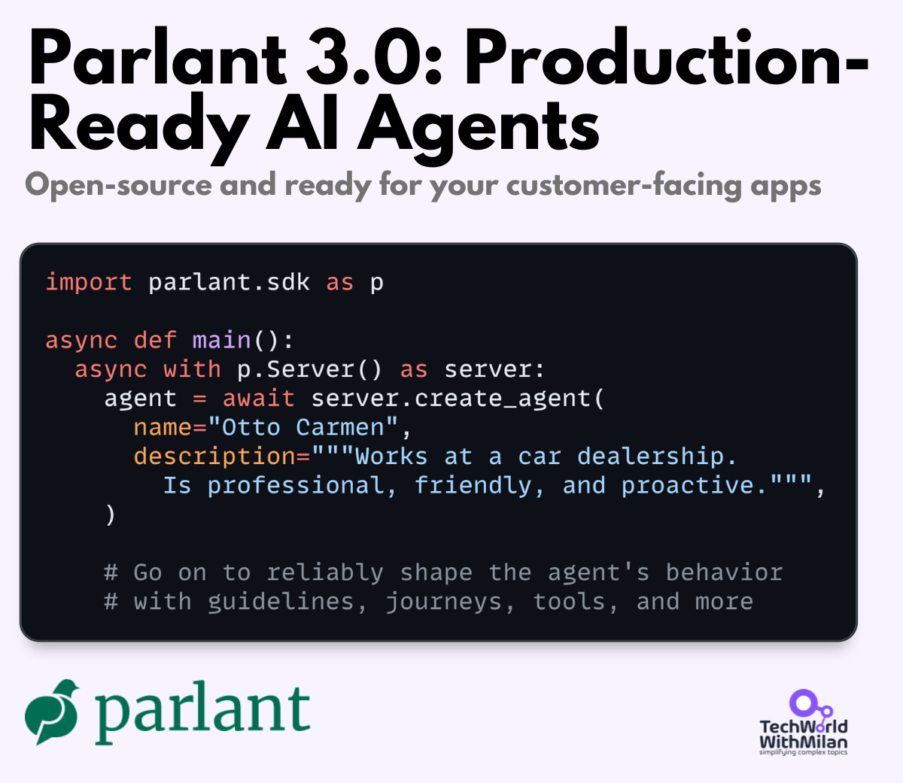](https://www.parlant.io/?utm_source=creators&utm_campaign=milan)

[Build your agent now!](https://www.parlant.io/?utm_source=creators&utm_campaign=milan)

---

**[Sponsor this newsletter](https://newsletter.techworld-with-milan.com/p/sponsorship-of-tech-world-with-milan)**

## 1. Introduction

A **rate confirmation** is a formal document outlining the costs associated with transporting goods that is provided by a carrier to a shipper or their broker. The rate confirmation will include information about the particular goods being transported, the shipment’s origin and destination, the shipment’s date range, and the relevant rates.

Because it clarifies the fees that will be incurred for a shipment, a rate confirmation is crucial. The parties involved in the cargo may be able to avoid miscommunications and disagreements thanks to this document.

Rate confirmation processing in trucking has **traditionally relied on manual data entry, basic OCR tools, or rigid RPA systems.** While these approaches were effective when document volumes were manageable and formats predictable, today’s freight market demands a better solution.

The explosion of digital freight matching, spot market volatility, and the sheer variety of document formats from thousands of brokers and shippers have pushed traditional systems to a breaking point.

Manual processing isn’t just slow, it’s expensive and error-prone. A single misread rate or incorrect pickup time can result in thousands of dollars in detention fees or lost loads. Meanwhile, existing automation tools struggle with the diverse range of formats that trucking companies encounter daily.

**DocuSense**™ emerged from the need for intelligent, adaptable document processing that could handle the chaos of real-world trucking documentation, which is built natively into **[Trucking Hub](https://www.truckinghub.com/)**.

## 2. Rate Confirmation Process

A typical workflow begins when a carrier accepts a load from a broker or shipper. The broker sends a rate confirmation detailing pickup/delivery locations, dates, commodity information, and agreed rates. Carriers must review, acknowledge, and often countersign these documents before dispatching trucks.

[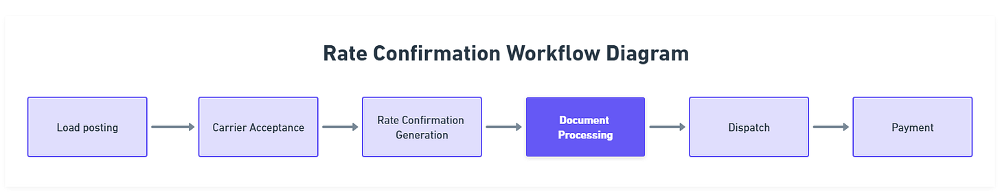](https://substackcdn.com/image/fetch/$s_!Igoq!,f_auto,q_auto:good,fl_progressive:steep/https%3A%2F%2Fsubstack-post-media.s3.amazonaws.com%2Fpublic%2Fimages%2Fe0d0a944-5c70-4db7-86b4-d5b7b8857057_1614x310.png)Rate confirmation workflow diagram

The complexity multiplies when carriers handle hundreds of loads daily from dozens of different brokers, each using their own document formats and systems. Some send structured PDFs, others use image-based documents, and many still rely on faxed confirmations that arrive as low-quality scans.

Rate confirmations reach carriers through multiple channels, creating a complex ingestion challenge:

1. **Email attachments**. The majority arrive as PDF attachments to designated email addresses
2. **Broker portals**. Direct downloads from TMS (Transportation Management System) integrations
3. **Fax-to-email**. Legacy systems still send faxed documents converted to email attachments
4. **Mobile uploads**. Drivers photographing and uploading physical documents from the field

Each channel presents unique challenges. Emails may contain multiple attachments, with only one being the actual rate confirmation. Portal downloads often include supplementary documents, and mobile uploads frequently suffer from poor image quality or orientation issues.

## 3. Challenges

Implementing an advanced document processing solution for trucking presented both business and technical challenges.

### Business challenges

Despite many brokers using digital documents, a substantial portion of rate confirmations were effectively handled in a manual or semi-manual way. This led to several business pain points:

- **High manual effort and inefficiency:** Human staff had to open emails or portals, download PDF rate confirmations, and transcribe numerous fields into our systems. This manual data extraction was slow and introduced delays in the dispatch and billing process.
- **Operational cost:** The more time employees spend on low-level data entry, the higher the operational cost. As load volumes grew, scaling the process meant either hiring more staff or risking backlogs – both undesirable outcomes.
- **Error-prone process:** Manual entry is inevitably prone to errors – a misplaced decimal in a rate or a wrong pickup date can lead to financial discrepancies or service failures.

Overall, the business needed a solution to speed up document handling, lower costs, and improve accuracy – thereby freeing our team to focus on higher-value tasks, such as exception handling and customer service.

### Technical challenges

Processing rate confirmation documents at scale comes with significant technical hurdles, too:

- **Diverse document formats:** We receive rate confirmations from countless brokers and shippers, each using their own template or layout. There is no single standard. Some are one-page documents with a simple table, others are multi-page contracts with terms and conditions. Key information (locations, prices, dates, etc.) can appear in different positions or formats across documents.
- **Scanned vs. digital PDFs:** Some documents are digitally generated PDFs (which contain text that can be extracted directly), while others are scanned images or fax printouts embedded in PDFs. The latter requires reliable Optical Character Recognition (OCR) to convert images to text. Low-resolution scans, noise, or poor print quality can all hinder text extraction.
- **Complex data to extract:** Each rate confirmation typically contains 10-15 key fields we need to capture (load number, pickup location, delivery location, pickup date/time, delivery date/time, rate amount, weight, truck type, etc.), sometimes along with a list of line items or stops. Capturing all this accurately is non-trivial, especially when a document spans multiple pages or has extensive fine print.
- **Volume and performance:** At our peak, we might process dozens of documents per hour. The solution must handle spikes and volume gracefully. We needed to evaluate the trade-off between accuracy and speed in our choice of technologies, so that we could process documents in near real-time without sacrificing quality.

## 4. Design

We sought a system that could accurately handle a wide range of documents at scale. But also, to adapt quickly to new formats without heavy coding, and fit into our users’ workflow (providing a good experience for any human reviewer).

### Principles

So, our design philosophy centers on the following core principles:

- **Accuracy.** At the heart of DocuSense**™** is the goal of high precision in data extraction. We leverage proven OCR technology and advanced GenAI models to ensure that each field (e.g., load number, addresses, rates) is identified correctly from the document.
- **Scalability.** DocuSense is built to handle large volumes of documents in a pipeline fashion. The architecture enables the horizontal scaling of OCR and LLM processing tasks, allowing us to add more processing workers as the document inflow grows without requiring a redesign of the system. We also utilize asynchronous workflows to manage high-throughput operations.
- **Flexibility.** A key design aim was to make the platform adaptable to new document types, formats, and use cases with minimal code changes. Instead of hardcoding for “rate confirmations” only, DocuSense was designed in a **modular** way, with components for ingestion, OCR, parsing, etc., that could be reconfigured or extended.

For example, we can define new data extraction templates via configuration or prompt changes, rather than writing new code, to onboard a different document type (like bills of lading or invoices).

### The product

To meet these principles, at [Trucking Hub](https://www.truckinghub.com/), we developed**DocuSense™** as a modular pipeline for document processing. The figure below shows what the UI of our solution looks like.

[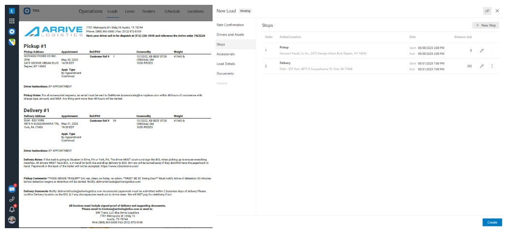](https://substackcdn.com/image/fetch/$s_!Qnjm!,f_auto,q_auto:good,fl_progressive:steep/https%3A%2F%2Fsubstack-post-media.s3.amazonaws.com%2Fpublic%2Fimages%2F5d201219-e01f-436f-b7b6-efb3bb62cc73_1049x482.png)Rate Confirmation import in [Trucking Hub](https://www.truckinghub.com/) via DocuSense**™**

The high-level **document processing pipeline** for DocuSense™, from ingestion to data output, is as follows.

[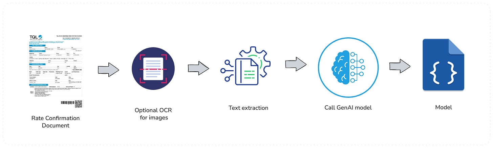](https://substackcdn.com/image/fetch/$s_!ZcIY!,f_auto,q_auto:good,fl_progressive:steep/https%3A%2F%2Fsubstack-post-media.s3.amazonaws.com%2Fpublic%2Fimages%2Ff4a904d7-74fa-4d2d-b821-fbd4823e0866_1669x504.png)TruckingHub DocuSense™ document processing pipeline

**DocuSense**™ builds on a generalized document processing pipeline, adapted from successful patterns in financial document processing but optimized for logistics requirements.

### Rate Confirmation Workflow with DocuSense™

To better understand how DocuSense™ operates in context, let’s walk through how a rate confirmation document flows through the system, from the perspective of our operations:

[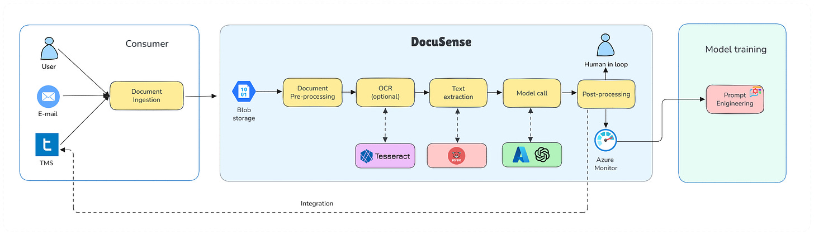](https://substackcdn.com/image/fetch/$s_!zi51!,f_auto,q_auto:good,fl_progressive:steep/https%3A%2F%2Fsubstack-post-media.s3.amazonaws.com%2Fpublic%2Fimages%2Fba476677-3cd7-4ed1-bceb-210cbc96fead_2477x717.png)Trucking Hub DocuSense™ architecture for the rate confirmation processing

The pipeline processes documents through distinct stages:

#### **1. Document Ingestion**

The journey begins when a rate confirmation document is received. DocuSense™ can ingest documents from multiple sources. For example, an email listener can detect incoming emails with PDF attachments from brokers, or users can upload PDFs through a web dashboard.

Once received, the document file is stored securely (in an object storage or database), and a processing workflow is triggered.

#### **2. Pre-processing**

Before extracting text, DocuSense™ performs various pre-processing steps. If the document is a PDF, we determine whether it contains a text layer; if not (i.e., it’s essentially an image scan), we convert each page into high-resolution images for OCR.

We may perform image cleaning or augmentation to improve OCR results, for instance, by enhancing contrast or resolution if a scan is of low quality, as these enhancements can improve OCR accuracy.

#### 3. **OCR (Optical Character Recognition)**

In this stage, the goal is to extract all text content from the document. After evaluating multiple options, we integrated a dual OCR approach:

- For digital PDF text extraction, we use **[UglyToad.PdfPig](https://github.com/UglyToad/PdfPig)**, an open-source .NET library specialized in reading text from PDFs. PDFPig allows us to extract text along with its position on the page, which can be useful for layout-aware parsing. It has no external dependencies and is optimized for performance, which makes it a great fit for our pipeline. We also experimented with [Azure AI Document Intelligence](https://learn.microsoft.com/en-us/azure/ai-services/document-intelligence/overview?view=doc-intel-4.0.0), but it proved to be less flexible for us and had lower performance compared to performing a local OCR.
- For scanned images, faxes, or parts of documents that are images, we use **[Tesseract OCR](https://github.com/tesseract-ocr/tesseract)** via a [.NET wrapper](https://github.com/charlesw/tesseract/). Tesseract is a widely used open-source OCR engine recognized for its high accuracy in recognizing printed text. This combination, PdfPig for native PDF text and Tesseract for images, proved to be the fastest and most reliable solution in our tests. It significantly outperformed trying to use an LLM for raw text extraction, which, as noted, was too slow.

By leveraging these OCR tools, we get **exact text** from the documents efficiently, forming the foundation for the next step.

#### 4. **AI Understanding (GenAI Model)**

Once we have the raw text of the document (often just a blob of text or a list of lines, possibly out of order), the next challenge is to *understand* it and extract the structured fields we care about. This is where we incorporate **GenAI**.

We integrated an **OpenAI GPT-4** model (via [Azure OpenAI Service](https://learn.microsoft.com/en-us/azure/ai-foundry/openai/overview)) into our pipeline. The raw text and layout information from OCR are fed into a carefully crafted **prompt** that asks the model to identify specific fields. We include sample formatting for the answer (such as JSON or XML) so that the output is structured.

Initially, we experimented with smaller models and even fine-tuned an open-source model for this task.

> **📈 Model evaluation**
> 
> *Our model selection process evaluated both open-source and commercial options across multiple dimensions:*
> 
> [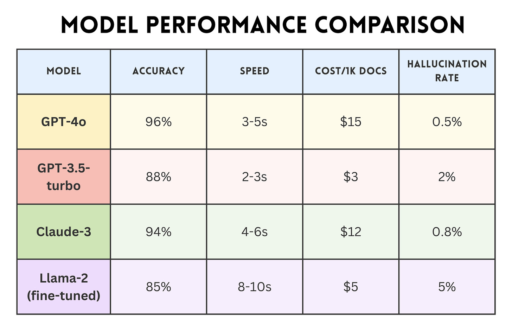](https://substackcdn.com/image/fetch/$s_!7VDQ!,f_auto,q_auto:good,fl_progressive:steep/https%3A%2F%2Fsubstack-post-media.s3.amazonaws.com%2Fpublic%2Fimages%2F5ebe632c-d928-42f3-b2ec-57f9c70d09a0_1545x998.png)
> 
> *GPT-4o emerged as our primary model due to its superior accuracy and acceptable speed. However, the real breakthrough came from **prompt optimization**.*
> 
> *We discovered that including example extractions in our prompts improved accuracy by 15%, while explicit instructions about common trucking terminology reduced errors in specialized fields by 30%.*

We iteratively refined the prompt based on the model's outputs. For instance, if we noticed that the model sometimes confused the pickup and delivery addresses, we adjusted the prompt to clarify the expected format or added an example.

#### 5. Post-processing

The raw output from the GenAI model (typically in JSON form with field values) is next fed into a post-processing module. This module applies business rules and sanity checks to further improve accuracy.

#### 6. **Integration and output**

Finally, the extracted and processed data is delivered to where it’s needed. In our case, that could be an internal TMS, a database, or a system that triggers automated actions.

For example, once a rate confirmation’s details are extracted, we can automatically create a load entry in our TMS with all the pertinent information, send notifications to dispatchers or drivers, and queue the invoice generation.

#### 7. Monitoring and feedback

Taking into account all these steps, we developed monitoring for key metrics, including processing time per document, extraction confidence scores, accuracy on test sets, and throughput. We also log model outputs and any manual corrections made by humans.

These logs form a **feedback loop.** By analyzing where the model made mistakes or needed assistance, we can determine whether to refine our prompts, add a new rule, or, in some cases, provide an example to the model for future reference.

This feedback loop has driven steady improvements in accuracy, from 82% at launch to 96% after three months. More importantly, we’ve reduced catastrophic failures (completely misread documents) from 5% to under 0.1%, building user trust in the system.

[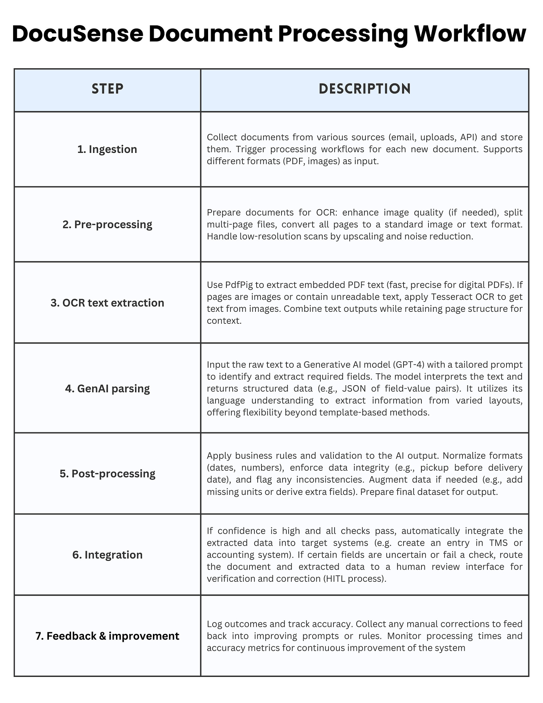](https://substackcdn.com/image/fetch/$s_!XZ3s!,f_auto,q_auto:good,fl_progressive:steep/https%3A%2F%2Fsubstack-post-media.s3.amazonaws.com%2Fpublic%2Fimages%2Fe86c7b3f-52d4-4d41-85ba-507ec128a936_1545x2000.png)DocuSense™ Document Processing Workflow

## 5. Implementation

The implementation leverages **[Azure AI Foundry](https://azure.microsoft.com/en-us/products/ai-foundry)** and **[Azure OpenAI](https://learn.microsoft.com/en-us/azure/ai-foundry/openai/overview)** services to deliver enterprise-grade document processing. Rather than using higher-level abstractions, **DocuSense**™ integrates directly with the [OpenAI .NET SDK](https://learn.microsoft.com/en-us/dotnet/api/overview/azure/ai.openai-readme?view=azure-dotnet) for maximum control over model interactions, response handling, and error recovery.

**[Azure AI Foundry](https://learn.microsoft.com/en-us/azure/ai-foundry/what-is-azure-ai-foundry)** provides the foundational platform for model hosting, while Azure OpenAI Service delivers enterprise-grade access to GPT-4 with built-in compliance and data residency guarantees.

[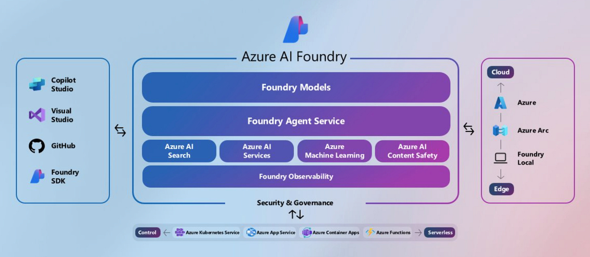](https://substackcdn.com/image/fetch/$s_!Voft!,f_auto,q_auto:good,fl_progressive:steep/https%3A%2F%2Fsubstack-post-media.s3.amazonaws.com%2Fpublic%2Fimages%2F821fcb16-4f41-4f70-a4b3-519376803e5d_2467x1078.png)

### Direct OpenAI SDK Integration

DocuSense™ integrates directly with the [OpenAI .NET SDK](https://learn.microsoft.com/en-us/dotnet/api/overview/azure/ai.openai-readme?view=azure-dotnet), rather than using higher-level abstractions, providing precise control over model interactions and response handling, which is essential for production reliability.

[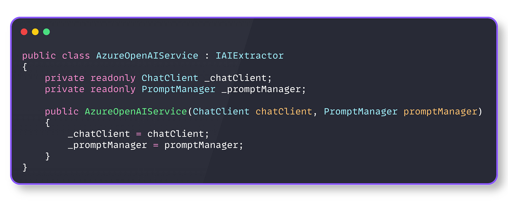](https://substackcdn.com/image/fetch/$s_!XJHb!,f_auto,q_auto:good,fl_progressive:steep/https%3A%2F%2Fsubstack-post-media.s3.amazonaws.com%2Fpublic%2Fimages%2Ff1dfce1d-2bd2-4ca8-a207-9bc6b26e4eb4_2724x1080.png)OpenAI SDK Integration

And the service registration looks like this:

[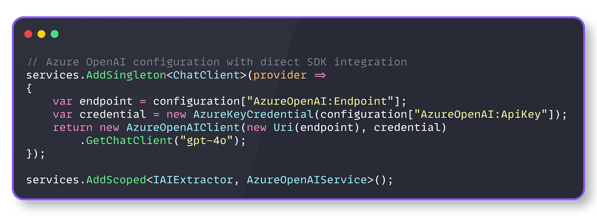](https://substackcdn.com/image/fetch/$s_!PZNS!,f_auto,q_auto:good,fl_progressive:steep/https%3A%2F%2Fsubstack-post-media.s3.amazonaws.com%2Fpublic%2Fimages%2F2c4cad97-4120-4ac9-8399-f41980a9a586_2724x990.png)Service registration

This direct integration enables fine-tuned control over model parameters, structured response formatting, and comprehensive error handling that higher-level abstractions might obscure.

### Structured response enforcement

The foundation of reliable AI extraction rests on eliminating response parsing ambiguity. **DocuSense**™ enforces JSON responses at the API level using OpenAI’s structured output feature.

An AI extraction operation is structured and deterministic. Each extraction request consists of:

- **Messages**: A conversation context with system instructions and user content
- **Options**: Model parameters that control response behavior and format
- **Response processing**: Structured parsing with error handling and token tracking

[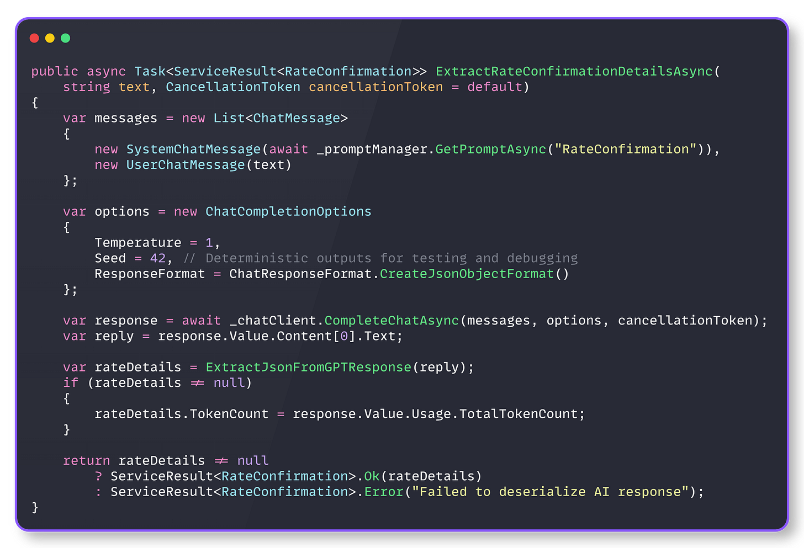](https://substackcdn.com/image/fetch/$s_!ol_F!,f_auto,q_auto:good,fl_progressive:steep/https%3A%2F%2Fsubstack-post-media.s3.amazonaws.com%2Fpublic%2Fimages%2F2f92e9bd-8ee6-4b79-ba08-8a7241823f2e_3096x2112.png)Structured response

The `SystemChatMessage` contains the prompt template with few-shot examples and field definitions, while `UserChatMessage` contains only the raw document text. This separation enables prompt optimization without affecting the document processing pipeline.

Our model also includes a **confidence score**, which enables intelligent downstream processing:

- **High confidence (90-100%)**: Auto-approve and process
- **Medium confidence (70-89%**): Flag for human review
- **Low confidence (<70%)**: Requires manual intervention

### External Prompt management

Prompt engineering drives extraction accuracy, but hard-coded prompts prevent rapid iteration. **DocuSense**™ externalizes prompt templates for hot-swapping without deployments.

[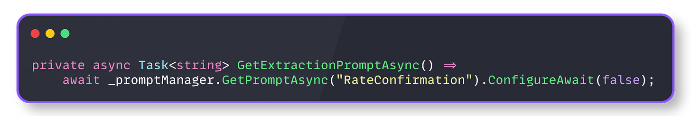](https://substackcdn.com/image/fetch/$s_!4Xg1!,f_auto,q_auto:good,fl_progressive:steep/https%3A%2F%2Fsubstack-post-media.s3.amazonaws.com%2Fpublic%2Fimages%2F6f261f8c-ff92-40ae-963b-07f9ad962ca9_2775x468.png)Prompt management

This pattern reduced optimization cycles from days to minutes. When accuracy dropped for a new broker’s document format, we updated the prompt template with additional examples and saw improvements within hours, not release cycles.

The prompt includes few-shot examples, explicit field definitions, and trucking-specific terminology guidance. This engineering approach achieved 96% accuracy without requiring model fine-tuning, thereby maintaining flexibility across various document types while keeping costs under control.

### Monitoring and error handling

Production AI systems require specialized error handling that accounts for unique failure modes, including token limits, rate limiting, model unavailability, and response parsing errors.

[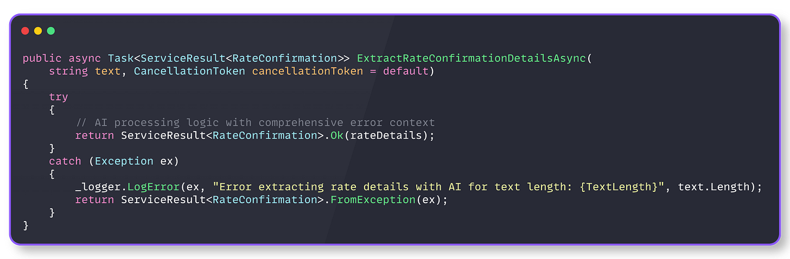](https://substackcdn.com/image/fetch/$s_!Uvr0!,f_auto,q_auto:good,fl_progressive:steep/https%3A%2F%2Fsubstack-post-media.s3.amazonaws.com%2Fpublic%2Fimages%2Feb7b94f0-8972-4caf-a36d-9471934db818_3681x1209.png)Error handling

And also, we track performances in this way:

[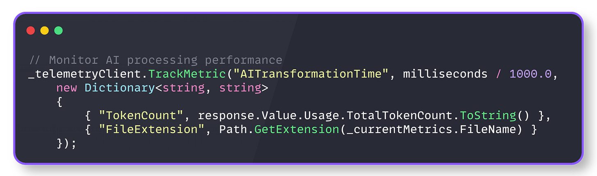](https://substackcdn.com/image/fetch/$s_!fkkD!,f_auto,q_auto:good,fl_progressive:steep/https%3A%2F%2Fsubstack-post-media.s3.amazonaws.com%2Fpublic%2Fimages%2F3b59c808-d0dc-4dec-baee-a2ff28fad66a_2574x762.png)Performance tracking

These metrics reveal that AI transformation typically takes 10-20x longer than text extraction, and that faster AI models may cost more or be less accurate

### Lessons learned

Here are some important lessons learned from our work on the **DocuSense**™ solution:

1. **Separate concerns.**The two-stage pipeline (text extraction → AI transformation) allows independent optimization and testing of each stage.
2. **Measure everything**. Without metrics, you’re flying blind. Track not just success/failure, but processing times, token usage, and confidence scores.
3. **Design for failure**. AI services will fail. Network calls will timeout. Design your system to handle these gracefully with circuit breakers, retries, and fallbacks.
4. **Abstract AI providers.**An AI provider interface allows swapping between OpenAI, Azure, Google, or custom models without changing business logic.
5. **Cache intelligently**. AI calls are expensive. Cache responses for identical or similar documents, but be smart about cache invalidation.
6. **Version prompts**. Treat prompts as code. Version them, test them, and roll them back if needed.
7. **Monitor costs continuously**. AI token usage can spiral quickly. Implement cost tracking and alerts before going to production.
8. **Build feedback loops**. Track confidence scores and allow users to correct extractions. Use this data to improve your prompts or fine-tune models.

## 6. Results

After processing over 100,000 documents in production, **DocuSense**™ has delivered transformative results. Here are the most important ones:

- **Major reduction in manual work.** We’ve seen a roughly **2-fold reduction in manual document processing** needs for rate confirmations. Tasks that used to require two full-time staff can now be handled by one (who mainly just reviews flagged items). Many documents go through completely automatically.
- **Faster turnaround times.** The average handling time for a rate confirmation (from reception to being ready in the system) has dropped by about **70%**. What might have taken, say, 10-15 minutes or more between reading, interpreting, and typing into systems now takes just a couple of minutes or less with automation.
- **High accuracy and reduced errors.** Our automated extraction achieves an**overall accuracy** of around 90% in a fully automated process. Moreover, ~one-third of documents are processed with near-perfect accuracy (~99% field accuracy), requiring no corrections. For the remaining errors, they are usually minor (such as a formatting detail) and are caught in the review stage. Compared to previous manual error rates, this represents a significant improvement in data quality.
- **Cost savings.** By automating previously manual tasks, we are achieving notable cost savings. We estimate **a 25-30% reduction in processing costs** for these documents compared to the manual approach alone.
- **Improved user experience.** For our internal users (dispatchers and billing clerks), DocuSense™ has made their lives easier. Instead of juggling between an email, a PDF viewer, and a TMS screen to enter data, they either get the data automatically or have a single interface to verify it. The intuitive UI, featuring side-by-side comparison and alerts, significantly accelerates the verification process.
- **Scalability.** Over the months, DocuSense™ has seamlessly scaled to process **over 100,000 documents** and counting. When a new broker or document format is introduced, we haven’t had to write custom code; at most, we adjust the prompt or add a post-processing tweak. This agility validates our design goal of a flexible platform.

Overall, DocuSense™ has transformed the rate confirmation process from a manual bottleneck into a streamlined, largely automated pipeline. The combined power of OCR and GenAI has delivered both speed and accuracy, and the numbers reflect that success.

## 7. Conclusion

The development and deployment of Trucking Hub DocuSense™, our GenAI-powered document processing platform, have revolutionized how we handle critical operational documents in the trucking industry. By overcoming the challenges of manual data entry and rigid automation, we’ve achieved significant gains in efficiency, accuracy, and scalability.

This project illustrates a broader point: the combination of natural language understanding with domain-specific processing can automate complex tasks that were previously only solvable through human intuition. DocuSense™ doesn’t just read text; it *interprets* documents much like a human would, but at superhuman speed and consistency.

And by smartly integrating human-in-the-loop checks, we ensure that the system remains reliable and accountable, meeting the high accuracy our business requires.

The success of DocuSense™ has set a new benchmark internally, prompting us to explore other areas where AI can bring similar leaps in productivity. From invoices to bills of lading, the possibilities are vast.

---

## **More ways I can help you:**

- [📚](https://www.patreon.com/techworld_with_milan/shop/ultimate-net-bundle-for-2025-1519389?utm_medium=clipboard_copy&utm_source=copyLink&utm_campaign=productshare_creator&utm_content=join_link)**[The Ultimate .NET Bundle 2025](https://www.patreon.com/techworld_with_milan/shop/ultimate-net-bundle-for-2025-1519389?utm_medium=clipboard_copy&utm_source=copyLink&utm_campaign=productshare_creator&utm_content=join_link)** 🆕. 500+ pages distilled from 30 real projects show you how to own modern C#, ASP.NET Core, patterns, and the whole .NET ecosystem. You also get 200+ interview Q&As, a C# cheat sheet, and bonus guides on middleware and best practices to improve your career and land new .NET roles. **[Join 1,000+ engineers](https://www.patreon.com/techworld_with_milan/shop/ultimate-net-bundle-for-2025-1519389?utm_medium=clipboard_copy&utm_source=copyLink&utm_campaign=productshare_creator&utm_content=join_link)**.
- [📦](https://www.patreon.com/techworld_with_milan/shop/premium-resume-package-1721454?utm_medium=clipboard_copy&utm_source=copyLink&utm_campaign=productshare_creator&utm_content=join_link)**[Premium Resume Package](https://www.patreon.com/techworld_with_milan/shop/premium-resume-package-1721454?utm_medium=clipboard_copy&utm_source=copyLink&utm_campaign=productshare_creator&utm_content=join_link) 🆕**. Built from over 300 interviews, this system enables you to craft a clear, job-ready resume quickly and efficiently. You get ATS-friendly templates (summary, project-based, and more), a cover letter, AI prompts, and bonus guides on writing resumes and prepping LinkedIn. **[Join 500+ people](https://www.patreon.com/techworld_with_milan/shop/premium-resume-package-1721454?utm_medium=clipboard_copy&utm_source=copyLink&utm_campaign=productshare_creator&utm_content=join_link)**.
- [📄](https://www.patreon.com/techworld_with_milan/shop/complete-tech-resume-reality-check-311008?utm_medium=clipboard_copy&utm_source=copyLink&utm_campaign=productshare_creator&utm_content=join_link)**[Resume Reality Check](https://www.patreon.com/techworld_with_milan/shop/complete-tech-resume-reality-check-311008?utm_medium=clipboard_copy&utm_source=copyLink&utm_campaign=productshare_creator&utm_content=join_link)**. Get a CTO-level teardown of your CV and LinkedIn profile. I flag what stands out, fix what drags, and show you how hiring managers judge you in 30 seconds. **[Join 100+ people](https://www.patreon.com/techworld_with_milan/shop/complete-tech-resume-reality-check-311008?utm_medium=clipboard_copy&utm_source=copyLink&utm_campaign=productshare_creator&utm_content=join_link)**.
- [📢](https://www.patreon.com/techworld_with_milan/shop/short-linkedin-content-creator-311232?utm_medium=clipboard_copy&utm_source=copyLink&utm_campaign=productshare_creator&utm_content=join_link)**[LinkedIn Content Creator Masterclass](https://www.patreon.com/techworld_with_milan/shop/short-linkedin-content-creator-311232?utm_medium=clipboard_copy&utm_source=copyLink&utm_campaign=productshare_creator&utm_content=join_link)**. I share the system that grew my tech following to over 100,000 in 6 months (now over 255,000), covering audience targeting, algorithm triggers, and a repeatable writing framework. Leave with a 90-day content plan that turns expertise into daily growth. **[Join 1,000+ creators](https://www.patreon.com/techworld_with_milan/shop/short-linkedin-content-creator-311232?utm_medium=clipboard_copy&utm_source=copyLink&utm_campaign=productshare_creator&utm_content=join_link)**.
- [✨](https://www.patreon.com/c/techworld_with_milan)**[Join My Patreon](https://www.patreon.com/c/techworld_with_milan)**[https://www.patreon.com/c/techworld_with_milan](https://www.patreon.com/c/techworld_with_milan)**[Community](https://www.patreon.com/c/techworld_with_milan) and [My Shop](https://www.patreon.com/c/techworld_with_milan/shop)**. Unlock every book, template, and future drop, plus early access, behind-the-scenes notes, and priority requests. Your support enables me to continue writing in-depth articles at no cost. **[Join 2,000+ insiders](https://www.patreon.com/c/techworld_with_milan)**.
- [🤝](https://newsletter.techworld-with-milan.com/p/coaching-services)**[1:1 Coaching](https://newsletter.techworld-with-milan.com/p/coaching-services)**. Book a focused session to crush your biggest engineering or leadership roadblock. I’ll map next steps, share battle-tested playbooks, and hold you accountable. **[Join 100+ coachees](https://newsletter.techworld-with-milan.com/p/coaching-services)**.

---

## **Want to advertise in Tech World With Milan? 📰**

If your company is interested in reaching an audience of founders, executives, and decision-makers, you may want to **[consider advertising with us](https://newsletter.techworld-with-milan.com/p/sponsorship-of-tech-world-with-milan)**.

---

## **Love Tech World With Milan Newsletter? Tell your friends and get rewards.**

We are now close to **50k subscribers** (thank you!). Share it with your friends by using the button below to get benefits (my books and resources).

[Share Tech World With Milan Newsletter](https://newsletter.techworld-with-milan.com/?utm_source=substack&utm_medium=email&utm_content=share&action=share)

[Track your referrals here](https://newsletter.techworld-with-milan.com/leaderboard).