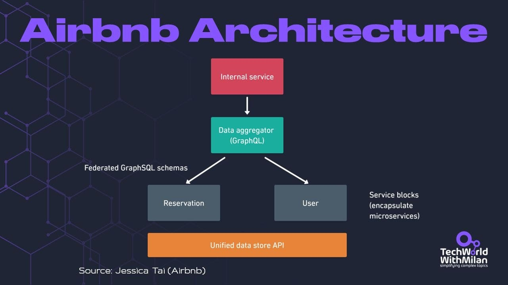

# Airbnb Microservice Architecture

Jessica Tai, an engineering manager at Airbnb, **[recently talked at QCon](https://www.youtube.com/watch?v=yGOtTd-l_3E)** about how Airbnb's architecture changed over the years and followed company development.

Airbnb microservice architecture went through the following phases:

## 1. Monolith (2008 - 2017)

In the early years, from its inception in 2008 until around 2017, Airbnb operated on a monolithic architecture, primarily using a **Ruby on Rails monolith**. This setup initially served the company well, accommodating the full-stack engineers capable of handling end-to-end features within the single repository. However, as Airbnb experienced rapid growth and entered a hypergrowth phase, the monolith's limitations became increasingly evident. The application grew tightly coupled and complex, leading to significant scaling challenges (such as drawing team boundaries over the codebase). Also, one of the most critical issues was the slow deployments, which escalated from taking minutes to several hours or even a day, severely damaging developer productivity. All of this influenced Airbnb's decision to move to a Microservice architecture.

## 2. Microservices (2017 - 2020)

Categorizing services marked this shift into four distinct types:

- **Data fetching service for data read/write**
- **Business logic service to combine data from multiple sources**
- **Workflow for orchestration of various services**
- **UI aggregation services to bring all of this to UI**

A key strategy in this transition was **the clear ownership of each service**, with specific teams responsible for individual services. This restructuring led to a more specialized team setup, moving away from the full-stack approach to teams focused on the backend and specific data services. Despite the benefits of improved scalability and development speed, Airbnb **faced new challenges in managing the complexity and dependencies of many services after a few years**. The main issue was that to build an end-to-end feature, they needed to know different services, so multiple teams would need to be involved, and those teams needed to have the same priorities, which took time to manage.

## Micro + Macroservices (2020 - Present)

In response to these emerging challenges, around 2020, Airbnb evolved its strategy to a hybrid model combining micro and macroservices. This approach centered on unifying APIs through a **GraphQL interface**, with a central data aggregator at its core (macroservice). The backend services were restructured to interact through this GraphQL interface, streamlining data flow and service interactions. This means that their backend services get data from the aggregator service (called service block), which then communicates with other microservices to gain data. Check the presentation in the comments.

Current Airbnb Architecture

---

## More ways I can help you

1. **[Patreon Community](https://www.patreon.com/techworld_with_milan)**: Join my community of engineers, managers, and software architects. You will get exclusive benefits, including all of my books and templates (worth 100$), early access to my content, insider news, helpful resources and tools, priority support, and the possibility to influence my work.
2. **[Sponsoring this newsletter will promote you to 33,000+ subscribers](https://newsletter.techworld-with-milan.com/p/sponsorship-of-tech-world-with-milan)**. It puts you in front of an audience of many engineering leaders and senior engineers who influence tech decisions and purchases.
3. **1:1 Coaching:** [Book a working session with me](https://newsletter.techworld-with-milan.com/p/coaching-services). 1:1 coaching is available for personal and organizational/team growth topics. I help you become a high-performing leader 🚀.

---

Thanks for reading Tech World With Milan Newsletter! Subscribe for free to receive new posts and support my work.