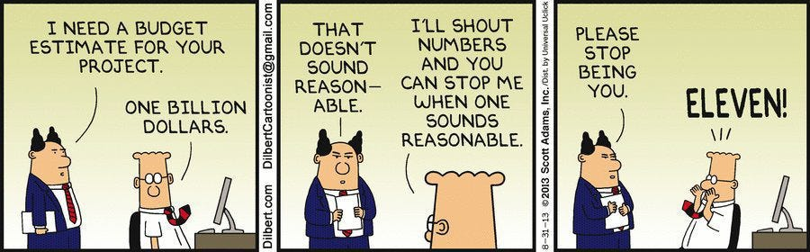
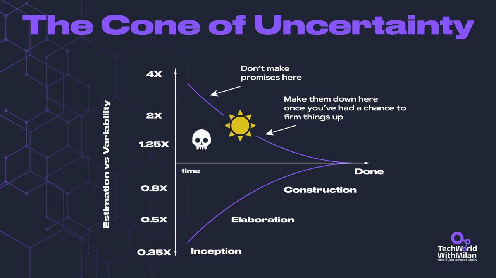
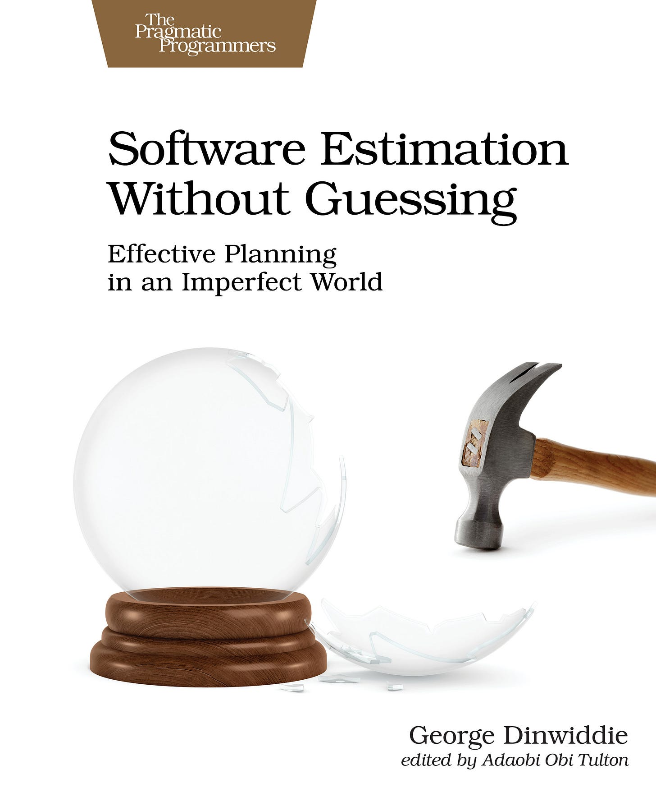
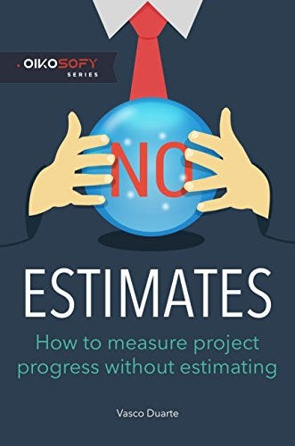

# All Estimations Are Wrong, But None Are Useful

If you're working in a team using the Scrum framework, you use story points to estimate effort on your stories, tasks, etc. Some management also takes this into account and does planning, measures your productivity, and even keeps you accountable when something is done. Yet, they need to learn that software estimations are always wrong.

The main reason is that estimations are **forecasts**, which are predictions of an unknown future. Yet we all know it is impossible to see the end, but people tend to forget this and make commitments based on estimations.

It is generally **good to have plans** because they allow us to iteratively work on something, continuously providing value to our clients. Yet projects are usually very complex, involving many teams and dependencies between them.

**Why do plans fail?** There are many reasons, such as not precise requirements, level of knowledge not being considered, the software needs to be underestimated, don't consider technical debt, etc.

Yet, there are some other things **why estimations fail**:

1. **Hofstadter’s Law** states, “*It always takes longer than you expect, even when you consider Hofstadter's Law.*" It highlights the recursive nature of estimation, where considering the complexity of a task and human optimism often leads to underestimation.
2. **Brook’s Law** states, "*Adding manpower to a late software project makes it later*." This law emphasizes the negative impact of increasing team size to speed up a project. New team members need time to get up to speed, and overhead communication increases, further delaying the project.
3. **Planning Fallacy**:****This cognitive bias causes people to underestimate the time and resources required to complete a task. In software estimation, developers may need to pay more attention to potential obstacles or be optimistic about their abilities, leading to inaccurate estimates.
4. **Bikeshedding**: This law states that people focus on trivial details rather than critical aspects of a project. In software estimation, this can result in an overemphasis on understandable tasks while underestimating more complex tasks.
5. **Parkinson’s Law** states, “*Work expands to fill the time available for completion*." This law suggests that if a deadline is too generous, developers may spend more time on a task than necessary, leading to inefficiencies and delays.
6. **Ninety-Ninety Rule** states, "*The first 90% of the code accounts for the first 90% of the development time; the remaining 10% of the code accounts for the other 90% of the development time.*" This rule highlights the difficulty of accurately estimating the time needed for bug fixing, optimization, and polishing.

In addition, we have to deal with **The Cone Of Uncertainty**(introduced to the software development community by [Steve McConnell](http://www.stevemcconnell.com/)). Usually, at the early stages of the project, we still don’t understand all the requirements, but we need to make many decisions. Here, the uncertainty is high. As the project progresses, we have more information, and uncertainty decreases.

The Cone of Uncertainty

> ⚠️*Note that in the book “[The Leprechauns of Software Engineering](https://leanpub.com/leprechauns)”, the author claims the “cone of uncertainty” was never based on solid data. It started as a subjective guess by Barry Boehm, and Steve McConnell popularized it through his 1996 book "Rapid Development."*

What are some remediations to this? In his book “**[Software Estimation Without Guessing](https://amzn.to/3O0y2SV)**,” George Dinwiddie provides valuable insights and techniques to improve the accuracy and reliability of software estimations:

- **Track progress with your estimates to create a feedback loop (e.g., burn-up chart)**
- **It is O.K. to be wrong with estimates.**
- **Estimate, then put in some contingency buffers.**
- **Allow some space for the unexpected.**
- **Have a good measure of what is done or not (you can use test automation here)**
- **Use a model such as the [COCOMO model](https://www.educative.io/answers/what-is-the-cocomo-model):**

- You first get an initial estimate of development efforts from evaluation delivered lines of source code.
- Determine a set of 15 multiplying factors from various attributes.
- Calculate the effort estimate by multiplying the initial estimate with all the factors.
- **In-person communication skills are essential.**

In addition to this, my experience said the following:

- Break down tasks by **decomposing large complex tasks into smaller**, more manageable ones. For example, we found that**jobs estimated up to 3 days of work are accurate**.
- Always **be conservative with estimations**, mainly if any unknowns exist; it should build up in complexity. Developers are known to be optimists.
- **Have we done similar things before?** If not, it could add more complexity.
- Estimates should be **regularly updated and calibrated** as the project progresses. This helps the project adapt to changes and ensures that it stays on track.
- If the code is legacy,**do we have anyone on the team who knows something about it**, or do we have docs?
- **Do we know all the risks related to the story?**If not, this will increase uncertainty.
- Always include a **buffer for risks** and uncertainties.
- There is **no one-size-fits-all method** for software estimation. Different projects and contexts require different approaches.
- Remove "**quick," "simple," "straightforward," "easy,"** and every similar word from your dictionary. Never use them.
- To be safe, estimate how long you think it will take to complete the task. **Multiply the number by 3.** This will be the lower range of your estimate. Double the lower range of the estimate. This will be the upper range. E.g. for 1 day of work, say 3 - 6 days to complete.

**Estimation = complexity + uncertainty**

"Software Estimation Without Guessing" by George Dinwiddie

In addition to everything above, Vasco Duarte, in his book “**[NoEstimates: How to Measure Project Progress Without Estimating](https://amzn.to/3NWeuyM)**,” suggested an alternative approach.

He is arguing against traditional methods of estimation, like **story points**. Duarte contends these need to be more accurate,**creating a fallacy of precision and leading to miscommunication and undue pressure.** Instead, he suggests dropping story points (effectively, every user story is worth one story point) and **delivering the minor work that provides significant value**, utilizing empirical data like throughput or cycle times to accurately reflect capacity and productivity.

Measurement should be based on throughput, the number of tasks completed within a set time frame, cycle times, and how long a job takes from inception to completion. A visual system like **Kanban**can help track progress and identify bottlenecks. **Regular retrospectives and feedback** enable continuous improvement, reinforcing the importance of iterative development to facilitate rapid delivery of small, incremental value.

“NoEstimates: How To Measure Project Progress Without Estimating,” by Vasco Duarte

> Learn more about how accidental complications can impact your estimations in this great talk:

---

Thanks for reading Tech World With Milan Newsletter! Subscribe for free to receive new posts and support my work.