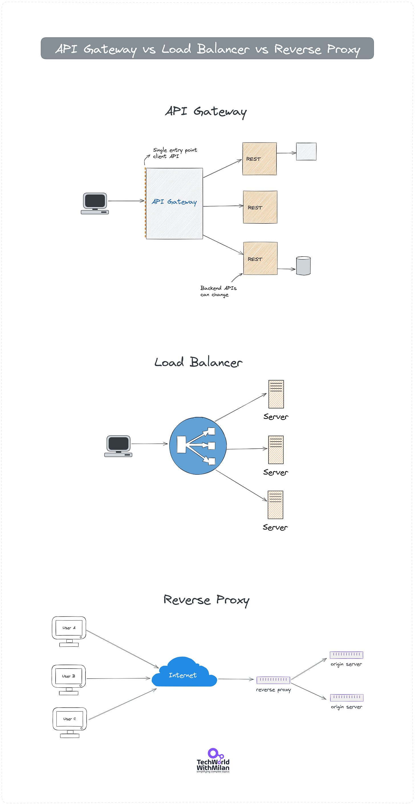
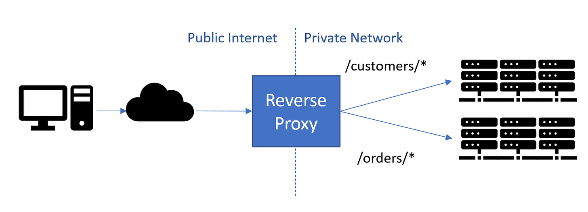
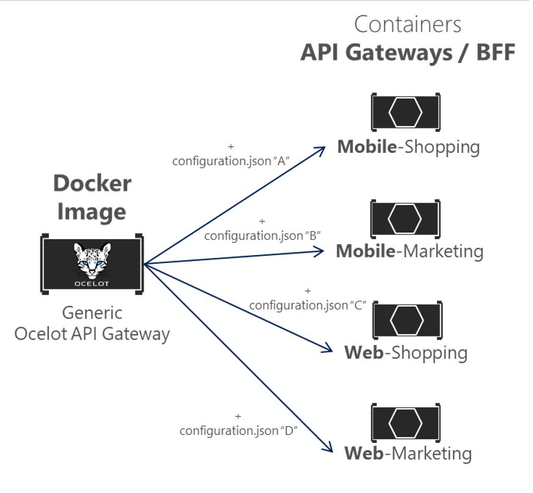
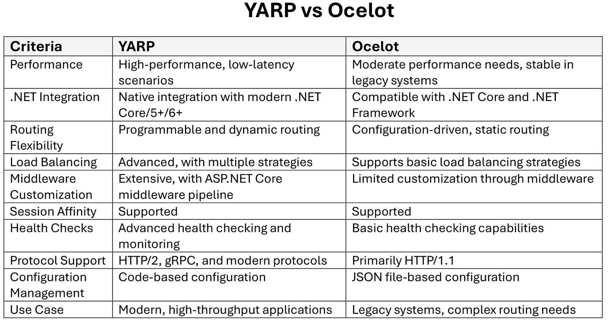
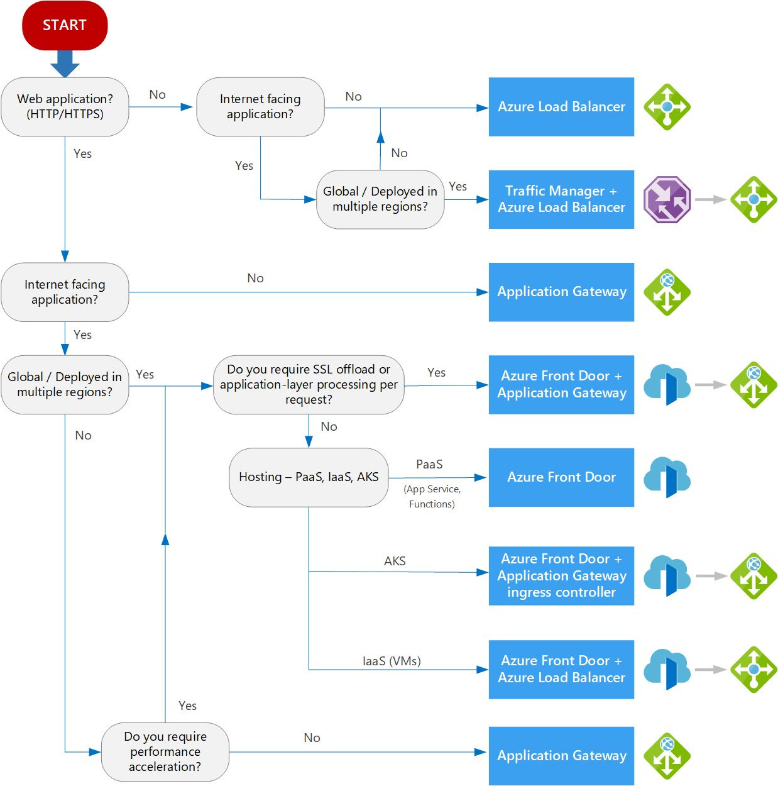

# API Gateway vs. Load Balancer vs. Reverse Proxy

API Gateways, Reverse Proxy Servers, and Load Balancers are essential components in modern software architecture. Each serves a specific role that enhances web application performance, security, and scalability. Yet, we often need clarification about the roles of those services.

Here are the main characteristics:

- **API Gateway** sits between a client and a group of backend services. It performs the function of a reverse proxy by accepting all application programming interface (API) calls, aggregating the different services needed to fulfill them, and returning the right outcome. **User authentication, rate limits, and statistics** are typical duties that API gateways take care of on behalf of a system of API services. Also, the API gateway can handle faults (circuit breaker) and log and monitor.

Find more details about the API Gateway at the link below.
[
Tech World With Milan NewsletterWhat is API Gateway?An API management tool known as an API Gateway sits between a client and a group of backend services. It performs the function of a reverse proxy by accepting all application programming interface (API) calls, aggregating the different services needed to fulfill them, and returning the right outcome…Read more3 years ago · 2 likes · Dr Milan Milanović](https://newsletter.techworld-with-milan.com/p/what-is-api-gateway?utm_source=substack&utm_campaign=post_embed&utm_medium=web)
- **Load Balancer** is a service that distributes incoming traffic across many servers or resources. Usually, we have two or more web servers on the backend, and it **distributes network traffic between them**. Its primary purpose is to use resources optimally. A more equal task allocation and increased capacity can enhance the system's responsiveness and reliability. There are three high-level load balancers: hardware-based, cloud-based, and software-based.
- **Reverse Proxy** server resides in front of backend servers and transfers client requests to these servers. Reverse proxies are typically used to increase security, speed, and dependability. A reverse proxy receives a request from a client, forwards it to another server, and then returns it to the client, giving the impression that the first proxy server handled the request. These proxies ensure that users don't access the origin server directly, giving the web server anonymity. They are usually used for Load balancing, where we need to deal with incoming traffic flow so that we may distribute that traffic between multiple backend servers or use them for caching.

So, the main thing that differs these two is that an **API Gateway is focused on routing requests** to the appropriate service and handles requests for APIs, while a **Load Balancer is focused on distributing requests evenly** between a group of servers and handles requests that are sent to a single IP address, which works at protocol or socket level (TCP, HTTP).

Some examples of **API Gateways** are:

- [Amazon API Gateway](https://aws.amazon.com/api-gateway/)
- [Ocelot](https://github.com/ThreeMammals/Ocelot)
- [Tyk](https://tyk.io/)
- [Apache APISIX](https://apisix.apache.org/)

**Load Balancers** are:

- [Azure Load Balancer](https://learn.microsoft.com/en-us/azure/load-balancer/load-balancer-overview)
- [HAProxy](https://www.haproxy.org/)
- [Seesaw](https://github.com/google/seesaw)

An example of **reverse proxy** services are:

- [Apache Proxy](https://httpd.apache.org/docs/2.4/mod/mod_proxy.html)
- [YARP](https://microsoft.github.io/reverse-proxy/)
- [Nginx](https://www.nginx.com/)
- [IIS](https://www.iis.net/) with additional modules (Url Rewrite).

API Gateway vs. Load Balancer vs. Reverse Proxy

---

## Reverse Proxy options in .NET

If you're building a .NET application using microservice architecture and considering a reverse proxy, **YARP** (Yet Another Reverse Proxy) and **Ocelot** are two popular options. They act as an intermediary server, receiving client requests and forwarding them to the appropriate backend service.

This offers several benefits, including:

- **Load balancing:** Distribute traffic across multiple backend servers for improved performance and scalability.
- **Security:** Shield backend servers from direct exposure to the internet, enhancing security.
- **Request manipulation:** Modify or enrich requests before sending them to the backend.

### **YARP**

[YARP](https://microsoft.github.io/reverse-proxy/) is a relatively new open-source project from Microsoft. The main feature that sets YARP apart from the competition is its ease of customization and adjustment to fit the unique requirements of any deployment situation. It boasts a robust feature set, including:

- **Load balancing:** Implements various load-balancing algorithms for efficient traffic distribution.
- **Health checks:** Monitors backend service health and only routes requests to healthy instances.
- **Session affinity:** Maintains user sessions with specific backend services for a seamless user experience.
- **Middleware integration:** Works seamlessly with ASP.NET Core middleware for customizing request and response handling.
- **Performance-oriented**: Built on the high-performance, scalable ASP.NET Core platform, YARP is optimized for speed and low memory consumption, making it ideal for high-throughput scenarios.
- **Native .NET integration**: Microsoft initiated YARP, a project that seamlessly integrates with the .NET ecosystem, leveraging the latest features of .NET Core and ASP.NET Core.
- **Programmable routing**: Unlike traditional configuration-driven proxies, YARP allows for dynamic and programmable routing decisions, giving developers more control over implementing complex routing logic.
- **Extensible Middleware Pipeline**: YARP utilizes the ASP.NET Core middleware pipeline, enabling developers to plug in custom processing logic and extend the proxy's capabilities.
- **HTTP/2 and gRPC Support**: YARP is designed to handle modern protocols like HTTP/2 and gRPC, making it suitable for high-performance APIs and microservices architectures.
- **Telemetry and observability**: With built-in telemetry and logging, YARP provides detailed insights into its operations, helping developers and operators monitor and troubleshoot proxy behavior.

YARP is highly extensible, allowing you to plug in custom logic for routing, health checks, and other functionalities. This makes it an excellent choice for complex scenarios with specific requirements.

YARP as Reverse Proxy (Image: [Microsoft](https://devblogs.microsoft.com/dotnet/announcing-yarp-1-0-release/))

> *Read more about h[ow Microsoft used YARP with Kestrel](https://azure.github.io/AppService/2022/08/16/A-Heavy-Lift.html) to achieve 160B+ daily HTTP requests from applications and 14M+ host names.*

### **Ocelot**

[Ocelot](https://github.com/ThreeMammals/Ocelot) is another popular open-source reverse proxy option for .NET ecosystem. It's known for its rich set of features, including:

- **Simplicity:** Offers a straightforward configuration model for easy setup and use.
- **Performance:** Delivers excellent performance due to its lightweight design.
- **Standard features:** Provides essential load balancing, rate limiting, and authentication capabilities.
- **Configuration-driven**: Ocelot uses a JSON configuration file to define routing rules, load balancing options, and other proxy settings. This approach allows for centralized and easily manageable configurations.
- **Middleware pipeline**: It leverages the ASP.NET Core middleware pipeline, enabling developers to inject custom middleware for request processing, thus offering high customization and flexibility.
- **Routing and Load Balancing**: Ocelot supports advanced routing capabilities and various load balancing strategies, such as Round Robin, Least Connections, and No Load Balancing, allowing for efficient distribution of incoming traffic across multiple backend services.
- **Security**: It integrates with ASP.NET Core's authentication and authorization frameworks, providing mechanisms to secure backend services by validating tokens, managing scopes, and enforcing access policies.
- **Rate limiting and caching**: Ocelot includes features for rate limiting to prevent abuse and caching responses to improve performance and reduce load on backend services.
- **Request aggregation**: It can aggregate multiple downstream requests into a single upstream response, simplifying client-side consumption of microservices by reducing the number of network calls.
- **Tracing and logging**: It supports extensive logging and tracing capabilities, making diagnosing issues and monitoring the system's health and performance easier.
- **Extensibility and customization**: Developers can extend Ocelot's functionality by writing custom middleware and handlers and delegating handlers, providing the flexibility to cater to specific application needs.

Ocelot is ideal when you need a primary reverse proxy with minimal configuration overhead. It's an excellent choice for smaller deployments or when you want to offload some tasks from your backend servers.

Ocelot API Gateway (Image: [Microsoft](https://learn.microsoft.com/en-us/dotnet/architecture/microservices/multi-container-microservice-net-applications/implement-api-gateways-with-ocelot))

### How to select between Ocelot and YARP?

When choosing between these two, the following comparison can help you decide. In general, choose YARP if you're working with modern .NET applications, need high performance and throughput, and prefer programmable and dynamic routing within a Microsoft-centric ecosystem. **YARP** is ideal for scenarios where cutting-edge features like HTTP/2 and gRPC support are essential. On the other hand, select **Ocelot** if your application demands a stable, configuration-driven reverse proxy that can easily integrate with both .NET Core and .NET Framework environments. Ocelot is better suited for applications requiring complex routing logic, extensive documentation, and a mature community support network, especially when working with legacy systems or when a more straightforward, file-based configuration approach is preferred.

YARP vs Ocelot

> *Consider using **IIS** (Internet Information Services) as a reverse proxy for .NET applications. It's a mature and well-supported option within the Microsoft ecosystem.*

---

## Bonus: Load-balancing options in Azure

Distributing workloads among various computing resources is known as load balancing. The goals of load balancing are to maximize throughput, decrease reaction time, and prevent overloading of any particular resource. Distributing a task among redundant computing resources can also increase availability.

Azure provides various load balancing services—[Application Gateway](https://learn.microsoft.com/en-us/azure/application-gateway/overview), [Front Door](https://learn.microsoft.com/en-us/azure/frontdoor/front-door-overview), [Load Balancer](https://learn.microsoft.com/en-us/azure/load-balancer/load-balancer-overview), and [Traffic Manager](https://learn.microsoft.com/en-us/azure/traffic-manager/traffic-manager-overview)—to distribute workloads across multiple computing resources.

Here is **the decision tree** for load balancing in Azure, which depends on multiple factors, such as traffic type (web app, private vs public app), global vs regional, availability, cost, and more.

Decision tree for load balancing in Azure (Source: [Microsoft](https://learn.microsoft.com/en-us/azure/architecture/guide/technology-choices/load-balancing-overview))

---

## More ways I can help you

1. **1:1 Coaching:** [Book a working session with me](https://newsletter.techworld-with-milan.com/p/coaching-services). 1:1 coaching is available for personal and organizational/team growth topics. I help you become a high-performing leader 🚀.
2. **[Promote yourself to 28,000+ subscribers](https://newsletter.techworld-with-milan.com/p/sponsorship-of-tech-world-with-milan)**by sponsoring this newsletter.

---

Thanks for reading Tech World With Milan Newsletter! Subscribe for free to receive new posts and support my work.