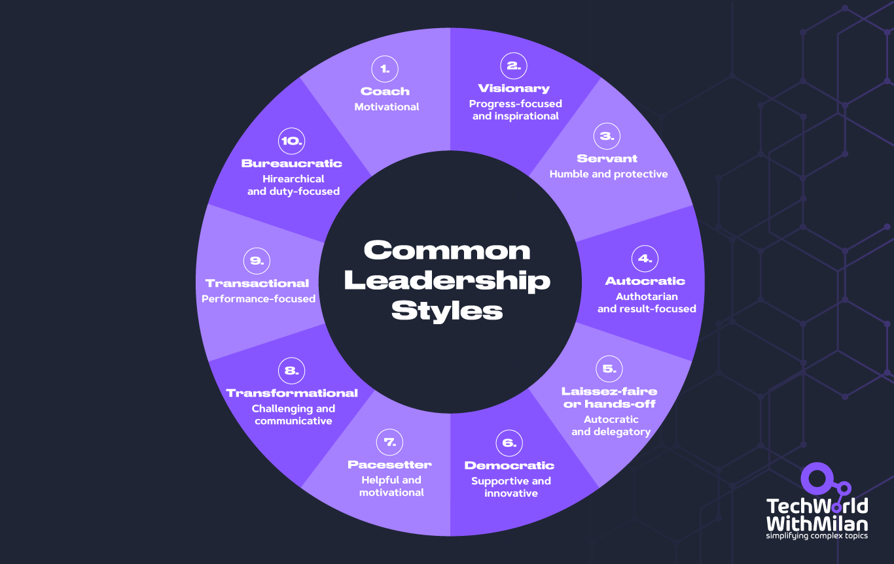
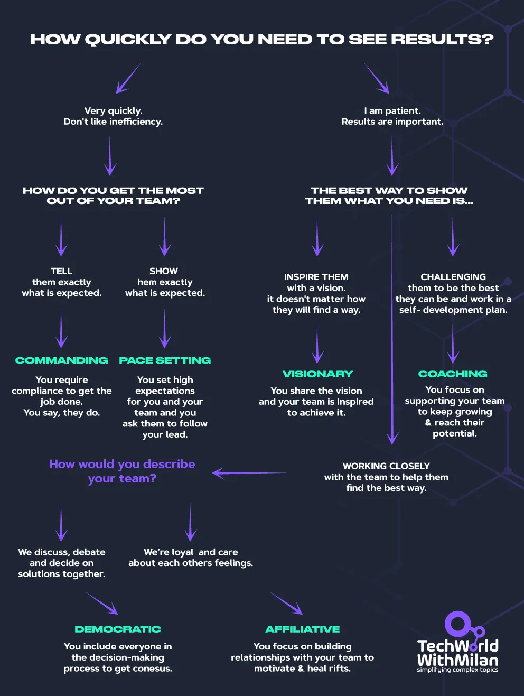
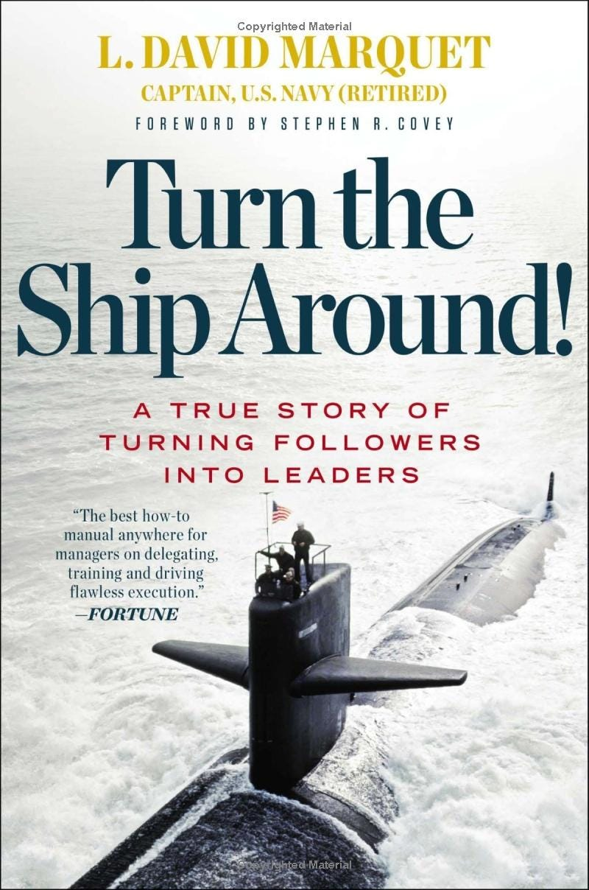
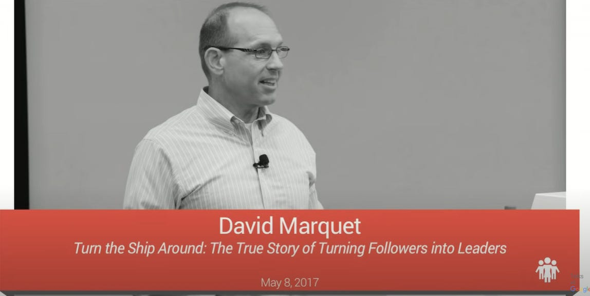

# Why You Should Use Different Leadership Styles?

Daniel Goleman, a psychologist and author, introduced six leadership styles in his 2000 Harvard Business Review article "**[Leadership That Gets Results.](https://hbr.org/2001/12/primal-leadership-the-hidden-driver-of-great-performance)** “Later in the book "**[Primal Leadership](https://amzn.to/481Vicc)**.” These styles are based on the concept of emotional intelligence, and each has its strengths and weaknesses. The six leadership styles Goleman identified are:

1. **Visionary Leadership**: Leaders inspire and motivate their team by setting clear goals and expectations ("Come with me" approach). This style is effective when a clear vision is needed or when a new direction is necessary.
2. **Coaching Leadership**: Coaching leaders focus on their team members' personal and professional development ("Try this" approach). This style is most effective when helping individuals improve their skills or working with a team member who is motivated to learn and grow.
3. **Affiliative Leadership:** Affiliative leaders prioritize building solid relationships and fostering a harmonious work environment ("People come first" approach). This style is most effective for resolving conflicts, boosting morale, or strengthening team bonds.
4. **Democratic Leadership:** Democratic leaders involve their team in decision-making and encourage open communication ("What do you think?" approach). This style is effective when seeking input from team members or building consensus, but it could be better when quick decisions are needed.
5. **Pacesetting Leadership:** Leaders set high standards and expect their team to perform at their best ("Do as I do, now." approach). This style can be effective when driving a team to achieve quick results or working with a highly skilled and motivated team.
6. **Commanding Leadership:** This style involves a leader who demands immediate compliance from their team ("Do what I tell you." approach). It is most effective in crises, when quick decisions are required, or when dealing with problematic employees.

Common Leadership Styles

To be an effective leader, you must adapt your style to your team's specific situation and needs. Great leaders often use coaching, vision, and other types when needed.

Spend time reflecting this weekend and ask yourself, "**Which leadership style resonates most with me?**" What do you need to become a better leader?

[Primal Leadership](https://amzn.to/3TXp3X1) by Daniel Goleman, Richard Boyatzis, Annie Mckee

Here is the **short infographic** you can use to decide which leadership style is the most suitable at a given moment:

Deciding on a leadership style

---

## Why should you be a servant leader?

Servant leadership is a leadership style that emphasizes the role of the leader as a servant to those they lead. Instead of the traditional top-down hierarchical style, the servant leader works to serve their team members' needs, aspirations, and growth. The basic idea of servant leadership is that the higher we move up in the organization, the more people we are there 'to serve,' not the more people who are there to 'serve us.' After many years in different leadership variations, I concluded that you should always treat your reports with the “*How I can help you*” mindset.

In his book,  “**[Turn the Ship Around!: A True Story of Turning Followers into Leaders](https://amzn.to/3qPiMkl)**” L. David Marquet, a former U.S. Navy captain, describes how the submarine had the lowest morale and performance metrics when he took the submarine. He made it one of the most successful submarines in the Navy's fleet by adopting this leadership model.

What are the main learning points from the book:

1. **Leader-Leader Model**: This approach aligns with servant leadership, shifting from command and control to empowering individuals to take leadership roles.
2. **Empowerment**: One of Marquet's most significant changes was empowering crew members to make decisions without always seeking top-level approval. This mirrors the servant leadership idea of empowering individuals to take initiative and responsibility.
3. **Competence and Clarity**: The author stressed that competence and clarity are essential for empowerment to work. This aligns with the servant leader's commitment to nurturing people's growth and ensuring they have the skills and understanding to perform their roles.
4. **Active Listening:** Like servant leaders, Marquet understood the importance of listening. By valuing the crew's perspectives and feedback, they could make more informed decisions and foster a culture of trust.
5. **Decision Making:** Instead of giving orders, Marquet would ask his subordinates how they intended to handle situations, pushing the authority for decisions down the ranks. This decentralization is a core component of servant leadership, where the goal is to create more leaders, not followers.
6. **Building Trust and Community**: He built trust and community by giving up control and empowering his crew.
7. **Commitment to Growth:** Marquet was committed to the growth and development of his crew, both professionally and personally, much like the emphasis servant leadership places on the evolution of individuals.
8. **Long-Term Vision**: While immediate results were essential, Marquet focused more on creating a sustainable leadership model that would benefit the ship and its crew in the long run.

Turn the Ship Around book by David Marquet.

You can check **[his speech](https://www.youtube.com/watch?v=IzJL8zX3EVk)** at Talks At Google if you like the video more.

Turn the Ship Around, David Marquet (Talks at Google)

---

## How do you give direct feedback while still caring about your people?

It can be difficult to accept feedback from your people and encourage them to exchange it. If you can learn to do that better, it will help you grow to become the best people manager you can be.

So what is **Radical Candor,** and why should you incorporate it into your culture?

In a nutshell, Radical Candor is the capacity to **question directly while simultaneously demonstrating a genuine concern for the other person**. If done correctly, it will assist you and everyone you surround yourself with in producing the best work of your/their lives and cultivate dependable connections throughout your professional life. Although providing constructive criticism might seem like a no-brainer for improving a team's communication and level of trust, it is uncommon. Effective criticism and appreciation **require a personal connectio**n. You must bring your entire authentic self to work and leave nothing behind.

How to get started with Radical Candor?

1. **Get feedback from others** - create an example you welcome and deliver constructive feedback (lead by example).
2. **Give and gauge feedback** - challenge directly and show that you care personally.
3. **Encourage feedback** - create actual processes that allow team members to feel comfortable voicing their feedback to one another.

Here is **an example**: Let's assume you're a manager, and you've noticed that one of your team members, Emily, consistently submits work late.

1. You'd start by **establishing rapport** with Emily, praising the high quality of her work to affirm that you value her contributions ("*Hey Emily, can I talk to you for a moment? First off, I want to say that the quality of your work is excellent. Your last project helped us improve our client's satisfaction*.").
2. You'd then **directly address the issue**, stating that her projects have been consistently late and explaining how this impacts the team. **Be specific and cite examples** to provide clear context (*"I've noticed that your projects have been coming in late recently. I understand you're aiming for high quality, but the delays affect the team's timeline and stress others. For example, the last project was due on the 1st, but it was submitted on the 5th.*
3. **Open the floor to her perspective**, asking if there are specific challenges and how you can support her in resolving them ("*Is there something specific causing these delays? How can I help you find a solution?*").
4. Finally, **discuss potential solutions** like setting deadlines ending on a note reiterating your appreciation for her skills and your intent to solve the problem together (*"Would it be helpful if we set interim deadlines, or maybe you need more resources?”*).

The key is to let your organization know that you're going to start speaking out a lot more and that you're not doing it to be rude or hurt anyone's feelings but rather because you genuinely care about each person you work with and want to support them in achieving the finest job of their lives.

Radical Candor (Credits: Kim Scott)

What is your experience with radical candor as part of your leadership toolbox?

If you want to learn more about it, I recommend the book "**[Radical Candor: Be a Kick-Ass Boss Without Losing Your Humanity](https://amzn.to/3ElUJfE)**", by Kim Scott.

---

## More ways I can help you

1. **1:1 Coaching:** [Book a working session with me](https://newsletter.techworld-with-milan.com/p/coaching-services). 1:1 coaching is available for personal (leadership) and organizational/team growth topics. Become a high-performing leader 🚀.
2. **[Promote yourself to 14,000+ subscribers](https://newsletter.techworld-with-milan.com/p/sponsorship-of-tech-world-with-milan)**by sponsoring this newsletter.

---

Thanks for reading Tech World With Milan Newsletter! Subscribe for free to receive new posts and support my work.