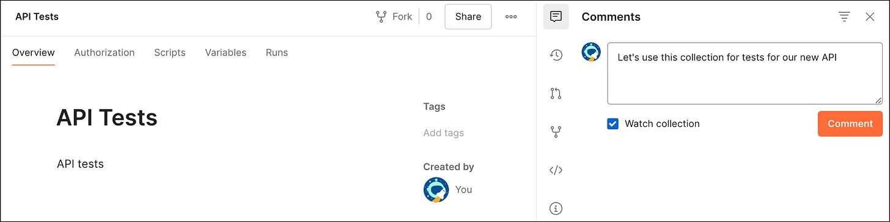
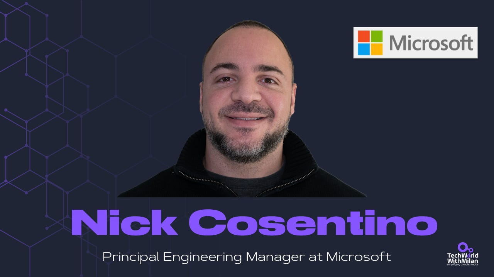
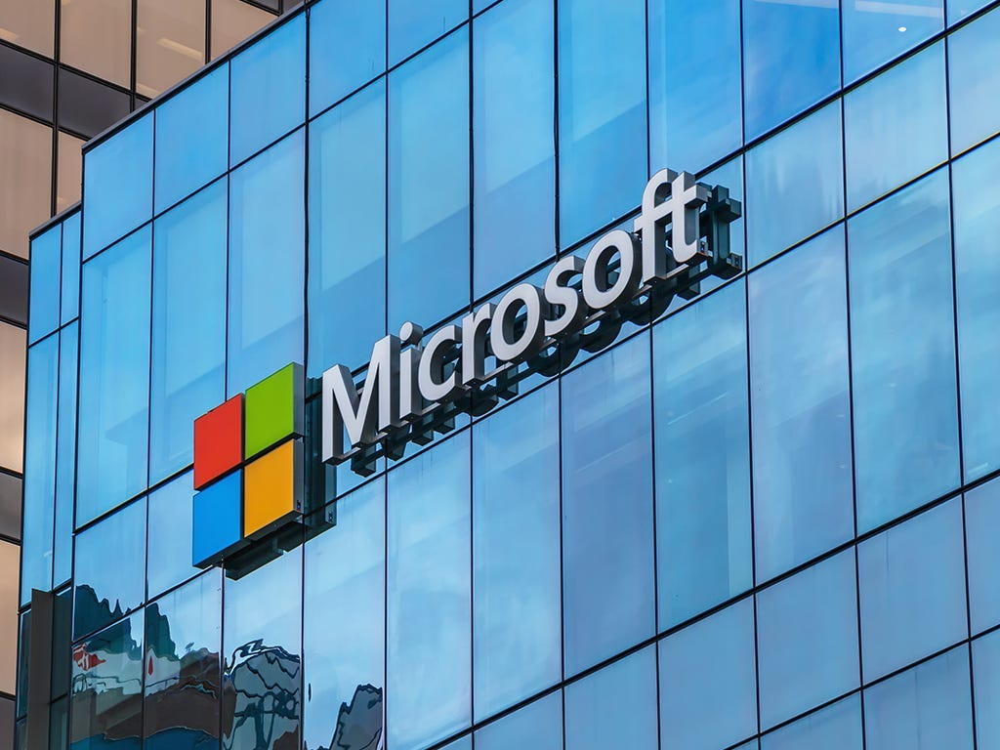
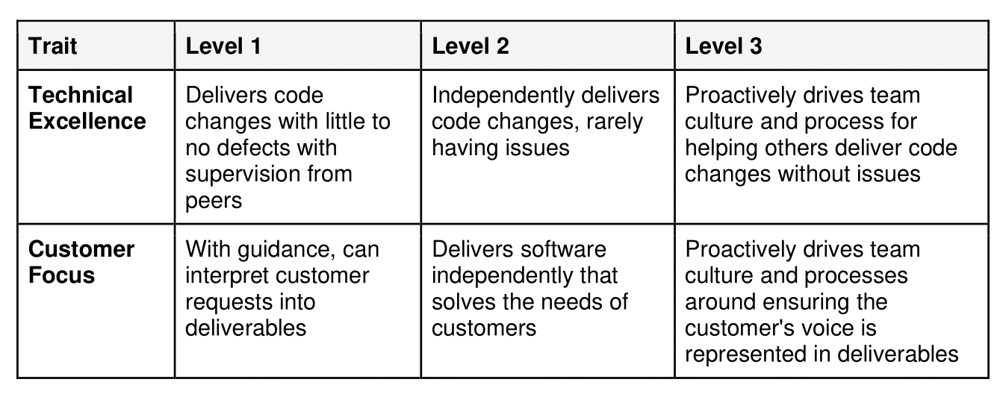
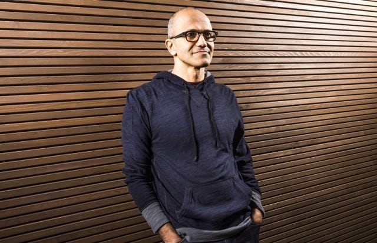
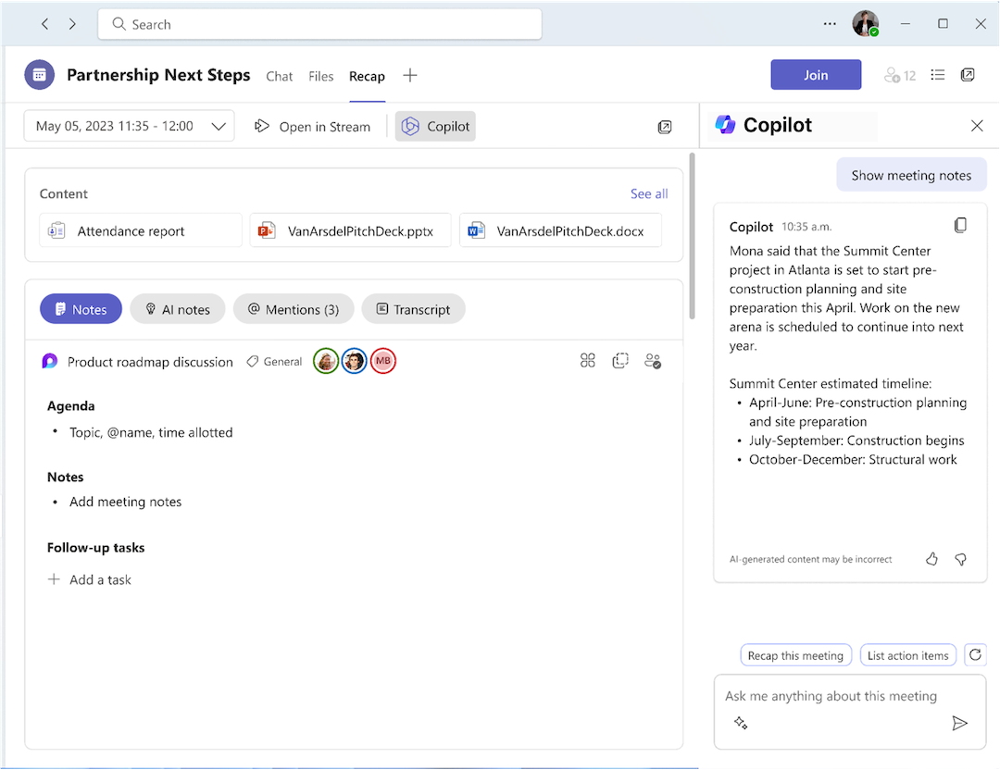
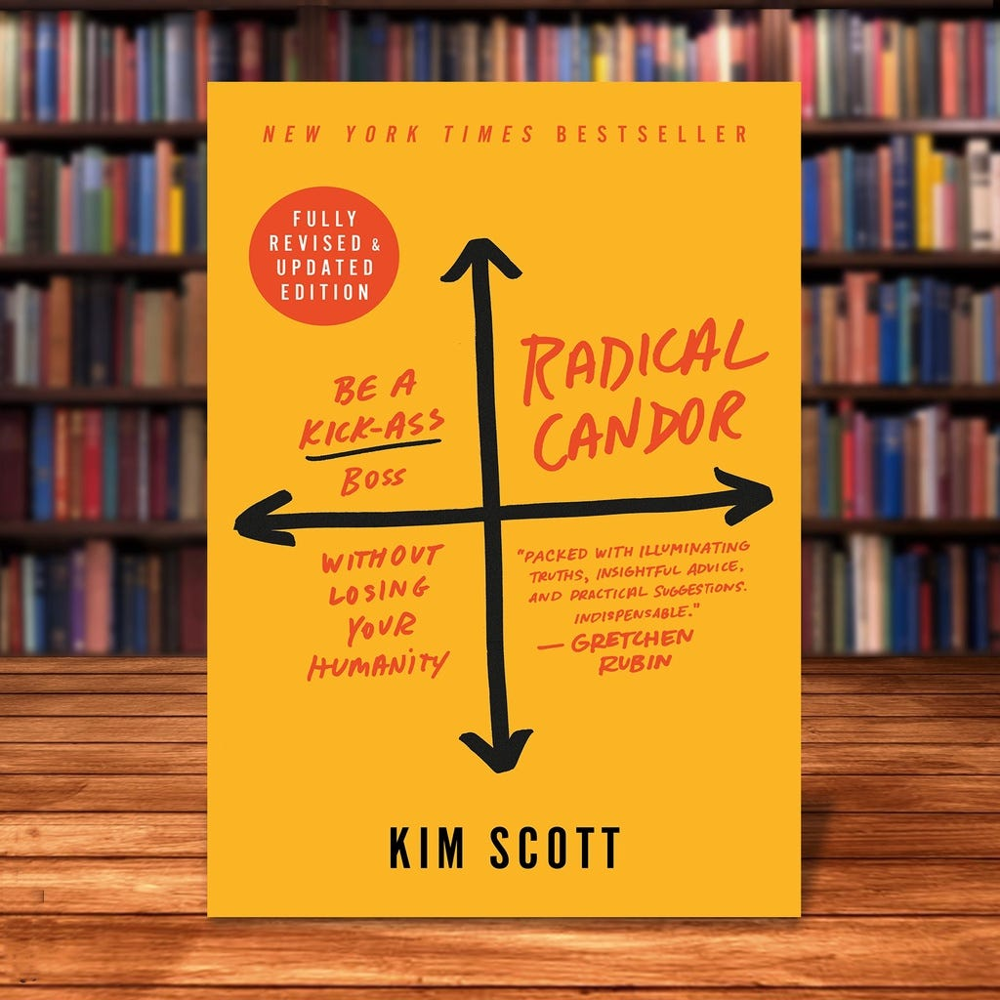

# Balancing Code and Teams: How Microsoft do Effective Engineering Management

*An interview with Nick Cosentino, Principal Engineering Manager from Microsoft*

In this issue, we talk with **[Nick Cosentino](https://www.linkedin.com/in/nickcosentino/)**, Principal Engineering Manager at Microsoft in Redmond, to understand his career journey, from scaling startups to leading high-performing teams at one of the world's tech giants (Microsoft). Nick shares his unique approach to engineering management, emphasizing situational leadership, transparency, and trust.

> *Note that Nick and I share a similar passion for [.NET technologies and C#](https://github.com/milanm/DotNet-Developer-Roadmap)*☺️.

So, let’s dive in.

---

## [Comment on collections, folders, and requests using Postman! (Sponsored)](https://learning.postman.com/docs/collaborating-in-postman/working-with-your-team/discussing-your-work/)

Launch into hyper-efficiency using comments to discuss your work with your teammates in Postman.

[Check it out!](https://learning.postman.com/docs/collaborating-in-postman/working-with-your-team/discussing-your-work/)

---

## 1. Who is Nick?

I’m a Principal Software Engineering Manager with 12 years of experience managing teams and 14 years of professional experience creating software. I create educational software engineering videos on [YouTube](https://youtube.com/@devleader) focusing on C# and dotnet for programming examples. I also publish a weekly [software engineering newsletter](https://weekly.devleader.ca), where I share actionable advice for software engineers based on my own experiences in my professional career.

I’m passionate about helping software engineers start their careers. I also enjoy sharing what I’ve seen work well in a startup that scaled from eight people to hundreds of employees globally. I try to remain as pragmatic as possible because I believe there is no right way to get things done; there are just different approaches with pros and cons that depend on the context.

## 2. What is your career journey?

I fit closer to the “stereotypical” software engineer. I knew I wanted to work with computers when I was a kid. I attended the University of Waterloo for Honors in Computer Engineering, which afforded me six internships at small companies where I had a meaningful impact.

When I graduated in 2012, **startups and small companies gave me an excellent opportunity to do my best work**. A small digital forensics company local to Waterloo that would go on to become Magnet Forensics reached out to me with an exciting opportunity to join their scaling startup. This was the jump-off point for my career.

Within a few months, **I managed other engineers at the startup while writing C# code almost daily, every day—but I had found something I loved to do**. I had the typical engineering manager struggle to balance my technical contributions with managing my teams, eventually leading to me starting my Dev Leader brand.

By the end of my time at Magnet Forensics, I had helped create most of their products. My tenure with the company meant I spent most of my day bouncing between teams, trying to offer guidance. The move to Big Tech meant I missed their IPO and subsequent $2 billion buy-back to private.

My time at Microsoft as a Principal Engineering Manager allowed me to work within **Substrate**, **the common infrastructure used across all Office365 services**. It exists to provide services with a standardized way to access data, authenticate, search, etc. Substrate saves service owners from reinventing the wheel so that these challenges can be solved in a common way as a platform.

Within Substrate Deployment, I managed some teams responsible for deploying hundreds of services to hundreds of thousands of machines worldwide for Office 365. More recently, I have moved into Substrate's routing and DDOS protection side and continue to manage teams in this fun and challenging environment!

## 3. What is your approach to leading a diverse engineering team?

My outstanding HR leader at Magnet Forensics instilled **situational leadership**, **transparency, and trust in me early on**. My philosophy is that as an engineering manager, my primary goal is to enable my team to do their best work possible.

Situational leadership is critical because every individual will need a different strategy to help them become the best engineers they can be. How they prefer feedback, their career goals, challenges, interests, and what keeps them engaged vary from individual to individual. While I don’t follow a concrete framework for this,**I try to work with every individual to understand their unique circumstances**. I layer my management and leadership philosophies onto these relationships afterward so that it all starts with the individual. **I firmly believe that investing time in your team to understand them as individuals is critical for being an effective leader.**

I also strongly believe in **being as transparent as possible**. There is still messaging that gets filtered because, as leaders, we’re still responsible for not overwhelming our teams with information that may be distracting. However, I work with my leadership and management peers to ensure alignment, bringing this transparency to the team.

Finally, one of the most critical aspects is **trust**. I work on building trust with my teams by taking accountability and then following through on my actions. I demonstrate to my team members that I am there to help them grow and succeed, and they become transparent with me. It’s a positive feedback loop but requires situational leadership and transparency.

These approaches help me to create a team environment where there’s psychological safety, a safe place to fail, and individuals who feel valued and supported in their career growth.

## 4. What are some of your biggest challenges as an engineering manager?

Initially, the biggest challenge was balancing individual contributions with helping level up the engineers on my team. I think this is one of*******the*****most challenging things to figure out because often, we start as high-performing individual contributors, and our measure of success is our impact**. It takes realizing that you can have a greater overall impact by focusing on your team -- an actual multiplier effect.

> *Read more **[here](https://newsletter.techworld-with-milan.com/p/how-to-be-a-multiplier-as-a-leader)** about how to become a multiplier as a leader.*

One of my biggest challenges today is **balance**, but it looks different. I need to balance and align business priorities with skill sets, interests, and growth opportunities for my team members. It’s not every day that these all line up ideally, but it does take regular communication and investing in the team to try and optimize for this.

Going back to situational leadership, I try to build the framing for **where my team is and where they’re heading concerning engagement, career growth, etc.** When I factor in business priorities, I’ll consider deadlines and timeframes to see **if we can move slower** because it’s an employee learning or engagement opportunity. Maybe it means getting someone else skilled in an area for continuity within the team or providing a chance to practice working cross-team on a bigger project as a growth opportunity.

Other times, we have something with an extremely tight schedule that is mission-critical to get landed. This is where I’ll lean more into skillsets and experience to derisk as much as possible. Of course, we want to avoid having these situations occur repeatedly, and this ultimately gets better by skilling up the entire team and giving them growth opportunities.

Ultimately, if we invest in our team members and ensure they’re engaged, they’ll deliver outstanding results for the high-impact areas of the business.

## 5. How do you see the role of engineering managers evolving in the next five to ten years?

This is more of a hope for me because I’ve felt like there has been a trend on this for a while now: **Engineering managers as people-first roles**.

Historically, many companies have promoted very strong individual contributors to management positions. It’s as if the “next level” for them is to take on a team now and manage others. The thought process, I suppose, is that if you have demonstrated technical excellence in an area, then you should be able to manage the people in the area.

This is a flawed philosophy. This pattern prioritizes an engineering manager's focus on technical aspects. Instead, **finding individuals who have been great team leads and/or have a strong interest in working with people seems to be the direction we’re moving in**.

Of course, some companies require more technical contributions from managers than others. However, I believe the common focus is people first, and we should be putting people into these roles who love working with people. I’m hopeful this trend continues.

## 6. What advice would you give engineers aspiring to management roles?

My biggest tip is to **understand that engineering management is extremely difficult from being a technical individual contributor** -- and the role itself can vary dramatically from company to company in terms of expectations.

Overall, an engineering manager is a very people-focused role. **If you don’t like spending a lot of time working with people, investing in understanding them, building deep trust relationships, etc… then management will be a rude awakening**.

If you align with what’s involved in a management role, focus on informal leadership opportunities. That could be mentoring more junior engineers, helping our peers, working towards a team lead role… Getting more exposure to helping others while not dropping your technical focus will be a great way to demonstrate that you are preparing for such a role.

## 7. How can engineering managers best support their teams' professional and personal growth?

This is definitely where situational leadership comes into play! I highly recommend that every engineering manager carve out time to chat one-on-one with their team members every week. But **the focus of these one-on-ones is what matters**!

My philosophy is that the **agenda of one-on-ones should be driven by the employee and not dictated by the manager**. Said another way, it’s a meeting to benefit the employee and not to serve the manager’s interests. Managers can reach out as necessary to get the information and updates they need separately from one-on-ones.

In one-on-ones, managers should **create an open space for their employees to discuss whatever is on their minds**. This can be done by **building trust early in the working relationship, showing genuine interest in what employees speak about, and demonstrating accountability**. You’re not just waiting for your opportunity to respond without actively listening. I’ve found that employees can quickly form trust relationships if you indicate that you genuinely care about them and their challenges and are invested in their career growth.

Because many engineers will often resort to status updates in one-on-ones, try to steer them into sharing impact instead of granular details. If you haven’t had career conversations lately, suggest in an upcoming one-on-one that you dedicate time to discussing alignment on career progression.

Alignment is crucial to team members' career growth. **Ensure that your team members clearly understand how they’re progressing, what areas they need to improve on, and where their best areas for growth are**. This helps reduce surprises around promotion and reward periods and gives you and your employees a common ground for what’s essential in their growth.

A tool that you can use for career growth alignment is a **rubric**, which may take many different forms depending on your company culture and the organization in which you’re located. A rubric provides a **matrix-like organization of traits and characteristics and examples of the expected behavior at different career levels**. I like to have conversations with my employees where I can tell them what I am observing, allow them to express where they feel they’re at, and agree on the top areas that would be good to focus on. This helps demonstrate that my goal as a manager is not to hold them back but to help propel them in their careers.

An example of levels and data points that can be used for Rubric

## 8. How would you describe Microsoft's engineering culture today?

Microsoft heavily values **diversity and inclusion**, which brings together people from different backgrounds, experiences, and perspectives. This is critical for innovation. Diversity isn’t just something that gets slapped onto a poster and put online—**it’s discussed at all levels of leadership by individual contributors. It’s even part of our performance review process!**

The **blameless engineering culture** allows for opportunities to push boundaries, and you’ll hear Satya discussing “Growth Mindset” as well. **Creating a safe-to-fail environment helps with psychological safety and, coupled with a Growth Mindset**, encourages engineers to go outside their comfort zone.

Microsoft has “**Fix Hack Learn**” weeks multiple times yearly, during which engineering teams are strongly encouraged to work on things other than their standard deliverables. This could involve hacking a new prototype together or learning a new skill or tech stack you’ve always wanted.

As engineering managers, we need to understand our employees' growth trajectory. Whether it’s growth in technical areas or otherwise, we must align and set people up for success.

## 9. What practices does Microsoft prioritize to ensure high-quality software development?

I’d highlight three significant things in my team: a **blameless post-incident review culture, safe deployment practices,**and **a One Microsoft view**.

Issues will always arise when developing software, especially with live services—we’re only human. Substrate's **post-incident review culture** is fantastic because it’s done blamelessly, and all teams can benefit from the retrospective process. The bar is held very high to ensure that the repair items benefit Substrate and nobody is blamed.

When incidents meet a severity level (Sev0 and 1 for us), teams must complete a timeline of events that led to mitigation. They also perform a “**5 Whys**” analysis to help get to the incident's root cause, which helps illustrate that it wasn’t just the result of a person doing something wrong. Teams work with partner teams around repair items that would help address these concerns and then present them in a forum with other teams to share learnings and get feedback.

**Safe deployment practices** also help ensure the quality bar is held high. The Deployment team within Substrate ensures that changes are rolled out incrementally so that monitors and probes can identify any regressions using technology specific to Substrate. Multiple platform teams enable this tech for the service owners and other team owners to ensure safe changes. Should wrong signals be detected based on monitors that teams could configure, we should be able to roll back quicker than we were moving forward to correct the issue.

Teams are also encouraged to use **flighting techniques on top of safe deployment practices**. We use more Microsoft tech for flighting, generally, configuration changes, whereas safe deployment is usually more about binary and code changes. The concepts are similar, though, where teams will turn on their flight in a smaller impact area within internal test capacity. When they have validated their changes, and the monitoring tech is working, they can expand the flight to a broader capacity scope. This helps ensure that they can be aware of issues as soon as they happen and turn off problematic paths as fast as possible by disabling the flight. Should a service outage occur, we refer back to the post-incident review process!

Finally, I’d like to mention the **One Microsoft philosophy** because it’s critical. Microsoft is a huge company, and the likelihood that similar initiatives will kick off in different areas of the company is undoubtedly greater than zero. As a result, we always strive to try and converge on technology where it makes sense so we can channel our resources together instead of working in parallel. This philosophy helps us think about collaborating on tech and initiatives together because it’s for the greater good of Microsoft and not just a local priority for our teams.

Satya Nadella brought the “[One Microsoft](https://www.livemint.com/news/business-of-life/how-satya-nadella-brought-a-growth-mindset-to-microsoft-11614874643362.html)” philosophy onboard when he became CEO in 2014.

## 10. What emerging trends in software engineering are you most excited about?

Probably like most people right now: **AI**! Many are nervous about what AI means for their role within software engineering, especially with the fear they might be replaced or become obsolete.

However, AI is like any other tool with a significant impact. **It will replace parts of our jobs and enhance different parts**. But at the end of the day, it should make us overall more effective at working on bigger challenges.

Microsoft has the unique advantage that nearly all our tools have some Copilot AI technology built-in. **I like Copilot for meeting summaries**. I can ask Copilot to find me the spot in a call where something critical was mentioned that I didn’t write down. I can get a list of action items with owners afterward to stay present in meetings without scrambling to take notes. **Our teams leverage AI when writing code and build tools and infrastructure to help debug and troubleshoot live incidents**. Many teams have notes on how to troubleshoot things, but it can be challenging to identify the scenario and find the documentation to help; AI can be a great help here.

I think leveraging AI to analyze trends better will be foundational. There’s so much data; as software engineers, data can be noisy if you’re not using it with a particular goal. However, I am curious to see if AI will help uncover interesting correlations across data sets that may have otherwise seemed like noise to us. Even in this example, **AI would potentially be replacing the job of trying to find trends** -- but once the trends are identified as software engineers, we can put our attention into driving action effectively.

It will be incredible to see the effectiveness of software engineers increase over the next few years as LLMs and other AI technologies become more advanced. I’m excited, not fearful.

Copilot in Microsoft Teams meetings ([source](https://support.microsoft.com/en-us/office/get-started-with-copilot-in-microsoft-teams-meetings-0bf9dd3c-96f7-44e2-8bb8-790bedf066b1))

## 11. How do you maintain a work-life balance while handling the demands of your role?

I have had to **make a prioritization** around this in recent years because I used to be terrible at it. Before Microsoft, I worked at a startup for 8 years. Nobody forced me to work long hours there, but I’d often be working 60-80 hour work weeks because I loved work and there was always work. I had feedback several times that it starts to give the impression that others think I may expect their exact behavior, but I never would expect that of anyone.

Two significant shifts happened around the same time, though Much of the world switched to remote work, and I went from startup life to Big Tech. These were two enormous paradigm shifts for work that would affect work-life balance and how one navigates that challenge.

Firstly, **flexibility is essential with teams across the planet in different geographies and time zones**. However, if I’m taking a meeting late, I’ll try to be flexible on another day with my start/end or lunchtime. I find this easier to balance now because I try to remind my team that I expect them to do the same thing and I need to lead by example. I greatly appreciate their flexibility, and if I can lead by example to show them that I do the same, they will trust that I mean it.

Secondly, I know that with remote and hybrid work, there will be situations where life comes up. People need to run errands. There’s a situation at home. Whatever it is, these things come up for me AND my employees -- so again, **it’s all about leading by example to show we have that kind of flexibility**.

In my role, I still try to focus on “**Servant leadership**,” and I like letting my team know they can reach out to me anytime for help. If they understand that I am not always immediately available but that I’ll respond when I can, it creates a balance I’m happy with. I want to be there for them as much as possible, but I cannot be glued to a computer.

> *Learn more about servant leadership **[here](https://newsletter.techworld-with-milan.com/i/136186554/why-should-you-be-a-servant-leader)**.*

## 12.  What practices or habits help you stay productive and focused?

I lean into **content creation to stay up-to-date on technical matters**. As an engineering manager, I want to ensure that I keep my technical edge, as I previously used to code and manage teams simultaneously, which became one of my strengths.

For engineering management and leadership, I surround myself with other engineering leaders on **LinkedIn** so I can routinely read about their insights on a near daily basis. I don’t feel there’s a single right way to lead and manage teams, and the more perspectives I can hear about, the more opportunities I have to be creative in my approach. I’ll sometimes see something I disagree with, but the author provides an explanation I had never considered before, and the result is that now I have a unique view that I may be able to incorporate as I lead my teams. Of course, being on the Internet, I don’t blindly follow everything I read; I**seek to understand the perspective and see if I have a way to apply it**.

I like to use **time blocks in my calendar** to get uninterrupted time to work through different things. Related to that, if I’m being invited to meetings with no clear goals, I like to ask the organizer about the intention and goals because I won't be there if I’m not needed. Someone can constantly update me afterward if it’s even necessary.

Achieving focus can be challenging, depending on the environment. If I work from my home office, **I like to make sure my phone is not right in my face**. Even if it’s just work notifications, it distracts me from what I’m doing.

In the office, it can be people. The interactions with other people are unique, and I miss being fully remote for the past few years. But because of that, it can be easy to get distracted in deep conversation. It’s not that the conversations aren’t valuable; it just means that work that was planned is not getting attention. I try to be cognizant of this, but it’s still a new and unique experience.

## 13.  Do you have any resources to recommend to aspiring engineering managers?

One of the best resources you can have as an engineering manager is a **network of other engineering managers with whom you can bounce ideas**. While this isn’t a formal resource, I think it’s the most beneficial because you’ll hear and share real examples of challenges and situations to navigate. I get this formally through **Management Mentorship Circles (MMC) at Microsoft**, where engineering managers are put into groups to learn from each other. I also have a network of engineering managers I follow and engage with on **LinkedIn**.

One book I think is essential for every engineering manager is “**[Radical Candor](https://amzn.to/3RHzdcm)”** by Kim Scott. I generally find most managers fall into two of the four categories described in the book. One group is called Ruinous Empathy, where engineering managers help their employees by mostly being passive and avoiding any conflict or tough love. But as the name suggests, this is ruinous because it doesn’t encourage growth due to complacency. Many other managers fall into the opposite quadrant, called Obnoxious Aggression. However, Radical Candor allows managers to give critical, direct feedback because they’ve built solid, trusting relationships with their employees.

“[Radical Candor](https://amzn.to/3RGe0Qg)” by Kims Scott

—

Thank you, Nick, for your time!

---

## More ways I can help you

1. **1:1 Coaching:** [Book a working session with me](https://newsletter.techworld-with-milan.com/p/coaching-services). 1:1 coaching is available for personal and organizational/team growth topics. I help you become a high-performing leader 🚀.
2. **[Promote yourself to 32,000+ subscribers](https://newsletter.techworld-with-milan.com/p/sponsorship-of-tech-world-with-milan)**by sponsoring this newsletter.

---

Thanks for reading Tech World With Milan Newsletter! Subscribe for free to receive new posts and support my work.