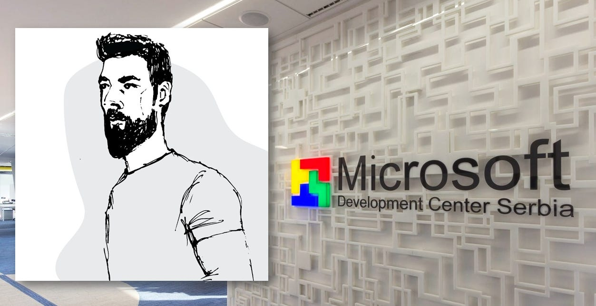

# Becoming a Senior Software Engineer at Microsoft

*with Mihailo Joksimovic, a Senior Software Engineer at Microsoft.*

This is **an interview with** **Mihailo Joksimovic, a senior software engineer at Microsoft**. In this text, we will talk about Mihailo’s career path and how to get a job at Microsoft as an engineer and work there.

## 1. Can you give us some background information about yourself?

My programming journey started some **15+ years ago**. During college, I worked with anything I could get my hands on – Python, Java, PHP, and some C and C++. As a result, I’m pretty much obsessed with the internals of C++ and CLR. Still, I’m sure that once I satisfy this curiosity, I’ll move toward understanding Rust and, eventually, Go.

## 2. How did you get into the field of software engineering? What are your career goals?

I was hooked on programming when I was seven and pursued that path. I was lucky enough that programming allowed for a comfortable living, which made it possible to combine passion and finances into one.

My mid-term goal **is to try and do my best to become one of the better engineers**in the Microsoft Development Center (MDCS) in Serbia. This is a neat goal because it combines reality and a challenge. Now, my plan to reach this is to combine multiple skills I think I’m passionate about – programming, speaking, writing, and drawing. The thing is that MDCS is full of highly talented people, and I believe that to compete at a higher level, you have to go beyond “regular,” and that’s precisely what I’m aiming at.

## 3. In your previous company, you were an Engineering Manager; was that a natural path for you?

I must admit that **my path into EM was anything but natural. First, I dreaded the idea of walking anywhere close to management**. From my perspective, management was that doomed place where you had to go and instruct people on what to do. I wouldn’t say I liked it, or at least I thought I did. But the truth is – I was scared.

To make the whole situation even more ridiculous, I kept getting into Lead Dev / Team Lead positions, mainly because my brain has a shallow filter for what’s socially acceptable. So I’d just be one of the most vocal people in the room, and not because I was the smartest, but primarily because I never saw anything as inappropriate, so I kept clarifying and asking about things I didn’t get. I presume people saw value in it and combined with the fact that I loved coding, it kept pushing me towards more vocal positions.

What eventually got me into the EM position was my previous boss. When he decided to leave, he didn’t ask me whether I’d take over, but he started preparing me to take his position.**So naturally,**I took the challenge, but just like with everything else – **I prepared myself by getting engaged with many resources – books, podcasts, videos, and blog posts.**

## 4. After the EM position at your previous company, have you still decided to move towards a Software Engineering position at Microsoft?

Some time ago, I stumbled upon Charity Major’s blog post titled [“The Engineer/Manager Pendulum.](https://charity.wtf/2017/05/11/the-engineer-manager-pendulum/)” It boils down to the fact that **your career shouldn’t be IC or EM but rather a healthy mixture of both.** You can and absolutely should move between the two all the time. I took that to heart.

When I applied to Microsoft the second time (the first one already failed some time ago), I started contemplating “moving back” to the IC track and gaining some knowledge on how the IC route works in Big Tech. However, I was also doubtful about my effectiveness if I jumped there as an EM without knowing how IC processes work.

Why I decided for Microsoft – **Big Techs are places where you get to work on significant projects used by millions, if not billions, of people**. The scale is massive, the impact is overwhelming, and the culture is grounded in tech. Microsoft allows you to work on things you can’t get elsewhere.

## 5. What steps did you take when you decided to pursue your career at Microsoft?

I devised a straightforward plan – **I will wake up every morning and immediately start working on a single LeetCode problem, timeboxing it at 30 minutes**. This made much sense because, based on my research, everyone suggested that if you can’t solve a problem within 30 minutes, you’d be out of time on the interview anyway. So that made 30 minutes a sweet spot, after which I’d look up the solution and hope to be better tomorrow.

Additionally, I spent 20 to 30 minutes every evening **studying system design**. I did have one advantage here – I worked as a Software Architect for a long time and knew quite a few things about Systems. What I needed, though, was to focus on the breadth of the problems, and that’s what I settled to do. And yes, trust me – 30mins can be a lot!

The last piece of the puzzle was essential interview skills. I knew that presenting yourself and doing interviews is a skill, so I decided to go a straightforward route – **I'll apply for as many companies as possible and practice interviewing**. This led me to do at least 30-40 interviews, if not more. Finally, I was aware that you are allowed to apply to Microsoft more than once per year, so I was pretty much determined to use that – apply, do an interview, gather feedback, see which areas need improvement, and repeat.

## 6. How did you prepare for an interview? Can you give us some hints and resources?

There are several areas that you need to prepare for:

- **For Algorithmic and Data Structure problems,**I primarily used**LeetCode**. I did, however, start with **[Cracking the Coding Interview](https://amzn.to/4a1uhXw)**, but I soon learned that having something interactive makes for a way better experience.
- **For System Design,**I primarily relied on a combination of****books****“**[Designing-Data Intensive Applications](https://amzn.to/3ZCNTuu)**”****by Martin Kleppman and****“**[System Design Interview vol. 1](https://amzn.to/42ZOmd0)**”****by Alex Xu. The former provided an incredible depth of the matter, whereas the latter introduced me to the breadth and broad spectrum of possible problems I could encounter during an interview.
- **For the Behavioral Interview,** I primarily relied on doing as many real-life interviews as possible, writing down my questions, and thinking about the answers. That was pretty much it, really – do as much as possible & improve over time.

On top of these, which I’d refer to as “Core Preparation Materials,” I spent quite some time watching MIT’s Lectures ([CS6.006 - Introduction to Algorithms](https://ocw.mit.edu/courses/6-006-introduction-to-algorithms-spring-2020/video_galleries/lecture-videos/)).

> Check here for the **[Bonus interview tips](https://careers.microsoft.com/us/en/interviewtips)** for all roles.

## 7. How were the interviews? How many discussions have you had, and on which topics? Could you give recommendations here to others?

You have five interviews plus the 3-hour-long Online Coding assignment. The timeline is as follows:

1. **First, you have a Screening Interview,** which boils down to discussing your career, wishes, interests, expectations from Microsoft, etc. There are no coding questions here, and the whole point of the Screening is to screen out people deemed incompatible with Big Tech Culture.
2. If you pass the screening interview, you will be sent a link to**the online coding assignment on Codility**. You are free to do it whenever you want, but once you open the test, you have three hours to work on four Algorithmic problems. And here, you are expected to solve at least three of four challenges.

The good thing about Codility is that it’s okay to copy the code to your IDE so that you can debug and test properly. The bad thing is that if you’re not prepared upfront, there’s no way you will solve those problems promptly.

For more **Senior roles**, instead of Codility, you would get an interview with a Senior Interviewer.
3. **You are scheduled for four back-to-back interviews if you pass the Online Assignment**. This used to be on-site before COVID hit, but now it’s all online. Each discussion lasts around 50 minutes, and you get 5-10 minutes to freshen up and prepare for the following interview.

The structure of these interviews is as follows:

1. One is a **behavioral interview**, which means just talking to the person on the other end.
2. Two of them are **pure coding** – you get a Leetcode-like problem, and you have some 25-30mins to develop a solution. It sounds scary, but it’s better than Online assignments because interviewers are actively working to assist you.
3. The last one is a system design interview. It was on par with the content from the "[System Design Interview](https://amzn.to/42ZOmd0)” book. The interviewer is also actively helping you here. **One cool thing you need to understand about System Design interviews is that they are open-ended and have no right or wrong answers**. What interviewers are looking for is how much you know the concepts of System Design and how good you are at extracting the requirements of the problem.
4. Finally, **a week or two after these interviews**, you hear back from the recruiter regardless of the news. If you fail, they offer you feedback.

## 8. How does your typical working day look like at Microsoft?

Regarding Microsoft, Development Teams have complete freedom to get their work done. **Each team can choose whatever results**if the code, communication, and teamwork are on par with Microsoft’s standards and date commitments are met.

For example, some teams will stick to Agile (e.g., **Scrum**) and instrument their work and techniques according to Agile principles. On the other hand, some groups prefer to go **less formal**, having (bi)weekly sync meetings to track their progress.

Specifically, I usually arrive at the office in the morning and spend every minute problem-solving – be it by coding or trying to understand how stuff works; I spend 95% of the time being focused on the Project and the Tasks I’m working on.

## 9. Which tools do you use at your job?

This differs from team to team, which makes sense, given the scale of Microsoft. Generally speaking, we rely a lot on publicly available tools. We use **Azure DevOps** heavily for everything from code hosting through issue tracking to hosting tons and tons of pipelines. We rely a lot on **msbuild** for anything that requires assembling the stuff. We use **Azure Monitoring Agent and Azure Data Explorer** to deal with telemetry.

As for language choice, as I work in the Azure SQL Managed Instance (SQL MI) team, the whole **SQL Server codebase is written in C++**, whereas everything related to **Azure and Azure SQL**is a combo of**C++**and **C#**. As for the front end, I believe it’s primarily done in **TypeScript**.

## 10. Which roles exist at Microsoft in development teams, and how do they differ?

Microsoft Development Center in Serbia is rather big, so I’m unfamiliar with all the existing roles. However, I can tell you about positions I’ve observed and interacted with while working in the Azure SQL Development Department. As you can imagine, there are:

- **Software Engineers** whose main job is to work on the code side of the product.
- **Program Managers,** whose role is most similar to Product Managers, except that most folks I met are highly technical-focused. Lots of them used to be Software Engineers. Program Managers (PMs), aside from being incredible visionaries, program managers (PMs) are primarily focused on envisioning the products and communicating with customers to understand their needs better.
- And finally, **Engineering Managers**, most of whom used to be Software Engineers before, so they are highly technical but decided to develop some other skills as well.

## 11. How do you educate yourself?

The way I do it is that**for whatever I’m trying to learn, I create a series of [Infographics](https://www.bitesizedengineering.com/)**. So, for example, I wanted to know SQL Server’s Storage Engine Internals, and I got myself a couple of books and started ingesting them and creating summaries out of them.

**Books**are my favorite learning method, and I find my Kindle to be one of the things I couldn’t live without. I have tons of books on it, and I’m constantly skimming through various exciting topics.

I’m also trying to stay relevant by reading **HackerNews,** which filters out most of the noise and leaves only the juicy stuff.

Thanks for reading Tech World With Milan Newsletter! Subscribe for free to receive new posts and support my work.