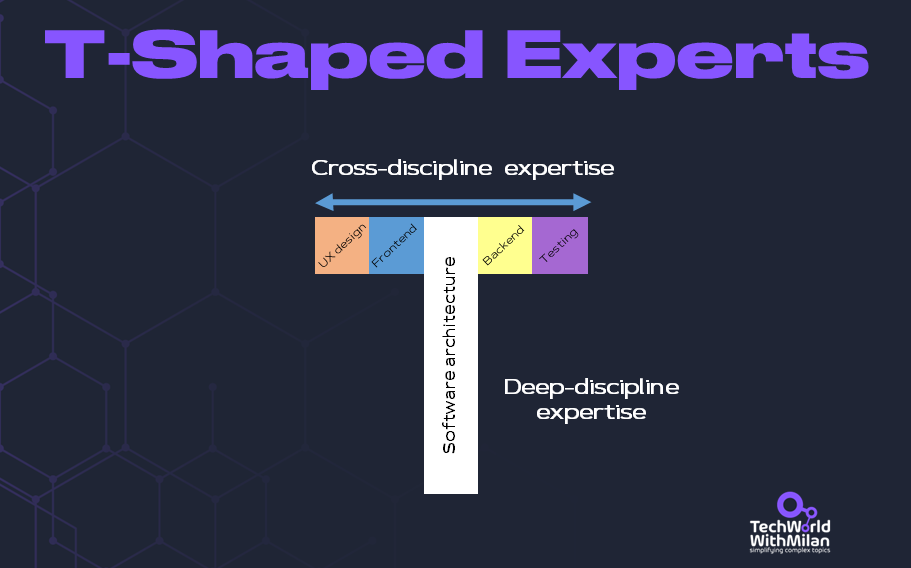
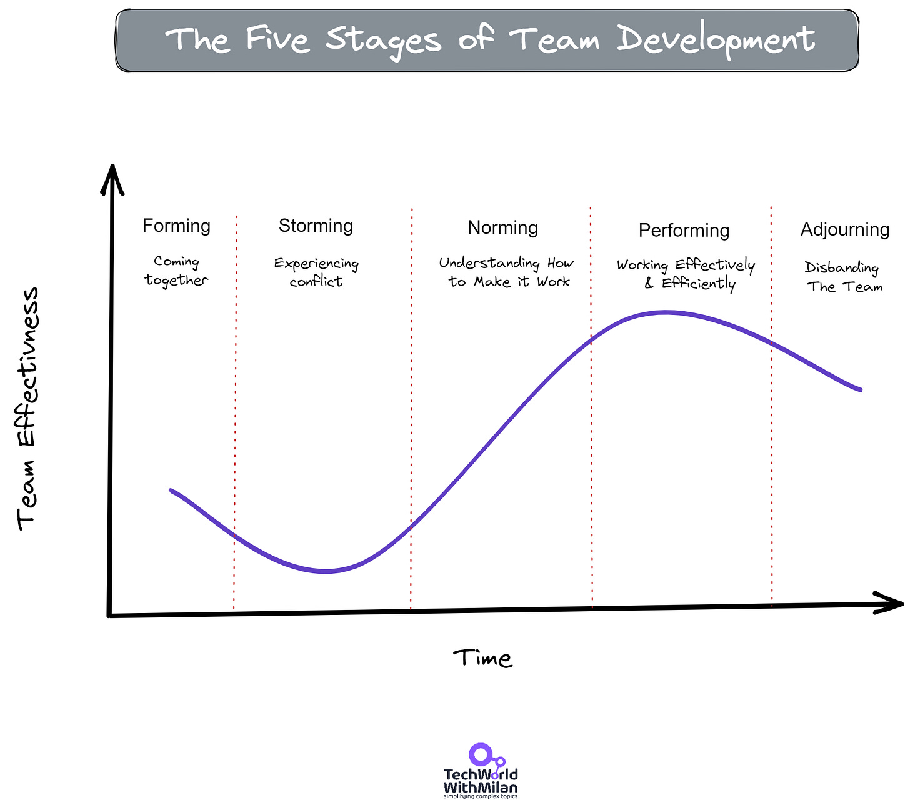
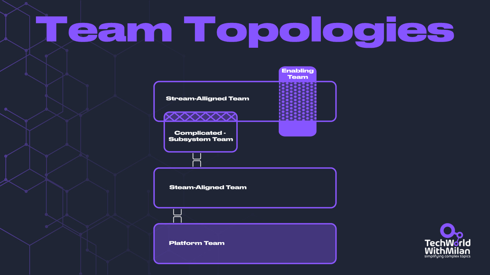
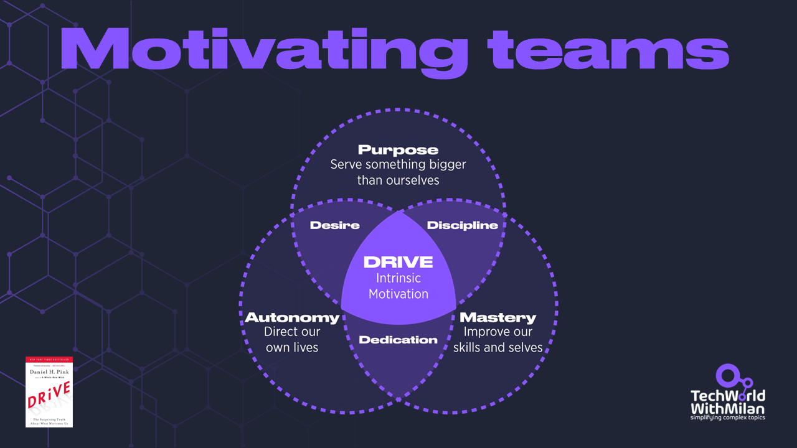
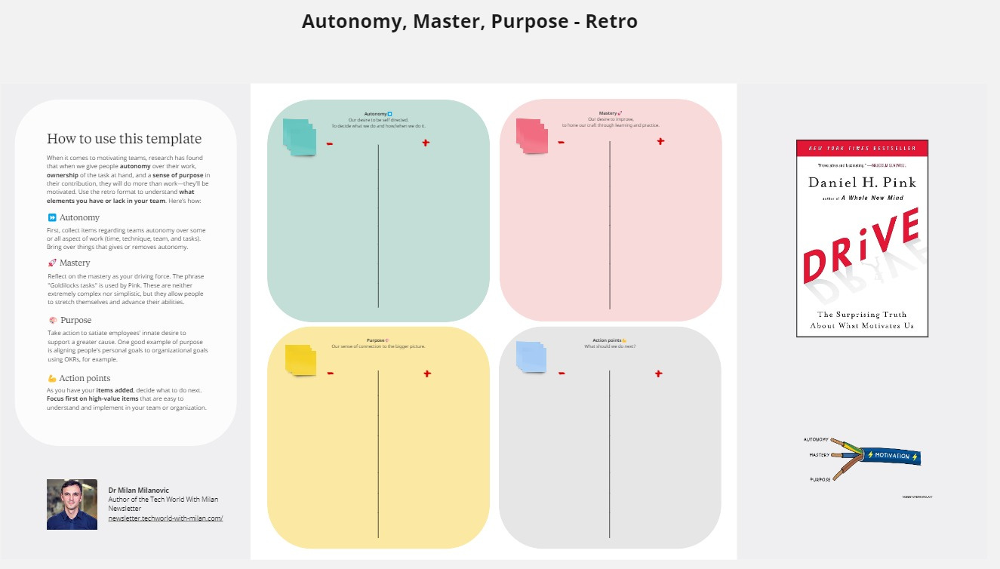
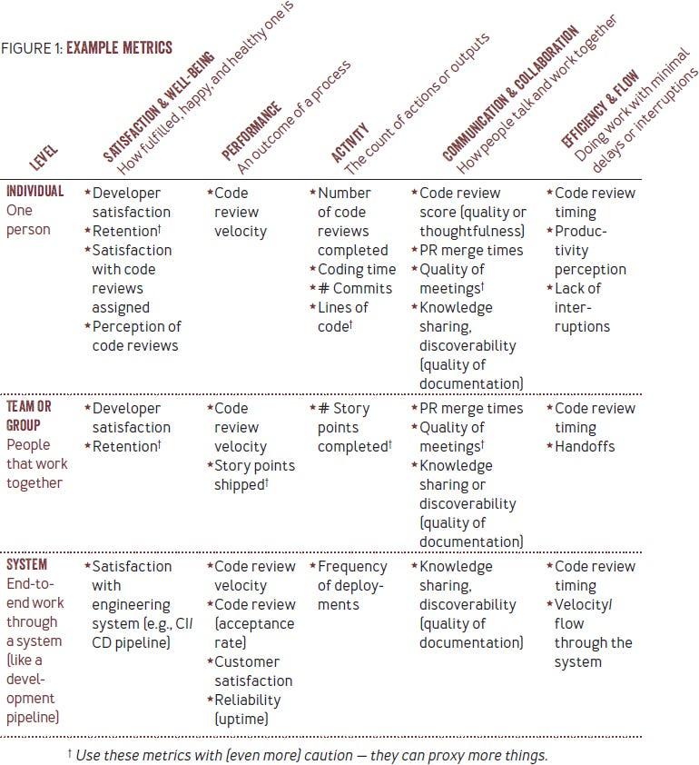
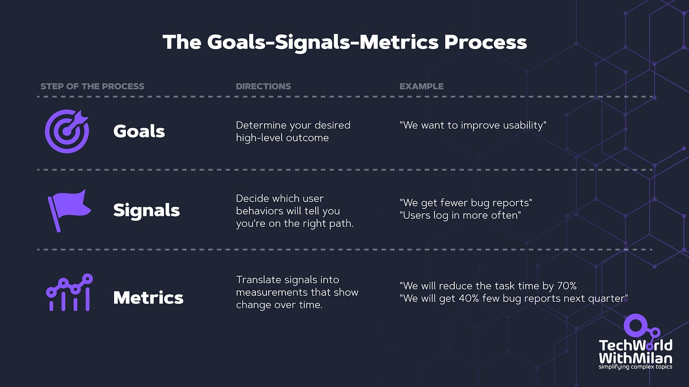
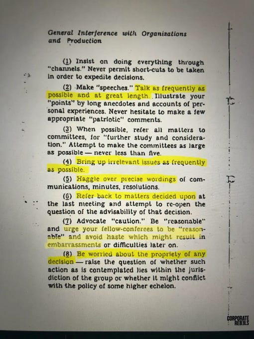

# Building High-Performing Teams

In this issue, we are going to talk about the following:

- **How to build a high-performing team?**
- **The 5 Stages of Team Development**
- **How do you handle dysfunctions in a team?**
- **Organizing teams by using Team Topologies**
- **How would you like to motivate your team?**
- **How to Measure Team Productivity by using different methods**

---

# Introduction

We are searching for great teams that can deliver whatever we can think of. Yet, we saw a dysfunctional team with many problems and low delivery. Here, we will discuss how to build great teams, ensure their productivity, and what you can do as a leader to support your team.

> *“Build a team so **strong**you don’t know who the boss is.”*

## How to build a high-performing team?

We are all working in teams, and our daily work and the results depend very much on the internal happiness of the units. As the group is happier, they will be more productive and stay in your company. But how do we build such teams? Here are a few things we can do:

1. The first step in building great teams **starts with hiring the right people**.  What we want is to have team players and a team-first mindset. A new team member must fit the existing team and give them more energy, support, understanding, and trust in each other. Also, to mentor new or less experienced team members. We **hire for attitude because skills can always be**. Of course, we expect some development and tooling knowledge for the position. This means we want **humble team players** who are aware of their strengths and weaknesses and willing to share credit for the team’s achievements, but we also want people with a **strong drive and desire to succeed**.
2. Building **trust**inside your unit is the second step in creating a great team. This is important because we want to develop psychological safety where people will not fear failure and be encouraged to experiment. In addition, such groups need autonomy for their software engineers. To do this, we must build such a culture in our company.
3. One way we can build a culture where success is not the only rewarding factor but **experimentation,**too, is to foster a product and entrepreneurial mindset with our people, where investigation is rewarded. We can create an environment to motivate people on that path. However, experimentation also means that **failure is allowed**and that there is a safety net to catch you.
4. To get to know your team better, the best way is to **lead by example,** invite people for lunch, ask them something personal, and remember what is important to them and how they feel about different stuff. Share your things also with them. Show that you are **vulnerable**and a person like them. And remember to reward initiatives from your people, such as starting a community of practice or being proactive. **Finally, publicly praise people**(whenever you see the opportunity) and **criticize privately**.
5. We should also encourage **open communication, feedback sharing, and transparency in decision-making**. In this way, teams could work more efficiently and be more productive. To do this, regular people need to sync and share information during all-hand meetings. Teams also need to have clear ownership, mission, and vision. For example, the task could be "Build the best online experience for your customers.”
6. **Bond over non-work topics**. Discuss sports, books, and family with your team members. The best teams aren’t more effective because they work all the time but because they invest time connecting in different ways.
7. Make **meetings purposeful**. Always check this meeting—it could be an email—and send a pre-read for any meeting communication. Every meeting should have an **agenda**and clear goal, and **call only those who need to be in it. S**chedule 25-minute meetings instead of 30 minutes and 50 minutes instead of 60 minutes.
8. The**team needs to understand the vision, goals, and strategy clearly**. And how are their individual goals aligned with team/organization goals?
9. Last but not least, **give and receive appreciation more frequently**. This should happen from the top down and also in peer-to-peer interactions.

We also want to see **T-shaped people in our teams**. So, we want people with cross-discipline expertise in the Software Development Lifecycle (SDLC) and deep-discipline knowledge in one or more disciplines. An example would be a full-stack engineer with more profound front-end technology knowledge.

T-Shaped Experts

## **The 5 Stages of Team Development**

According to Bruce Tuckman's concept, [published in 1965](http://www.communicationcache.com/uploads/1/0/8/8/10887248/developmental_sequence_in_small_groups_-_reprint.pdf), a team must go through four phases to develop and grow. Tuckman's five stages of team development is a widely recognized model in organizational psychology. The model describes a team’s typical stages as it develops and matures. The stages are:

1. **Forming—coming together:** This is the initial stage where team members get to know each other. Next, they may need clarification about their roles, the team's objectives, and the norms of behavior. In this stage, the team leader is critical in providing direction, clarifying goals, and establishing standards.
2. **Storming—experiencing conflict:**At this stage, team members may start to experience conflicts as they have different ideas, opinions, and approaches to the work. If the team leader manages these conflicts well, they can be constructive and lead to better outcomes. Effective dispute resolution, mutual respect, and open communication are essential to overcome these obstacles and promote a positive work atmosphere.
3. **Norming—understanding how to make it work**: In this stage, the team begins to resolve conflicts and establish explicit norms of behavior, roles, and responsibilities. This leads to greater cohesion, trust, and cooperation among team members. The leader should be asking questions rather than directing.
4. **Performing—working effectively:** In this stage, the team has achieved high productivity and effectiveness. Team members work together smoothly and efficiently to achieve the team's objectives. A good leader will now delegate, train team members, and keep a proactive role because the high-performing team is essentially autonomous.

And optionally, **5. It was adjourning - disbanding the team.**This is the final stage, where the team has completed its task, and members are preparing to move on to other projects or assignments.

The Five Stages of Team Development, according to Tuckman

An important thing to mention is that teams could roll back in cycles (i.e., **they are repeating**), depending on their internal state. Therefore, leaders must understand the process and proactively anticipate, recognize, and guide their teams.

We also need to recognize **micro-events**, which happen if there is a desire to change or a real change from the usual way of working. This means the team will be moved again into the forming or storming phase. These micro-events could be anything: a new member joining a team, a lousy customer request, restructuring a team, etc.

## How do you handle dysfunctions in a team?

One of the most critical components of your leadership is the well-being of your team. A great team must have the trust, commitment, and accountability necessary for high performance. Yet, there is no simple cure for all of these issues. And I often see that managers don't understand that some conflicts in a team are healthy.

Patrick Lencioni, in his book "**[The Five Dysfunctions of a Team](https://amzn.to/3UMLInp)**," identified those dysfunctions:

1. **Absence of Trust:** Effective teams must have members who feel safe enough to open up, share their ideas, and acknowledge mistakes without fear of ridicule or retribution.

Establishing trust among a team takes time, and it's crucial to understand that this process must start with you. This entails keeping your word, being trustworthy, and setting an example for others.
2. **Fear of Conflict:** Healthy conflict is essential for robust discussion that leads to creative problem-solving and consensus.

Encourage them to engage in constructive, lively debate and question one another's ideas when disagreeing. This can be challenging at first, especially for shier team members, if you could ask direct, open-ended questions to get everyone's attention during meetings. It is also good to train your people in conflict-solving methods.
3. **Lack of Commitment:**Without members committing to decisions, plans cannot be implemented, and objectives cannot be achieved.

By actively encouraging team members to weigh in on issues before you ask them for a commitment, you can discourage "after-meeting meetings." Note those who remain silent and attempt to get their opinions.
4. **Avoidance of Accountability:**Everyone needs to take ownership of their decisions and actions; otherwise, progress is hindered, and objectives remain unrealized.

Accountability is critical for your team members, both to one another and to themselves. Make sure that everyone is accountable for their work and behaviors. Encourage team members to provide regular, mutual feedback on each other's performance, behavior, and accomplishments.
5. **Inattention to Results:** All efforts must focus on achieving team results before celebrating individual accomplishments.

If you want to overcome this dysfunction, could you ensure that your team members concentrate on the team's and company's true objectives? OKRs that you can use to align people's goals with the teams can also help here.

Try to avoid "winning" arguments and agree to explore options instead.

The 5 Dysfunctions of a Team

## Organizing teams by using Team Topologies

Have you heard about **Conway’s Law**? It is a theory created by computer scientist Melvin Conway in 1967. which says: "*Organizations, who design systems, are constrained to produce designs which are copies of the communication structures of these organizations.*“ In other words, the **form of a software system is often influenced by the structure and communication patterns within the team building**. This can result in software architecture that is not optimal for the problem being solved, as the team may focus on their own organizational needs over the system’s needs.

To mitigate this, we can use the**Inverse Conway maneuver**. This technique means we should involve software architects, engineers, and leaders in defining organizational structures. And one of the ways to structure teams properly is through **Team Topologies**.

**Team Topologies** is a model for organizing software delivery teams and their interactions, introduced by Matthew Skelton and Manuel Pais in their book "**[Team Topologies: Organizing Business and Technology Teams for Fast Flow](https://amzn.to/3zYvT3z)**[.](https://amzn.to/3zYvT3z)" It provides a framework for structuring teams and their interactions to promote high performance, a fast flow of work, and effective communication. The model is based on four fundamental team types and three interaction modes.

Four Team Types:

1. **Stream-aligned team:**Focused on delivering value to specific areas of the business or customer segments. These teams have end-to-end responsibility for their products or services and work in a continuous delivery manner.
2. **Platform team:** Provides shared services, tools, and infrastructure to enable stream-aligned teams to build, test, deploy, and operate their applications more efficiently. The platform team minimizes the cognitive load on stream-aligned teams by abstracting away complexity.
3. **Enabling team:** This team supports stream-aligned groups by providing expertise, guidance, and coaching in technology, process, or domain knowledge. The aim is to improve the capabilities of stream-aligned teams and enable them to become more autonomous.
4. **Complicated subsystem team:**Handles developing and maintaining complex, specialized subsystems that require deep expertise. This teaming type is used sparingly, as it can introduce dependencies and slow workflow.

Three Interaction Modes:

1. **Collaboration:**Working closely with another team, typically for a short period, to achieve a specific goal, such as addressing a problem or implementing a new technology.
2. **X-as-a-Service:**One team provides a well-defined service to another group, reducing cognitive load and promoting independence. The relationship is based on clear service-level agreements (SLAs) and interfaces.
3. **Facilitating:** Helping another team improve by providing guidance, coaching, or training.

To**create high-performing teams using Team Topologies**, consider the following steps:

1. **Identify workloads and teams and fit them into Team Topologies** - Check the current team status and workload and restructure them to provide the organizational structure of Team Topologies. This will enable the reduction of cognitive workload for a team. What we need to do here is to allow a culture of trust between groups so that they can cooperate and create synergies.
2. **Structure your team to your desired architecture** - When you know what you want to build and create an initial desired architecture of a system, use the Reverse Conway maneuver to achieve it.
3. **Identify team interaction modes** - When you have arranged your teams using team types, the following steps are to use interaction modes to enable their communication and work.

And don’t forget that Team Topologies are not something fixed; as your project evolves, your architecture will grow too, which means that your Team Topologies need constant monitoring and adjusting.

Primary Interaction Modes for the Four Fundamental Team Topologies

## How would you like to motivate your team?

When it comes to motivating teams, research has found that when we give people **autonomy**over their work, **ownership**of the task at hand, and a **sense of purpose** in their contribution, they will do more than work—they'll be motivated. Here, we can take a lesson from Daniel Pink’s book “**[Drive](https://amzn.to/43zeP1x)**,” which says people are driven to do great things because of intrinsic rewards like purpose, autonomy, and mastery.

The three critical components of intrinsic motivation are:

1. **Autonomy (In control of what we do + how we do it)**—This is the requirement for managing one's life and work. To be motivated, it would be best to have complete control over what you do, when, and who you do it with. We must provide our employees autonomy over some or all aspects of work (time, technique, team, and tasks). Our business should become a results-only work environment, focusing on output.
2. **Mastery (Improving our skills + selves)**—The drive to get better is mastery. If mastery is your driving force, you may view your potential as limitless and want to advance your abilities via study and practice constantly. Pink uses the phrase "Goldilocks tasks." These are relatively simple tasks, but they allow workers to stretch themselves and advance their abilities.
3. **Purpose (Working towards something worthwhile)**- Take action to satiate employees' innate desire to support a more significant cause. Nowadays, a growing number of companies prioritize purpose maximization over profit maximization. However, the most diligent, successful, and engaged people frequently feel they contribute to something more significant than themselves.

One good example of purpose would be aligning people to connect their personal goals to organizational goals using OKRs.

Instead of relying on external rewards like promotions or bonuses, **use intrinsic rewards to motivate your team**. Give them a meaningful purpose and autonomy over their work and help them build mastery. These incentives have been known to bring out the best in people and help create a sense of pride and accomplishment.

Motivating teams

In addition, **off-site meetings** are great motivators for a team. They relax people and make them bond on a personal level. This makes even greater connections between team members and enables productivity. Because the more we like the people we work with, the easier it is to collaborate, share perspectives, and build a foundation of trust

> *Download the Drive motivators in a retro format that you can use to check in with your team as a **[Miro board](https://miro.com/app/board/uXjVKMdmjmE=/?share_link_id=609171776606)**.*
> 
> 

## **How to Measure Team Productivity**

The**SPACE framework,** **DORA metrics,** and **Goals/Signals/Metrics (GSM)** are three primary methods for measuring team productivity**.**

### The SPACE Framework for Team Productivity

In a recent research paper by Nicole Forsgren and her colleagues, “**[The SPACE of Developer Productivity](https://queue.acm.org/detail.cfm?id=3454124)**" (2021), the authors defined a framework as a systematic approach to measuring, understanding, and optimizing engineering productivity. The framework encourages leaders to take a comprehensive approach to productivity, communicating measurements with one another and connecting them to team objectives. The five aspects of **the Space Framework** categorize engineering productivity.

What are these categories:

- **S - Satisfaction and well-being**

Here, we usually measure whether our team members are fulfilled and happy by using surveys. Why do we do this? Satisfaction is correlated with productivity. Unhappy teams that are productive will burn out sooner rather than later.
- **P - Performance**

This is also hard to quantify because producing more code in a unit of time is not a measure of high-quality code or productivity. Here, we can measure defect rates or change failure rates to measure it, which means the percentage of deployments causing a failure in production. Every loss of output will harm a team's productivity. Also, if we count the number of merged PRs over time, it's correlated to production.
- **A - Activity**

Activities are usually visible. Here, we can measure the number of commits per day or deployment frequency, i.e., how often we push new features to production.
- **C - Collaboration & Communication**

For a productive team, we want extensive and effective collaboration between individuals and groups. In addition, productive teams usually rely on high transparency and awareness of other people's work. Here, we can measure PR review time, meeting quality, and knowledge sharing.
- **E- Efficiency & Flow**

With flow, we measure individual efficiency in completing some work fast and without interruption, while efficiency means the same thing but on the team level. Our goal is to foster an environment where developers may experience and keep the flow for the longest possible period each day while also assisting them in feeling content with their routines.

The authors recommend aligning three areas with company goals and team priorities to implement the SPACE framework. First, when a team selects a measure, this reflects team values. Here, we want to start from team-level metrics, and when we succeed, we can roll it out to the broader organization.

Example metrics (“The SPACE of Developer Productivity,” N. Forsgren et al., 2021)

### DORA Metrics for Team Productivity

Another way to measure team productivity is through **[DORA metrics](https://cloud.google.com/blog/products/devops-sre/using-the-four-keys-to-measure-your-devops-performance)**. With these metrics, we are evaluating team performance based on the following:

1. **Lead time for changes**is the time between a commit and production. Elite performers do this in less than one hour, while medium performers need one day to one week.
2. **Deployment frequency**is how often we ship changes. Elite performers do this multiple times per day, while medium ones do it once a month to once every six months.
3. **The mean time to recovery**is the average time it takes your team to restore service when there’s an outage. Elite performers do this in less than one hour, while medium ones do this in a day to one week.
4. **The change failure rate** is the percentage of releases that result in downtime. Elite performers are 0-15%, while medium performers are 16-30%.

The lead time for modifications and the deployment frequency reveal a team's velocity and how quickly they react to consumers' constantly changing needs. The mean time to recovery and change failure rate indicate the stability of service and how responsive the group is to service outages or failures.

Comparing all four essential criteria, one can assess how successfully their company balances speed and stability.

DORA Metrics

### Goals/Signals/Metrics (GSM) for measuring Developer Productivity

However, there are other productivity frameworks, such as**“[Goals/Signals/Metrics (GSM)](https://abseil.io/resources/swe-book/html/ch03.html)” metrics** from Google. In this framework, you first agree that there is a problem worth solving, then we set a **goal**on what we want to achieve and decide which statements, when actual, would note that we are making progress (**signals**). Finally, we arrive at **metrics**we want to measure but focus more on the desired outcome, not just the metric. For example, the goal could be “*Make sure that engineers have more focus time*,” signals could be “*Engineers report fewer cases of meeting overload*,” and metrics could be “*Engineer focus time*.” For metrics, you can build a team **Dashboard**that will collect them in one place, so it’s easy to analyze them.

You can check out **[this video](https://www.youtube.com/watch?v=OFKv8vVQeZM)** from Google if you'd like to learn more about this method.

The Goals-Signals-Metrics

> The same metrics is used by [LinkedIn](https://linkedin.github.io/dph-framework/).

## Bonus: CIA’s 1944 manual on how to sabotage an organization’s productivity

In 1944, the CIA's predecessor, the Office of Strategic Services (OSS), released a covert leaflet designed to serve as a guidebook for civilians residing in Allies-friendly nations. 

The "[Simple Sabotage Field Manual](https://www.cia.gov/static/5c875f3ec660e092cf893f60b4a288df/SimpleSabotage.pdf)” opens in a new window. It was declassified in 2008 and made available on the CIA website. The manual outlines how ordinary citizens could assist the Allies in undermining their country by limiting production in factories, offices, and transportation links.

Some of the classic guidelines for being a lousy employee are listed here.

1. **Talk a lot and with great length**
2. **Bring up irrelevant issues as frequently as possible**
3. **Haggle over precise wordings**
4. **Refer back to matters decided upon**

---

Thanks for reading Tech World With Milan Newsletter! Subscribe for free to receive new posts and support my work.