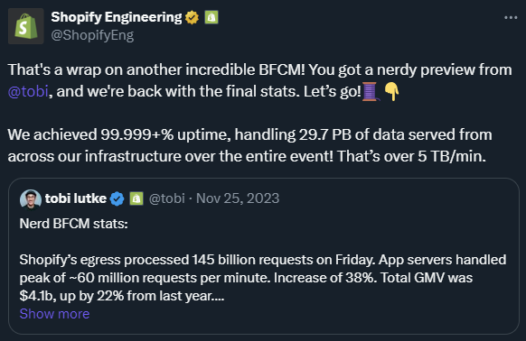

# Building Resilient Payment Systems by Shopify

On the last black Friday, Shopify made impressive results:

Some details are:

- **145 billion requests (~60 million per minute)**
- **99.999+% uptime**
- **5 TB/min of data served from across the infrastructure**
- **MySQL 5.7 and 8 fleets handled over 19 million requests per second (QPS)**
- **22 GB/sec of logs and 51.4 GB/sec of metrics data**
- **Ingested 9 million spans a second of tracing data**
- **Their Apache Kafka served 29 million messages per second at peak**
- **Everything is run on Google Cloud**

But how did they manage to do it? The [recent article](https://shopify.engineering/building-resilient-payment-systems) by Shopify Engineering explained the **top 10 most valuable tips and tricks for building resilient payment systems**:

1. **Lower your timeouts**. They suggest investigating and setting low timeouts everywhere possible. For instance, Ruby's built-in Net::HTTP client has a default timeout of 60 seconds to open a connection, write data, and read a response. This is too long for online applications where a user is waiting.
2. **Install Circuit Breakers**. Circuit breakers, like Shopify's Semian, protect services by raising an exception once a service is detected as being down. This saves resources by not waiting for another timeout.
3. **Understand capacity.** The author discusses Little's Law, which states that the average number of customers in a system equals their average arrival rate multiplied by their average time. Understanding this relationship between queue size, throughput, and latency can help design systems that can handle load efficiently.
4. **Add monitoring and alerting.** Google's [Site Reliability Engineering (SRE) book](https://sre.google/sre-book/table-of-contents/) lists four golden signals a user-facing system should be monitored for latency, traffic, errors, and saturation. Monitoring these metrics can help identify when a system is at risk of going down due to overload.
5. **Implement structured logging**. They recommend using structured logging in a machine-readable format, like `key=value` pairs or JSON allows log aggregation systems to parse and index the data and correlation IDs passed along the API calls to find all related logs for the payment attempt.
6. **Use Idempotency Keys**. To ensure payment or refund happens exactly once, they recommend using Idempotency keys, which track attempts and provide only a single request sent to financial partners.
7. **Be consistent with reconciliation.** Reconciliation ensures that records are consistent with those of financial partners. Any discrepancies are recorded and automatically remediated where possible.
8. **Incorporate Load testing.** Regular load testing helps test systems limits and protection mechanisms by simulating large-volume flash sales. Shopify uses scriptable load balancers to throttle the number of checkouts happening at any time.
9. **Get on top of incident management.**Shopify uses a Slack bot to manage incidents, with roles for coordinating the incident, public communication, and restoring stability. This process starts when the on-call service owners get paged, either by an automatic alert based on monitoring or by hand, if someone notices a problem.
10. **Organize incident retros.** Retrospective meetings are held within a week after an incident to understand what happened, correct incorrect assumptions, and prevent the same thing from happening again.

Building Resilient Systems by Shopify

> *To learn more about Shopify architecture, check **[here](https://newsletter.techworld-with-milan.com/i/129396876/shopify-architecture)**.*

---

# BONUS: Backend burger

Check out this Full Back-end Roadmap.

---

Thanks for reading Tech World With Milan Newsletter! Subscribe for free to receive new posts and support my work.