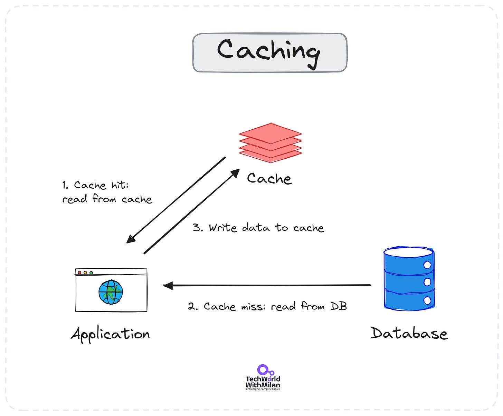
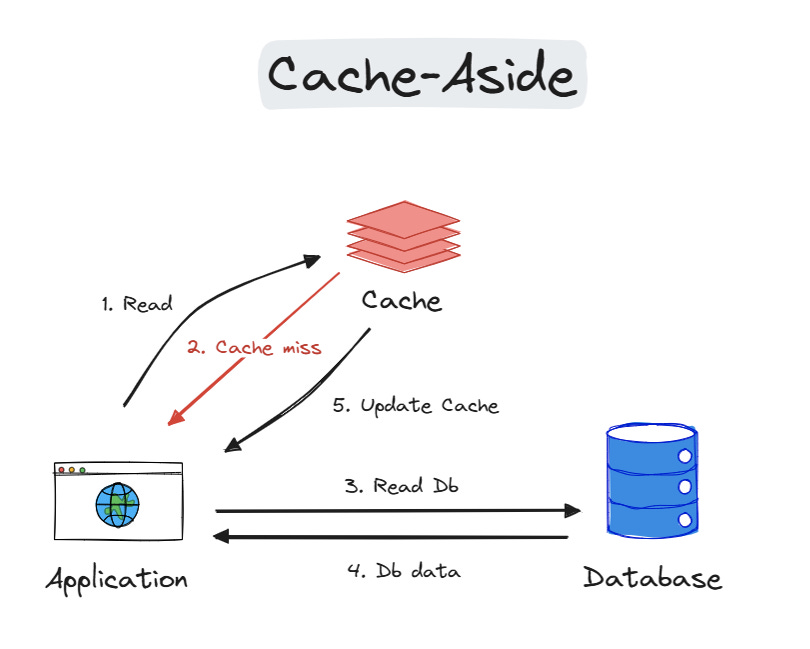
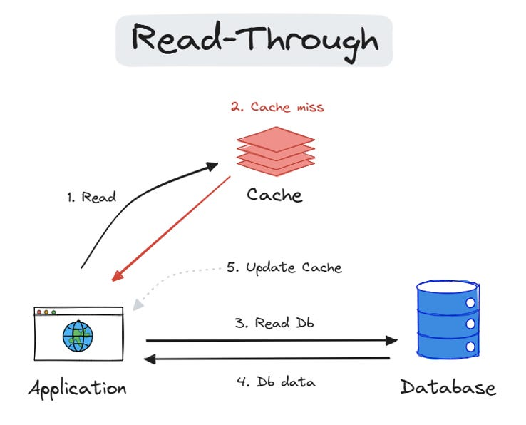
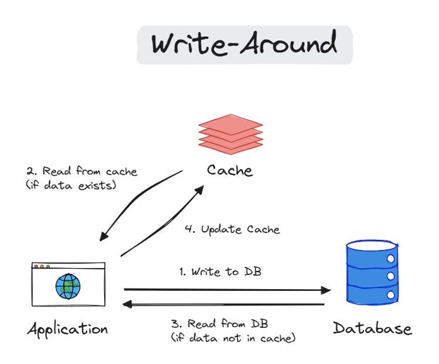
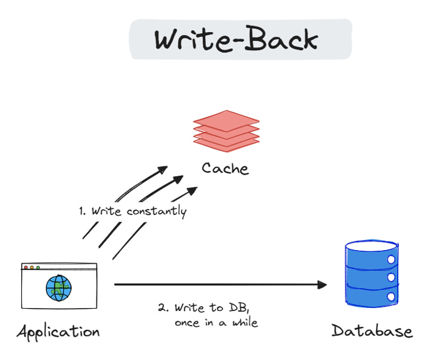
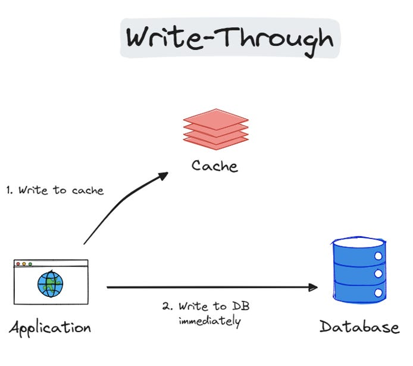
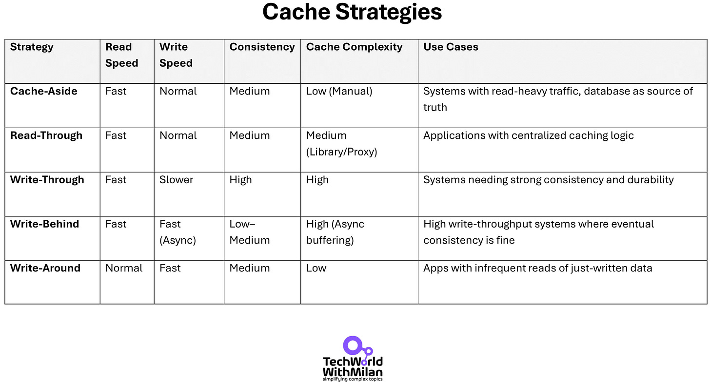
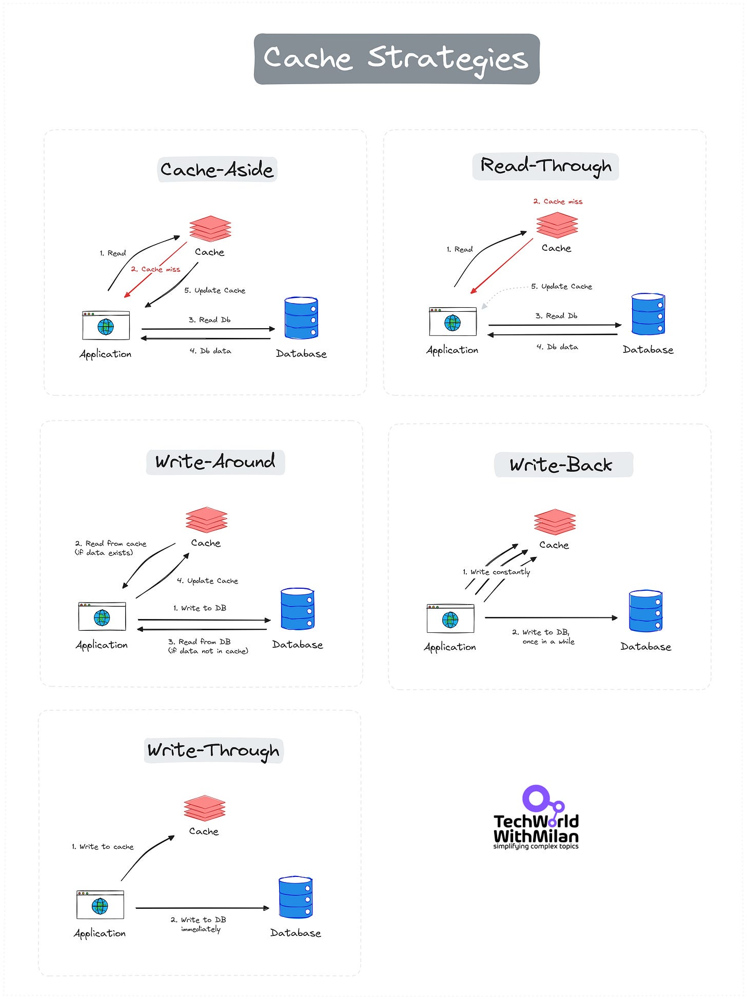
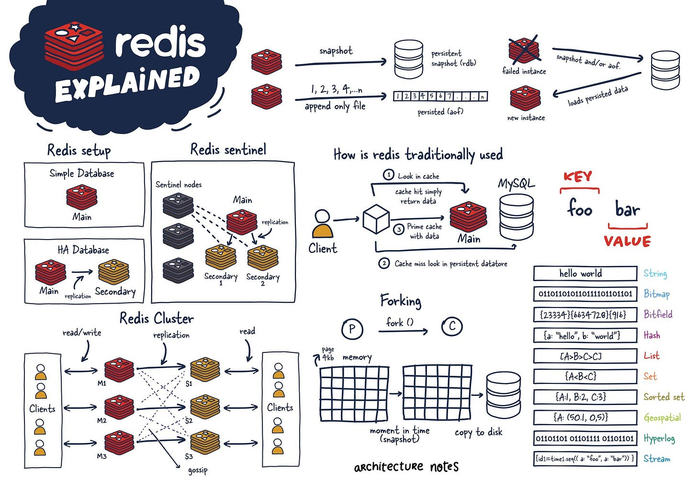
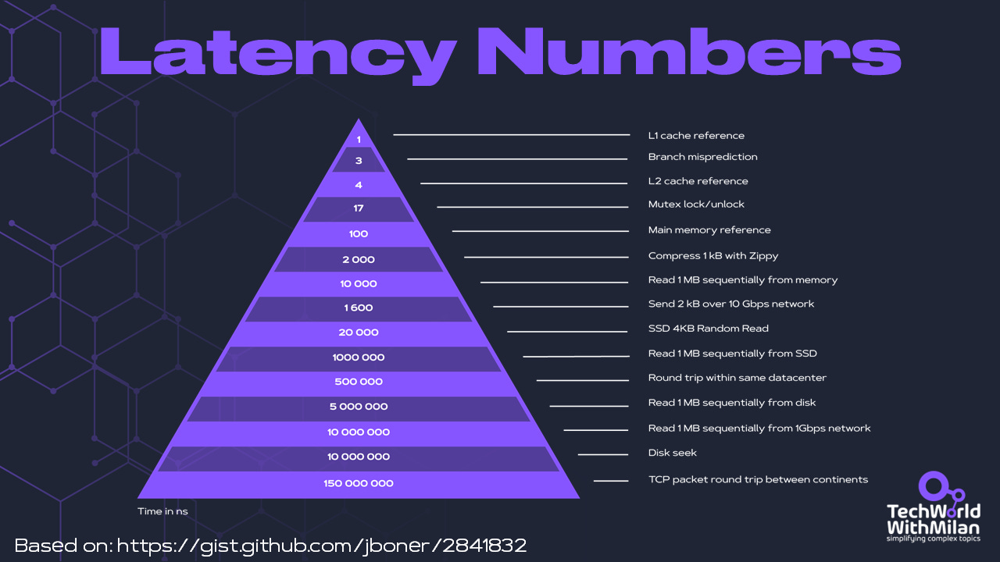

# Caching: the single most helpful strategy for improving app performances

*Updated: 16.4.2025.*

---

In system architecture, caching stores frequently accessed data in a faster, more readily accessible location. This technique allows you to retrieve it quickly without hitting the original, potentially slower source every single time. The core benefit is **improved performance and efficiency**.

In this issue, we will describe the importance of caching, the types of caches, and the drawbacks, as well as **Redis**, one of the most used caching solutions.

So, let’s dive in.

---

Caching stores copies of frequently accessed data in a readily accessible location, reducing access time and offloading primary data sources. **Caching is particularly important in monolithic systems**, where all components are tightly integrated and run as a single service, and caching plays a crucial role in enhancing performance and scalability.

The most basic use case for caching is that when we need some data, we first hit the cache and try to read it (1). If the cache is missing (2), we read from the database and write the data to the cache (3) so that it can be read the next time from the cache.

Caching

**The advantages** of caching are the following:

- **Reduced Latency:** By keeping frequently used data close at hand, the cache significantly reduces the time it takes to access that data, resulting in a faster and more responsive user experience.
- **Lower Load:** By handling frequent requests, caching reduces the burden on the original data source (databases, servers). This frees up resources for other tasks and improves overall system scalability.
- **Improved Scalability:** A well-designed cache can handle more requests than the original data source, making your system more scalable.

Some **everyday use cases for caching** are:

- **Frequently accessed data:** Any data that users or applications access repeatedly is a prime candidate for caching. Don't cache only database queries, as reading for cache is much faster than an API call.
- **Read-heavy workloads:** Systems with a high volume of reads compared to writes benefit most from caching. The cache absorbs the brunt of read requests, minimizing the load on the primary data source.
- **Reducing network traffic:** Caching can be particularly helpful in distributed systems where data resides on remote servers. By storing a local copy, you can avoid frequent network calls, improving performance, especially for geographically dispersed users.
- **Performance critical:** Caching can significantly improve performance in scenarios where low latency and high throughput are critical.

**But how do we decide how to cache something?**Adding a cache comes with costs, so for each candidate, we need to **evaluate** the following:

- Is it faster to hit the cache?
- Is it worth storing?
- How often do we need to validate?
- How many hits per cache entry will we get?
- Is it local or shared cache?

Yet, cached data is stale, so there can be situations in which it is inappropriate.

## Caching Strategies

Caching improves reading frequently accessed data, but populating and updating the cache is nontrivial. We have the following strategies for this:

### Read Strategies

There are two main reading strategies, as follows:

#### 1. Cache-Aside (Lazy-loading)

The application manually manages data storage and retrieval from the cache. Data is fetched from the primary storage on a cache miss and then added to the cache. We should use it when cache misses are rare, and DB read is acceptable. The thundering herd problem can cause problems during cache misses in this strategy (read more in the last section).

**Advantages:**

- Simpler implementation. Application logic handles cache updates.
- More granular control over what's cached.
- The cache only holds actively requested data.

**Disadvantages:**

- Extra database access on cache miss (potentially 3 round trips).
- Data can become stale if the origin isn't updated through the cache.

Cache-Aside Strategy

#### 2. Read-Through

When a cache miss occurs, the cache automatically loads data from the primary storage. This simplifies data retrieval by handling cache misses internally. We use it to abstract DB logic from the application code and when your workloads are read-heavy.

**Advantages:**

- Simpler application code, cache handles data retrieval.
- Ensures data consistency (cache and origin are always the same).

**Disadvantages:**

- More database load on reads (cache might not be hit every time, unnecessary database access).
- Increased complexity of cache and origin have different data formats (data transformation might be needed).

Read-Through Strategy

### Write Strategies

There are three main writing strategies, as follows:

#### 1. Write-Around

Data is written directly to the primary storage, bypassing the cache. This strategy is effective when writing is frequent and reading is less common. We should use it for write-heavy workloads when written data doesn’t need to be immediately read from the cache (e.g. data imports or intensive logging).

**Advantages:**

- Fastest writes since the only cache is updated (reduces the load on origin).
- The database is always up to date and acts as the one source of truth.

**Disadvantages:**

- Data becomes inconsistent (cache holds data that is not reflected in the origin).
- It is rarely used due to the high risk of data divergence (stale data in cache).

Write-Around Strategy

#### 2. Write-Back (Write-Behind)

Data is first written to the cache and later synchronized with the primary storage. This reduces the number of write operations but risks data loss if the stock fails before syncing. We should use it in write-heavy places when performance is a top priority, and a slight data loss is acceptable (counters, social media “likes,” game scores, etc.). Don’t use it for transactions.

**Advantages**:

- Faster writes since cache update is decoupled from the origin (improves write performance).
- Reduces load on the origin database for writes.

**Disadvantages**:

- Potential data inconsistency during failures (data might be in cache but not origin).
- Requires additional logic to handle retries and ensure eventual consistency (data eventually gets written to the origin).

Write-Back Strategy

#### 3. Write-Through

Data is simultaneously written to the cache and the primary storage, ensuring consistency but potentially increasing write latency. This is ideal for scenarios where data integrity is crucial (e.g., changing user email addresses), and you can stand a slightly slower write performance.

**Advantages**:

- Ensures data consistency (cache and origin are always the same).
- Simpler implementation, updates happen together.

**Disadvantages**:

- Slower write due to double update (cache and origin).
- Increased load on origin database for writes (can become bottleneck).

Write-Through Strategies

## Choosing the best strategy

Check this short overview of Cache strategies:

Here is the complete map of Cache Strategies:

Cache Strategies

In addition to this, some things can go wrong with cache systems, namely:

- **The Thundering Herd Problem.**When the cache expires, numerous requests bombard the backend simultaneously, overwhelming it. We can solve this problem by implementing staggered cache expiration and using locks or message queues to manage request flow. This will prevent the overload and ensure smooth backend operations. Also, we should not set all cache keys to expire simultaneously. Add a bit of randomness to spread out the load.
- **Cache Breakdown.**During intense load, the cache fails, directing all traffic to the database and causing performance bottlenecks. We can solve it by setting optimal cache expiration times, employing rate limiting, and layer caching mechanisms (like in-memory and distributed caches) to distribute the load and protect the backend.
- **Cache Crash.**The caching service crashes, causing a complete loss of cached data and direct database querying. To solve this, we can design a resilient caching architecture (cache cluster) with regular backups and a secondary failover cache to ensure continuity and performance stability. We can also implement a circuit breaker mechanism. When the cache fails repeatedly, the application temporarily bypasses it to prevent overloading the database.
- **Cache Penetration**occurs when queries for non-existent data bypass the cache, increasing the database load unnecessarily. We can solve this by adopting a cache-aside pattern, where all data requests check the cache first. We use negative caching to handle missing data efficiently, reducing unnecessary database hits. We can also store a placeholder (like "null") for non-existent keys in the cache, preventing unnecessary database queries.

---

## Why do you need to know Redis?

[Redis](https://redis.io/)(“***RE***mote ***DI***ctionary ***S***ervice”) is an open-source, in-memory data structure store used as a cache before another database. It supports various data structures such as strings, hashes, lists, sets, sorted sets with range queries, bitmaps, and geospatial indexes with radius queries. At its core, Redis operates on a key-value store model, where data is stored and retrieved using a unique key.

### How it works?

Redis stores data in the server's main memory (RAM), ensuring low-latency data access. Unlike traditional databases that rely on disk storage, Redis's in-memory nature allows it to deliver blazing-fast data retrieval and storage operations. While primarily an in-memory store, Redis offers various data persistence options, ensuring data durability even during server restarts or failures.

### What is Redis architecture?

There are different kinds of Redis configurations:

1. **Single-Node Redis Architecture** - Suitable for small applications, development, and testing environments.
2. **Master-Slave Replication Architecture** - Involves one master node and one or more slave nodes. Use it when we need read scalability and data redundancy.
3. **Redis Sentinel** - Implements monitoring, notifications, and automatic failover and is a client configuration provider. Use when needed high availability and monitoring of Redis instances.
4. **Redis Cluster** - A distributed implementation of Redis that allows for horizontal scaling and provides high availability

### **Does it scale well?**

Redis supports horizontal scaling and provides features like partitioning to manage more extensive datasets. Moreover, Redis Sentinel ensures high availability and monitoring, safeguarding against downtime and ensuring continuous service delivery.

### Why is it so fast?

Redis achieves its incredible speed through a combination of design choices:

1. **In-Memory Storage:** Unlike traditional databases that rely on disks, Redis stores its data entirely in RAM (Random Access Memory). Accessing data from RAM is significantly faster than reading and writing from a disk drive. RAM has much lower latency (access time) and higher throughput (data transfer rate) than disks.
2. **Optimized Data Structures:** Redis uses specialized data structures, such as hash tables, skip lists, and sorted sets, for efficient data storage and retrieval. These structures are designed for fast inserts, lookups, and updates, making them ideal for high-performance applications.
3. **Single-Threaded Model:** This might initially seem counter-intuitive, but Redis utilizes a single-threaded architecture. This simplifies the codebase and eliminates the overhead of managing multiple threads and potential race conditions. While it doesn't leverage all CPU cores, it allows for a streamlined and predictable execution flow, contributing to Redis's stability and performance.
4. **Asynchronous and non-blocking I/O**: Redis employs a non-blocking socket I/O and an event-driven programming model. It can concurrently handle replication, persistence, and client handling without blocking the main thread.

### When to use it?

The primary usage of Redis is for **caching** due to its ability to rapidly store and retrieve data, thereby reducing data retrieval times and alleviating load on direct data stores. Also, it can be used for **real-time analytics** or **message brokering**.

### Redis limitations

While Redis boasts incredible speed, its in-memory nature comes with limitations. RAM restricts data size, and frequent server restarts necessitate persistence strategies like snapshots to avoid data loss. Additionally, Redis isn't ideal for complex data joins or applications requiring strong data durability, where traditional relational databases reign supreme.

Redis explained (Credits: Mahdi Yusuf - [Architecture Notes](https://architecturenotes.co/redis/))

> *To learn more about Redis, check **[the Redis University](https://university.redis.com/)**.*

---

## BONUS: Latency Numbers Every Programmer Should Know

Latency Numbers Every Programmer Should Know (based on [the work of Jonas Bonér](https://gist.github.com/jboner/2841832))

---

## More ways I can help you

1. **1:1 Coaching:** [Book a working session with me](https://newsletter.techworld-with-milan.com/p/coaching-services). 1:1 coaching is available for personal and organizational/team growth topics. I help you become a high-performing leader 🚀.
2. **[Promote yourself to 28,000+ subscribers](https://newsletter.techworld-with-milan.com/p/sponsorship-of-tech-world-with-milan)**by sponsoring this newsletter.

---

Thanks for reading Tech World With Milan Newsletter! Subscribe for free to receive new posts and support my work.