# ChatGPT is not AI

Most people think ChatGPT is AI. They're wrong. Calling ChatGPT 'AI' is like calling a microwave 'cooking.' It's one specific technique, not the whole field.

**[ChatGPT](https://chatgpt.com)** has taken the world by storm in recent years, leading many to equate this popular chatbot with artificial intelligence itself. But, in reality, ChatGPT is just one variant of AI, a single tool built on a specific technique.

The field of **[Artificial Intelligence (AI)](https://hai-production.s3.amazonaws.com/files/2020-09/AI-Definitions-HAI.pdf)** is **significantly broader** in scope, encompassing numerous subfields, techniques, and applications that extend beyond ChatGPT. This field has developed over decades, and its progress did not occur overnight.

I've noticed that many people use these tools today, but often don’t fully understand them. This post will clarify the distinction, explore where ChatGPT fits in the AI landscape, and explain (at a high level) how it works under the hood.

In particular, we are going to talk about:

1. **What is AI?** AI spans many domains, including ML, NLP, vision, robotics, and expert systems, and ChatGPT occupies only one niche within this broader field. We will discover the whole landscape of AI.
2. **What is ChatGPT**? Walk the stack from AI → neural nets → deep learning → transformers → LLMs → GPT → ChatGPT, so you see where confusion comes from.
3. **How ChatGPT works**. Peek under the hood: tokens, attention, decoder flow, RLHF, generation, failure modes. Discover how prompts, context windows, and retrieval influence output quality and where breakpoints occur at scale.
4. **Conclusion**. Key lessons you can apply: ChatGPT ≠ AI, tool fit matters, and always verify outputs. Use these mental models when hiring, scoping work, and setting expectations with non‑engineers.
5. **Bonus: Popular AI Acronyms**. Fast glossary of the short forms you keep seeing: AI, AGI, ML, DL, LLM, GPT, RLHF, RAG, and more, with plain‑language cues for when each applies.

So, let’s dive in.

---

*Note: This text is **part I** in a **series on AI** that will appear in future issues. This issue begins with a foundational understanding of AI, and we will delve into more specific knowledge and tools in the future, especially for architects and developers.*

---

## [How to adopt externalized authorization: a step-by-step roadmap (Sponsored)](https://solutions.cerbos.dev/how-to-adopt-externalized-authorization?utm_campaign=tech_world_milan_july_2025&utm_source=newsletter&utm_medium=email&utm_content=&utm_term=)

*Hardcoded authorization logic doesn't scale. As systems grow and requirements change, those tightly coupled permissions end up slowing down development, creating security risks, and making compliance a nightmare.*

*This 80-page eBook breaks down how hundreds of engineering teams have tackled this problem. It walks through the practical steps for moving from hardcoded permissions to externalized authorization.*

*What's in it:*

- *Step-by-step adoption strategy from planning to PoC rollout*
- *Frameworks, policy examples, code samples*
- *Lessons from teams who've made the transition*

*If you're dealing with similar authorization complexity, this might save you some of the trial and error.*

[Download free eBook](https://solutions.cerbos.dev/how-to-adopt-externalized-authorization?utm_campaign=tech_world_milan_july_2025&utm_source=newsletter&utm_medium=email&utm_content=&utm_term=)

---

**[Sponsor this newsletter](https://newsletter.techworld-with-milan.com/p/sponsorship-of-tech-world-with-milan)**

## 1. What is AI

Artificial Intelligence is an umbrella term encompassing **[any system that mimics human cognitive abilities,](https://plato.stanford.edu/entries/artificial-intelligence/)**[such as learning, reasoning, or perception](https://plato.stanford.edu/entries/artificial-intelligence/). It’s a multidisciplinary field that includes **different topics, subfields, and approaches**.

Some of the significant areas of AI include:

- **Machine Learning (ML):** Algorithms that *learn* patterns from data (instead of being explicitly programmed).
- **Natural Language Processing (NLP):** Enabling computers to understand and generate human language.
- **Computer vision:** Teaching machines to interpret and analyze visual images or videos.
- **Robotics:** Combining AI with engineering to create machines that can perform tasks in the physical world.
- **Expert systems:** Rule-based systems that apply encoded human knowledge to make decisions.

**ChatGPT** itself falls under the category of NLP. It’s an AI *application* for understanding and generating text.

But AI also powers self-driving cars (vision and planning), medical diagnosis systems (expert systems and ML), voice assistants (speech recognition and NLP), and many other technologies.

> **In short, AI ≠ ChatGPT; ChatGPT is just one AI-based system among many**.

Here is the overall map of Artificial Intelligence with ChatGPT and Large Language Models in the top right corner.

[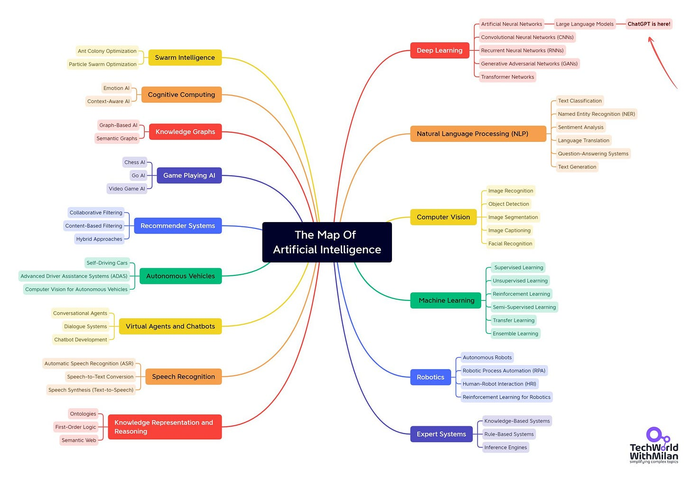](https://substackcdn.com/image/fetch/$s_!bbIF!,f_auto,q_auto:good,fl_progressive:steep/https%3A%2F%2Fsubstack-post-media.s3.amazonaws.com%2Fpublic%2Fimages%2F913c0977-d2f6-4d8e-aae6-39f9e35c14cd_2048x1413.jpeg)The complete map of Artificial Intelligence

> ℹ️****Markov chains are the original LLMs**. *Long before ChatGPT transformed how we interact with language, Russian mathematician [Andrey Markov](https://en.wikipedia.org/wiki/Andrey_Markov) laid its foundations. In 1913, Markov published a groundbreaking analysis of Pushkin’s Eugene Onegin, showing how sequences of words follow predictable statistical patterns.*
> 
> *This pioneering work introduced what we now call **[Markov chains](https://en.wikipedia.org/wiki/Markov_chain)**, a core principle behind modern Large Language Models (LLMs).*
> 
> *Over a century later, the technology inspired by Markov’s insight lets us chat naturally with AI tools like ChatGPT, demonstrating how mathematical curiosity about poetry can shape the future of communication.*

## 2. What is ChatGPT

To understand how ChatGPT relates to AI in a more profound sense, it is helpful to consider its *place* within the hierarchy of AI techniques. Below is a breakdown from the broadest concept (AI) down to the specific technology (ChatGPT):

### **Level 1: Artificial Intelligence (AI)**

The broadest category, which represents the science of making machines *[exhibit](https://en.wikipedia.org/wiki/Artificial_intelligence)*[https://en.wikipedia.org/wiki/Artificial_intelligence](https://en.wikipedia.org/wiki/Artificial_intelligence)*[intelligence](https://en.wikipedia.org/wiki/Artificial_intelligence)*. Early AI systems were largely **symbolic** or rule-based (explicit “if-then” logic), but modern AI is **data-driven primarily**.

AI encompasses any method that enables the automation of reasoning, decision-making, perception, and other processes across various domains.

### **Level 2: Neural Networks (NN)**

A class of AI inspired by the human **[brain’s neuron connections](https://en.wikipedia.org/wiki/Neural_network_(machine_learning))**. Neural networks are layered networks of simple computational “neurons” that can learn complex functions.

Early neural nets (like the 1950s Perceptron) led to today’s powerful models by stacking many layers.

### **Level 3: Deep Learning (DL)**

The use of **multi-layered neural networks** (hence “deep” networks). [Deep learning](https://en.wikipedia.org/wiki/Deep_learning) has driven many recent AI breakthroughs in image recognition, speech recognition, and NLP. By adding more layers (and more data), DL models automatically learn hierarchical features, from low-level edges in images up to high-level concepts, for example.

### **Level 4: Transformers**

A **revolutionary neural network architecture** introduced in 2017 by Google researchers (check the “[Attention Is All You Need](https://arxiv.org/abs/1706.03762)” paper). Transformers use a mechanism called **self-attention** to process input data (explained in detail in the next section).

[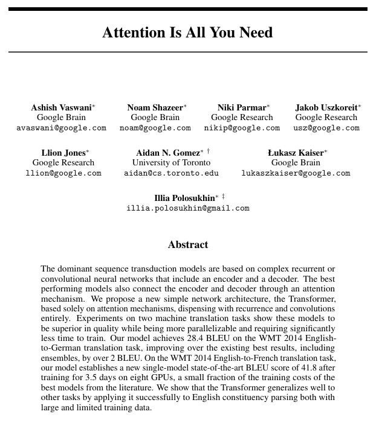](https://substackcdn.com/image/fetch/$s_!F2oo!,f_auto,q_auto:good,fl_progressive:steep/https%3A%2F%2Fsubstack-post-media.s3.amazonaws.com%2Fpublic%2Fimages%2F07d7c903-6e9d-4bcc-a4f6-1b29b927ea00_627x706.png)[Attention Is All You Need](https://arxiv.org/abs/1706.03762) (Vaswani A, et al.)

Unlike older recurrent neural networks (RNNs), which process words sequentially, transformers can **examine an entire sequence in parallel**, focusing on different parts of the input with an attention mechanism.

This design revolutionized deep learning, enabling significantly improved performance on language tasks (and in other domains).

> ➡️*Learn more about [transformers](https://jalammar.github.io/illustrated-transformer/).*

### **Level 5: Large Language Models (LLMs)**

These are **very large** **neural networks trained on language**, often with billions of parameters and trained on massive collections of text and resources. GPT models are LLMs, as are others like Google’s BERT or PaLM.

LLMs can understand and generate text with a high level of fluency. They are a product of deep learning, scaling up neural networks and data.

[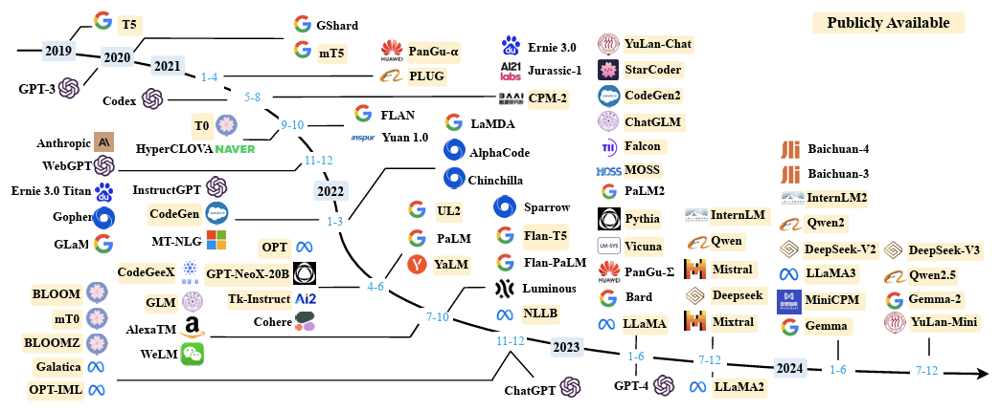](https://substackcdn.com/image/fetch/$s_!W9PJ!,f_auto,q_auto:good,fl_progressive:steep/https%3A%2F%2Fsubstack-post-media.s3.amazonaws.com%2Fpublic%2Fimages%2F18c5cc81-231c-45c4-af0b-2fb8d547ab9d_1044x430.png)A timeline of existing large language models ([Source](https://arxiv.org/pdf/2303.18223))

### **Level 6: GPT (Generative Pre-trained Transformer)**

A family of **LLM** **models based on the [transformer architecture](https://en.wikipedia.org/wiki/Transformer_(deep_learning_architecture))**. “GPT” refers explicitly to models that are *pre-trained* on large text datasets and can generate human-like text.

In other words, a GPT is a **large language model** that has learned patterns from vast amounts of text (unsupervised pre-training) and can then be fine-tuned for specific tasks.

They're especially adept at understanding and generating human language, making them suitable for tasks such as language translation, text generation, and summarization.

A GPT is essentially an **artificial neural network for language** that leverages the transformer design. OpenAI’s GPT series (GPT-1 through GPT-4) is a prime example.

We had a few variations of these models:

1. **[GPT](https://github.com/openai/finetune-transformer-lm) (2018)** - The first public model (117M parameters). Pretrained on text, fine-tuned for tasks. Showed that transformers could outperform older NLP methods.
2. **[GPT-2](https://github.com/openai/gpt-2) (2019)** - Up to 1.5B parameters. Generated coherent long-form text. The initial release was limited due to safety concerns.
3. **[GPT-3](https://openai.com/index/gpt-3-apps/) (2020)** - 175B parameters. Performed well across tasks without fine-tuning.
4. **[GPT-3.5](https://openai.com/index/chatgpt/) (2022)** - Surprised many with its general capabilities and was the first significant breakthrough in this field.
5. **[GPT-4](https://openai.com/index/gpt-4/) (2023)** - Improved reasoning, creativity, and accuracy. Larger and smarter, though the exact size was undisclosed.
6. **[GPT-4o](https://openai.com/index/hello-gpt-4o) (2024)** - Multimodal (text, image, audio). Real-time interaction, unified architecture across input types.
7. **[o3](https://openai.com/index/introducing-o3-and-o4-mini/?) (2025)** - Reasoning-first variant. Leaner inference, longer working memory, native tool orchestration, and step-by-step transparency for enterprises and agents.

Essential characteristics of GPT models are:

- **Parameters** = capacity. Each parameter is a weight that the network adjusts during training. More parameters can model subtler patterns, but they raise training and inference costs.
- **Context window** = the token limit per request. Larger windows fit long documents, codebases, or multistep instructions without truncation.
- **Architecture**indicates whether the model is dense or MoE, multimodal or text-only, and signals for speed, GPU memory requirements, and capability range.

For example, the GPT-4o model has over 200B parameters, and a 128K context window, with a decoder-only architecture suitable for long documents and coding.

### **Level 7: ChatGPT**

An **application built on the GPT-4 model** that is optimized for conversational interaction. Think of GPT-4 as the engine, and ChatGPT as the polished vehicle.

It’s essentially a **user-friendly chatbot interface** over a powerful LLM.

Here is the list of AI techniques that preceded GPT.

[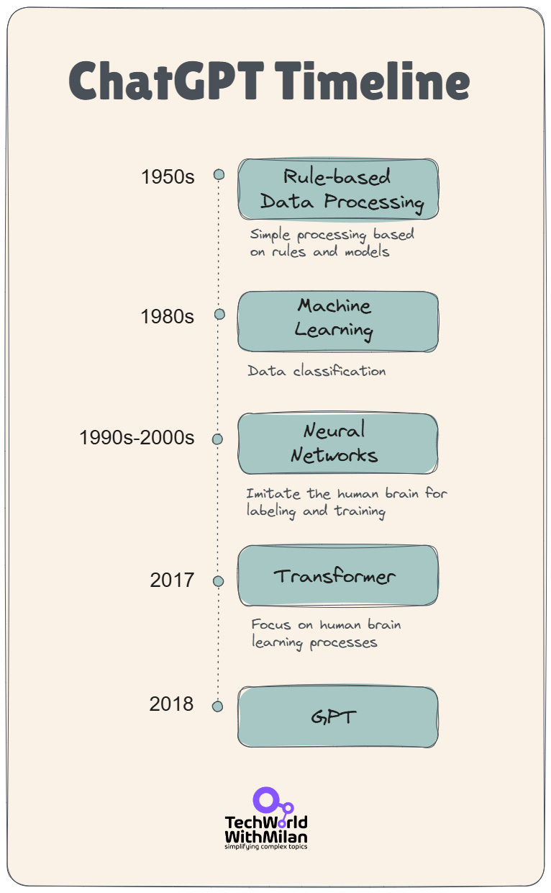](https://substackcdn.com/image/fetch/$s_!3eze!,f_auto,q_auto:good,fl_progressive:steep/https%3A%2F%2Fsubstack-post-media.s3.amazonaws.com%2Fpublic%2Fimages%2F19e9988d-84f9-4e9d-8318-976afc534885_766x1240.png)ChatGPT Timeline

Each layer in this hierarchy narrows the scope: *AI* is the broad field; *deep learning* is a technique in AI; *transformers* are a specific DL architecture; *GPT* is a transformer-based model for text; *GPT-4* is the latest version of that model; and *ChatGPT* is a tailored service using GPT-4.

Here is the overview of AI Terminology, with ChatGPT at the center.

[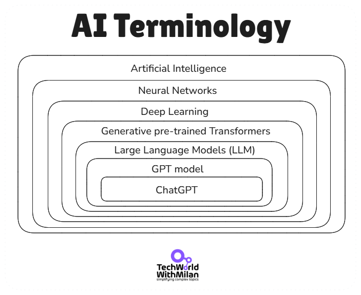](https://substackcdn.com/image/fetch/$s_!Kthb!,f_auto,q_auto:good,fl_progressive:steep/https%3A%2F%2Fsubstack-post-media.s3.amazonaws.com%2Fpublic%2Fimages%2F2ea198e0-e08a-4c0b-9245-36ce1f327f88_703x575.png)

When someone uses ChatGPT, they are seeing one **specific outcome of AI research**, not a mystical, general intelligence.

## 3. How ChatGPT works

Now that we’ve placed ChatGPT in context, let’s peek under the hood at how it operates. **ChatGPT is powered by a large neural network (GPT-4) using the transformer architecture.** This means it’s essentially a very complex mathematical function with *layers of artificial “neurons”* arranged in sequences called transformer blocks.

During training, the model was fed an enormous amount of text from the internet, books, articles, and other sources, and it learned to predict the next word in a sentence. By doing this billions of times, it adjusted the strengths of connections in the network (the *weights* of the neurons) to become extremely good at language prediction and generation. And the bigger the model, the more precise it is.

> ℹ️*A simple model usually contains two files: parameters (a large file), which includes weights of a neural network, and a runtime file.*

[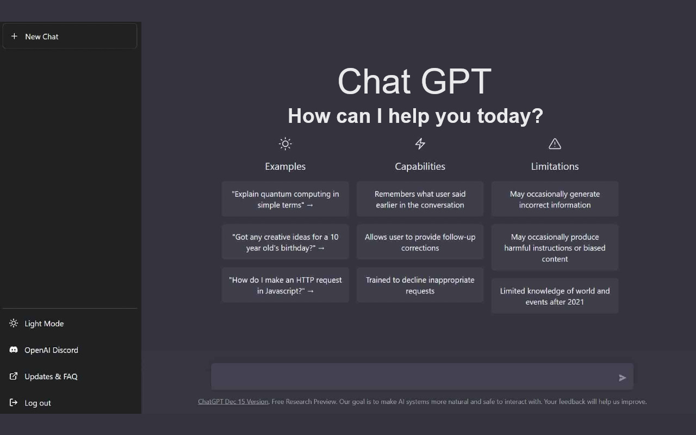](https://substackcdn.com/image/fetch/$s_!ugnc!,f_auto,q_auto:good,fl_progressive:steep/https%3A%2F%2Fsubstack-post-media.s3.amazonaws.com%2Fpublic%2Fimages%2F2452572f-a233-4dbb-9e5e-9f85f07f6ab9_1280x800.png)

Key aspects of how this works include:

### **Supervised vs. unsupervised learning**

Before GPT-1, AI models learned like students with flashcards. Every piece of training data needed a human-written label. A photo of a dog paired with "This is a dog." A picture of a cat paired with "This is a cat." This **supervised learning** approach worked, but it had a fatal flaw: humans can only label a limited amount of data.

GPT changed the game by learning like a child learns language, by listening to everything around it. Instead of labeled flashcards, it got the entire internet. No labels. No categories. Just raw text. The model had to figure out the patterns on its own.

This **unsupervised approach** allows GPT-1 to train on vastly more data than any supervised model could handle. While supervised models were limited to thousands of carefully labeled examples, GPT could learn from billions of web pages, books, and articles.

The results speak for themselves. GPT-4 learned not just from text, but also from images and audio. It figured out what an apple is by reading about apples. It learned what an apple looks like by seeing thousands of apple photos. No human had to label each one.

But here's the catch: **unsupervised learning is unpredictable**. You feed a model the internet, and you don't know exactly what it will learn. That's why every GPT model gets fine-tuned after pre-training, often using supervised techniques to shape its behavior.

The real breakthrough wasn't choosing unsupervised over supervised learning. It was initially **used for unsupervised learning to build a foundation, followed by supervised learning to refine it**. That two-step process is why modern AI can do things we never thought possible.

[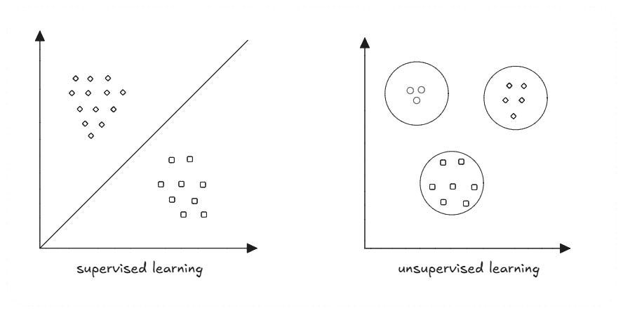](https://substackcdn.com/image/fetch/$s_!tPiA!,f_auto,q_auto:good,fl_progressive:steep/https%3A%2F%2Fsubstack-post-media.s3.amazonaws.com%2Fpublic%2Fimages%2Ff8b9e69b-01e6-4efa-9112-ae78dd7fe51d_888x446.png)Supervised vs unsupervised learning

A models that used supervised learning are usually noted as “thinking” models in different UIs. OpenAI o3 and other o models are this kind of model.

### Transformer architecture

The [Transformer architecture](https://research.google/blog/transformer-a-novel-neural-network-architecture-for-language-understanding/) forms the core of ChatGPT. It is a neural network architecture that utilizes **[self-attention mechanisms](https://arxiv.org/abs/1706.03762)**, enabling it to process input sequences of varying lengths efficiently through parallel computation.

It takes an input sequence of text and is trained to perform a summarization or classification task. This self-attention mechanism enables the model**to simultaneously assess the significance of words relative to one another, thereby** greatly enhancing contextual understanding.

The diagram below illustrates the architecture of a **Transformer-based neural network**. Text input is converted into numerical embeddings, processed through a series of transformer blocks (each block containing mechanisms for attention and feed-forward neural layers).

Finally, it produces an output sequence (the generated text).

[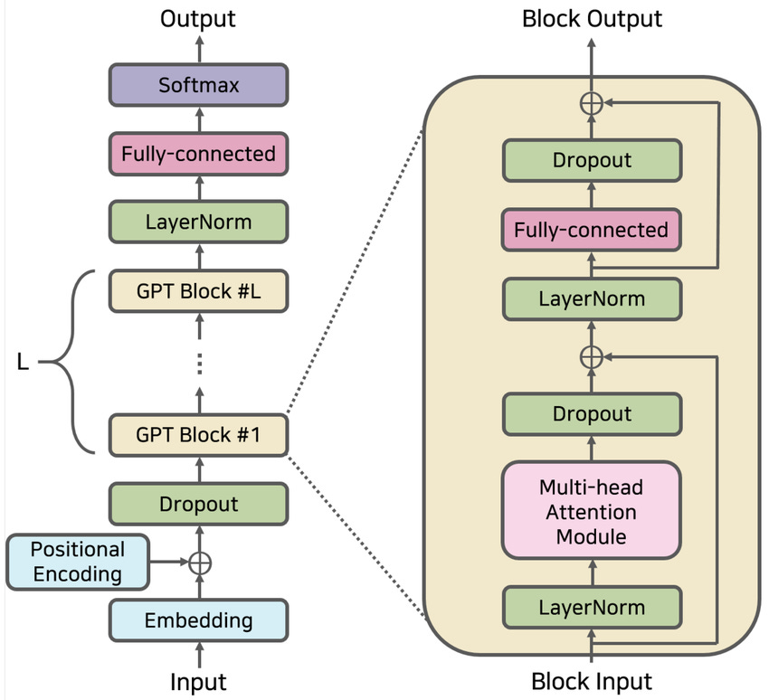](https://substackcdn.com/image/fetch/$s_!Gw_o!,f_auto,q_auto:good,fl_progressive:steep/https%3A%2F%2Fsubstack-post-media.s3.amazonaws.com%2Fpublic%2Fimages%2Fe0883297-0805-46d5-81d3-9011a1c72ba3_850x774.png)Transformer architecture (on the left, the encoder, on the right, the decoder)

> ℹ️*Note that we still lack a theory for why deep networks settle on specific weights. Small subsets can reconstruct or replace most parameters: 5% predicts the other 95%, and pruning 80% leaves the outputs unchanged. Discarding two‑thirds of the  training data has even improved performance in recent work.*
> 
> *Most training techniques emerged from heuristic trial-and-error, with explanations following later. Each large‑model inference burns orders of magnitude more energy than a single cortical decision. Breaking the scaling ceiling demands principles that reveal and exploit these inefficiencies.*
> 
> [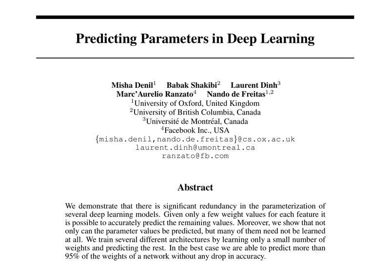](https://substackcdn.com/image/fetch/$s_!vAIG!,f_auto,q_auto:good,fl_progressive:steep/https%3A%2F%2Fsubstack-post-media.s3.amazonaws.com%2Fpublic%2Fimages%2F07265906-444a-4fbc-8fb0-d73404474e8f_800x560.jpeg)

### Encoder-decoder architecture

Inside the transformers, we have built in an encoder-decoder structure. Each consists of stacked transformer layers that pair **self-attention** with **feed-forward networks**, plus **residual connections** and **layer normalization**.

- **The encoder** reads your input, capturing context and word relationships.
- **The decoder** uses that context and previously generated tokens to build a response.

For example, if we want to translate a sentence from one language to another, the encoder reads the sentence and outputs its representation. In contrast, the decoder reads the encoder representation and generates a proper translation.

Today, we mostly see **decoder-only architecture** in modern OpenAI LLMs. These architectures work in the following way:

1. We provide them with a text
2. Then we tokenize the text
3. Each token is associated with a unique vector representation, where a list of vectors is created for each token (token vectors)
4. Positional embeddings are added to mark the position of each token in the input sequence.
5. We pass this as an input to the transformer.

Then, when processing inputs, each block of the transformer architecture takes a list of token vectors and produces a list of transformed token vectors as an output.

> ➡️ *Check this interesting **[LLM Visualization](https://bbycroft.net/llm)**and **[Transformer Explainer](https://poloclub.github.io/transformer-explainer/)**.*

### Attention mechanism

Unlike older sequential models, transformers utilize a self-attention mechanism that enables the model to consider **all the words in a sentence (or even a paragraph) about each other simultaneously**.

Transformers utilize **multi-head self-attention** instead of sequential processing. Every token compares itself to every other token in parallel using a dot‑product attention score:
\(\mathrm{Attention}(Q, K, V) = \mathrm{softmax}\left(\frac{QK^\top}{\sqrt{d_k}}\right) V\)
For example, when understanding a sentence like “On Friday, the judge issued a sentence,” the model uses attention to realize that **“judge”** and **“issued”** provide context for the word **“sentence”** (in the sense of a legal penalty versus a grammatical sentence).

This *attention* enables ChatGPT to maintain context and focus more on specific words that are crucial for understanding the sentence's meaning.

> *“Self-attention is a sequence-to-sequence operation: a sequence of vectors goes in, and a sequence of vectors comes out. Let’s call the input vectors*`x1`*,*`x2`*,…,*`xt`*and the corresponding output vectors*`y1`*,*`y2`*,…,*`yt`*. The vectors all have dimension k. To produce the output vector*`yi`*The self-attention operation simply takes a weighted average over all the input vectors. The simplest option is the dot product.”*
> 
> Source: [Transformers from scratch](https://peterbloem.nl/blog/transformers) by Peter Bloem

[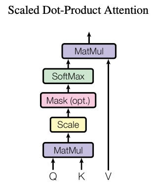](https://substackcdn.com/image/fetch/$s_!Ncsp!,f_auto,q_auto:good,fl_progressive:steep/https%3A%2F%2Fsubstack-post-media.s3.amazonaws.com%2Fpublic%2Fimages%2F8f34bf58-188c-4c85-8010-beac584bb8de_314x386.png)Scaled Dot-Product Attention ([Source](https://arxiv.org/abs/1706.03762))

### **Layers and patterns**

The network has dozens (or hundreds) of layers, and each layer learns increasingly abstract features of language. Early layers may detect simple patterns (such as which words often follow which), while later layers capture high-level semantics and even subtle nuances or styles.

The many ***interconnected nodes**(hidden layers)* enable the extraction of complex patterns, which is why ChatGPT can produce paragraphs of remarkably coherent and contextually relevant text.

### **Parallel processing**

Transformers can process words in parallel rather than one by one. This makes training on massive datasets feasible and allows the model to capture **long-range dependencies** in text (connecting information from the beginning of a conversation to something later, for instance).

This is a significant reason ChatGPT can handle long prompts or dialogues and still accurately refer back to earlier context.

### **Reinforcement Learning from Human Feedback (RLHF)**

One breakthrough behind ChatGPT’s success is **[Reinforcement Learning from Human Feedback (RLHF)](https://en.wikipedia.org/wiki/Reinforcement_learning_from_human_feedback)**. Instead of just predicting the next word, RLHF trains the model to respond the way a helpful assistant should.

It works in three steps:

1. **Supervised fine-tuning**: Human labelers write ideal answers to sample prompts. The model learns from these.
2. **Reward model**: For each prompt, the model generates multiple answers. Humans rank them. A separate model learns to predict these rankings.
3. **Reinforcement learning (PPO)**: The base model is fine-tuned again, this time using the reward model as a guide to optimize behavior.

RLHF turns a powerful language model into something safer, more helpful, and more aligned with how people want it to behave.

[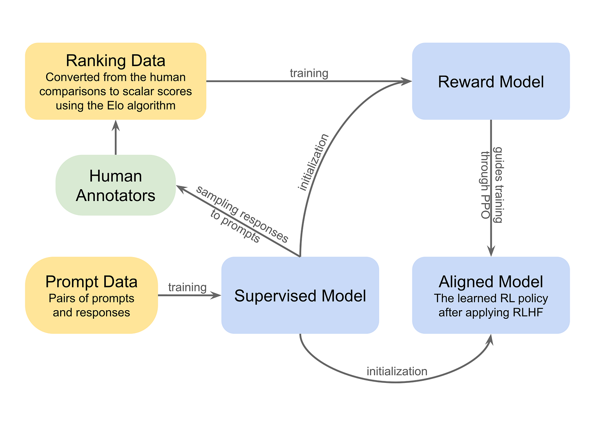](https://substackcdn.com/image/fetch/$s_!uZG2!,f_auto,q_auto:good,fl_progressive:steep/https%3A%2F%2Fsubstack-post-media.s3.amazonaws.com%2Fpublic%2Fimages%2Fd9bb988b-1ea5-4385-84a3-047d3e5ad0ab_1920x1372.png)Reinforcement learning from human feedback ([Source](https://en.wikipedia.org/wiki/Reinforcement_learning_from_human_feedback))

### **Generative output**

When you prompt ChatGPT with a question or task, it doesn’t retrieve answers from a database. Instead, it generates a response ***word-by-word*** on the fly (autoregressively), by predicting what the most likely next word should be (based on its pre-training). Pre-training is done on a large corpus of text (books, web, publications), and is incredibly expensive.

The generation is conditioned on all the input it has seen in the conversation (thanks to attention and large context windows). The result is original phrasing that often sounds very human-like, but it’s essentially **pattern prediction** rather than a thought-out plan or introspection.

Such an architecture enables the model to consider the context of all input tokens through self-attention, rather than processing words sequentially.

Here is the complete scenario:

[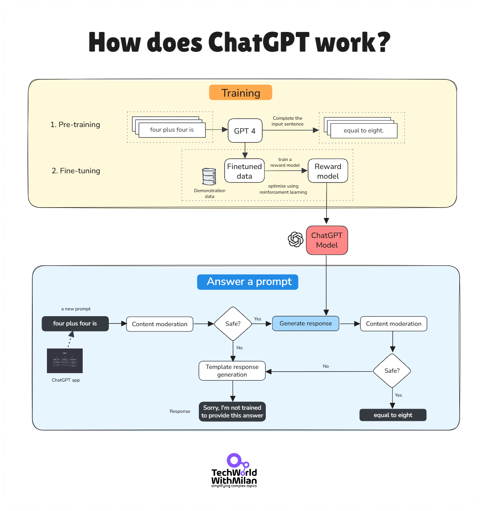](https://substackcdn.com/image/fetch/$s_!KwaY!,f_auto,q_auto:good,fl_progressive:steep/https%3A%2F%2Fsubstack-post-media.s3.amazonaws.com%2Fpublic%2Fimages%2F2d5eae3e-bc2f-426d-ba46-5dfe3360377f_1248x1327.png)How does ChatGPT work

### The hallucination problem

It’s important to note that **ChatGPT doesn’t truly “understand”** language the way humans do. It doesn’t have desires or consciousness, as it operates by statistically modeling language.

Thus, it can sometimes produce incorrect or absurd answers if the prompt leads it that way, or if it encounters gaps in its training knowledge. This means that models can **hallucinate**. And this is not the biggest problem; the biggest problem is that they do it with **confidence**.

Hallucinations happen when the model generates plausible-sounding information that's completely false. Ask about a scientific paper that doesn't exist, and it might invent one. Request a summary of a research paper that hasn't been seen, and it will confidently describe methods and findings that were never written.

Recently, I asked an LLM to help me research a topic and write a text proposal backed by a scientific and reference paper, but it generated more than 5 papers that don’t exist.

This happens because **ChatGPT predicts patterns, not facts.** When it encounters a gap in its training data, it fills it with whatever seems statistically likely. The model lacks a mechanism to indicate "I don't know"; it simply continues to predict the next plausible token.

Here's what makes hallucinations dangerous: they're often mixed with accurate information. The model might correctly explain a legal principle, then cite a fictional case to support it. Or describe a genuine scientific concept using made-up studies. The blend of truth and fiction makes detection more challenging.

What this means: verify everything necessary. Use ChatGPT to explore ideas and draft content, not as a source of truth. If accuracy is a concern, always **verify the output against reliable sources**. The model's confidence tells you nothing about its accuracy.

[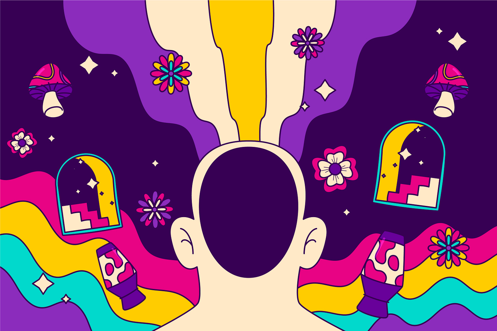](https://substackcdn.com/image/fetch/$s_!d6_M!,f_auto,q_auto:good,fl_progressive:steep/https%3A%2F%2Fsubstack-post-media.s3.amazonaws.com%2Fpublic%2Fimages%2F96ef1d28-459e-48eb-996c-f3ac56c1bf38_3000x2000.jpeg)Hallucinations (Image: [FreePik](https://www.freepik.com/))

> #### **🚫 LLMs aren’t superintelligences, they’re pattern machines**
> 
> *Large language models don’t “think.” They spot patterns in text and predict what comes next based on statistical odds, not reasoning or understanding. At best, they mimic reasoning by echoing structures they’ve seen in their training data, but are non-deterministic.*
> 
> ***For example**, you type: “The cat sat on the”. The model splits this into tokens like ["The", " cat", " sat", " on", " the"] and computes a probability for every possible next token, common words like “mat,” “floor,” or “chair.” For instance, it might assign:*
> 
> - *“ mat” → 30%*
> - *“ chair” → 25%*
> - *“ couch” → 20%*
> - *others less likely…*
> 
> *So it could pick “mat” (the highest probability) or sample differently based on how “creative” it’s configured to be. Once it picks “ mat”, the new input becomes “The cat sat on the mat”, and it calculates probabilities for the next token again, maybe “.”, “and”, “, ” etc., choosing one based on the same process.*
> 
> *This loop continues token by token until it completes the response.*
> 
> *But, here is the critical part: **ChatGPT can't look ahead.**When it writes 'The cat sat on the', it has no idea it will eventually write 'mat.' It has no plan and no destination.*
> 
> *Just the next most likely word based on what came before.*
> 
> *Another example is if you ask LLMs to pick a random number between 1 and 50, and you will get the same result (27).*
> 
> *This blindness explains ChatGPT's biggest failures:*
> 
> - ***It contradicts itself because it can't see what it wrote three paragraphs ago***
> - ***It loses track of complex arguments because each word is a fresh decision***
> - ***It confidently starts explanations it can't finish because it never knew where it was going***
> 
> *To conclude, **LLMs aren’t artificial superintelligence**. They’re sophisticated text predictors, simply adding one word at a time (yet, [not so simple](https://www.youtube.com/watch?v=YEUclZdj_Sc)).*
> 
> *Here is also **[Apple research paper](https://arxiv.org/pdf/2410.05229v1)** that prove that.*
> 
> [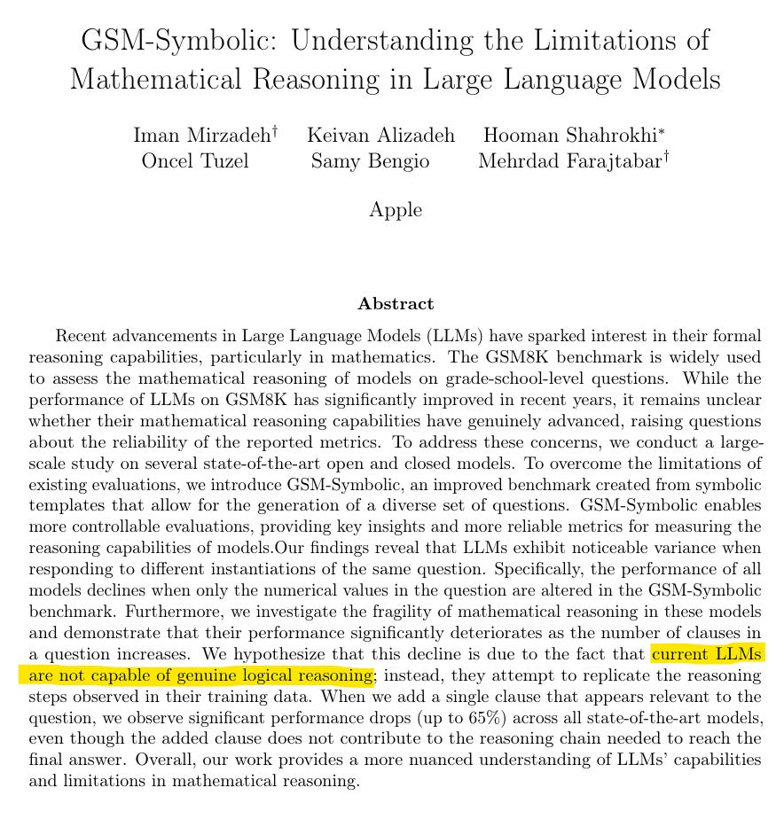](https://substackcdn.com/image/fetch/$s_!TXlx!,f_auto,q_auto:good,fl_progressive:steep/https%3A%2F%2Fsubstack-post-media.s3.amazonaws.com%2Fpublic%2Fimages%2F35b0d16c-32be-490b-95c3-d91c634d87fe_884x924.png)[GSM-Symbolic: Understanding the Limitations of Mathematical Reasoning in Large Language Models](https://arxiv.org/pdf/2410.05229v1) (Mirzadeh I, et al.)
> 
> *Understanding this changes how you prompt. Don't ask ChatGPT to 'keep in mind' multiple constraints, it physically can't. Instead, structure prompts so the most important information comes last. Break complex tasks into steps. Expect drift in long responses.*

## 4. Conclusion

In summary, **ChatGPT is not the entirety of AI; it’s a product of AI techniques.** The confusion between ChatGPT and “AI” likely stems from the tangible and impressive capabilities of ChatGPT. ChatGPT provides a friendly glimpse of what AI can do (conversing in natural language), but behind it lies **decades of AI research** in various subfields.

AI, as a whole, ranges from the logic-based systems of the past to the deep learning models of today, which enable creative, generative tools.

Understanding this context is not just a detail; it matters if you want to truly understand the technology or pursue a career in the field. For example, someone using ChatGPT isn’t automatically an “AI expert” any more than someone using Google Maps is a cartographer.

There is a **rich landscape of AI methods** beyond ChatGPT, each suited to different problems. By appreciating that **ChatGPT is just one slice of the AI pie**, we can better understand both the limitations of any single AI system and the potential of AI as a whole.

Understanding these distinctions helps you: choose the right tool for your task, recognize when ChatGPT will fail, write better prompts, and avoid treating it as an oracle, because it is not.

## 5. References

Here are the most important and widely recommended resources to build a strong foundation in artificial intelligence and modern language models:

1. **"[Artificial Intelligence: A Modern Approach](https://aima.cs.berkeley.edu/)" by Stuart Russell & Peter Norvig.**The definitive textbook covering the breadth of AI, from foundational algorithms to advanced topics.
2. **"[Attention Is All You Need](https://arxiv.org/abs/1706.03762)" (Vaswani et al., 2017).**The groundbreaking research paper that introduced the transformer architecture is now core to LLMs and GPT models.
3. **"[Deep Learning](https://www.deeplearningbook.org/)" by Ian Goodfellow, Yoshua Bengio, and Aaron Courville.**A comprehensive and authoritative guide to deep learning theory and practice.
4. **[Stanford CS224N: Natural Language Processing with Deep Learning](https://web.stanford.edu/class/cs224n/).**Free online course (YouTube) that covers NLP, transformers, and hands-on deep learning projects.
5. **"[The Illustrated Transformer](https://jalammar.github.io/illustrated-transformer/)" by Jay Alammar.**A visual and intuitive online guide explaining how transformers work, ideal for learners at all levels.
6. **[Hugging Face Transformers Library Documentation](https://huggingface.co/docs/transformers/index).**The go-to resource for practical, hands-on experience with state-of-the-art transformer models and tools.

---

## Bonus: AI Acronyms

With the rise of AI, a whole new lexicon has emerged, filled with acronyms that can be daunting. Here's a quick guide to some key terms:

### 1. **AI (Artificial Intelligence)**

Artificial Intelligence encompasses systems that mimic human cognitive tasks, such as recognizing speech, solving problems, or playing chess. It relies on data and logic (or learned patterns) to automate decision-making.

Think of AI as the umbrella under which everything “smart” lives: from recommendation engines to autonomous vehicles.

It’s not magic, it’s engineered to simulate reasoning, perception, planning, and communication.

### 2. **AGI (Artificial General Intelligence)**

AGI describes a future system that can understand, learn, and apply intelligence across *any* domain, just like a human. Present-day AI is task-specific, excelling at tasks such as translation or image classification, but not both.

AGI remains theoretical and elusive. No existing system demonstrates that level of generality.

It’s the holy grail: one AI to rule them all, across any intellectual territory.

### 3. **ML (Machine Learning)**

Machine Learning enables systems to learn patterns from data, eliminating the need for rules programmed by humans. Feed enough examples, and the model will learn to predict, whether forecasting stock prices or spotting fraud.

ML underpins much of modern AI: once your algorithms are set up, they improve over time with new data.

It’s the shift from “if this, then that” to “learned from this.”

### 4. **DL (Deep Learning)**

Deep Learning uses layered neural networks to learn hierarchical features from raw inputs, such as vision, audio, and text. It’s the tech behind breakthroughs in self-driving cars, speech recognition, and GPT-class models.

With enough data and computing power, deep nets beat older ML on perception-heavy tasks.

DL scales neural learning vertically and powers today’s most advanced AI systems.

### 5. **NLP (Natural Language Processing)**

NLP enables machines to comprehend and generate human language. It drives translation, summarization, sentiment analysis, and chatbots.

Modern NLP models don’t just parse words; they grasp context, tone, and intent across languages.

It’s how AI evolved from a data cruncher to a fluent conversationalist.

Learn more about it [here](https://www.youtube.com/playlist?list=PLLssT5z_DsK8BdawOVCCaTCO99Ya58ryR).

### 6. **CV (Computer Vision)**

Computer Vision transforms pixels into real-world intelligence, enabling applications such as face unlock, medical image interpretation, and autonomous driving.

It uses CNNs to detect edges and patterns, enabling systems to “see” the world. CV is the AI bridge that connects visual input to actionable insights.

Learn more about it here:

### 7. **LLM (Large Language Model)**

LLMs are massive transformer-based models trained on vast text corpora. They generate coherent text, answer questions, translate languages, and even write code.

They help us as virtual assistants and writing tools, and recently became context-savvy across text, images, and voice. Their power lies in predictive text modeling at web scale.

Check this intro to LLMs by Andrey Karpathy:

And how we use them:

### 8. **GPT (Generative Pre-trained Transformer)**

GPTs (GPT‑3, GPT‑4, etc.) are flagship LLMs. Pre-training imbues them with broad knowledge; fine-tuning and RLHF shape their conversational style and reliability.

They popularized AI chatbots and set benchmark standards for text generation.

Check this intro to Transformers:

### 9. **RL (Reinforcement Learning)**

Reinforcement Learning trains agents by trial and reward: take action, receive feedback, repeat. This model powers game-playing AI systems (like AlphaGo), robotic policies, and dynamic decision-making systems. RL is the engine behind learning through experience.

Learn more about it [here](https://huggingface.co/learn/deep-rl-course/unit0/introduction).

### 10. **RLHF (Reinforcement Learning from Human Feedback)**

RLHF refines models by structuring feedback loops: humans rank responses, a reward model learns preferences, and the LLM optimizes to satisfy that model.

It’s crucial for aligning chatbots with human expectations, safety, tone, and bias control. Think of it as tuning AI to say what *people* want it to say.

### 11. **RAG (Retrieval-Augmented Generation)**

RAG combines LLMs with document retrieval at inference time. A query triggers a search, and the retrieved context is prepended to the prompt. The LLM then generates a response based on the fresh information.

It tethers AI to facts, reducing hallucinations and keeping responses current.

Learn more about it:

### 12. **GAN (Generative Adversarial Network)**

GANs work by pitting two networks against each other: one generates images, and the other critiques them. Over iterations, the generator learns to create data indistinguishable from real. They produce photorealistic images, synthetic video, and more.

### 13. **CNN (Convolutional Neural Network)**

CNNs scan data with filters to detect spatial patterns, textures, edges, and faces. They revolutionized image classification and remain central to vision systems.

Their layered approach is optimized for spatial learning.

### 14. **RNN (Recurrent Neural Network)**

RNNs handle sequence data by looping outputs back as inputs, making them ideal for tasks such as text, speech, and time series analysis.

They once dominated sequential tasks but struggle with long dependencies. LSTM fixes that problem (next).

### 15. **LSTM (Long Short-Term Memory)**

LSTMs enhance RNNs with gated memory units, allowing them to decide what to remember and what to forget. This keeps long-term patterns in speech or text processing.

They remain reliable when sequence length is a concern.

### 16. **VC (Vibe Coding)**

Vibe coding is a conversational form of coding: prompt an LLM in plain English, iterate, refine, and your IDE is voice and vibe. [Karpathy coined it in February 2025](https://x.com/karpathy/status/1886192184808149383); it skips the manual code grind, letting AI scaffold apps while you guide the direction.

[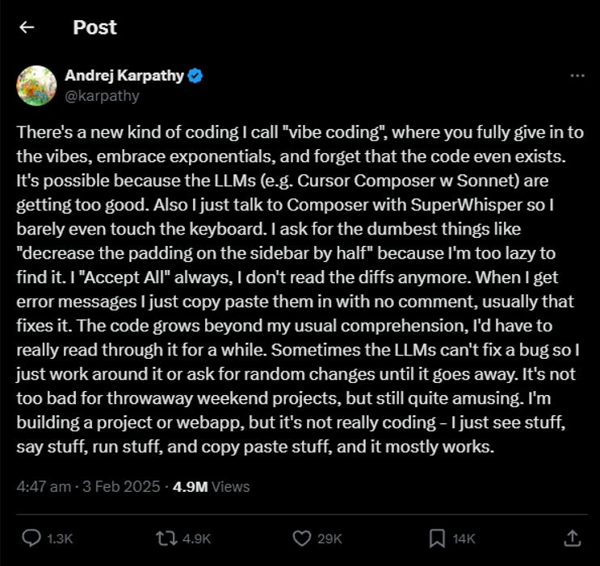](https://substackcdn.com/image/fetch/$s_!7HF1!,f_auto,q_auto:good,fl_progressive:steep/https%3A%2F%2Fsubstack-post-media.s3.amazonaws.com%2Fpublic%2Fimages%2F2adf0300-c62a-40d5-811b-29fdec706bbf_743x702.png)

It accelerates prototyping, but demands developer oversight for security and maintainability.

### 17. **CoT (Chain‑of‑Thought Prompting)**

CoT gets LLMs to articulate their reasoning step-by-step (“let’s think this through…”). That explicit trace boosts performance on logic, math, and multi-step reasoning tasks. It’s like showing your work on an exam, which helps the model both reason and validate.

Learn prompting from these guides:

- [Anthropic](https://docs.anthropic.com/en/docs/build-with-claude/prompt-engineering/overview)
- [Google](https://www.kaggle.com/whitepaper-prompt-engineering)
- [OpenAI](https://cookbook.openai.com/examples/gpt4-1_prompting_guide)

### 18. **ASR (Automatic Speech Recognition)**

ASR converts speech to text, used in voice assistants, captions, and dictation. Modern ASR systems utilize deep neural networks to handle diverse accents and noisy environments. It’s the speech-to-text gateway enabling voice-controlled AI.

### 19. **SOTA (State‑of‑the‑Art)**

SOTA labels the best-performing model on a given benchmark. It’s both a record and a target, the gold standard in research papers.

Tracking SOTA helps gauge progress and spot breakthroughs.

### 20. **FLOPs (Floating-Point Operations per Second)**

FLOPs measure compute throughput; the higher the FLOPs, the more math an AI can perform per second. It quantifies raw compute, which is crucial for training large models or performing real-time inference.

It’s the torque behind AI horsepower.

Here is the complete list of popular AI acronyms:

[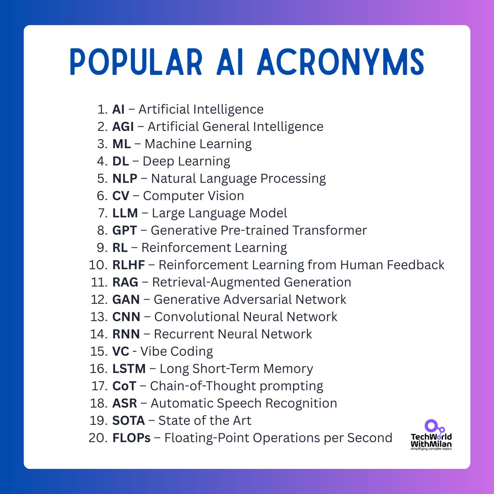](https://substackcdn.com/image/fetch/$s_!0J_a!,f_auto,q_auto:good,fl_progressive:steep/https%3A%2F%2Fsubstack-post-media.s3.amazonaws.com%2Fpublic%2Fimages%2Fa934470e-a099-402c-83f5-22436834aec9_1200x1200.png)AI acronyms

---

## **More ways I can help you:**

- [📚](https://www.patreon.com/techworld_with_milan/shop/ultimate-net-bundle-for-2025-1519389?utm_medium=clipboard_copy&utm_source=copyLink&utm_campaign=productshare_creator&utm_content=join_link)**[The Ultimate .NET Bundle 2025](https://www.patreon.com/techworld_with_milan/shop/ultimate-net-bundle-for-2025-1519389?utm_medium=clipboard_copy&utm_source=copyLink&utm_campaign=productshare_creator&utm_content=join_link)** 🆕. 500+ pages distilled from 30 real projects show you how to own modern C#, ASP.NET Core, patterns, and the whole .NET ecosystem. You also get 200+ interview Q&As, a C# cheat sheet, and bonus guides on middleware and best practices to improve your career and land new .NET roles. **[Join 1,000+ engineers](https://www.patreon.com/techworld_with_milan/shop/ultimate-net-bundle-for-2025-1519389?utm_medium=clipboard_copy&utm_source=copyLink&utm_campaign=productshare_creator&utm_content=join_link)**.
- [📦](https://www.patreon.com/techworld_with_milan/shop/premium-resume-package-1721454?utm_medium=clipboard_copy&utm_source=copyLink&utm_campaign=productshare_creator&utm_content=join_link)**[Premium Resume Package](https://www.patreon.com/techworld_with_milan/shop/premium-resume-package-1721454?utm_medium=clipboard_copy&utm_source=copyLink&utm_campaign=productshare_creator&utm_content=join_link) 🆕**. Built from over 300 interviews, this system enables you to craft a clear, job-ready resume quickly and efficiently. You get ATS-friendly templates (summary, project-based, and more), a cover letter, AI prompts, and bonus guides on writing resumes and prepping LinkedIn. **[Join 500+ people](https://www.patreon.com/techworld_with_milan/shop/premium-resume-package-1721454?utm_medium=clipboard_copy&utm_source=copyLink&utm_campaign=productshare_creator&utm_content=join_link)**.
- [📄](https://www.patreon.com/techworld_with_milan/shop/complete-tech-resume-reality-check-311008?utm_medium=clipboard_copy&utm_source=copyLink&utm_campaign=productshare_creator&utm_content=join_link)**[Resume Reality Check](https://www.patreon.com/techworld_with_milan/shop/complete-tech-resume-reality-check-311008?utm_medium=clipboard_copy&utm_source=copyLink&utm_campaign=productshare_creator&utm_content=join_link)**. Get a CTO-level teardown of your CV and LinkedIn profile. I flag what stands out, fix what drags, and show you how hiring managers judge you in 30 seconds. **[Join 100+ people](https://www.patreon.com/techworld_with_milan/shop/complete-tech-resume-reality-check-311008?utm_medium=clipboard_copy&utm_source=copyLink&utm_campaign=productshare_creator&utm_content=join_link)**.
- [📢](https://www.patreon.com/techworld_with_milan/shop/short-linkedin-content-creator-311232?utm_medium=clipboard_copy&utm_source=copyLink&utm_campaign=productshare_creator&utm_content=join_link)**[LinkedIn Content Creator Masterclass](https://www.patreon.com/techworld_with_milan/shop/short-linkedin-content-creator-311232?utm_medium=clipboard_copy&utm_source=copyLink&utm_campaign=productshare_creator&utm_content=join_link)**. I share the system that grew my tech following to over 100,000 in 6 months (now over 255,000), covering audience targeting, algorithm triggers, and a repeatable writing framework. Leave with a 90-day content plan that turns expertise into daily growth. **[Join 1,000+ creators](https://www.patreon.com/techworld_with_milan/shop/short-linkedin-content-creator-311232?utm_medium=clipboard_copy&utm_source=copyLink&utm_campaign=productshare_creator&utm_content=join_link)**.
- [✨](https://www.patreon.com/c/techworld_with_milan)**[Join My Patreon](https://www.patreon.com/c/techworld_with_milan)**[https://www.patreon.com/c/techworld_with_milan](https://www.patreon.com/c/techworld_with_milan)**[Community](https://www.patreon.com/c/techworld_with_milan) and [My Shop](https://www.patreon.com/c/techworld_with_milan/shop)**. Unlock every book, template, and future drop, plus early access, behind-the-scenes notes, and priority requests. Your support enables me to continue writing in-depth articles at no cost. **[Join 2,000+ insiders](https://www.patreon.com/c/techworld_with_milan)**.
- [🤝](https://newsletter.techworld-with-milan.com/p/coaching-services)**[1:1 Coaching](https://newsletter.techworld-with-milan.com/p/coaching-services)** – Book a focused session to crush your biggest engineering or leadership roadblock. I’ll map next steps, share battle-tested playbooks, and hold you accountable. **[Join 100+ coachees](https://newsletter.techworld-with-milan.com/p/coaching-services)**.

---

## **Want to advertise in Tech World With Milan? 📰**

If your company is interested in reaching an audience of founders, executives, and decision-makers, you may want to **[consider advertising with us](https://newsletter.techworld-with-milan.com/p/sponsorship-of-tech-world-with-milan)**.

---

## **Love Tech World With Milan Newsletter? Tell your friends and get rewards.**

Share it with your friends by using the button below to get benefits (my books and resources).

[Share Tech World With Milan Newsletter](https://newsletter.techworld-with-milan.com/?utm_source=substack&utm_medium=email&utm_content=share&action=share)

[Track your referrals here](https://newsletter.techworld-with-milan.com/leaderboard).