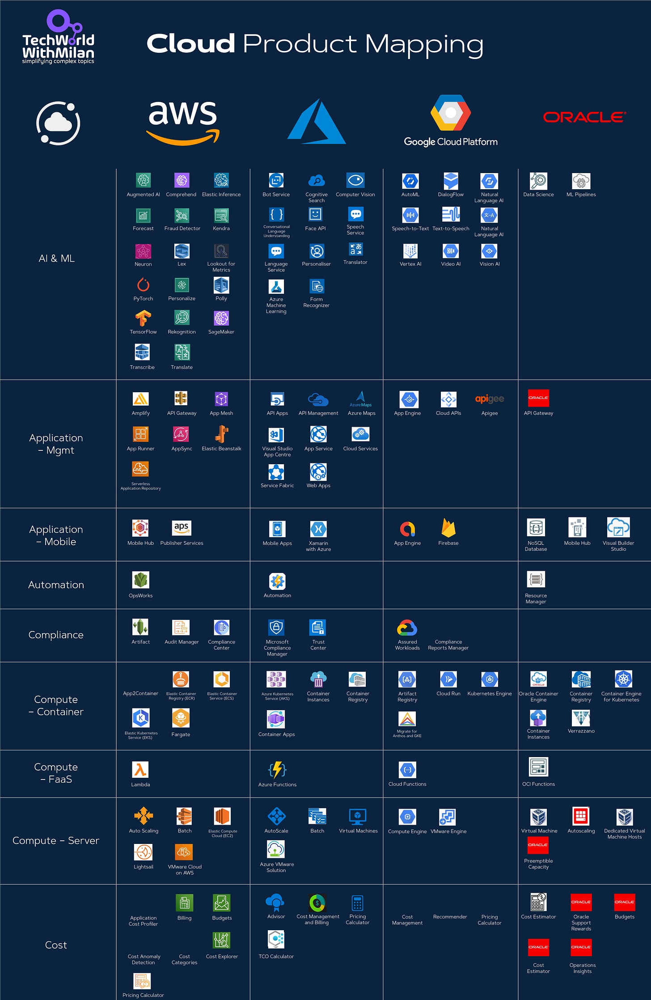
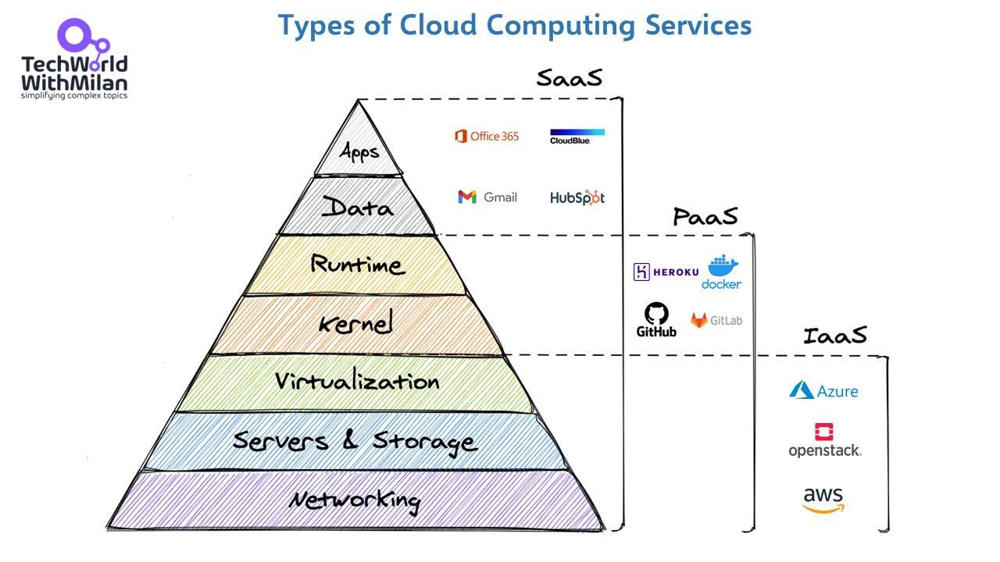
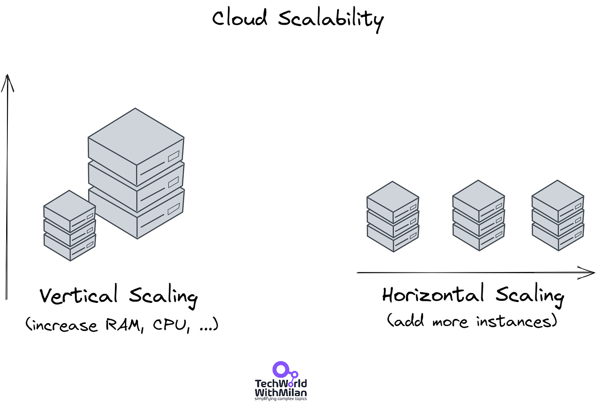

# Cloud Product Mapping (AWS vs. Azure vs. GCP vs. OCI)

*For the multi-cloud world.*

This week’s issue brings to you the following:

- **Cloud Product Mapping**
- **Types Of Cloud Computing Services**
- **Scalability in the Cloud: Vertical vs Horizontal Scaling**

So, let’s dive in.

---

## Cloud Product Mapping

As we can see, many companies today choose a multi-cloud strategy. It's essential to effectively allocate resources by each provider's price strategy, not merely to comprehend the cost. Here is the overview where all primary services between AWS, Azure, and GCP are mapped with links pointing to product home pages.

- **Compute** AWS's EC2 instances, Azure's VMs with their Hybrid Benefit for Microsoft-licensed applications, Google's Compute Engine for reasonably priced batch processing, and Oracle VMs tailored for Oracle-based software stacks can all be utilized for computing.
- **Serverless**: Azure Functions are triggered by Azure Logic Apps, while AWS Lambda responds to data updates in S3. Google Cloud Functions handle Firebase real-time database changes, and Oracle OCI Functions address Oracle Cloud events.
- **Databases**: RDS Aurora from AWS is designed for platforms like international e-commerce. The AI features of Azure SQL make it ideal for BI applications. While Oracle Cloud ATP enables self-managing DBs, Google Cloud SQL offers private IP hosting.
- **Storage**: For data lakes, AWS's S3 is dependable. Media storage is the purpose of Azure Blob Storage. With its quick processing, Google Cloud Storage is appropriate for multimedia tasks, while Oracle Object Storage is the reliable backup option for Oracle databases.
- **Networking**: Azure's VNet, which performs well in hybrid cloud settings, contrasts AWS's VPC's peering choices. Google offers sizable global VPCs for global installations, and Oracle's VCN with FastConnect guarantees a dependable connection to the Oracle Cloud.
- **Identity and Access Management**:  IAM on AWS successfully manages access through its policies. Azure AD enables user communication with other parties. G Suite and Google Cloud Identity are integrated, while Oracle IAM only focuses on Oracle Cloud resource management.
- **Big Data & Analytics**:  AWS's EMR effectively manages vast datasets. Power BI and Azure's HDInsight meet enterprise BI requirements. Dataproc from Google Cloud is well-known for real-time analytics, and Oracle's Big Data platform is designed specifically for Oracle data.

Cloud Product Mapping

Check the complete mapping with all services in the **[GitHub Repo](https://github.com/milanm/Cloud-Product-Mapping)**.

---

## Types Of Cloud Computing Services

There are three main types of cloud computing services: Infrastructure-as-a-Service (IaaS), Platforms-as-a-Service (PaaS), and Software-as-a-Service (SaaS).

- **Infrastructure as a Service (IaaS)**: is the most basic offering of cloud computing services. With IaaS, we can rent infrastructure like servers, virtual machines (VMs), storage, networks, operating systems, etc., from a cloud provider by paying a fee based on our usage. We can spin up resources and scale up or scale out very quickly based on our needs. Of course, once we no longer need the help, we can delete them and pay only for the time we use them.
- **Platform as a Service (PaaS):** With PaaS, we can directly use the services and environments for developing, testing, delivering, and managing software applications as required. This makes it easier for developers to quickly create web, API, mobile apps, etc., without worrying about setting up or managing the underlying infrastructure of servers, storage, network, databases, etc., needed for development—GitHub, Docker, etc.
- **Software as a Service (SaaS):** When using a SaaS model, we consume software applications over the Internet as needed, usually based on a subscription model. Cloud providers manage the underlying infrastructure, operating system, software, etc. They even take care of software upgrades and security patching. We can connect to the application over the Internet using our browser.

Type Of Cloud Computing Services

---

## Scalability in the Cloud: Vertical vs Horizontal Scaling

Scaling is a technique that modifies any system's size by extending or contracting it to meet the requirement. The scaling procedure can be accomplished by adding resources to the current system or integrating a new one.

There are four main pillars of cloud computing: **Scalability, Elasticity, Fault Tolerance, and High Availability**. Cloud scalability is one of the essential pillars of Cloud computing. It is the capacity to change system resources in response to shifting demands.

We have two types of **scalability**:

- **Horizontal scalability**, or scaling out, involves adding more resources (e.g., servers, storage, networking components) to a system to handle increasing workloads. This can be accomplished by adding more instances of the same resource type to a system, either by adding more virtual or physical machines. Horizontal scalability is generally more cost-effective and more accessible to implement than vertical scalability. Yet, it is a bit complicated to maintain a lot of instances when compared to maintaining the same example in vertical scaling.
- **Vertical scalability**, also known as scaling up, involves adding more processing power or resources to a single instance of a system, such as adding more CPU, RAM, or storage to a virtual machine. This type of scalability is proper when a design has reached the limits of its processing power, memory capacity, or other resource constraints. Vertical scalability is generally more expensive and may need downtime to add resources to a system.

Both horizontal and vertical scalability have advantages and disadvantages, and which approach depends on a given system's specific needs and constraints.

Cloud Scalability

---

🎁 This week’s issue is sponsored by **[Product for Engineers](https://newsletter.posthog.com/?ref=techworld)**, **PostHog’s** *newsletter dedicated to helping engineers improve their product skills*.

**[Subscribe for free](https://newsletter.posthog.com/?ref=techworld)** to get curated advice on building great products, lessons (and mistakes) from building **PostHog**, and research into the practices of top startups.

---

Thanks for reading Tech World With Milan Newsletter! Subscribe for free to receive new posts and support my work.