# Computer Science Papers Every Developer Should Read

The foundations of modern software engineering were built on some high-impact research papers. From the algorithms powering most apps today to the databases storing data, many technologies we use daily emerged from academic publications. While these papers might initially seem complex, they offer important insights that can transform your approach to software development.

In this article, we will discuss why it is crucial to read computer science papers, how to do so, and some of my recommendations for the best research papers in the field, the following categories:

- **🧩 System Design and Programming Fundamentals**
- **🌐 Distributed Systems**
- **🗄️ Data Storage and Processing**
- **📏 System Design and Metrics**
- **☁️ Modern Infrastructure**
- 🖥️ **Computer Architecture and Systems Performance**
- 🔍 **Search and Information Retrieval**

So, let’s dive in.

---

## Why should you read computer science papers?

Learning new things is essential for developers, as it helps us build and develop new skills for the job. Yet, I have found that people do not read many research papers on computer science.

You might wonder: *Why should I read research papers?* In those papers, you will **understand different computer science and software engineering concepts** (depth and breadth). Most of the features you use today in your programming languages came from some of those papers, and with new papers, you can predict what will come in the future.

Reading research papers also **cultivates critical thinking**. It allows you to see how others have tackled similar problems, offering solutions and ideas that can save you from reinventing the wheel. For instance, foundational work on large language models (LLMs), such as “[Attention Is All You Need](https://arxiv.org/abs/1706.03762)” by Vaswani et al. (2017), has shaped technologies like ChatGPT.

## What are recommended research papers to read?

Here is the list of the most crucial computer science papers by each category:

### 🧩 System Design and Programming Fundamentals

#### 1. 📄 [On the Criteria To Be Used in Decomposing Systems into Modules (1972), D.L. Parnas](https://www.win.tue.nl/~wstomv/edu/2ip30/references/criteria_for_modularization.pdf)

In this paper, Parnas discussed modularization as a mechanism for improving a system's flexibility and comprehensibility while reducing its development time. He also discussed the criteria for decomposing systems into modules. The principles in this paper directly influence modern software architecture, microservices design, and API development.

🔗 **[Link](https://www.win.tue.nl/~wstomv/edu/2ip30/references/criteria_for_modularization.pdf).**

[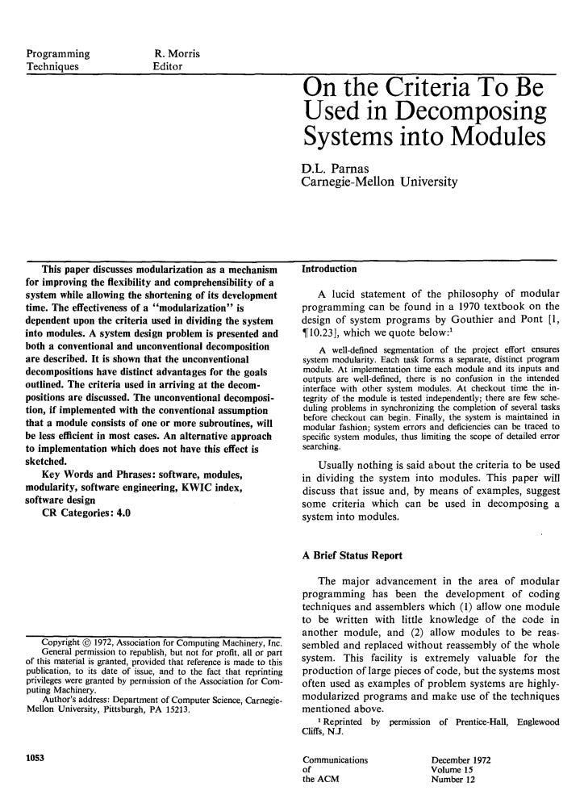](https://substackcdn.com/image/fetch/$s_!jE89!,f_auto,q_auto:good,fl_progressive:steep/https%3A%2F%2Fsubstack-post-media.s3.amazonaws.com%2Fpublic%2Fimages%2Fc7f8cb5e-400f-4c5e-a85c-5fad5dece01e_724x990.png)On the Criteria To Be Used in Decomposing Systems into Modules (1972), D.L. Parnas

> "*The benefits expected of modular programming can be completely achieved if independent development of modules is possible.*" - D.L. Parnas

#### 2. 📄 [An Axiomatic Basis for Computer Programming (1969), C.A.R Hoare](http://sunnyday.mit.edu/16.355/Hoare-CACM-69.pdf)

In this paper, C. A. R. Hoare explores the mathematical logic underlying computer programming. Deductive reasoning should inform every program's state and output. Axioms make up deductive reasoning, and inference rules are based on this collection of axioms. This paper forms the basis of modern program verification tools and type systems.

🔗 **[Link](http://sunnyday.mit.edu/16.355/Hoare-CACM-69.pdf).**

[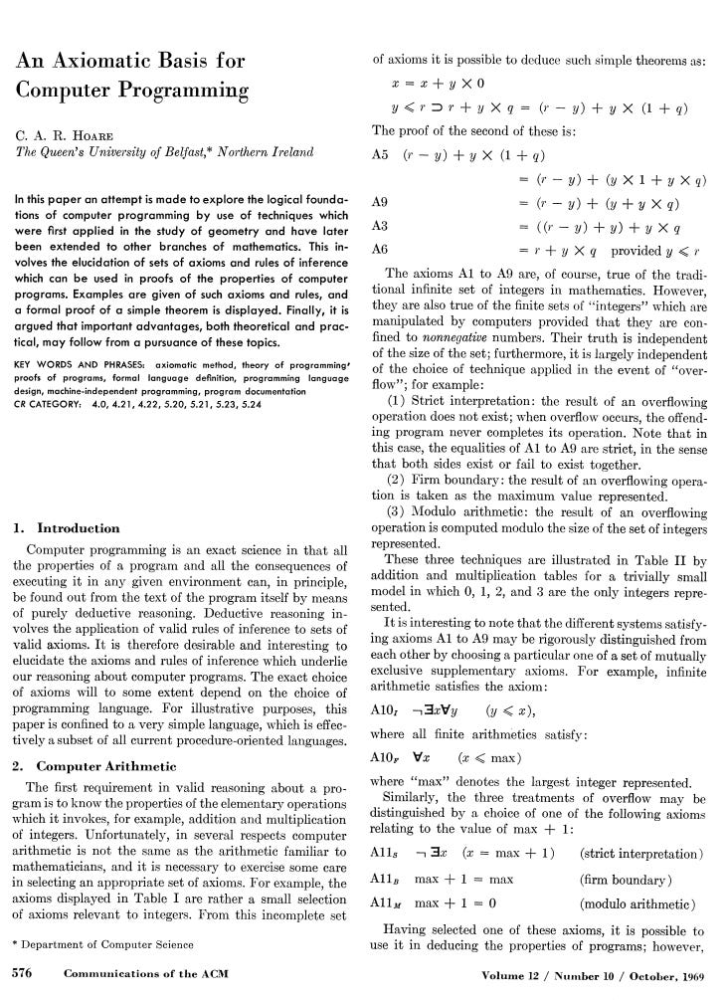](https://substackcdn.com/image/fetch/$s_!hiG0!,f_auto,q_auto:good,fl_progressive:steep/https%3A%2F%2Fsubstack-post-media.s3.amazonaws.com%2Fpublic%2Fimages%2Feea4482a-5ab3-4148-be0b-bfaaa50d6c76_731x1005.png)An Axiomatic Basis for Computer Programming (1969), C.A.R Hoare

> *Another vital paper by C.A.R. Hoare is “[Communicating Sequential Processes](https://www.cs.ucf.edu/courses/cop4020/sum2009/CSP-hoare.pdf),” (1978) where he describes the foundations of concurrent programming.*

#### 3. 📄 [Out of the Tar Pit (2006), B. Moseley, P. Marks](https://curtclifton.net/papers/MoseleyMarks06a.pdf)

This paper discusses the causes and effects of complexity in software systems and approaches to understanding it. It provides crucial insights for managing complexity in modern software development.

🔗 **[Link](https://curtclifton.net/papers/MoseleyMarks06a.pdf)**.

[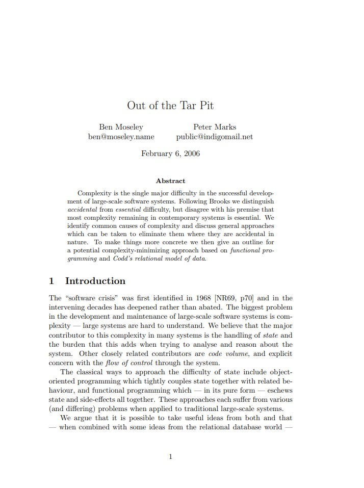](https://substackcdn.com/image/fetch/$s_!v0Ev!,f_auto,q_auto:good,fl_progressive:steep/https%3A%2F%2Fsubstack-post-media.s3.amazonaws.com%2Fpublic%2Fimages%2F39a83fed-7967-44a0-a876-79c1d4b3c3f4_714x957.png)Out of the Tar Pit (2006), B. Moseley, P. Marks

#### 4. 📄 [Why Functional Programming Matters (1990), J. Hughes](https://www.cs.utexas.edu/~shmat/courses/cs345/whyfp.pdf)

In this paper, the authors describe the importance of functional programming where modularisation is key. Understanding the benefits of functional programming in modern software development is essential.

🔗 **[Link](https://www.cs.utexas.edu/~shmat/courses/cs345/whyfp.pdf)**.

[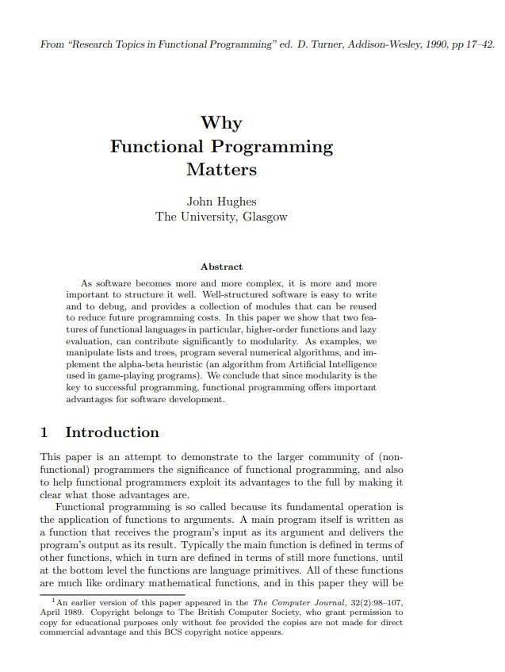](https://substackcdn.com/image/fetch/$s_!xRHI!,f_auto,q_auto:good,fl_progressive:steep/https%3A%2F%2Fsubstack-post-media.s3.amazonaws.com%2Fpublic%2Fimages%2Fdde6094b-d53a-4ead-894a-07f8f90c78ab_637x847.png)Why Functional Programming Matters (1990), J. Hughes

### 🌐 Distributed Systems

#### 5. 📄 [Time, Clocks, and the Ordering of Events in Distributed Systems (1978.) L. Lamport](https://www.microsoft.com/en-us/research/publication/time-clocks-ordering-events-distributed-system)

In the essay, Lamport discusses how humans perceive time, the necessity for a paradigm change regarding distributed systems, and the notion of incomplete ordering. It is fundamental to distributed databases, blockchain, and cloud computing.

🔗 **[Link](https://www.microsoft.com/en-us/research/publication/time-clocks-ordering-events-distributed-system)**.

[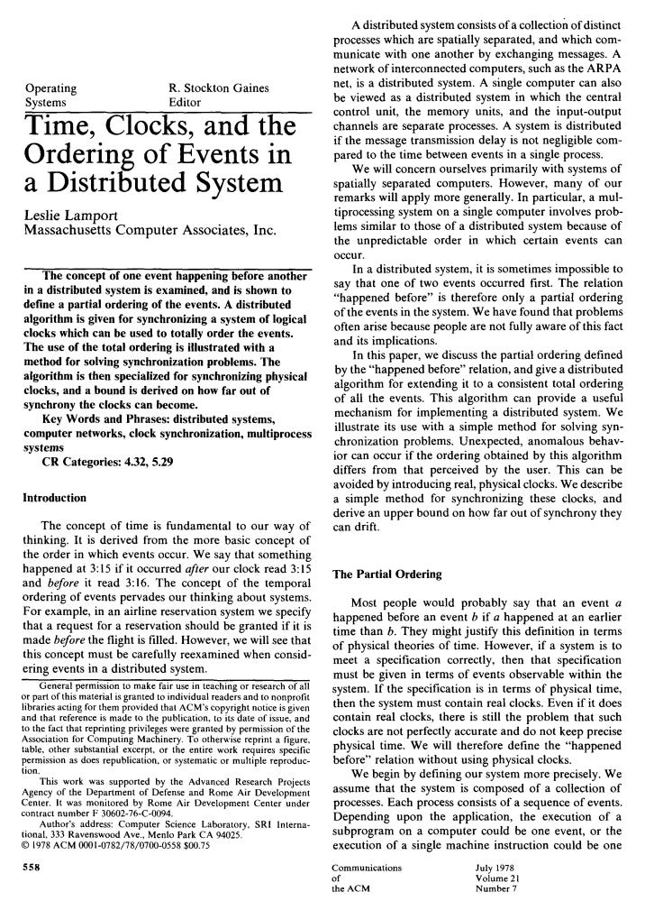](https://substackcdn.com/image/fetch/$s_!lzW9!,f_auto,q_auto:good,fl_progressive:steep/https%3A%2F%2Fsubstack-post-media.s3.amazonaws.com%2Fpublic%2Fimages%2F5a169b6a-5660-41cb-bb24-58dd91ccf611_726x1009.png)Time, Clocks, and the Ordering of Events in Distributed Systems (1978.) L. Lamport

#### 6. 📄 [A note on Distributed Computing (1994), J. Waldo, G. Wyant, A. Wollrath, S. Kendall](https://scholar.harvard.edu/files/waldo/files/waldo-94.pdf)

This study's authors debunk the old myth that building a distributed system makes distribution visible. It is essential reading for anyone building microservices or cloud applications.

🔗 **[Link](https://scholar.harvard.edu/files/waldo/files/waldo-94.pdf)**.

[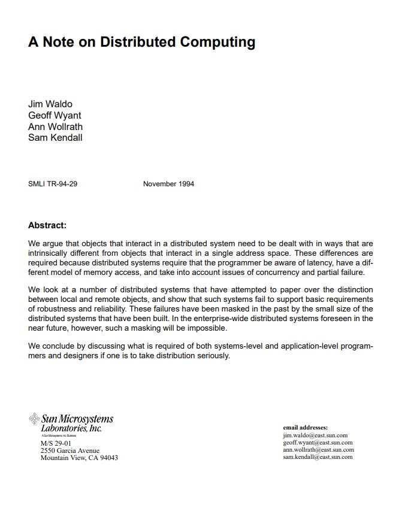](https://substackcdn.com/image/fetch/$s_!J3SB!,f_auto,q_auto:good,fl_progressive:steep/https%3A%2F%2Fsubstack-post-media.s3.amazonaws.com%2Fpublic%2Fimages%2Fd876d5fe-ed3d-4444-b9af-7a023c1f38b1_671x848.png)A Note on Distributed Computing (1994), J. Waldo, G. Wyant, A. Wollrath, S. Kendall

#### 7. 📄 [The Google File System (2003), Ghemawat S. et al.](https://static.googleusercontent.com/media/research.google.com/en//archive/gfs-sosp2003.pdf)

This paper describes a scalable, fault-tolerant, and high-performance distributed file system for large, distributed, data-intensive Google applications.

🔗 **[Link](https://static.googleusercontent.com/media/research.google.com/en//archive/gfs-sosp2003.pdf)**.

[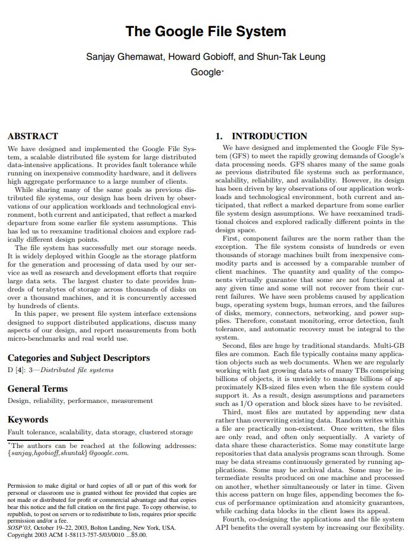](https://substackcdn.com/image/fetch/$s_!DfJM!,f_auto,q_auto:good,fl_progressive:steep/https%3A%2F%2Fsubstack-post-media.s3.amazonaws.com%2Fpublic%2Fimages%2Fbd60df9e-b085-4521-82a1-ea5d3af21efd_705x945.png)The Google File System (2003), Ghemawat S. et al.

### 🗄️ Data Storage and Processing

#### 8. 📄 [Dynamo: Amazon’s Highly Available Key-value Store (2007), G. DeCandia et al.](https://www.allthingsdistributed.com/files/amazon-dynamo-sosp2007.pdf)

This paper explains the design and architecture of [Amazon DynamoDB](https://aws.amazon.com/dynamodb/), a fast NoSQL key-value database. Here, you can learn that Dynamo is designed as a write-intensive data store, as well as its limitations and scaling possibilities.

🔗 **[Link](https://www.allthingsdistributed.com/files/amazon-dynamo-sosp2007.pdf)**.

[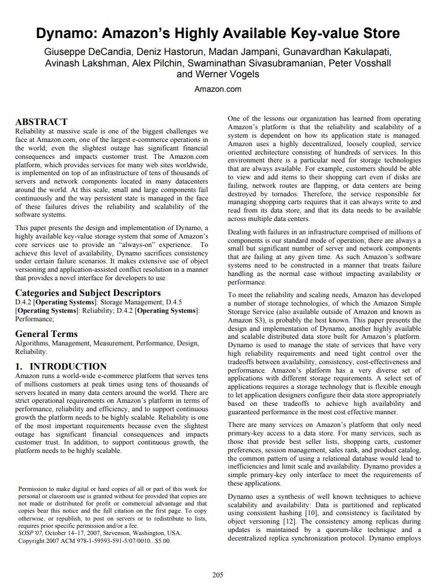](https://substackcdn.com/image/fetch/$s_!fy4O!,f_auto,q_auto:good,fl_progressive:steep/https%3A%2F%2Fsubstack-post-media.s3.amazonaws.com%2Fpublic%2Fimages%2F37fb43e9-2d60-4181-96a9-85e0e7644146_735x972.png)Amazon’s Highly Available Key-value Store (2007), G. DeCandia et al.

#### 9. 📄 [Bigtable: A Distributed Storage System for Structured Data (2006), Chan F. et al.](https://static.googleusercontent.com/media/research.google.com/en//archive/bigtable-osdi06.pdf)

The paper presents [Bigtable](https://cloud.google.com/bigtable), a distributed storage system for managing massive structured data at Google (read NoSQL DB). The key goal was to create a scalable, highly available, and highly performant data store. Google uses Bigtable to store data from many services, including web indexing, crawling, Google Earth, etc.

🔗 **[Link](https://static.googleusercontent.com/media/research.google.com/en//archive/bigtable-osdi06.pdf)**.

[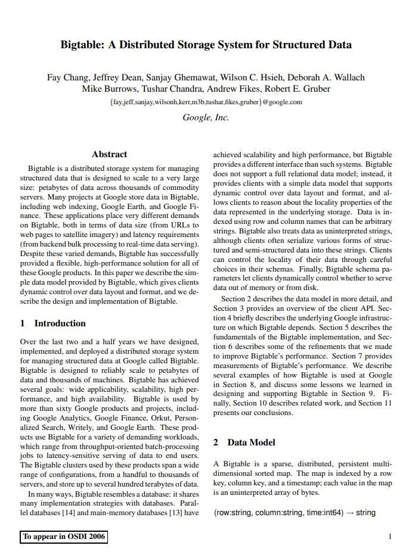](https://substackcdn.com/image/fetch/$s_!k1kU!,f_auto,q_auto:good,fl_progressive:steep/https%3A%2F%2Fsubstack-post-media.s3.amazonaws.com%2Fpublic%2Fimages%2F9497d43d-cb1c-495e-aa6b-b597a526c93c_691x937.png)Bigtable: A Distributed Storage System for Structured Data (2006), Chan F. et al.

#### 10. 📄 [A relational model of data for large shared data banks (1969), E. F. Codd](https://www.seas.upenn.edu/~zives/03f/cis550/codd.pdfhttps://www.cs.utexas.edu/~shmat/courses/cs345/whyfp.pdf)

The paper addresses some of the problems with database systems at the time of its publication that the relational model solved—the theoretical foundation for all SQL databases.

🔗 **[Link](https://www.seas.upenn.edu/~zives/03f/cis550/codd.pdf)**.

[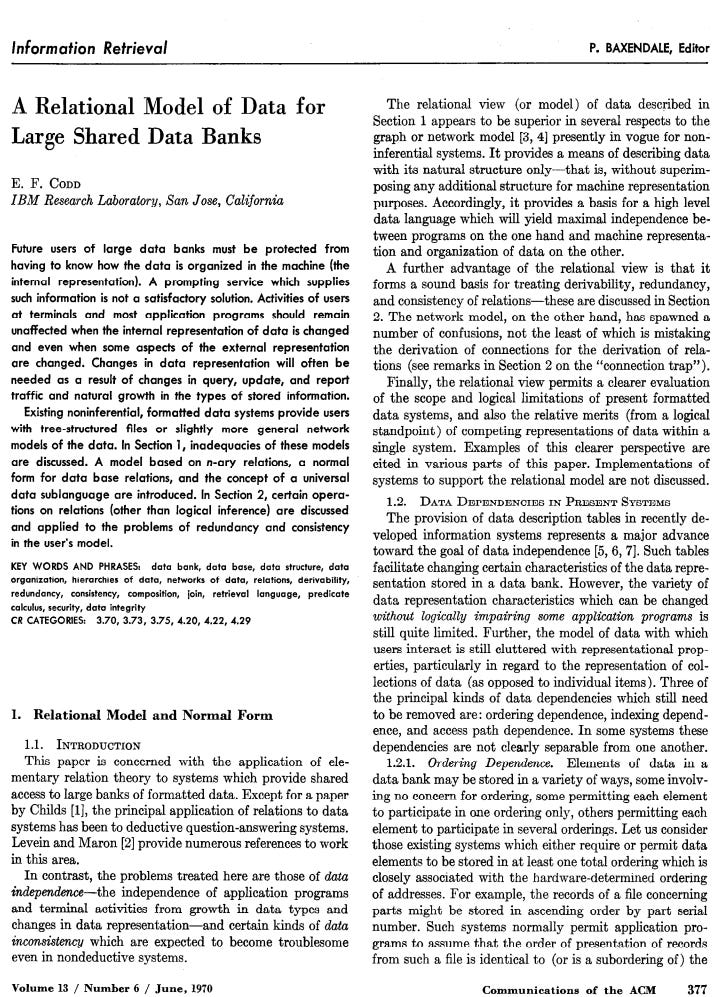](https://substackcdn.com/image/fetch/$s_!fmzS!,f_auto,q_auto:good,fl_progressive:steep/https%3A%2F%2Fsubstack-post-media.s3.amazonaws.com%2Fpublic%2Fimages%2Fe53c51fa-9a1d-406d-a1db-1883ebe9b19b_720x997.png)A relational model of data for large shared data banks (1969), E. F. Codd

#### 11. 📄 [MapReduce Simplified Data Processing on Large Clusters (2004), J. Dean, S. Ghemawat](https://static.googleusercontent.com/media/research.google.com/en//archive/mapreduce-osdi04.pdf)

The paper explains the MapReduce programming model and its implementation for processing and generating large data sets at Google. It is fundamental to modern big data processing frameworks.

🔗 **[Link](https://static.googleusercontent.com/media/research.google.com/en//archive/mapreduce-osdi04.pdf)**.

[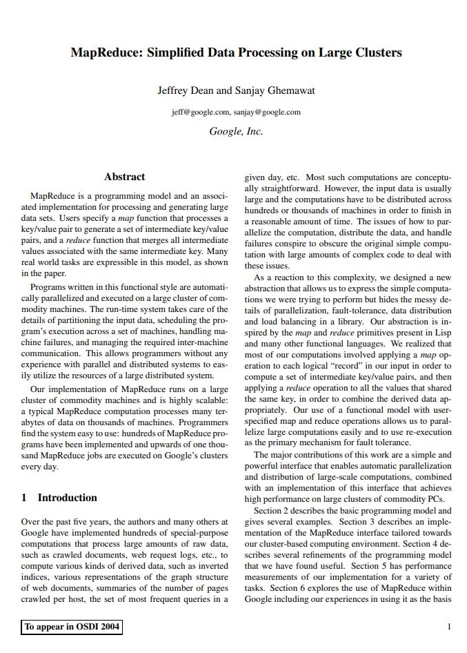](https://substackcdn.com/image/fetch/$s_!ZcOk!,f_auto,q_auto:good,fl_progressive:steep/https%3A%2F%2Fsubstack-post-media.s3.amazonaws.com%2Fpublic%2Fimages%2F6b623487-388c-46f3-ba0c-e0ea6c57026a_677x946.png)MapReduce Simplified Data Processing on Large Clusters (2004), J. Dean, S. Ghemawat

### 📏 System Design and Metrics

#### 12. 📄 [A Metrics Suite for Object-Oriented Design (1994), S. R. Chidamber](https://sites.pitt.edu/~ckemerer/CK%20research%20papers/MetricForOOD_ChidamberKemerer94.pdf)

This paper presents a new set of software metrics for OO design. It is essential for understanding and measuring software quality.

🔗 **[Link](https://sites.pitt.edu/~ckemerer/CK%20research%20papers/MetricForOOD_ChidamberKemerer94.pdf)**.

[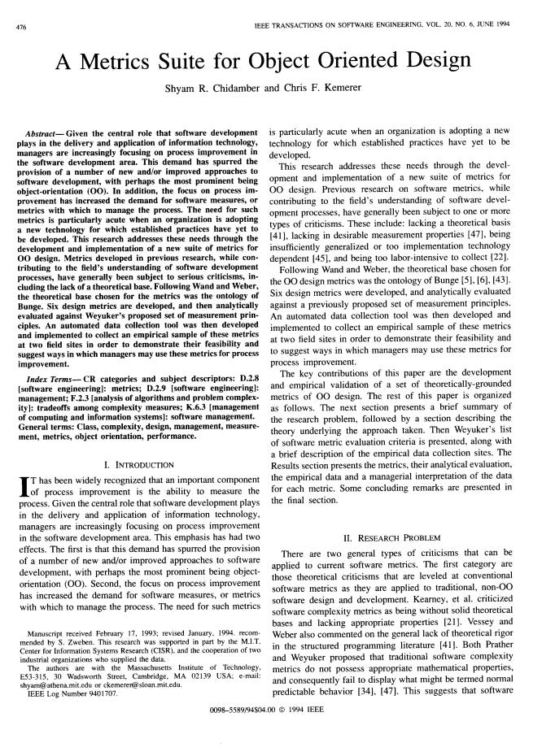](https://substackcdn.com/image/fetch/$s_!YkIY!,f_auto,q_auto:good,fl_progressive:steep/https%3A%2F%2Fsubstack-post-media.s3.amazonaws.com%2Fpublic%2Fimages%2F4f7a9837-946e-46e7-b425-56a9ee0b616c_666x930.png)A Metrics Suite for Object-Oriented Design (1994), S. R. Chidamber

### ☁️ Modern Infrastructure

#### 13. 📄 [Kafka: A Distributed Messaging System for Log Processing (2011), Kreps J, et al.](https://notes.stephenholiday.com/Kafka.pdf)

This paper introduces Kafka, a distributed messaging system designed to handle high volumes of log data with low latency. It incorporates ideas from existing log aggregators and messaging systems at LinkedIn. The authors detail the architecture, design choices, and performance comparisons of Kafka against other messaging systems, showcasing its efficiency and scalability in real-time data processing. It is essential to read to understand modern event-driven architectures.

🔗 **[Link](https://notes.stephenholiday.com/Kafka.pdf)**.

[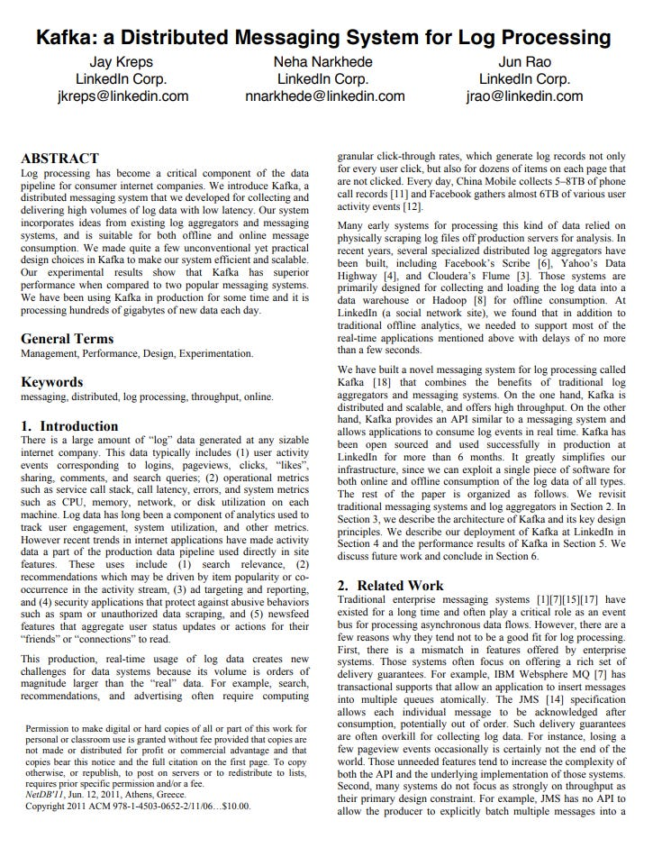](https://substackcdn.com/image/fetch/$s_!Bmuq!,f_auto,q_auto:good,fl_progressive:steep/https%3A%2F%2Fsubstack-post-media.s3.amazonaws.com%2Fpublic%2Fimages%2Fb6a25127-db70-4c24-aff4-e1ee697157cd_735x961.png)Kafka: A Distributed Messaging System for Log Processing (2011), Kreps J, et al.

#### 14. 📄 **[Scaling Memcache at Facebook (2013), Nishtala R, et al.](https://research.facebook.com/publications/scaling-memcache-at-facebook/)**

The paper describes how Facebook leverages memcached as a building block to construct and scale a distributed key-value store that supports the world’s largest social network. It is crucial for understanding modern web-scale architecture.

🔗 **[Link](https://research.facebook.com/publications/scaling-memcache-at-facebook/)**.

[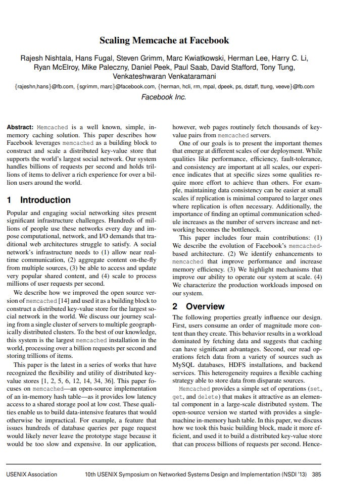](https://substackcdn.com/image/fetch/$s_!Yh8p!,f_auto,q_auto:good,fl_progressive:steep/https%3A%2F%2Fsubstack-post-media.s3.amazonaws.com%2Fpublic%2Fimages%2F70e6b32a-7af7-4024-821a-646da96fff4a_673x959.png)Scaling Memcache at Facebook (2013), Nishtala R, et al.

#### 15. 📄 [Bitcoin: A Peer-to-Peer Electronic Cash System](https://bitcoin.org/bitcoin.pdf) (2008), Satoshi Nakamoto

This paper introduces the world to Bitcoin, a simple solution to centralized banking and the use of intermediaries that eliminates the need for middlemen. It is foundational to understanding blockchain technology and decentralized systems.

🔗 **[Link](https://bitcoin.org/bitcoin.pdf)**.

[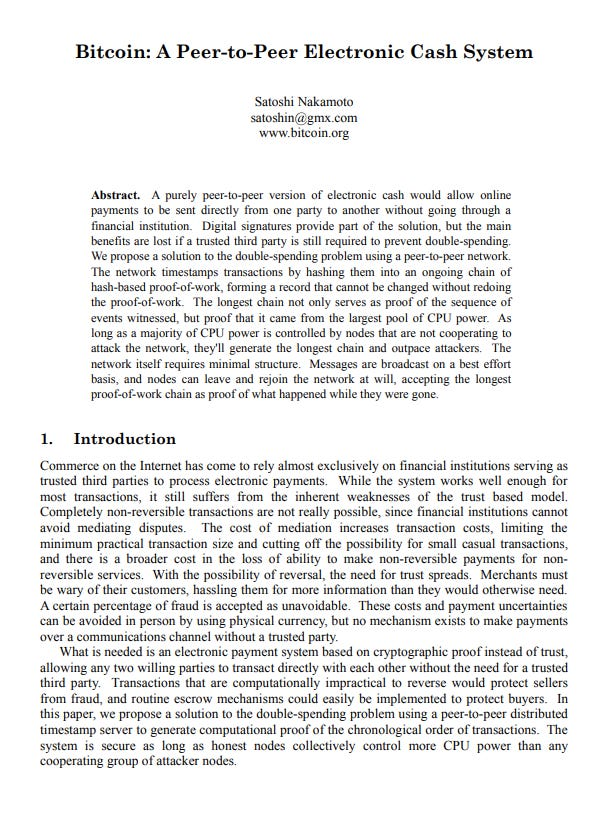](https://substackcdn.com/image/fetch/$s_!tDHj!,f_auto,q_auto:good,fl_progressive:steep/https%3A%2F%2Fsubstack-post-media.s3.amazonaws.com%2Fpublic%2Fimages%2Fcb315cd9-7ac6-4cf9-ba44-20f11869d9a5_610x821.png)Bitcoin: A Peer-to-Peer Electronic Cash System (2008), Satoshi Nakamoto

### 🖥️ Computer Architecture and Systems Performance

#### 16. 📄 [What Every Programmer Should Know About Memory](https://people.freebsd.org/~lstewart/articles/cpumemory.pdf) (2007), Urlich Repper.

This comprehensive paper bridges the gap between hardware architecture and software development. It explains the memory hierarchy, caching mechanisms, and their impact on program performance. The paper is particularly valuable because it explains concepts that affect every program we write, even though many developers might not know them. For instance, understanding memory access patterns and cache behavior can help developers:

1. Write more efficient data structures
2. Optimize data layout for better cache utilization
3. Understand and prevent performance bottlenecks
4. Make better decisions about memory allocation and management

🔗 **[Link](https://people.freebsd.org/~lstewart/articles/cpumemory.pdf)**.

[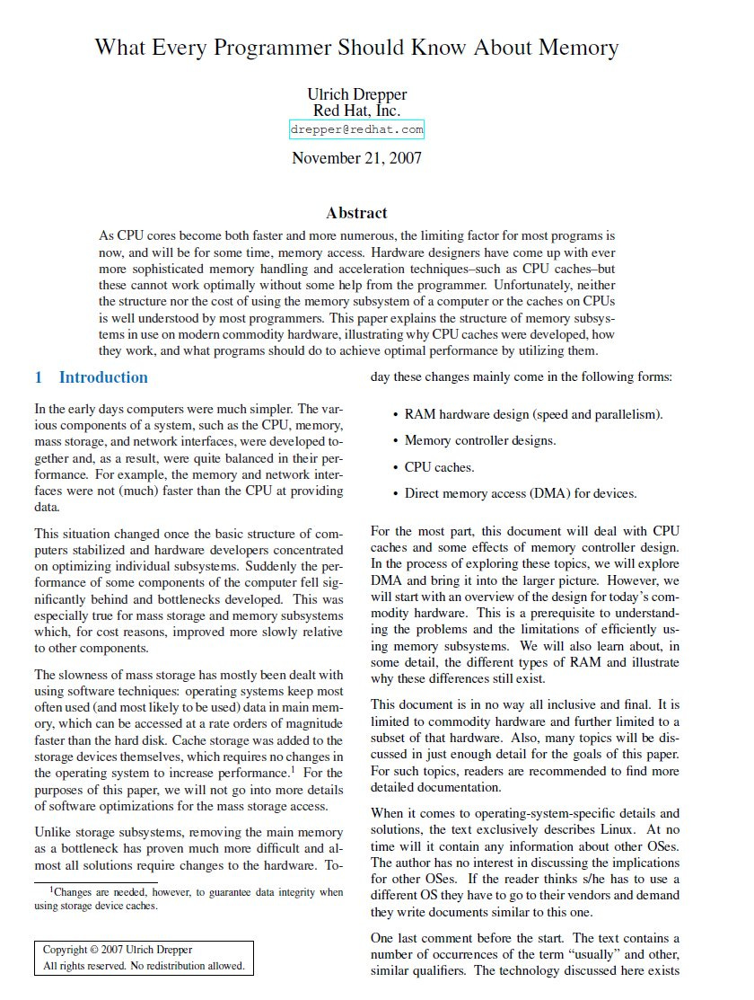](https://substackcdn.com/image/fetch/$s_!qYpZ!,f_auto,q_auto:good,fl_progressive:steep/https%3A%2F%2Fsubstack-post-media.s3.amazonaws.com%2Fpublic%2Fimages%2Fcdfe05c4-5280-44c9-a1eb-8b421607d703_840x1113.jpeg)What Every Programmer Should Know About Memory, U. Drepper

### 🔍 Search and Information Retrieval

#### 17. 📄 [The Anatomy of a Large-Scale Hypertextual Web Search Engine](http://infolab.stanford.edu/pub/papers/google.pdf) (1998), S. Brin, L. Page

This paper introduces PageRank and the original architecture of Google's search engine. It describes building a practical large-scale system that can efficiently crawl and index billions of web pages. The concepts introduced in this paper revolutionized web search and information retrieval, forming the foundation for modern search engine technology.

🔗 **[Link](http://infolab.stanford.edu/pub/papers/google.pdf)**.

[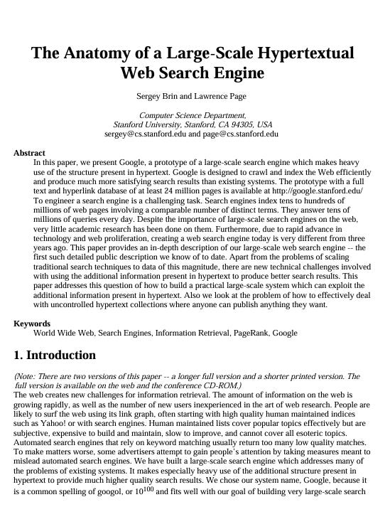](http://infolab.stanford.edu/pub/papers/google.pdf)The Anatomy of a Large-Scale Hypertextual Web Search Engine, S. Brin, L. Page

## 📚 More resources

If you want to find more great research papers, you can check:

- **[List of important publications in computer science](http://taggedwiki.zubiaga.org/new_content/43dff2eb010d9dacdbaa8593ad40a2e6).**Check the full list of computer science papers, organized by field.
- **[Papers We Love](https://paperswelove.org/)** - A repository of academic computer science papers + community.
- **[Ai2 OpenScholar](https://openscholar.allen.ai/)** - 8M+ open access research papers.
- **[ACM Digital Library](https://dl.acm.org/)** - More than 117,500 open articles published between 1951 and the end of 2000.
- **[arXiv Computer Science section](https://arxiv.org/archive/cs)** - Computer science papers from January 1993 to current.
- **[Great Papers in Computer Science](https://amzn.to/4028E5c)**(1996)****-  by Philip LaPlante
- **[Ideas That Created the Future](https://mitpress.mit.edu/9780262045308/ideas-that-created-the-future/)**, Classic Papers of Computer Science (2021), Harry R. Lewis (Editor).

## 🌟 Bonus: [How to Read a Paper](https://web.stanford.edu/class/ee384m/Handouts/HowtoReadPaper.pdf) by S. Keshav

This paper outlines a practical and efficient three-pass method for reading research papers. So, the process would be:

- **First Pass** (5-10 minutes).

- Read the title, abstract, and introduction
- Read section and subsection headings
- Read the conclusions
- Glance at the references
- **Second Pass** (1 hour):

- Read more carefully, but skip complex proofs
- Make notes about key points
- Mark important references for follow-up
- **Third Pass** (1-5 hours):

- Attempt to reimplement the ideas virtually
- Identify and challenge every assumption
- Compare with related work

🔗 **[Link](https://web.stanford.edu/class/ee384m/Handouts/HowtoReadPaper.pdf) (or [YouTube video](https://www.youtube.com/watch?v=Cq_jg4iQ4lk))**.

> *Also, check **[how to read an academic article](https://organizationsandmarkets.com/2010/08/31/how-to-read-an-academic-article/)**.*

[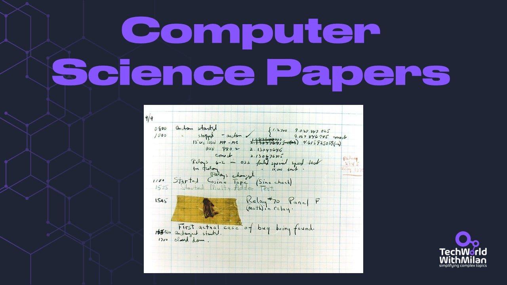](https://substackcdn.com/image/fetch/$s_!zM3j!,f_auto,q_auto:good,fl_progressive:steep/https%3A%2F%2Fsubstack-post-media.s3.amazonaws.com%2Fpublic%2Fimages%2Fc54422c4-ef7b-4df2-acdf-b91e35e4c770_1280x720.png)

📚 In addition to the computer science papers, check my list of **the best software development books of all time**:
[
Tech World With Milan NewsletterThe Greatest Software Development Books of All TimeThere is a question that is often asked: should I read books to become a better developer? Usually, the question is yes and the reason for that is that the person who wrote the book wrote it when (s)he was the most invited to write it with the large knowledge base then. The only better option would be to work with that person, which is often not possibl…Read more3 years ago · 11 likes · Dr Milan Milanović](https://newsletter.techworld-with-milan.com/p/the-greatest-software-development?utm_source=substack&utm_campaign=post_embed&utm_medium=web)
---

## 🎁 Promote your business to 350K+ tech professionals

Get your product in front of **more than 350,000+ tech professionals** who make or influence significant tech decisions. Our readership includes senior engineers and leaders who care about practical tools and services.

Ad space often books up weeks ahead. If you want to secure a spot, **[contact me](https://milan.milanovic.org/#contact)**.

Let’s grow together!

[Sponsor Tech World With Milan](https://newsletter.techworld-with-milan.com/p/sponsorship-of-tech-world-with-milan)

---

## More ways I can help you

1. **📢 [LinkedIn Content Creator Masterclass](https://www.patreon.com/techworld_with_milan/shop/short-linkedin-content-creator-311232?utm_medium=clipboard_copy&utm_source=copyLink&utm_campaign=productshare_creator&utm_content=join_link).**In this masterclass, I share my strategies for growing your influence on LinkedIn in the Tech space. You'll learn how to define your target audience, master the LinkedIn algorithm, create impactful content using my writing system, and create a content strategy that drives impressive results.
2. **📄 [Resume Reality Check](https://www.patreon.com/techworld_with_milan/shop/resume-reality-check-311008?source=storefront)**. I can now offer you a service where I’ll review your CV and LinkedIn profile, providing instant, honest feedback from a CTO’s perspective. You’ll discover what stands out, what needs improvement, and how recruiters and engineering managers view your resume at first glance.
3. **💡 [Join my Patreon community](https://www.patreon.com/techworld_with_milan)**: This is your way of supporting me, saying “**thanks**," and getting more benefits. You will get exclusive benefits, including 📚 all of my books and templates on Design Patterns, Setting priorities, and more, worth $100, early access to my content, insider news, helpful resources and tools, priority support, and the possibility to influence my work.
4. 🚀 **1:1 Coaching:** [Book a working session with me](https://newsletter.techworld-with-milan.com/p/coaching-services). I offer 1:1 coaching for personal, organizational, and team growth topics. I help you become a high-performing leader and engineer.

---

Thanks for reading Tech World With Milan Newsletter! Subscribe for free to receive new posts and support my work.