# Context-switching is the main productivity killer for developers

*I am programmer, interrupted.*

Have you ever wondered what the biggest productivity killer for developers is? There are many, but one stands out, and it’s often underestimated.

Every time you send someone a “quick” Slack message, **it costs that person 23 minutes of productive work,** and that's just the beginning of the problem.

I’ve worked with development teams for over a decade, and we consistently underestimate the disruptive nature of interruptions. This article explores why context-switching is so costly and how to manage it effectively.

So, let’s dive in.

---

## What is context switching?

Have you ever noticed confusion when switching from reading email to writing code? That’s **context-switching**. Our brains aren’t like computers that can load a new program instantly. Instead, we must clear one set of thoughts and then load another. This mental overhead adds up faster than you’d think.

Imagine you’re deep in a project. Your phone buzzes, you check a message, then realize you must answer an email. Before you know it, you’re back to the project. **Each shift forces your brain to refocus, sorting through your memory to figure out where you were**. This extra processing time can kill momentum and create errors.

The term context-switching is borrowed from operating systems (OS). OS can handle multiple processes in one processing unit (usually CPU) by putting one process on hold and processing another. Those systems can do context-switching, while our brains cannot.

## Why do we context switch?

We switch tasks more often than we realize because our tools, such as apps and notifications, are designed to grab our attention. Our brains love novelty and rush toward any new message or update.

We also feel pressure from work to respond immediately, which splits our focus even more (and our work cultures usually reward this). And there’s so much information—emails, chats, open tabs—that it’s easy to get distracted.

[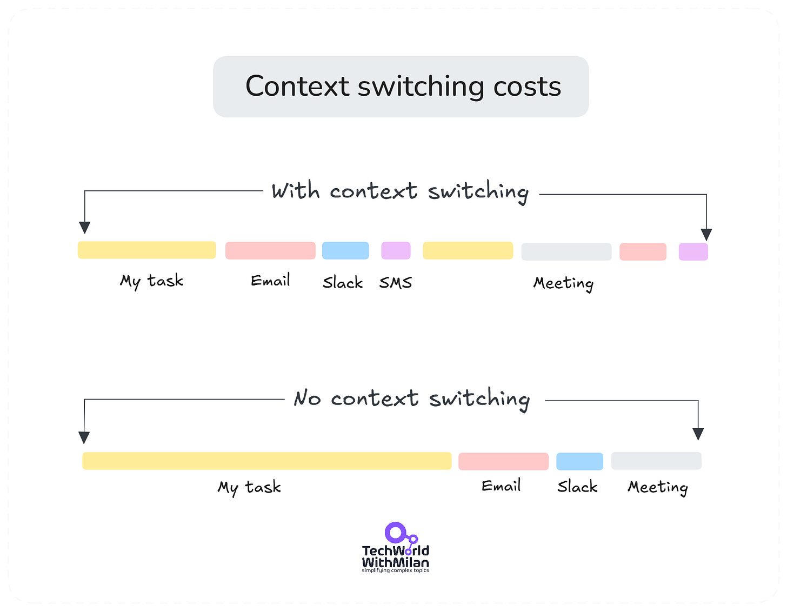](https://substackcdn.com/image/fetch/$s_!32j8!,f_auto,q_auto:good,fl_progressive:steep/https%3A%2F%2Fsubstack-post-media.s3.amazonaws.com%2Fpublic%2Fimages%2F0fd7fd86-2327-4da6-b16f-bb1722bd7e9d_1918x1488.png)Context switching costs

## Why do interruptions hit engineers so hard?

Think about the last complex programming task you worked on. You probably had to keep track of multiple things: the system architecture, the specific problem you're solving, the potential edge cases, and how your solution fits into the bigger picture. Each element **lives in your working memory**, forming a delicate mental model (and we can [hold only up to 7 items in short-term memory](https://en.wikipedia.org/wiki/The_Magical_Number_Seven,_Plus_or_Minus_Two)).

When an interruption occurs, this mental model is shattered. Research from UC Irvine [1] shows that **developers need an average of 23 minutes to rebuild their focus after an interruption fully**.

[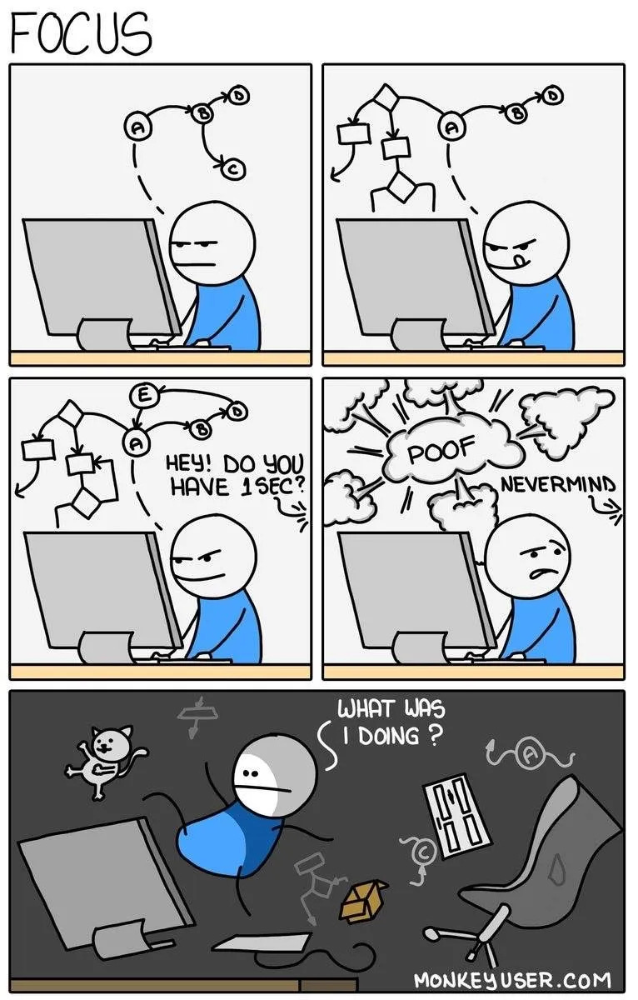](https://substackcdn.com/image/fetch/$s_!smkG!,f_auto,q_auto:good,fl_progressive:steep/https%3A%2F%2Fsubstack-post-media.s3.amazonaws.com%2Fpublic%2Fimages%2F5f961a8e-955b-4512-a97f-111f0684c6f7_766x1200.webp)

## But the lost time is not the biggest problem

When we are interrupted, we're not just losing minutes – we're degrading the quality of their work in several ways:

### Mental energy reduction

Our brains aren't built for constant context-switching. Each interruption reduces our cognitive resources, much like how your phone's battery drains faster when rapidly switching between apps. Research by Parnin and DeLine [2] found that **developers who face frequent interruptions show signs of mental fatigue much earlier in the day, leading to more errors in their afternoon work**. Such mental fatigue over time can lead to increased stress levels and even burnout among developers.

Mental energy exaustion

### Code quality suffers

A research study by Amoroso d'Aragona et al. (2023) [3] examined the impact of interruptions and breaks on software development and found striking correlations between context switching and code quality degradation. Their analysis revealed that:

- **Frequent breaks and interruptions** **led to more bugs** because developers struggled to regain their cognitive context.
- **Prolonged gaps in activity** **increase technical debt**, as developers had to spend more time reacquainting themselves with previous code.
- **Interrupted coding sessions** correlate with **lower code maintainability**, leading to longer review cycles and rework.

These numbers aren't just statistics – they represent real problems that teams must fix later, creating a cycle of technical debt and cleanup work.

[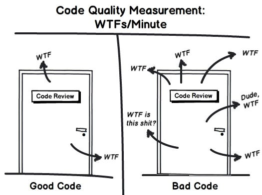](https://substackcdn.com/image/fetch/$s_!IRcx!,f_auto,q_auto:good,fl_progressive:steep/https%3A%2F%2Fsubstack-post-media.s3.amazonaws.com%2Fpublic%2Fimages%2F1349ca84-2dfe-46d3-a039-5d7d9387182a_525x392.png)Good code vs bad code

### The Snowball effect

Also, we know from our experience that interruptions don't just affect the immediate task.**A five-minute interruption during a critical problem-solving moment can create a long delay in task completion.** Developers often have to rebuild their entire understanding of the problem before continuing.

The 5 min meeting with a developer

> “*Interrupted work will always be less effective and take longer than if completed continuously.*” - Carlson’s law

## Understanding Flow State

We must discuss the flow state to understand why interruptions are so bad. This isn't just programmer jargon – it's a well-researched psychological state first described by Mihaly Csikszentmihalyi in 1990 [4].

**Flow state is a mental state in which work feels effortless and time seems to disappear**(your abilities match the challenge you face). For developers, it's when complex problems suddenly become clear and elegant solutions emerge naturally.

You feel anxious or frustrated if the challenge is too high compared to your skills. If it’s too low, you get bored. Mihaly Csikszentmihalyi’s model positions flow right in the middle, where skill and challenge are balanced. **In that zone, you’re challenged enough to stay engaged, but not so much that you shut down**.

[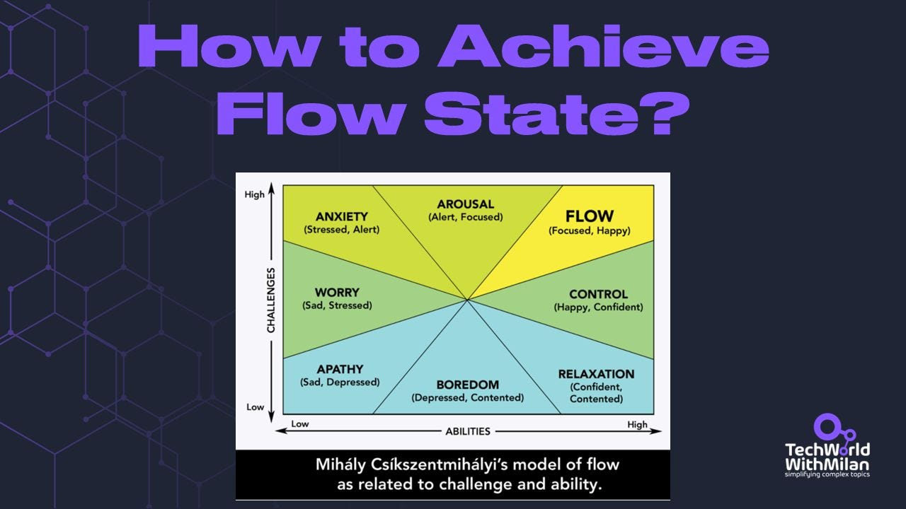](https://substackcdn.com/image/fetch/$s_!9aq_!,f_auto,q_auto:good,fl_progressive:steep/https%3A%2F%2Fsubstack-post-media.s3.amazonaws.com%2Fpublic%2Fimages%2F9eb11458-67c6-498a-93d8-0119c1ec482a_1280x720.jpeg)

To maintain flow, **you must keep adjusting the difficulty of tasks as your abilities grow**. That means seeking new challenges just above your current skill level. This made you progress without overwhelming you.

But here's the critical part: **the flow state is very fragile**. It takes about 15 minutes of uninterrupted work to achieve, but a single notification can instantly break it. And yes, even if developers don't respond to that notification, just seeing it can be enough to break their concentration.

Research shows that **on-screen interruptions significantly impact** (Yimeng M. et al. [5]). Notifications with high dominance (like urgent requests from managers) significantly increased time spent on code comprehension tasks, incredibly simpler ones. While in-person interruptions aren’t all bad, these interruptions reduce stress levels.

> 👉 The image below shows **developer interruptions**, unplanned or planned, and when we have multiple disruptions daily.

[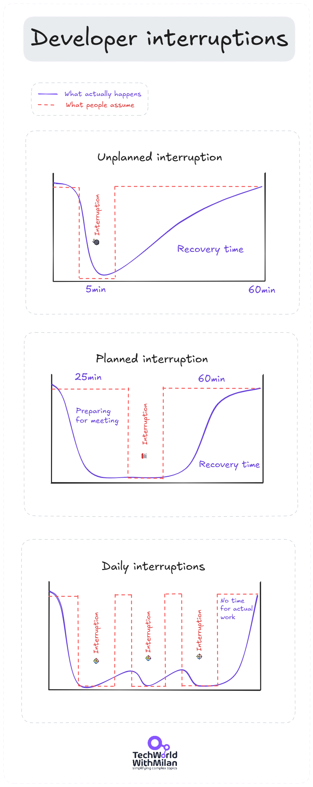](https://substackcdn.com/image/fetch/$s_!Cq51!,f_auto,q_auto:good,fl_progressive:steep/https%3A%2F%2Fsubstack-post-media.s3.amazonaws.com%2Fpublic%2Fimages%2F2bab4fc5-4627-4e04-93dc-7322643e915d_890x2231.png)Developer interruptions (inspired by the original author on [Reddit](https://www.reddit.com/r/ProgrammerHumor/comments/pafo1v/understanding_developer_interruptions/))

## A lesson from our team

Let me share a story from a team I recently worked with. We tracked our interruptions for a month and found patterns that might sound familiar.

**Morning interruptions were particularly costly**. One developer described spending two hours architecting a new feature in his head, only to have his mental model wholly disrupted by a "quick sync" meeting. He estimated it took him three hours to get back to the same level of understanding before the interruption. Why? People usually have the most energy and concentration to do complex stuff in the morning.

But when **the team implemented protected [focus time](https://www.paulgraham.com/makersschedule.html)**[6], the results were the following:

- **The story completion rate increased by 35%**
- **Bug reports decreased by 28%**
- **Team satisfaction scores improved by 45%**

The image below shows the calendar with the protected focus time for deep work.

[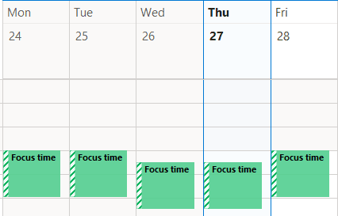](https://substackcdn.com/image/fetch/$s_!a6KZ!,f_auto,q_auto:good,fl_progressive:steep/https%3A%2F%2Fsubstack-post-media.s3.amazonaws.com%2Fpublic%2Fimages%2Fc2a76818-6b57-46b9-85fe-b146f3668638_426x273.png)Protected focus on the calendar

## Strategies to prevent context switching

Optimizing your workspace for flow state is essential for anyone working on tasks requiring concentration, creativity, and technical prowess, such as software development. Achieving a flow state, also known as "**being in the zone**," refers to an optimal state of consciousness in which an individual is fully absorbed in an activity and performs at their best.

After studying this problem across multiple teams, I've found several approaches that consistently work:

### For Developers

1. **🎯 Set clear goals**: Define specific objectives for each work session to maintain focus and track progress effectively. Also, [daily goals](https://www.patreon.com/techworld_with_milan/shop/how-to-set-and-achieve-any-goal-e-book-312287?utm_medium=clipboard_copy&utm_source=copyLink&utm_campaign=productshare_creator&utm_content=join_link) are reasonable because they help us know what we want to finish today.
2. **📝 Capture tasks on the TODO list**. Use any tool, such as [Todoist](https://www.todoist.com/) or [Microsoft To Do](https://to-do.office.com/tasks/), to offload tasks from your head. This will relieve pressure, and you can always return later to check what you need to work on next. Identify your Most Important Task (MIT) from that list daily and do it first.
3. **🔢 Prioritize tasks**: Use a [task prioritization method](https://www.patreon.com/techworld_with_milan/shop/how-to-set-priorities-e-book-312292?utm_medium=clipboard_copy&utm_source=copyLink&utm_campaign=productshare_creator&utm_content=join_link) that keeps your work engaging enough to prevent distractions. Try different techniques to see what best fits your job.

[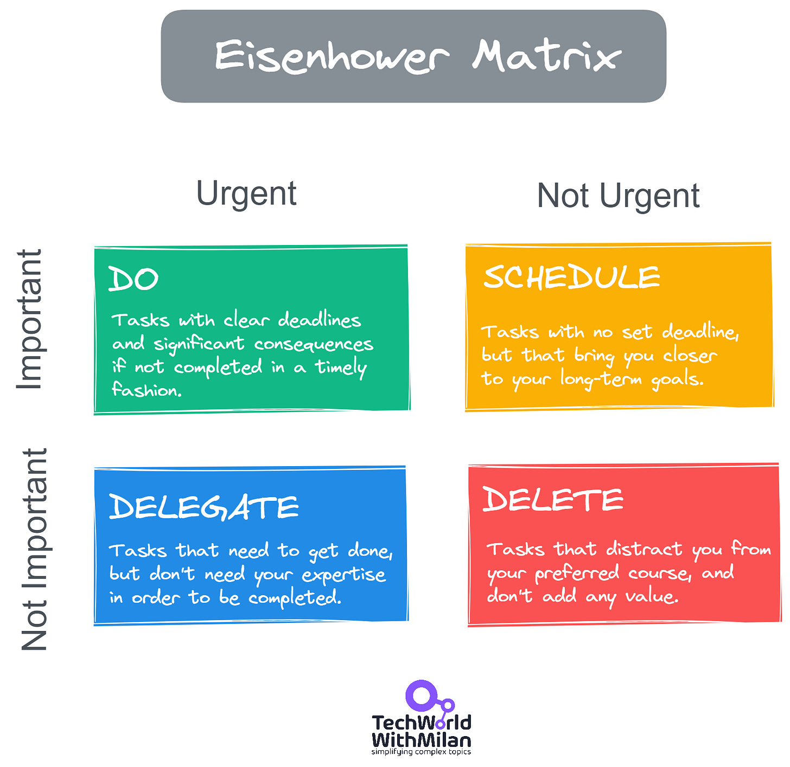](https://substackcdn.com/image/fetch/$s_!plsB!,f_auto,q_auto:good,fl_progressive:steep/https%3A%2F%2Fsubstack-post-media.s3.amazonaws.com%2Fpublic%2Fimages%2F7f6aca16-224f-46c0-91bd-e73c34cec2df_1681x1634.png)Eisenhower prioritization matrix
4. **🔒 Deep work blocks:** Block out 90-minute periods for focused work (check out Cal Newport's book Deep Work). Research shows that this is the optimal time for maintaining sustained concentration. We need to have at least 4-6 hours of focused work. Block these on your calendar and treat them as seriously during the day when you have the most energy (usually morning for most people).

Calendar with deep work blocks
5. **🅿️ The parking lot technique**: Keep a simple text file open while you work. When random thoughts or tasks arise, quickly jot them down instead of acting on them immediately. This will prevent your mind from becoming an interruption source.
6. **🚧 Interruptible workflow:** As you work through complex problems, leave yourself breadcrumbs. If interrupted, a quick comment about why you made a particular decision in your source code file in the IDE can save hours of mental reconstruction. You can also do this at the end of the day, and tomorrow, you will immediately know how to start the work. This also helps us fight the [Zeigarnik Effect](https://en.wikipedia.org/wiki/Zeigarnik_effect) (the tendency to occupy our working memory with unfinished tasks).

[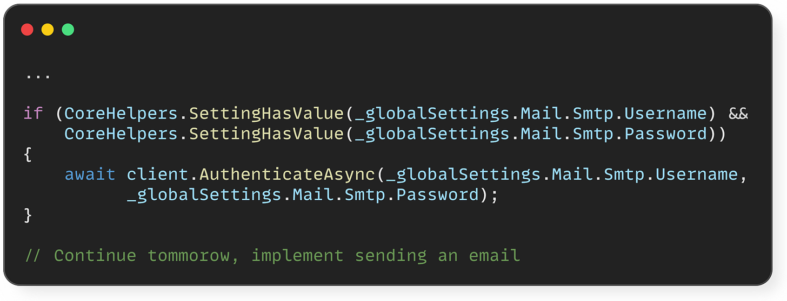](https://substackcdn.com/image/fetch/$s_!mdqL!,f_auto,q_auto:good,fl_progressive:steep/https%3A%2F%2Fsubstack-post-media.s3.amazonaws.com%2Fpublic%2Fimages%2F063d19ba-9ecd-4d42-9fac-7b579943c9e2_2317x889.png)
7. **🔕 Minimize distractions:** This might include using noise-canceling headphones, turning off non-essential notifications, or creating a dedicated workspace. One great way to reduce distraction is to turn off instant messaging (Slack, etc.) for periods and turn on Do Not Disturb mode on your phone.

[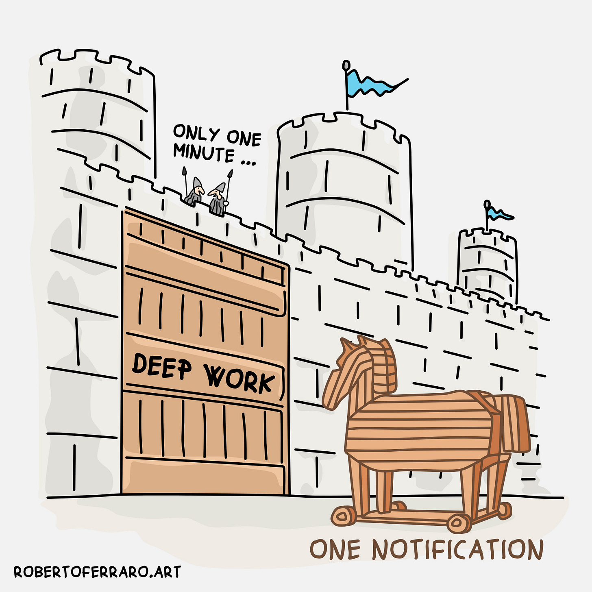](https://substackcdn.com/image/fetch/$s_!2CSe!,f_auto,q_auto:good,fl_progressive:steep/https%3A%2F%2Fsubstack-post-media.s3.amazonaws.com%2Fpublic%2Fimages%2F3e52e59d-44d1-4204-8845-6b5779e6f87e_3240x3240.jpeg)
8. **🤹 Don’t multitask**: Our brains can work focus only on one thing correctly. So, try to focus on one task at a time.
9. **💺 Ergonomics**: Ensure that your chair, desk, and monitor setup are ergonomic to reduce physical discomfort.
10. **📂 Organized environment**: A clutter-free workspace can reduce cognitive load, helping you focus on the task.

Clutter-free working table
11. **🛠 Use proper tools**: The right tools and software can make a huge difference. Use a fast, reliable computer with software that simplifies your tasks.
12. **⏰ Establish a routine**: Our brains like routines. Starting your day with a routine or a ritual can signal to your brain that it's time to get into the zone.
13. **🏖 Regular breaks**: Scheduled breaks, such as the [Pomodoro Technique](https://newsletter.techworld-with-milan.com/i/115140651/how-to-deal-with-parkinsons-law), can help maintain high focus and prevent burnout.

[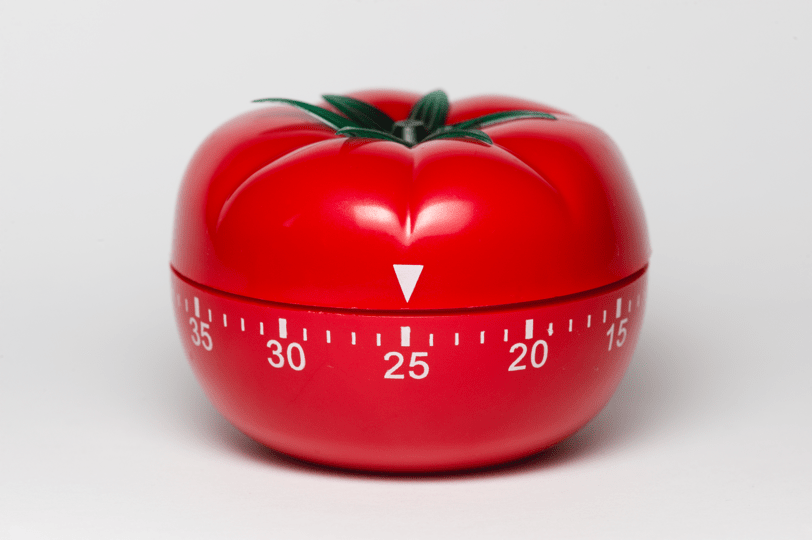](https://substackcdn.com/image/fetch/$s_!l6ef!,f_auto,q_auto:good,fl_progressive:steep/https%3A%2F%2Fsubstack-post-media.s3.amazonaws.com%2Fpublic%2Fimages%2F0cb9cb8b-a125-4526-baae-d1ed5fb83100_812x540.png)Pomodoro timer

1. **🤔 Be intentionally responsive**: If you work in an office that values availability highly, examine your level of responsiveness. As the authors of “[Algorithms to Live By](https://amzn.to/3WJ64js)” write, "*Be no more responsive than that*."
2. **🗓 Plan the day strategically**: At the end of the working day, sum it up and plan what you want to achieve the next day. Another option is to plan the day first thing in the morning. This will help you start your day productive.
3. **🚶‍♂️Take a proper rest**: It’s not possible to work for prolonged periods, as it can hurt us. Try to make short breaks, move physical locations, make some coffee, and use launch time for launch.

[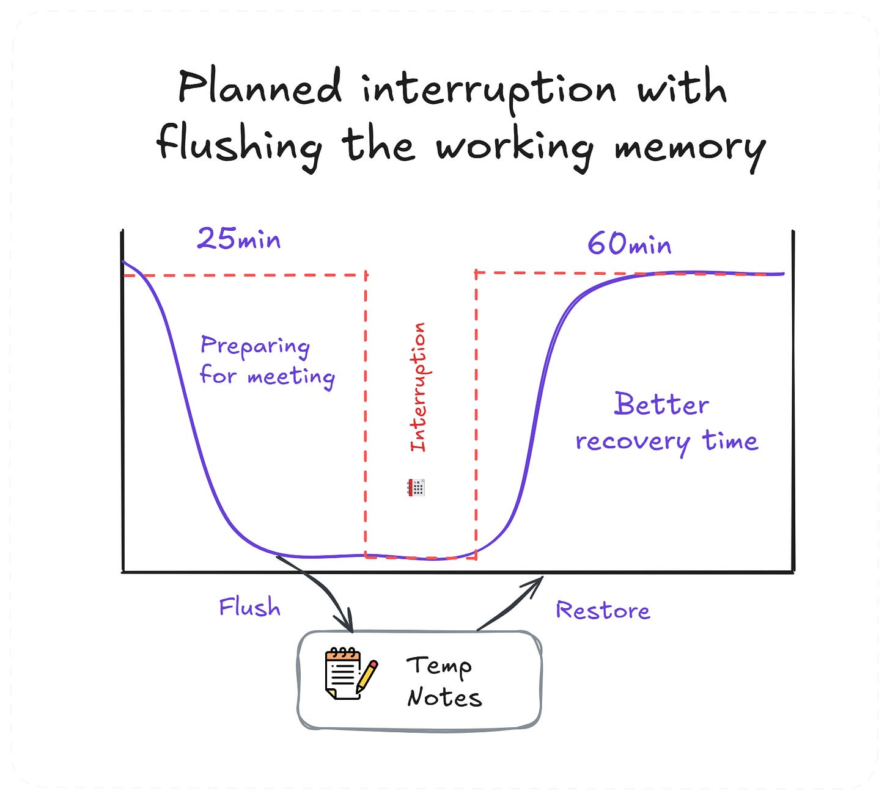](https://substackcdn.com/image/fetch/$s_!cXQB!,f_auto,q_auto:good,fl_progressive:steep/https%3A%2F%2Fsubstack-post-media.s3.amazonaws.com%2Fpublic%2Fimages%2F93edd179-2201-4b3a-a395-c1bf56800503_1598x1438.png)If we write down our temp memory, recovery time is much faster

### For Teams

1. **🚨 Interruption protocols:** Create clear guidelines for emergencies that require immediate interruption. Everything else should go through async channels.
2. **🗓 Focus time agreements:** Establish team-wide focus hours where interruptions are prohibited except for true emergencies. One possibility is to block a few days per week (in the afternoons) for focused work. You can also focus on individual work without meetings one or two days a week (**no meeting days**). For example, we do not meet on Wednesdays.

Team agreement
3. **📨 Asynchronous communication**should default to a remote (high-documentation, low-meeting) work culture. If you work remotely, you should use more time for writing and tools that can help you keep essential conversions there and make it easy to catch up with others. You can also use tools like Slack's scheduled send feature to prevent colleagues from interrupting during your focus time. Also, when sending something in the middle of the day, you can say, “*No need to respond to this message right away if you're in the middle of something*.”
4. **⏰ Flexible working hours**. Offering flexible work hours to accommodate individual focus times to people.
5. **🙅 [Normalize saying NO](https://hbr.org/2023/01/7-ways-managers-can-help-their-team-focus)**. Encourage employees to say when they’re over capacity. Thank them for sharing bad news to prevent deeper problems.

[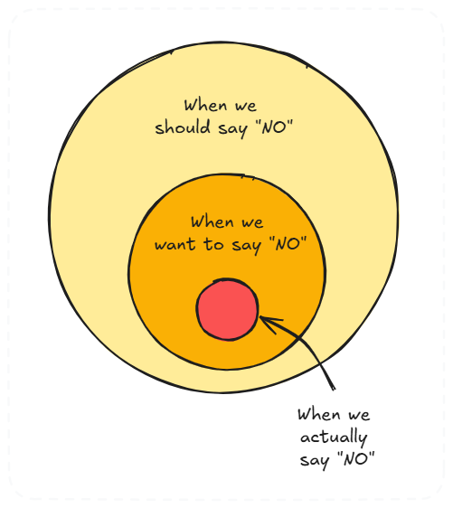](https://substackcdn.com/image/fetch/$s_!12F8!,f_auto,q_auto:good,fl_progressive:steep/https%3A%2F%2Fsubstack-post-media.s3.amazonaws.com%2Fpublic%2Fimages%2Fd2fcb9db-baed-4449-a1ee-7706c4d0a72a_501x562.png)
6. **🤝 Make meetings meaningful**(yes, it’s possible). Encourage employees to skip meetings without a clear agenda or a reason for their presence. This will burden organizers with respecting others’ time and allow employees to focus on high-priority work. Also, schedule them around natural breaks (before or after launch or at the beginning and end of the day).

> *Learn how to be more productive:*
[
Tech World With Milan NewsletterHow to Be 10x More Productive I was always amazed by top performers. I wondered what they do and how they are much better than others. Then, I started researching and talking directly to some of them. I finally managed to get some top performers as my mentors and, in the end, became one of them. I learned that they are not better than others, but they use some techniques that help t…Read more3 years ago · 65 likes · 6 comments · Dr Milan Milanović](https://newsletter.techworld-with-milan.com/p/how-to-be-10x-more-productive?utm_source=substack&utm_campaign=post_embed&utm_medium=web)
## Measuring progress

To know if your interruption management is working, track these metrics:

- **🔔 Unplanned interruptions**. Track how many occur each day.
- **⏳ Duration of uninterrupted coding sessions.** Watch for increases over time.
- **🐞 Code quality metrics.** Look at bug rates and code review feedback.
- **😊 Team satisfaction scores.** Survey the team regularly.
- **🏃‍♂️ Sprint velocity trends.** See if you’re moving faster after cutting disruptions.

Those metrics will give you some part of the overall picture of how these changes [increased developer productivity](https://newsletter.techworld-with-milan.com/p/how-to-measure-developer-productivity?utm_source=publication-search). For example, in the SPACE framework, it directly increases Satisfaction & Well-being, and in DORA, it impacts Lead Time for Changes, as frequent interruptions slow development and hurt morale.

Measuring progress

## Moving forward

Interruptions in software development aren't just an annoyance—**they're a significant productivity killer that affects code quality, team morale, and project timelines**. However, with the proper understanding and tools, we can manage them effectively.

Remember that:

- **Context-switching** wastes more than a few minutes. It breaks focus and degrades code quality.
- **Flow state** boosts productivity, but it’s fragile.
- **Limit interruptions** by setting up focus time, using async communication, and tracking metrics.

So, start by implementing one or two of these suggestions. Measure the results. Adjust based on what works for your team. The goal isn't to eliminate all interruptions—it's to ensure that the interruptions that occur are worth their actual cost.

**Protect your focus time;** your code (and team) will thank you.

[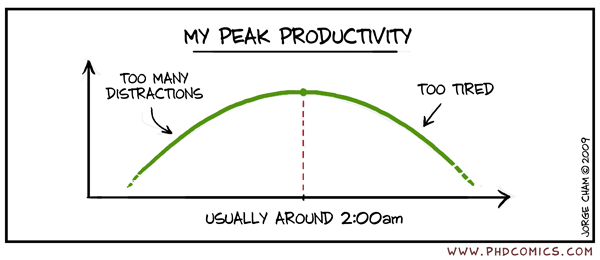](https://substackcdn.com/image/fetch/$s_!gQi-!,f_auto,q_auto:good,fl_progressive:steep/https%3A%2F%2Fsubstack-post-media.s3.amazonaws.com%2Fpublic%2Fimages%2F75be038b-48d2-4ae2-a10f-bf0415e9037b_600x260.gif)

## References

1. Mark, G., et al. (2016). "[The Cost of Interrupted Work: More Speed and Stress.](https://ics.uci.edu/~gmark/chi08-mark.pdf)" University of California, Irvine.
2. Parnin, C., & DeLine, R. (2010). "[Evaluating Cues for Resuming Interrupted Programming Tasks.](https://www.researchgate.net/publication/216667101_Evaluating_cues_for_resuming_interrupted_programming_tasks)"
3. Amoroso d'Aragona et al. (2023). "[Breaks and Code Quality: Investigating the Impact of Forgetting on Software Development.](https://arxiv.org/abs/2305.00760)"
4. Csikszentmihalyi, M. (1990). “[Flow: The Psychology of Optimal Experience](https://amzn.to/3Ein4H7).” Harper & Row.
5. Yimeng, M, et al. (2024). “[Breaking the Flow: A Study of Interruptions During Software Engineering Activities](https://kjl.name/papers/icse24.pdf)“
6. Graham P (2009). “[Maker’s Schedule, Manager’s Schedule](https://www.paulgraham.com/makersschedule.html)”

---

## Bonus: **Radio Tochka 2 podcast talk**

I was honored to be a guest on **Radio Tochka 2 - [Ep. 93: The challenges every leader in tech faces](https://www.youtube.com/watch?v=AgGKSCWc5bA)**. We discussed how to be a great leader your team needs.

Let me know if you like it.

---

## 🎁 Promote your business to 350K+ tech professionals

Get your product in front of **more than 350,000+ tech professionals** who make or influence significant tech decisions. Our readership includes senior engineers and leaders who care about practical tools and services.

Ad space often books up weeks ahead. If you want to secure a spot, **[contact me](https://milan.milanovic.org/#contact)**.

Let’s grow together!

[Sponsor Tech World With Milan](https://newsletter.techworld-with-milan.com/p/sponsorship-of-tech-world-with-milan)

---

## More ways I can help you

1. **📢 [LinkedIn Content Creator Masterclass](https://www.patreon.com/techworld_with_milan/shop/short-linkedin-content-creator-311232?utm_medium=clipboard_copy&utm_source=copyLink&utm_campaign=productshare_creator&utm_content=join_link).**In this masterclass, I share my strategies for growing your influence on LinkedIn in the Tech space. You'll learn how to define your target audience, master the LinkedIn algorithm, create impactful content using my writing system, and create a content strategy that drives impressive results.
2. **📄 [Resume Reality Check](https://www.patreon.com/techworld_with_milan/shop/resume-reality-check-311008?source=storefront)**. I can now offer you a service where I’ll review your CV and LinkedIn profile, providing instant, honest feedback from a CTO’s perspective. You’ll discover what stands out, what needs improvement, and how recruiters and engineering managers view your resume at first glance.
3. **💡 [Join my Patreon community](https://www.patreon.com/techworld_with_milan)**: This is your way of supporting me, saying “**thanks**," and getting more benefits. You will get exclusive benefits, including 📚 all of my books and templates on Design Patterns, Setting priorities, and more, worth $100, early access to my content, insider news, helpful resources and tools, priority support, and the possibility to influence my work.
4. 🚀 **1:1 Coaching:** [Book a working session with me](https://newsletter.techworld-with-milan.com/p/coaching-services). I offer 1:1 coaching for personal, organizational, and team growth topics. I help you become a high-performing leader and engineer.

---

Thanks for reading Tech World With Milan Newsletter! Subscribe for free to receive new posts and support my work.