# Cross-platform development with Uno Platform

*Uno Platform is one of the most popular cross-platform frameworks in .NET world. Why is this and how it works, let's find out in this article.*

.NET already offers several “official” paths to cross-platform UI, such as Xamarin’s legacy, .NET MAUI’s re-work, and Blazor’s web-centric hybrid. Each closes some gaps but leaves others open, such as uneven performance, limited target reach, or tooling that slows feedback loops. For teams that need one C# codebase to feel native on *every* screen, mobile, desktop, web, and even embedded, that trade-off is hard to accept.

Uno Platform exists to remove it. By re-implementing WinUI atop a high-performance Skia renderer and wrapping everything in an accurate, single-project model, [Uno Platform](https://platform.uno/?utm_source=DrMilan&utm_medium=email&utm_campaign=xplat-dotnet) preserves familiar XAML patterns while extending them to all .NET runtimes. Eight years of production use and a growing list of enterprise deployments suggest the promise is more than marketing.

This article breaks down the evidence in the following sections:

1. **Why is Uno Platform gaining popularity**? Skia rendering, Hot Design visual tooling, and sub-second startup times deliver measurable productivity and UX gains to .NET teams.
2. **Origins and motivation**. Born inside nventive in 2013 to reuse Windows expertise on iOS and Android; open-sourced at Build 2018 after years of internal proof.
3. **Fit within .NET**. Extends standard C# + XAML across every runtime, complements WinUI, and interoperates cleanly with MAUI, and existing NuGet libraries.
4. **Why do teams choose Uno**? Complete stack: UI, extensions, theming, CI templates, and escape hatches to native code when necessary.
5. **Uno vs. MAUI vs. Blazor**. Wider target matrix, live visual designer, and faster startup times; Blazor remains web-only unless wrapped.
6. **Under the hood**. WinUI surface re-created; XAML tree mapped to Skia or native widgets for predictable performance and pixel fidelity.
7. **Developer tooling**. IDE-agnostic Hot Reload, Hot Design, and Figma's “Design-to-Code” feature compresses feedback loops to seconds.
8. **Success stories**. Toyota, Kahua, Trade Zero, and Microsoft Toolkit Labs validate Uno at scale and in latency-sensitive workloads.
9. **Future path**. AI-assisted design, immediate .NET 10 support, and ongoing Skia optimizations under the expanding Uno Platform Studio.

> **Disclaimer***: The article is written in the cooperation with [Uno Platform](https://platform.uno/).*

So, let’s dive in.

---

## 1. Why is Uno Platform gaining popularity?

[Uno Platform](https://platform.uno/?utm_source=DrMilan&utm_medium=email&utm_campaign=xplat-dotnet) is gaining popularity due to the productivity gains it offers .NET developers – a productivity enabled by our visual tooling and the completeness of the platform itself, as well as the speed at which applications run, thanks to a unified [Skia](https://skia.org/) rendering engine.

Uno Platform addresses several gaps in cross-platform .NET development that other solutions haven’t fully solved, which is why we call ourselves ‘a platform’ as opposed to ‘a framework’ – much more than just a UI framework—extensions, themes, toolkit, and App packaging help, to name a few.

And, of course, we’ve filled the gap with the newest tooling we've added – **[Hot Design](https://platform.uno/hot-design/?utm_source=DrMilan&utm_medium=email&utm_campaign=xplat-dotnet)** – which .NET developers have been asking for decades: a Visual Designer for cross-platform apps. We didn’t want to reinvent the visual designers of the past; instead, we built one that addresses all the fallacies of previous approaches through a unique, patent-pending method for using a live, running app as a visual designer.

**Unlike Xamarin/Xamarin.Forms or.NET MAUI, Uno supports a broad range of targets – anywhere .NET runs – from iOS and Android on mobile, all Desktop targets, Web and Embedded devices – all from one codebase,** and all managed from single-project, or what we call ‘proper single-project approach), and all with a unified Skia rendering engines so the apps are fast to load, run and respond to user interactions.

Our approach enables developers to reuse familiar Windows XAML and C# patterns across every platform. Many are drawn to the Uno Platform because it’s a *mature* and stable platform; it has been **in development for over 8 years and has been used in real projects on both the enterprise and consumer sides**, so many early bugs have been ironed out. By contrast, some developers express frustration that .NET MAUI is still catching up in reliability.

Uno Platform currently has more than 103+ million [NuGet downloads](https://www.nuget.org/packages?q=uno+platform) and uniquely solves the pain point of needing pixel-perfect consistency and high performance by using [Skia](https://skia.org/) to draw the UI.

It also has a large and friendly community on GitHub ([unoplatform/uno · Discussions · GitHub](https://github.com/unoplatform/uno/discussions)) and Discord ([https://platform.uno/discord](https://platform.uno/discord/?utm_source=DrMilan&utm_medium=email&utm_campaign=xplat-dotnet)).

[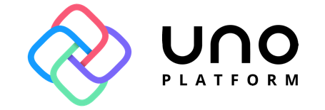](https://substackcdn.com/image/fetch/$s_!awC2!,f_auto,q_auto:good,fl_progressive:steep/https%3A%2F%2Fsubstack-post-media.s3.amazonaws.com%2Fpublic%2Fimages%2F44901140-1ed1-4b00-96d0-6eb5aa90265b_455x155.png)

## 2. **How did the Uno Platform start, and what motivated you to build it?**

The Uno Platform originated from the need for efficiency almost a decade ago. Back in 2013, our team at nventive (a Canadian custom application development consultancy) had deep expertise in building Windows apps (using XAML and C#) but faced growing demand to deliver applications on iOS and Android.

At that time, there were few options to easily reuse code across these ecosystems, which frankly didn’t live up to our expectations for building consumer-grade experiences, so we engineered our solution – Uno Platform. In doing so, we accomplished what even Microsoft hadn’t at the time: **making the WinRT model truly cross-platform for Windows, iOS, Android, and the web.**Later, we added support for Mac and Linux as well. We internally used this solution for years, proving its value by avoiding duplicate rewrites and retraining (we could leverage our existing C# and XAML skills everywhere).

In May 2018, seeing its success, we open-sourced Uno Platform at Microsoft Build 2018.

The motivation was always to simplify life for .NET developers – ourselves included – by enabling *one* codebase to target all devices. Since going open source, Uno has attracted thousands of contributions from the community and expanded to support even more platforms and features. Still, it remains true to that original goal: eliminating the pain of rewriting apps for each platform and instead letting developers focus on one consistent, productive codebase.

[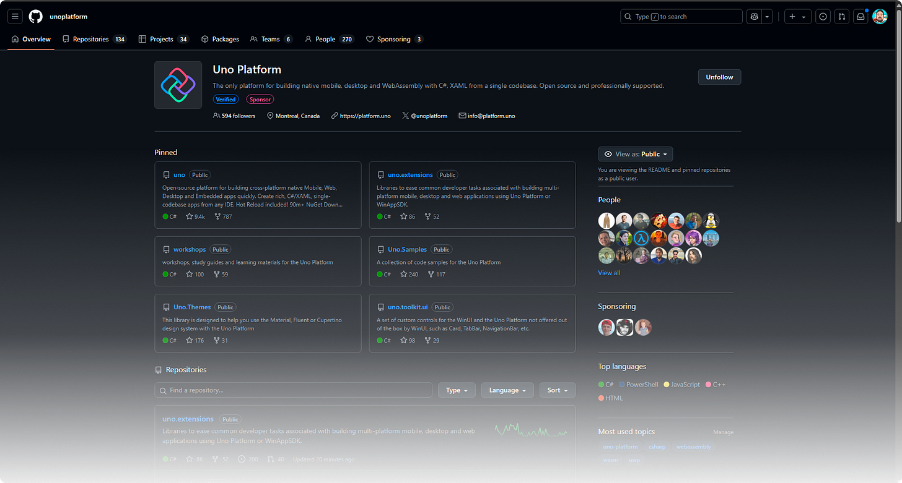](https://substackcdn.com/image/fetch/$s_!07P3!,f_auto,q_auto:good,fl_progressive:steep/https%3A%2F%2Fsubstack-post-media.s3.amazonaws.com%2Fpublic%2Fimages%2F332a01e5-3b5e-4dc1-9bcb-db3aad05a5cb_1919x1029.png)Uno Platform at [GitHub](https://github.com/unoplatform)

## 3. **How does Uno fit into the current .NET landscape?**

Uno Platform promotes the use of .NET; we like to think of ourselves as Flutter of the .NET community.

Uno Platform integrates into the .NET ecosystem as a natural extension, providing full cross-platform UI capabilities to .NET developers. It’s not a fork of .NET or a separate language – Uno Platform is built on the same .NET runtime and tools that underline .NET MAUI, and WinUI, which means you can use standard C#, leverage NuGet packages, and work in familiar IDEs like Visual Studio, VS Code, or Rider on any OS.

In some cases, Uno Platform is a perfect complement to Microsoft’s framework approach: for example, **it allows WinUI-based code to run on Android, iOS, macOS, Linux, and WebAssembly,** thereby complementing the official WinUI/WinApps SDK offerings. Or, Uno Platform reaches all mobile, web, desktop, and embedded targets natively – something no other .NET offering does. Uno Platform ships in lockstep with .NET itself (we’ve had support for new .NET versions like .NET 9 and .NET 10 Preview as soon as they’re released, so it stays up-to-date and takes advantage of the latest runtime improvements.

You can also integrate [Windows Community Toolkit](https://github.com/CommunityToolkit/WindowsCommunityToolkit) components or other WinUI libraries in an Uno app, and they will work across platforms, or you can use [.NET MAUI Toolkit](https://github.com/CommunityToolkit/Maui) as well for all the targets .NET MAUI covers.

[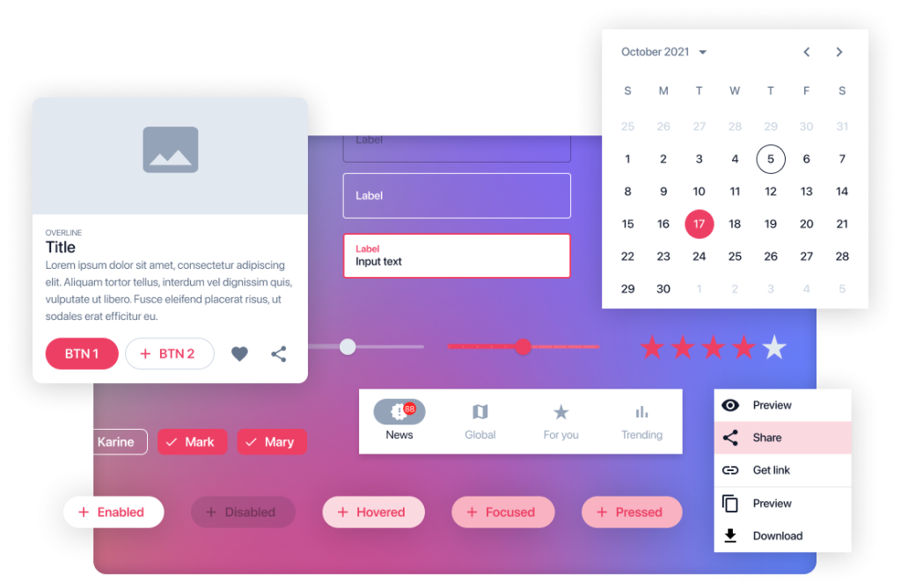](https://substackcdn.com/image/fetch/$s_!8_Nx!,f_auto,q_auto:good,fl_progressive:steep/https%3A%2F%2Fsubstack-post-media.s3.amazonaws.com%2Fpublic%2Fimages%2Ff1b8ec40-9343-4ead-a2e9-7a262f41c442_1024x669.png)Uno Platform vendor components

Furthermore, the ecosystem of [third-party providers](https://platform.uno/docs/articles/supported-libraries.html/?utm_source=DrMilan&utm_medium=email&utm_campaign=xplat-dotnet) – whether free and open-source, such as Live Charts, Maps UI, and Scott Plot, or commercial third-party UI component providers like Syncfusion, Telerik, Infragistics, and Mescius (formerly GrapeCity)- all work with Uno Platform.

Overall, **we position Uno Platform as a productivity platform within the .NET ecosystem:** it adheres to .NET standards and tooling, extends what .NET can do (especially in the UI/rendering space), and is backed by both an open-source community and a supporting company to ensure it remains a reliable option for .NET developers. We believe we offer the most complete and most productive platform for creating cross-platform enterprise applications.

## 4. Why might teams choose Uno over other cross-platform frameworks?

We describe Uno Platform as a comprehensive end-to-end development platform, not just a UI framework, because it provides a complete stack of UI, libraries, tooling, and workflows for building cross-platform .NET applications.

At its core, Uno provides a single-codebase UI framework that runs natively on all platforms supported by .NET: Windows, iOS, Android, macOS, Linux, and the Web.

Its rendering layer is powered by either Skia or native rendering through each platform’s native UI controls (when available), while ensuring pixel-perfect fidelity across all targets.

Beyond the UI layer, Uno includes **[Uno.Extensions](https://platform.uno/uno-extensions/)**, a suite of libraries for common app features such as navigation, dependency injection, configuration, and state management, enabling developers to adopt robust MVVM or reactive MVUX architectures with minimal overhead.

It also includes built-in **[theming and styling support](https://platform.uno/uno-themes/)** for modern design systems, allowing developers to apply Fluent or Material Design themes out of the box.

Additionally, Uno provides a rich set of UI components via **[the Uno Toolkit](https://platform.uno/uno-toolkit/)**, along with compatibility with WinUI and the Windows Community Toolkit, as well as .NET MAUI controls offered by Microsoft. It also supports third-party open-source and paid controls.

You can check the **[Uno Gallery](https://gallery.platform.uno/)** for a collection of ready-to-use Uno Platform code snippets that can speed up multi-platform development. It is also available for [Android](https://play.google.com/store/apps/details?id=com.nventive.uno.ui.demo) and [iOS](https://apps.apple.com/us/app/uno-gallery/id1380984680) platforms.

[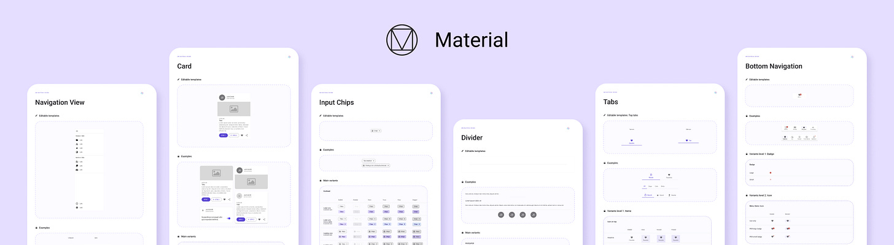](https://substackcdn.com/image/fetch/$s_!I3Rx!,f_auto,q_auto:good,fl_progressive:steep/https%3A%2F%2Fsubstack-post-media.s3.amazonaws.com%2Fpublic%2Fimages%2Fe1d29d83-84aa-41ff-8824-3d578616aec7_3814x1048.png)Uno Platform Material toolkit

As a platform, Uno is **fully extensible**, allowing you to easily integrate your preferred tooling, design systems, and architectural patterns, such as MVVM. And when you need access to native features (like Apple Pay), Uno doesn’t lock you in—you can step into native code whenever required.

Uno Platform also streamlines packaging and DevOps – Uno’s proper single-project system (enabled by the [Uno](https://platform.uno/docs/articles/features/using-the-uno-sdk.html?tabs=uno-packages)**[.](https://platform.uno/docs/articles/features/using-the-uno-sdk.html?tabs=uno-packages)**[Sdk](https://platform.uno/docs/articles/features/using-the-uno-sdk.html?tabs=uno-packages?utm_source=DrMilan&utm_medium=email&utm_campaign=xplat-dotnet)) centralizes all nine platform targets into one project for simpler builds, and official templates can even generate CI/CD pipelines (e.g., GitHub Actions YAML) to automate building and testing your app across platforms.

Finally, Uno Platform offers easy setup options (Uno-check, Template Wizard) as well as tooling ([Hot Design](https://platform.uno/hot-design/?utm_source=DrMilan&utm_medium=email&utm_campaign=xplat-dotnet), [Hot Reload](https://aka.platform.uno/hot-reload?utm_source=DrMilan&utm_medium=email&utm_campaign=xplat-dotnet), [Design-to-Code](https://platform.uno/docs/articles/external/figma-docs/get-started/design-to-code.html)) which augment the core platform offering to make for a delightful and fast dev loop.

## 5. How is Uno Platform different from .NET MAUI or Blazor?

Let us provide some brief, top-line differences regarding Maui and Blazor.

### Uno Platform vs. MAUI

- Uno Platform supports all platforms that .NET runs on, including all platforms that MAUI supports, as well as **Web** **and Linux. Therefore, a broader reach of targets.**
- Uno Platform offers a Visual Designer – **Hot Design** – which turns live, running apps into a Visual Designer.
- Uno Platform utilizes **Skia to render UI**, which offers incredible performance benefits, including rapid app boot times (sub-0.5 seconds), a small download size, and a minimal memory footprint.

### Uno Platform vs. Blazor

Uno Platform and Blazor both make use of .NET's WebAssembly support to run natively in the browser.

- In a nutshell, Blazor is well-suited for building web apps and cannot be directly ported to native Mobile without using the .NET Maui hybrid option, which comes with all the downsides that these approaches usually have.
- Blazor is a Web-first (and only) technology. As such, .NET developers are using a web stack to develop applications. So, Uno Platform applications are written in C# and XAML markup, whereas Blazor applications are written in 'Razor' syntax, a hybrid of HTML/CSS and C#.
- Uno Platform applications are cross-platform, running on the web as well as mobile and desktop, equally, from a single codebase. Blazor is a feature of ASP.NET primarily used for building web applications.

In summary, **Uno Platform is a complete productivity platform and much more than a UI framework like .NET MAUI and Blazor**, for building a single codebase, native, mobile, web, desktop, and embedded apps with .NET.

At its core is a cross-platform .NET UI framework that enables apps to run everywhere with a single codebase. However, built on top of this foundation is also a rich platform that includes libraries, extensions, and tools to accelerate the design, development, and testing of cross-platform applications. This platform also features the industry-first visual designer, which turns live, running apps into design surfaces – Hot Design.

## 6. How does Uno Platform work under the hood?

Uno Platform sits on top of .NET and implements a cross-platform architecture by replicating the entire WinUI API surface through its Uno.WinUI and Uno.WinRT NuGet packages. This allows developers to write applications using standard WinUI 3 XAML and C#, while targeting platforms such as iOS, Android, macOS, Linux, WebAssembly, and Windows.

[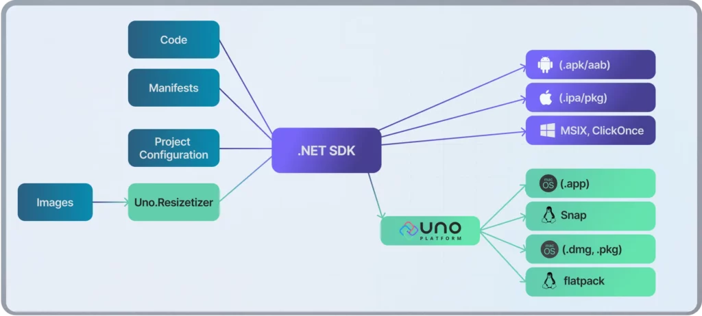](https://substackcdn.com/image/fetch/$s_!0m9V!,f_auto,q_auto:good,fl_progressive:steep/https%3A%2F%2Fsubstack-post-media.s3.amazonaws.com%2Fpublic%2Fimages%2Fa0067964-589b-43e1-aa3c-96a9fa3e829f_1024x462.webp)App Packaging in Uno Platform

On Windows specifically, no abstraction is needed—the application is a native WinAppSDK app, leveraging Microsoft's toolchain and APIs directly, or Skia can be used to draw pixels directly. **The platform also supports the majority of non-UI WinRT APIs, like file system access and device integration,** with unsupported features marked and flagged via analyzers during development.

At runtime, Uno Platform **maps the shared XAML-based visual tree to a platform-specific rendering backend—either Skia-based (default) or native.** The Skia renderer provides a hardware-accelerated, pixel-perfect rendering layer using Metal, OpenGL, or WebGL, depending on the platform. It enables a consistent look and feel by bypassing native widgets entirely, drawing the entire visual tree on a canvas. This model **ensures performance and visual uniformity across platforms** and is the default rendering method for new projects due to its efficiency and flexibility, especially for complex or custom UIs.

Alternatively, Uno Platform’s native rendering mode utilizes each platform’s native UI components—like UIView on iOS or div elements on WebAssembly—maintaining deep integration with the platform’s native input, accessibility, and behavior characteristics. Regardless of the rendering path, Uno Platform **maintains a consistent developer-facing UI API, enabling seamless cross-platform code reuse**. At build time, XAML is transformed via Roslyn source generators into C# for optimized performance, and resources such as images and .resx strings are automatically adapted to each platform’s conventions.

[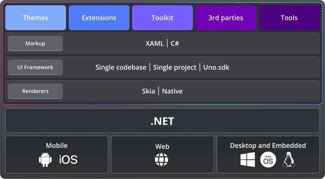](https://substackcdn.com/image/fetch/$s_!vqze!,f_auto,q_auto:good,fl_progressive:steep/https%3A%2F%2Fsubstack-post-media.s3.amazonaws.com%2Fpublic%2Fimages%2Fad76c259-8242-4e0b-a45a-b0de816c6b19_656x361.png)

## 7. What tools or integrations does Uno provide to simplify the developer experience?

Uno Platform puts a strong emphasis on a great developer experience, offering tools and integrations that will feel familiar to .NET developers and streamline the workflow.

For starters, Uno projects can be developed in **your favorite IDE on your preferred OS** – whether you use Visual Studio, VS Code, or Rider on Windows, Mac, or Linux, Uno supports them all.

[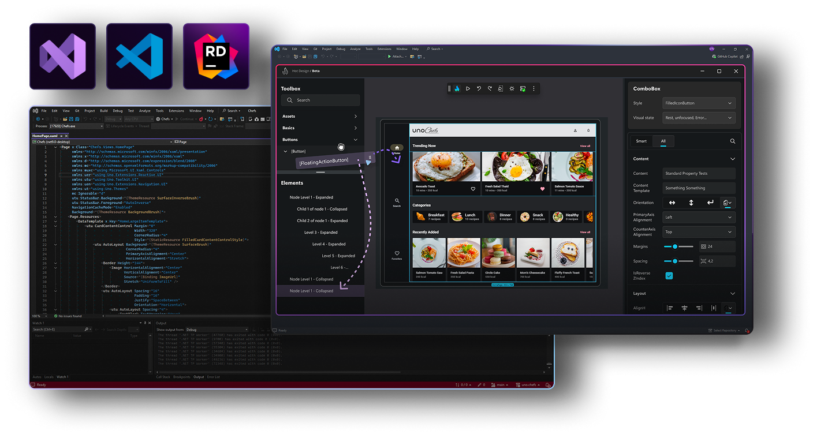](https://substackcdn.com/image/fetch/$s_!9fcd!,f_auto,q_auto:good,fl_progressive:steep/https%3A%2F%2Fsubstack-post-media.s3.amazonaws.com%2Fpublic%2Fimages%2F2b5aafaf-d276-4b46-b97c-7c1e5ab7239b_1408x752.png)Uno Platform integrations

To make the developer startup experience as frictionless as possible, we provide **Uno-check** and a **Template Wizard**, which help you set up and start a new project in a matter of seconds.

Uno Platform Check

The inner development loop is accelerated by features such as Hot Reload, Hot Design, and Design to Code, all of which are offered under our Uno Platform Studio suite, which features both free and paid tiers.

### **Hot Reload**

Uno Platform [Hot Reload](https://platform.uno/docs/articles/studio/Hot%20Reload/hot-reload-overview.html?tabs=vswin%2Cwindows%2Cskia-desktop%2Ccommon-issues/?utm_source=DrMilan&utm_medium=email&utm_campaign=xplat-dotnet) across all targets and from all IDEs, for both XAML and C# Markup, which is a differentiator compared to any other .NET offering. You can modify your XAML UI or C# markup and see the changes instantly reflected in the running app. In addition to Uno’s Hot Reload mechanism giving immediate feedback on the UI, you also get an on-screen indicator to confirm updates. This means you spend far less time rebuilding and more time tweaking your UI until it’s perfect. **Most importantly, our Hot Reload works well even when updating complex UIs.**

[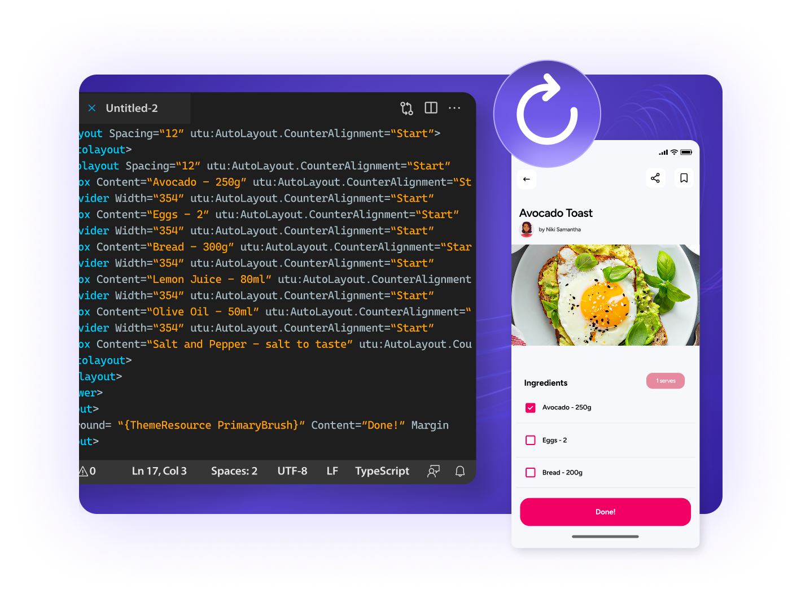](https://substackcdn.com/image/fetch/$s_!abUO!,f_auto,q_auto:good,fl_progressive:steep/https%3A%2F%2Fsubstack-post-media.s3.amazonaws.com%2Fpublic%2Fimages%2F8de99b8e-43c5-4c13-b273-413aad99ca96_1419x1057.png)Uno Platform Hot Reload

### **Hot Design**

The game changer is [Hot Design](https://platform.uno/hot-design/?utm_source=DrMilan&utm_medium=email&utm_campaign=xplat-dotnet). It is the next-generation visual UI designer for Uno Platform cross-platform apps. The Visual Designer for cross-platform Applications has been requested by .NET developers for years, if not decades, something [Microsoft has confirmed they will not do](https://developercommunity.visualstudio.com/t/Business-Case-for-a-Universal-UI-Builder/10683407?%2F10460541=). We’ve now delivered it via Hot Design. It fundamentally rethinks how developers and designers build interfaces in a cross-platform app as it turns a live, running app into a design surface for developers.

With a single click, you switch an app into interactive design mode, where you can visually modify the UI – drag controls, adjust properties, and change layouts – **all while the app is live and possibly even connected to real data.**

These changes made on the design surface are persisted in code; Hot Design synchronizes everything with your source XAML. For example, if you move a button or adjust a color in the visual designer, the underlying XAML code is immediately updated to match (and vice versa; code changes are reflected instantly in the running app).**This is a massive departure from traditional WYSIWYG designers of the past.** In older frameworks, you might have a separate design tool or a static preview – think of Visual Studio’s design view or Blend for WPF – which was often disconnected from the actual running state of the app and frequently required manual refreshes or rebuilds to test interactions.

[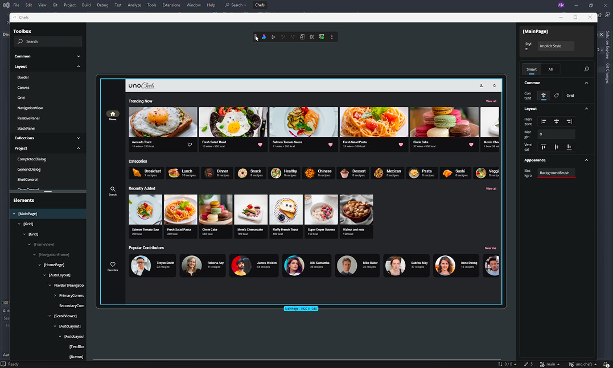](https://substackcdn.com/image/fetch/$s_!Q1W1!,f_auto,q_auto:good,fl_progressive:steep/https%3A%2F%2Fsubstack-post-media.s3.amazonaws.com%2Fpublic%2Fimages%2F82e1e8a9-5e74-4f75-85c2-e4ed23a3883a_1077x647.png)Uno Platform Hot Design

Hot Design eliminates that disconnect by merging designing and debugging into one continuous process. It significantly speeds up the workflow because you can *see the impact of your UI changes in real time with live data*. For example, you can bind a list to live sample data and use Hot Design to rearrange items or update styles, immediately seeing how it would look with realistic content.

This tight feedback loop is highly significant for cross-platform development, where you typically need to validate that a UI looks good on different devices and orientations. **With Hot Design, you can do that on the fly, adjusting your layout in an active app until it’s just right.**

Moreover, Hot Design is IDE-agnostic (it works with your app running on any platform, and you can use it from any IDE), which contrasts with older designers tied to specific tools. By removing the traditional “edit XAML, compile, run, repeat” cycle, Hot Design lets developers stay in the creative flow. It’s effectively an evolution of Hot Reload into a whole **bi-directional design experience**, making UI development far more intuitive.

### Design-to-Code

Uno also integrates design tooling into the workflow. For example, we offer Figma**integration ([Design-to-Code](https://platform.uno/unofigma/?utm_source=DrMilan&utm_medium=email&utm_campaign=xplat-dotnet))**, which enables designers to convert their designs into XAML or C# UI code with a single click. This drastically cuts down the tedious work of translating high-fidelity designs into working UI by hand, allowing for rapid prototyping directly from design assets.

[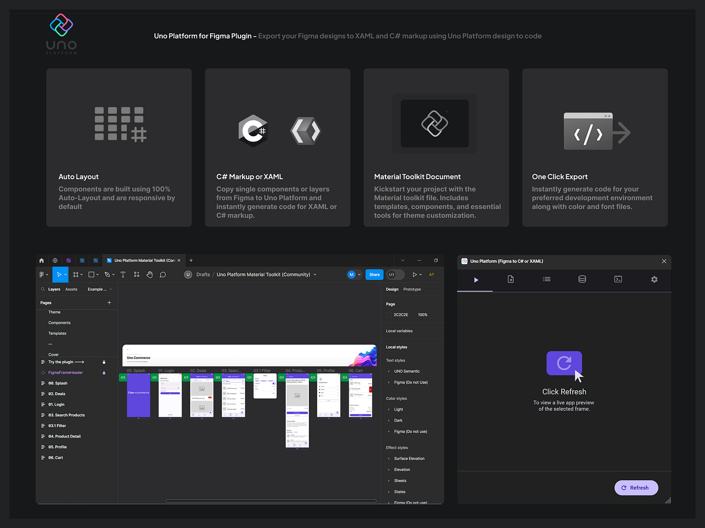](https://substackcdn.com/image/fetch/$s_!_uGo!,f_auto,q_auto:good,fl_progressive:steep/https%3A%2F%2Fsubstack-post-media.s3.amazonaws.com%2Fpublic%2Fimages%2F932bba52-e018-4c52-a74b-4bbacca32576_3203x2405.png)Uno Platform for Figma Plugin

All of these factors, multi-IDE support, Hot Reload, design import tools, and ready-made components contribute to a development experience where you can build and **refine an app rapidly**, test it on multiple platforms instantly (including via the web), and iterate with a very tight feedback loop.

## 8. Can you share examples of companies or products that have successfully used Uno?

Uno Platform has been adopted in a variety of industries, and we’ve seen some high-profile successes. For instance, **[Toyota](https://platform.uno/blog/toyota-migrates-mobile-app-to-uno-platform/)**[chose the Uno Platform](https://platform.uno/blog/toyota-migrates-mobile-app-to-uno-platform/?utm_source=DrMilan&utm_medium=email&utm_campaign=xplat-dotnet)to migrate their dealership and customer-facing applications from Xamarin.Forms to a single Uno codebase – they navigated the complex migration and achieved successful deployments that meet the auto industry’s rigorous standards for quality and reliability.

Toyota uses the Uno Platform.

Another great example is **[Kahua](https://platform.uno/blog/kahua-uses-uno-platform-winui-and-azure-to-deliver-a-multi-platform-app-four-times-faster-than-anticipated/?utm_source=DrMilan&utm_medium=email&utm_campaign=xplat-dotnet)**, a construction project management enterprise software company. They had a huge WPF application (over a million lines of code) and used Uno to extend it to all targets – initially web and desktop, and then mobile. Impressively, their new Uno-powered web app delivers a user experience and performance comparable to their original desktop app, which validates that Uno can handle large-scale, data-intensive apps with ease.

We also have fintech companies like **iA Financial Group** or **Trade Zero**. [Trade Zero](https://www.youtube.com/watch?v=sJKjuQ9KMXA) is an interesting case, as its application is designed for power traders who execute thousands of transactions per day —a scenario where milliseconds make a significant difference. They chose Uno Platform for its performance benefits.

TradeZero mobile app built on Uno Platform

Even **Microsoft** has utilized Uno Platform for Toolkit Labs ([toolkitlabs.dev](https://toolkitlabs.dev/)), a space for collaboration and engineering solutions from the prototyping stage through to a polished, finalized component that can be included in the Windows Community Toolkit.

[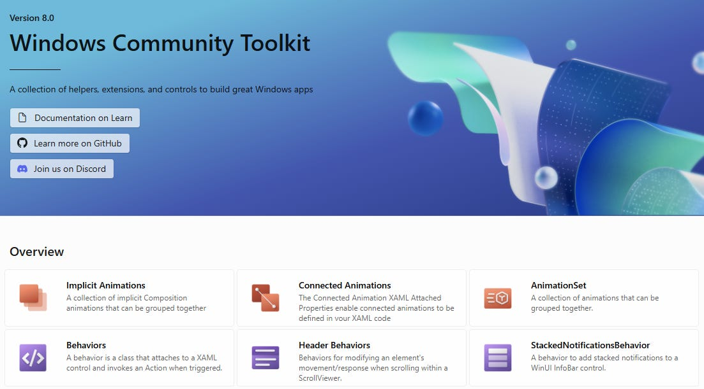](https://substackcdn.com/image/fetch/$s_!glJT!,f_auto,q_auto:good,fl_progressive:steep/https%3A%2F%2Fsubstack-post-media.s3.amazonaws.com%2Fpublic%2Fimages%2Fa7e5aea3-e6d9-41f6-ac20-9327f9125b9c_1103x611.png)Windows Community Toolkit

A massive example of a community application with a vast user base is the **[NuGet Package Explorer,](https://nuget.info)** which runs in the browser on nuget.org and is powered by Uno Platform. This is a real vote of confidence, showing that Uno’s WebAssembly support is production-ready for the tooling used by millions of developers.

Those are just a few examples; the list of companies willing to go on record about the use of the Uno Platform in their solutions can be found here: [https://platform.uno/case-studies/](https://platform.uno/case-studies/?utm_source=DrMilan&utm_medium=email&utm_campaign=xplat-dotnet).

The feedback from these real-world projects has been encouraging. Teams often report that they were able to significantly accelerate development by sharing code between platforms – one code update fixes the app everywhere, which reduces maintenance cost and complexity.

Of course, we’ve gathered many lessons from real deployments and made them super-easy by providing commands that package applications in seconds, compared to the hours of meticulous work required. Additionally, we’ve improved documentation and added features in response to the needs of enterprise teams (such as advanced memory management and performance tuning options, which we introduced when we saw huge apps like Kahua’s coming on board).

## 9. What is the future of the Uno Platform?

We’re very excited about what’s coming next for Uno Platform, and we look forward to sharing some news with you very soon. AI is here, it is fast evolving, and we are actively exploring scenarios where AI makes sense to incorporate. As it stands today, AI tools offer some productivity gains. However, AI as it stands today is not a replacement for experienced developers, as some media or ‘influencers’ would have you believe. At [Uno Platform,](https://platform.uno/?utm_source=DrMilan&utm_medium=email&utm_campaign=xplat-dotnet) we are investing in tools that make developers productive within their current environments, such as **[Hot Design](https://platform.uno/hot-design)**. We are also exploring how to augment that Hot Design experience with AI.

We believe features like **Hot Design** will become even smarter, for example, by incorporating AI-assisted design aids that can suggest UI tweaks or generate bindings automatically, further accelerating development. These AI features will be integrated into our growing suite, called **[Uno Platform Studio](https://platform.uno/docs/articles/studio/studio-overview.html)**.

[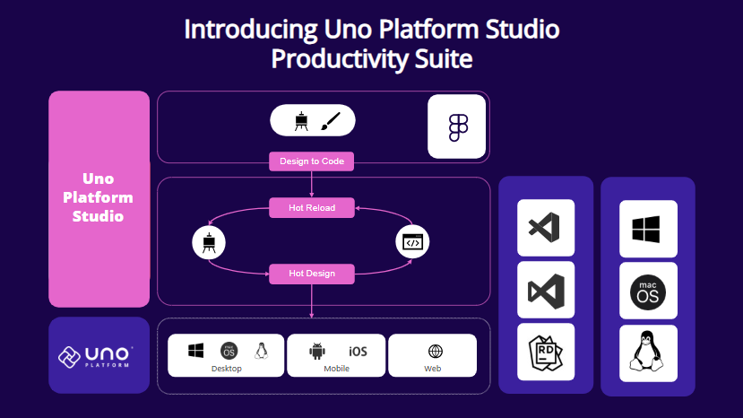](https://substackcdn.com/image/fetch/$s_!e0-T!,f_auto,q_auto:good,fl_progressive:steep/https%3A%2F%2Fsubstack-post-media.s3.amazonaws.com%2Fpublic%2Fimages%2F5a189168-69ff-4458-b250-137b067e0924_829x466.png)Uno Platform Studio

In terms of platform support, Uno will continue to closely track and support the latest advancements in .NET and Windows UI. Just as we supported .NET 8 and .NET 9 when they came out (even simplifying WebAssembly setup by removing old dependencies thanks to .NET’s improvements) **we’ll do the same for future .NET versions** – ensuring that Uno developers can immediately leverage new runtime features, performance gains, and language improvements.

Performance remains a constant focus: our recent releases have brought sizable speed and memory improvements (for example, **[Uno 5.6](https://platform.uno/blog/5-6/?utm_source=DrMilan&utm_medium=email&utm_campaign=xplat-dotnet) achieved a 2.5× performance boost in specific scenarios and drastically reduced WebAssembly app startup times**). Our Skia approach in **[Uno 6.0](https://platform.uno/blog/uno-platform-studio-6-0/?utm_source=DrMilan&utm_medium=email&utm_campaign=xplat-dotnet) has demonstrated a 65% improvement in startup times and a 107 times faster rendering**. Therefore, we will continue to focus on improving efficiency so that Uno apps are not only cross-platform but also fast and lightweight.

On the tooling side, beyond Hot Design, we’re enhancing our **[Uno Platform Studio](https://platform.uno/studio/?utm_source=DrMilan&utm_medium=email&utm_campaign=xplat-dotnet)** suite – expect even more productive tooling, including debugging, visual diagnostics, and design-to-code workflows, as we aim to make developing in Uno as frictionless as possible.

If anyone wants to learn more, they can check out **[Uno Chefs](https://github.com/unoplatform/uno.chefs)**, a brand-new flagship reference application, built from the ground up using the power of Uno Platform 6.0! It provides .NET developers with a comprehensive, production-grade example and learning ecosystem for building feature-rich, modern, cross-platform applications with Uno Platform.

[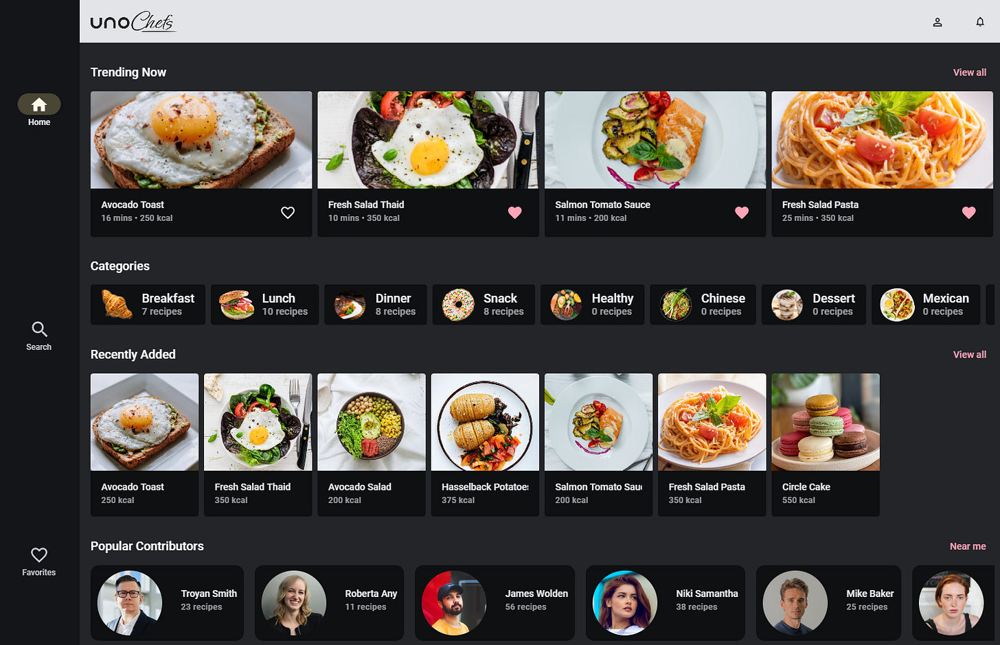](https://substackcdn.com/image/fetch/$s_!_RPn!,f_auto,q_auto:good,fl_progressive:steep/https%3A%2F%2Fsubstack-post-media.s3.amazonaws.com%2Fpublic%2Fimages%2Fc4b641b1-9282-43c5-b052-2c15d2c826e3_1480x955.png)Uno Chefs - An interactive app that shows what Uno Platform can do in a real-world

As more developers adopt Uno, we’re investing in the community, including better documentation, more open-source contributions, and samples, to incorporate their feedback and contributions.

---

## **More ways I can help you:**

- [📦](https://www.patreon.com/techworld_with_milan/shop/premium-resume-package-1721454?utm_medium=clipboard_copy&utm_source=copyLink&utm_campaign=productshare_creator&utm_content=join_link)**[Premium Resume Package](https://www.patreon.com/techworld_with_milan/shop/premium-resume-package-1721454?utm_medium=clipboard_copy&utm_source=copyLink&utm_campaign=productshare_creator&utm_content=join_link) (NEW)**. Built from over 300 interviews, this system enables you to craft a clear, job-ready resume quickly and efficiently. You get ATS-friendly templates (summary, project-based, and more), a cover letter, AI prompts, and bonus guides on writing resumes and prepping LinkedIn. Launch price: **$49** (after June 8, the price increases to $70). Use **34BC2**code.
- [📚](https://www.patreon.com/techworld_with_milan/shop/ultimate-net-bundle-for-2025-1519389?utm_medium=clipboard_copy&utm_source=copyLink&utm_campaign=productshare_creator&utm_content=join_link)**[The Ultimate .NET Bundle 2025](https://www.patreon.com/techworld_with_milan/shop/ultimate-net-bundle-for-2025-1519389?utm_medium=clipboard_copy&utm_source=copyLink&utm_campaign=productshare_creator&utm_content=join_link)** **(NEW)**. 500+ pages distilled from 30 real projects show you how to own modern C#, ASP.NET Core, patterns, and the whole .NET ecosystem. You also get 200+ interview Q&As, a C# cheat sheet, and bonus guides on middleware and best practices to improve your career and land new .NET roles. Use **916A6** code for **$30 off** until the end of the week.
- [📢](https://www.patreon.com/techworld_with_milan/shop/short-linkedin-content-creator-311232?utm_medium=clipboard_copy&utm_source=copyLink&utm_campaign=productshare_creator&utm_content=join_link)**[LinkedIn Content Creator Masterclass](https://www.patreon.com/techworld_with_milan/shop/short-linkedin-content-creator-311232?utm_medium=clipboard_copy&utm_source=copyLink&utm_campaign=productshare_creator&utm_content=join_link)**. I share the system that grew my tech following to over 100,000 in 6 months (now over 255,000), covering audience targeting, algorithm triggers, and a repeatable writing framework. Leave with a 90-day content plan that turns expertise into daily growth.
- [📄](https://www.patreon.com/techworld_with_milan/shop/complete-tech-resume-reality-check-311008?utm_medium=clipboard_copy&utm_source=copyLink&utm_campaign=productshare_creator&utm_content=join_link)**[Resume Reality Check](https://www.patreon.com/techworld_with_milan/shop/complete-tech-resume-reality-check-311008?utm_medium=clipboard_copy&utm_source=copyLink&utm_campaign=productshare_creator&utm_content=join_link)**. Get a CTO-level teardown of your CV and LinkedIn profile. I flag what stands out, fix what drags, and show you how hiring managers judge you in 30 seconds.
- [✨](https://www.patreon.com/c/techworld_with_milan)**[Join My Patreon](https://www.patreon.com/c/techworld_with_milan)**[https://www.patreon.com/c/techworld_with_milan](https://www.patreon.com/c/techworld_with_milan)**[Community](https://www.patreon.com/c/techworld_with_milan)**. Unlock every book, template, and future drop (worth over $100), plus early access, behind-the-scenes notes, and priority requests. Your support enables me to continue writing in-depth articles at no cost.
- [🤝](https://newsletter.techworld-with-milan.com/p/coaching-services)**[1:1 Coaching](https://newsletter.techworld-with-milan.com/p/coaching-services)** – Book a focused session to crush your biggest engineering or leadership roadblock. I’ll map next steps, share battle-tested playbooks, and hold you accountable.

---

Thanks for reading Tech World With Milan Newsletter! Subscribe for free to receive new posts and support my work.