# The Trends #4: Developers hate their job, but like to code outside work

In today’s issue, we will discuss a few trends and industry reports from this year. Namely:

1. **2024 Stack Overflow Developer Survey**
2. **ThoughtWorks Technology Radar - Volume 30.**
3. **Software Architecture InfoQ Trends Report - April 2024.**
4. **The Most Demanded Frontend Frameworks in 2023. by DevJobsScanner**
5. **State of JavaScript 2023.**

So, let’s dive in.

---

## **📄 Key insights from all reports**

1. **JavaScript (62%), HTML/CSS (53%), and Python (51%) remain the most used programming languages among developers.** However, Python has emerged as the most desired language, indicating a shift in developer preferences. Rust continues to be highly regarded, with an 83% adoration rate among users who wish to use it again.
2. **Impact of AI Tools on Development.**76% of developers are using or planning to use AI tools, with 81% acknowledging that these tools enhance productivity. Despite this, nearly half of the respondents believe AI could outperform them in solving complex tasks. Developers primarily utilize AI for code writing (82%), while many are still cautious about its role in testing.
3. **High job dissatisfaction among developers.**Approximately 80% of developers express dissatisfaction with their jobs, with one-third actively hating their work. Many report feeling pressured to meet unrealistic deadlines, leading to burnout. Despite good salaries and flexible work options, the stress of technical debt and complex tech stacks contributes significantly to their unhappiness.
4. **Learning trends among developers.**Most developers (82%) are learning to code through online resources, with technical documentation and tutorials being the most favored methods. This trend highlights a shift from traditional educational pathways, as only 49% are learning in formal educational settings.
5. **Emerging trends in software architecture.**The latest reports indicate a growing interest in cell-based architecture, which enhances performance and cost savings by favoring services within the same availability zone. Additionally, privacy engineering is shifting from reactive compliance to proactive data security measures, reflecting a broader trend toward prioritizing user data protection in software design.
6. **React, Angular and Vue are the frontend frameworks most wanted by job offers.** Regarding the job demand for these frameworks per country, React dominates most countries. Still, some European countries, such as Switzerland, France, Spain, and Italy, have more job opportunities for Angular than React.

---

## 2024 Stack Overflow Developer Survey

Last week, Stack Overflow released the results of its **[annual survey](https://survey.stackoverflow.co/2024)** on coding, the technologies and tools developers use and want to learn artificial intelligence, and their workplace experience. Over 65,000 programmers from 185 countries responded to the survey.

Here are the most critical insights from the report:

### 1. JavaScript (62%), HTML/CSS (53%), and Python (51%) top the list of most-used languages for the second year in a row.

Since the Developer Survey's launch in 2011, **JavaScript** has consistently been the most popular language among Stack Overflow users. This year, **Python** has surpassed **JavaScript** as the most wanted language (those who indicated they would use it next year but not this year). With an 83% adoration rate, **Rust** is the language most developers use and wish to use again for the second year. **Python** is the most often used language among code beginners.

[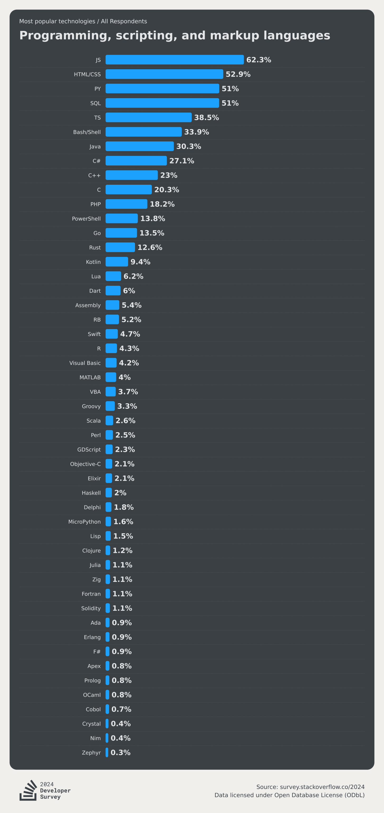](https://substackcdn.com/image/fetch/$s_!anxc!,f_auto,q_auto:good,fl_progressive:steep/https%3A%2F%2Fsubstack-post-media.s3.amazonaws.com%2Fpublic%2Fimages%2Ff9b84c9b-ce6c-46ef-8275-3a57c74a32eb_2400x5070.png)Programming, scripting, and markup languages

In the **embedded technology space** (where 3% of developers are working), Raspberry Pi (39%) and Arduino (30%) top the list.

[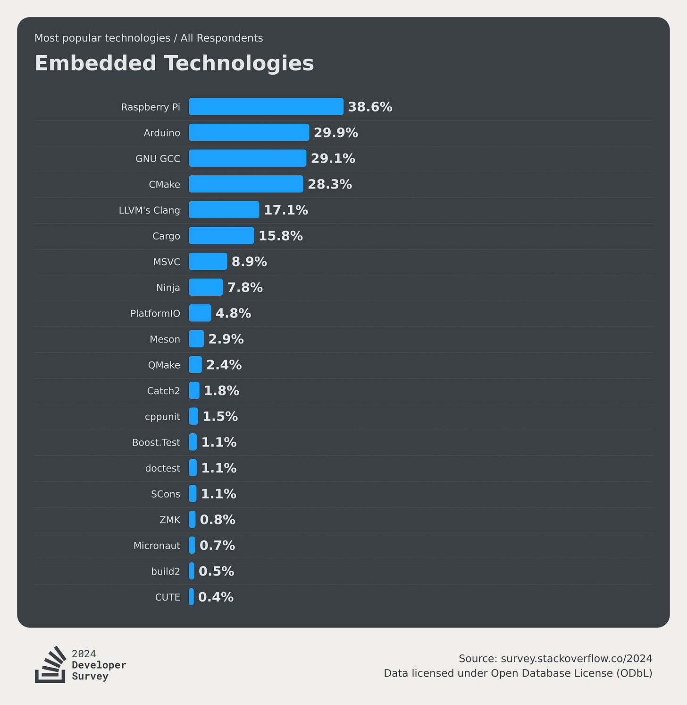](https://substackcdn.com/image/fetch/$s_!H413!,f_auto,q_auto:good,fl_progressive:steep/https%3A%2F%2Fsubstack-post-media.s3.amazonaws.com%2Fpublic%2Fimages%2Fc1452c05-e00f-4d16-ae06-3ead45029d13_2400x2460.png)Embedded Technologies

The most popular **databases** are PostgreSQL, MySQL, and SQLite, followed by Microsoft SQL Server and Redis. In 2018. only 33% of developers used PostgreSQL, and MySQL was at 59%, so the trend is apparent (PostgreSQL is the winner).

[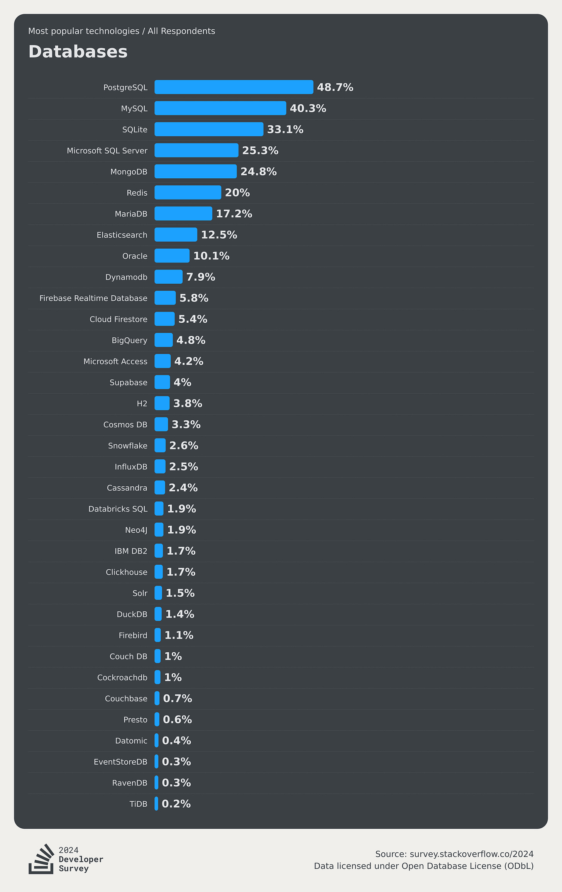](https://substackcdn.com/image/fetch/$s_!KUjX!,f_auto,q_auto:good,fl_progressive:steep/https%3A%2F%2Fsubstack-post-media.s3.amazonaws.com%2Fpublic%2Fimages%2F47414108-60b8-4efc-8402-f7cab45e3ec1_2400x3810.png)Databases

AWS, Azure, and Google Cloud are still the most popular **Cloud platforms**. Azure and Google Cloud have increased their share. Azure usage has climbed from 26% to 28%, and Google Cloud usage went from 24% to 25%.

[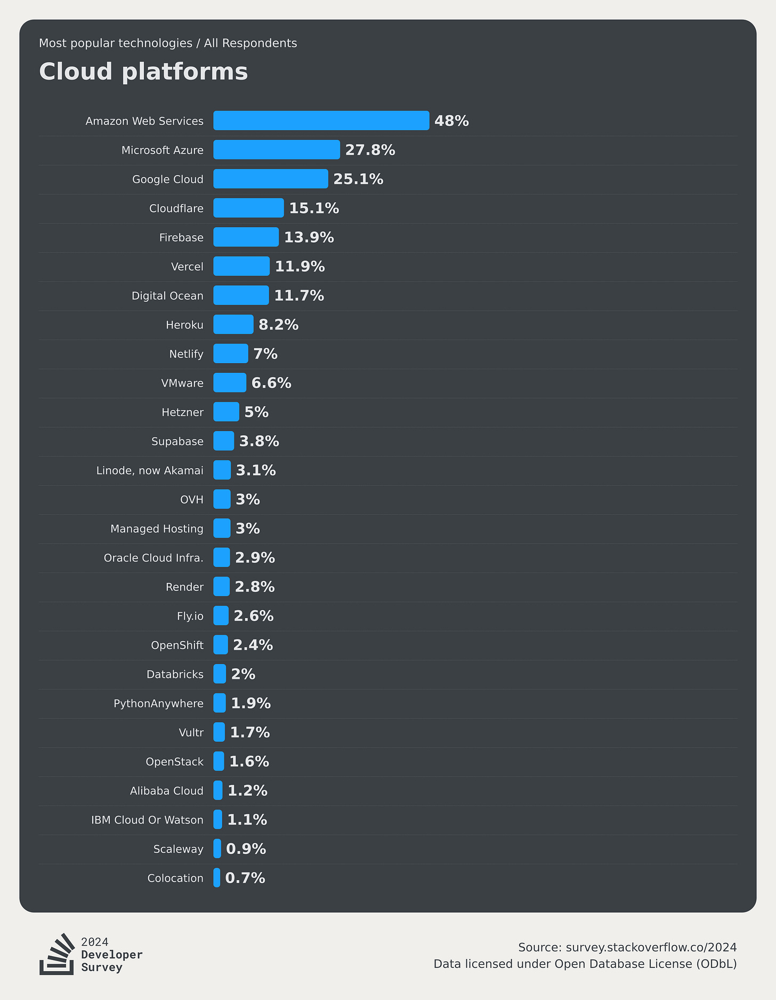](https://substackcdn.com/image/fetch/$s_!wjNz!,f_auto,q_auto:good,fl_progressive:steep/https%3A%2F%2Fsubstack-post-media.s3.amazonaws.com%2Fpublic%2Fimages%2F43d02d10-a6ef-49c5-9cec-26118566ae57_2400x3090.png)Cloud platforms

Node.js and React are the most popular **Web frameworks**, yet Node.js is not as popular as it was a few years ago.

[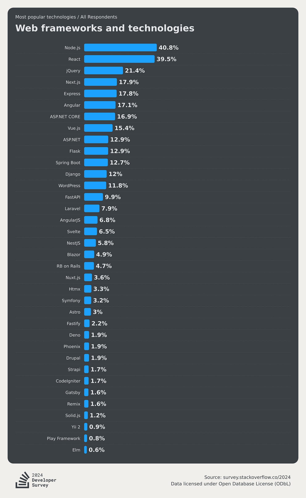](https://substackcdn.com/image/fetch/$s_!iG4Z!,f_auto,q_auto:good,fl_progressive:steep/https%3A%2F%2Fsubstack-post-media.s3.amazonaws.com%2Fpublic%2Fimages%2Fbba6ad89-0cc0-4e04-b67a-458d52a41f9d_2400x3900.png)Web frameworks and technologies

In the section on other frameworks, **.NET** is the winner. A strong Microsoft push with all new versions of .NET and C# gave results.

[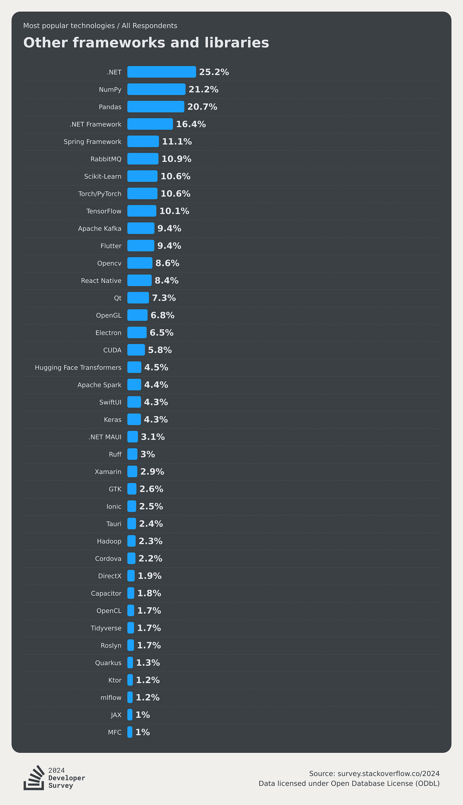](https://substackcdn.com/image/fetch/$s_!Gkqe!,f_auto,q_auto:good,fl_progressive:steep/https%3A%2F%2Fsubstack-post-media.s3.amazonaws.com%2Fpublic%2Fimages%2F26090780-37db-44de-a941-8f728380e1fa_2400x4170.png)Other frameworks

### 2. 82% are learning to code using online resources compared to 49% learning to code in school.

11% of respondents to this year's study said they were learning to code or identified as students. In comparison, 17.3% of respondents said they attended school at least part-time despite not knowing how to code or working as developers outside of their studies.

[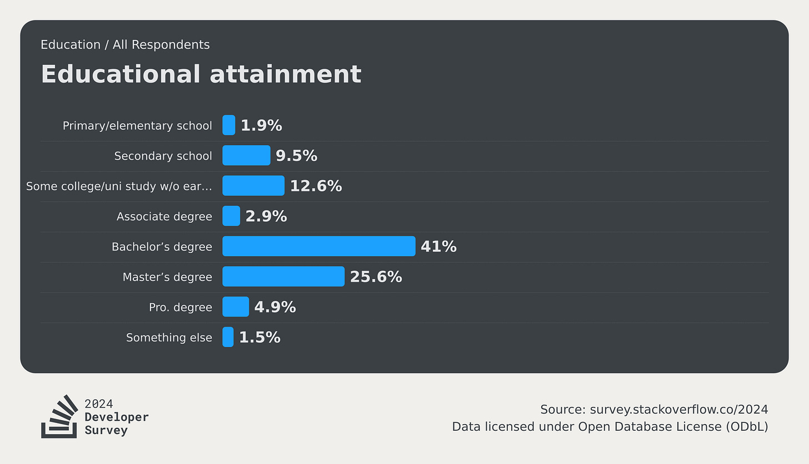](https://substackcdn.com/image/fetch/$s_!aDSC!,f_auto,q_auto:good,fl_progressive:steep/https%3A%2F%2Fsubstack-post-media.s3.amazonaws.com%2Fpublic%2Fimages%2F4b78fad9-88ae-4659-bb0c-e8e824289a39_2400x1380.png)Educational attainment

When we talk about learning resources, most developers learn from technical docs (API docs or readme files), written tutorials, blogs, and videos.

[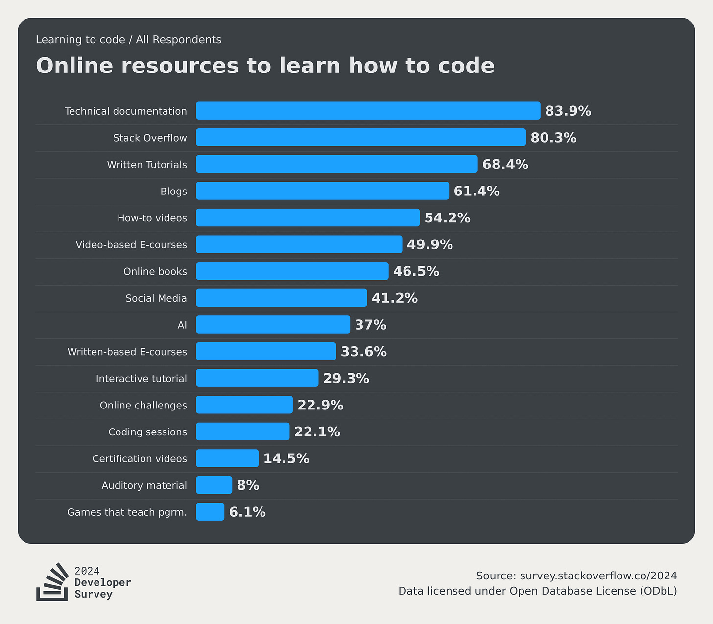](https://substackcdn.com/image/fetch/$s_!SfaQ!,f_auto,q_auto:good,fl_progressive:steep/https%3A%2F%2Fsubstack-post-media.s3.amazonaws.com%2Fpublic%2Fimages%2F5d4b006a-f4ad-4e9c-ac9e-9d652e524695_2400x2100.png)Online resources to learn how to code

### 3. Challenges in the world economy have been tough on many professions, including developers.

Most developers who do not hold a people manager role are reporting at least a USD 10,000 yearly income loss. Because developing technologies are erratic, some positions have fallen victim to market corrections. This includes blockchain developers, who in 2023 reported a median yearly pay of exceeding six figures but currently report a salary of USD 86K.

[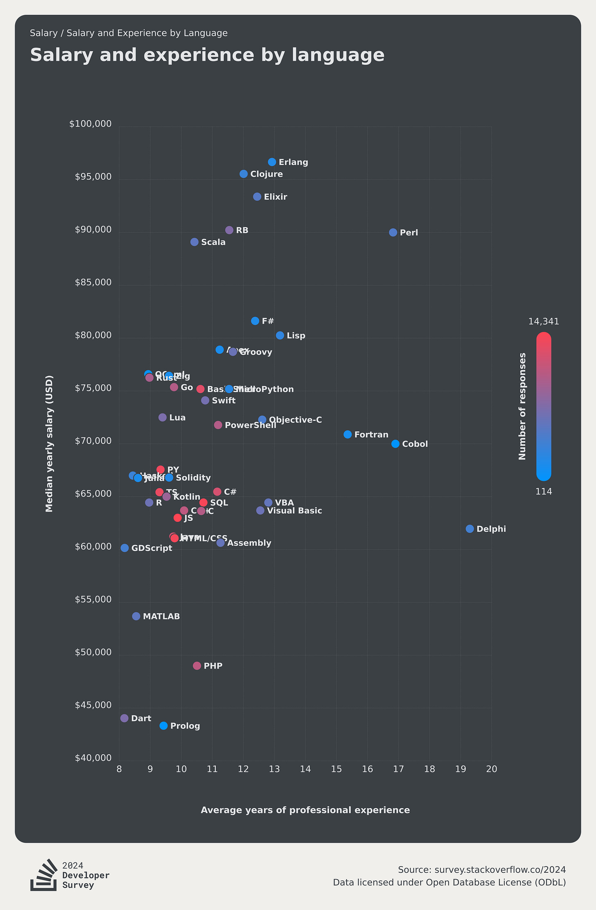](https://substackcdn.com/image/fetch/$s_!v_EI!,f_auto,q_auto:good,fl_progressive:steep/https%3A%2F%2Fsubstack-post-media.s3.amazonaws.com%2Fpublic%2Fimages%2F2b5bb25d-6b1e-44bb-8ec3-9e043d1a0a01_2400x3660.png)Salary and experience by language

Developers are often pressured to complete tasks quickly to earn as much as possible. Increased pressure in the workplace leads to unrealistic expectations and burnout.

When discussing top-paying technologies, **Erlang** is at the top, followed by **Elixir**. Why are they on the top, especially Elixir? Because Elixir is built on the Erlang virtual machine, it has several advantages. To manage concurrent, distributed, and fault-tolerant systems, Ericsson created Erlang in the 1980s for use in telecommunications systems. Simplifying intricate systems is one of Elixir's best qualities. Additionally, its automatic restarts and built-in fault tolerance help developers frequently work around problems with it without the end user noticing. Today, with Python, Elixir is mainly used to run models like Stable Diffusion natively on the GPU.

[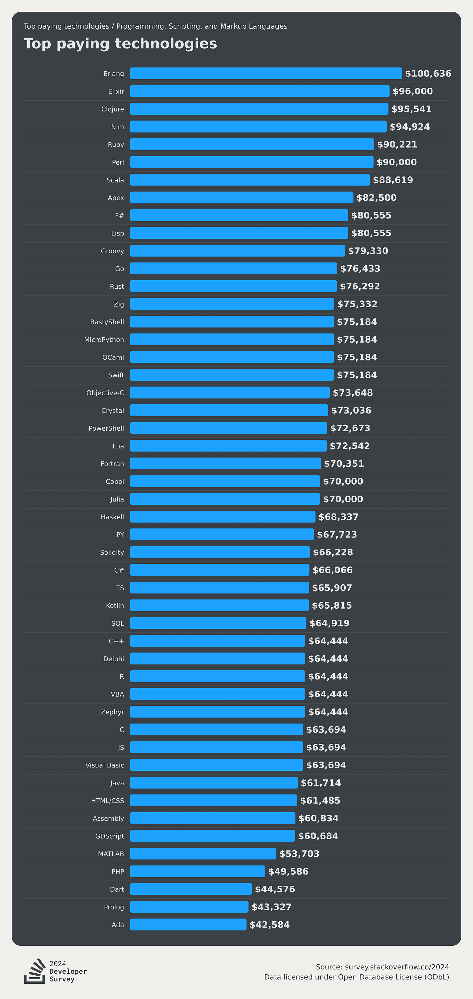](https://substackcdn.com/image/fetch/$s_!_7Xx!,f_auto,q_auto:good,fl_progressive:steep/https%3A%2F%2Fsubstack-post-media.s3.amazonaws.com%2Fpublic%2Fimages%2F9d6951c0-1fb4-4222-a109-a4236764f365_2400x5070.png)Top paying technologies

### 4. 76% of all respondents use or plan to use AI tools in their work

81% agree that increased productivity is the most significant benefit developers associate with AI tools. This is especially true of developers learning to code (71%). Few professional programmers emphasized this benefit of artificial intelligence in their work (61%).

[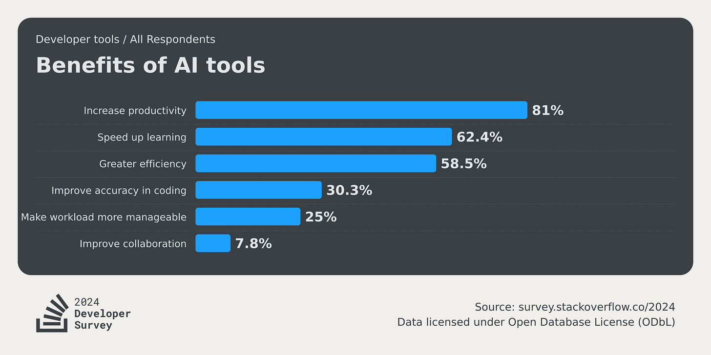](https://substackcdn.com/image/fetch/$s_!tr-x!,f_auto,q_auto:good,fl_progressive:steep/https%3A%2F%2Fsubstack-post-media.s3.amazonaws.com%2Fpublic%2Fimages%2F10736926-d1b4-47d6-ba15-e1d8baa23f1d_2400x1200.png)Benefits of AI tools

Nearly half (45%) of professional developers believe that AI tools could be better at solving complex tasks. Therefore, developers mostly use AI tools to write code (82%), and those interested but have yet to start using AI tools are primarily curious about code testing (46%). Experienced ones leave the initial code-writing phase to artificial intelligence but understand that testing is a complex process that is best left to traditional methods.

[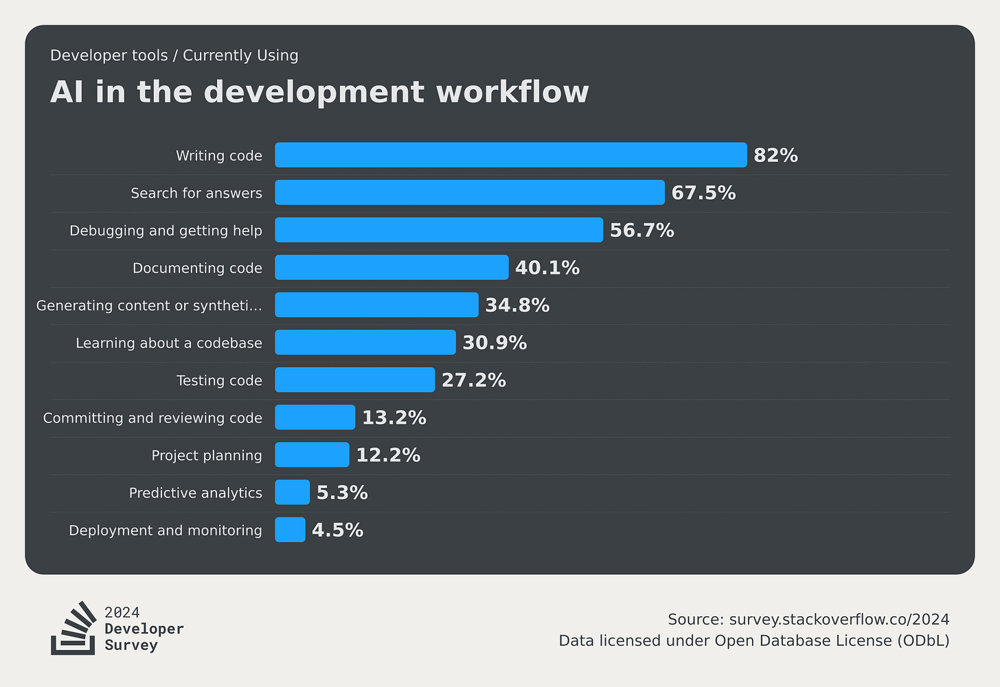](https://substackcdn.com/image/fetch/$s_!kzju!,f_auto,q_auto:good,fl_progressive:steep/https%3A%2F%2Fsubstack-post-media.s3.amazonaws.com%2Fpublic%2Fimages%2F4fdbb1ba-2fa7-47f1-9338-ca86fd30b396_2400x1650.png)AI in the development workflow

70% of professional developers do not see artificial intelligence threatening their work.

### 5. The majority of respondents actively hate their job but like to code outside of work

According to the workplace satisfaction survey results, as many as **80% of professional programmers are unhappy**. One in three respondents actively hates their job, while almost half survive in survival mode. That leaves only 20% who claim to be somewhat happy. Although developers have good salaries, plenty of free time, and often the ability to work remotely, many still need to be satisfied.

[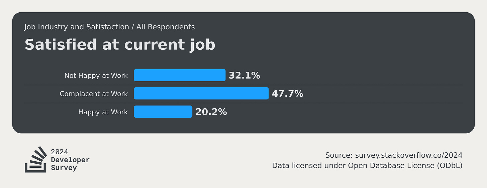](https://substackcdn.com/image/fetch/$s_!GETe!,f_auto,q_auto:good,fl_progressive:steep/https%3A%2F%2Fsubstack-post-media.s3.amazonaws.com%2Fpublic%2Fimages%2F2a24fd2f-b338-49a2-8143-dc52ea6fa208_2400x930.png)Job satisfaction

62% percent of developers report having a **technical debt issue**, which is twice as many as the second and third most annoying issues for developers, which include complicated tech stacks for deployment and development. Another important issue is **the complexity of the tech stack**for build and deployment (also have more than 60% of respondents together).

[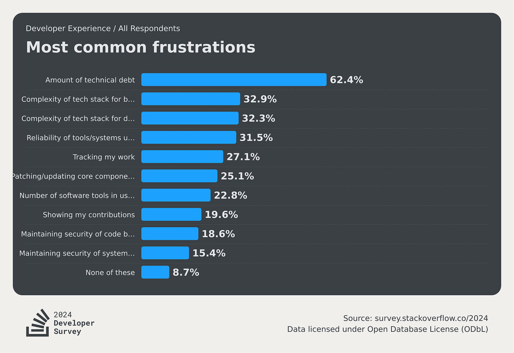](https://substackcdn.com/image/fetch/$s_!ANF7!,f_auto,q_auto:good,fl_progressive:steep/https%3A%2F%2Fsubstack-post-media.s3.amazonaws.com%2Fpublic%2Fimages%2F41c46d97-a492-4f3d-8c98-5f02afa75a34_2400x1650.png)Technical debt is the top frustration at work for professional developers.

Check here how to deal with Technical Debt:
[
Tech World With Milan NewsletterHow To Deal With Technical DebtIn this issue, we are going to talk about the following…Read more3 years ago · 32 likes · 1 comment · Dr Milan Milanović](https://newsletter.techworld-with-milan.com/p/how-to-deal-with-technical-debt?utm_source=substack&utm_campaign=post_embed&utm_medium=web)
Another important negative issue in developer life is **hustle culture**. The industry is heavily pressured to meet deadlines, and developers are often under pressure to complete tasks quickly to earn as much as possible. Increased pressure in the workplace **leads to unrealistic expectations and burnout**. Also, many administrative tasks, such as **meetings** and **unrealistic expectations from management**, contribute to this satisfaction.

Also, what is interesting is that **more than 68% of developers like to code outside of work as a hobby**.

[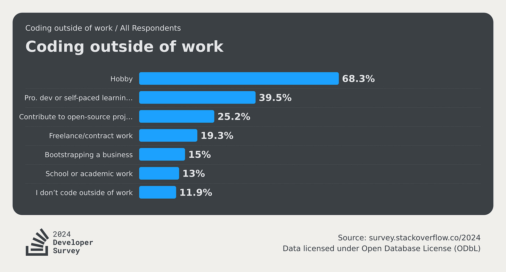](https://substackcdn.com/image/fetch/$s_!nlqo!,f_auto,q_auto:good,fl_progressive:steep/https%3A%2F%2Fsubstack-post-media.s3.amazonaws.com%2Fpublic%2Fimages%2Fbcee65d1-8bbc-40c0-8c11-838599211fcf_2400x1290.png)Coding outside of work

---

## ThoughtWorks Technology Radar - Volume 30.

In the latest [Technology Radar](https://www.thoughtworks.com/radar) released last week by ThoughtWorks, we saw different themes emerging:

1. **Open-ish source licenses.** A third of many open-source licensed software become overnight commercial ones (mostly in the AI space). As it is not a problem to pay, the problem is that widely used tools are suddenly put behind a paywall, especially with ecosystems around them. Also, some other projects say they are open-source, but you get fundamental capabilities only after paying for a subscription.
2. **AI-assisted software development teams.** As they have already written about AI tools like GitHub Copliot, Codium AI, Aide, and others, they believe that the pragmatic use of AI and derived tools can gradually benefit all aspects of software development. Yet, some of these tools can introduce new software quality and security risks.
3. **Engineering architecture patterns for LLMs.** Particular design patterns are beginning to emerge in response to the increasing use of large language models (LLMs) to serve everyday contexts. They discussed NeMo Guardrails, which allows developers to build governance policies around LLM usage, and tools such as Langfuse, which allow observability leading into LLM output.
4. **Dragging PRs closer to proper CI.** Many teams still ignore the CI part of CI/CD because they are in situations where PRs are a must. To alleviate the pains of the PR process, they analyzed some tools, such as gitStream, and some techniques, such as stacked diffs.

They also recently shared some macro trends in the tech industry:

➡️ **Online developer tools**. Online developer tools are becoming more widely available, but developers are also growing concerned about what they give up when they use them, primarily their data.

➡️ **Monoliths rise again**. While microservices have increased interest in more complex architectures, such as even-driven architectures, whose flexibility is worth the complexity, a strong trend is returning to (modular) monoliths.

➡️ **Rethinking infrastructure as code**. Although IaC has been around for some time, new approaches to managing it exist, such as Winglang, which offers high-level abstractions over specific parts of your infrastructure.

➡️ **Rust everywhere**. Security issues are causing many problems in the industry, and memory safety plays a significant role in dealing with those issues. Using a memory-safe programming language, such as Rust, can prevent them. Also, it is highly performant.

[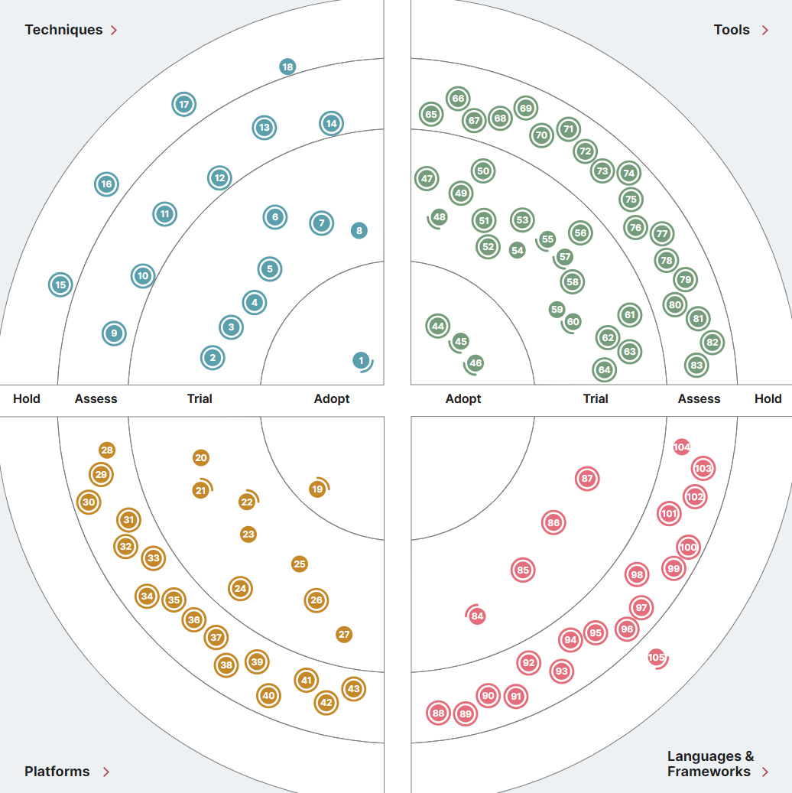](https://substackcdn.com/image/fetch/$s_!j3El!,f_auto,q_auto:good,fl_progressive:steep/https%3A%2F%2Fsubstack-post-media.s3.amazonaws.com%2Fpublic%2Fimages%2F8bcdc3ed-d979-4492-95c8-bf15ef977452_1036x1037.png)The Radar

In more detail:

**Techniques:**

📌 **Adopt**: Retrieval-augmented generation (RAG)

📌 **Trial**: Automatically generate Backstage entity descriptors, Combining traditional NLP with LLMs, Continuous compliance, and Text to SQL.

**📌** **Assess**: AI team assistants, Graph analysis for LLM-backed chats, LLM-backed ChatOps, Using GenAI to understand legacy codebases

📌 **Hold**: Broad integration tests, Overenthusiastic LLM use

**Tools**:

📌 **Adopt**: Conan, Kaniko, Karpenter

📌 **Trial**: AWS CUDOS, GitHub Copilot, Gradle Version Catalog, Microsoft SBOM tool

📌 **Assess**: aider, Codium AI, LinearB

**Platforms:**

📌 **Adopt**: CloudEvents

📌 **Trial**: Arm in the cloud, Azure Container Apps, Azure OpenAI Service, Pulumi

📌 **Assess**: Bun, DataOS, IcePanel

**Languages and frameworks:**

**📌** **Trial**: Astro, DataComPy

📌 **Assess**: Crabviz, LiteLLM, MojoThe Radar

---

## Software Architecture InfoQ Trends Report - April 2024.

In the latest report by InfoQ, we got some new insights on [Software Architecture and Design](https://www.infoq.com/articles/architecture-trends-2024/):

1. **Cell-based architecture**. An "everyone talks to everyone" strategy is frequently used while deploying microservice architectures using services. Routing restrictions imposed by cell-based design favor services calling other services inside the same cell, frequently an availability zone. The decreased latency can result in significant cost savings and improved performance. Many companies like Roblox, Slack, and DoorDash have implemented this.
2. **Privacy engineering**. Here, the innovation moves from a reactive approach—such as complying with GDPR, CCPA, or other legal obligations—to a proactive one where user and data security are prioritized during the design process. DoorDash is a prime example; it intentionally conceals or deletes personal information, including addresses, once a delivery has been made.
3. **Socio-technical architecture.** There are several ideas here. One aspect concerns the role of architects, where architecture is a team sport, and anyone can make architectural decisions. The other covers ideas such as Team Topologies and Conway's Law.
4. **Platform architecture.** Many businesses provide tools to create platforms or assist with platform engineering, which indicates that technology has crossed the threshold and is becoming more widely used. On the other hand, significant innovation occurs at the nexus, where platform engineering influences architecture and system design, and architectural notions influence platform engineering. In a close connection, the platform changes to accommodate new architectures while architecture is influenced by what is accessible.
5. **Data-driven architecture.**The data within a system influences many design choices, so it can be challenging to spot distinct patterns that are broadly applicable. The data-driven architecture category embodies the transition of sophisticated analytical platforms from auxiliary, peripheral components to essential elements of transactional systems. For instance, near-real-time data and ML model event analysis influence other systemic behaviors.

[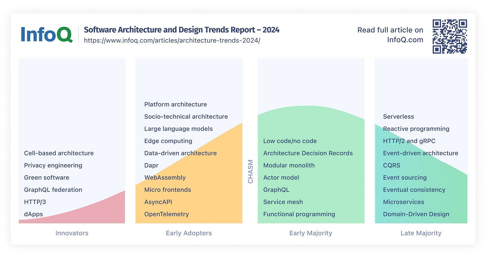](https://substackcdn.com/image/fetch/$s_!9I1D!,f_auto,q_auto:good,fl_progressive:steep/https%3A%2F%2Fsubstack-post-media.s3.amazonaws.com%2Fpublic%2Fimages%2F46a19729-c593-444a-aecb-e3be4b6028cf_2400x1270.jpeg)InfoQ Software Architecture and Design Trends Report - April 2024

---

### The Most Demanded Frontend Frameworks in 2023.

Recently, DevJobsScanner shared which frontend frameworks were in greater demand and which were best paid by analyzing actual job offers. [They studied](https://www.devjobsscanner.com/blog/the-most-demanded-frontend-frameworks/) about ~500K jobs from 1 November 2022 to 31 December 2024 from different sources (LinkedIn, Glassdoor, Dice, etc.).

Here are the results:

1. **React** is the most demanded frontend framework with 225k job offers.
2. **Angular** is in second place with 172k offers.
3. **Vue** is in third place with 48k offers

All others had less than 7.2K (Svelte, Solid.js, Alpine, Backbone, ...).

[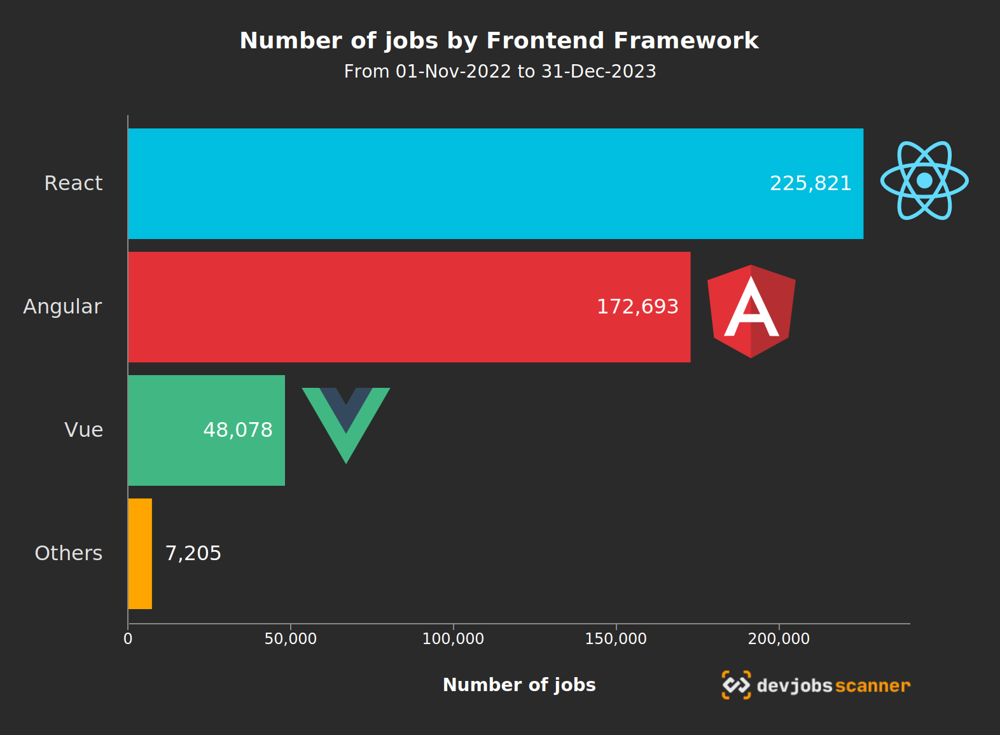](https://substackcdn.com/image/fetch/$s_!jw3_!,f_auto,q_auto:good,fl_progressive:steep/https%3A%2F%2Fsubstack-post-media.s3.amazonaws.com%2Fpublic%2Fimages%2F571ec122-c8d0-4bf2-87cd-43cb7762142d_1572x1156.svg)Number of jobs by Frontend Framework

If we look at the trends during this period, **Angular and React were quite close to each other month by month**. Suppose we compare it to 2022, where Angular was less in demand than React in 2023. they come closer.

[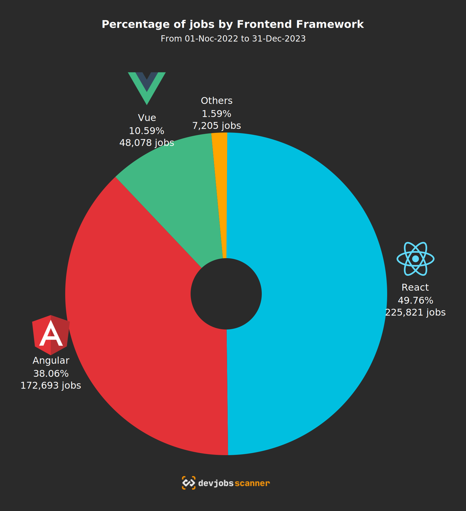](https://substackcdn.com/image/fetch/$s_!X2OX!,f_auto,q_auto:good,fl_progressive:steep/https%3A%2F%2Fsubstack-post-media.s3.amazonaws.com%2Fpublic%2Fimages%2F15c90274-1a8b-40d6-922f-ba8092d91f6e_1572x1720.svg)Percentage of jobs by Frontend Framework

Regarding the **job demand for these frameworks per country**, React dominates most countries. Still, some European countries, such as Switzerland, France, Spain, and Italy, have more job opportunities for Angular than React. In Switzerland, Angular jobs represent 65% of the front-end jobs. In Belgium, 59% of front-end job listings require Vue expertise.

[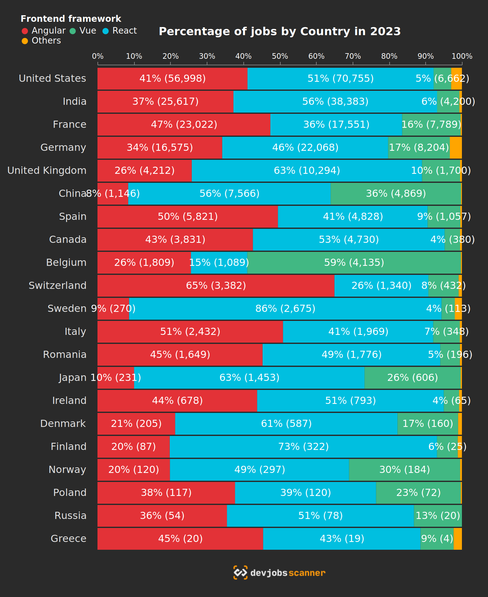](https://substackcdn.com/image/fetch/$s_!Ooi5!,f_auto,q_auto:good,fl_progressive:steep/https%3A%2F%2Fsubstack-post-media.s3.amazonaws.com%2Fpublic%2Fimages%2F89b48ebb-4984-4ae8-982c-4311583802eb_1572x1920.svg)Percentage of jobs by Country in 2023.

Comparing **salaries** for each one, the highest-paid frontend framework is React, with an average yearly pay of $116k. With annual earnings of $110k and $107k, respectively, Angular and Vue are ranked second and third.

[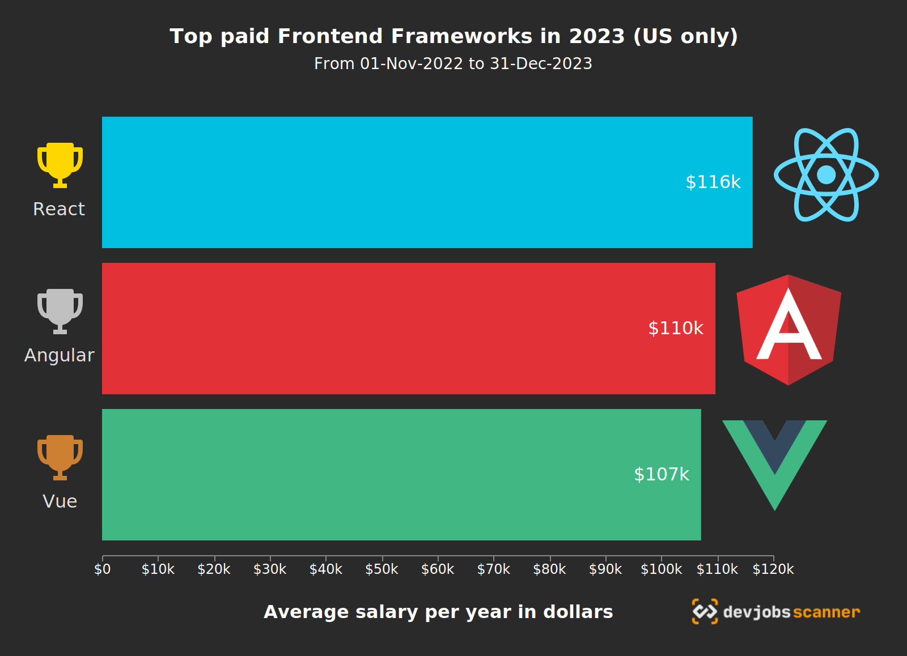](https://substackcdn.com/image/fetch/$s_!Om09!,f_auto,q_auto:good,fl_progressive:steep/https%3A%2F%2Fsubstack-post-media.s3.amazonaws.com%2Fpublic%2Fimages%2F7b190e10-31c1-41c5-8f24-eb56ddb5c568_1600x1158.svg)Top paid Frontend Frameworks in 2023. (for US)

---

## State of JavaScript 2023.

A few months ago, the results from the [2023 State of Javascript Survey](https://2023.stateofjs.com/en-US), which examined new trends and technologies in web development, were published. The poll, funded by Google and other partners and ran from November 22, 2023, to December 12, 2023, received 23,540 replies.

The highlights of the report are:

✅ The most adopted JavaScript syntax feature is **Nullish Coalescing**, followed by **Dynamic Import**.

[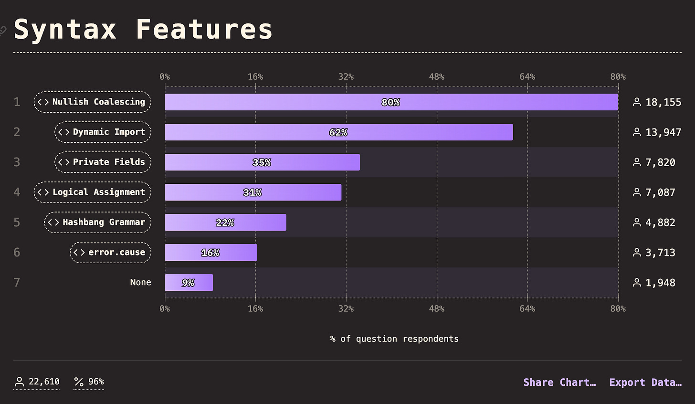](https://substackcdn.com/image/fetch/$s_!zANt!,f_auto,q_auto:good,fl_progressive:steep/https%3A%2F%2Fsubstack-post-media.s3.amazonaws.com%2Fpublic%2Fimages%2F891fc314-3240-4ac0-9cc1-164a1853ccbd_2080x1208.png)

✅ With 84% of respondents, **React leads the front-end framework category**. It is followed by Vue.js (52%), Angular (46%), and Svelte (25%), which is gaining traction.

✅ **Vite**, a local development server for modern web apps, took multiple prizes as the most adopted technology (+25% increase), with the highest retention (98% will use it again), and the most loved library (88% have a favorable opinion about it).

[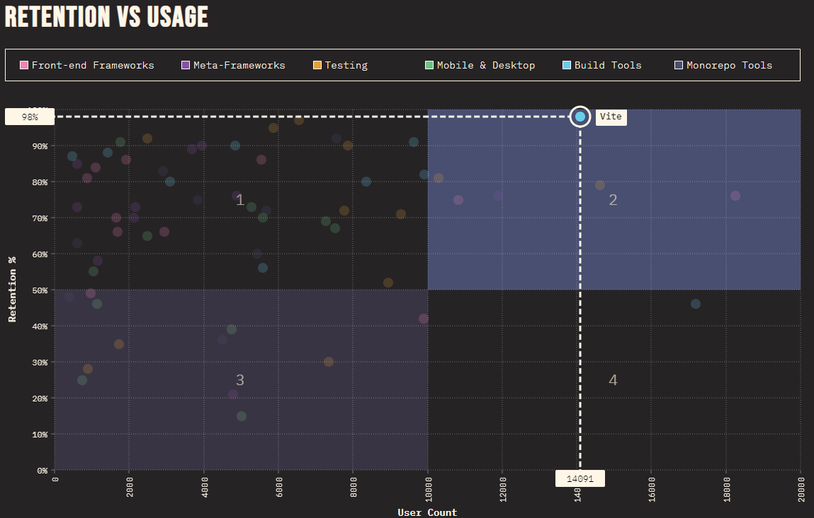](https://substackcdn.com/image/fetch/$s_!Bg9a!,f_auto,q_auto:good,fl_progressive:steep/https%3A%2F%2Fsubstack-post-media.s3.amazonaws.com%2Fpublic%2Fimages%2F2bcfaa6d-3216-4e13-9ded-62b78edad881_1149x733.png)Retention vs usage

✅ The winner among meta frameworks is **Next.js**, which offers server-side rendering and static website development for React-based web apps. Although they are becoming more popular, newcomers like Remix, Astro, and SvelteKit still only account for somewhat less than 20% of respondents when it comes to usage.

[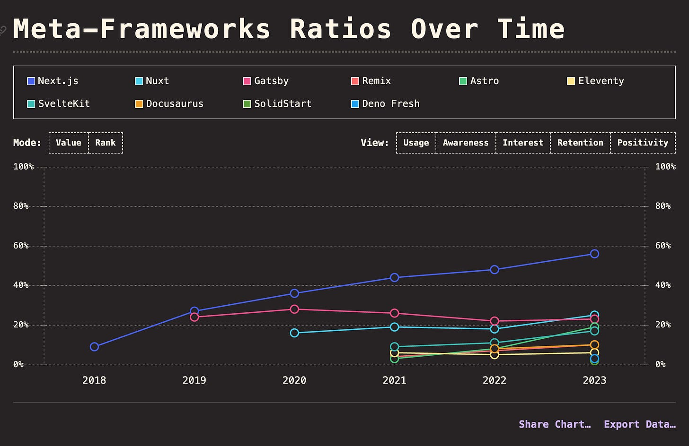](https://substackcdn.com/image/fetch/$s_!cMx_!,f_auto,q_auto:good,fl_progressive:steep/https%3A%2F%2Fsubstack-post-media.s3.amazonaws.com%2Fpublic%2Fimages%2F3a5052d9-1e81-4afd-99da-8f423e5aceac_2080x1348.png)Meta-framework ratios over time

✅ With no tool being used by more than 40% of respondents, the mono repo tools are a varied collection of solutions that appear to be evenly utilized. Except for **ppm**, where retention has remained steady, interest in and use of the various tools are generally falling.

[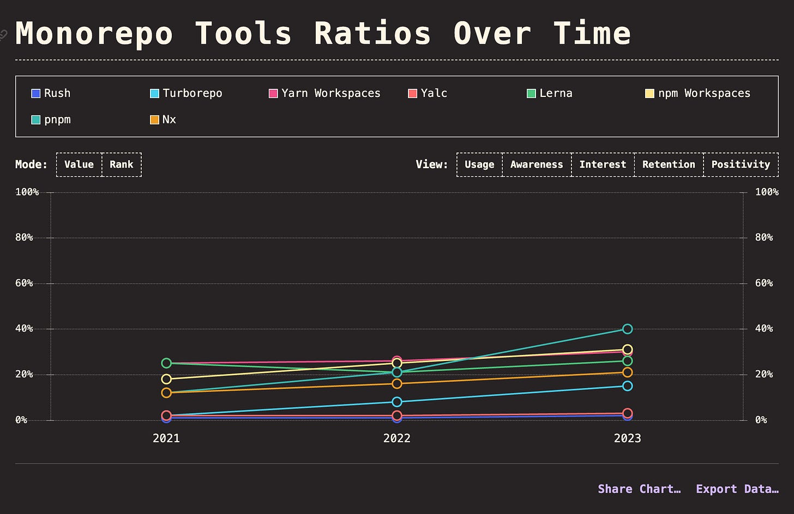](https://substackcdn.com/image/fetch/$s_!4BYU!,f_auto,q_auto:good,fl_progressive:steep/https%3A%2F%2Fsubstack-post-media.s3.amazonaws.com%2Fpublic%2Fimages%2F0d36d34d-6849-4317-8aab-c87bb5ffd48d_2080x1348.png)Mono repo Tools ratios over time

✅ **Express** is the most often used option for those utilizing JavaScript on the backend (73% of responses), indicative of its enduring appeal and robust ecosystem. Nest is now at 29%.

[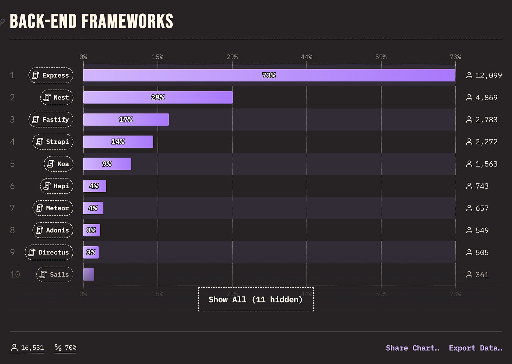](https://substackcdn.com/image/fetch/$s_!u9gx!,f_auto,q_auto:good,fl_progressive:steep/https%3A%2F%2Fsubstack-post-media.s3.amazonaws.com%2Fpublic%2Fimages%2F99422538-f55a-4332-afcc-20dcf27d99b5_2080x1480.png)Backend frameworks

✅ Out of all the JavaScript runtimes, **94% of respondents choose Node.js**. With 353 mentions, Bun, at 22%, received the most write-ins.

✅ **Python** is mainly used together with JavaScript (44%), assumed on the backend side, followed by PHP (31%) and Java (27%).

[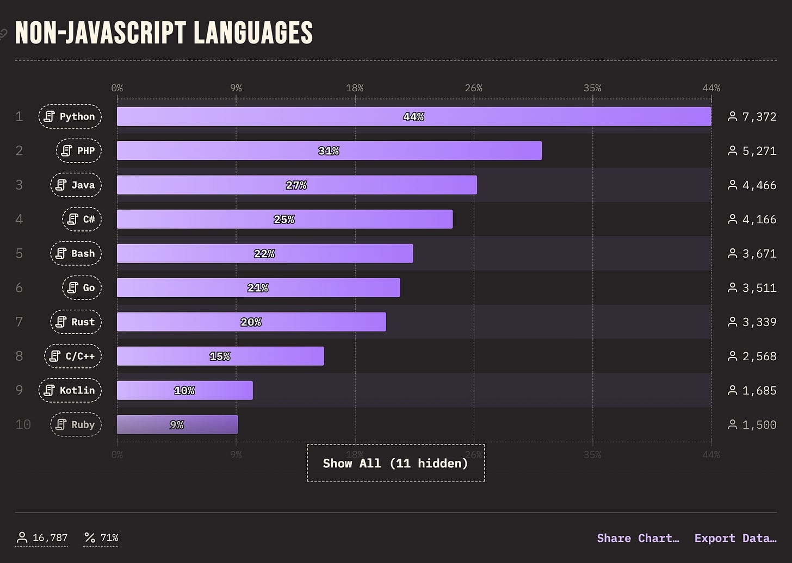](https://substackcdn.com/image/fetch/$s_!aRXf!,f_auto,q_auto:good,fl_progressive:steep/https%3A%2F%2Fsubstack-post-media.s3.amazonaws.com%2Fpublic%2Fimages%2Fb4cd0ae2-6b41-4960-9b8e-b86a970d74be_2080x1480.png)Non-JavaScript languages

✅ **TypeScript is rising**, as 32% of respondents say they use 100% TypeScript, while the second-place group uses 75% TypeScript and 25% JavaScript.

[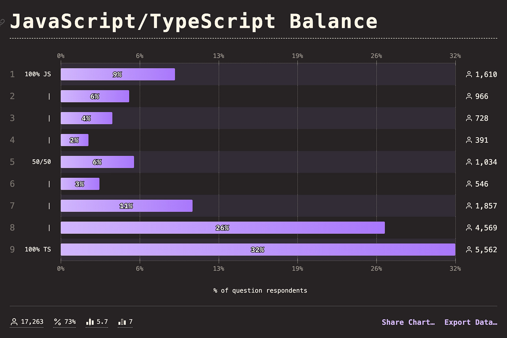](https://substackcdn.com/image/fetch/$s_!mdrY!,f_auto,q_auto:good,fl_progressive:steep/https%3A%2F%2Fsubstack-post-media.s3.amazonaws.com%2Fpublic%2Fimages%2Fee8ed440-52cf-483d-9466-c0e3e6938e82_2080x1388.png)JavaScript/TypeScript balance

---

## More ways I can help you

1. **[Patreon Community](https://www.patreon.com/techworld_with_milan)**: Join my community of engineers, managers, and software architects. You will get exclusive benefits, including all of my books and templates (worth 100$), early access to my content, insider news, helpful resources and tools, priority support, and the possibility to influence my work.
2. **[Promote yourself to 33,000+ subscribers](https://newsletter.techworld-with-milan.com/p/sponsorship-of-tech-world-with-milan)**by sponsoring this newsletter. This newsletter puts you in front of an audience with many engineering leaders and senior engineers who influence tech decisions and purchases.
3. **1:1 Coaching:** [Book a working session with me](https://newsletter.techworld-with-milan.com/p/coaching-services). 1:1 coaching is available for personal and organizational/team growth topics. I help you become a high-performing leader 🚀.

---
[https://newsletter.techworld-with-milan.com/p/developer-hate-their-job-but-like#poll-199873](https://newsletter.techworld-with-milan.com/p/developer-hate-their-job-but-like#poll-199873)Loading...
---

Thanks for reading Tech World With Milan Newsletter! Subscribe for free to receive new posts and support my work.