# Mastering the Art of Software Architecture Documentation

*By using arc42 format and C4 model.*

In this newsletter, we will try to understand:

- **Why software architecture documentation is necessary**
- **How to organize and visualize such documentation**
- **How to store it in the repository close to the code, and,**
- **How can it be automated and published so that non-technical people can view it**

So, let’s dive in.

---

## Why do we need to document software architectures?

Software architecture is the process of designing and organizing the overall structure of software systems to satisfy specific functional and non-functional requirements. It **provides a high-level view of the software system that guides developers during implementation**. It also represents a framework for communication and collaboration among stakeholders, such as developers, project managers, and business analysts, to ensure everyone is working towards the same goals and objectives.

Documenting software architectures ensures that **crucial architectural decisions, constraints, and rationales are captured and communicated effectively** and also facilitates a shared understanding among stakeholders, including developers, architects, project managers, and end-users. Documentation is a central reference point that records architectural decisions, which enables knowledge transfer and consistent implementation across the software development lifecycle (SDLC).

One of the most critical aspects of documenting software architecture is that it **reveals the goals and intentions behind the system, something the code alone cannot convey**.

> *While code is the implementation of the system, it often does not tell the whole story.*

The primary goals, design principles, and strategic decisions that guided the development process are typically not evident from the codebase. **This lack of visibility can lead to misunderstandings and misaligned efforts, especially as the system evolves or new team members come on board.** Documentation fills this gap by providing context and clarity, ensuring the system's goals and design philosophy are understood and maintained over time.

Good software documentation enables us to:

- **Align everyone's understanding of a system**
- **Maintaining the system properly**
- **Onboarding new people fast**

Yet, we see the lack of architectural documentation on many projects, marked as “*we don’t have time to do it.” sometimes, people are unclear about* how to approach architectural documentation, what to put inside, and how.

With architectural documentation, we don’t want to write books, which are hard to maintain tomorrow but to be pragmatic. We wish to state only those crucial concepts for our project now and in the future.

[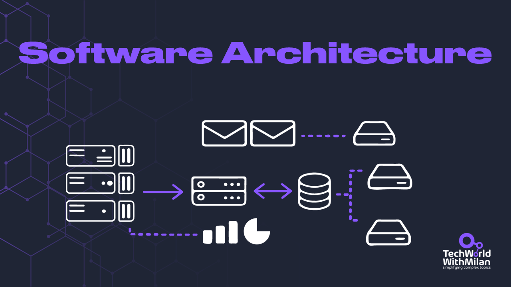](https://substackcdn.com/image/fetch/$s_!ZBXg!,f_auto,q_auto:good,fl_progressive:steep/https%3A%2F%2Fsubstack-post-media.s3.amazonaws.com%2Fpublic%2Fimages%2Fd0061714-037b-4ab7-a119-47f3871f3027_1280x720.png)

To drive your architectural decisions by using the simple framework, check this text:
[
Tech World With Milan NewsletterDriving architectural decisions with a simple decentralized frameworkThis week’s issue gives you a decentralized framework for driving architectural decisions using simple practices, supporting a high-documentation / low-meeting culture. So, let’s dive in…Read more2 years ago · 21 likes · Dr Milan Milanović](https://newsletter.techworld-with-milan.com/p/driving-architectural-decisions-with?utm_source=substack&utm_campaign=post_embed&utm_medium=web)
## How to document software architectures?

One way to do it is using an **[arc42 documentation template](https://arc42.org/)**. It provides a simple and concise way to document software architecture that all stakeholders understand. Dr. Gernot Starke and Dr. Peter Hruschka created the arc42 template, which is widely used in the software industry.

**[The arc42](https://arc42.org/)** answers the following two questions:

- **What should you document/communicate about your architecture?**
- **How should you document/communicate?**

It enables us to:

✅ By organizing documentation into distinct sections, arc42 helps **separate different concerns.** This makes managing and navigating the documentation easier, enhancing clarity and readability.

✅ **arc42 is a widely recognized standard in the industry**, with extensive community support and resources. This makes it easier to find examples, tools, and guidance on how to use the template effectively.

✅ The structured approach of arc42 **improves communication among team members and stakeholders**. By providing a common framework, it ensures that everyone has a consistent understanding of the system’s architecture.

[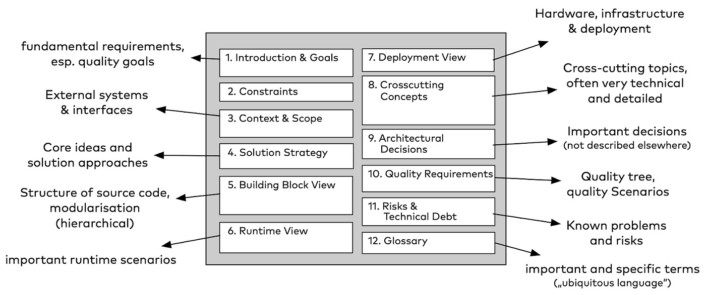](https://substackcdn.com/image/fetch/$s_!SH_C!,f_auto,q_auto:good,fl_progressive:steep/https%3A%2F%2Fsubstack-post-media.s3.amazonaws.com%2Fpublic%2Fimages%2Fd7c2e043-d002-46fa-98c7-015f40c171da_1400x587.png)arc42 template structure (credits: Dr. Gernot Starke)

The structure of an arc42 consists of (none is obligatory):

1. **Introduction:**This section overviews the software system, its purpose, and the stakeholders involved. It lists the software system's quality requirements, such as performance, security, and scalability (max five).
2. **Constraints:** This section lists any constraints that may impact the design of the software system, such as legal, regulatory, or organizational constraints.
3. **Context view:** This section describes the external factors that influence the software system, such as external interfaces, hardware, or the environment.
4. **Solution strategy:** A summary of the underlying choices and problem-solving tactics influencing the architecture. Some examples include technology, top-level breakdown, and methods for achieving high-quality goals.
5. **Building block view:** This section shows the high-level code structure of the system in the form of a diagram.
6. **Runtime view:** It shows the behavior of one of several building blocks in the form of essential use cases.
7. **Deployment view:** This section describes how the software system is deployed, including the hardware, software, and networking components.
8. **Cross-cutting concepts:** This section describes the crosscutting concepts, such as security, logging, and exception handling, that are used throughout the software system.
9. **Decision log:** This section provides a record of the significant design decisions made during the development of the software system.
10. **Quality requirements:** A list of quality requirements, described as scenarios.
11. **Risks:** What are known technical risks and problems in the system?
12. **Glossary**: Important terms used when discussing the system.

[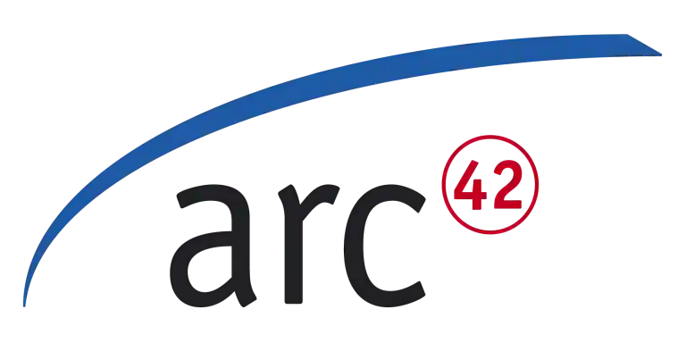](https://substackcdn.com/image/fetch/$s_!uSnZ!,f_auto,q_auto:good,fl_progressive:steep/https%3A%2F%2Fsubstack-post-media.s3.amazonaws.com%2Fpublic%2Fimages%2F06c56c83-1a9e-4c77-bc93-1b0e0cfe21f9_768x384.png)

Also, we should mention some **disadvantages** of the arc42 template:

❌ The comprehensive nature of arc42 can lead to significant documentation, which might be seen as overhead. **This level of detail might be perceived as excessive for smaller projects and teams**.

❌ **There is a risk of over-documentation**, where the focus shifts from building the system to documenting every detail.

❌ Keeping the documentation current can become a **maintenance issue**, especially in rapidly changing environments. If not appropriately maintained, it can quickly become outdated and lose value.

**Arc42** provides **a variety of tools** to assist you in completing your document:

- **[arc42 Documentation Template](https://arc42.org/download)**. Direct link to download the arc42 documentation template, available in various formats such as AsciiDoc, Markdown, and DocBook.
- **[arc42 by Real-World Example](https://arc42.org/examples)**. A collection of real-world examples using the arc42 template to document software architectures.
- **[Software Architecture Documentation with arc42 (Book).](https://leanpub.com/arc42byexample)** A comprehensive guidebook on how to use the arc42 template for documenting software architectures, written by the creators of arc42.

[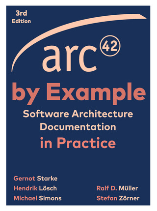](https://substackcdn.com/image/fetch/$s_!D9tH!,f_auto,q_auto:good,fl_progressive:steep/https%3A%2F%2Fsubstack-post-media.s3.amazonaws.com%2Fpublic%2Fimages%2Fc85d4374-40aa-4dde-ad79-d31eb09835c4_320x429.png)[arc42 by Example](https://leanpub.com/arc42byexample)

## How to visualize software architecture?

Along with the structure of architecture documentation, we need a way to describe different components of a system. One of the preferred ways to visualize software architecture is the **[C4 model](https://c4model.com/)**, developed by software architect and author [Simon Brown](https://simonbrown.je/). The C4 model examines a software system's static structures, containers, components, and code. Individuals use the software programs we create.

The C4 model consists of four levels of abstraction, which are represented by four different types of diagrams:

### 1. Context (System Context diagram)

This diagram shows the system in context, providing an overview of the system and its environment. The system here has the highest level of abstraction, and it shows the system under consideration as a box in the center, surrounded by its users and other systems that interact with it. These diagrams help provide a big-picture overview.

[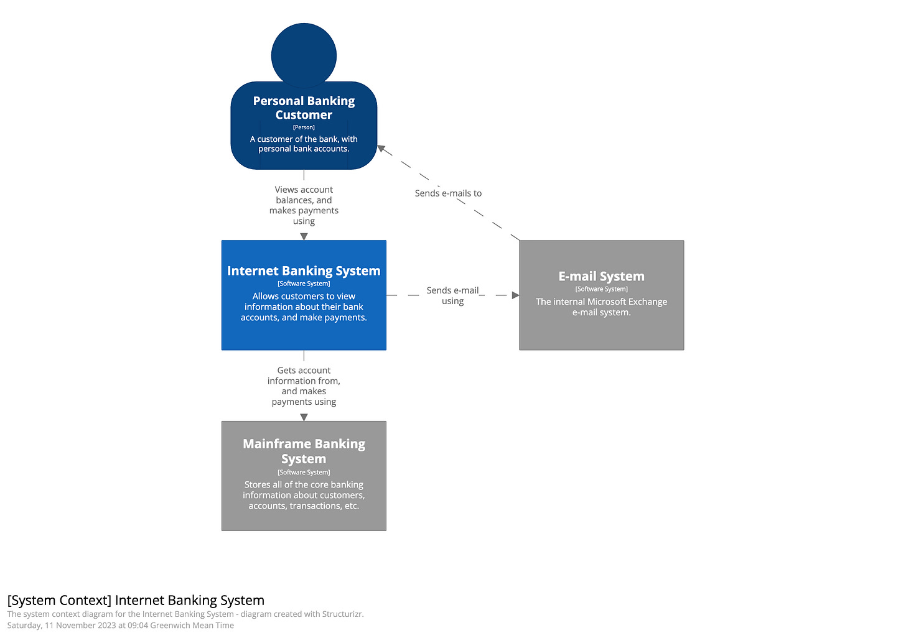](https://substackcdn.com/image/fetch/$s_!RTw8!,f_auto,q_auto:good,fl_progressive:steep/https%3A%2F%2Fsubstack-post-media.s3.amazonaws.com%2Fpublic%2Fimages%2Fba27630f-0fb3-4e50-9d65-15c417262f07_2480x1748.png)System context diagram ([source](https://c4model.com/#SystemContextDiagram)).

### 2. Containers (Container diagram)

This diagram shows the high-level components or services within the system and how they are connected. It shows each component as a box with its internal details abstracted away, separately deployable or executable. Containers can represent APIs, databases, file systems, etc.

[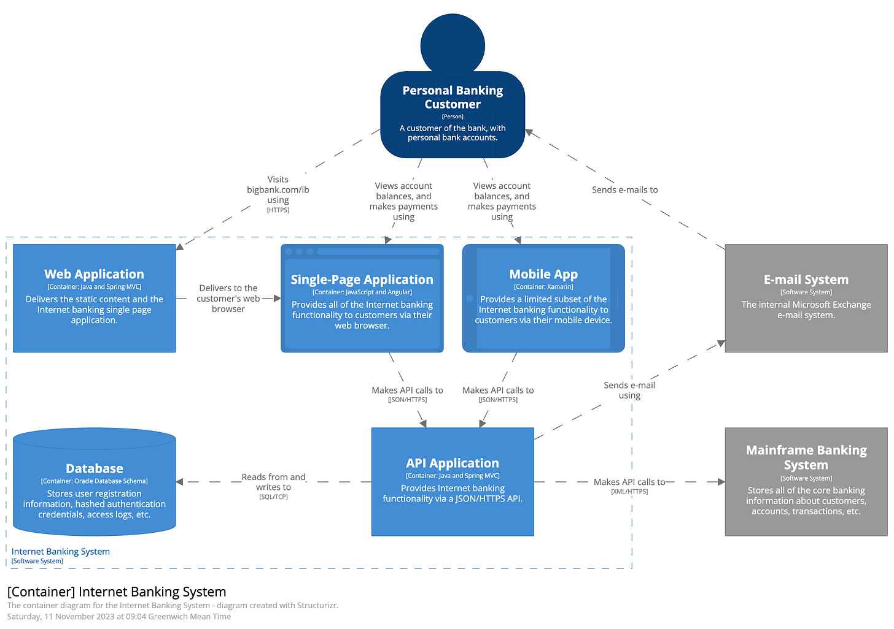](https://substackcdn.com/image/fetch/$s_!f9zA!,f_auto,q_auto:good,fl_progressive:steep/https%3A%2F%2Fsubstack-post-media.s3.amazonaws.com%2Fpublic%2Fimages%2F6e4ec14d-e102-48f4-a8de-d14bed5b6ef2_2480x1748.png)Container diagram ([source](https://c4model.com/#ContainerDiagram))

### 3. Components (Component diagram)

This diagram shows the internal components of a container and how they interact with each other. It allows us to visualize abstractions in our codebase. For example, in C#, it is an implementation class behind some interface.

[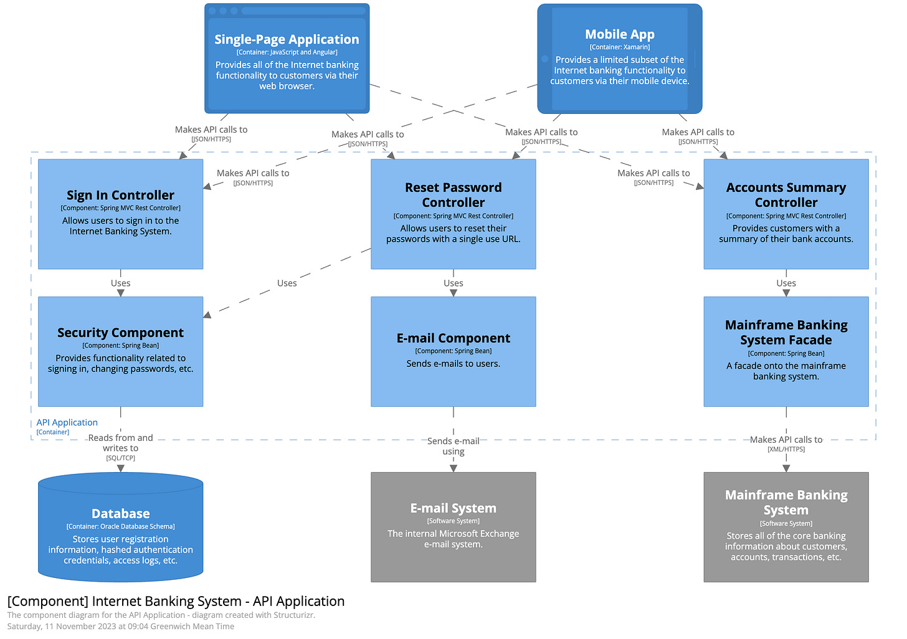](https://substackcdn.com/image/fetch/$s_!rttw!,f_auto,q_auto:good,fl_progressive:steep/https%3A%2F%2Fsubstack-post-media.s3.amazonaws.com%2Fpublic%2Fimages%2Fe6da962e-ae5f-4bcd-99a6-dd7b82d4cd0d_2480x1748.png)Component diagram ([source](https://c4model.com/#ComponentDiagram))

### 4. Code (Code diagram)

This diagram shows the detailed structure of a single component or module, including its classes and their relationships. Notations such as UML or Entity Relationship models can be used for this diagram.

[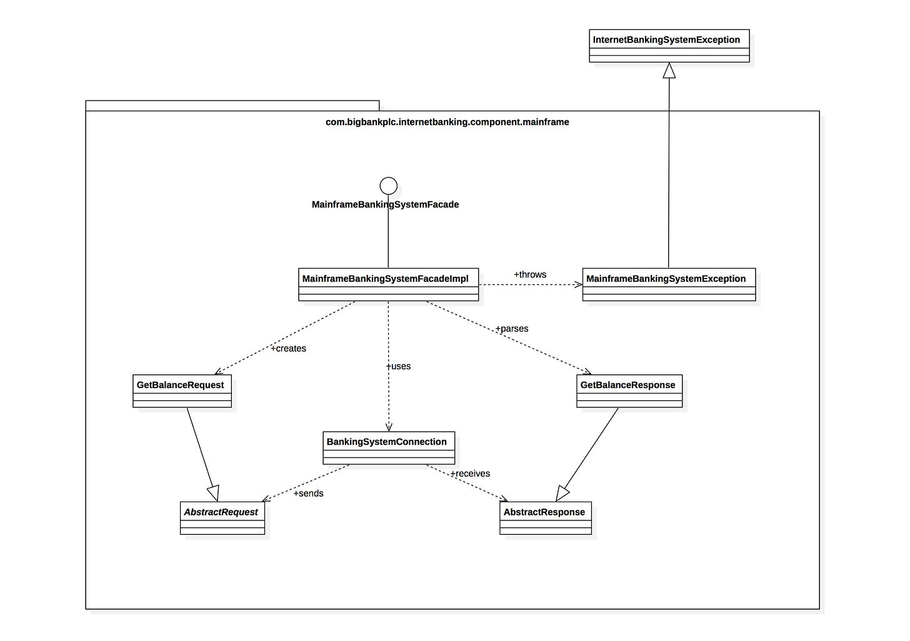](https://substackcdn.com/image/fetch/$s_!khA1!,f_auto,q_auto:good,fl_progressive:steep/https%3A%2F%2Fsubstack-post-media.s3.amazonaws.com%2Fpublic%2Fimages%2F97058f5a-5de1-46dc-ba3c-6ada60ecf940_2480x1748.png)Code diagram ([source](https://c4model.com/img/class-diagram.png))

Most teams should, at the very least, **produce and keep up-to-date context and container diagrams for their software system.** If they are helpful, component diagrams can be made, but you'll need to figure out how to automate changes to these diagrams for long-term documentation needs.

A critical aspect of the C4 model is that we can use it with **architecture as a code approach**. The main advantages of this approach are:

****✅ **Version control.** The primary advantage of the diagram-as-code approach is the ability to use version control systems like Git. This allows teams to track changes to diagrams over time, ensuring a clear history of modifications.

****✅ **Consistency**. Creating diagrams with code ensures that all visual representations of the architecture comply with a consistent style and format. This standardization reduces misunderstanding and enhances readability, making it easier for all team members to understand the diagrams.

✅ **Automation**. Such diagrams can be automatically generated and updated, significantly reducing manual effort and minimizing errors. This automation is the most useful when integrated into continuous integration and continuous deployment (CI/CD) pipelines, ensuring that diagrams are always current with the latest changes in the codebase.

To use the C4 model with this approach, you can use **[Structurizr DSL](https://www.structurizr.com/)**. It is a lightweight textual language used to create software architecture models, which allows for defining architecture in a structured, code-like format.

The basic syntax of Structurizr is the following:

- **Workspace:**The top-level element that contains your model and views.
- **Model:**Define your architecture's people, software systems, containers, components, and relationships. Syntax elements that are included are: `person`, `softwareSystem`, `container`, `component`, and relationship arrows (`->`).
- **Views:**Create different perspectives of your model, such as system context, container, and component views. Syntax elements used are: `systemContext`, `containerView`, `componentView`, `include`, `autolayout`.
- **Styles:**Customize the appearance of elements to enhance readability. Syntax elements: `element`, `background`, `color`, `shape`.
- **Themes:**Apply predefined visual styles to your diagrams (`theme)`.

The syntax of [StructurizrDSL](https://docs.structurizr.com/dsl) is shown in the image below (on the left) and the generated diagram (on the right).

[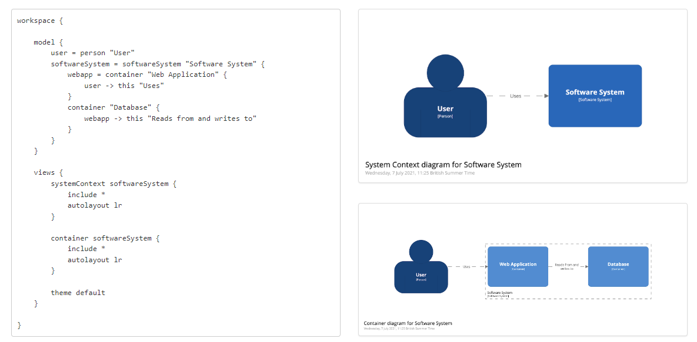](https://substackcdn.com/image/fetch/$s_!Dd1R!,f_auto,q_auto:good,fl_progressive:steep/https%3A%2F%2Fsubstack-post-media.s3.amazonaws.com%2Fpublic%2Fimages%2Fcd701b22-2e63-4398-b6a3-aff731bac415_1185x583.png)Structurizr DSL ([source](https://www.structurizr.com/))

To learn more about other architecture as code tools, check the following text:
[
Tech World With Milan NewsletterSoftware Architecture As Code ToolsWe’re seeing more and more tools that enable you to create software architecture and other diagrams as code. The main benefit of using this concept is that the majority of the diagrams as code tools can be scripted and integrated into a built pipeline for generating automatic documentation…Read more3 years ago · 11 likes · Dr Milan Milanović](https://newsletter.techworld-with-milan.com/p/software-architecture-as-code-tools?utm_source=substack&utm_campaign=post_embed&utm_medium=web)
Note that the C4 model has some **disadvantages**, too:

❌ While the C4 model simplifies complex architectures into four levels of abstraction, understanding and effectively using the model can still require a **steep learning curve**.

❌ The C4 model might lead to **over-simplifying certain aspects of the architecture**, such as all necessary details about interactions, dependencies, or cross-cutting concerns (e.g., security, performance) at each level.

Some **additional resources** to learn more about the C4 model:

- [C4 model](https://c4model.com/).
- [Structurizr](https://docs.structurizr.com/).
- “[The C4 model for visualizing software architecture](https://leanpub.com/visualising-software-architecture)” book by Simon Brown.
- “[Software Architecture for Developers](https://leanpub.com/software-architecture-for-developers)” book by Simon Brown.

If you like presentations more, check this one from Simon Brown on NDC Oslo 2023.

Additionally, you can check the book “**[Documenting Software Architectures: Views and Beyond](https://amzn.to/3xjIUXx)**” by Paul Clements et al., which offers a comprehensive overview of software architecture documentation approaches. Also, check “[Docs for Developers](https://amzn.to/3VjYri8)” and “[Docs like Code](https://amzn.to/3Vk1qHa)” books.

[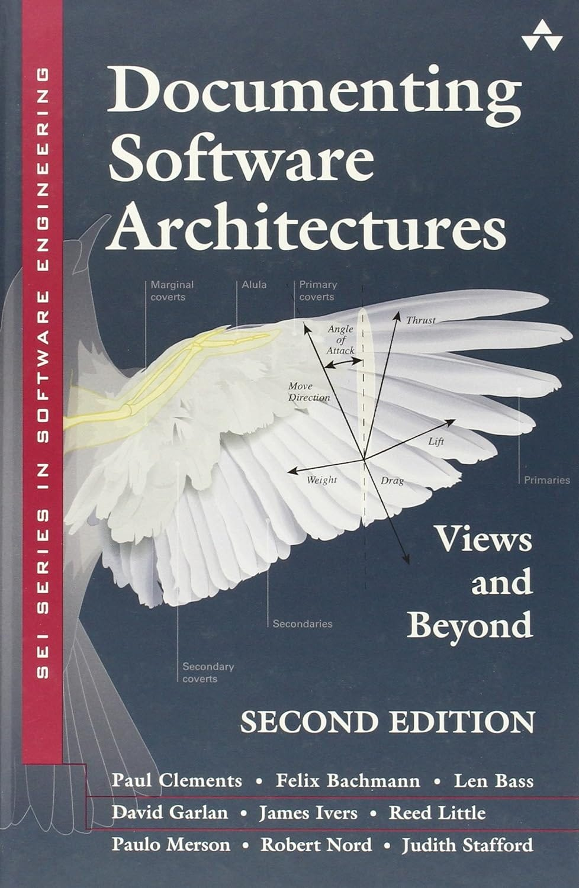](https://amzn.to/3xjIUXx)“[Documenting Software Architectures: Views and Beyond](https://amzn.to/3xjIUXx)” book

## How to use the arc42 template with the C4 model

Now that we know how to use the arc42 template and what the C4 model is, we can use them together by mapping certain sections of the arc42 template to some C4 diagrams.

Here is how we can use them together:

- **Context Diagram:** Include in arc42 Section 3 (Context and Scope).
- **Container Diagram:** Include in arc42 Section 5 (Building Block View, Level 1).
- **Component Diagram:** Include in arc42 Section 5 (Building Block View, Level 2).
- **Class Diagram:** Include in arc42 Section 5 (Building Block View, Level 3).
- **Deployment Diagram**: Include in arc42 Section 7 (Deployment View).

[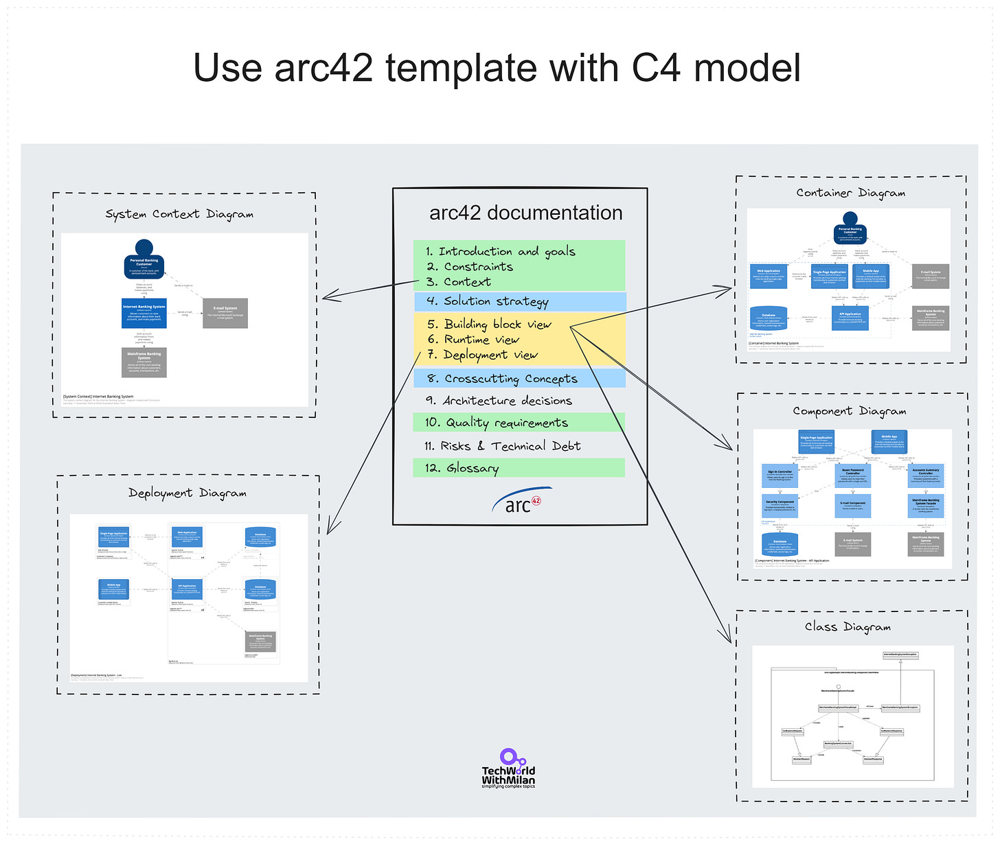](https://substackcdn.com/image/fetch/$s_!dAVb!,f_auto,q_auto:good,fl_progressive:steep/https%3A%2F%2Fsubstack-post-media.s3.amazonaws.com%2Fpublic%2Fimages%2F21470b4a-6e85-40a9-bd35-356fd171ef85_2633x2219.png)

## Documenting architecture as code

Now, when we have a documentation framework (**arc42**) and the diagramming model and tools (**C4 and Structurizr)**, we can use tools such as **[AsciiDoc](https://asciidoc.org/)** to maintain such documentation in version-controlled systems like **Git** close to the code. The **arc42** template is already [available](https://github.com/arc42/arc42-template) in the AsciiDoc format. **AsciiDoc** is a text-based markup language that allows you to write documents in a plain text format that can be converted into formats like HTML, PDF, EPUB, and more.

[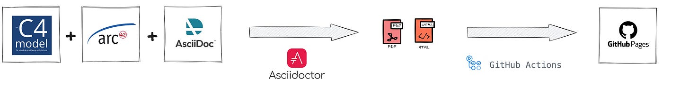](https://substackcdn.com/image/fetch/$s_!ysQM!,f_auto,q_auto:good,fl_progressive:steep/https%3A%2F%2Fsubstack-post-media.s3.amazonaws.com%2Fpublic%2Fimages%2Fc1bfe63b-3737-4fee-8888-ea7c9213d4a9_5265x668.png)

An example of the **AsciiDoc** file (on the left), with the preview (on the right):

[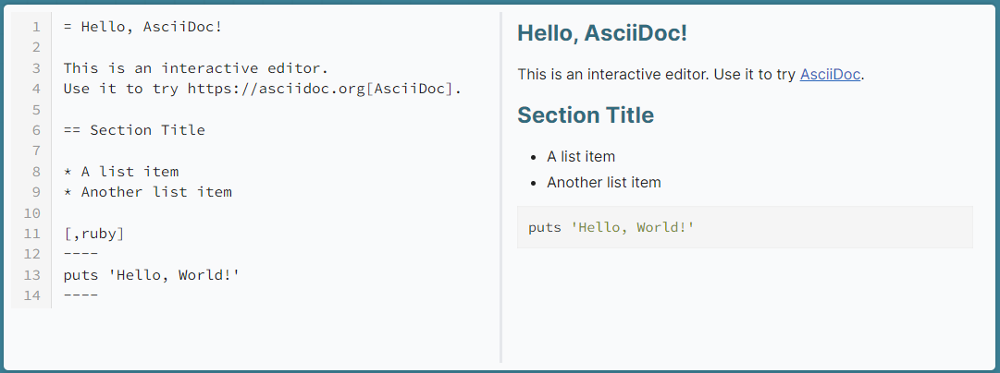](https://substackcdn.com/image/fetch/$s_!0o58!,f_auto,q_auto:good,fl_progressive:steep/https%3A%2F%2Fsubstack-post-media.s3.amazonaws.com%2Fpublic%2Fimages%2F12f0e4cc-5eb6-42e4-a689-35f83c8f862c_1081x404.png)AsciiDoc syntax

**[The AsciiDoc file (.adoc)](https://docs.asciidoctor.org/asciidoc/latest/syntax-quick-reference/)** in the arc42 template that uses C4 diagrams could look like the image below. Note that in AsciiDoc, you can access the main file and reference other files from each section (e.g. index.adoc → goals.adoc, strategy.adoc, …), like in the example shown in the last section.

> *You have many file creation options for AsciiDoc files, such as the **[VSCode extension for AsciiDoc](https://marketplace.visualstudio.com/items?itemName=asciidoctor.asciidoctor-vscode)**.*

[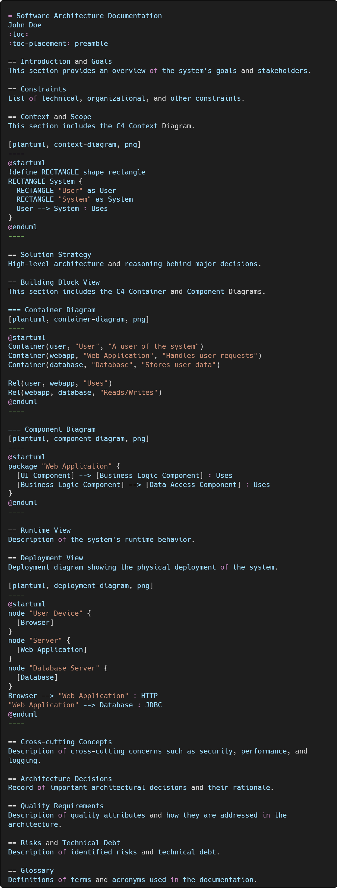](https://substackcdn.com/image/fetch/$s_!uK_s!,f_auto,q_auto:good,fl_progressive:steep/https%3A%2F%2Fsubstack-post-media.s3.amazonaws.com%2Fpublic%2Fimages%2F2ad36bd2-d5a3-47ac-9fe1-dadc95eab428_1318x3466.png)

So, how would we start with the automatic creation of the documentation from the source files:

1. **Create C4 model diagrams in Structurizr and export them as C4-PlantUML diagrams.**
2. **Create a documentation template based on the arc42 model in AsciiDoc markup language.**
3. **Integrate C4-PlantUML diagrams in the documentation**(as shown in the image above)**.**
4. **Setting up a Git repository on GitHub, Azure DevOps, or a similar provider. Store all AsciiDoc and C4 model files in the repo.**
5. **Setting up the CI/CD pipeline to automatically export docs to HTML/PDF files and further (e.g., Confluence or GitHub Pages) to be visible to non-technical users.**The CI/CD pipeline would do the following:

1. Use [Asciidoctor](https://asciidoctor.org/)to export changed AsciiDoc documents into HTML5 pages.
2. Use [GitHub Actions](https://github.com/features/actions) to export HTML5 pages to GitHub Pages.
3. Use [docToolChain](https://doctoolchain.org/docToolchain/v2.0.x/015_tasks/03_task_publishToConfluence.html) to export HTML5 pages to Confluence.

[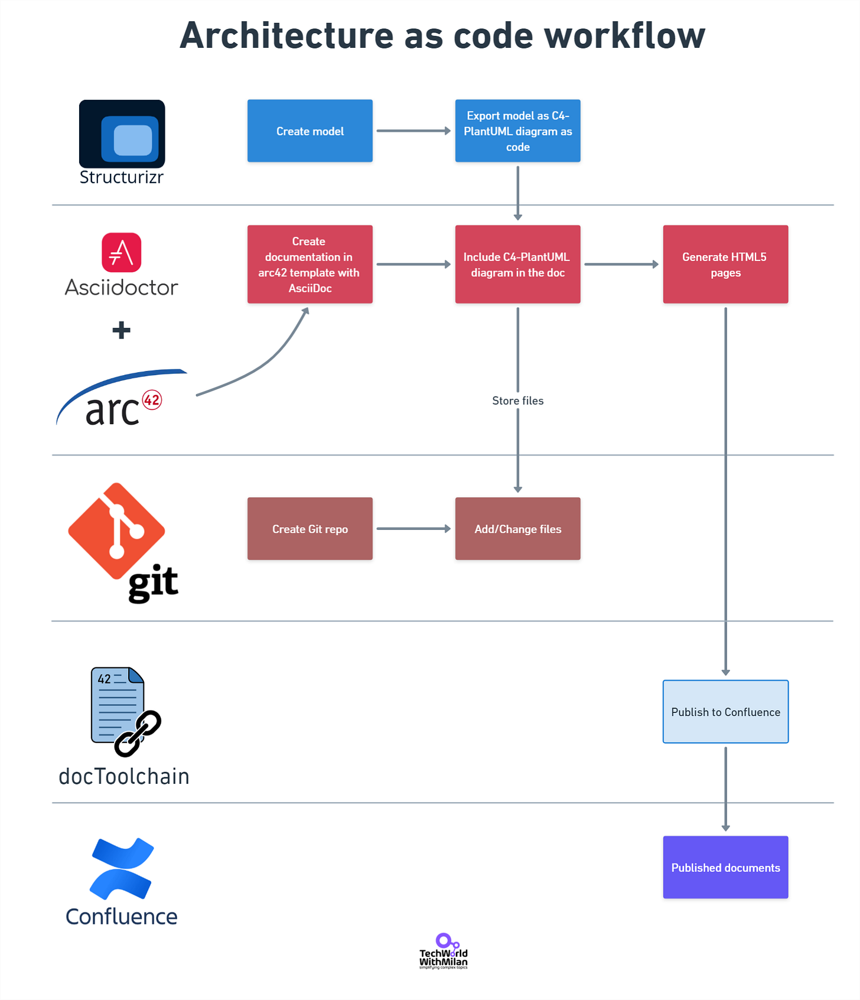](https://substackcdn.com/image/fetch/$s_!tPIN!,f_auto,q_auto:good,fl_progressive:steep/https%3A%2F%2Fsubstack-post-media.s3.amazonaws.com%2Fpublic%2Fimages%2F9544d90e-8681-4fc4-a6c0-23d0412b25d6_1650x1919.png)Architecture as code workflow

> *The implementation of this workflow with GitHub Pages and on a simple example that you can use to build your own documentation, can be found in the following **[GitHub repository](https://github.com/milanm/architecture-docs)**.*

Some other tools you can use with the document-as-a-code approach:

- **[Sphinx](https://www.sphinx-doc.org/en/master/)**
- **[Docusaurus](https://docusaurus.io/)**
- **[Jekyll](https://jekyllrb.com/)**
- **[ReadTheDocs](https://about.readthedocs.com/)**
- **[docsify](https://docsify.js.org/#/)**

---

## More ways I can help you

1. **[Patreon Community](https://www.patreon.com/techworld_with_milan)**: Join my community of engineers, managers, and software architects. You will get exclusive benefits, including all of my books and templates (worth 100$), early access to my content, insider news, helpful resources and tools, priority support, and the possibility to influence my work.
2. **1:1 Coaching:** [Book a working session with me](https://newsletter.techworld-with-milan.com/p/coaching-services). 1:1 coaching is available for personal and organizational/team growth topics. I help you become a high-performing leader 🚀.
3. **[Promote yourself to 32,000+ subscribers](https://newsletter.techworld-with-milan.com/p/sponsorship-of-tech-world-with-milan)**by sponsoring this newsletter.

---

Thanks for reading Tech World With Milan Newsletter! Subscribe for free to receive new posts and support my work.