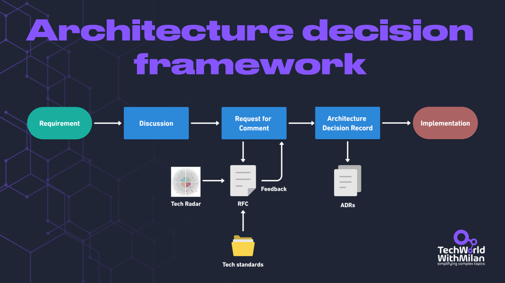
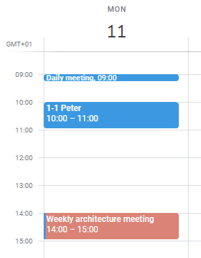
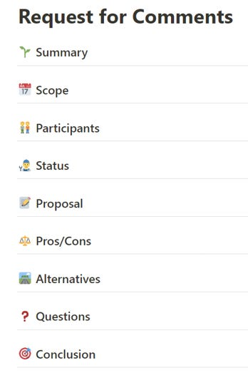
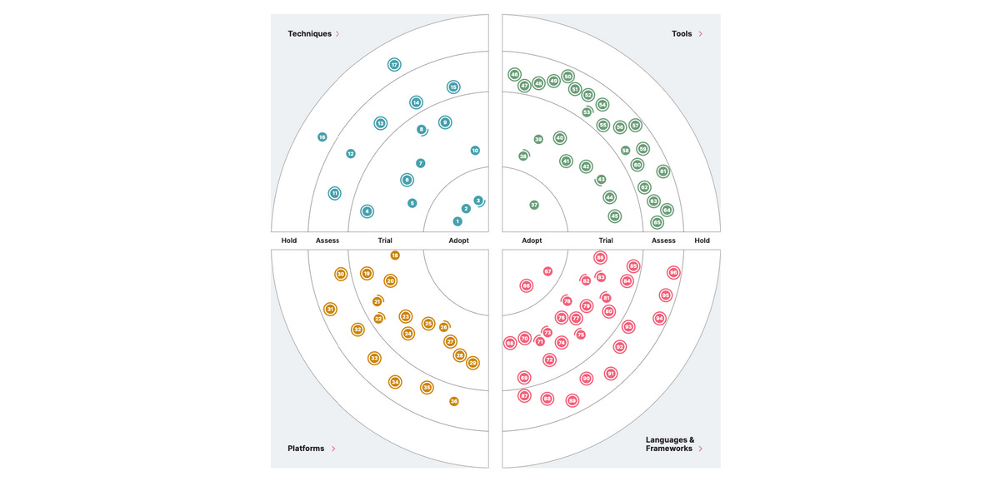
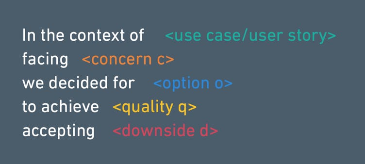
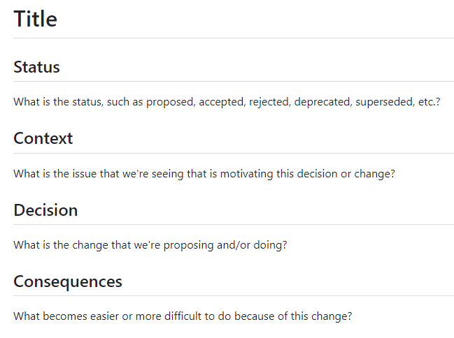
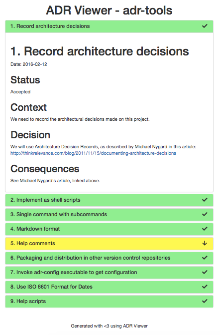
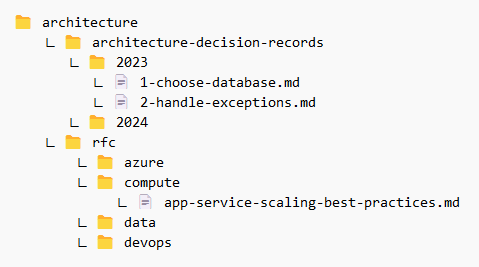

# Facilitating Software Architectures

This week’s issue provides **a decentralized framework for making architectural decisions** using simple practices, supporting a high-documentation / low-meeting culture.

So, let’s dive in.

---

In software engineering, the **architectural decision-making process is a critical** determinant of a system's success and adaptability. However, the rapidly advancing technological landscape challenges this process, which is characterized by increasing complexity and a need for agile responsiveness.  

**Architectural decisions** shape our projects, making the technical vision and laying the groundwork for systems' long-term sustainability and adaptability. Those decisions can be as simple as choosing a code style to more important ones, such as which architectural style we select or which database type. After months of engineering, remembering the rationale behind a decision can be tricky because you need more context that influenced it.

One important aspect of this process to mention is **the power of writing things down**. Writing is a reflective process that reinforces your understanding. It forces you to break down complex concepts into simpler, understandable parts. This simplification clarifies your thinking, often leading to more efficient and elegant solutions.

Here, I present**a simple framework** that you can use to drive your architectural decisions in a decentralized way, with no single authority in charge. The main advantage of such a process is that we include more people in the software architecture process, which leads to a **better spread of knowledge, making no single bottlenecks and improved motivation among the people**.

It consists of the following three steps:

1. **Recurring architectural discussions**
2. **Request for Comments (RFC) process**
3. **Architectural decision records (ADRs) creation**

Architectural decision framework

## 1. Architectural discussions

When we got **the requirements** as a team for some of them, if they were not straightforward or could impact important architectural topics in the project, we needed to discuss them first. For this, we can have a **weekly or bi-weekly recurring conversation to** discuss spikes, challenges, and decisions.

These discussions ensure **continuous alignment** between the architectural vision and the project requirements, effectively preventing problems in the future. They **promote a culture of cross-functional collaboration**, bringing together different perspectives from development, operations, security, and business, which improves the architectural approach with a holistic understanding of system lifecycles.

Yet, these sessions are invaluable for **knowledge sharing**, allowing team members to exchange insights, learn from one another, and stay aware of emerging trends and technologies. They also act as a **proactive measure in risk mitigation**, enabling the early identification and resolution of potential issues, thereby safeguarding the project against unexpected challenges.

The outcome of such discussion is usually:

- **We are suitable for this requirement**, and there is no need to add anything. We go straight to the implementation and sometimes add an Architectural Decision Record (ADR) if documentation is missing.
- **We need to clarify more and do some deep research.**

If the outcome is that we need to do more research, then we can create a spike that will allow us to start a **Request for Comments (RFC) process**.

Weekly architectural meeting

### 2. Request for Comments (RFC) process

The [RFC process](https://en.wikipedia.org/wiki/Request_for_Comments) is a procedure for **harmonizing, enriching, and aligning architects' ideas and perspectives. In software engineering terms,** it is comparable to a code review for design. With the RFC process, we attempt to address some difficulties when designing systems.

With RFCs, we **create a shared context**and spread the knowledge across the organization. We must ensure that everyone who reads the text comprehends the "**why**" and the "**what”** to give suitable comments. The "why" can be interpreted as why we are considering this in the first place and why this task is crucial to the company. The dimensions of the problem are the "what," or the problem you are trying to address with this design, and what you are expressly not doing.

The process consists of three steps: **creation, feedback, and approval**. It starts with creating a proposal, known as an **RFC document**, which details the proposed change in the software architecture. This document includes the **rationale for the change**, its expected impact on the system, and any other important information. The key here is ensuring the proposal is understandable to all stakeholders.

When the RFC is created, it is shared across the team or organization, effectively **opening the possibility for a discussion period**. This phase is crucial as it invites different perspectives and opinions, contributing to a complete decision-making process. **Feedback** received during this time may lead to revisions in the original proposal.

Following **approval**, the RFC is documented and integrated into the project's **Architecture Decision Records (ADRs**), serving as a valuable reference for the decision's context and rationale.

These documents have the following structure:

Request for Comments structure

The usual fields are:

- **Summary** - What is it about? Include the title.
- **Scope** - Our scope with this RFC.
- **Participants** - Who works on this RFC.
- **Status** - In which status is it (proposed, commenting, decided).
- **Proposal** - The document's core section details the proposed changes. It should be clear, detailed, and technical enough for readers to understand the implications. This can include diagrams, code snippets, or architectural patterns as needed.
- **Pros/Cons** - An assessment of the potential impacts of the proposed changes. This includes technical implications on the system and possible effects on business processes, teams, and other organizational aspects.
- **Alternatives** - This section discusses other options before arriving at the proposed solution. It shows that different approaches were evaluated and explains why the current proposal is preferred.
- **Open questions** - Discuss other options before arriving at the proposed solution. This section shows that different approaches were evaluated and why the current proposal is preferred.
- **Conclusion** - A summary of the RFC, reinforcing the key points and the value of the proposed changes.

Along with these fields, it can include some others, such as risks and mitigations, implementation plans, references, etc.

> You can use different templates for RFCs, such as **[the Google one](https://docs.google.com/document/d/1EM5ORZ8sO-g678jNc2nHMAkGjX5-6DuB6EkhjsNcOXo/edit#) 📄**.

In addition, in **the proposal section** of our Request for Comments (RFC) documents, we incorporate information from our:

- **Internal technology radar**—This tool reflects our current technology landscape and offers an overview of the technologies, tools, and frameworks we are currently using, experimenting with, or planning to adopt. Referencing the tech radar in our RFCs ensures our proposals are **compatible with our existing and future technology choices**. Also, if you don’t have your own, you can use some industry-standard tech radars, such as the [Thoughworks Technology Radar](https://www.thoughtworks.com/radar).
- **Established technical standards**—The RFCs also adhere to our established technical standards, including guidelines for critical software development aspects like **logging, exception handling, and testing**. These standards represent our experience and industry best practices and serve as a guideline for our engineering efforts.

Internal Technology Radar

> The Internet Engineering Task Force (IETF) maintains a comprehensive list of [all the Request for Comments (RFCs) documents](https://www.rfc-editor.org/rfc-index.html) 📄 it has published from 1969. to 2023.

### 3. Architectural Decision Records (ADRs)

When we have a conclusion from the RFC document, we use those to create **ADRs**. ADRs are documents that capture decisions about a software system's architecture (introduced by [Michal Nygard in 2011](https://cognitect.com/blog/2011/11/15/documenting-architecture-decisions)). They record the decision itself, the context in which it was made, the factors considered, and the expected impact. By providing a historical record, ADRs help communicate decisions to stakeholders, ensure consistency in decision-making, and promote transparency and accountability.  Usually, **we store it in the codebase, close to the issues they describe**.

The ADRs are usually recorded in the following form:

Architectural Decision Records (ADRs)

ADRs usually have the following **structure**:

- **Title** - A clear, descriptive title for the architectural decision.
- **Status**- Indicates the current status of the decision (e.g., proposed, accepted, rejected, deprecated, superseded, etc.).
- **Context**- This section explains the circumstances that led to the need for this decision. It includes the technical, business, or project constraints and requirements influencing the decision.
- **Decision**- A detailed description of the decision being made. This should be clear and concise, often stated in a few sentences.
- **Consequences**—Discuss the decision's outcomes, including the benefits and drawbacks. This section should cover how the decision will affect the system's current and future state, including its impact on scalability, maintainability, performance, security, and other relevant quality attributes.

You can use many **templates** for ADRs, yet I prefer **[this simple one](https://github.com/joelparkerhenderson/architecture-decision-record/tree/main/locales/en/templates/decision-record-template-by-michael-nygard)** 📄 by Michael Nygard.

Decision record template by Michael Nygard

Also, there are different **tools** you can use to view and track ADRs, such as [ADR viewer](https://github.com/mrwilson/adr-viewer).

ADR viewer

To**learn more about ADRs**, read this article:
[
Tech World With Milan NewsletterThe Art and Science of Architectural Decision-MakingHave you ever joined a project and wondered, "Why on earth did they build it this way?" Many experienced engineers have felt the frustration of not understanding design choices and have no clue why…Read more9 months ago · 29 likes · Dr Milan Milanović](https://newsletter.techworld-with-milan.com/p/the-art-and-science-of-architectural?utm_source=substack&utm_campaign=post_embed&utm_medium=web)
> A critical **drawback with ADRs** is that we tend to record ALL decisions inside, which is an anti-pattern. We want to record only architectural decisions and not make **Any Decision Records**.

Now, our **architecture** **documentation structure** could look like this:

Architecture documentation structure

When we finish the process, we can continue **implementing our requirements** while thoroughly challenging them with RFCs and documents with ADRs.

👉 Learn more about how to **properly document software architectures**:
[
Tech World With Milan NewsletterMastering the Art of Software Architecture DocumentationIn this newsletter, we will try to understand…Read more2 years ago · 126 likes · 2 comments · Dr Milan Milanović](https://newsletter.techworld-with-milan.com/p/documenting-software-architectures?utm_source=substack&utm_campaign=post_embed&utm_medium=web)
---

**Bonus:** Take a look at my **Heapcon 2023. talk** where I presented this topic.

---

## **More ways I can help you**

1. 📚 **[The Ultimate .NET Bundle for 2025](https://www.patreon.com/techworld_with_milan/shop/ultimate-net-bundle-for-2025-1519389?utm_medium=clipboard_copy&utm_source=copyLink&utm_campaign=productshare_creator&utm_content=join_link)**. This comprehensive package provides over 500 pages of expert insights into C#, .NET, and ASP.NET Core, distilled from my 20+ years of experience across more than 30 projects. You'll master the .NET ecosystem, modern C# features, essential design patterns, and prepare thoroughly with 200+ real-world interview questions. Exclusive bonus guides on ASP.NET Core best practices, middleware, and offers a complete C# cheat sheet.
2. **📢 [LinkedIn Content Creator Masterclass](https://www.patreon.com/techworld_with_milan/shop/short-linkedin-content-creator-311232?utm_medium=clipboard_copy&utm_source=copyLink&utm_campaign=productshare_creator&utm_content=join_link).**In this masterclass, I share my strategies for growing your influence on LinkedIn in the Tech space. You'll learn how to define your target audience, master the LinkedIn algorithm, create impactful content using my writing system, and create a content strategy that drives impressive results.
3. **💼 [Promote yourself to 44,000+ subscribers](https://newsletter.techworld-with-milan.com/p/sponsorship-of-tech-world-with-milan)**by sponsoring this newsletter. This newsletter puts you in front of an audience with many engineering leaders and senior engineers who influence tech decisions and purchases.
4. **📄 [Resume Reality Check](https://www.patreon.com/techworld_with_milan/shop/resume-reality-check-311008?source=storefront)**. I can now offer you a service where I’ll review your CV and LinkedIn profile, providing instant, honest feedback from a CTO’s perspective. You’ll discover what stands out, what needs improvement, and how recruiters and engineering managers view your resume at first glance.
5. **💡 [Join my Patreon community](https://www.patreon.com/techworld_with_milan)**: Be first to know what I do! This is your way of supporting me, saying “**thanks**," and getting more benefits. You will get exclusive benefits, including 📚 all of my books and templates on Design Patterns, Setting priorities, and more, worth $100, early access to my content, insider news, helpful resources and tools, priority support, and the possibility to influence my work.
6. **🤝** **1:1 Coaching:** [Book a working session with me](https://newsletter.techworld-with-milan.com/p/coaching-services). I offer 1:1 coaching for personal, organizational, and team growth topics. I help you become a high-performing leader and engineer.

---

Thanks for reading Tech World With Milan Newsletter! Subscribe for free to receive new posts and support my work.