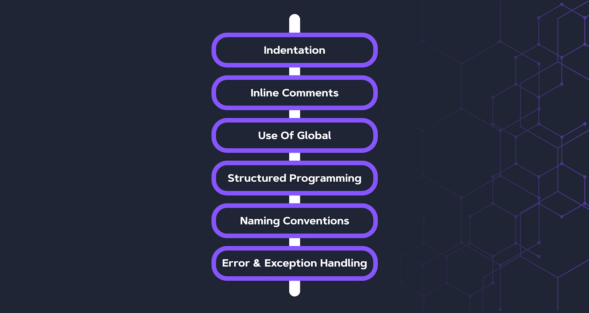
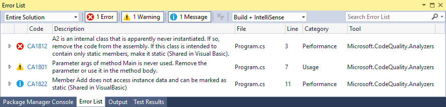
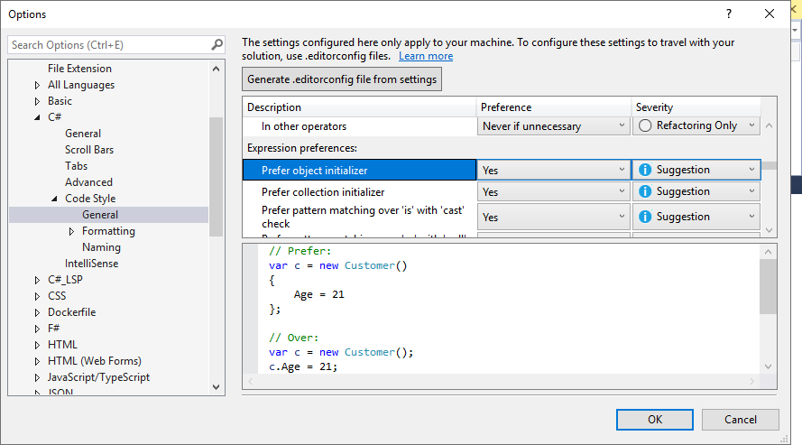
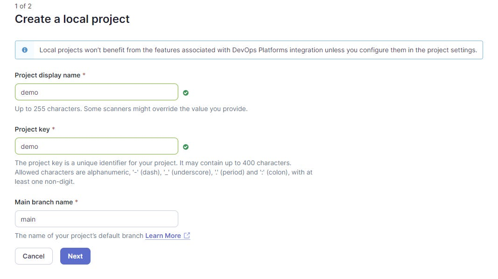
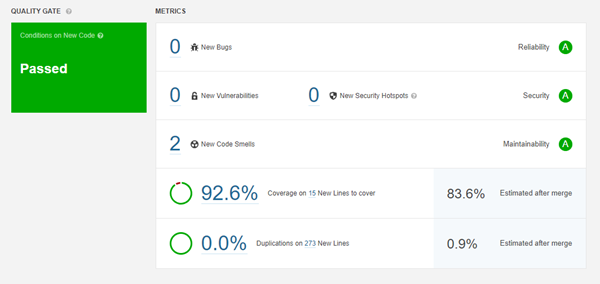
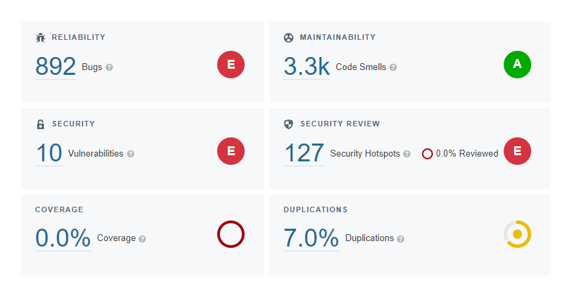
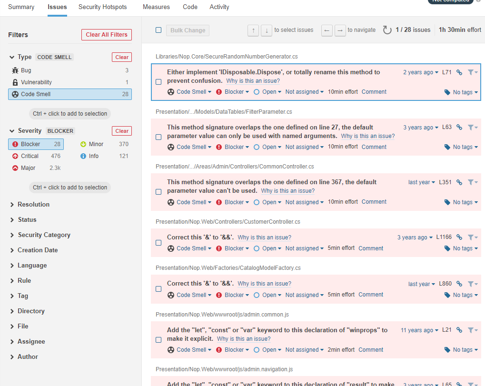
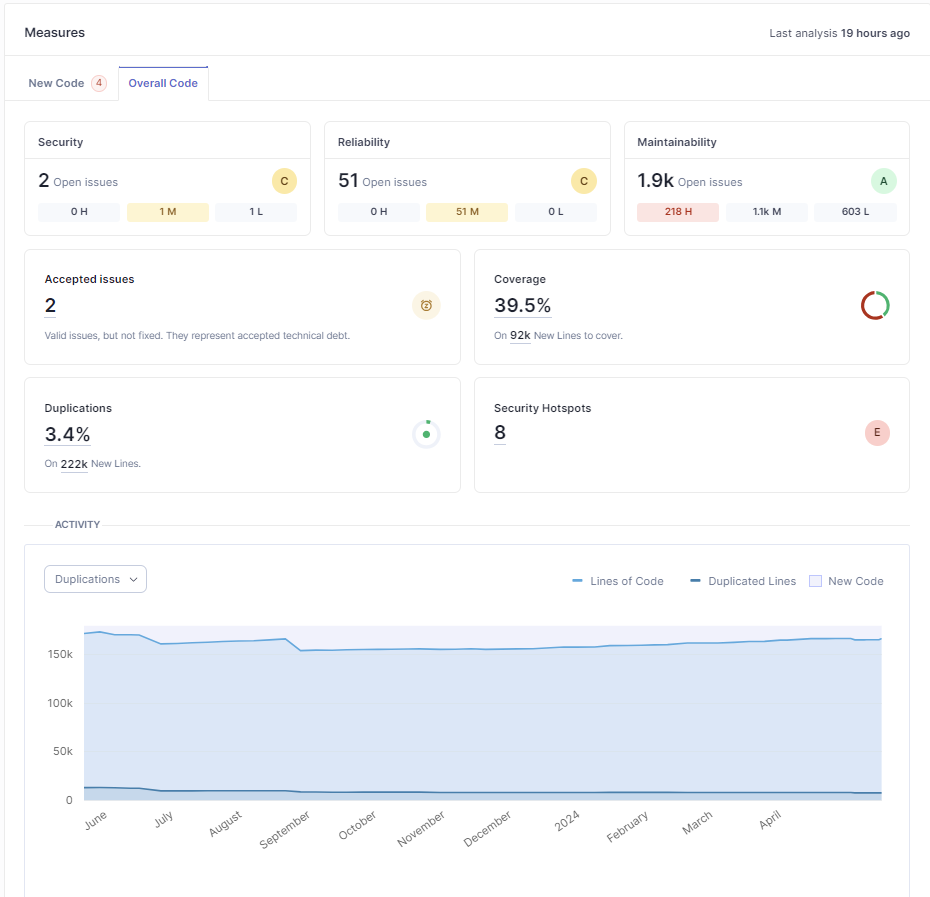
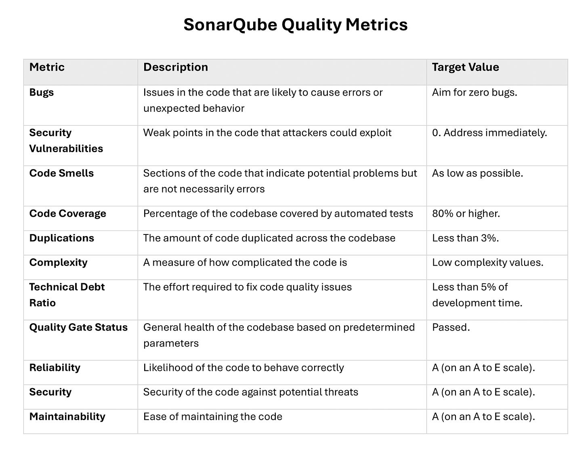

# Enabling High-Quality Code in .NET

*Methods and techniques for superior code quality*

Have you ever spent hours trying to understand other people's code, only to wish the original developer had written it more clearly? We've all been there, and it's a stark reminder of why code quality is so important. High-quality code isn't just about making something work; it's about writing clean, consistent, secure, and easy for others (and your future self) to understand and maintain. But let's face it, "good code" can mean different things to different people, so establishing common standards is crucial.

To keep our projects on track, we need to enforce these standards in a way that minimizes (primarily human) errors. This means setting up regular code reviews, using static code analysis tools, automating tests, and integrating Continuous Integration/Continuous Deployment (CI/CD) pipelines. Automating as much of this process as possible helps us catch mistakes early and ensures everyone is on the same page.

In this post, I'll explore some key practices that can help us maintain high code quality. We'll examine how tools like SonarQube and .NET analyzers fit into the development workflow and how they can make our lives easier by detecting issues before they become big problems. By adopting these strategies, we can reduce technical debt, improve team collaboration, and keep our codebase in great shape over time.

So, let’s dive in.

## What is code quality?

When we talk about code quality, we can think of different aspects of it. We mainly refer to the attributes and characteristics of code. While there is no widely adopted definition of high-quality code, we know some of **the characteristics of good code**:

- **It is [clean](http://milan.milanovic.org/post/clean-code-best-practices/).**
- **Absence of [code smells](https://refactoring.guru/refactoring/smells).**
- **Consistent.**
- **Functional - it does what we say it does.**
- **Easy to understand.**
- **Secure.**
- **Efficient.**
- **Testable.**
- **Easy to maintain.**
- **Well documented.**

There are more characteristics of good code, but these are the core of **high-quality code**.

[](https://substackcdn.com/image/fetch/$s_!xbYs!,f_auto,q_auto:good,fl_progressive:steep/https%3A%2F%2Fsubstack-post-media.s3.amazonaws.com%2Fpublic%2Fimages%2Fb93ca2ec-bc4d-4f48-863f-3b779bf4e944_1082x627.png)

However, even though we know some attributes and characteristics of high-quality code, they can mean a different thing to different people or have a different view on priorities against them. However, we need to impose some standards and guidelines to promote a similar view of the topic of high-quality code. Automating them as much as possible is essential without leaving room for mistakes.

How can we enforce high code quality in our projects?

1. **Code reviews:** Implement regular code reviews to catch issues early and ensure adherence to coding standards.
2. **Static code analysis:** Use tools like SonarQube or Resharper to enforce coding standards and detect code smells.
3. **Automated testing:** Set up a comprehensive suite of automated tests, including unit, integration, and end-to-end tests.
4. **Continuous Integration/Continuous Deployment (CI/CD):** Use CI/CD pipelines (e.g., Azure DevOps, Jenkins) to build, test, and deploy code automatically.
5. **Coding standards:** Establish and enforce coding standards and best practices. This can be achieved through style guides, linting tools, and automated code formatters.

So, let’s discuss some of these most critical practices.

---

## [Learn About the Advantages of API Clients in the Development Lifecycle (Sponsored)](https://www.youtube.com/watch?v=AXea3LrpCqg)

Learn about the core functionalities of Postman's API Client from Dustin Schau, Head of API Client, [Postman](https://www.postman.com/).

---

## Coding standards

Coding standards and code styles provide uniformity in code inside a project or a team. By using it, we can easily use and maintain our code. Style guides are company standard conventions, usually defined per programming language, as best practices that should be enforced. This ensures **consistent code across all team members**.

There are different examples of code standards, e.g., by a company - Microsoft, or per language, e.g., [C#](https://learn.microsoft.com/en-us/dotnet/csharp/fundamentals/coding-style/coding-conventions).

These standards **usually define the following**:

- Layout conventions.
- Commenting conventions.
- Language guidelines.
- Security.
- Etc.

[](https://substackcdn.com/image/fetch/$s_!nifM!,f_auto,q_auto:good,fl_progressive:steep/https%3A%2F%2Fsubstack-post-media.s3.amazonaws.com%2Fpublic%2Fimages%2F25a76463-f706-4c5d-b656-87bed8a7fb73_2091x1113.png)

## Code reviews

Code reviews are a helpful tool for teams to improve code quality. It enables us to reduce development costs by catching issues in the code earlier and as a communication and knowledge-sharing tool. Code review, in particular, means reviewing other programming codes for mistakes and other code metrics and ensuring that all requirements are implemented correctly.

Code review usually starts with a submitted Pull Request (PR) for code to be added to a codebase. Then, one of the team members needs to review the code.

It is essential to do code reviews to improve coding skills, but it also represents a great **knowledge-sharing tool** for a team. In a typical code review, we should check for:

- **Code readability.**
- **Coding style.**
- **Code extensibility.**
- **Feature correctness.**
- **Naming.**
- **Code duplication.**
- **Test coverage.**

And more.

Code reviews can be implemented in different ways, from single-person reviews to pair programming (which is much better). However, these methods are usually time-intensive, so code quality check tools can **automate that process**.

To learn more about code reviews, check my text:
[
Tech World With Milan NewsletterHow To Do Code Reviews ProperlyWhy Do We Need to Do Code Reviews? An essential step in the software development lifecycle is code review. It enables developers to enhance code quality significantly. It resembles the authoring of a book. First, the author writes the story, which is edited to ensure no mistakes like mixing up "you're" with "yours." Code review, in this context, refers t…Read more3 years ago · 38 likes · 3 comments · Dr Milan Milanović](https://newsletter.techworld-with-milan.com/p/how-to-do-code-reviews-properly?utm_source=substack&utm_campaign=post_embed&utm_medium=web)
## Tools to check for code quality

When we talk about tools for checking code quality, there are two options: **dynamic and static code analysis**.

- **Dynamic code analysis** involves analyzing applications during execution and analyzing code for reliability, quality, and security. This kind of analysis helps us find issues related to application integration with database servers and other external services. The primary objective is to find problems and vulnerabilities in software that can be debugged. Different tools for dynamic code analysis exist, such as [Microsoft IntelliTest](https://docs.microsoft.com/en-us/visualstudio/test/intellitest-manual/?view=vs-2019), [Java Pathfinder](https://github.com/javapathfinder/jpf-core), or [KLEE](https://github.com/klee/klee) for C/C++.
- Another kind of analysis is **static code analysis**. Here, we analyze source code to identify different kinds of flaws. However, it doesn’t give us a holistic view of the application, so it is recommended that we use it together with dynamic code analysis. For Static Code Analysis, we can use tools like [SonarQube](https://www.sonarsource.com/products/sonarqube/), [Coverity](https://scan.coverity.com/), [Parasoft](https://www.parasoft.com/solutions/static-code-analysis/), etc.

This post will focus on **static code analysis**, which can be automated and produce results even without developer input.

### Static code analysis

Static code analysis is a way to check application source code **even before the program is run**. It is usually done by analyzing code with a given set of rules or coding standards. It addresses code bugs, vulnerabilities, smells, test coverage, and other coding standards. It also includes common developer errors that are often found during PR reviews.

It is usually incorporated at any stage into the software development lifecycle after the “code development” phase and before running tests. CI/CD pipelines usually include static analysis reports as a quality gate, even before merging PRs to a master branch.

We can use static code analysis with CI/CD pipelines during development. This involves using a different set of tools to understand what rules are being broken quickly. This enables us to fix code earlier in the development lifecycle and avoid builds that fail later.

During static code analysis, we also check for some code metrics, such as **[Halstead Complexity Measures](https://en.wikipedia.org/wiki/Halstead_complexity_measures), [Cognitive Complexity](https://www.sonarsource.com/resources/cognitive-complexity/),** or **[Cyclomatic Complexity](https://en.wikipedia.org/wiki/Cyclomatic_complexity)**, which counts the number of linearly independent paths within your source code. The hypothesis is that the higher the cyclomatic complexity, the higher the chance of errors. Modern use of cyclomatic complexity is to improve software testability.

### .NET code analysis

In the .NET world, we have different code analyzers, such as recommended **[.NET Compiler Platform (Roslyn) Analyzers](https://github.com/dotnet/roslyn-analyzers)** for inspecting C# or Visual Basic code for style, quality, maintainability, design, and other issues.

**Analyzers** can be divided into the following groups:

- **[Code-style](https://docs.microsoft.com/en-us/dotnet/fundamentals/code-analysis/code-style-rule-options?preserve-view=true&view=vs-2019#convention-categories)** analyzers are built into Visual Studio. The analyzer’s diagnostic ID or code format is IDExxxx, for example, IDE0067.
- **[Code quality](https://docs.microsoft.com/en-us/dotnet/fundamentals/code-analysis/quality-rules/)** analyzers are included with the .NET SDK and enabled by default by setting the [EnableNETAnalyzers](https://learn.microsoft.com/en-us/dotnet/core/project-sdk/msbuild-props#enablenetanalyzers) property to `true`.
- **External analyzers**, such as:

- [StyleCop](https://www.nuget.org/packages/StyleCop.Analyzers/).
- [Roslynator](https://www.nuget.org/packages/Roslynator.Analyzers/).
- [XUnit Analyzers](https://www.nuget.org/packages/xunit.analyzers/).
- [Sonar Analyzer](https://www.nuget.org/packages/SonarAnalyzer.CSharp/).

Each analyzer has one of the following severity levels: **Error, Warning, Info, hidden, None, or Default**.

If an analyzer finds rule violations, they’re reported in the code editor as a squiggle under the offending code and the Error List window (as shown in the image below). The analyzer violations reported in the error list match the severity level setting of the rule. Many analyzer rules, or diagnostics, have one or more associated code fixes that you can apply to correct the rule violation.

[](https://substackcdn.com/image/fetch/$s_!YGts!,f_auto,q_auto:good,fl_progressive:steep/https%3A%2F%2Fsubstack-post-media.s3.amazonaws.com%2Fpublic%2Fimages%2F630eb494-a555-4485-8360-4cfc2bdb5a25_889x215.png)

To **enforce the rules at build time**, which includes through the command line or as part of a continuous integration (CI) build, choose one of the following options:

- **Create a .NET project that includes analyzers by default** in the .NET SDK. Code analysis is enabled, by default, for projects that target .NET 5.0 or newer. You can allow code analysis on projects that target earlier .NET versions by setting the **[EnableNETAnalyzers](https://learn.microsoft.com/en-us/dotnet/core/project-sdk/msbuild-props#enablenetanalyzers)**[https://learn.microsoft.com/en-us/dotnet/core/project-sdk/msbuild-props#enablenetanalyzers](https://learn.microsoft.com/en-us/dotnet/core/project-sdk/msbuild-props#enablenetanalyzers)property to true.
- **Install analyzers as a NuGet package**. The analyzers are also available at  [Microsoft.CodeAnalysis.NetAnalyzers](https://www.nuget.org/packages/Microsoft.CodeAnalysis.NetAnalyzers) NuGet package. This is the most common set of analyzers and works on all platforms.

More details on how to set up .NET analyzers can be found [here](https://docs.microsoft.com/en-us/visualstudio/code-quality/use-roslyn-analyzers?view=vs-2022).

#### **Code quality**

Code analysis rules have various configuration options. You specify these options as key-value pairs in one of [the following analyzer configuration files](https://learn.microsoft.com/en-us/dotnet/fundamentals/code-analysis/configuration-files):

- **EditorConfig file**: File-based or folder-based configuration options.
- **Global AnalyzerConfig file** (Starting with the .NET 5 SDK): Project-level configuration options. It is useful when some project files reside outside the project folder.

EditorConfig files are used to provide options that apply to specific source files or folders, e.g.,

```
``# CA1000: Do not declare static members on generic types
dotnet_diagnostic.CA1000.severity = warning``
```

#### **Code style**

We can define code style settings per project using an **EditorConfig file** or edit all code in Visual Studio on the text editor **Options page**. We can manually populate your EditorConfig file or automatically generate the file based on the code style settings you’ve chosen in the Visual Studio Options dialog box. This options page is available at **Tools > Options > Text Editor > [C# or Basic] > Code Style > General**.

Code style preferences can be set for all of our C# and Visual Basic projects by opening the Options dialog box from the Tools menu. In the Options dialog box, select **Text Editor > [C# or Basic] > Code Style > General**.

[](https://substackcdn.com/image/fetch/$s_!pZfk!,f_auto,q_auto:good,fl_progressive:steep/https%3A%2F%2Fsubstack-post-media.s3.amazonaws.com%2Fpublic%2Fimages%2F24d84051-3d30-4bbd-9563-04154c9544eb_889x493.png)

Starting in .NET 5, we can enable **code-style analysis on the build** at the command line and inside Visual Studio. Code style violations appear as warnings or errors with an “IDE” prefix. This enables you to enforce consistent code styles at build time:

1. Set the **MSBuild property**`EnforceCodeStyleInBuild` to true.
2. In a **.editorconfig file**, configure each “IDE” code style rule you wish to run on the build as a warning or an error. For example:

```
``[*.{cs,vb}]
# IDE0040: Accessibility modifiers required (escalated to a build warning)
dotnet_diagnostic.IDE0040.severity = warning``
```

Here, we can check the full set of options for [Analyzer configuration](https://github.com/dotnet/roslyn-analyzers/blob/main/docs/Analyzer%20Configuration.md).

#### **Suppressing code analysis violations**

It is often helpful to indicate that a warning is not applicable. Suppressing code analysis violations indicates to team members the code was reviewed, and the warning can be suppressed. We can suppress it in the **EditorConfig file** by setting severity to none, e.g.,

```
``dotnet_diagnostic.CA1822.severity = none``
```

Or directly in source code by using attributes or a global suppression file. An example of using the SuppressMessage attribute:

```
``[Scope:SuppressMessage("Rule Category", "Rule Id", Justification = "Justification", MessageId = "MessageId", Scope = "Scope", Target = "Target")]``
```

The attribute can be applied at the assembly, module, type, member, or parameter level.

### Using SonarQube

[SonarQube](https://www.sonarsource.com/products/sonarqube/?utm_medium=paid&utm_source=techwithmilan&utm_campaign=ss-dotnet&utm_content=blast-blog-enabling-high-quality-code-240530-x&utm_term=ww-psp-x&s_category=Paid&s_source=Paid%20Other&s_origin=techwithmilan) is an open-source product produced by SonarSource SA. It consists of a set of **static analyzers** (for many languages), a data mart, and a portal that enables you to manage your technical debt. SonarSource and the community provide additional analyzers (free or commercial) that can be added to a SonarQube installation as plug-ins. It is a language-agnostic platform that supports most mainstream languages such as C, C++, HTML, C#, Java, JavaScript, etc.

[](https://substackcdn.com/image/fetch/$s_!0FX9!,f_auto,q_auto:good,fl_progressive:steep/https%3A%2F%2Fsubstack-post-media.s3.amazonaws.com%2Fpublic%2Fimages%2F2bcbe6a2-420d-4827-846c-6375ca906eff_396x102.png)

From SonarSource, we have three possible options:

- **[SonarQube](https://www.sonarsource.com/products/sonarqube/?utm_medium=paid&utm_source=techwithmilan&utm_campaign=ss-dotnet&utm_content=blast-blog-enabling-high-quality-code-240530-x&utm_term=ww-psp-x&s_category=Paid&s_source=Paid%20Other&s_origin=techwithmilan)** - A self-managed tool/server that needs to be installed/hosted.
- **[SonarCloud](https://www.sonarsource.com/products/sonarcloud/?utm_medium=paid&utm_source=techwithmilan&utm_campaign=ss-dotnet&utm_content=blast-blog-enabling-high-quality-code-240530-x&utm_term=ww-psp-x&s_category=Paid&s_source=Paid%20Other&s_origin=techwithmilan)** - Cloud variant of Sonar analyzers - only registration required.
- **[SonarLint](https://www.sonarsource.com/products/sonarlint/?utm_medium=paid&utm_source=techwithmilan&utm_campaign=ss-dotnet&utm_content=blast-blog-enabling-high-quality-code-240530-x&utm_term=ww-psp-x&s_category=Paid&s_source=Paid%20Other&s_origin=techwithmilan)** - IDE extension. You can also use it with SonarQube and SonarCloud in [Connected Mode](https://www.sonarsource.com/products/sonarlint/features/connected-mode/) to catch issues earlier and implement a shift-left approach.
- **[SonarAnalyzer.CSharp](https://www.nuget.org/packages/SonarAnalyzer.CSharp/)**—This code analyzer set is delivered via a NuGet package. You can install them in any .NET project and use them for free, even without an extension or paid subscription for any other products.

They allow us 460+ C# rules and 210+ VB.​NET rules and different metrics (cognitive complexity, duplications, number of lines, etc.), but also support for adding custom rules.

SonarQube allows you to customize the standards and requirements for any project in two ways:

- **Quality Profiles.** With this capability, you can specify best practices and standards for every programming language, allowing customization of the rules applied during code analysis. This customization ensures the rules align with the coding guidelines and project quality expectations. Quality Profiles can be specific to different programming languages, meaning different rules can be applied depending on the language used.
- **Quality Gates** in SonarQube are conditions that determine whether a project passes or fails the quality check at the end of an analysis. They act as checkpoints, ensuring code meets predefined quality standards before progressing through the development pipeline. The conditions within a Quality Gate typically include thresholds for various metrics such as bugs, vulnerabilities, code smells, test coverage, and duplications. A Quality Gate might, for instance, require that all newly written code have at least 60% test coverage or that no security flaws be found.

### **Using SonarQube locally**

To use SonarQube locally, we first need to [install it](https://docs.sonarsource.com/sonarqube/latest/setup-and-upgrade/install-the-server/introduction/?utm_medium=paid&utm_source=techwithmilan&utm_campaign=ss-dotnet&utm_content=blast-blog-enabling-high-quality-code-240530-x&utm_term=ww-psp-x&s_category=Paid&s_source=Paid%20Other&s_origin=techwithmilan) from a ZIP file or a Docker image.

When the installation is done, we need to run `StartSonar.bat`, in administration mode, and the SonarQube application will run at http://localhost:9000.

Now, we can create a project and create a unique token:

[](https://substackcdn.com/image/fetch/$s_!MFZ3!,f_auto,q_auto:good,fl_progressive:steep/https%3A%2F%2Fsubstack-post-media.s3.amazonaws.com%2Fpublic%2Fimages%2F3e43995c-877b-4c4e-97e3-ef02cb0addc4_1067x598.png)

Before analyzing a project, we need to install sonar scanner tools globally or run it as part of your DevOps CI pipeline, such as:

`dotnet tool install --global dotnet-sonarscanner`

And then, we can execute the scanner:

```
``dotnet sonarscanner begin /k:"demo" /d:sonar.host.url="http://localhost:9000"  /d:sonar.login="token"

dotnet build

dotnet sonarscanner end /d:sonar.login="token"``
```

The analysis's results can also be seen. This dashboard shows bugs, vulnerabilities, code smells, code coverage, security issues, and more.

[](https://substackcdn.com/image/fetch/$s_!1w3V!,f_auto,q_auto:good,fl_progressive:steep/https%3A%2F%2Fsubstack-post-media.s3.amazonaws.com%2Fpublic%2Fimages%2F41175ea7-6c86-441b-97e9-a00d905dae7c_600x284.png)

### **Using SonarAnalyzer**

One additional tool that we can use is **[SonarAnalyzer.CSharp](https://www.nuget.org/packages/SonarAnalyzer.CSharp/)** is the analyzer’s package. This package enables us to integrate IDE rules so that they are applied when building applications locally, just as they were built in the CI/CD process with SonarQube rules applied.

All the rules have documentation that clearly explains the problem, and code samples show good and bad code ([see example](https://rules.sonarsource.com/csharp/RSPEC-1135)).

### **Using SonarCloud in the cloud**

Another possibility is to use **[SonarCloud](https://www.sonarsource.com/products/sonarcloud/?utm_medium=paid&utm_source=techwithmilan&utm_campaign=ss-dotnet&utm_content=blast-blog-enabling-high-quality-code-240530-x&utm_term=ww-psp-x&s_category=Paid&s_source=Paid%20Other&s_origin=techwithmilan)** integration with your repository from GitHub, Bitbucket, Azure DevOps, or GitLab. Here, we can create a straightforward configuration to make a SonarCloud account/project and connect it to our online repository, which will be analyzed. A free version of SonarCloud offers unlimited analyzers and lines of code for all languages, but results are open to anyone. Analysis for private projects is [paid from 11e per month](https://www.sonarsource.com/plans-and-pricing/#sonarcloud).

In the example here, a popular [NopCommerce open-source project](https://github.com/nopSolutions/nopCommerce) is analyzed with a connection to SonarCloud as an open project. In the image below, we can see the result of the SonarQube analysis on the dashboard.

[](https://substackcdn.com/image/fetch/$s_!qaQT!,f_auto,q_auto:good,fl_progressive:steep/https%3A%2F%2Fsubstack-post-media.s3.amazonaws.com%2Fpublic%2Fimages%2F8ccda21b-89b0-49a0-b008-1f93c6806128_828x431.png)

From the results of scanning 337k of code, we have **892 bugs**, **3.3k code smells**, **10 security vulnerabilities,** and **127 security hotspots**. Then, we can go into details in each of those sections, e.g., code smells:

[](https://substackcdn.com/image/fetch/$s_!3I0O!,f_auto,q_auto:good,fl_progressive:steep/https%3A%2F%2Fsubstack-post-media.s3.amazonaws.com%2Fpublic%2Fimages%2F2c57f969-22ec-4cc1-8793-7919c70dc164_1019x811.png)

Checking for **blocker, critical, and major findings** is essential here. For each issue, we can see details of why it is the issue, confirm it, or resolve it.

When we fix the issue and push our changes to the repository, we will see a new analysis round incorporating our changes.

### **Using SonarQube in CI/CD pipelines**

We can integrate SonarQube in **CI/CD pipelines in GitHub, GitLab, BitBucket, Jenkins, Travis, and Azure DevOps**. The Community edition allows scanning only for the master branch, but from the Developer Edition; it’s possible to analyze multiple branches and integrate checks on the Pull Request (PR) level, which is handy for most projects.

To use SonarQube in **the Azure DevOps example**, we must set up our global [DevOps Platform settings](https://docs.sonarsource.com/sonarqube/latest/devops-platform-integration/azure-devops-integration/?utm_medium=paid&utm_source=techwithmilan&utm_campaign=ss-dotnet&utm_content=blast-blog-enabling-high-quality-code-240530-x&utm_term=ww-psp-x&s_category=Paid&s_source=Paid%20Other&s_origin=techwithmilan) and add an access token. Then, we can analyze the process using Azure pipelines. First, we need to install the [SonarQube extension](https://marketplace.visualstudio.com/items?itemName=SonarSource.sonarqube). After installing your extension, you must declare your SonarQube server as a service endpoint in our [Azure DevOps project settings](https://docs.sonarsource.com/sonarqube/latest/devops-platform-integration/azure-devops-integration/#header-3?utm_medium=paid&utm_source=techwithmilan&utm_campaign=ss-dotnet&utm_content=blast-blog-enabling-high-quality-code-240530-x&utm_term=ww-psp-x&s_category=Paid&s_source=Paid%20Other&s_origin=techwithmilan).

When the endpoint is added, we must configure **branch analysis** using the following tasks: Prepare Analysis Configuration, Run Code Analysis, and Publish Quality Gate Result.

An example of a **pipeline for a .NET project** could look like this:

```
``trigger:
- master # or the name of your main branch
- feature/*

steps:
# Prepare Analysis Configuration task
- task: SonarQubePrepare@5
  inputs:
    SonarQube: 'YourSonarqubeServerEndpoint'
    scannerMode: 'MSBuild'
    projectKey: 'YourProjectKey'

# Run Code Analysis task
- task: SonarQubeAnalyze@5

# Publish Quality Gate Result task
- task: SonarQubePublish@5
  inputs:
    pollingTimeoutSec: '300'``
```

What is also important is that we want to run this check with **every pull request**. This will prevent unsafe or substandard code from merging with our main branch. Two policies that can help us here:

- **Ensuring your pull requests are automatically analyzed**: Add a [build validation branch policy](https://docs.microsoft.com/en-us/azure/devops/pipelines/repos/azure-repos-git#pr-triggers) on the target branch to ensure all pull requests are automatically analyzed.
- **Preventing pull request merges when the Quality Gate fails**: Add a SonarQube/quality gate status check branch policy on the target branch to avoid merging pull requests with a failed quality gate.

---

## SonarQube Analysis Best Practices and Metrics

To maximize the effectiveness of SonarQube in maintaining and improving code quality, here are some best practices for SonarQube analysis:

### **1. Integrate SonarQube early in the development process**

Integrate SonarQube into your CI/CD pipeline to ensure that code quality checks are performed automatically with every build. The sooner we start, the more accurate our data will be. More accurate, as if we introduce it later in the process, the more you will get a lot of false positives as SonarQube analyzes the code as it is written and not after.

### **2. Define clear-quality gates**

Define quality gates with specific thresholds for critical metrics such as bugs, vulnerabilities, code smells, and coverage. This helps enforce quality standards. Also, configure your CI/CD pipeline to fail builds if the quality gate criteria are not met, ensuring issues are addressed promptly.

### 3. Integrate SonarQube in the CI/CD server

When we enable the automatic usage of SonarQube during the build and PR process, we get immediate feedback about our code quality. This enables us to improve the code before it is merged into the codebase. This also allows our reports to always be up to date and not rely on any manual process.

Perform SonarQube analysis on feature branches to detect issues before merging changes into the main branch. Integrate SonarQube with your version control system to display analysis results directly in pull requests. This will make it easier to identify and fix issues before merging.

### **4. Prioritize issues based on severity**

To maintain your application's stability and security, address critical and major issues (bugs and vulnerabilities) first. Then, incrementally tackle code smells and minor issues to gradually improve code maintainability without overwhelming the team.

### **5. Don’t ignore issues**

If we ignore issues, we will postpone the problem and increase technical debt, which we don’t want to do. We should fix the issues when they happen. If there are issue types we don’t want to fix, we can adjust the SonarQube ruleset and exclude those rules.

### 6. **Minimize code duplication**

Regularly review the codebase for duplicated code and refactor it into reusable components or functions. SonarQube can help identify these duplications.

Follow the "Don't Repeat Yourself" (DRY) principle. Abstract it into a common function or module whenever similar code logic is needed in different parts of the codebase.

### **7. Minimize Technical Debt**

The technical debt ratio is the estimated time to fix code issues divided by the project development time. Aim to keep this ratio below 5% to ensure the project remains manageable.

Allocate a portion of the team development time to addressing technical debt. This could involve refactoring, improving test coverage, or resolving code smells.
[
Tech World With Milan NewsletterHow To Deal With Technical DebtIn this issue, we are going to talk about the following: What Is Technical Debt? Types Of Technical Debt How to Measure Technical Debt? Strategies to Fight Technical Debt A Recommended Strategy To Deal With Technical Debt Tools to track Technical Debt…Read more3 years ago · 31 likes · 1 comment · Dr Milan Milanović](https://newsletter.techworld-with-milan.com/p/how-to-deal-with-technical-debt?utm_source=substack&utm_campaign=post_embed&utm_medium=web)
### **8. Maintain high test coverage**

Aim for high test coverage, [typically 60-80%](https://testing.googleblog.com/2020/08/code-coverage-best-practices.html). This ensures that most of the codebase is tested, reducing the likelihood of bugs slipping through. Use tools like JaCoCo or Cobertura to measure test coverage.

Enforce policies where new code must have corresponding tests. This practice ensures that the codebase remains well-tested as it grows.

### 9. Use SonarLint in Connected Mode with SonarQube

SonarLint can link to SonarQube or SonarCloud, allowing team members to communicate issue reports and decisions, which is known as **[connected mode](https://www.sonarsource.com/products/sonarlint/features/connected-mode/)**. This mode, set up within your IDE, enables SonarLint to receive notifications about Quality Gate changes and new issues, share team decisions, and focus on new code issues according to SonarQube/SonarCloud settings. It supports multiple coding languages and reports advanced issues like taint vulnerabilities and data flow bugs detected in branch analysis directly in the IDE.

[](https://substackcdn.com/image/fetch/$s_!sMsN!,f_auto,q_auto:good,fl_progressive:steep/https%3A%2F%2Fsubstack-post-media.s3.amazonaws.com%2Fpublic%2Fimages%2F19e39acb-3f69-40f3-8493-b17801111431_930x897.png)SonarQube Code Quality Report

## Bonus: SonarQube Quality Metrics

In addition, there are some **[metrics](https://docs.sonarsource.com/sonarcloud/digging-deeper/metric-definitions/?utm_medium=paid&utm_source=techwithmilan&utm_campaign=ss-dotnet&utm_content=blast-blog-enabling-high-quality-code-240530-x&utm_term=ww-psp-x&s_category=Paid&s_source=Paid%20Other&s_origin=techwithmilan)** you need to follow and what values we want to have there. Note that your codebase doesn’t need these ideal values, but you should strive towards it.

[](https://substackcdn.com/image/fetch/$s_!LgK_!,f_auto,q_auto:good,fl_progressive:steep/https%3A%2F%2Fsubstack-post-media.s3.amazonaws.com%2Fpublic%2Fimages%2F5dd4ddf7-c814-4329-8301-cd491c1cc954_1603x1239.png)

---

Thanks for reading Tech World With Milan Newsletter! Subscribe for free to receive new posts and support my work.