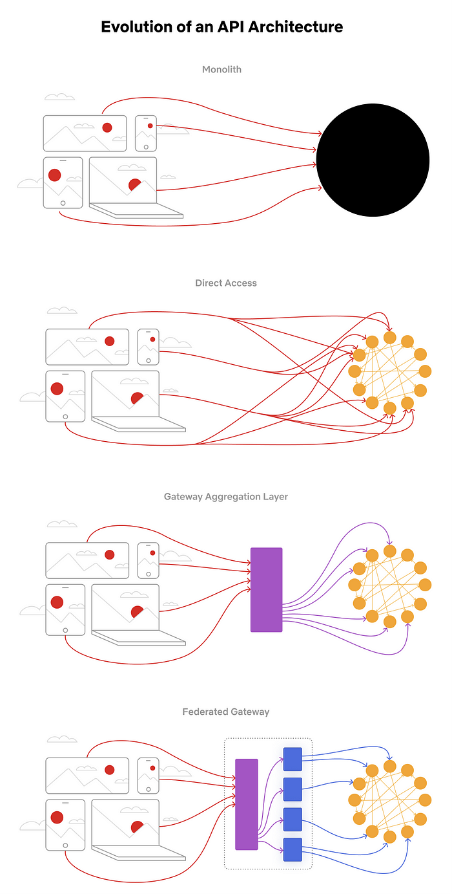
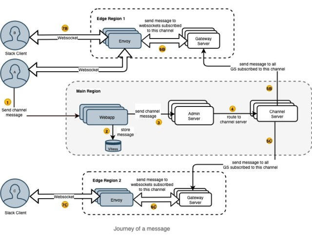
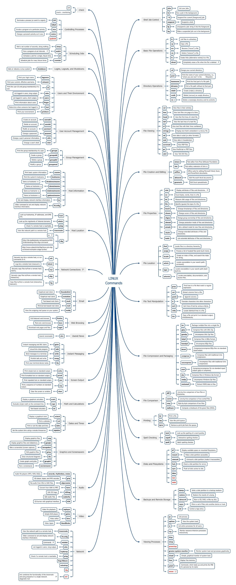

# Evolution of the Netflix API Architecture

This week’s issue brings to you the following:

- **Evolution of the Netflix API Architecture**
- **Why Amazon Abandoned Microservices Architecture in Favor of Monolith?**
- **How Slack Send a Message to a Million Clients in Real Time**

So, let’s dive in.

---

## Evolution of the Netflix API Architecture

Netflix's highly scalable and loosely linked microservice architecture is well known. Independent services provide independent scaling and varied rates of evolution. Yet, they increase the complexity of use cases involving several services. Netflix provides a uniform API aggregation layer at the edge rather than making hundreds of microservices available to UI developers.

During that time, Netflix API architecture went through 4 main stages:

1. **Monolith**: A complete application is packaged as a single deployment unit.
2. **Direct Access**: This architecture enables client apps to hit the microservices, which is unsuitable for many clients.
3. **Gateway Aggregation Layer**: Netflix observed a lot of duplicative data fetching, so it built a graph API to provide unified abstraction over data and relationships.
4. **Federated Gateway**: As the number of consumers and the amount of data in the graph increased and the API team was disconnected from the domain expertise, they introduced a federated gateway to provide a unified API for consumers while giving backend developers flexibility and service isolation.

Their **GraphQL Gateway** is based on Apollo’s reference implementation and is written in Kotlin.

Evolution of an API Architecture (Credits: Netflix)

Read more in **[link 1](https://netflixtechblog.com/how-netflix-scales-its-api-with-graphql-federation-part-1-ae3557c187e2)** and **[link 2](https://netflixtechblog.com/how-netflix-scales-its-api-with-graphql-federation-part-2-bbe71aaec44a)**.

---

## Why Amazon Abandoned Microservices Architecture in Favor of Monolith?

In the **[latest post](https://www.primevideotech.com/video-streaming/scaling-up-the-prime-video-audio-video-monitoring-service-and-reducing-costs-by-90)**, a team working on Amazon Prime Video explained their approach to ensuring customers receive high-quality content. They use a tool to monitor every stream viewed by customers and use it to identify quality issues.

The tool was intended to run on a small scale, so they noticed that **onboarding more streams to the service was very expensive**. So, they decided to revise the architecture.

The initial architecture consisted of s**erverless components orchestrated by AWS Step Functions**. What they did here is to move expensive operations between components into a single process to keep the data more trans within process memory.

Building initial solutions with serverless components was a good choice because it enabled it to be done quickly and scale each component, yet such a way of using some components **caused issues at 5% of the expected load**.

After the analysis, they concluded that the distributed approach didn't bring many benefits, so they packed all the components into a single process. **Moving their service to a monolith reduced their infrastructure cost by over 90% and increased scaling capabilities.**

The updated architecture for monitoring a system (Source: Amazon Prime Tech)

---

## **How Slack Send a Message to a Million Clients in Real Time**

Usually, Slack sends millions of messages daily on different real-time channels. As a result, they have peak times, which are generally during work hours locally.

Their architecture consists of a core service written in Java.

1. **Channel Servers** - are stateful, in-memory servers with some channel history. They are mapped to a subset of channels; every server sends and receives messages for those channels.
2. **Gateway Servers** - are in-memory servers that hold user information. They are an interface between Slack clients and Channel Servers. They are deployed in multiple regions.
3. **Admin Servers** - are the in-memory interfaces between the web app backend and Channel Servers.
4. **Presence Servers** - are in-memory to track users online and show green dots.

Every Slack client has a persistent WebSocket connection to Slack servers to receive real-time events. At the app's start, it fetches settings from the web app backend, the Hacklang codebase that hosts all their APIs. It also consists of **JavaScript code to render Slack clients**, which make a WebSocket connection to the nearest regions (Envoy proxy and Gateway Servers).

Once everything is set up, sending a message to a channel is broadcasted to all clients online in the channel. What is happening here:

1. **The client hits Webapp API** to send a message.
2. **Webapp then sends that message to the Admin Server**, which looks at the channel ID in the message.
3. The **message is routed to the appropriate Channel Server**, which, when it receives the message, sends it out to every gateway server across the world that is subscribed to the channel.

To read more, check **[the text](https://slack.engineering/real-time-messaging/)** from the Slack Engineering blog.

Credits: Slack Engineering

---

## Bonus: Linux Commands Cheat Sheet

An excellent overview of all Linux commands, such as:

- Basic File Operations: ls, cp, mv, rm, ...
- File Viewing: cat, less, head, tail, nl, ...
- Dates and times: xclock, cal, date, ...
- Network: traceroute, ifconfig, netstat, who, ...
- Viewing Processes: ps, uptime, w, top, ...

Linux Commands (Credits: kPastor)

Check the high-resolution image **[here](https://xmind.app/m/WwtB/)**.

---

## More ways I can help you

1. **1:1 Coaching:** [Book a working session with me](https://newsletter.techworld-with-milan.com/p/coaching-services). 1:1 coaching is available for personal (leadership) and organizational/team growth topics. Let’s win together 🚀.
2. **[Promote yourself to 14,000+ subscribers](https://newsletter.techworld-with-milan.com/p/sponsorship-of-tech-world-with-milan)**by sponsoring this newsletter.

---

Thanks for reading Tech World With Milan Newsletter! Subscribe for free to receive new posts and support my work.