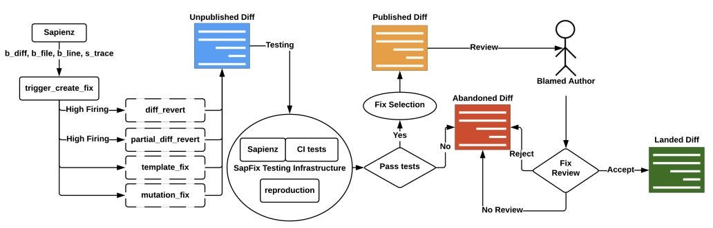
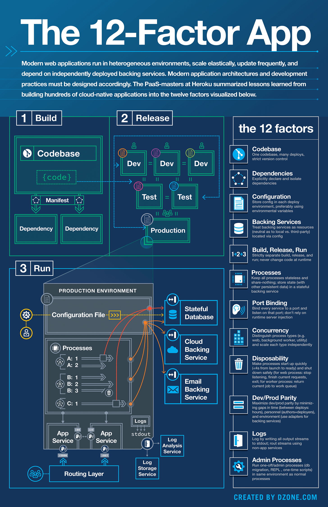
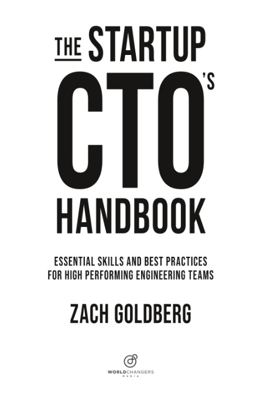

# Facebook created a tool which detect and repair bugs automatically

The [recent document](https://ieeexplore.ieee.org/document/8804442) by Facebook engineers explains how they wrote a tool that can automatically fix bugs. In the paper, they introduced **SAPFIX**, an automated tool designed to detect and repair bugs in software. The tool has suggested fixes for six essential Android apps in the Facebook App Family: Facebook, Messenger, Instagram, FBLite, Workplace, and Workchat.

How Does It Work?

**Step 1:** **Detect a Crash** - Another tool, Sapienz, finds app crashes. When Sapienz identifies a crash, it is logged into a database.

**Step 2:** **Identify the Problem**—SAPFIX pinpoints the exact line of code causing the issue. It first checks if the crash is reproducible. If it's not, the crash is discarded. It uses a technique called "spectrum-based fault localization" to identify the most likely lines of code responsible for the crash.

**Step 3:** **Suggest a Fix** - Using predefined templates or code mutations, SAPFIX proposes a solution. After identifying the fault location, SAPFIX attempts to generate a patch. It employs two strategies:

- **Template-based Fixing**: SAPFIX suggests fixes for common bugs using predefined templates designed based on standard developer practices.
- **Mutation-based Fixing:** If the template-based approach fails, SAPFIX resorts to a mutation-based system. It systematically applies a series of code mutations to the fault location to generate potential fixes.

**Step 4: Test the Fix**—The proposed solution is tested to ensure its validity. It uses the test cases from Sapienz to check the patch's validity. If the patch passes all tests, it's considered a good fix. After patch validation, SAPFIX uses Infer (a static analysis tool) to analyze the proposed fix further. Infer checks if the patch introduces any new potential issues.

**Step 5: Review** - Developers get the final say, reviewing and approving the fix.

To learn more about it, check the **[entire document](https://ieeexplore.ieee.org/document/8804442)**.

SAPFIX Flow (Credits: Facebook)

---

## What is the Twelve-Factor App?

It [describes many well-tested architectural patterns](https://12factor.net/) and best practices for software-as-a-service (SaaS) applications. Thanks to these best practices, apps can be created with portability and resilience when deployed to the web.

It was created by engineers at Heroku, a cloud platform-as-a-service company, around 2011. Adam Wiggins, a co-founder of Heroku, played a significant role in articulating and promoting these principles. This framework continues to be influential, aiding in designing and deploying scalable and maintainable software applications.

The Twelve Factors:

1. **Codebase** - One codebase tracked in revision control, many deploys
2. **Dependencies** - Explicitly declare and isolate dependencies
3. **Config** - Store config in the environment
4. **Backing services** - Treat backing services as attached resources
5. **Build, release, run** - Strictly separate build and run stages
6. **Processes** - Execute the app as one or more stateless processes
7. **Port binding** - Export services via port binding
8. **Concurrency** - Scale out via the process model
9. **Disposability** - Maximize robustness with fast startup and graceful shutdown
10. **Dev/prod parity** - Keep development, staging, and production as similar as possible
11. **Logs** - Treat logs as event streams
12. **Admin process** - Run admin/management tasks as one-off processes

The 12-Factor App (Credits DZone)

### Beyond the twelve-factor application

Also, in the book "*[Beyond the 12 Factor App"](https://www.oreilly.com/library/view/beyond-the-twelve-factor/9781492042631/)*, Kevin Hoffman presents new guidelines that build on the original 12 factors but include elements such as telemetry and security:

1. **One codebase, one application** - Applications and repositories should be one-to-one.
2. **API first** - Make your API a first-class citizen in your development process.
3. **Dependency management** - Define dependency for each application.
4. **Design, build, release, and run** - We must define our development process in these four steps and execute them independently.
5. **Configuration, credentials, and code** - Manage configuration, credentials, and code separately.
6. **Logs** - We want to treat logs as event streams and use tools to analyze them.
7. **Disposability** - Make the possibility to restart your apps quickly.
8. **Backing services** - Define backend services and connect them via Cloud functions.
9. **Environment parity** - All environments should be the same.
10. **Administrative processes**—Such as DB migrations or batched jobs—should be run as a separate function from the application.
11. **Port binding** - Mapping application ports to actual ports on the Cloud infrastructure.
12. **Stateless processes** - We want the possibility to restart the server quickly at any time.
13. **Concurrency** - Design your applications so they can handle multiple processes.
14. **Telemetry** - Create a way to measure the application's performance (logs, domain telemetry, APM, etc.).
15. **Authentication and authorization** - Implement security from the beginning of your project.

Also, check IBM's view on this topic: “*[Beyond the 12 factors: 15-factor cloud-native Java applications](https://developer.ibm.com/articles/15-factor-applications/)*”.

---

## Bonus: **The Startup CTO’s Handbook**

Check this [useful (free) handbook](https://github.com/ZachGoldberg/Startup-CTO-Handbook), created by Zach Goldberg, which covers some essential topics for all tech leaders, such as:

- **Leadership**
- **Engineering management**
- **Different tech topics (architecture, Testing, DevOps, etc.)**

The Startup CTO’s Handbook by Zach Goldberg

---

## More ways I can help you

1. **1:1 Coaching:** [Book a working session with me](https://newsletter.techworld-with-milan.com/p/coaching-services). 1:1 coaching is available for personal and organizational/team growth topics. I help you become a high-performing leader 🚀.
2. **[Promote yourself to 18,000+ subscribers](https://newsletter.techworld-with-milan.com/p/sponsorship-of-tech-world-with-milan)**by sponsoring this newsletter.

---

Thanks for reading Tech World With Milan Newsletter! Subscribe for free to receive new posts and support my work.