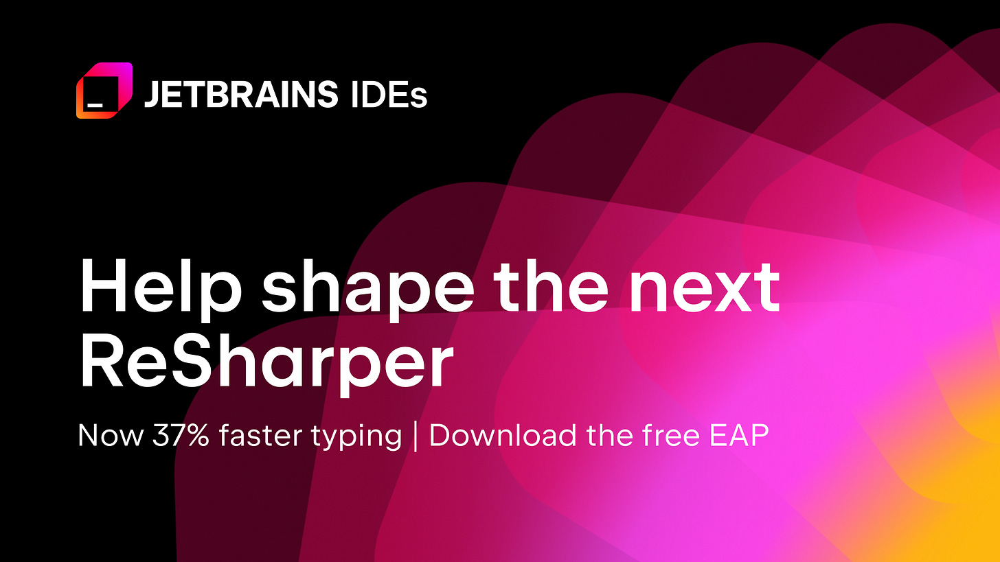
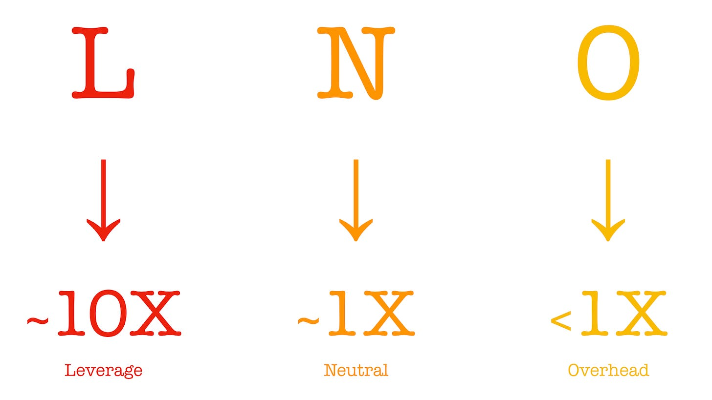
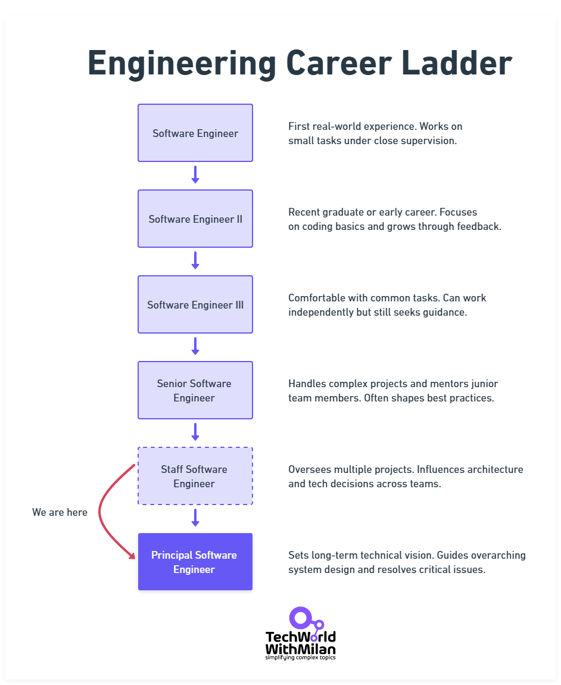
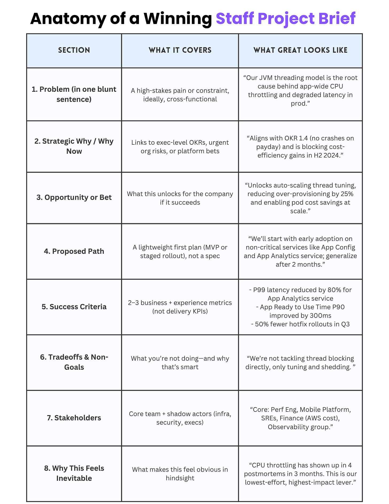
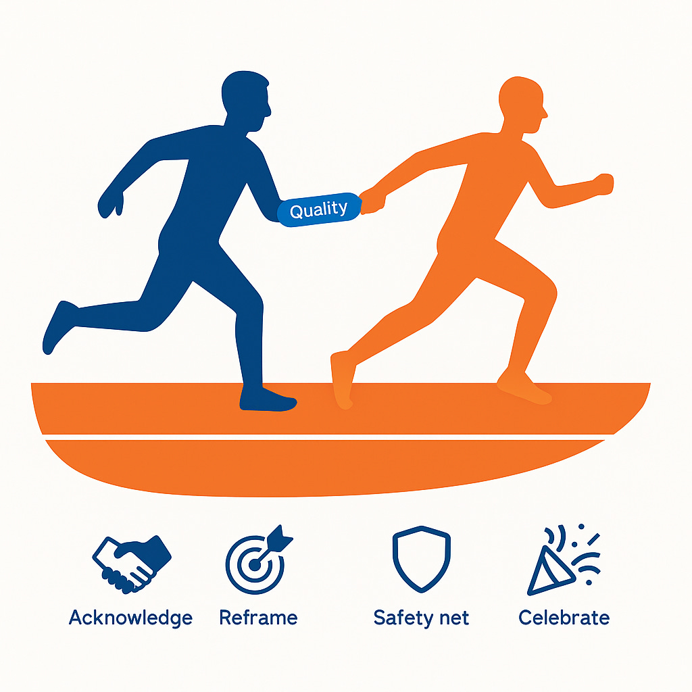
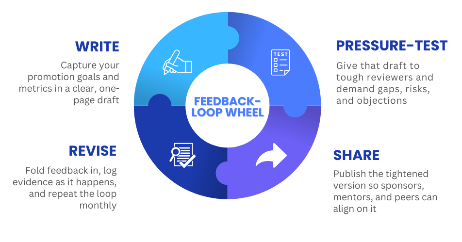
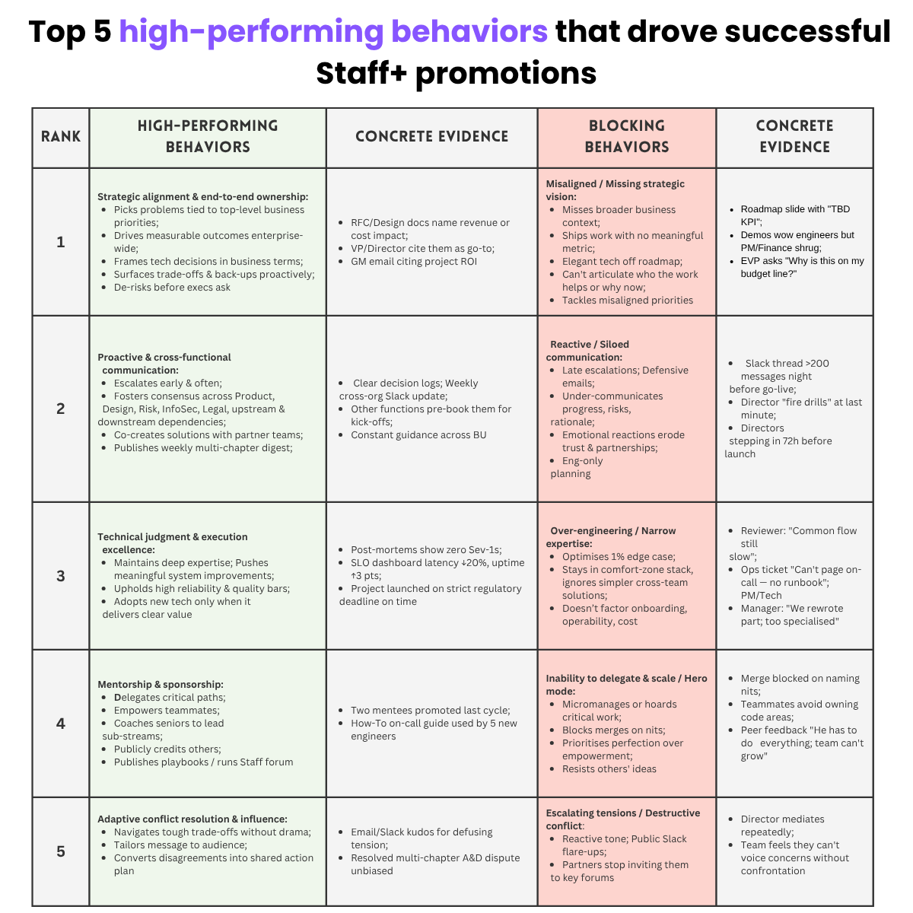
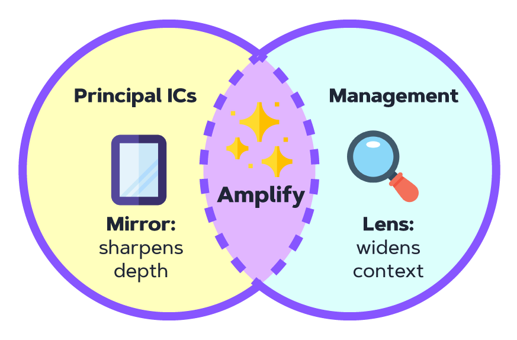
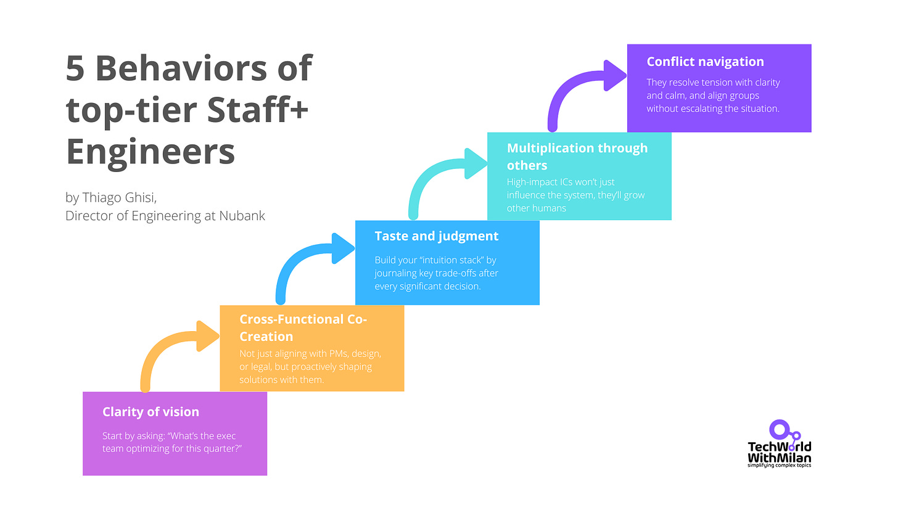

# From Staff to Principal: The Playbook for 10x Influence

*An interview with Thiago Ghisi, Director of Engineering at Nubank.*

Most engineers think the way to Staff+ is “write more code.” [Thiago Ghisi](https://www.linkedin.com/in/thiagoghisi) proves it’s the opposite. After **scaling Nubank’s mobile platform to 100 M users and 2K developers**, he learned that real leverage comes from shaping systems, not shipping lines.

In this interview, we unpack the mind-shifts, rituals, and **playbooks that separate solid seniors from true Staff engineers**. We’ll learn how to quantify company-level impact, craft briefs that feel inevitable, and coach teams to deliver without you being on the critical path.

At the end, you’ll know **how to spot high-leverage work**, write briefs that feel inevitable, and prove impact in language that executives respect.

So, here is the agenda:

1. **Who is Thiago?**Nubank Engineering Director who led a 30 → 100-engineer org and drove a full Server-Driven UI re-architecture.
2. **Code ≠ Impact.**Why LOC is a weak lever and how the L-N-O framework forces you toward exponential wins.
3. **New rules for staff.**“What got you here won’t get you there,” and the art of orchestrated delegation.
4. **Measuring company impact.**Utilize business KPIs, cross-organizational pull, and the “Number of Ships” heuristic to demonstrate value.
5. **Strategic wandering ritual.**Weekly calendar space for outside-team conversations that surface hidden bets and risks.
6. **Anatomy of a winning brief.**The first-page template that aligns strategy, names trade-offs, and earns instant trust.
7. **Coaching through quality fear.**Script to let high performers ship through others, and why a short dip is a feature.
8. **Promotion blueprint.**Write, pressure-test, and iterate your Staff-level expectations before anyone else does.
9. **Promotion committee red flags.**Two patterns that instantly signal you’re still playing at Senior altitude.
10. **Staff vs Principal vs Management.**How to balance IC depth with management lenses to expand your blast radius.
11. **Future IC superpowers.**Clarity of vision, cross-functional co-creation, taste, multiplication, and conflict navigation.

So, let’s dive in.

---

## [ReSharper in OOP Mode: Now Available for Public Preview and Testing (Sponsored)](https://lp.jetbrains.com/resharper-oop/?utm_source=newsletter_milan_milanovic&utm_medium=cpc&utm_campaign=resharper_oop_eap&utm_content=how-to-try-resharper-in-out-of-process-mode)

*Help us test ReSharper's fastest build yet: the 2025.2 EAP moves its engine out of Visual Studio and cuts median typing lag by 37%. Spin it up in an experimental VS instance and tell us if it's 🐞 or 👍:*

[Start here](https://lp.jetbrains.com/resharper-oop/?utm_source=newsletter_milan_milanovic&utm_medium=cpc&utm_campaign=resharper_oop_eap&utm_content=how-to-try-resharper-in-out-of-process-mode)

---

**[Sponsor this newsletter](https://newsletter.techworld-with-milan.com/p/sponsorship-of-tech-world-with-milan)**

## 1. Who is Thiago?

[Thiago Ghisi](https://www.linkedin.com/in/thiagoghisi/) is a seasoned engineering leader and former Director of Engineering at Nubank, where he scaled the Mobile Platform Organization to support over 100 million users and more than 2,000 developers. He led foundational rearchitectures, including the full adoption of Server-Driven UI, drove major app and infrastructure-wide performance improvements, and grew his team from 30 to over 100 people.

Before joining Nubank, **Ghisi held engineering leadership roles at Apple, American Express, and ThoughtWorks**, shaping organizations, platforms, and products while mentoring Staff and engineers to lead at scale.

These days, he shares his experience through writing, speaking, and select advisory work focused on org design, platform modernization, and building Staff+ & EM+ career development and performance systems.

Thiago Ghisi - Director of Engineering @ Nubank

## 2. Senior engineers often think, “More code, more impact.” Is this true?

**First belief to drop:** *output equals outcome.* At Staff+ altitude, you stop building software and start building the *conditions* under which great software (and business value) emerge. Lines of code are just one, often low‑leverage, instrument in that orchestra.

Leverage lives in the *multipliers*: I love [Shreyas Doshi](https://open.substack.com/users/5984202-shreyas-doshi?utm_source=mentions) **L‑N‑O framework (Leverage, Neutral, Overhead)** because it forces you to ask, “Is this task the highest multiplier available?” Most code-centric tasks fall into neutral territory, with a linear return on investment.

Instead, unblock ten squads, write a critical RFC, set a new API contract, or de‑risk a bet, and you create exponential leverage. More here: [Advanced time management principles - LNO Framework by Shreyas Doshi.pdf](https://drive.google.com/file/d/1GAoFoY4lmp1ERAQ0FjAMUu6sWRrbUt4-/view?usp=sharing)

L‑N‑O framework (Leverage, Neutral, Overhead) by Sheryas Doshi

That shift also  requires you to **intentionally block time on your calendar for deep work and “wandering around”**. Without blocks of time in your calendar and especially mental space to explore adjacent problems, map decision debt, talk to different people, read random docs, attend leadership meetings, scan through non-engineering Slack channels, or coach/pair with less experienced engineers as opportunity arises, you default to the default dopamine of coding and to falling back to coding things yourself when the leverage of the hour invested there are mostly neutral, Will Larson calls this "**[snacking](https://staffeng.com/guides/work-on-what-matters/)**".

Finally, measure yourself the way executives do: *Did it impact any business KPIs?* If the answer requires a Git diff, you’re still acting as a Solver.

## 3. You say *what got you here won’t get you there.* What does this mean?

Successful seniors are expert problem [solvers](https://rkoutnik.com/2016/04/21/implementers-solvers-and-finders.html): they head down for a few days, pull an all‑nighter if needed, and emerge with a heroic PR. At the Staff level, the same habits become a liability. The more you code things yourself, the more you bottleneck learning, ownership, and ultimately velocity.

**Replacement habit:** *Orchestrated Delegation.* Sketch the solution *just far enough*, an architecture diagram, guard rails, and a definition of “good.” Then pull less experienced engineers into the driver's seat. Your win condition shifts from “I shipped” to “They shipped without me in the critical path”, even if quality or consistency with overall standards is a bit lower than usual.

This requires a second muscle: ***selective deep diving***. At the org scope, you can’t lead every project end‑to‑end. You need to learn to dive deep when signal‑to‑noise=friction spikes, then resurface quickly so you can scan for the next emergent risk.

Here are a few examples of what I mean by selectively deep diving: you see two engineers struggling for days to decide what framework to use for a critical project on a deadline, and you see 100+ replies on a Slack thread on something that seems more like a “political debate”.

Instead of jumping in with your “hot takes”, you bring the two engineers on a call, ask them to explain the main trade-offs, and help them to make a decision and move on. You return to the Slack thread and conclude the “unproductive debate” by sharing the final decision.

You see a team blocked because they don't have the API contracts. You go to talk to the API provider team, and you find that they only have a junior engineer working on it, who is struggling to make progress. You speak with the Engineering Manager, and they inform you that the two other seniors are on vacation for the next three weeks, and the only other engineer available is on-call, dealing with numerous production incidents.

You are aware that this project is critical for regulatory reasons, and the company would be in a difficult position if it were delayed. You clear your calendar and pair with this junior engineer for the following three afternoons to finalize a solid version of the API contracts and get them out the door.

You let the junior engineer drive; you don't take over, but being present with them, you can quickly direct  or share the context - about the domain, the company, the overall codebase architecture or engineering principles you use - they have missing to analyse trade-offs, make decisions and ultimately unblock them on the spot. You make three weeks of progress in three afternoons of pairing.

**Drop “I’m the smartest person in the room and I will show everyone that attitude.”** **Adopt “I'm a force multiplier for everyone in the room, even if I have to look dumb or do things to help others that I think are too basic for me.”**

## 4. How do you *quantify* company-level impact?

Company-level impact is evident in three key areas: **business, customers, and colleagues.**

On the **business side**, think revenue gains, cost savings, or platform work that changes the cost structure across multiple services. On the **customer side**, consider significant improvements in performance, reliability, or user experience that can be scaled and implemented. On **the org side**, think adoption: when multiple teams choose your solution without you needing to convince them.

But impact isn’t just about the “what”, it’s about the ripple. If your work affects multiple business lines or directly supports one of the company’s top 3-5 annual priorities, it’s a strong signal.

Impact ripples: business → customer → org

One test I use: ask an engineer what happened after their last feature shipped. If the answer stops at “then we handed it to ops,” there’s a gap. **Great engineers can tell you the business outcome, what improved, who was affected, and why it mattered.**

Here is a high-level company-level impact checklist that I like to use:

1. **📈 Business KPIs move** - revenue per active user, cost‑per‑request, NPS, or whatever lives on the CFO’s dashboard.
2. **🧲 Cross‑org adoption** - other teams voluntarily adopting your platform, API, or playbook. Organic pull beats mandated push.
3. **🎯 Exec‑level OKR alignment** - your work impacts directly a top‑5 company priority.
4. **🌐 Multi-surface reach** - a change that improves both search and ads, or docs and YouTube, or both - is unmistakably company-level.

I love Will Larson’s “**Number of Ships**” heuristic: *How many business‑meaningful releases reached prod last month, and what was the delta in money, experience, or reliability?* Show that in your promotion packet, and the story tells itself.

## 5. What concrete weekly ritual helps an IC keep today’s sprint humming while planning 12-18 months out?

Make time to zoom out, and make it a ritual.

The best ICs I’ve seen **carve out recurring space each week for what I call strategic wandering**: conversations outside their team, questions that stretch beyond the current sprint, and slow and deep thinking about long-term bets. This isn’t free time; it’s where the seeds of Staff+ leverage get planted.

They build relationships with people outside their function and level, including project managers, directors, and even those in legal or finance. They ask: “***What’s coming that engineering isn’t seeing yet?**”* or “***What feels blocked or messy, and why?***” These conversations create context and goodwill, and that context sharpens their pattern-matching over time.

Without that outside-in muscle, you’ll keep executing well on the wrong priorities. The calendar won’t save you; only disciplined curiosity will.

Team conversations (Image: Freepik)

## 6. Walk us through the first page of a winning staff-project brief, fields, stakeholders, and success criteria you expect to see

A great Staff Project doesn’t just look good; it feels inevitable to the reader. I used to joke with my Staff Engineers that a great RFC or **a great staff project almost feels like it was written after the solution was already done** (and not before), after the POC had already proven itself, after the path was pretty straightforward. It is super counterintuitive, but a winning staff project feels almost like a press release. It may be incorrect, but it is never ambiguous. It is not sitting on the fence; it has a clear and direct path ahead.

The first page should include: t**he strategic context (“Why now?”), the opportunity or bet being made (“What could this unlock?”), the proposed path (“How will we approach this?”), and clear definitions of success and non-goals.** Bonus points for showing a few meaningful tradeoffs upfront.

The best staff-project briefs are specific enough that people can picture the outcome, but open enough to adapt as complexity unfolds. They mention the core stakeholders across teams, as well as the shadow stakeholders, those who could block or accelerate success. And they demonstrate how this project aligns with the company’s most pressing priorities, not just those of engineering.

If the doc only resonates inside your team, it’s not a staff project yet.

Anatomy of a Winning Staff Project Brief (Real example, slightly anonymized)

These elements aren’t just boxes to tick; they reflect deep patterns I’ve seen across dozens of successful Staff Projects. When you step back, you start to notice what separates a compelling brief from a forgettable one.

Below are the recurring traits that consistently appear in high-leverage, promotion-worthy projects.

### **Patterns from strong Staff plus project briefs:**

- **🎯 Strategic framing upfront**. Not “here’s a cool idea” but “here’s the systemic root cause tied to a burning OKR.”
- **🏢 Company-first thinking**. The brief resonates with **org-wide language**, not just local team goals.
- **⚖️ Explicit tradeoffs**. Strong briefs name what they’re **not** solving. This gives confidence that you know the scope.
- **🌐 Multi-scale impact**. Business + tech + culture. E.g., “Reduce blast radius,” “Improve developer satisfaction,” “Increase app performance.
- **🛠️ Concrete but flexible path**. MVP or Phase 1 is described clearly, but not overcommitted to specs.
- **🕵️‍♂️ Pre-mortem lens**. What could go wrong? Where are the risks (adoption, instrumentation, rollout)?

A great Staff Project brief doesn’t just describe a solution. It aligns strategy, earns trust, and makes the payoff impossible to ignore. That’s what separates a good RFC from a Staff+ milestone.

## 7. High performers fear that work quality will drop if they let go. What coaching script do you use to break that barrier?

“Quality will dip, and that’s the *point*.” It’s a feature, not a bug. Shipping without your hands on every line will reveal process gaps that are masked when you are involved. Your job now is to uncover those gaps early, fix them systematically, and raise the team’s ceiling.

Script:

1. **😌 Acknowledge fear.** “You care about the bar for quality staying high, good.”
2. **🎯 Reframe success.** “Your new KPI is ‘team ships at the same quality bar without you.’”
3. **🛡️ Safety net.** “We’ll run tight retros on the first two sprints. If quality tanks, *you* design the guardrail, *they* implement it.”
4. **🎉 Celebrate transfer moments.** Publicly credit the team when they ship autonomously; private kudos reinforce the shift in identity.

Within two cycles, most engineers realise that leverage and impact feel better than heroism.

Pass the baton: quality scales with the team

## 8. In orgs without formal expectation calibration, what “scrappy” steps can an engineer take to bullet-proof their promotion case?

Write it down. Pressure-test it. Share it widely. Revise. Repeat.

Start by **drafting your expectations for the next level**, aligning them with business priorities and scoped to your organization’s reality. Then **run it by your manager, skip-level mentors, and anyone who has recently been promoted to that level**. Ask: “*Would accomplishing everything that is here in this doc get me promoted*? If not, why not? What is missing?”

Push for specificity: “*Is this enough to be rated as ‘redefines expectations*”? What would make it undeniable?” That forces absolute calibration and real commitment from your reviewers. You’re not just building clarity for yourself, you’re enrolling others in your growth.

**Promotion is not just about doing the work; it's also about being recognized for it. It’s about building the story, aligning the timing, and making the signal unmistakable.**

Write your expectations, circulate them with the manager, skip mentors, and especially recently promoted peers. Ask one blunt question: *“Is this bar high enough for ‘*frequently exceeds*’ rating?”* That wording forces reviewers to commit, not rubber-stamp. Keep a living doc of evidence mapped to each expectation, ships, metrics, and testimonials. **Calibration, in writing, beats slide‑deck theater.**

Keep in mind that writing your expectations down is just the first step. To avoid surprises, align closely with your manager on what truly constitutes "Staff-level" work. At Nubank, we call this *"**Expectations Calibration**"*.

Once documented, **proactively share your expectations with senior peers, trusted mentors, and key stakeholders**. While you don’t explicitly ask stakeholders if the project guarantees promotion, clarity with your manager and senior peers is essential; they'll advocate for you in promotion discussions.

Feedback-loop promotion wheel

Establish monthly or quarterly **checkpoints** to review project progress with your manager. Use a simple "**green/yellow/red**" assessment to easily recalibrate as business priorities or organizational contexts shift easily, ensuring your project remains impactful and aligned.

## 9. As a promotion committee insider, what two signs tell you *immediately* that an engineer isn’t yet operating at staff-plus?

First: **lack of mentorship**. Staff+ engineers scale themselves through others. If there are no examples of coaching, sponsoring, or accelerating peers, that’s a clear red flag.

Second: **reactive communication**. If they surface risks too late, fail to name tradeoffs early, or can’t frame decisions in cross-functional terms, they’re not operating at the staff level in my opinion. Staff+ isn't about heroism, it’s about foresight, clarity, and orchestration.

If someone still needs to be told what to do or can’t make an impact through others, they’re probably not ready yet.

After serving on over 50 staff promotion committees and performance calibrations as a Director from 2019 to 2024, I noticed specific patterns that consistently emerged.

I’ve identified, clustered, and stack-ranked the **Top 5 high-performing behaviors that drove successful Staff+ promotions**, and the Top 5 most common behavioral patterns that consistently stalled performance or blocked them (leaving people stuck at the Senior level for years, and in some cases even decades).

Top 5 high-performing behaviors that drove successful Staff+ promotions

## 10. When an engineer reports to Staff, how should they weigh the Principal IC and management roles to maximize their impact?

When you hit Staff, your leverage no longer comes from being the most intelligent person in the room; it **comes from knowing*****which*****rooms to walk into and*****who*****to bring with you**. One of the most underrated decisions at this level is how you weigh relationships with other Staff-Plus-level ICs (Principals, Distinguished Engineers) and management-level peers, Directors, VPs, and even EMs inside and outside your group or department. Both are critical, but the value and perspective they bring are different, and understanding how to utilize that asymmetry is key to expanding your influence.

**Principal ICs are your mirror.**They help sharpen your technical thinking, pressure-test ambiguous bets, and expose you to scale patterns that haven’t yet shown up in your domain. These relationships are where you dry-run architecture shifts, rehearse cross-team strategies, and learn what “great” looks like outside your sandbox. If you're the kind of Staff who wants to go deeper or broader on the IC track, this group keeps your edge sharp and shows you what “Staff++” can mean.

**Management, on the other hand, is your lens**. Directors and VPs don’t just care about elegance; they care about trade-offs, timing, and second-order effects across the business or the culture. Running your early-stage ideas by them is like attaching a macroeconomic model to your local initiative. You’ll start to hear what’s invisible at your level: which execs are skeptical, where the political landmines are, how this project fits (or doesn’t) with the company’s current bets. Over time, if you learn to map your work to *their* constraints, you become someone they pull into the room, not just someone they delegate to.

Depth + Context = Amplified Impact

To maximize your blast radius, you need both. **Treat Principal ICs like sparring partners, and Directors/VPs like navigators of systems.** But here’s the real unlock: don’t just learn *from* them, create value *with* them. Help a VP frame a complex technical trade-off for their peers. Co-design a cross-organizational initiative with a Principal in another domain. Those are the moments that build real credibility, and that’s what scales your influence faster than any title ever could.

In short, **blast radius at*****the*****Staff level isn’t just about execution, it’s about amplification**. And who you choose to amplify matters as much as what you're amplifying.

## 11. Looking five years ahead, what new skills or behaviors will define top-tier IC influence that today’s engineers should start learning now?

I firmly believe the fundamentals will remain the same, but the expectations will be higher, and the environment will be more complex. Top-tier ICs won’t just be great builders. **The best ICs will shape strategy, not just implement it.**They’ll influence through clarity, trust, and well-placed leverage, not headcount or title.

Here are five behaviors I believe will define top-tier Staff-Plus ICs in the next five years:

1. **🔭 Clarity of vision:** The ability to name, in plain language, what the business is betting on, and where technology can bend the curve.

➡️ **How**: *Start by asking: “What’s the exec team optimizing for this quarter?”*
2. **🤝 Cross-Functional Co-Creation:**Not just aligning with PMs, design, or legal, but proactively shaping solutions with them. The best ICs will receive early signals from every corner of the organization and integrate them into a better system design.

➡️ **How**: *Shadow key meetings, then initiate a deep dive in cross-discipline per quarter, read a foundational introductory book on the topic, do a course, and test your understanding with your cross-functional partners.*
3. **🧠 Taste and judgment:** Engineering wisdom will matter more than raw output. Knowing when to spike, when to simplify, when to say no, and when to ship something uncomfortably early—this is what separates seniors from Staff.

➡️ **How**: *Build your “intuition stack” by journaling key trade-offs after every significant decision. Write down your Engineering Principles. Collect examples of good taste in RFCs, Code, Architecture, Books…*
4. **🌱 Multiplication through others:** High-impact ICs won’t just influence the system, they’ll grow other humans. Mentorship, sponsorship, and building alliances will be key to long-term influence.

➡️ **How**: *Positive feedback is a much more powerful tool than negative feedback. Don't wait until your entire career to realize that, finally. When sharing positive feedback with your mentors, sponsors, peers, and leadership, be specific about the aspects of their behaviors or results you would like to see more of.*
5. **🧭 Conflict navigation:** They resolve tension with clarity and calm, and align groups without escalating the situation.

➡️ **How**: *Practice reframing disagreements in terms of shared goals, not positions.*

Top 5 behaviors of top-tier Staff+ Engineers

These skills aren’t tied to any one company or tech stack. They are how humans collaborate. They’ll outlast every tool you use today.

## **More ways I can help you:**

- [📚](https://www.patreon.com/techworld_with_milan/shop/ultimate-net-bundle-for-2025-1519389?utm_medium=clipboard_copy&utm_source=copyLink&utm_campaign=productshare_creator&utm_content=join_link)**[The Ultimate .NET Bundle 2025](https://www.patreon.com/techworld_with_milan/shop/ultimate-net-bundle-for-2025-1519389?utm_medium=clipboard_copy&utm_source=copyLink&utm_campaign=productshare_creator&utm_content=join_link)** 🆕. 500+ pages distilled from 30 real projects show you how to own modern C#, ASP.NET Core, patterns, and the whole .NET ecosystem. You also get 200+ interview Q&As, a C# cheat sheet, and bonus guides on middleware and best practices to improve your career and land new .NET roles. **[Join 1,000+ engineers](https://www.patreon.com/techworld_with_milan/shop/ultimate-net-bundle-for-2025-1519389?utm_medium=clipboard_copy&utm_source=copyLink&utm_campaign=productshare_creator&utm_content=join_link)**. (*Use discount code **C552A** for 39% off until the end of the week*)
- [📦](https://www.patreon.com/techworld_with_milan/shop/premium-resume-package-1721454?utm_medium=clipboard_copy&utm_source=copyLink&utm_campaign=productshare_creator&utm_content=join_link)**[Premium Resume Package](https://www.patreon.com/techworld_with_milan/shop/premium-resume-package-1721454?utm_medium=clipboard_copy&utm_source=copyLink&utm_campaign=productshare_creator&utm_content=join_link) 🆕**. Built from over 300 interviews, this system enables you to craft a clear, job-ready resume quickly and efficiently. You get ATS-friendly templates (summary, project-based, and more), a cover letter, AI prompts, and bonus guides on writing resumes and prepping LinkedIn. **[Join 500+ people](https://www.patreon.com/techworld_with_milan/shop/premium-resume-package-1721454?utm_medium=clipboard_copy&utm_source=copyLink&utm_campaign=productshare_creator&utm_content=join_link)**. (*Use discount code **FF558** for 30% off until the end of the week*)
- [📄](https://www.patreon.com/techworld_with_milan/shop/complete-tech-resume-reality-check-311008?utm_medium=clipboard_copy&utm_source=copyLink&utm_campaign=productshare_creator&utm_content=join_link)**[Resume Reality Check](https://www.patreon.com/techworld_with_milan/shop/complete-tech-resume-reality-check-311008?utm_medium=clipboard_copy&utm_source=copyLink&utm_campaign=productshare_creator&utm_content=join_link)**. Get a CTO-level teardown of your CV and LinkedIn profile. I flag what stands out, fix what drags, and show you how hiring managers judge you in 30 seconds. **[Join 100+ people](https://www.patreon.com/techworld_with_milan/shop/complete-tech-resume-reality-check-311008?utm_medium=clipboard_copy&utm_source=copyLink&utm_campaign=productshare_creator&utm_content=join_link)**.
- [📢](https://www.patreon.com/techworld_with_milan/shop/short-linkedin-content-creator-311232?utm_medium=clipboard_copy&utm_source=copyLink&utm_campaign=productshare_creator&utm_content=join_link)**[LinkedIn Content Creator Masterclass](https://www.patreon.com/techworld_with_milan/shop/short-linkedin-content-creator-311232?utm_medium=clipboard_copy&utm_source=copyLink&utm_campaign=productshare_creator&utm_content=join_link)**. I share the system that grew my tech following to over 100,000 in 6 months (now over 255,000), covering audience targeting, algorithm triggers, and a repeatable writing framework. Leave with a 90-day content plan that turns expertise into daily growth. **[Join 1,000+ creators](https://www.patreon.com/techworld_with_milan/shop/short-linkedin-content-creator-311232?utm_medium=clipboard_copy&utm_source=copyLink&utm_campaign=productshare_creator&utm_content=join_link)**.
- [✨](https://www.patreon.com/c/techworld_with_milan)**[Join My Patreon](https://www.patreon.com/c/techworld_with_milan)**[https://www.patreon.com/c/techworld_with_milan](https://www.patreon.com/c/techworld_with_milan)**[Community](https://www.patreon.com/c/techworld_with_milan) and [My Shop](https://www.patreon.com/c/techworld_with_milan/shop)**. Unlock every book, template, and future drop, plus early access, behind-the-scenes notes, and priority requests. Your support enables me to continue writing in-depth articles at no cost. **[Join 2,000+ insiders](https://www.patreon.com/c/techworld_with_milan)**.
- [🤝](https://newsletter.techworld-with-milan.com/p/coaching-services)**[1:1 Coaching](https://newsletter.techworld-with-milan.com/p/coaching-services)** – Book a focused session to crush your biggest engineering or leadership roadblock. I’ll map next steps, share battle-tested playbooks, and hold you accountable. **[Join 100+ coachees](https://newsletter.techworld-with-milan.com/p/coaching-services)**.

---

## **Want to advertise in Tech World With Milan? 📰**

If your company is interested in reaching an audience of founders, executives, and decision-makers, you may want to **[consider advertising with us](https://newsletter.techworld-with-milan.com/p/sponsorship-of-tech-world-with-milan)**.

---

## **Love** **Tech World With Milan Newsletter**? **Tell your friends and get rewards.**

Share it with your friends by using the button below to get benefits (my books and resources).

[Share Tech World With Milan Newsletter](https://newsletter.techworld-with-milan.com/?utm_source=substack&utm_medium=email&utm_content=share&action=share)

[Track your referrals here](https://newsletter.techworld-with-milan.com/leaderboard).

---

If you have any comments or feedback, respond to this email!