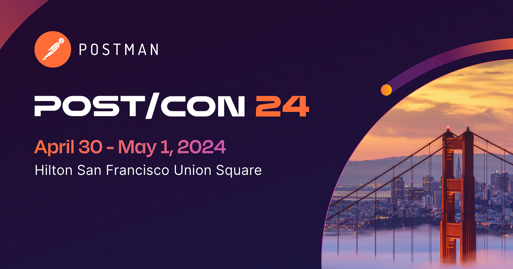
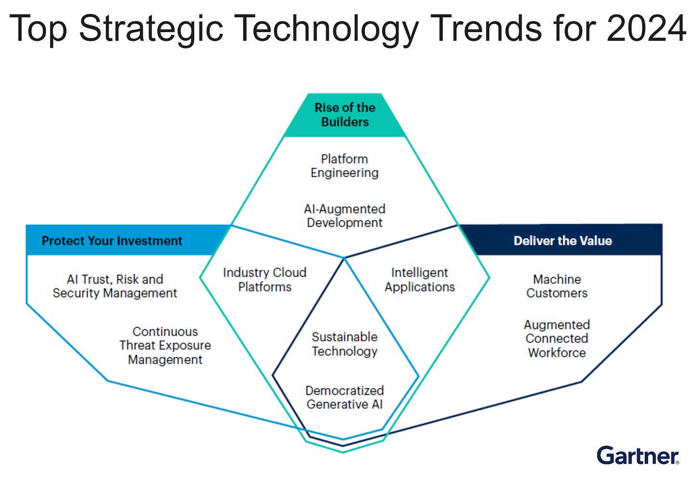
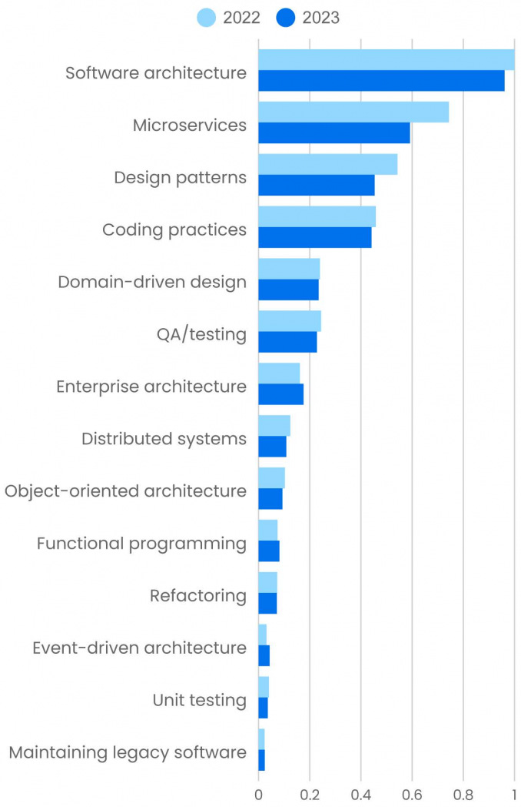

# The Trends #3: Gartner’s Top 10 Strategic Technology Trends of 2024

This week’s issue brings you the following:

- **Gartner’s Top 10 Strategic Technology Trends of 2024**
- **O'Reilly Learning Technology Trends for 2024**
- **Tech predictions for 2024. and Beyond by Dr. Werner Vogels (Amazon CTO)**

So, let’s dive in.

---

## **[POST/CON (Sponsored)](https://www.postman.com/postcon/?utm_source=influencer&utm_medium=Social&utm_campaign=POSTCON_2024&utm_term=Milan_Milanovic&utm_content=Conference_Landing_Page)**

***[POST/CON](https://www.postman.com/postcon/?utm_source=influencer&utm_medium=Social&utm_campaign=POSTCON_2024&utm_term=Milan_Milanovic&utm_content=Conference_Landing_Page)**Postman's biggest API conference ever from April 30 - May 1 in San Francisco, California! And right now, the Postman team is offering **[30% off tickets](https://postcon.postman.com/event/5bb77b40-684b-4b79-bb8f-f1420897ee6e/register?utm_source=influencer&utm_medium=Social&utm_campaign=POSTCON_2024&utm_term=Milan_Milanovic&utm_content=ticket_sales_30_discount)** until March 26. Register here!*

*POST/CON 24 is for anyone who works with APIs or whose business relies on APIs. If you attend, you'll earn a certificate and a Postman Badge!*

*Over two days, you'll hear from**[industry leaders](https://www.postman.com/postcon/speakers/?utm_source=influencer&utm_medium=Social&utm_campaign=POSTCON_2024&utm_term=Milan_Milanovic&utm_content=Conference_Speakers)**, attend hands-on **[workshops](https://www.postman.com/postcon/workshops/?utm_source=influencer&utm_medium=Social&utm_campaign=POSTCON_2024&utm_term=Milan_Milanovic&utm_content=Conference_Workshops)**, listen to in-depth presentations, and participate in exclusive conversations. If you work with APIs or your business relies on APIs, POST/CON is the place for you.*

[Get 30% discount](https://postcon.postman.com/event/5bb77b40-684b-4b79-bb8f-f1420897ee6e/regProcessStep1?utm_source=influencer&utm_medium=Social&utm_campaign=POSTCON_2024&utm_term=Milan_Milanovic&utm_content=ticket_sales_30_discount)

---

In its most recent research, **[Top Strategic Technology Trends 2024](https://www.gartner.com/en/articles/gartner-top-10-strategic-technology-trends-for-2024)**, Gartner outlines the technological advancements that will assist companies in determining where to focus their expenditures in the artificial intelligence (AI) era. Every trend fits into a category that emphasizes maximizing your investment protection, utilizing technology to the advantage of the company and its developers, and accelerating and producing tangible value.

Here are Gartner’s top strategic tech trends for 2024:

1. **Democratized Generative AI**

The combination of cloud computing, open source, and pre-trained models democratizes generative artificial intelligence (GenAI), making these models available to workers everywhere. According to Gartner, more than 80% of businesses will have implemented GenAI APIs by 2026. Gartner recommends creating a prioritized matrix of generative AI using cases based on technical feasibility and business value.
2. **AI-Augmented Software Development**

Software engineering with AI support increases developer productivity and helps teams handle the growing need for software to operate the company. AI-powered development tools free up software engineers' time to write code, allowing them to concentrate more on higher-level tasks like creating engaging commercial applications. Gartner recommends forming a group of experienced software engineers who can assess AI code-generating technologies and decide how best to use and implement them.
3. **Intelligent Applications**

Intelligence is defined as a learned adaptation to respond appropriately and autonomously. Many applications for this intelligence can improve labor automation or augmentation. Intelligence in applications is a fundamental capacity that includes various AI-based services such as vector storage, machine learning, and networked data. Gartner recommends creating a center of excellence or a similar team to map, describe, classify, record, and track intelligence as a feature for your applications. Then, a cross-functional program will be created to prioritize investments and outcomes.
4. **Machine Customers**

Nonhuman economic agents, called "custobots," can independently bargain and buy goods and services in return for money. By 2028, there will be 15 billion linked products that can act like consumers, and billions more will follow in the upcoming years. Gartner recommends creating machine customer investigation teams and creating one to three scenarios to explore the market opportunities with IoT products.
5. **Sustainable Technology**

It is a set of digital solutions that enable ESG (environment, social, and governance) outcomes that promote human rights and long-term ecological balance. Cloud computing, artificial intelligence, cryptocurrencies, and the Internet of Things are examples of the technologies causing worry due to their influence on the environment and energy usage.
6. **Platform Engineering**

The designing and managing of self-service internal development platforms is known as platform engineering. Each platform is a layer that interfaces with tools and procedures to fulfill the needs of its users. It is developed and maintained by a specialized product team. Platform engineering objectives are optimizing efficiency, improving user experience, and accelerating business value delivery. Gartner recommends creating an internal platform with reusable components and treating the platform as a product.
7. **Industry Cloud Platforms**

According to Gartner, the percentage of businesses using industry cloud platforms (ICPs) to speed up business initiatives will increase from less than 15% in 2023 to over 70% by 2027. ICPs combine core SaaS, PaaS, and IaaS services into a comprehensive product offering with composable capabilities to target industry-relevant business outcomes. Gartner recommends using ICPs to complement the existing portfolio of applications by introducing new capabilities that add value.

The map of the innovative technologies to watch in 2024, by Gartner

---

## **O'Reilly Learning Technology Trends for 2024**

O'Reilly recently [shared their view on the tech trends](https://www.oreilly.com/radar/technology-trends-for-2024/), based on their internal learning platform metrics - from January through November 2022. and 2023. It is a good indicator of future trends based on what developers are learning.

Here are the main insights:

1. **Software Development**

Software development has declined noticeably in most topics, with **software architecture and design** also experiencing a downturn. However, enterprise architecture saw an 8.9% increase, and event-driven architecture's usage, though small, rose by 40%. **Microservices** faced a 20% drop as developers debated their efficiency, preferring monoliths in some cases, while design patterns declined by 16%.
2. **Programming Languages**

Python remains the most popular, but **Java** and **JavaScript** saw 14% and 3.9% declines, respectively. Interestingly, TypeScript's usage increased by 5.6%, suggesting a shift towards this language. **C++** experienced a surprising 10% growth, and **Rust's** usage increased by 7.8%.
3. **Artificial Intelligence**

Natural language processing (NLP), generative models, and Transformers saw dramatic increases in interest, with **NLP** up by 195%, **generative models** by 900%, and **Transformers** by 325%. Prompt engineering emerged as a new significant topic, paralleling Transformers in usage. **Deep learning** and **reinforcement learning** grew by 19% and 15%, respectively, while PyTorch and MLOps saw 25% and 14% increases.
4. **Data**

Despite a slight decline of 3.6%, data**engineering**remains a heavily used topic, stabilizing after previous gains. **Kafka** and **Spark** usage dropped significantly, while **Microsoft Power BI** and **SQL Server** saw increases. Data warehouses experienced an 18% decline, but data mesh content usage rose 5.6%.
5. **DevOps**

**Linux** usage decreased by 6.9%, yet it remains dominant. **Kubernetes** and **Docker** positions shifted slightly, with DevOps and SRE experiencing minor declines.
6. **Security**

Security topics generally grew with **network security, firewalls, and hardening**. **Application security** grew by 42%, highlighting a growing awareness among developers and operations staff.
7. **Cloud Computing**

Cloud computing trends show a 175% increase in **Cloud Native**, indicating a shift towards cloud-first development. **Cloud security** and **identity and access management (IAM)** also grew, while the hybrid cloud saw a 145% increase. **AWS** had a marginal gain, but **Azure** and **Google Cloud** faced notable declines (16% and 22%, respectively).
8. **Web Development**

Web development trends are mixed, with **React** maintaining its position despite a slight decrease. **Angular** and **Vue** experienced changes in usage, with Vue showing a promising 28% growth. **Django** and **PHP** both saw increases, while **WebAssembly** and **Blazor** faced declines, suggesting evolving preferences in web development technologies.

Software Architecture (O’Reilly)

---

## **Tech predictions for 2024. and Beyond by Dr. Werner Vogels (Amazon CTO)**

Werner recently **[gave a set of tech predictions](https://aws.amazon.com/executive-insights/content/werner-vogels-2024-tech-predictions-and-beyond/)** for the next year and the future.

Here they are:

1. **Generative AI’s Cultural Leap:** In 2024, we're witnessing a significant evolution in generative AI, particularly in large language models (LLMs). These models are now being trained on culturally diverse data, enabling them to better understand human experiences across different societies.
2. **FemTech’s Rise:** 2024 marks a pivotal moment for women's healthcare, driven by the surge in FemTech investment. This sector is transcending its niche status with technologies like machine learning and connected devices specifically designed for women's health needs. The rise of FemTech is revolutionizing not only how women's healthcare is perceived but also how it's delivered. We're seeing a shift towards hybrid care models, leveraging online platforms and low-cost diagnostic devices.
3. **AI-Powered Developer Productivity:** AI assistants are redefining the software development landscape in 2024. Moving beyond these AI tools is evolving code generation, and AI tools are evolving into collaborators throughout the software development lifecycle. They can now explain complex systems in simpler terms, suggest targeted improvements, and automate repetitive tasks. This evolution allows developers to focus on more impactful aspects of their work, fostering creativity and innovation.
4. **Education’s Evolution:** The rapid pace of technological advancement needs to improve the capacity of traditional higher education to keep up. In response, 2024 is seeing a rise in industry-led, skills-based training programs. These programs are more akin to the journeys of skilled tradespeople, emphasizing continuous learning and practical application. This shift benefits individuals seeking to stay relevant in the tech industry and businesses needing specialized skills. We're moving towards a more flexible and responsive educational model that aligns closely with the dynamic demands of the tech sector.

Tech predictions for 2024 and beyond by Werner Vogels, Amazon CTO (Credits: author)

---

## More ways I can help you

1. **1:1 Coaching:** [Book a working session with me](https://newsletter.techworld-with-milan.com/p/coaching-services). 1:1 coaching is available for personal and organizational/team growth topics. I help you become a high-performing leader 🚀.
2. **[Promote yourself to 27,000+ subscribers](https://newsletter.techworld-with-milan.com/p/sponsorship-of-tech-world-with-milan)**by sponsoring this newsletter.

---

Thanks for reading Tech World With Milan Newsletter! Subscribe for free to receive new posts and support my work.