# Git Branching Strategies

*And which one is perfect for you.*

Choosing the right Git branching strategy is more than just a technical decision—**it directly impacts how efficiently your team can collaborate, integrate code, and deploy software.** With various strategies available, each offering unique strengths, selecting one that aligns with your team’s workflow and project demands is crucial.

This post will guide you through **the most popular Git branching strategies**, from the simplicity of Feature Branching to the structured approach of GitFlow and the continuous integration focus of Trunk-Based Development. We'll also deep dive into advanced concepts like **Stacked Diffs** and the **distinctions between Git Merge and Rebase**.

Whether working on a small project with continuous deployments or a large-scale system with scheduled releases, understanding **these strategies can help you optimize your development process and avoid potential problems**.

Let’s explore which strategy might be the best fit for your team.

---

## Git Branching Strategies

When managing code in software development, choosing the right branching strategy can significantly impact collaboration, integration, and deployment. This post explores the main Git branching strategies, their characteristics, and when to use them.

Here are the main Git branching strategies:

### 1. Feature Branching

It involves creating a new branch for each feature or bug fix. Developers work on these branches independently, merging them into the main codebase (usually the main or develop branch) once the work is completed and reviewed.

**How it works:**

- **Create a feature branch**: Branch off from the `main` branch using a clear naming convention, e.g., `feature/user-authentication`.
- **Develop independently**: Work on the feature without affecting the `main` branch.
- **Open a Pull Request**: Once complete, open a pull request for code review.
- **Merge into the main branch**: After approval, merge the feature branch back into the `main` branch.

This strategy is good because it isolates feature development and reduces conflicts, but it can lead to long-lived branches if not managed properly.

**👉 Best suited for:** Teams that require strict code reviews and where features are developed independently.

[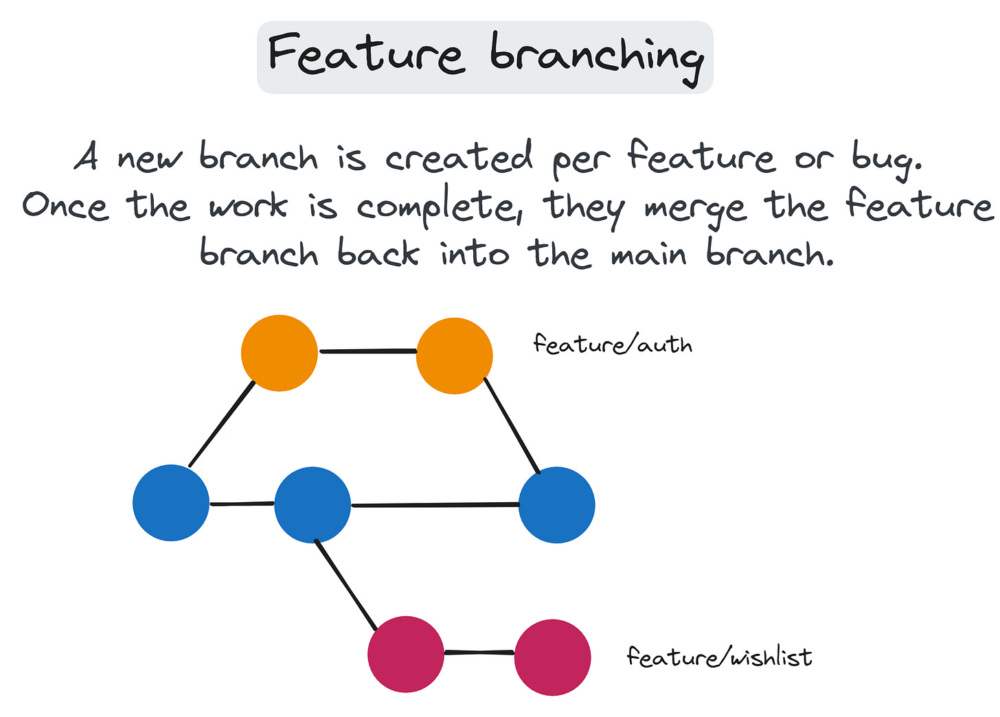](https://substackcdn.com/image/fetch/$s_!6GMD!,f_auto,q_auto:good,fl_progressive:steep/https%3A%2F%2Fsubstack-post-media.s3.amazonaws.com%2Fpublic%2Fimages%2Fb0d33e20-43fe-49ac-ab7e-f3e33066e642_2339x1679.png)Feature branching

### 2. GitFlow

It is a [branching model](https://www.atlassian.com/git/tutorials/comparing-workflows/gitflow-workflow) that defines a strict workflow for managing releases by covering different scenarios. To organize work, it introduces the concept of **develop**, **release**, **hotfix**, and **feature** branches.

**How it works:**

- **Develop branch**: The main development branch where integration happens.
- **Feature branches**: Created from `develop` for new features.
- **Release branches**: Created from `develop` when preparing for a release.
- **Hotfix branches**: Created from `main` to address urgent fixes.

Here are **the workflow steps**:

1. **Feature development**:

- Branch off `develop` into `feature/*` branches.
- Merge back into `develop` after completion.
2. **Preparing a release**:

- Create a `release/*` branch from `develop`.
- Perform final testing and bug fixes.
- Merge into both `develop` and `main` branches.
3. **Hotfixes**:

- Create a `hotfix/*` branch from `main`.
- Fix the issue and merge it back into both `develop` and `main`.

This strategy provides a structured approach to managing releases and enables parallel development of multiple features, but it can be very complex for smaller projects or teams. This can slow your team and delivery process.

**👉 Best suited for** large projects with scheduled release cycles, where each code change must be strictly reviewed. Also, if you need to stabilize your branch with manual testing before the release.

[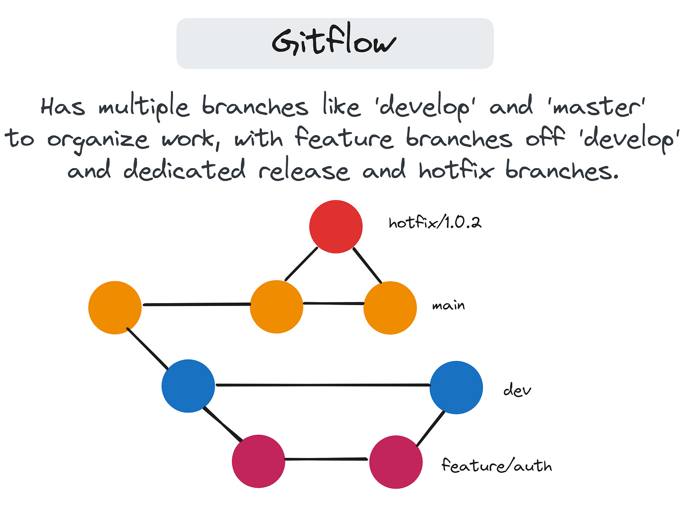](https://substackcdn.com/image/fetch/$s_!INIG!,f_auto,q_auto:good,fl_progressive:steep/https%3A%2F%2Fsubstack-post-media.s3.amazonaws.com%2Fpublic%2Fimages%2Fda17308a-7026-4a65-a4df-d3f736d4aabd_2323x1724.png)Gitflow

### 3. GitLab Flow

It combines ideas from Feature Branching and Gitflow but simplifies the process. It emphasizes deployment and integrates with issue tracking and continuous deployment. [This strategy](https://docs.gitlab.com/ee/topics/gitlab_flow.html) includes a main branch representing a production-ready code and optional branches per environment (staging, production, etc.).

**How it works:**

- **The main branch** represents production-ready code.
- **Environment branches**: Optional branches like `staging`, `production`, etc.
- **Feature branches**: Created from `main` branch for development and merged back after completion.

Here are **the workflow steps**:

1. **Feature development**:

- Branch off `main` into `feature/*` branches.
- Link branches to issues in GitLab for better tracking.
- Merge back into `main` after code review.
2. **Environment deployment**:

- Use environment branches if needed (e.g., `staging`).
- Deploy `main` or specific branches to different environments.

The main advantage of this strategy is that it supports environment-specific branches for easier deployments, as it is less flexible for teams not using GitLab. Also, it is not recommended for smaller projects.

**👉 Best suited for:** Teams using GitLab integrated tools and wanting to benefit from CD practices.

[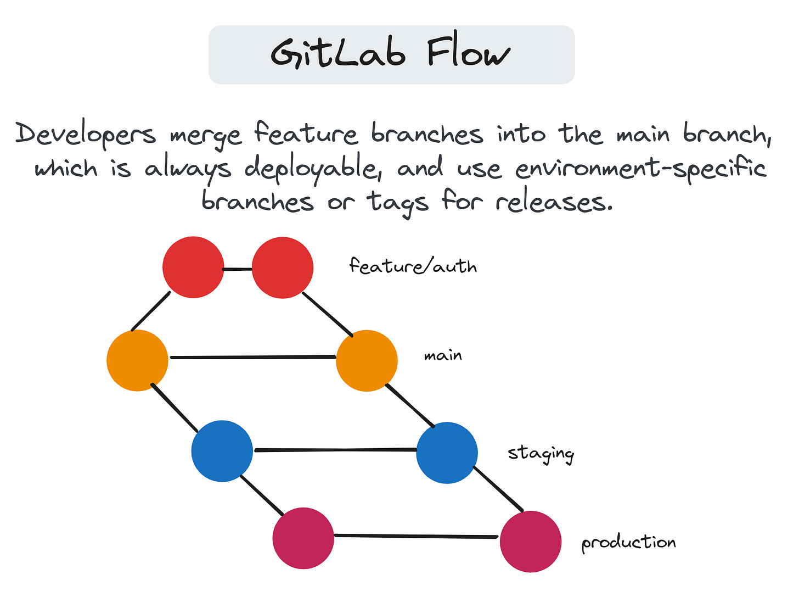](https://substackcdn.com/image/fetch/$s_!ZFwR!,f_auto,q_auto:good,fl_progressive:steep/https%3A%2F%2Fsubstack-post-media.s3.amazonaws.com%2Fpublic%2Fimages%2Fabc3c958-a6f9-4c1c-a2e4-e14e97ece45b_2328x1720.png)GitLab Flow

### 4. GitHub Flow

It is a lightweight, [branch-based workflow](https://guides.github.com/introduction/flow/) that is simple and effective for continuous deployment. It focuses on keeping the main branch always in a deployable state. Feature branches are created from the main branch, and we use pull requests to review and merge changes into the main branch.

**How it works:**

- **Branch from main**: For any new work, create a branch off `main` with a descriptive name.
- **Commit and push**: Make changes locally, commit often, and push to the remote repository.
- **Open a Pull Request**: Initiate a pull request to start the conversation and code review.
- **Merge and deploy**: After approval, merge back into `main` and deploy immediately.

This strategy is good as it enables frequent integration and deployment and also works well with the GitHub pull request system. Still, it may not provide enough structure for large, complex projects when having multiple releases or versions.

**👉 Best suited for** small teams or projects with continuous deployments.

[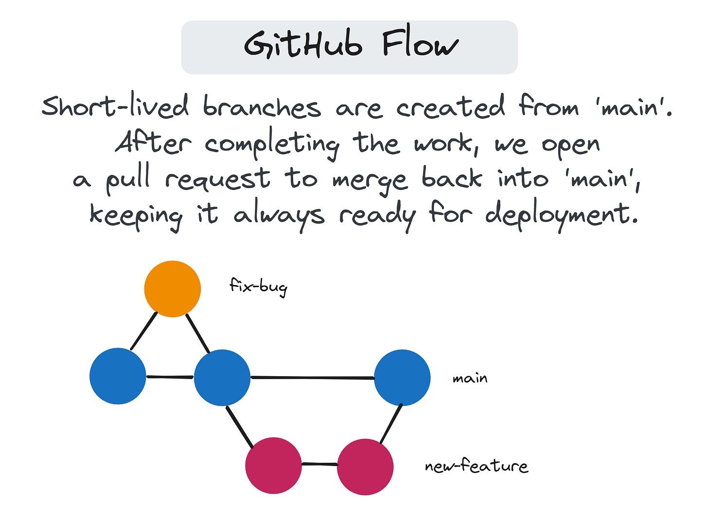](https://substackcdn.com/image/fetch/$s_!z7oE!,f_auto,q_auto:good,fl_progressive:steep/https%3A%2F%2Fsubstack-post-media.s3.amazonaws.com%2Fpublic%2Fimages%2Fadf578c3-33d3-4d60-9f6d-ff983a408bc8_2246x1660.png)GitHub Flow

### 5. Trunk-Based Development

With this [strategy](https://trunkbaseddevelopment.com/), all developers commit their changes directly to the main branch (the "trunk"). Feature branches are short-lived or avoided altogether.

**How it works:**

- **Frequent commits to main**: Developers make small, incremental changes directly to `main`.
- **Short-lived feature branches**: If used, they are merged back into `main` within a day.
- **Continuous integration (CI)**: Automated tests run on each commit to ensure stability.

This strategy is beneficial because it reduces merge conflicts, supports fast development, and requires high discipline and testing.

**👉 Best suited for:** Teams that practice continuous integration and delivery and for projects where rapid development is a priority. Also, for teams with no branching experience.

[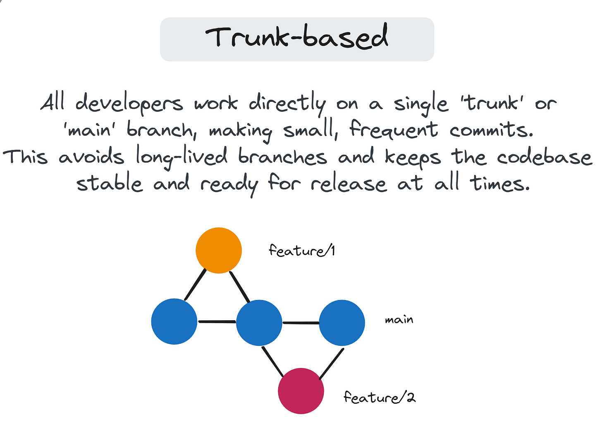](https://substackcdn.com/image/fetch/$s_!dCpp!,f_auto,q_auto:good,fl_progressive:steep/https%3A%2F%2Fsubstack-post-media.s3.amazonaws.com%2Fpublic%2Fimages%2Fa66622f4-135d-4452-8968-7950eab417a1_2346x1643.png)Trunk-Based Development

### ➡️ Choosing the right strategy

When selecting a Git branching strategy, consider the following factors:

1. **Team size and experience.**Larger teams may need more structured workflows like Gitflow.
2. **Project complexity and release frequency**. Continuous deployment favors simpler strategies like GitHub Flow.
3. **Deployment requirements (e.g., continuous deployment vs. scheduled releases)**.
4. **Integration with existing tools and workflows**. Consider the platforms (e.g., GitHub, GitLab) your team uses and their features.

If you're new to Git workflows, start with a simpler strategy like **Trunk-Based Development** and evolve as your team and project grow. Here, your team can understand how to use short-lived branches, do a PR, build tests, and automate deployments. Later, you can consider more structured approaches like **Gitflow** or **GitLab Flow** for larger teams or more complex projects.

[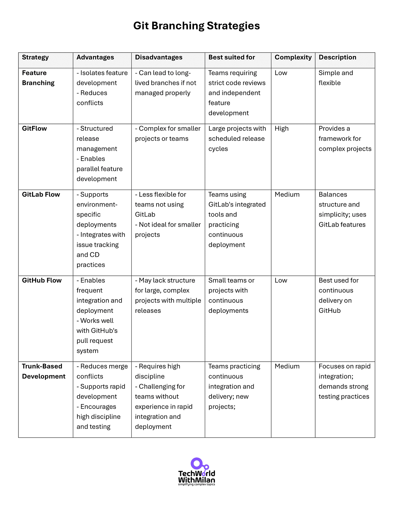](https://substackcdn.com/image/fetch/$s_!J2I-!,f_auto,q_auto:good,fl_progressive:steep/https%3A%2F%2Fsubstack-post-media.s3.amazonaws.com%2Fpublic%2Fimages%2F8e6063c9-4add-49df-9ff5-a5e1133dccbc_1700x2200.png)Git Branching Strategies Overview

Also, regardless of the branching strategy, **proper automated testing** should be implemented to catch issues earlier and establish team agreements on commit messages, branch naming, and merge procedures.

[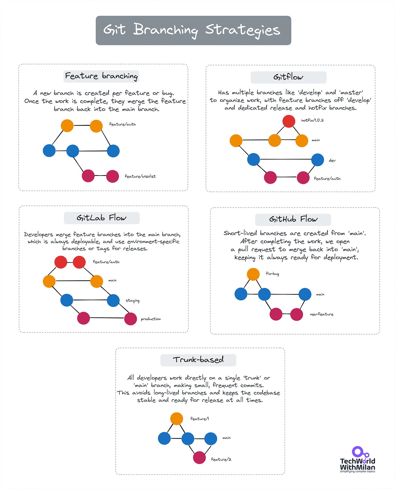](https://substackcdn.com/image/fetch/$s_!h15Z!,f_auto,q_auto:good,fl_progressive:steep/https%3A%2F%2Fsubstack-post-media.s3.amazonaws.com%2Fpublic%2Fimages%2F3c80b546-fcd2-47e8-87fc-0cd8dfcd8dfa_5578x6892.png)Git Branching Strategies

To learn more about Git, check this article:
[
Tech World With Milan NewsletterHow to Learn GitIn this issue, we are going to talk about Git, specifically about…Read more3 years ago · 37 likes · 2 comments · Dr Milan Milanović](https://newsletter.techworld-with-milan.com/p/how-to-learn-git?utm_source=substack&utm_campaign=post_embed&utm_medium=web)
---

## How Stacked Diffs can help?

We all know the burden of code reviews. You make changes to your branch, create a PR, and add reviewers. Then, you need to wait for them to review the PR. Depending on the team, **this can happen in a few hours or even days**. After reviewers add comments, you must fix those issues again and go through the whole cycle of PR reviews and comments until you get approval.

The result of such workflow is that **we are constantly blocked**, and in the meantime, we take something else to do (**multitasking**), which impacts our development speed.

Another solution for this problem is **Stacked Diffs** (or Stacked PRs). In this approach, developers create small, incremental changes that build upon each other. Each change is submitted for review separately but in a specific order, creating a "stack" of dependent changes.

How does this help? For example, you must do a frontend and backend change in the same PR that depends on each other (UI that hits the new API endpoint). You first need to do a backend change by introducing the new API, then create a PR to be approved and merged so you can continue with the frontend part. This slows you down, as while the PR review is there, you cannot continue your work. With **Stacked Diffs**, you can put backend changes for review and continue to work with the frontend part, and then, when approved, you can merge them independently or together.

**How it works:**

1. A developer creates small changes, each building upon the previous one.
2. Each change is submitted as a separate review request (e.g., a Pull Request).
3. Reviewers can see the entire stack of changes and how they relate to each other.
4. Changes can be reviewed, approved, and merged individually, even if they depend on preceding changes in the stack.

Here is the **example workflow**:

1. **Feature breakdown**: Suppose you're implementing a new authentication system.

- **Diff 1**: Set up the basic authentication infrastructure.
- **Diff 2**: Implement user login functionality.
- **Diff 3**: Add password reset feature.
2. **Development**:

- Each diff is developed in its branch and stacked on the previous one.
3. **Review and merge**:

- Submit **Diff 1** for review. Once approved, merge into `main`.
- Rebase **Diff 2** onto the updated `main`, resolve any conflicts.
- Submit **Diff 2** for review, and so on.

**👉 Best suited for**: Teams working on large, complex features and projects where code quality and thorough reviews are critical.  Stacked Diffs can be particularly powerful when combined with **trunk-based development** or other strategies prioritizing small, frequent integrations.

[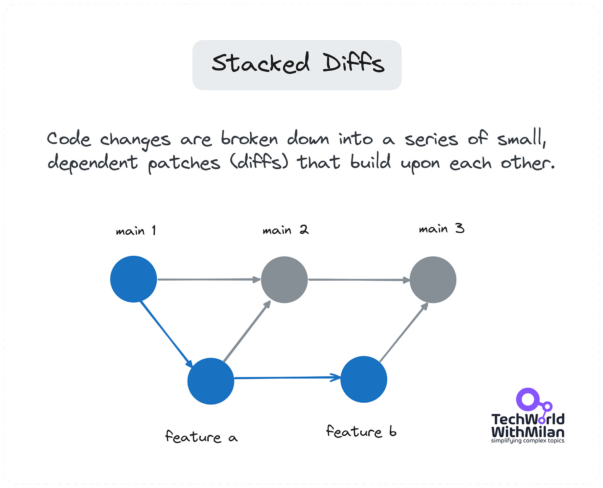](https://substackcdn.com/image/fetch/$s_!JaOW!,f_auto,q_auto:good,fl_progressive:steep/https%3A%2F%2Fsubstack-post-media.s3.amazonaws.com%2Fpublic%2Fimages%2F8366717c-1c99-4b61-a5cc-2c5de89e383a_2864x2320.png)Stacked Diffs

The main problem with Stacked Diffs is that doing them manually is hard because Git is not designed for this kind of workflow. So we can use different tools for it. Also, another issue is **the lack of support with the current tooling** is very limited.

Some tools that support it:

- **[Graphite CLI](https://graphite.dev/features/cli)**
- **[Gerrit Code Review](https://www.gerritcodereview.com/)**
- **[ghstack](https://github.com/ezyang/ghstack)** on GitHub
- **[Phabricator](https://www.phacility.com/phabricator/)** by Meta (no longer actively maintained)

Also, you can learn more about how to do a proper code review here:
[
Tech World With Milan NewsletterHow To Do Code Reviews ProperlyWhy Do We Need to Do Code Reviews…Read more3 years ago · 40 likes · 3 comments · Dr Milan Milanović](https://newsletter.techworld-with-milan.com/p/how-to-do-code-reviews-properly?utm_source=substack&utm_campaign=post_embed&utm_medium=web)
---

## Git Merge vs Rebase

One of the most powerful Git features is branching. Yet, while working with it, we must integrate changes from one branch into another, and the way to do this can be different.

In this post, we'll explore two primary methods: merge and rebase.

### 1. Git Merge

When you [merge](https://git-scm.com/docs/git-merge) Branch A into Branch B (with `git merge`), Git creates a new merge commit. This commit has two parents, one from each branch, symbolizing the confluence of histories. It's a non-destructive operation that preserves the exact history of your project.

**Merges are particularly useful in collaborative environments** where maintaining the integrity and chronological order of changes is essential. Yet, merge commits can clutter the history, making it harder to follow specific lines of development.

### 2. Git Rebase

When you [rebase](https://git-scm.com/docs/git-rebase) Branch A onto Branch B (with` git rebase`), you're essentially saying, "Let's pretend these changes from Branch A were made on top of the latest changes in Branch B." Rebase rewrites the project history by creating new commits for each commit in the original branch. This results in a much cleaner, straight-line history.

Yet, **it could be problematic if multiple people work on the same branch**, as rebasing rewrites history, which can be challenging if others have pulled or pushed the original branch.

So, when to use them:

- **Use merging to preserve the complete Git history**, especially on shared branches or for collaborative work. It's ideal for feature branches to merge into a main or develop branch.
- **Use rebasing for personal branches** or when you want a clean, linear history for easier change tracking. Remember to rebase locally and avoid pushing rebased branches to shared repositories. Also, be aware **not to rebase public history**. If your branch is shared with others, rebasing can rewrite history in a way that is disruptive and confusing to your collaborators.

I prefer **the rebase approach**, as we get a cleaner Git history. However, to use it safely, you need a higher level of Git understanding. Your team needs to be skilled enough with Git to do it. If you don’t feel comfortable, **use the merging approach**.

[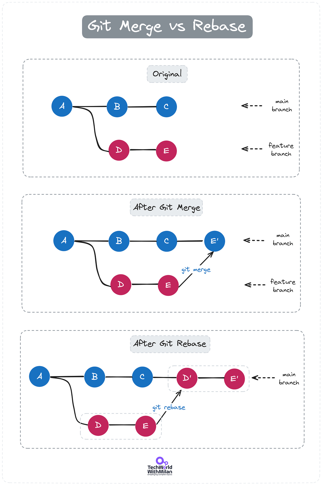](https://substackcdn.com/image/fetch/$s_!fdzw!,f_auto,q_auto:good,fl_progressive:steep/https%3A%2F%2Fsubstack-post-media.s3.amazonaws.com%2Fpublic%2Fimages%2F3f16054b-1993-4008-a5bf-993bf2617352_2778x4173.png)Git Merge vs Rebase

---

## The Space Git Flow

Recently, guys from JetBrains introduced **Space Git Flow**, a process to achieve better code quality and keep the main branch always green. It is a branching strategy similar to **GitHub Flow** but with more concerns about safety when making changes to the main branch and making it scalable to larger teams.

They use the `main` branch for the production code only and development is done in short-lived **feature branches**merged into the `main` branch. Merge requests are used for code reviews and must be passed through quality gates before merging. For additional security, they use Safe Merge `feature` to `main` (a temporary merge comment from both branches). In the end, the `release` branch is created from the `main` branch.

[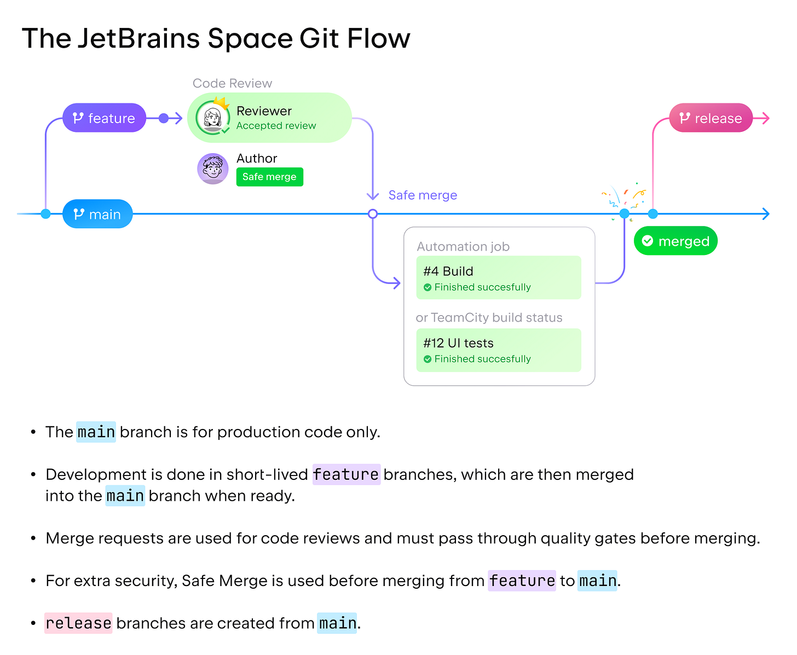](https://substackcdn.com/image/fetch/$s_!gSlw!,f_auto,q_auto:good,fl_progressive:steep/https%3A%2F%2Fsubstack-post-media.s3.amazonaws.com%2Fpublic%2Fimages%2Fd527b3ef-09ad-48c7-9be9-10673a16c36d_1800x1480.png)The Space Git Flow (Source: JetBrains)

Read more about the approach **[here](https://blog.jetbrains.com/space/2023/04/18/space-git-flow/)**.

---

## Bonus: Basic Git Commands

Here is the list of basic Git commands you can use daily.

[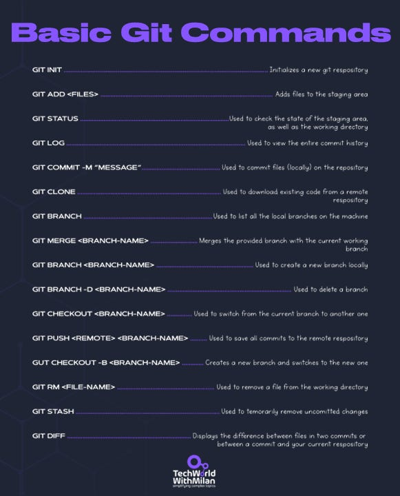](https://substackcdn.com/image/fetch/$s_!ZFSx!,f_auto,q_auto:good,fl_progressive:steep/https%3A%2F%2Fsubstack-post-media.s3.amazonaws.com%2Fpublic%2Fimages%2F703694b3-6b0a-4961-b013-36b8814fc244_581x720.png)

---

## More ways I can help you

1. **[LinkedIn Content Creator Masterclass ✨](https://www.patreon.com/techworld_with_milan/shop/short-linkedin-content-creator-311232?utm_medium=clipboard_copy&utm_source=copyLink&utm_campaign=productshare_creator&utm_content=join_link).**In this masterclass, I share my strategies for growing your influence on LinkedIn in the Tech space. You'll learn how to define your target audience, master the LinkedIn algorithm, create impactful content using my writing system, and create a content strategy that drives impressive results.
2. **[Resume Reality Check"](https://www.patreon.com/techworld_with_milan/shop/resume-reality-check-311008?source=storefront)**[🚀](https://www.patreon.com/techworld_with_milan/shop/resume-reality-check-311008?source=storefront). I can now offer you a new service where I’ll review your CV and LinkedIn profile, providing instant, honest feedback from a CTO’s perspective. You’ll discover what stands out, what needs improvement, and how recruiters and engineering managers view your resume at first glance.
3. **[Promote yourself to 36,000+ subscribers](https://newsletter.techworld-with-milan.com/p/sponsorship-of-tech-world-with-milan)**by sponsoring this newsletter. This newsletter puts you in front of an audience with many engineering leaders and senior engineers who influence tech decisions and purchases.
4. **[Join my Patreon community](https://www.patreon.com/techworld_with_milan)**: This is your way of supporting me, saying “thanks, " and getting more benefits. You will get exclusive benefits, including all of my books and templates on Design Patterns, Setting priorities, and more, worth $100, early access to my content, insider news, helpful resources and tools, priority support, and the possibility to influence my work.
5. **1:1 Coaching:** [Book a working session with me](https://newsletter.techworld-with-milan.com/p/coaching-services). 1:1 coaching is available for personal and organizational/team growth topics. I help you become a high-performing leader and engineer 🚀.

---
[https://newsletter.techworld-with-milan.com/p/git-branching-strategies#poll-220917](https://newsletter.techworld-with-milan.com/p/git-branching-strategies#poll-220917)Loading...
---

Thanks for reading Tech World With Milan Newsletter! Subscribe for free to receive new posts and support my work.