# How to develop High Agency

*What is it, why is it important and how to cultivate it*

Have you ever noticed how certain people manage to navigate obstacles with ease while others get stuck at the first sign of resistance? Some people seem to *always find a way* forward, even in challenging conditions.

This fundamental difference often boils down to a single trait: **High Agency**.

High-agency individuals possess a remarkable ability to take control of situations and produce desired outcomes, whereas low-agency individuals often feel at the mercy of circumstances.

In simple terms, a high-agency person doesn’t accept “no” for an answer – when told that something is impossible, it **sparks** a second dialogue in their mind about how to overcome the obstacle.

They believe that the stories others tell them about what can or cannot be done are *just stories*, not hard limits. Instead of waiting for perfect conditions or permission, they *find a way or make a way*.

This is something I knew for a long time myself, but I didn’t know what this trait is or what it is called. But I knew that when something is “impossible” for most people, it is a job for me.

In this issue, we aim to explore how the most successful people in the world possess a strong sense of agency, and also how you can develop this trait.

Particularly, we will talk about:

1. **High vs low Agency mindset**. Here we explore the difference between those who say "I can't because..." versus "I'll figure out how to..." when facing challenges. We will introduce the concept of high agency as being relentlessly resourceful and proactive rather than reactive.
2. **Why talent isn't enough**. This section breaks down four types of people based on talent and agency levels: Game Changers, Frustrated Geniuses, Go-Getters, and Cogs in the Wheel.
3. **Why High Agency is so important**. We examine the real-world impact of high agency in business, leadership, and startups. We will understand why companies actively seek this trait and how it correlates with career success and organizational effectiveness.
4. **How to spot High Agency people**. We will provide practical indicators for identifying high agency individuals, including intellectual contradictions, geographic courage, and the "crisis test." It helps you recognize this quality in potential team members and mentors.
5. **How to cultivate a High Agency mindset**. This section offers actionable strategies for developing high agency, including focusing on your circle of influence, adopting an ownership mindset, and reframing challenges as opportunities.

So, let’s dive in.

---

**[Sponsor this newsletter](https://newsletter.techworld-with-milan.com/p/sponsorship-of-tech-world-with-milan)**

## 1. High vs low agency mindset

This concept of “**high agency**” was popularized by economist [Eric Weinstein](https://en.wikipedia.org/wiki/Eric_Weinstein) (managing director of Thiel Capital), who defined it as *“[constantly looking for what is possible, in a kind of MacGyverish sort of way](https://www.youtube.com/watch?v=8LPwyy4scAc)”*.

In other words, high-agency individuals are *relentlessly resourceful* – a term Y Combinator’s [Paul Graham](https://x.com/paulg) uses to describe the best startup founders. The opposite of this, as Graham quips, is simply being “hapless”.

[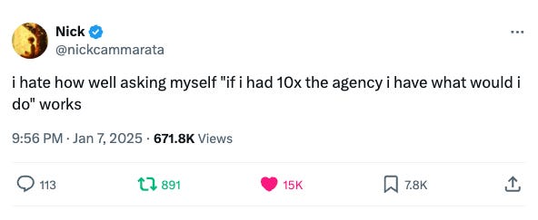](https://substackcdn.com/image/fetch/$s_!Zu1G!,f_auto,q_auto:good,fl_progressive:steep/https%3A%2F%2Fsubstack-post-media.s3.amazonaws.com%2Fpublic%2Fimages%2Fda83cb4e-3599-4051-8b81-20f1454f57b7_592x243.png)Paul Graham recently reposted this [tweet](https://x.com/paulg/status/1885001767525499301) as the most inspiring sentence he has ever read

To understand high agency, it helps to contrast it with its inverse. How do people with low agency approach challenges compared to those with high agency?

Consider a simple work scenario:

- **🚧 Low-Agency Mike**would say, *“I can’t do this because…”* They immediately see reasons it’s impossible. For example: *“We don’t have enough resources,”* *“Nobody has ever done this before,”* or *“Management hasn’t given clear direction.”*

All these responses deflect responsibility and **assume the outcome is out of their control**.
- **🚀 High-Agency Peter**would say, *“I’ll figure out how to do this by…”* They instinctively look for solutions. For instance: *“Maybe I can repurpose some existing resources,”* *“If no one’s done it before, being first gives us an edge,”* or *“I’ll draft a plan, then get feedback from the team.”*

These responses **focus on actions within their control** to move forward.

Notice the big difference. The low-agency person’s reflex is to point to external problems; the high-agency person focuses on what *they* can do (“*focus on what you control”*, based on [Stoic wisdom](https://en.wikipedia.org/wiki/Stoicism)).

The high-agency mindset is fundamentally **proactive**, not reactive: it speaks the language of *“I will”* rather than *“I can’t because.”*

We can even define levels of proactivity as follows:

[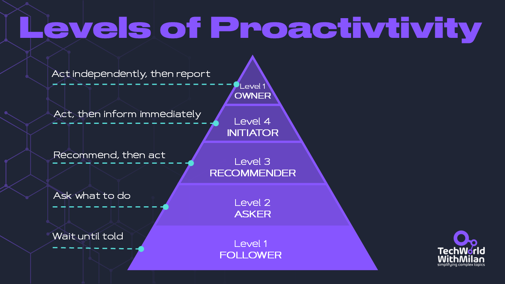](https://substackcdn.com/image/fetch/$s_!sHJi!,f_auto,q_auto:good,fl_progressive:steep/https%3A%2F%2Fsubstack-post-media.s3.amazonaws.com%2Fpublic%2Fimages%2F442fa6f3-cb36-4f6f-bd70-738d55ced82e_1280x720.png)Pyramid of proactivity

> *👉 Read my review of the book **The 7 Habits of Highly Effective People**, which explores the proactive mindset and other habits of effectiveness:*
[
Tech World With Milan NewsletterThe habits of highly effective peopleAfter 25 years of dealing with successful people in business, universities, and relationship settings, Stephen R. Covey noticed that great achievers were frequently troubled by emptiness. To comprehend why, he read self-help, self-improvement, and popular psychology books from the past 200 years. Here, he observed a striking historical disparity between…Read more2 years ago · 50 likes · Dr Milan Milanović](https://newsletter.techworld-with-milan.com/p/the-habits-of-highly-effective-people?utm_source=substack&utm_campaign=post_embed&utm_medium=web)
## 2. Why talent is not enough

High agency is so critical that it often outweighs talent or intelligence alone. In fact, as product leader [Shreyas Doshi illustrates](https://www.linkedin.com/pulse/high-agency-its-importance-how-cultivate-shreyas-doshi/), we can think of people in four quadrants based on their level of agency and talent (skill/ability):

### **🌟 Game Changers (High Talent/High Agency)**

These are the top performers who use both exceptional skill and initiative to drive impact. Game Changers tackle obstacles head-on and often create new opportunities in the process.

Note that they’re rare and highly sought-after. As Doshi notes, Game Changers can profoundly elevate teams and companies, and when you find one, *“do whatever you can to get them on your team”*.

### **🧠 Frustrated Geniuses (High Talent/Low Agency)**

These people have great talent or knowledge, but, lacking agency, they struggle to apply it effectively. They might have brilliant ideas that never see the light of day because they’re waiting for permission or perfect conditions.

In the long run, many of these high-talent, low-agency people *“end up capitulating to ‘the system’”* – they get bogged down by bureaucracy or their own reluctance to push boundaries. It’s painful to watch because you can sense their latent potential going untapped.

### **🔥 Go-Getters (Low Talent/High Agency)**

Go-Getters may not start with the deepest expertise, but they compensate with initiative, hustle, and a growth mindset. They are *action-oriented learners*, always looking for ways to contribute and improve. A Go-Getter will take on new challenges, figure things out along the way, and steadily build their skills.

With time, some Go-Getters **become** Game Changers as they gain experience. Many leaders say they’d take a high-agency junior person over a passive “genius” any day – *because skills can be taught, but mindset is harder to teach*.

### **⚙️ Cogs in the Wheel (Low Talent/Low Agency)**

These folks do the bare minimum. They operate strictly within their defined duties, take no initiative, and require constant direction. In essence, they execute tasks without questioning or taking ownership beyond their role*.*

They’re the ones who say, “*I just work here*,” or “*we’ve always done it like this*,” and stick to the letter of their job description.

As a result, their contributions (and career growth) remain very limited.

[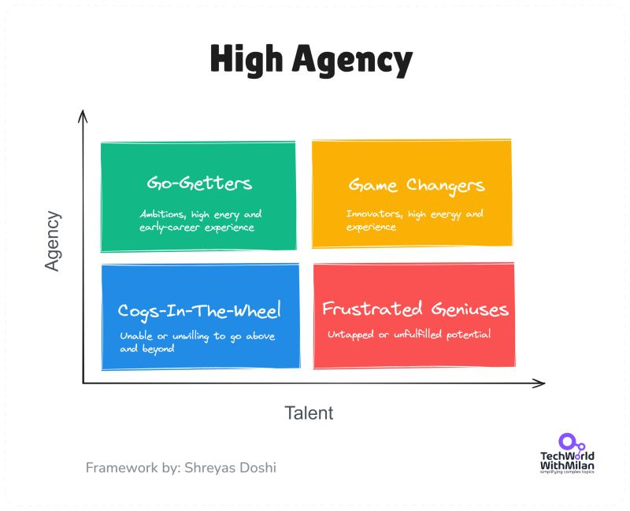](https://substackcdn.com/image/fetch/$s_!Um0X!,f_auto,q_auto:good,fl_progressive:steep/https%3A%2F%2Fsubstack-post-media.s3.amazonaws.com%2Fpublic%2Fimages%2F9ec05b21-eabb-44b9-b99a-1bd85baf0f92_800x649.jpeg)High agency mindset framework (by [Sheryas Doshi](https://www.linkedin.com/pulse/high-agency-its-importance-how-cultivate-shreyas-doshi/))

The takeaway from this framework is clear: If you want to be a top performer, **agency is the X-factor**. High agency paired with talent is a powerful force, and even high potential needs agency to fully materialize.

Conversely, all the talent in the world won’t make up for a lack of **ownership and drive**.

So, we can say that high agency is a prerequisite for making a profound impact in one’s life and work*.*

## 3. Why High Agency is so important

High agency has very real consequences for success in today’s world. Whether you’re an individual contributor, a leader, or an entrepreneur, a high-agency mindset can be a game changer (often literally).

In the tech and business community, *“high agency”* has become a bit of a Holy Grail trait. Companies increasingly seek it out because **a high-agency employee requires much less hand-holding and can multiply an organization’s effectiveness**.

In fact, some recruiters now explicitly screen for this quality. As one tech CEO [explains](https://www.businessinsider.com/high-agency-tech-buzzword-silicon-valley-hiring-2025-2#:~:text=Today%2C%20,candidate%20possesses%20more%20intangible%20qualities), *“High agency is [about] someone who can take control of their own destiny. [You look] for whether they take **ownership** or blame others for a project’s failure.”*

An experienced candidate who comes into an interview blaming their former team or boss for every past problem sends up red flags – it signals a low-agency attitude.

High agency is also **highly correlated with leadership**. Shreyas Doshi [observed](https://www.linkedin.com/pulse/high-agency-its-importance-how-cultivate-shreyas-doshi/) that every truly successful manager or executive he has known has had a strong sense of agency – a bias toward action and problem-solving – and those who lacked it inevitably plateaued.

Even without fancy degrees or credentials, **a high-agency person often rises through the ranks by sheer impact**. They become the go-to “fixers” and innovators in their organizations.

From an entrepreneur’s perspective, high agency is absolutely vital. Startup founder and investor [Naval Ravikant](https://en.wikipedia.org/wiki/Naval_Ravikant) says that when building teams, he looks for people who *“just solve problems without even being asked”*. These individuals identify what needs to be done and handle it – they’re not constantly asking for permission or basic guidance.

In a startup, there’s an “infinite set of problems” coming at you, and a leader simply can’t micromanage them all. Naval cites venture capitalist Vinod Khosla’s saying: *“The team you build is the company you build, not the plan you make.”*

Ultimately, what determines your success is having enough **problem solvers** on board. If each teammate needs a lot of managing, you can only take on so many people, but if they operate with autonomy, you can scale much further.

*“If you have somebody who takes 10% of your time and management to solve problems, you can only have 10 of those people... But if somebody takes 5%, you can have 20,”* Naval explains.

Of course, **agency isn’t the only trait that matters**. Qualities such as integrity, empathy, and teamwork are also essential. High agency isn’t about being reckless or trampling others.

The goal is to pair agency with sound judgment and ethics.

[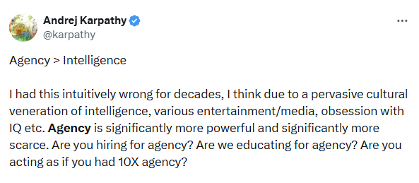](https://substackcdn.com/image/fetch/$s_!Axw7!,f_auto,q_auto:good,fl_progressive:steep/https%3A%2F%2Fsubstack-post-media.s3.amazonaws.com%2Fpublic%2Fimages%2Fd163307b-7eeb-4925-b12e-9a24e72863bc_593x259.png)Andrej Karpathy say that Agency is more important than Intelligence

## 4. How to spot high agency people

Learning to identify individuals with high agency transforms your ability to build exceptional teams and choose the right mentors.

After studying hundreds of high performers, certain patterns emerge that reveal this quality:

1. **Look for intellectual contradictions.** High agency people refuse to be one-dimensional. They're the surgeon who performs stand-up comedy, the accountant who builds race cars, and the programmer who studies ancient philosophy. When someone's interests genuinely surprise you, you've likely found someone who thinks independently.
2. **Notice who energizes versus drains.** High agency people don't motivate through speeches. They assume problems are solvable. When they encounter a problem, they say "*when we solve this*," not "*if we can solve this*." This certainty is contagious.
3. **Watch for geographic courage.** Repeated moves signal agency. But the real indicator isn't the move itself, it's the willingness to repeatedly start over, to build new networks from scratch, to thrive without inherited advantages.
4. **The crisis test reveals everything.** Ask yourself: who would you call if everything went wrong (as noted by Jeff Bezos)? Not for comfort or money, but for creative problem-solving when conventional options are exhausted. That person is valuable and operates outside standard playbooks.
5. **Watch how they handle being wrong.** High agency people change course fast when new data arrives. They don't defend bad decisions or double down on failing approaches. People with low agency get trapped by sunk costs and ego. High agency people treat being wrong as useful information, not personal failure.
6. **Notice their default assumption about new challenges**. High agency people assume they can figure it out. People with low agency often assume they need permission, more resources, or someone else to solve the problem first.
7. **The ownership test.** High agency people take responsibility for outcomes even when they're not technically responsible. They never say "t*hat's not my job*." Watch who steps up when nobody's in charge. The person who starts solving the problem without being asked has agency. The one waiting for permission doesn't.

That’s not my job

1. **Time tells everything.** High agency people treat time differently. Their default deadline is now, not later. They don't believe in "*less busy next month*." When someone says they'll do something "when things calm down," they've revealed themselves.
2. **Frustration as fuel.** Most people complain about problems. High agency people build solutions, then sell them. The entrepreneur who started a company because they couldn't find what they needed? High agency. Is the person still complaining about the same problem five years later? Not.

[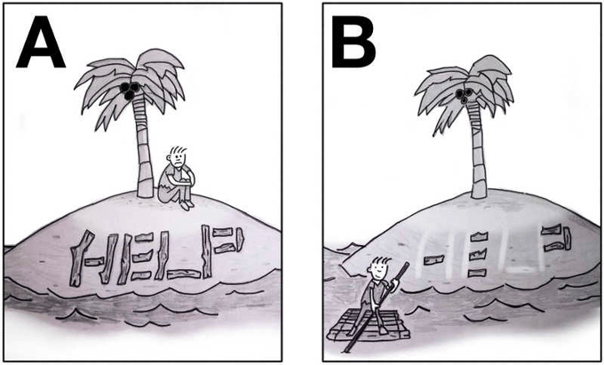](https://substackcdn.com/image/fetch/$s_!Hl9n!,f_auto,q_auto:good,fl_progressive:steep/https%3A%2F%2Fsubstack-post-media.s3.amazonaws.com%2Fpublic%2Fimages%2F6d90456b-2809-4129-91fe-55ba7e465651_680x411.png)High agency

## 5. How to cultivate a High Agency mindset

The big question is: **Can you develop high agency, or is it an innate trait?** The bad news is that low agency is our default behavior. The good news is that high agency can be learned and strengthened.

Like any mindset, it’s built through habits and practice.

Here are some strategies to cultivate a higher-agency approach in your work and life:

### **🎯 Focus on what you control**

Stephen Covey, in *[The 7 Habits of Highly Effective People](https://newsletter.techworld-with-milan.com/p/the-habits-of-highly-effective-people)*, describes a fundamental mindset shift: concentrate on the things you can **influence**, rather than obsessing over things outside your control.

High-agency individuals intuitively live in that *“Circle of Influence”* rather than the *“Circle of Concern.”*

They ask, “*What **can** I do?*” in any given situation.

Make a list of current frustrations. Circle only what you can directly change. Work on those. Ignore the rest.

[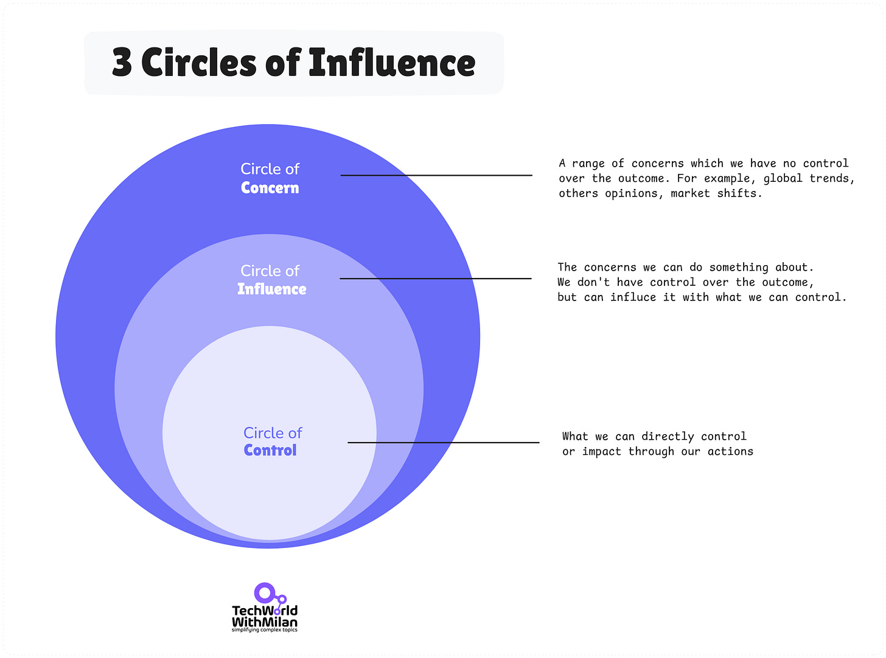](https://substackcdn.com/image/fetch/$s_!RISf!,f_auto,q_auto:good,fl_progressive:steep/https%3A%2F%2Fsubstack-post-media.s3.amazonaws.com%2Fpublic%2Fimages%2F5bfcd962-d3ef-4b75-92dd-0ba82abc8e02_2659x1976.png)3 Circles of Influence (inspired by Stephen Covey)

### **🧑‍💼 Take ownership of outcomes**

Start viewing yourself as the **owner** of your tasks and outcomes, not just a participant. This is about taking responsibility for results.

If something falls short, a high-agency person asks, *“What could I do differently next time?*” instead of immediately blaming teammates, tools, or circumstances.

Cultivating this ownership mentality is crucial; in fact, Doshi calls it *“[perhaps the most important](https://www.linkedin.com/pulse/high-agency-its-importance-how-cultivate-shreyas-doshi/)”* trait underlying high agency. When you own the outcome, you’re more likely to find a way to victory.

Remember, leaders and recruiters notice this trait: do you take accountability, or do you make excuses?

Start with **small wins**. Fix that broken process everyone complains about. Update the outdated documentation. Volunteer for the task no one wants.

[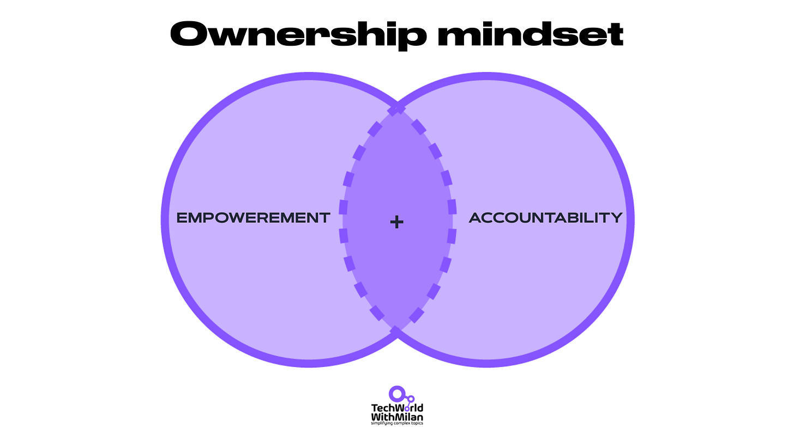](https://substackcdn.com/image/fetch/$s_!um2P!,f_auto,q_auto:good,fl_progressive:steep/https%3A%2F%2Fsubstack-post-media.s3.amazonaws.com%2Fpublic%2Fimages%2F1208cf59-506a-4176-a868-99a70a966744_1920x1080.png)Two key components to develop an ownership mindset

### **🤔 Change your language**

Replace "I can't because..." with "How can I...?" Make a habit of rephrasing challenges as questions of *how* rather than statements of *can’t*.

For example, if you catch yourself thinking, “*I can’t meet this deadline because the requirements changed*,” reframe it to: “*How can I still meet the deadline despite the changes?*”

This slight change in language nudges your brain toward solutions.

High-agency thinking often starts with phrases like “*What if we…*”, “How might I…”, “*Is there a way to…?*”. By contrast, low-agency thinking defaults to “*I can’t*” or “*We’re stuck.*”

Consciously monitor your self-talk and casual remarks – are they reactive or proactive?

Refer to the table below for examples of how to reframe challenges into questions.

[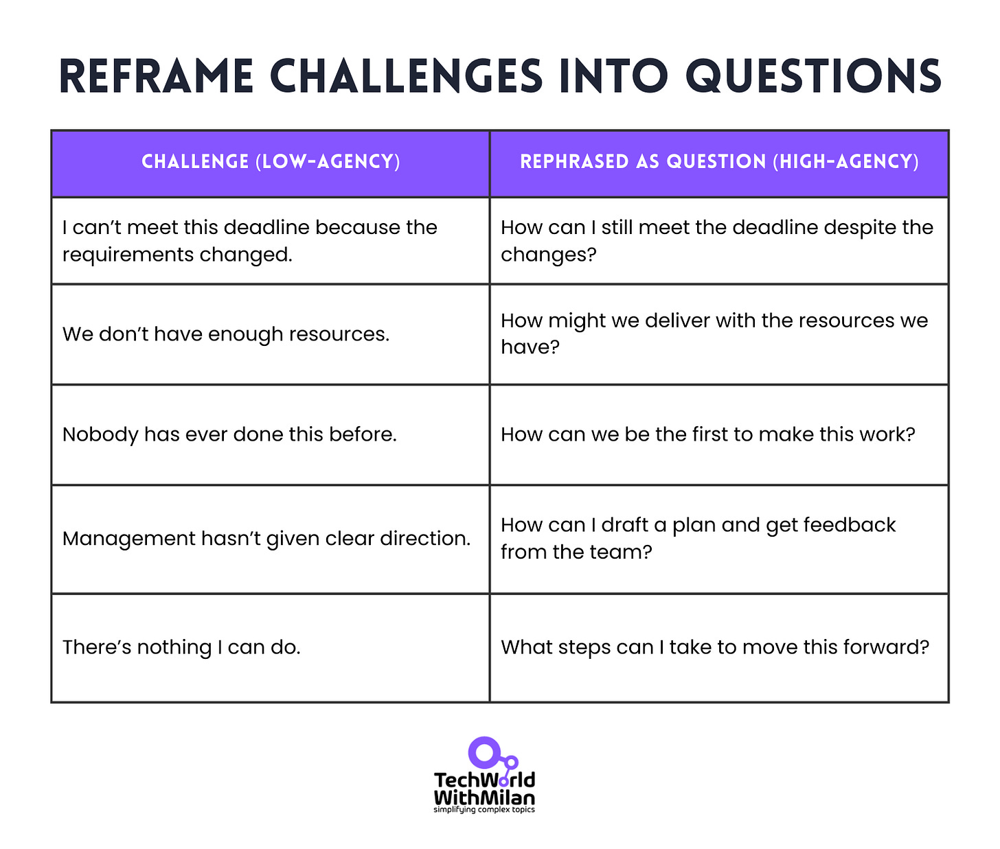](https://substackcdn.com/image/fetch/$s_!nQ9R!,f_auto,q_auto:good,fl_progressive:steep/https%3A%2F%2Fsubstack-post-media.s3.amazonaws.com%2Fpublic%2Fimages%2Fae6a638f-7b0f-498b-b0c9-925193851066_1545x1313.png)

### **🚀 Take initiative without permission**

High agency is built through **action**, not just thought. Look for opportunities to step up without being asked.

This could be as simple as fixing a minor bug that has been annoying everyone, creating a new spreadsheet to streamline a process, or volunteering to do glue work (work that needs to be done but no one is doing it).

As one leadership coach puts it, *credibility (and agency) comes from doing work that no one explicitly asked you to do* – identifying needs and addressing them. If you always wait for assignments, you’re exercising zero agency.

So, start **small**: pick something in your realm that could be improved and take the initiative to enhance it. Not only does this build your “agency muscle,” it also signals to others that you’re a proactive problem-solver.

Taking initiative (Image: [Freepik](http://www.freepik.com/))

### **🤝 Build alliances**

Having agency doesn’t mean “go it alone” – in fact, high-agency people often excel at rallying support and influencing stakeholders so they *can* move forward. If one approach isn’t working, who else could help, or what angle might persuade?

Rather than throwing up your hands, consider **who** you need to convince or collaborate with to resolve the situation.

This could mean **cultivating relationships with mentors, finding allies in other departments, or simply communicating your ideas more effectively**.

High agency includes the skill of bringing others along, so your initiatives don’t exist in a vacuum.

Influence is a force multiplier for agency – it helps turn your personal drive into organizational momentum.

Find one person this week who could help with your current challenge. Take them to coffee. Listen more than you talk.

One of the good starts in this direction is the material from the book “**[How to Win Friends & Influence People](https://amzn.to/3UFQ1BQ)**” by Dale Carnegie.

[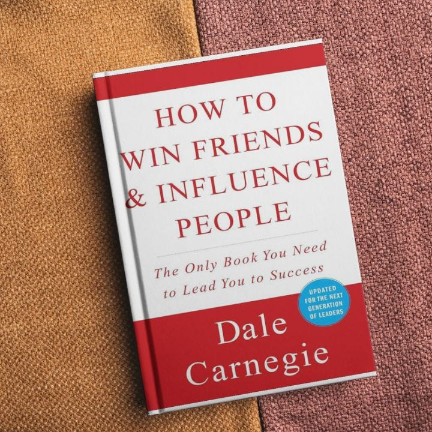](https://substackcdn.com/image/fetch/$s_!LTiy!,f_auto,q_auto:good,fl_progressive:steep/https%3A%2F%2Fsubstack-post-media.s3.amazonaws.com%2Fpublic%2Fimages%2F469b3c9b-161d-4a86-9aaf-db52aaeba2bc_720x720.jpeg)[How to Win Friends and Influence People](https://amzn.to/3UFQ1BQ) by Dale Carnegie

### **🌱 Embrace a growth mindset**

Finally, remember that the agency itself can grow. If you’ve been operating in a low-agency way, it’s not a fixed identity – **it’s a set of habits that you can change**.

Begin with the conviction that your actions matter and that you *can* develop the skills to be more proactive. **Challenge the limiting stories you’ve internalized**(“I’m new,” “I’m not in charge,” “failure would be disastrous,” etc.).

High-agency people often share an outlook that every problem has a solution, or at least a valuable lesson. **They view setbacks as feedback and skill gaps as temporary opportunities for growth**.

By cultivating resilience and continuously building your skills, you expand the scope of what you’re capable of influencing. In short, **high agency is a practice** – the more you exercise it, the stronger it gets.

[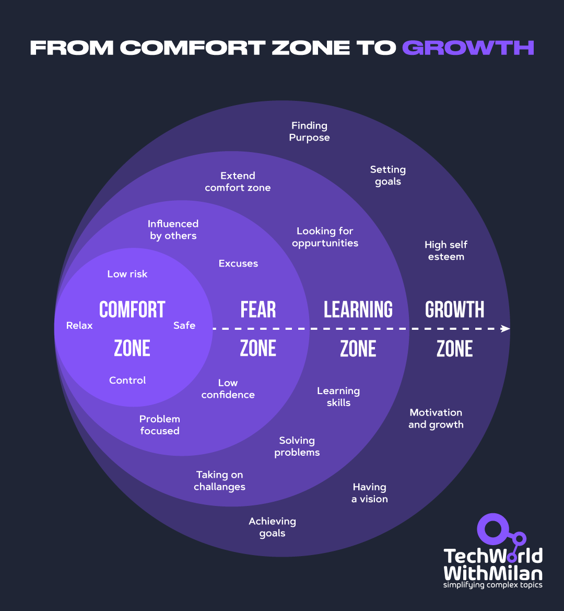](https://substackcdn.com/image/fetch/$s_!5uSX!,f_auto,q_auto:good,fl_progressive:steep/https%3A%2F%2Fsubstack-post-media.s3.amazonaws.com%2Fpublic%2Fimages%2Fa8ca0406-f9d8-4187-813b-49b88a204a64_1080x1169.png)From comfort zone to growth zone

## 6. Conclusion

Developing high agency won’t be easy – it involves pushing yourself out of comfort zones and persisting where others give up. But it *is* learnable.

As Doshi encourages, “*it’s not inscrutable magic; you can learn it, and becoming a high-agency individual will be profoundly rewarding for you and those you work with”*.

So, how can you start? **Start with small change**s: speak up with a solution in the next meeting, volunteer for that tough task nobody wants, or revisit a stalled project and see if you can revive it.

Every time you choose to act rather than excuse, you’re building your agency.

**Imagine what you could achieve if you operated with 10× more agency?** High agency is the trait that can take you farther than talent alone ever will. When you cultivate it, you won’t just unlock new opportunities for yourself – you’ll inspire your colleagues and maybe even change “the system” around you.

The mindset of *“I will find a way”* is powerful and contagious. So start where you are, with what you have, and experience how much farther you can go when you decide to be *“relentlessly resourceful.”*

In a world of increasing uncertainty and rapid change, high agency provides the ultimate competitive advantage: **the confidence and capability to shape your own reality rather than simply accepting whatever circumstances arise**.

The question isn't whether you can develop it—the question is whether you'll choose to start today.

---

## 🤝 How can I help you become a high agency person

I’m offering **[two coaching slots](https://newsletter.techworld-with-milan.com/p/coaching-services)** in **September**.

I work with mid-career individuals in tech, product, engineering, design, operations, and data, who want to stop waiting for permission and start owning their outcomes.

If you're tackling tough, often-untold challenges, such as building trust in leadership conversations, navigating office power dynamics, making a fast impact in a new role, reclaiming energy in your career, or managing self-worth under AI pressure, I’d love to help.

**What I do:**

- One-on-one, audio-only 45-minute coaching
- Confidential and anonymized sessions
- You review before anything is shared
- You leave with clear, actionable next steps and insight into your own mindset

Interested? **Please complete this brief form** to help me better understand your challenge.

I’ll reach out if it looks like a fit.

[Apply for coaching](https://docs.google.com/forms/d/e/1FAIpQLSemlZDWppO370uxZfrVAHSmZowe8BazfWdAWMf3T7Qz0TycKg/viewform?usp=sharing&ouid=111954354459901627789)

—Milan

[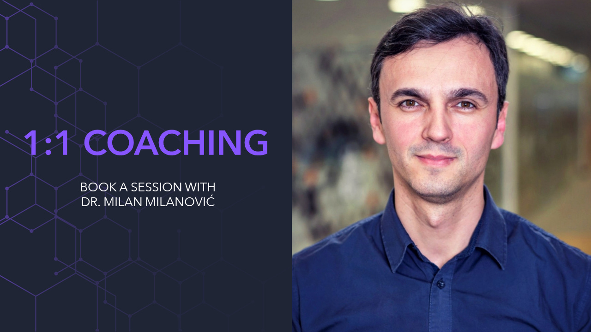](https://newsletter.techworld-with-milan.com/p/coaching-services)[1:1 Coaching](https://newsletter.techworld-with-milan.com/p/coaching-services) with Dr. Milan Milanovic

---

## **More ways I can help you:**

- [📚](https://www.patreon.com/techworld_with_milan/shop/ultimate-net-bundle-for-2025-1519389?utm_medium=clipboard_copy&utm_source=copyLink&utm_campaign=productshare_creator&utm_content=join_link)**[The Ultimate .NET Bundle 2025](https://www.patreon.com/techworld_with_milan/shop/ultimate-net-bundle-for-2025-1519389?utm_medium=clipboard_copy&utm_source=copyLink&utm_campaign=productshare_creator&utm_content=join_link)** 🆕. 500+ pages distilled from 30 real projects show you how to own modern C#, ASP.NET Core, patterns, and the whole .NET ecosystem. You also get 200+ interview Q&As, a C# cheat sheet, and bonus guides on middleware and best practices to improve your career and land new .NET roles. **[Join 1,000+ engineers](https://www.patreon.com/techworld_with_milan/shop/ultimate-net-bundle-for-2025-1519389?utm_medium=clipboard_copy&utm_source=copyLink&utm_campaign=productshare_creator&utm_content=join_link)**.
- [📦](https://www.patreon.com/techworld_with_milan/shop/premium-resume-package-1721454?utm_medium=clipboard_copy&utm_source=copyLink&utm_campaign=productshare_creator&utm_content=join_link)**[Premium Resume Package](https://www.patreon.com/techworld_with_milan/shop/premium-resume-package-1721454?utm_medium=clipboard_copy&utm_source=copyLink&utm_campaign=productshare_creator&utm_content=join_link) 🆕**. Built from over 300 interviews, this system enables you to craft a clear, job-ready resume quickly and efficiently. You get ATS-friendly templates (summary, project-based, and more), a cover letter, AI prompts, and bonus guides on writing resumes and prepping LinkedIn. **[Join 500+ people](https://www.patreon.com/techworld_with_milan/shop/premium-resume-package-1721454?utm_medium=clipboard_copy&utm_source=copyLink&utm_campaign=productshare_creator&utm_content=join_link)**.
- [📄](https://www.patreon.com/techworld_with_milan/shop/complete-tech-resume-reality-check-311008?utm_medium=clipboard_copy&utm_source=copyLink&utm_campaign=productshare_creator&utm_content=join_link)**[Resume Reality Check](https://www.patreon.com/techworld_with_milan/shop/complete-tech-resume-reality-check-311008?utm_medium=clipboard_copy&utm_source=copyLink&utm_campaign=productshare_creator&utm_content=join_link)**. Get a CTO-level teardown of your CV and LinkedIn profile. I flag what stands out, fix what drags, and show you how hiring managers judge you in 30 seconds. **[Join 100+ people](https://www.patreon.com/techworld_with_milan/shop/complete-tech-resume-reality-check-311008?utm_medium=clipboard_copy&utm_source=copyLink&utm_campaign=productshare_creator&utm_content=join_link)**.
- [📢](https://www.patreon.com/techworld_with_milan/shop/short-linkedin-content-creator-311232?utm_medium=clipboard_copy&utm_source=copyLink&utm_campaign=productshare_creator&utm_content=join_link)**[LinkedIn Content Creator Masterclass](https://www.patreon.com/techworld_with_milan/shop/short-linkedin-content-creator-311232?utm_medium=clipboard_copy&utm_source=copyLink&utm_campaign=productshare_creator&utm_content=join_link)**. I share the system that grew my tech following to over 100,000 in 6 months (now over 255,000), covering audience targeting, algorithm triggers, and a repeatable writing framework. Leave with a 90-day content plan that turns expertise into daily growth. **[Join 1,000+ creators](https://www.patreon.com/techworld_with_milan/shop/short-linkedin-content-creator-311232?utm_medium=clipboard_copy&utm_source=copyLink&utm_campaign=productshare_creator&utm_content=join_link)**.
- [✨](https://www.patreon.com/c/techworld_with_milan)**[Join My Patreon](https://www.patreon.com/c/techworld_with_milan)**[https://www.patreon.com/c/techworld_with_milan](https://www.patreon.com/c/techworld_with_milan)**[Community](https://www.patreon.com/c/techworld_with_milan) and [My Shop](https://www.patreon.com/c/techworld_with_milan/shop)**. Unlock every book, template, and future drop, plus early access, behind-the-scenes notes, and priority requests. Your support enables me to continue writing in-depth articles at no cost. **[Join 2,000+ insiders](https://www.patreon.com/c/techworld_with_milan)**.
- [🤝](https://newsletter.techworld-with-milan.com/p/coaching-services)**[1:1 Coaching](https://newsletter.techworld-with-milan.com/p/coaching-services)** – Book a focused session to crush your biggest engineering or leadership roadblock. I’ll map next steps, share battle-tested playbooks, and hold you accountable. **[Join 100+ coachees](https://newsletter.techworld-with-milan.com/p/coaching-services)**.

---

## **Want to advertise in Tech World With Milan? 📰**

If your company is interested in reaching an audience of founders, executives, and decision-makers, you may want to **[consider advertising with us](https://newsletter.techworld-with-milan.com/p/sponsorship-of-tech-world-with-milan)**.

---

## **Love Tech World With Milan Newsletter? Tell your friends and get rewards.**

Share it with your friends by using the button below to get benefits (my books and resources).

[Share Tech World With Milan Newsletter](https://newsletter.techworld-with-milan.com/?utm_source=substack&utm_medium=email&utm_content=share&action=share)

[Track your referrals here](https://newsletter.techworld-with-milan.com/leaderboard).