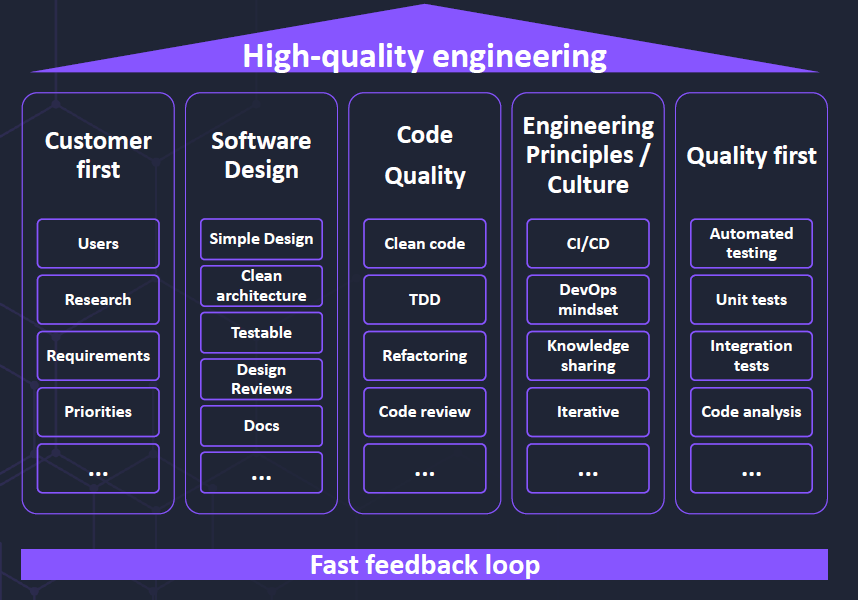
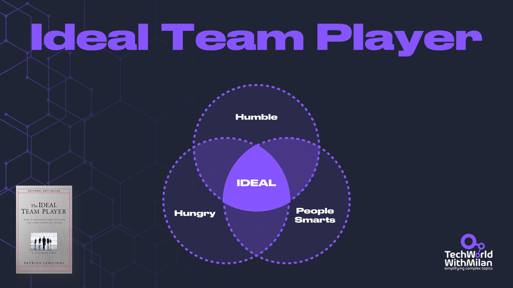
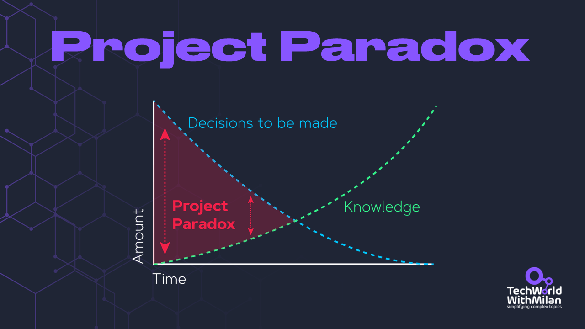
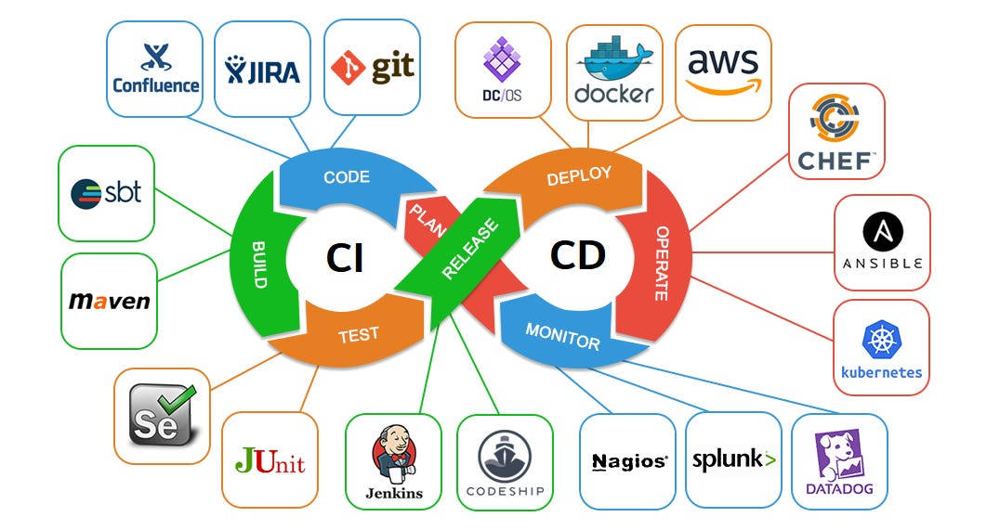
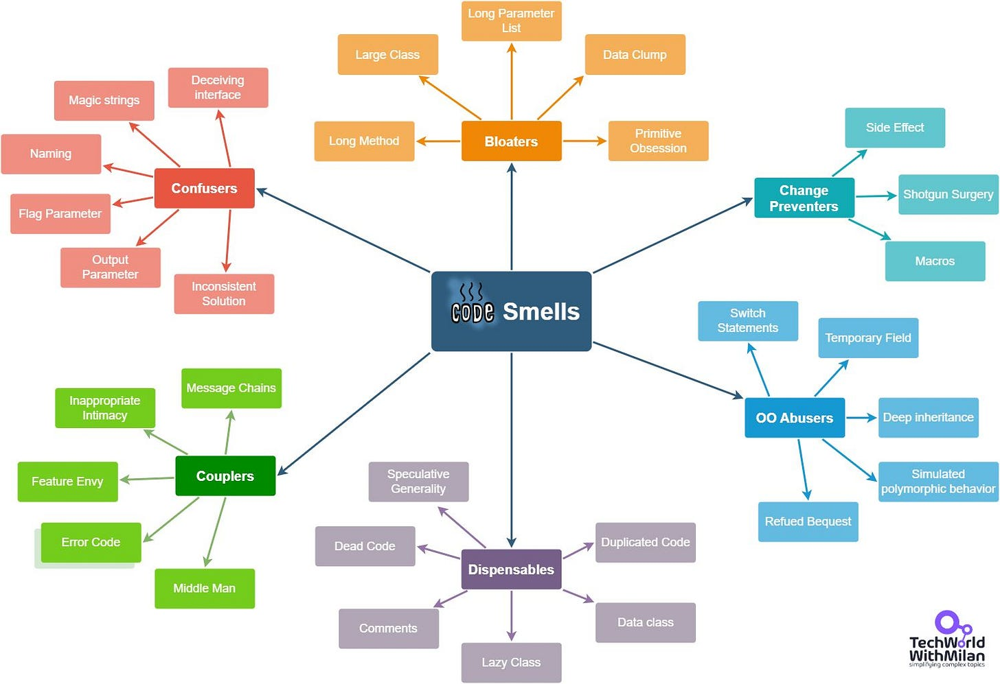

# High-Quality Work in Software Engineering

When working in software engineering organizations, we try to understand what makes some organizations suitable and what is not. For example, some organizations produce good software, and some do not. We usually need some Agile method, such as Scrum, to use Clean code or even TDD, and we are set to be good. However, things take more work and clarity.

To have high-quality engineering organizations, we need to have the following five pillars:

1. **Customer centricity**
2. **Great Software Design**
3. **Good Code Quality**
4. **Good Engineering Culture and Principles**
5. **Quality first mindset**
6. **Fast feedback loops**

# Great Team

But, before all of this, we must have a great team. In his book, "**[The Ideal Team Player: How to Recognize and Cultivate the Three Essential Virtues](https://amzn.to/3Wlm0ao)**," Patrick Lencioni (the author of "The Five Dysfunctions of a Team") outlined the characteristics of an ideal team player. According to Lencioni, a perfect team player embodies three essential virtues:

1. **Humility**- The ability to put the team's interests ahead of one's ego. Humble team players are aware of their strengths and weaknesses, they appreciate the contributions of others, and they are willing to share credit for the team's achievements.
2. **Hunger**- A strong drive and desire to succeed. Hungry team players are self-motivated, committed to their work, and always looking for ways to improve or contribute more to the team. They don't need constant supervision or encouragement because they are driven by their ambition and desire to excel.
3. **People Smarts** - Emotional intelligence is understanding and navigating social situations effectively. Team players with high people smarts can build strong relationships with their colleagues, empathize with others, communicate effectively, and resolve conflicts constructively.

Ideal Team Player by Patrick Lencioni

Lencioni emphasizes that **the ideal team player must balance all three virtues**. Someone strong in only one or two areas may need help contributing to the team's success. For example, a person with high humility but low hunger may be too passive, while someone with high but low people's smarts may be too aggressive or abrasive in their interactions. To cultivate the ideal team player, leaders should work on recognizing and nurturing these virtues in their team members and create a culture that values and rewards these traits.

**How we check this in our interviews**:

🔹 We try to be specific in our questions about targeted behaviors

🔹 We do a debrief after an interview with other interviewers

🔹 We try to pay attention to doubts about a person's humility, hunger, or people smarts, trying to understand it better.

Read more about building great teams in this article:
[

#### Building High-Performing Teams
[Dr. Milan Milanović](https://substack.com/profile/24455408-dr-milan-milanovic)·April 20, 2023[Read full story](https://newsletter.techworld-with-milan.com/p/building-high-performing-teams)](https://newsletter.techworld-with-milan.com/p/building-high-performing-teams)
# Customer Focus

We must focus on the customer always. Because our goal is to have customers satisfied, and in the end, this will make our business grow. We can use Agile methodologies for large teams, such as Scrum, Kanban, or SAFe, to work with customers regularly. It doesn’t need to be any of those, but we need some **iterative development process.**This process should allow us to make early prototypes, experiment, and deliver value to customers.

We must note here that the customer is not usually interested in our tech stack, architecture, clean code, frameworks, etc., but in building the right product. We, as engineers, want to make the product right. So we need a plan and work on it.

Happy Customer (Credits: Unsplash)

# Simple Design

We usually see that **[the architecture is overrated, but the simple design is underrated](https://blog.pragmaticengineer.com/software-architecture-is-overrated/)**. And this means that we should not start immediately with some complex architectures, such as microservices, but start simple. We want a clean design because it is similar to clean code and easy to read and understand.

We want to try to create solutions and learn through them instead of **picking shiny architectural patterns** and using them for every project. Therefore, we should start our work on a design with a **simple document**of our design (e.g., in the form of RFC) and ask the team for feedback. Here we need to be explicit about the tradeoffs we need to make.

The desired architecture we want to achieve should be **testable, based on our business cases** (examples are Hexagonal and Clean architecture), and **designed for change**.

The problem here is the **project paradox**, which means that the number of essential decisions decreases when we work on a project. In contrast, the knowledge about the project domain increases. This implies that we need to make the most significant decisions at the start when we don’t know much about the project.

The Project Paradox

And what this means to us is to **delay decisions** until we reach the best time that will enable us to move forward in our project.

# Proper Architecture

Conway’s law says:

> *“Any organization that designs a system will inevitably produce a design whose structure is a copy of the organization’s communication structure.”*

In other words, the structure of a software system is often influenced by the structure and communication patterns within the team building it. This can result in more optimal software architecture for the problem being solved, as the team may focus on their own organizational needs over the system’s needs. This means an organization with small distributed teams will produce a modular service architecture, while an organization with large collocated teams will produce monolithic architecture.

We want to create development teams that encourage desired software architecture using **Inverse Conway Maneuver**. We want to have included architects, leaders, and others in defining the organizational structure of teams. This would enable us to have architects in the team from the start and give people time to architect our systems.

One recommended architecture type we can use is a **modular monolith** as a base of our architecture. Here we divide the system into manageable modules before assembling them into a monolith for a single deployment. This allows us to pull out separate modules into services later if needed.

Read here more on modular monoliths:
[

#### Why should you build a (modular) monolith first?
[Dr. Milan Milanović](https://substack.com/profile/24455408-dr-milan-milanovic)·May 11, 2023[Read full story](https://newsletter.techworld-with-milan.com/p/why-you-should-build-a-modular-monolith)](https://newsletter.techworld-with-milan.com/p/why-you-should-build-a-modular-monolith)
# Continuous Deployment

Continuous Deployment is a software development practice where changes to the codebase are automatically tested and deployed to the production environment. It's a step further from Continuous Delivery, a method where code changes are automatically tested and ready to be deployed but require a manual 'trigger' for the actual deployment.

In Continuous Deployment, every change that passes all stages of your production pipeline is released to your users automatically, without human intervention. Naturally, this implies that your development team has high confidence in its automated tests and infrastructure.

We want to deploy our software at the end of every iteration to production, or at least to the testing environment, but at the same time, we want to continue working on our features. We can do this by separating **releases from deployment**. This can be done, e.g., with feature flags or blue/green deployments.

Of course, this involves having a **proper CI/CD process**.

DevOps process

# Fighting Technical Debt

Technical debt can cause so much frustration and burnout to development teams. Software engineers can be aware of the side effects of technical debt. However, they often need to explain to the product team why quick and easy solutions to coding development are risky.

So, instead of stabilizing the situation, the **business keeps adding more features**, and the **technical debt grows**. We usually say because of this that, **technical debt is not a technical problem**. For that reason, every software development team must try their best to prevent the technical debt from accumulating so it doesn't result in the worst-case scenario, which is a project halt.

The main problem with Technical Debt is that **code is an abstract concept**, so it’s hard to explain what happens to business and management. So, companies could easily ignore what they don’t see or understand. So, here we need to be **explicit and visualize** our Technical Debt clearly for the company and management.

Usually, during the development of our software systems, the **capacity available for new features per development cycle decrease**(lead time is increasing) while **complexity builds up**. So, we **spend more time fighting the complexity than developing new features**.

Technical Debt

How we can deal with technical debt:

1. **Be transparent what is the issue**
2. **Make clear ownership of the product.**
3. **Empower the team to fix the problems.**
4. **Never ask for permission to refactor**
5. **Make development slower, but will gain more speed in the future**

Read more here about how to tackle Technical Debt:
[

#### How To Deal With Technical Debt
[Dr. Milan Milanović](https://substack.com/profile/24455408-dr-milan-milanovic)·March 23, 2023[Read full story](https://newsletter.techworld-with-milan.com/p/how-to-deal-with-technical-debt)](https://newsletter.techworld-with-milan.com/p/how-to-deal-with-technical-debt)
# Good Code

How do we know what is good and what is bad code? Kent Beck developed his four simple design rules while developing Extreme Programming in the late 1990s. According to him, **good code**:

1. **Passes the tests**
2. **Reveals intention**
3. **No duplication**
4. **Fewest elements**

So, the **bad code** is hard to understand and confusing.

The question is why we write bad code. Of course, there are different reasons (time pressure, already bad codebase, [broken window theory](https://blog.codinghorror.com/the-broken-window-theory/), etc.). But the good thing is that we can do something about it by enforcing the Boy Scout rule by Bob Martin.

> “It’s not enough to write the code well. The code must be kept clean over time… Leave the campground cleaner than you found it.”

So every day you open a file and write something, **make a slight improvement**. For example, rename a variable, refactor or extract some logic, write a test, etc.

We can also know if some code is terrible is to going the other way around and to search for smells in the code and then doing refactoring. There are different **[groups of code smells](https://refactoring.guru/refactoring/smells)**, and we should be aware of them.

Code Smells

# **Good Engineering Culture**

When we talk about producing high-quality software, we are usually oriented toward technical stuff only, but people are at the heart of the process. It doesn’t mean much if we have the latest tech stack if people who should use it are not confident. So the question is how we can have a positive engineering culture that would enable us to create great software. And here are a few things we should know:

- **Have a psychological safety to experiment and fail**(check the [Google Aristotle Project](https://rework.withgoogle.com/print/guides/5721312655835136/)).
- **If we are stuck for 2h, we should be able to ask someone for help.**
- **Doing code reviews and pair programming**
- **Job rotations and stretch roles**
- **Constant learning**
- **Knowledge sharing sessions**
- **Mentoring & Coaching**
- **Having T-Shaped experts with deep knowledge of one or more areas**
- **The developer team is happy and excited to work every day.**
- **And more.**

T-Shaped Experts

# Good Engineering Practices

We need to establish some good engineering practices along with good engineering culture. Good engineering practices are the base of what our engineers can produce and how.

Some good engineering practices in software engineering teams are:

- **Having a source control (mainly GIT these days)**
- **Having tests on all critical levels (check the Test Pyramid).**
- **Using Clean Code and fight code smells**
- **Using Design Patterns where appropriate**
- **Enabling 0 bug policy (no bugs allowed in the Backlog)**
- **Doing Test-Driven Development**
- **Checking for YAGNI, DRY, KISS, and SOLID principles**
- **Using Automatic code analysis**
- **Doing code reviews**
- **Documenting everything necessary in the code repository**

---

Thanks for reading Tech World With Milan Newsletter! Subscribe for free to receive new posts and support my work.