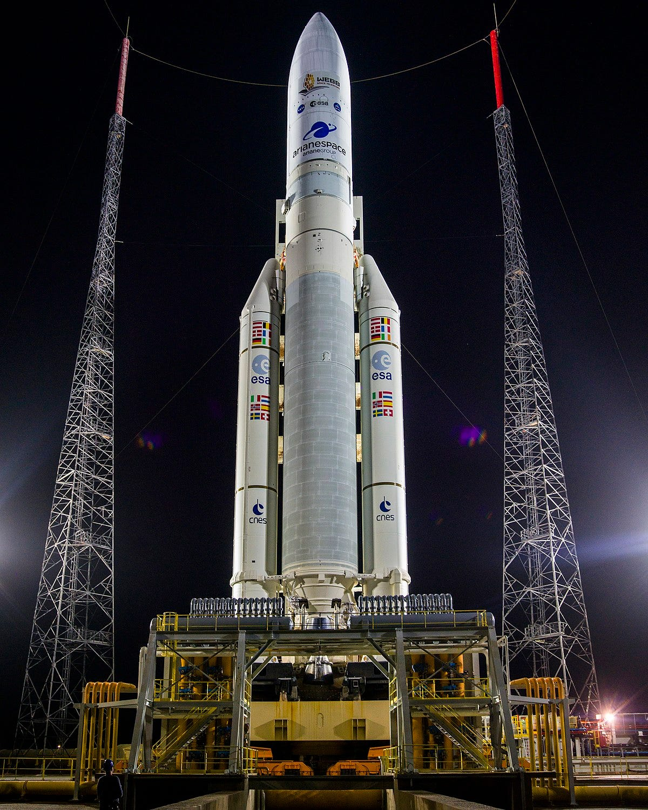
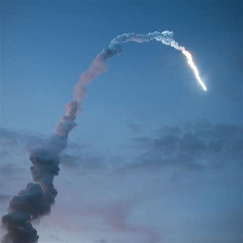
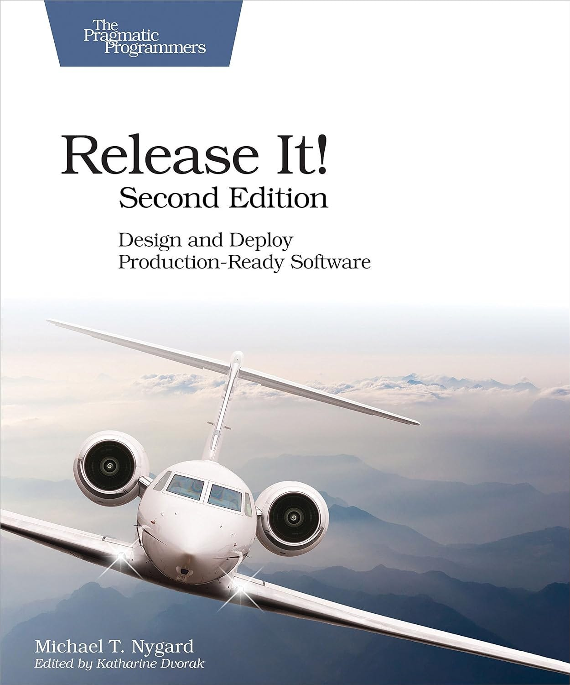
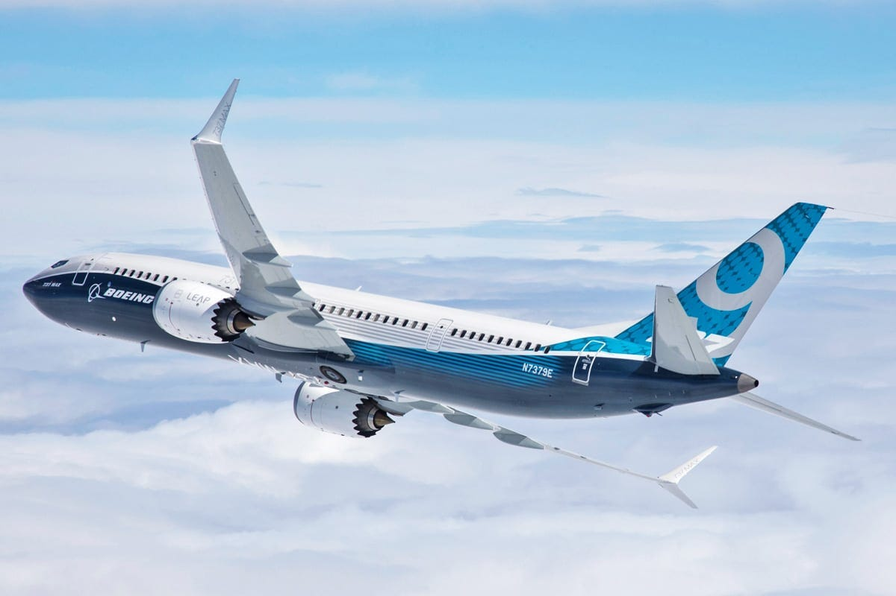
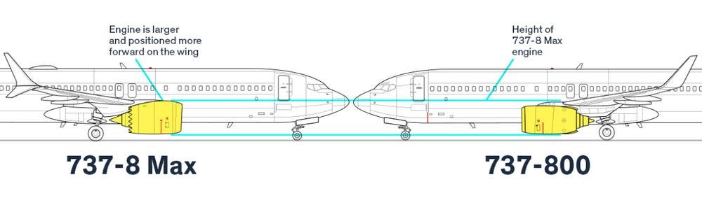

# How a Single Line of Code Brought Down a Billion Dollar Rocket

When we talk about software today, we should know that its importance is now at the very end of the spectrum of different technologies used. For example, in the aerospace world, the stakes are incredibly high, and **software glitches can lead to catastrophic outcomes**.

This issue will explore some notable cases in which software failures had significant repercussions in these high-stakes environments, where errors are not allowed.

So, let’s dive in.

---

## 🚀 Case 1. Ariane 5 disaster

On June 4, 1996, the European Space Agency (ESA) launched the **Ariane 5 rocket** for the first time, marking a significant moment in the history of space exploration. This mission was difficult, though, as a single line of code resulted in a catastrophic failure and the loss of the entire cargo, worth almost half a billion euros.

Ariane 5 rocket

Two communication satellites were intended to be transported into geostationary transfer orbit by the Ariane 5. The launch went smoothly until **the rocket deviated off track and burst 37 seconds into the flight**. A software flaw in the guidance system, which was in charge of regulating the rocket's course, was found to be the root of the disaster. The Ariane 5 launch is acknowledged as one of **history's most expensive software failures**. The destruction of the scientific satellites delayed scientific research into the workings of the Earth’s magnetosphere for almost 4 years.

What was **the cause**? A dead part of code from the last Ariane 4 mission, which began almost ten years prior, contained a simple and fixable programming error. The rocket used a method known as the horizontal bias, sometimes known as the **BH value**, to identify whether it was pointing up or down. This was represented using a 64-bit floating-point variable, which the guidance system used to convert to 16 16-bit signed integers. A 64-bit variable can represent billions of values, while a 16-bit can represent only 65,535 values. 

We know that integers are represented by the first bit used to store signs, and 16-bit integers can then range from -32,768 to 32,767. Yet, floating-point numbers are made to track a broader range of numbers, using the same numbers of bits between -1.8e+308 and -2.2e-308. If you try to store one into a 16-bit integer, it will be much **out of the bound of a signed integer**. So, what happened is a well-known **integer overflow**.

Ariane 5 disaster

Another contributing factor to the disaster was **user requirements** that Ariane 5 use a much steeper trajectory than previous ones, resulting in an incredible vertical velocity. 

What are some takeaways from the disaster?

- A copy-pasting code without understanding it (**Cargo-cult**) is a significant issue.
- Another one is the omission of proper **exception handling**.
- **Neglecting changed user requirements** and
- **Absence of proper testing**.

Official recommendations [by the board](http://sunnyday.mit.edu/accidents/Ariane5accidentreport.html) were:

**✅ R1 - Avoid using programs or systems that you don't require**. During flight, software should not operate unless necessary.

**✅ R2, R10, R11—Testing is essential**. Establish a test facility with as many real equipment pieces as possible, add authentic input data, and conduct thorough, closed-loop system testing. All missions must precede fully realized simulations and high test coverage is necessary.

**✅ R4 - Do code reviews**. All code details are essential in any programming language.

**✅ R6, R8, and R13 - Improve reliability by handling exceptions within tasks and creating backup systems to ensure smooth operations during issues**. It is important to consider software failures when defining critical components, recognizing that software can fail, too. Establishing a team to create strict software testing rules, ensuring high-quality standards

References:

- [Ariane 5: Flight 501 failure - Report by the Inquiry Board](https://esamultimedia.esa.int/docs/esa-x-1819eng.pdf) ([HTML version](http://sunnyday.mit.edu/accidents/Ariane5accidentreport.html))
- [Ariane 5: A programming problem](https://www.rvs.uni-bielefeld.de/publications/Reports/ariane.html)[?](https://web.archive.org/web/20180419041209/https://www.dropbox.com/s/a8f4dsmy23phc6z/Ladkin-Ariane5.html?dl=0) An extended discussion of the Ariane 5 failure

---

## ✈️ Case 2. How an Uncaught SQLException Grounded an Airline

In the recent incident reported by [Reuters](https://www.reuters.com/world/us/us-faa-says-unintentionally-deleted-files-prompted-computer-outage-2023-01-20/), the Federal Aviation Administration (FAA) explained that their review found that contract personnel "𝘶𝘯𝘪𝘯𝘵𝘦𝘯𝘵𝘪𝘰𝘯𝘢𝘭𝘭𝘺 𝘥𝘦𝘭𝘦𝘵𝘦𝘥 𝘧𝘪𝘭𝘦𝘴", making a **nationwide ground stop on January 11 that disrupted more than 11,000 flights**. They said that person was working on synchronization between a primary and a backup database.

This reminds me of an issue explained in chapter 2. of the “**[Release It](https://amzn.to/3HTCssM)**” book by Michael Nygard. The airline planned a failover on the database cluster that served its core system, which followed a service-oriented architecture. The phased rollout was planned and driven by features. That system handled searches that returned a list of flight details for different inputs (date, time, city). 

The airline ran on a cluster of J2EE application servers with a redundant Oracle database with redundant hardware load balancers, which was then **a very common high-availability architecture**. One day, engineers executed a manual database failer from Database 1 to Database 2 (backup one). They have done it many times, and everything went exactly as planned. Then, after 2 hours, the system stopped servicing requests visible on their kiosks. After some analysis, they decided to restart applications, which did the trick and stopped an airlane for about 3h. 

**After the post-mortem analysis of log files**, thread dumps, and configuration files, they identified the problem in their core system, not the one where the error was reported. Many threads were blocked, waiting for a response that never happened (in the method that did a lookup by a city). They found that the SQL closing statement, which was run in a final block, can also throw an **[SQLException](https://docs.oracle.com/javase/8/docs/api/java/sql/SQLException.html)** when the driver attempts to tell DB to release resources, which was not handled, and this caused resource pool exhaustion. 

What could they do better in this situation? It's impossible to prevent all errors; some bugs will happen. What we can do is **avoid bugs in one system from affecting another**.

“[Release It!](https://amzn.to/3W5Kkxa)” by Michael T. Nygard

---

## ✈️ Case 3. Boeing 737 MAX Disaster

In October 2018 and March 2019, **two Boeing 737 MAX aircraft crashed within five months of each other, claiming 346 lives**. The problem was caused partially by a software system designed to enhance flight safety.

Boeing 737 MAX 9

**MCAS—the Maneuvering Characteristics Augmentation System (software)** — is at the heart of the Boeing 737 MAX crisis. Born out of necessity, this software was Boeing's solution to a fundamental design challenge (software fix for a hardware problem [1]). The 737 MAX, with its larger, more fuel-efficient engines, had different aerodynamic properties than its predecessors. MCAS was meant to make the MAX handle the same as earlier 737 models, ensuring a seamless transition for pilots.

In theory, MCAS was elegant. It would automatically adjust the horizontal stabilizer to prevent the aircraft from stalling in steep turns or at low speeds. In practice, **it became a textbook example of how a single point of failure can cascade into disaster**.

The critical flaw? **MCAS relied on input from only one of the plane's two angle of attack (AOA) sensors**[1][2]. If that single sensor provided incorrect data, MCAS would activate unnecessarily, pushing the plane's nose down even when it shouldn't. To compound the issue, the system would reactivate repeatedly, potentially overwhelming pilots who weren't adequately informed about the system's existence or behavior.

By substituting a larger engine, Boeing changed the intrinsic aerodynamic nature of the 737 airliner. (Source: NOREBBO.COM)

However, the story of MCAS isn't complete without addressing a revelation that came to light in the aftermath of the crashes. Boeing was reported to have outsourced significant portions of the 737 MAX's software development to engineers who were paid as little as $9 an hour [4]. According to former Boeing software engineers, the company increasingly relied on temporary workers, some recent college graduates, employed by overseas software development centers. This decision, likely **driven by pressure to cut costs and speed up development, adds another layer of complexity to the 737 MAX saga**.

What we can learn from the story as software engineers:

1. **Remove a single point of failure**. The MCAS saga is a stark reminder of why redundancy is crucial in critical systems. Relying on a single data source - in this case, one AOA sensor - created a vulnerability that had catastrophic consequences. In our work, we must always ask: "What happens if this component fails?"
2. **Keep software and systems simple but not too simple (KISS)**. The MCAS system was a prime example of overengineering a solution to a hardware problem. Rather than addressing the underlying instability of the 737 MAX's design, Boeing opted for a software "fix" that introduced new vulnerabilities.
3. **Lack of domain expertise**. Many engineers hired from outsourcing companies don’t have deep experience in aerospace engineering and safety-critical systems. This led to communication issues and mistakes that required multiple rounds of revisions.
4. **Bad testing practices**. Despite extensive testing, the fatal flaws in MCAS weren't caught before the planes entered service. This raises important questions about the adequacy of current testing and simulation practices, especially for systems where real-world conditions are challenging to replicate fully.

What can we do daily as software engineers to improve these issues? Here are a few things:

**✅ Implement proper error handling**. Design your systems with the assumption that components will fail. Implement redundancies, cross-checks, and fail-safe mechanisms.

**✅ Focus on users**. Ensure that your systems communicate clearly with their users, especially about their current state and any automated actions. Provide users with the information and controls they need to make informed decisions and override automated systems when necessary.

**✅ Prioritize integration testing**. While unit tests are crucial, they're not enough. Invest time and resources in comprehensive, system-wide integration testing. Test edge cases and failure modes.

**✅ Cultivate a culture of open communication.**Create an environment where concerns can be raised without fear and near misses are seen as valuable learning opportunities rather than embarrassing ones to be swept under the rug.

**✅ Advocate for proper resource allocation.** As software engineers, we advocate for the resources to do our jobs properly. This includes pushing back against unrealistic deadlines, insufficient testing time, or cost-cutting measures that could compromise safety [5].

**References**:

[1] “[How the Boeing 737 Max disaster looks to a software developer](https://spectrum.ieee.org/how-the-boeing-737-max-disaster-looks-to-a-software-developer)”, Gregory Travis, IEEE Spectrum, 2019.

[2] “[Killer software: 4 lessons from the deadly 737 MAX crashes](https://www.fierceelectronics.com/electronics/killer-software-4-lessons-from-deadly-737-max-crashes)”, Matt Hamblen.

[3] “[Eight lines of code could have saved 346 lives in Boeing 737 MAX crashes, expert says](https://www.fierceelectronics.com/embedded/eight-lines-code-could-have-saved-346-lives-boeing-737-max-crashes-expert-says).” Matt Hamblen

[4] “[Boeing’s 737 Max Software Outsourced to $9-an-Hour Engineers](https://www.bloomberg.com/news/articles/2019-06-28/boeing-s-737-max-software-outsourced-to-9-an-hour-engineers?leadSource=reddit_wall)“, Bloomberg, 2019.

[5] “[The Boeing 737 MAX: Lessons for Engineering Ethics](https://www.ncbi.nlm.nih.gov/pmc/articles/PMC7351545/)”, Herket J. et al., [Sci Eng Ethics.](https://www.ncbi.nlm.nih.gov/pmc/articles/PMC7351545/#) 2020.

> *Also, check [NASA's Top 10 rules for better coding](https://newsletter.techworld-with-milan.com/i/135974679/top-nasa-rules-for-better-coding).*

---

## More ways I can help you

1. **[Patreon Community](https://www.patreon.com/techworld_with_milan)**: Join my community of engineers, managers, and software architects. You will get exclusive benefits, including all of my books and templates (worth 100$), early access to my content, insider news, helpful resources and tools, priority support, and the possibility to influence my work.
2. **[Promote yourself to 33,000+ subscribers](https://newsletter.techworld-with-milan.com/p/sponsorship-of-tech-world-with-milan)**by sponsoring this newsletter. This newsletter puts you in front of an audience with many engineering leaders and senior engineers who influence tech decisions and purchases.
3. **1:1 Coaching:** [Book a working session with me](https://newsletter.techworld-with-milan.com/p/coaching-services). 1:1 coaching is available for personal and organizational/team growth topics. I help you become a high-performing leader 🚀.

---

Thanks for reading Tech World With Milan Newsletter! Subscribe for free to receive new posts and support my work.