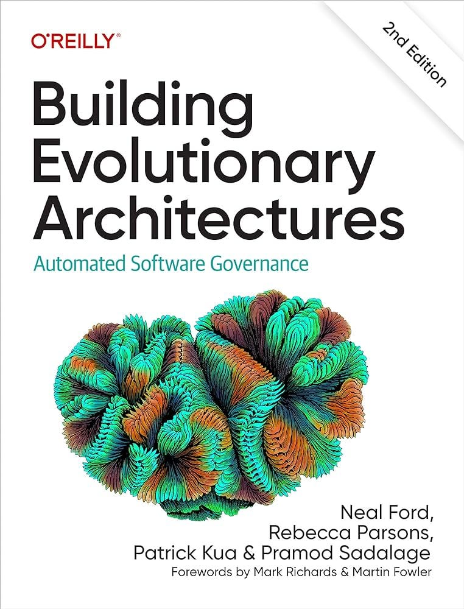
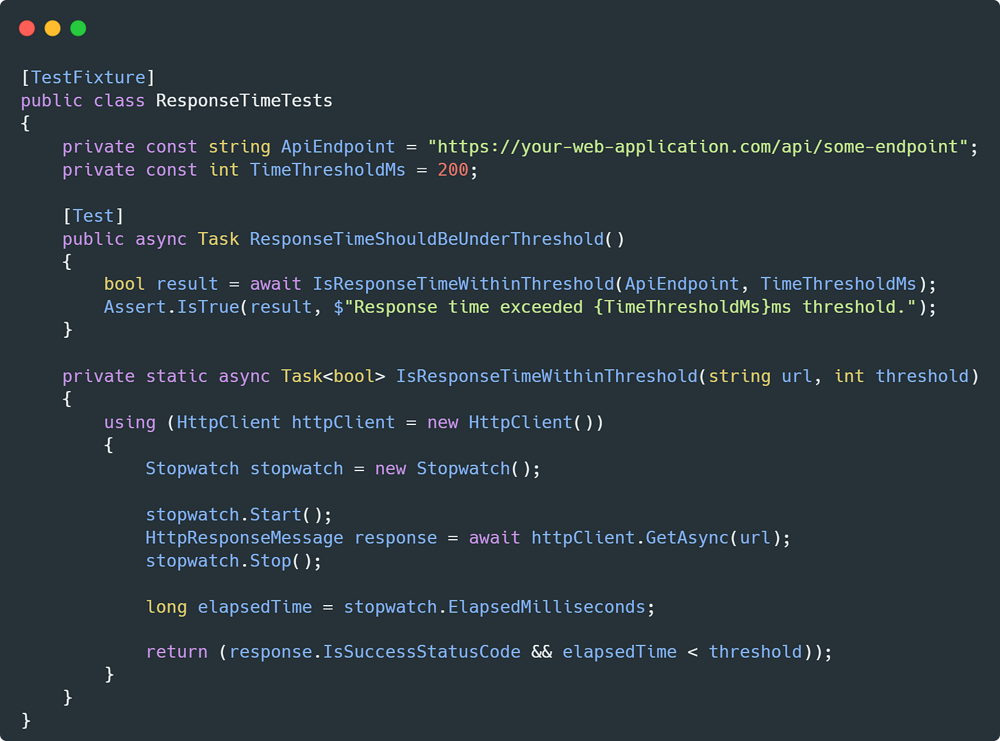
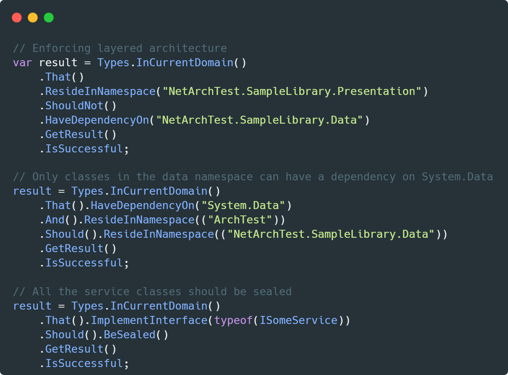
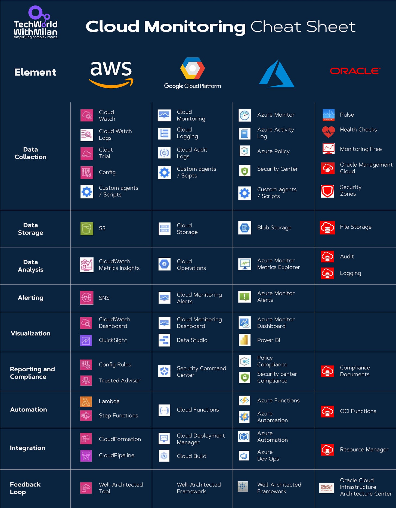

# How to test your software architectures

A standard problem development organization faces is that code implementations often need to be more consistent with the original design and architecture. The problem is common enough, especially on large projects.

Software architecture is essential for codebases' comprehensibility, changeability, and adherence to software quality goals. Regarding the codebase, three significant software architecture goals are **maintainability, replaceability, and extensibility**.

To keep a software system in good shape, you must ensure that it is modular and that interdependencies are as small and correct as possible, **leading to high cohesion and loose coupling.** These goals can be met by introducing specific patterns and code conventions documented and communicated to and by the entire development team that has agreed to them.

We can use **Fitness functions** to ensure that our architectural goals are met. Neal Ford, Rebecca Parsons, and Patrick Kua promote them in the book **[Building Evolutionary Architectures.](https://amzn.to/45mhBXy)** With fitness functions, we can write tests that measure a system's alignment with architectural goals (attributes such as security, resilience, or stability) in a similar fashion to TDD. Such functions should be drafted in a testing framework and included in appropriate CI/CD pipelines.

In **[Building Evolutionary](https://amzn.to/45mhBXy)Architecture**, architectural fitness functions are defined as:

> Any mechanism that performs an objective integrity assessment of some architectural characteristic or combination of architectural characteristics.

Building Evolutionary Architectures, Ford N. et al. (2022)

### Example of Architectural Fitness Functions

One example of such a function would be in the context of a web application, where one of our architectural goals is that our app should respond to user requests within 200ms (latency and performance). Here, we measure the response time for an API endpoint. If we want to automate it, we can put this function into your CI/CD pipeline to run automatically whenever new code is pushed.

An example of the architectural fitness function in C#

Some tools can also test that a code implementation is consistent with the defined architecture. **[ArchUnit](https://www.archunit.org/)** is a small, simple, extensible, open-source Java testing library for verifying predefined application architecture characteristics and architectural constraints. At the same time, **[NetArchTest](https://github.com/BenMorris/NetArchTest)**is a fluent API for .NET Standard that can enforce architectural rules in unit tests.

Here is an example in **[NetArchTest](https://github.com/BenMorris/NetArchTest)** of how we can enforce layered architecture and some specific rules. You can test these rules separately and assert the result (with `Assert.True`).

Enforcing architectural rules by using NetArchTest

---

## Bonus: Cloud Monitoring Cheat Sheet

Check out the Cloud Monitoring Cheat Sheet for all significant Cloud providers (AWS, GCP, Azure, and OCI).

When we talk about monitoring, we cover the following aspects:

- **Data Collection:** Gathering information from various sources to monitor the performance and health of cloud resources.
- **Data Storage:** Storing the collected monitoring data in a repository or database for future reference and analysis.
- **Data analysis:** Examining the stored monitoring data to identify patterns, anomalies, or insights about the cloud environment.
- **Alerting:** Receiving notifications when specific conditions or thresholds are met or exceeded.
- **Visualization:** Representing monitoring data graphically, such as through charts or dashboards, to make it easier to understand.
- **Reporting:** Generating summaries or detailed monitoring data reports to ensure adherence to policies or regulations.
- **Automation**: Using software to automatically perform tasks or actions based on monitoring data without manual intervention.
- **Integration:** Combining monitoring tools or data with other systems or applications to enhance functionality.
- **Feedback Loops are** processes where the monitoring results or outcomes are used to improve or adjust the cloud environment.

Cloud Monitoring Cheat Sheet

Check the complete Cloud Product mapping in **[the following GitHub repository.](https://github.com/milanm/Cloud-Product-Mapping)**

---

## More ways I can help you

1. **1:1 Coaching:** [Book a working session with me](https://newsletter.techworld-with-milan.com/p/coaching-services). 1:1 coaching is available for personal and organizational/team growth topics. I help you become a high-performing leader 🚀.
2. **[Promote yourself to 16,000+ subscribers](https://newsletter.techworld-with-milan.com/p/sponsorship-of-tech-world-with-milan)**by sponsoring this newsletter.

---

Thanks for reading Tech World With Milan Newsletter! Subscribe for free to receive new posts and support my work.