# How does Netflix manage to show you a movie without interruptions

*A deep dive in the Netflix systems architecture.*

Have you ever pressed play on [Netflix](https://www.netflix.com/rs/) and wondered what technology ensures your video starts instantly and plays without interruptions? Simply pressing play triggers a global technological symphony that delivers content to over **301 million subscribers in 190 countries**.

But that’s not all, this is also Netflix:

- Netflix accounts for **15% of global downstream internet traffic**, making it the most significant single application in terms of internet usage
- Netflix users streamed over **94 billion hours of content** globally in the second half of 2024
- At peak hours, **Netflix streaming can consume a significant share of global Internet bandwidth** (reportedly up to 15%)​
- Netflix is used by **53% of U.S. households**
- Netflix is responsible for **25.7% of daily video streaming among U.S. adults**
- The average global Netflix user spends **1 hour and 46 minutes daily** streaming content
- Netflix generates nearly **$10.42 billion in revenue per quarter**, with a projected annual revenue of $44 billion for 2025

Behind this massive operation lies one of the world's most sophisticated distributed systems architectures.

This article explores the technical decisions and architectural patterns that make streaming on Netflix effortless. It also discusses what software engineers and architects can learn from this extraordinary-scale system.

Learning more about Netflix's architecture and infrastructure over the years was not so challenging, as communication is one of the company's core values. The company often shares its experiences on the [Netflix Technology Blog](https://netflixtechblog.com/).

So, let’s dive in.

> *Note that I’m not connected with Netflix, nor do I have insider information. The whole article is based on the information available on the Internet and books.*

---

## [Your .NET App is Now a Designer—Meet Uno Platform Hot Design (Sponsored)](https://platform.uno/hot-design?utm_source=drmilan&utm_medium=email&utm_campaign=Hot-DesignB)

*Are you tired of the endless build-restart cycle to tweak UI or battling the gap between static mockups and your actual application data?*

***Enter [Hot Design](https://platform.uno/hot-design?utm_source=drmilan&utm_medium=email&utm_campaign=Hot-DesignB)** - a Visual Designer that uses your live data. Modify layouts, see how components react to real data scenarios, and adjust bindings instantly without breaking your focus. Stay productive, stay in your IDE, and quickly ship beautiful, data-robust cross-platform .NET apps.*

[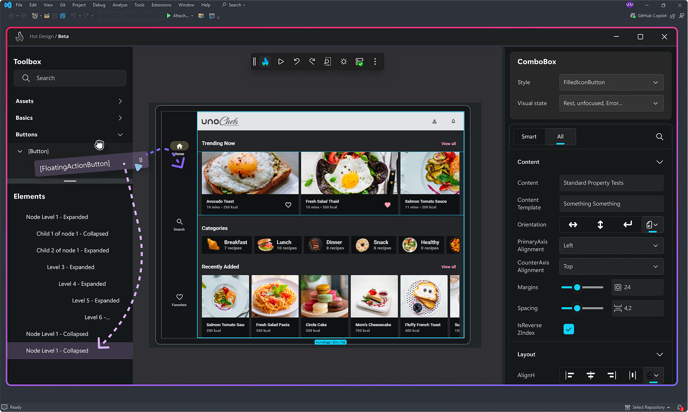](https://platform.uno/hot-design?utm_source=drmilan&utm_medium=email&utm_campaign=Hot-DesignB)

[Check it out!](https://platform.uno/hot-design?utm_source=drmilan&utm_medium=email&utm_campaign=Hot-DesignB)

---

**[Sponsor this newsletter](https://newsletter.techworld-with-milan.com/p/sponsorship-of-tech-world-with-milan)**

## 1. The tale of two clouds: AWS and Open Connect

When you open the Netflix app, you're immediately interacting with the first of Netflix's two cloud systems. This architectural division is fundamental to understanding how Netflix delivers video so reliably:

- **🎬 Before you press play, you should know that** Everything from browsing the catalog to seeing recommendations happens on Amazon Web Services (AWS) - **Control Plane**.
- **▶️ After you press play** and select a title, Netflix's custom Content Delivery Network, Open Connect, takes over - **Data Plane**.

The control plane requires transactional consistency, high availability (check the [CAP Theorem](https://en.wikipedia.org/wiki/CAP_theorem)), and moderate bandwidth. The data plane demands high throughput and edge distribution but can tolerate eventual consistency. By separating these concerns, Netflix optimizes each plane for its specific characteristics.

Netflix streams over [1.8 billion hours of video weekly](https://www.broadbandtvnews.com/2025/02/27/netflix-to-surpass-youtube-video-revenue-in-2025/), accounting for [over 40% of peak internet traffic in the United States](https://www.bbc.com/news/technology-45745362). This volume would be too much for a traditional monolith architecture.

Netflix wasn't always structured this way. In its early days, it operated **traditional data centers with monolithic applications.** However, after a [critical service outage 2008](https://web.archive.org/web/20090215021027/http://blog.netflix.com/2008/08/shipping-delay-recap.html) caused by database corruption prevented it from shipping DVDs for three days, Netflix boldly decided to move to AWS and reinvent its architecture.

This migration **took eight years**, during which Netflix grew its streaming customer base 8x [2]. After this, Netflix became more reliable on AWS and operated in three regions: North Virginia, Portland, Oregon, and Dublin, Ireland (with availability zones).

Netflix on a TV at home (Credits: Unsplash)

## 2. Before you press play: The Microservice architecture

When you first open Netflix, you interact with hundreds of AWS microservices. These services collectively create the browsing experience, show you personalized recommendations, and prepare for the moment when you press play.

Netflix abandoned its monolithic architecture after the 2008 incident, rebuilding its platform as hundreds of **independent microservices**. This shift enabled them to scale horizontally instead of vertically, adding more instances of services as demand increased rather than upgrading to more considerable servers.

This microservices architecture allows each feature team to deploy independently, and the system achieves greater **fault isolation** and **horizontal scalability** than a monolithic design.

An example of a typical Microservice architecture:

[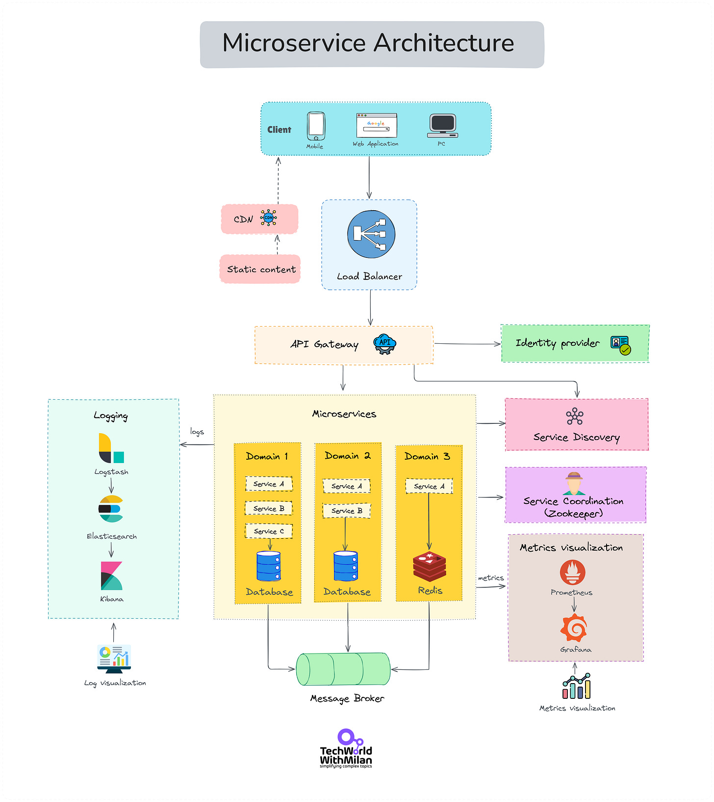](https://substackcdn.com/image/fetch/$s_!Gwfe!,f_auto,q_auto:good,fl_progressive:steep/https%3A%2F%2Fsubstack-post-media.s3.amazonaws.com%2Fpublic%2Fimages%2F9997ee02-99eb-4e68-b6b8-521e0d4834b7_5404x6062.png)

The key microservices involved include:

- **🔐 Authentication service**: Verifies your identity and ensures secure access
- **👤 User Profile service**: Retrieves your preferences and viewing history
- **🎬 Content service**: Provides metadata about available shows and movies
- **🧠 Recommendation service**: Analyzes your viewing patterns to suggest content you might enjoy
- **🔎 Search service**: Combs through Netflix's vast catalog when you look for specific titles

All these services communicate through well-defined APIs, creating a loosely coupled system. If the recommendation service experiences problems, it doesn't affect your ability to search or play content you've already found. This isolation is crucial for maintaining a reliable user experience.

> *Netflix runs **hundreds of microservices** (reports mention numbers around 700).*

[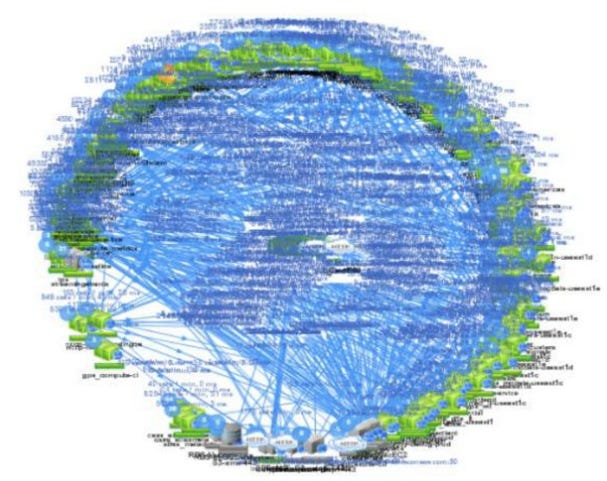](https://substackcdn.com/image/fetch/$s_!3ibV!,f_auto,q_auto:good,fl_progressive:steep/https%3A%2F%2Fsubstack-post-media.s3.amazonaws.com%2Fpublic%2Fimages%2Fd5ea74e0-5d9b-4b82-bf9f-c0f3c9d67fd5_607x481.png)Microservices running in Netflix, circa 2014 (Credits: Bruce Wong)

> *Learn more about Microservice Architecture:*
[
Tech World With Milan NewsletterWhat is Microservice Architecture?Microservice architecture has revolutionized how companies build and scale software. Giants like Netflix and Amazon leverage it to deliver new features rapidly and efficiently. But what exactly is microservice architecture, and why does it matter…Read more2 years ago · 36 likes · 2 comments · Dr Milan Milanović](https://newsletter.techworld-with-milan.com/p/what-is-microservice-architecture?utm_source=substack&utm_campaign=post_embed&utm_medium=web)
Now, if you’re not Netflix complexity, you probably don’t need microservices, so check the **Modular Monolith** approach:
[
Tech World With Milan NewsletterWhat is a Modular Monolith?Microservices are popular for their scalability but come with complexity and operational overhead. They have become a big hype in the industry, and you can see microservices everywhere. On the other side, modular monolith offers a middle ground—keeping the simplicity of a monolith while allowing for future scalability. Here’s why it might be the right c…Read morea year ago · 132 likes · 8 comments · Dr Milan Milanović](https://newsletter.techworld-with-milan.com/p/what-is-a-modular-monolith?utm_source=substack&utm_campaign=post_embed&utm_medium=web)
## 3. Orchestrating the symphony of services

But how does Netflix manage hundreds of microservices that are constantly created, updated, and sometimes failing? This is where their sophisticated service discovery and orchestration layer comes in [3].

Netflix's **orchestration infrastructure** includes several key components:

- **API Gateway ([Zuul](https://github.com/Netflix/zuul))**: Handles routing, authentication, and request filtering
- **Service Discovery ([Eureka](https://github.com/Netflix/eureka))**: Manages service registration and health monitoring
- **Client-Side Load Balancing ([Ribbon](https://github.com/Netflix/ribbon))**: Distributes requests across healthy instances
- **Circuit Breaker ([Hystrix](https://github.com/Netflix/Hystrix))**: Prevents cascading failures when services are degraded

This orchestration layer allows Netflix to **deploy new code hundreds of times daily without disrupting your experience**. When engineers update the recommendation algorithm, they don't need to update the entire application—just that specific service. Meanwhile, you continue browsing and streaming without noticing these behind-the-scenes changes.

This approach demonstrates several architectural patterns that have become standard practice in distributed systems: service discovery, client-side load balancing, circuit breaking, and API gateway patterns.

Netflix's architecture is shown in the diagram below.

[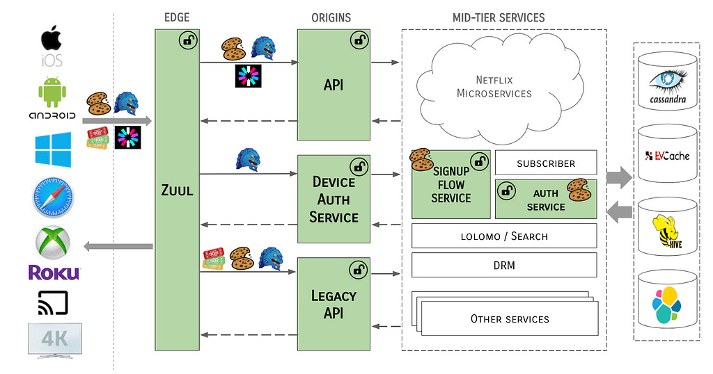](https://substackcdn.com/image/fetch/$s_!QGDf!,f_auto,q_auto:good,fl_progressive:steep/https%3A%2F%2Fsubstack-post-media.s3.amazonaws.com%2Fpublic%2Fimages%2F6110df0d-36a3-402b-a2df-6ff8f5a63d55_1024x538.png)Netflix Architecture (Source: [Netflix](https://netflixtechblog.com/edge-authentication-and-token-agnostic-identity-propagation-514e47e0b602) [9])

It's also worth noting that [Netflix open-sourced](https://netflix.github.io/) many of these components, influencing the broader industry's approach to microservices [4].

> *Read more about the evolution of the Netflix API Architecture:*
[
Tech World With Milan NewsletterEvolution of the Netflix API ArchitectureThis week’s issue brings to you the following…Read more2 years ago · 14 likes · Dr Milan Milanović](https://newsletter.techworld-with-milan.com/p/evolution-of-the-netflix-api-architecture?utm_source=substack&utm_campaign=post_embed&utm_medium=web)
## 4. Data Architecture: Polyglot Persistence

The personalized Netflix experience you see before pressing play results from a sophisticated data architecture. Rather than forcing all data into a single database model, Netflix employs a polyglot persistence approach.

Different types of data are stored in specialized systems optimized for specific access patterns:

- **[Cassandra](https://cassandra.apache.org/)**: Stores user profile information and preferences in this highly available NoSQL database
- **[EVCache](https://netflix.github.io/EVCache/)**: Caches frequently requested data in this enhanced version of Memcached for faster access
- **[MySQL/RDS](https://aws.amazon.com/rds/mysql/)**: Houses critical transactional data that requires strong consistency
- **[Amazon S3](https://aws.amazon.com/s3/)**: Stores the vast collection of video content and analytical data

This architectural approach assumes that **no single database is optimal for all workloads**. Netflix achieves performance and scalability by selecting specialized data stores for different access patterns. Although this pattern has become common in modern architecture, Netflix was an early adopter on a massive scale.

This diverse data ecosystem powers your personalization. When you log in, the recommendation system analyzes [17] your viewing history and preferences, combining them with data from similar viewers to create your (super) personalized experience, which goes to the specific images only you will see for a movie, where there is the actor you like.

This capability is fundamental to Netflix's business model: **helping you discover content you'll enjoy among its vast catalog.**

The image below shows the Netflix Data landscape.

[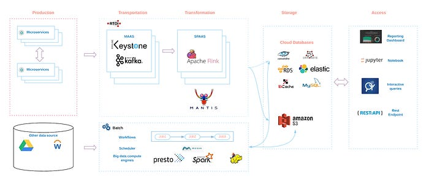](https://substackcdn.com/image/fetch/$s_!GxI2!,f_auto,q_auto:good,fl_progressive:steep/https%3A%2F%2Fsubstack-post-media.s3.amazonaws.com%2Fpublic%2Fimages%2F72f080e2-6b3e-4b03-918a-495e540517cb_700x293.png)Netflix Data Landscape (Source: [Netflix Technology Blog](https://netflixtechblog.com/building-and-scaling-data-lineage-at-netflix-to-improve-data-infrastructure-reliability-and-1a52526a7977) [10])

## 5. Pressing Play: The moment of truth

The crucial moment comes: You find something to watch and press play. This action triggers one of the system's most fascinating architectural transitions. This handoff between the control and data planes is a critical system design interface.

When you press play, several technical operations occur in quick succession:

1. **The client app determines device capabilities and network conditions**
2. **It requests stream authorization from the control plane**
3. **The control plane selects the optimal Open Connect server based on:**

- 🌍 Geographic proximity
- 📊 Server health metrics
- 🎞️ Content availability
- 📈 Current load
4. **The control plane provides signed URLs for content access**
5. **The client establishes a connection to the selected Open Connect server**
6. **Video begins streaming using adaptive bitrate protocols**

This architecture employs several key patterns: content-based routing, load-aware selection, and secure token authentication. The handoff must be seamless and reliable, as any delay or failure directly impacts the user experience.

This represents an elegant system boundary where different architectural styles meet. The request-response pattern of the control plane transitions to the streaming data pattern of the data plane, each optimized for its purpose.

Overall Netflix system architecture is shown below:

[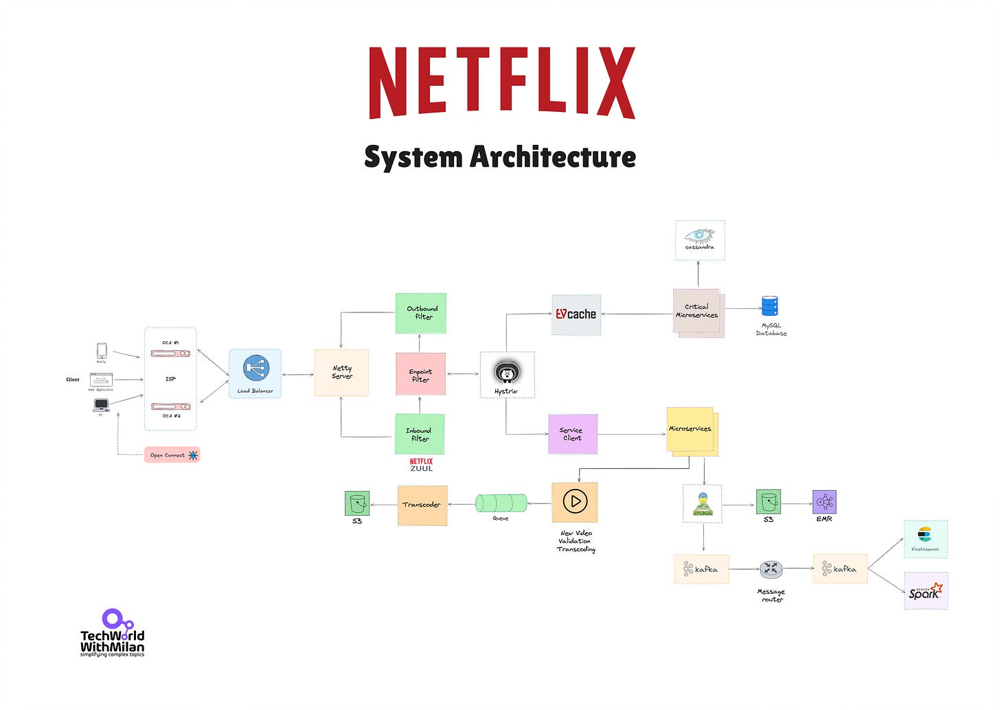](https://substackcdn.com/image/fetch/$s_!9Yx-!,f_auto,q_auto:good,fl_progressive:steep/https%3A%2F%2Fsubstack-post-media.s3.amazonaws.com%2Fpublic%2Fimages%2F854117ff-6bf2-4da1-9928-ab311e1b68d3_13880x9860.png)Netflix System Architecture

## 6. Open Connect: Netflix's Custom CDN Architecture

[Open Connect](https://openconnect.netflix.com/en/) represents one of Netflix's most significant architectural innovations. Rather than relying on general-purpose [CDNs](https://newsletter.techworld-with-milan.com/p/what-is-cdn), Netflix designed a purpose-built content delivery network explicitly optimized for video streaming.

The physical deployment follows a two-tiered architecture:

1. **Storage OCAs**: Deployed at Internet Exchange Points, containing nearly the complete Netflix catalog
2. **Edge OCAs**: Deployed within ISP networks, caching the most popular content for that region

[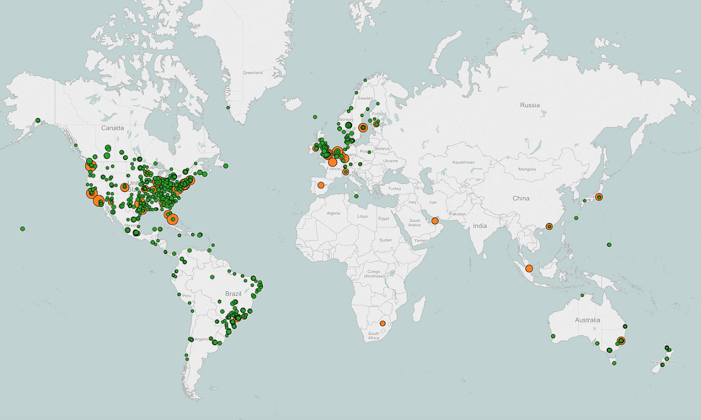](https://substackcdn.com/image/fetch/$s_!pwVX!,f_auto,q_auto:good,fl_progressive:steep/https%3A%2F%2Fsubstack-post-media.s3.amazonaws.com%2Fpublic%2Fimages%2Fb327ca2f-8b96-4a7e-a609-48ba9c1a3acf_1600x959.png)Netflix CDN locations in 2016. ([Source](https://about.netflix.com/en/news/how-netflix-works-with-isps-around-the-globe-to-deliver-a-great-viewing-experience))

This approach dramatically reduces the distance data must travel, minimizing latency and congestion. Netflix provides these servers to ISPs at no cost, creating a mutually beneficial arrangement that improves quality while reducing transit costs for both parties. You may wonder why ISPs do this for Netflix, but if you understand that this enables content to be delivered to users without going over the Internet, you will know that this is a cost-optimized solution for them.

[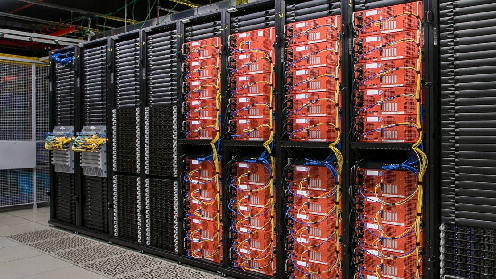](https://substackcdn.com/image/fetch/$s_!bK-w!,f_auto,q_auto:good,fl_progressive:steep/https%3A%2F%2Fsubstack-post-media.s3.amazonaws.com%2Fpublic%2Fimages%2F85318ca0-7ff0-4e84-91d8-60acf2cec9a0_1112x626.jpeg)Open Connect Appliances - OCAs (Source: Netflix)

When we look at the implementation, **Open Connect's** simplicity is remarkable. The appliances operate independently, don't require complex coordination, and primarily serve content over standard HTTP protocols. This design choice prioritizes reliability and throughput over sophisticated features, perfectly matching video delivery requirements.

Open Connect workflow is shown in the image below:

[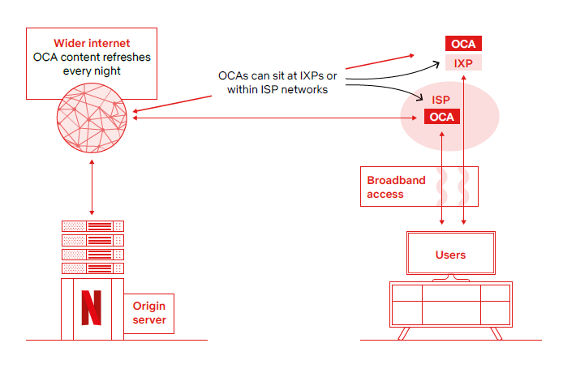](https://substackcdn.com/image/fetch/$s_!_pmq!,f_auto,q_auto:good,fl_progressive:steep/https%3A%2F%2Fsubstack-post-media.s3.amazonaws.com%2Fpublic%2Fimages%2F8a53d725-4b21-45c4-8e57-cdceee2421eb_694x460.png)Netflix Open Connect CDN workflow

The **caching strategy** combines predictive pre-positioning with demand-driven caching (*proactive caching*). During off-peak hours, Netflix pushes new and popular content to the OCAs based on predicted regional popularity. The OCAs are stored at ISPs, so you don’t need to go over the Internet when viewing a video. This approach ensures high cache hit rates when users request content, reducing origin load and improving delivery performance [5].

> *Learn more about CDNs:*
[
Tech World With Milan NewsletterWhat is CDN?Have you ever wondered how fast Netflix is when streaming a movie to your house? There is one component that is very important here, and it is called CDN (Content Delivery Network). It is a network of servers that move data fast through the network using cache servers and edge servers in…Read morea year ago · 60 likes · 2 comments · Dr Milan Milanović](https://newsletter.techworld-with-milan.com/p/what-is-cdn?utm_source=substack&utm_campaign=post_embed&utm_medium=web)
## 7. Content Encoding and Adaptive Streaming: Technical decisions

Before content reaches Open Connect, it undergoes an elaborate preparation process that showcases several interesting technical decisions relevant to media processing architectures. Netflix employs a **sophisticated encoding pipeline** that processes each title into multiple formats and quality levels.

Rather than using fixed encoding parameters, Netflix implements per-title encoding optimization:

1. **Content is analyzed to determine visual complexity**
2. **Encoding parameters are customized based on content characteristics**
3. **Different bitrate ladders are created for different types of content**

This approach **reduces bandwidth requirements by 20-40% compared to fixed bitrate** encoding while maintaining visual quality. This demonstrates how content-aware processing can significantly improve efficiency.

After encoding, content is packaged for **adaptive bitrate streaming**. With proprietary extensions, Netflix primarily uses DASH ([Dynamic Adaptive Streaming over HTTP](https://en.wikipedia.org/wiki/Dynamic_Adaptive_Streaming_over_HTTP)). The content is segmented into small chunks (typically 2-10 seconds), each available in multiple quality levels. This results in a series of files to support any video format on any device that is playing it (and today, there are many devices), as well as audio and other available options. All different formats for a video are called **encoding profiles**. So, each movie consists of a bunch of files.

When you watch Netflix, the client continuously monitors available bandwidth and buffer status, switching quality levels to maintain smooth playback. **This client-side intelligence is a key architectural decision** [6] that improves resilience by placing adaptation logic close to where network conditions are experienced.

The image below shows the Netflix Video Processing Pipeline:

[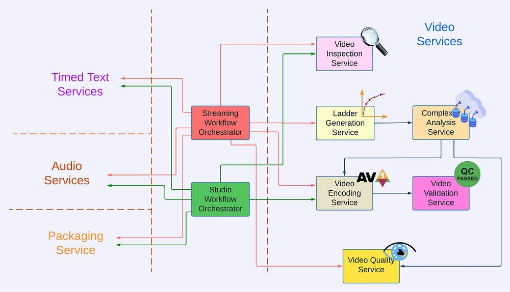](https://substackcdn.com/image/fetch/$s_!w9fA!,f_auto,q_auto:good,fl_progressive:steep/https%3A%2F%2Fsubstack-post-media.s3.amazonaws.com%2Fpublic%2Fimages%2F73f52c35-450a-479f-98dc-e18d2eb393d9_1000x574.png)Netflix Video Processing Pipeline (Source: [Netflix](https://netflixtechblog.com/rebuilding-netflix-video-processing-pipeline-with-microservices-4e5e6310e359) [11])

## 8. Resilience engineering: Designing for failure

One of Netflix's most valuable architectural lessons is its **resilience approach**. Rather than attempting to prevent all failures (an impossible task in distributed systems), Netflix designs systems that expect and gracefully handle component failures.

Netflix's resilience patterns are particularly instructive:

- **🚫 Circuit Breakers**: Services detect when dependencies are failing and stop attempting to use them
- **🧩 Fallbacks**: Degraded but functional responses are provided when primary data sources are unavailable
- **🛡️ Bulkheads**: Resources are isolated to prevent failures in one area from affecting others
- **⏱️ Timeouts**: Aggressive timeout policies prevent resource exhaustion from slow services

Netflix famously pioneered chaos engineering with its Simian Army [14]—tools that proactively inject failures into production systems. **[Chaos Monkey](https://github.com/Netflix/chaosmonkey)** randomly terminates instances, while **Chaos Gorilla** simulates entire availability zone failures (isn’t this genius?).

**Chaos Monkey** relies on [MySQL](https://www.mysql.com/) and [Spinnaker](https://spinnaker.io/). MySQL tracks terminations and schedules them to ensure random failures. At the same time, Spinnaker plays an essential role in deploying and terminating services across cloud platforms (read AWS). Chaos Monkey runs a daily scheduled task (cron job) that scans for services enabled for Chaos Monkey and can handle random failures. When identified, it randomly selects a service and schedules for termination. Then, Spinnaker carries out the termination.

This approach forces engineers to **design for resilience** from the beginning rather than treating it as an afterthought.

[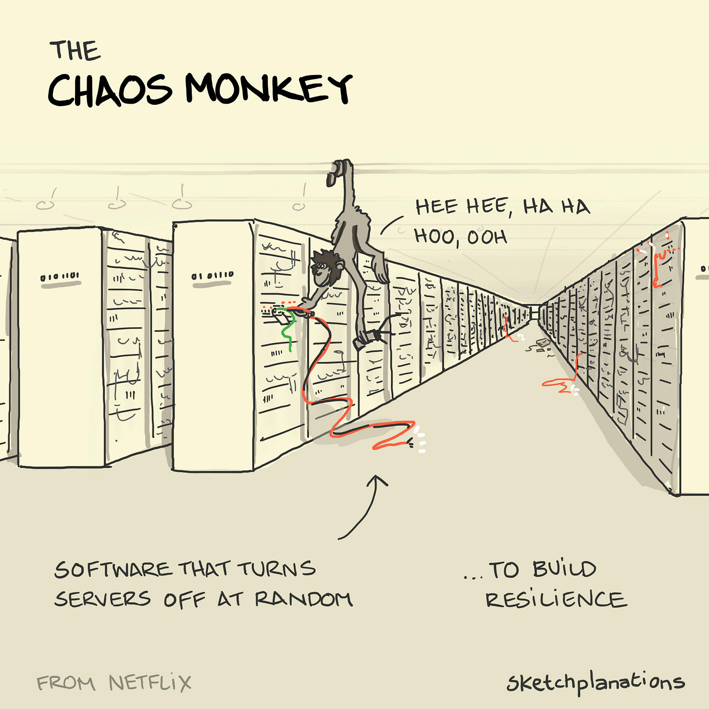](https://substackcdn.com/image/fetch/$s_!SYJG!,f_auto,q_auto:good,fl_progressive:steep/https%3A%2F%2Fsubstack-post-media.s3.amazonaws.com%2Fpublic%2Fimages%2F2c52fbf2-8d0c-4538-86a7-e1406ab34f3e_3425x3425.jpeg)The Chaos Monkey (Credits: Sketchplanations)

These resilience patterns actively ensure uninterrupted playback when streaming content. The system can route to alternatives if the optimal Open Connect server becomes unavailable. If network conditions degrade, adaptive bitrate streaming adjusts quality to maintain playback. Even partial outages in the control plane won't interrupt active streams.

Netflix runs **active-active across regions**. If one AWS region experiences an outage, traffic is routed to others without significant interruption. This was tested in actual events (e.g. when chaos tools simulate region failures).

This demonstrates **how resilience must be designed into systems from the ground up**, especially those operating globally with millions of concurrent users [7].

> Netflix’s mantra is *“Design for failure”.*

## 9. Continuous Improvement: The Data Feedback Loop

Every time you press play, Netflix **captures data that fuels a sophisticated analytics pipeline**. This represents a classic feedback loop architecture that enables continuous improvement.

This analytics infrastructure includes:

- **📊 Telemetry collection**: Client-side instrumentation captures detailed performance metrics
- **⚡ Real-time processing**: Stream processing for immediate detection of issues
- **📚 Batch analytics**: Deep analysis of viewing patterns and system performance
- **🧪 Experimentation platform**: A/B testing framework to evaluate changes [15]

The Netflix client on your device reports various information, such as how long it took for your video to start, any quality changes during playback, whether and when you experienced buffering, and even how you navigated the interface before pressing play.

This telemetry data flows through distributed messaging systems (like [Kafka](https://kafka.apache.org/)) that handle millions of events per second and into real-time and batch processing frameworks (such as [Flink](https://flink.apache.org/) and [Spark](https://spark.apache.org/)) for analysis.

This sophisticated data pipeline enables Netflix to:

- Detect and respond to quality issues as they happen
- Identify patterns that might indicate emerging problems
- Continuously refine their recommendation algorithms
- Make data-driven decisions about content acquisition and production
- Optimize infrastructure based on actual usage patterns

This data ecosystem enables **evidence-based decision-making** and allows them to refine their systems continuously based on actual user experience.

The image below shows the Netflix Data Pipeline:

[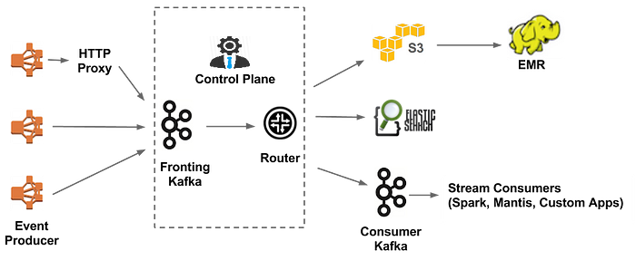](https://substackcdn.com/image/fetch/$s_!PEnq!,f_auto,q_auto:good,fl_progressive:steep/https%3A%2F%2Fsubstack-post-media.s3.amazonaws.com%2Fpublic%2Fimages%2F754ef1d2-b351-4177-a13d-827ac8bdd7e7_700x298.png)Netflix’s data pipeline (Source: [Netflix](https://netflixtechblog.com/evolution-of-the-netflix-data-pipeline-da246ca36905) [13])

The experimentation platform deserves special mention. **Netflix's architecture enables thousands of A/B tests to run simultaneously** [12][15], with fine-grained control over which users see which variants. This capability allows for rapid iteration and validation of technical changes before full deployment.

Also, Netflix often rolls out features behind **feature flags** to subsets of users, measuring the impact on engagement. This data-driven deployment ensures that changes improve the user experience (e.g., interface tweaks or new algorithms) before full launch.

## 10. Deployment Architecture: Continuous Delivery at Scale

A sophisticated deployment architecture is essential for Netflix's ability to evolve its platform while maintaining reliability. This represents the operational side of its technical strategy.

Several patterns are worth highlighting here:

- **📦 Immutable Infrastructure**: Applications are packaged with their dependencies and deployed as Amazon Machine Images
- **🔵🟢 Blue/Green Deployments**: New versions run alongside old versions before traffic is shifted
- **🐦 Canary Analysis**: Automated statistical analysis of new deployments identifies problems
- **↩️ Automated Rollbacks**: Systems automatically revert problematic deployments

This architecture enables Netflix to deploy its services thousands of times daily while maintaining stability. Each change is rigorously tested and can be quickly rolled back if issues arise. The deployment pipeline includes extensive automated testing, including integration testing against production dependencies and replay traffic testing [16].

Netflix orchestrates its rapid deployments with tooling like **[Spinnaker](https://spinnaker.io/)**, which automates testing and gradually rolls out new versions across its cloud environment.

A key architectural pattern is the separation of deployment from release. Features can be deployed to production but not activated until proven stable through targeted exposure. This pattern supports Netflix's culture of continuous experimentation while protecting the core user experience [8].

Here is the Netflix CI/CD Tech Stack:

[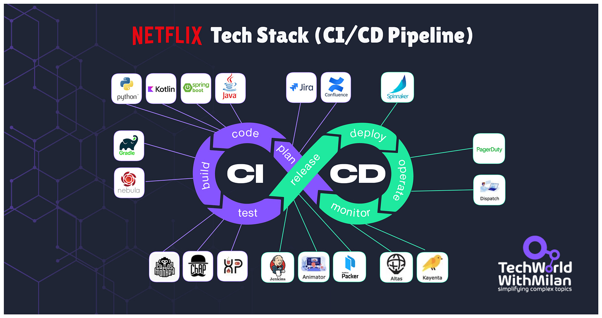](https://substackcdn.com/image/fetch/$s_!tjVa!,f_auto,q_auto:good,fl_progressive:steep/https%3A%2F%2Fsubstack-post-media.s3.amazonaws.com%2Fpublic%2Fimages%2Ff8a3d2f6-accc-4afc-ba31-1db1774e2bdc_3088x1632.png)Netflix Tech Stack (CI/CD Pipeline)

> *Learn more about CI/CD Pipelines:*
[
Tech World With Milan NewsletterWhat is CI/CD Pipeline ?Delivering quality software quickly is more critical than ever in today's software development industry. Continuous Integration and Continuous Delivery (CI/CD) pipelines have become standard tools for development teams to move code from development to production. By enabling frequent code integrations and automated deployments, CI/CD pipelines help team…Read morea year ago · 78 likes · 7 comments · Dr Milan Milanović](https://newsletter.techworld-with-milan.com/p/what-is-cicd-pipeline?utm_source=substack&utm_campaign=post_embed&utm_medium=web)
## 11. But Netflix Architecture can fail too: The Tyson-Paul Fight Outage

While Netflix's architecture has proven remarkably resilient for on-demand streaming, the company faced significant challenges when venturing into high-scale live streaming. The [November 2024 boxing match between Mike Tyson and Jake Paul](https://en.wikipedia.org/wiki/Jake_Paul_vs._Mike_Tyson) provided a dramatic stress test of Netflix's live streaming capabilities, where Netflix had an **[outage](https://www.nytimes.com/2024/11/16/business/media/netflix-outage-crash-boxing.html)** during the live video.

The event attracted approximately **[65 million concurrent viewers](https://about.netflix.com/en/news/60-million-households-tuned-in-live-for-jake-paul-vs-mike-tyson)**, establishing a new world record for live streaming that doubled some previous records. However, this unprecedented scale exposed limitations in Netflix's live-streaming architecture that their on-demand systems don't encounter.

Mike Tyson and Jake Paul box match (Credits: Netflix)

From a technical architecture perspective, the challenges stemmed from fundamental differences between live and on-demand content delivery:

1. **🧊 Different caching requirements**: Netflix's Open Connect infrastructure, optimized for on-demand content, couldn't effectively leverage live content. With live streaming, every viewer simultaneously needs the same content segments, creating massive demand spikes on CDN infrastructure.
2. **⚙️ Real-time processing pipeline**: Live content requires real-time encoding, packaging, and distribution without the luxury of pre-processing that on-demand content enjoys. This created potential bottlenecks in the encoding and manifest generation processes.
3. **📄 Manifest file management**: Live streaming relies on continuously updated manifest files that act as "running documents" pointing to the latest video segments. The speed and reliability of these updates became critical at a massive scale.

The [outage](https://www.nytimes.com/2024/11/16/business/media/netflix-outage-crash-boxing.html) demonstrated a crucial architectural principle: **systems optimized for one workload pattern (on-demand streaming) may require significant modifications to handle different patterns (live streaming)**. Netflix's engineering team likely needed to develop new traffic management, scaling, and failover strategies specific to the unique challenges of live content delivery.

Interestingly, Netflix's rest of the platform continued functioning generally during the outage, clearly showing the benefits of their microservices architecture and domain separation. The isolation between live and on-demand streaming services prevented a cascading failure that could have affected the entire platform.

This incident **[provides valuable insights](https://x.com/championswimmer/status/1857794083093164195)** into designing for different content delivery patterns and the importance of extensive load testing before high-profile events. It also demonstrates that even sophisticated technology organizations face challenges when entering new technical domains that require different architectural approaches.

## 12. Key architectural lessons for software engineers

Netflix's architecture offers several valuable lessons that apply broadly to distributed systems:

[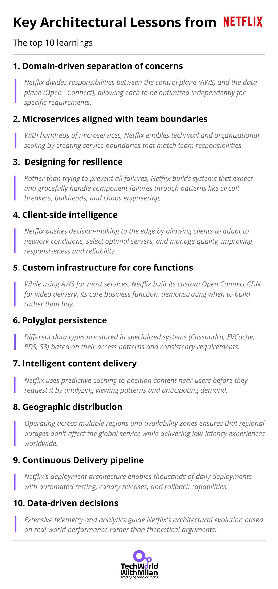](https://substackcdn.com/image/fetch/$s_!BZYD!,f_auto,q_auto:good,fl_progressive:steep/https%3A%2F%2Fsubstack-post-media.s3.amazonaws.com%2Fpublic%2Fimages%2Fbefeb913-ae5e-41f7-bf19-4307dac8a56c_1862x3938.png)

As noted in the book "[Explain the Cloud Like I'm 10](https://amzn.to/43FL81m)" [1], Netflix's complete vertical integration—controlling the client, backend, and CDN—enables it to optimize the viewing experience.

These architectural principles demonstrate how thoughtful system design, aligned with business goals and user needs, can enable exceptional reliability, scalability, and performance at a massive scale.

## Bonus: Netflix Tech Stack

Let’s break down the tools and frameworks powering this streaming giant.

### **🖥️ Frontend Architecture**

- **Core Technologies**: React, Node.js, Redux, and JavaScript drive dynamic user interfaces across web platforms.
- **Mobile Development**: Swift (iOS) and Kotlin (Android) ensure native app performance and smooth UX.
- **Frontend/Backend Sync**: GraphQL streamlines data fetching, reducing over-fetching and latency.

### **🛠️ Backend Infrastructure**

- **Languages & Frameworks**: Java and Spring Boot dominate backend services, while Python supports scripting and ML workflows.
- **Event Streaming**: Apache Kafka handles 1.4 trillion messages daily, enabling real-time data pipelines.

### **🗄️ Data Ecosystem**

- **Databases**: AWS RDS (MySQL) manages structured data, Cassandra scales for distributed storage, and CockroachDB ensures transactional consistency.
- **Caching**: EVCache accelerates data retrieval, which is critical for high-traffic scenarios.
- **Video Storage**: Amazon S3 stores raw content, while Open Connect CDN caches videos at edge locations globally.

### **📊 Data Processing & Analytics**

- **Stream/Batch Processing**: Apache Flink (real-time) and Spark (batch) analyze petabytes of viewing data.
- **Orchestration**: AWS Glue and Netflix Genie automate ETL pipelines and job scheduling.
- **Visualization**: Tableau transforms data into actionable insights for content recommendations and operational decisions.

### **🔐 Security & DevOps**

- **Security**: User data is safeguarded by AWS Shield (DDoS protection), IAM (access control), and KMS (encryption).
- **CI/CD**: Jenkins and Spinnaker automate deployments, while Chaos Monkey tests fault tolerance.
- **Monitoring**: Prometheus, Grafana, and CloudWatch provide real-time system health metrics.

### **🧠 Machine Learning**

- **Tools**: Amazon SageMaker and TensorFlow train models for personalized recommendations, fraud detection, and video encoding optimization.

[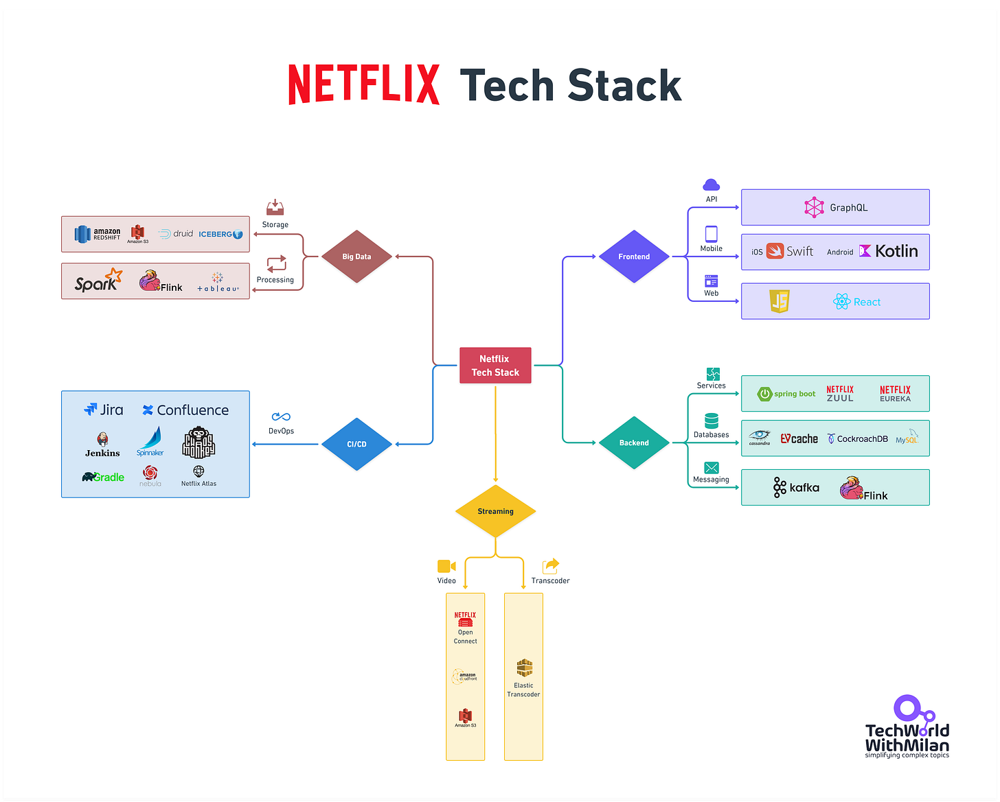](https://substackcdn.com/image/fetch/$s_!cYsr!,f_auto,q_auto:good,fl_progressive:steep/https%3A%2F%2Fsubstack-post-media.s3.amazonaws.com%2Fpublic%2Fimages%2F5afbd121-e24f-4b9d-b2df-20e7d2cfa30e_5364x4308.png)Netflix Tech Stack

## Conclusion

The next time you press play on Netflix and your video starts instantly, take a moment to appreciate the great distributed systems architecture working behind the scenes.

This architecture didn't emerge fully formed—it evolved through constant refinement as Netflix grew from a DVD rental service to a global streaming platform. They began with traditional data centers running monolithic applications and transformed into a cloud-native, microservices-based platform with a worldwide content delivery network. Along the way, they pioneered approaches to distributed systems that have influenced the entire industry.

Netflix serves as a case study of how thoughtful system design can solve complex technical challenges at a massive scale. Their willingness to build custom solutions for critical components rather than accepting the limitations of off-the-shelf products demonstrates how architecture can be a competitive advantage.

The result is a technical marvel that delivers consistent, high-quality video to millions of concurrent viewers across more than 200 countries. When you press play on Netflix, you benefit from one of the most sophisticated content delivery architectures ever built. These architectures work together to ensure you can enjoy your show without considering the technology making it possible.

## References

1. Kehn, D. (2016). "[Explain the Cloud Like I'm 10](https://amzn.to/43FL81m)." Chapter: "[Netflix: What Happens When You Press Play](https://highscalability.com/netflix-what-happens-when-you-press-play/)."
2. Izrailevsky, Y., Tseitlin, A., & Karp, C. (2016). "[Netflix: Completing the Cloud Migration](https://about.netflix.com/en/news/completing-the-netflix-cloud-migration)." Netflix Technology Blog.
3. Mauro, T. (2015). "[Adopting Microservices at Netflix: Lessons for Architectural Design.](https://www.f5.com/company/blog/nginx/microservices-at-netflix-architectural-best-practices)" Netflix Technology Blog.
4. Meshenberg, R., Gopalani, N., & Kosewski, L. (2016). "[The Netflix Tech Blog: Embracing the Differences: Inside the Netflix API Redesign.](https://netflixtechblog.com/embracing-the-differences-inside-the-netflix-api-redesign-15fd8b3dc49d)" F5 Blog.
5. Vass, D. (2017). "[How Netflix Works With ISPs Around the Globe to Deliver a Great Viewing Experience](https://about.netflix.com/en/news/how-netflix-works-with-isps-around-the-globe-to-deliver-a-great-viewing-experience)." Netflix Technology Blog.
6. Aaron, A., Li, Z., Manoharan, M., Cocchi, I. V., & Ronca, A. (2015). "[Per-Title Encode Optimization](https://netflixtechblog.com/per-title-encode-optimization-7e99442b62a2)." Netflix Technology Blog.
7. Basiri, A., Behnam, N., de Rooij, R., Hochstein, L., Kosewski, L., Reynolds, J., & Rosenthal, C. (2016). "[Chaos Engineering](https://netflixtechblog.com/tagged/chaos-engineering)." Netflix Technology Blog.
8. Schmaus, B., Looney, C., Reinheimer, A., Marum, J., Rao, M., & Sonfack, J. (2018). "[Titus, the Netflix container management platform, is now open source](https://netflixtechblog.com/titus-the-netflix-container-management-platform-is-now-open-source-f868c9fb5436)," Netflix Technology Blog.
9. Casella, A., Nelson, T., Singh, S. (2021) “[Edge Authentication and Token-Agnostic Identity Propagation](https://netflixtechblog.com/edge-authentication-and-token-agnostic-identity-propagation-514e47e0b602), “Netflix Technology Blog.
10. Lin, D., Lingappa, G., Aswani, J. (2019) “[Building and Scaling Data Lineage at Netflix to Improve Data Infrastructure Reliability, and Efficiency](https://netflixtechblog.com/building-and-scaling-data-lineage-at-netflix-to-improve-data-infrastructure-reliability-and-1a52526a7977)“,  Netflix Technology Blog.
11. Guo, L., Moorthy, A., Chen, L., Carvalho, V., Mavlankar, A., Opalach, A., Swanson, K.m Tweneboah, J., Vekatray, S., Zhu, L., (2024) “[Rebuilding Netflix Video Processing Pipeline with Microservices](https://netflixtechblog.com/rebuilding-netflix-video-processing-pipeline-with-microservices-4e5e6310e359), “Netflix Technology Blog.
12. Urban, S., Sreenivasan, R., Kannan, V. (2016), “[It’s All A/Bout Testing: The Netflix Experimentation Platform](https://netflixtechblog.com/its-all-a-bout-testing-the-netflix-experimentation-platform-4e1ca458c15),” Netflix Technology Blog.
13. Wu, S., Wang, A., Daxini, M., Alekar, M., Xu, Z., Patel, J., Guraja, N., Bond, J., Zimmer, M., Bakas, P. (2016) “[Evolution of the Netflix Data Pipeline](https://netflixtechblog.com/evolution-of-the-netflix-data-pipeline-da246ca36905),” Netflix Technology Blog.
14. Izrailevsky, Y., Tseitlin, A., (2011) “[The Netflix Simian Army](https://netflixtechblog.com/the-netflix-simian-army-16e57fbab116)“, Netflix Technology Blog.
15. Lindon, M., Sanded, C., Shirikian, V., Liu, Y., Misha, M., Tingley, M., “[Sequential A/B Testing Keeps the World Streaming Netflix Part 2: Counting Processes](https://netflixtechblog.com/sequential-testing-keeps-the-world-streaming-netflix-part-2-counting-processes-da6805341642)“, Netflix Technology Blog.
16. Gala, S., Fernandez-Ivern, J., Pratap, R. A., Shah, D., “[Migrating Critical Traffic At Scale with No Downtime](https://netflixtechblog.com/migrating-critical-traffic-at-scale-with-no-downtime-part-1-ba1c7a1c7835),” Netflix Technology Blog.
17. Sun, L., A. et al. (2025) [“Foundation Model for Personalized Recommendation](https://netflixtechblog.com/foundation-model-for-personalized-recommendation-1a0bd8e02d39), “Netflix Technology Blog.

---

## More ways I can help you

1. **📢 [LinkedIn Content Creator Masterclass](https://www.patreon.com/techworld_with_milan/shop/short-linkedin-content-creator-311232?utm_medium=clipboard_copy&utm_source=copyLink&utm_campaign=productshare_creator&utm_content=join_link).**In this masterclass, I share my strategies for growing your influence on LinkedIn in the Tech space. You'll learn how to define your target audience, master the LinkedIn algorithm, create impactful content using my writing system, and create a content strategy that drives impressive results.
2. **📄 [Resume Reality Check](https://www.patreon.com/techworld_with_milan/shop/resume-reality-check-311008?source=storefront)**. I can now offer you a service where I’ll review your CV and LinkedIn profile, providing instant, honest feedback from a CTO’s perspective. You’ll discover what stands out, what needs improvement, and how recruiters and engineering managers view your resume at first glance.
3. **💡 [Join my Patreon community](https://www.patreon.com/techworld_with_milan)**: Be first to know what I do! This is your way of supporting me, saying “**thanks**," and getting more benefits. You will get exclusive benefits, including 📚 all of my books and templates on Design Patterns, Setting priorities, and more, worth $100, early access to my content, insider news, helpful resources and tools, priority support, and the possibility to influence my work.
4. 🚀 **1:1 Coaching:** [Book a working session with me](https://newsletter.techworld-with-milan.com/p/coaching-services). I offer 1:1 coaching for personal, organizational, and team growth topics. I help you become a high-performing leader and engineer.

---

Thanks for reading Tech World With Milan Newsletter! Subscribe for free to receive new posts and support my work