# How Google, Amazon, and CrowdStrike broke millions of systems

*What we can learn from the three biggest incidents in the software industry, this year.*

Three companies control most of the internet. When they break, millions of systems fail at once.

In October 2025, a race condition in AWS’s DNS automation caused a regional endpoint to be emptied. 113 services crashed. Recovery took 15 hours. Two months earlier, a null pointer in Google Cloud caused Service Control, the gatekeeper for every API request, to crash. 50+ services went dark for seven hours.

And in July 2024, CrowdStrike deployed a bad configuration file to kernel-mode drivers worldwide. 8.5 million Windows machines are locked in boot loops. Airlines grounded flights, and hospitals canceled surgeries.

These weren’t sophisticated attacks or infrastructure failures. They were simple bugs: a race condition, a missing null check, a bad config file. But at this scale, simple bugs become catastrophic.

This post breaks down what actually happened in each incident.

In particular, we will talk about:

**1. DNS race condition caused the large AWS outage.**How a time-of-check-to-time-of-use bug emptied DynamoDB’s endpoint and took down 113 services for 15 hours

**2. How a null pointer at Google Cloud crashed the Internet.**Why a missing null check in Service Control brought down 50+ services across 40+ regions for seven hours

**3. A single deployment that made the whole world stop.**How CrowdStrike’s kernel driver update locked 8.5 million Windows machines in boot loops

**4. Bonus: When Azure’s safety checks failed.** How a config change bypassed validation and took down Azure Front Door, and dozens of Microsoft services, for 8 hours.

So, let’s dive in.

---

**[Sponsor this newsletter](https://newsletter.techworld-with-milan.com/p/sponsorship-of-tech-world-with-milan)**

## 1. DNS race condition caused the large AWS outage

At 2:50 AM Eastern [on October 20, 2025](https://aws.amazon.com/message/101925/), a DNS race condition in DynamoDB’s automation caused the us-east-1 regional endpoint (in the northern Virginia cluster) to be emptied. Within minutes, 113 AWS services began to fail. Ring cameras lost recordings, banking apps crashed, and Snapchat, Fortnite, and Slack went dark.

The outage began at 11:48 PM PDT (2:48 AM EDT) on October 20. **DynamoDB DNS was restored at 2:25 AM PDT, roughly 3 hours after the outage. But cascading failures kept services down for 12 more hours.**

For engineers building resilient systems, this incident reveals uncomfortable truths about race conditions, dependency chains, and the hidden fragility of cloud-native architectures.

> [The full AWS report can be read here.](https://aws.amazon.com/message/101925/)

Different services at the [Downdetector](https://downdetector.com/) on the day of the outage

### The root cause: a race condition

[AWS’s DynamoDB](https://aws.amazon.com/dynamodb/) uses an automated DNS management system split into two components. **The DNS Planner** monitors load balancer health and generates DNS configuration plans. Three **DNS Enactor** instances (one per availability zone) independently apply these plans to [Route 53](https://aws.amazon.com/route53/). The design assumed **race conditions were acceptable due to eventual consistency**.

On October 20, this assumption proved to be wrong. DNS Enactor #1 experienced unusual delays applying an old plan. Meanwhile, the DNS Planner continued generating new plans. DNS Enactor #2 raced through these newer plans and executed a cleanup process, deleting “stale” plans just as Enactor #1 completed its delayed run.

The staleness check, performed hours earlier at the start of processing, was now meaningless. Enactor #1 overwrote Route 53 with outdated data. Enactor #2 detected the “old” plan and triggered deletion, emptying all IP addresses from dynamodb.us-east-1.amazonaws.com. The regional DynamoDB endpoint vanished from DNS entirely.

This is a classic **[time-of-check-to-time-of-use (TOCTOU) vulnerability](https://en.wikipedia.org/wiki/Time-of-check_to_time-of-use)**. The staleness check occurred when processing started, but the actual write happened hours later. In distributed systems with high latency, checking the state at the beginning but applying changes at the end creates a massive window for inconsistency.

AWS recognized the severity immediately. They disabled the DNS Planner and Enactor automation globally, not just in us-east-1, pending fixes. This revealed an uncomfortable truth: **the race condition existed in all regions but had only been triggered in one.**

> This is not the first time that [incident happens in this region](https://aws.amazon.com/message/680587/). There were outages in 2021, 2020, and even in 2012 too.

[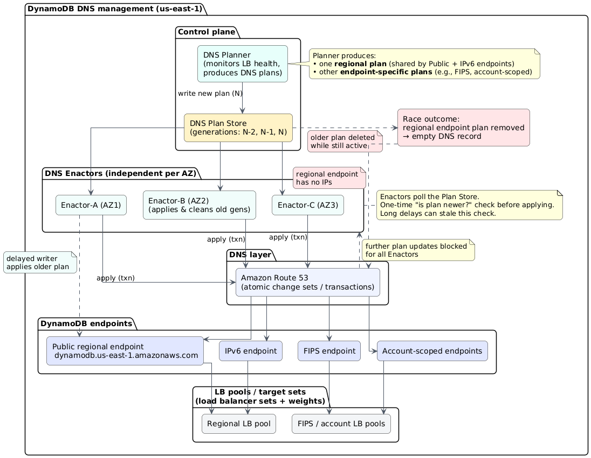](https://substackcdn.com/image/fetch/$s_!OmlY!,f_auto,q_auto:good,fl_progressive:steep/https%3A%2F%2Fsubstack-post-media.s3.amazonaws.com%2Fpublic%2Fimages%2F59cac393-d0e2-4fbb-85e4-17a4a9a583d1_1096x851.png)DynamoDB DNS management and the race removing the regional endpoint in us-east-1

### The cascading problem

DynamoDB recovered at 2:25 AM PDT, just under 3 hours after the incident began. But this is where the story gets worse.

**The DropletWorkflow Manager (DWFM)**, which manages leases for physical hosts (droplets) and orchestrates state changes across the EC2 fleet, lost connectivity to DynamoDB. When DNS failures prevented health checks, leases across the entire fleet timed out. EC2 marked servers as unavailable and blocked new instance launches due to “InsufficientCapacity” errors.

After DynamoDB recovered, DWFM attempted to re-establish leases for the entire EC2 fleet at once. At AWS’s scale, processing took longer than the lease timeout periods. Work completed, then immediately timed out, queuing more work in an infinite loop. DWFM entered a **death spiral, unable to make forward progress**. Engineers required 3 additional hours of manual intervention to break the cycle.

This reveals a fundamental pattern: **lease-based systems work perfectly under normal load but collapse under stress when processing time exceeds timeout periods**. Your recovery automation can become the failure mode.

### The dependency multiplier

With EC2 launches impaired, Lambda couldn’t create execution environments. ECS, EKS, and Fargate couldn’t start containers. Network Load Balancers experienced a different problem: health checks flapped on newly launched instances due to network state lag in the Network Manager, which was processing a massive backlog of delayed state changes.

These flapping health checks triggered **automatic DNS failover across availability zone**s. AWS disabled automatic failover at 9:36 AM PDT to stabilize the system, then re-enabled it at 2:09 PM PDT once backlogs cleared.

Amazon Connect failed because it depends on Lambda and NLBs. Redshift queries broke. STS authentication failed. CloudWatch degraded. The dependency chain looked like this: **DynamoDB DNS → DynamoDB APIs → DWFM → EC2 launches → Network Manager → NLB health checks → Lambda, ECS, EKS, Fargate → 100+ dependent services.**

One empty **DNS record brought down 113 services**. The root cause was fixed in roughly 3 hours. Cascading failures took an additional 12 hours to resolve. Full EC2 recovery happened at 1:50 PM PDT, with most services returning to normal by 2:20 PM PDT.

> ### How AWS outage made water beds stuck
> 
> *One of the interesting incidents relating to this outage, was the problem with [The Eight Sleep](https://t.co/lg6mxNDj8W) smart beds. These smart beds use water-based thermal regulation controlled entirely through cloud infrastructure. When AWS failed, beds continued executing their last program, typically preheat routines for morning wake-up, with no ability to accept new commands. No local control existed. Users described sleeping in a sauna as beds locked at 110°F, some stuck in inclined positions unable to flatten.*
> 
> 
> 
> *[CEO Matteo Franceschetti](https://x.com/m_franceschetti)apologized and quickly shipped “Outage Access”, direct local app-to-device communication via Bluetooth when cloud infrastructure is unavailable.*
> 
> [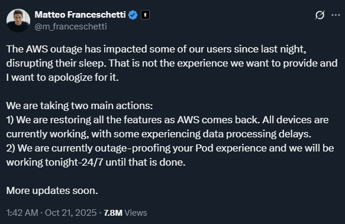](https://x.com/m_franceschetti/status/1980419272766583262)

### Takeaways for building resilient systems

Even though we miss details from the [AWS post-mortem](https://aws.amazon.com/message/101925/), especially why DNS Enactors slowed down and deleted all DNS records, there are a few lessons we can learn from:

- **Audit your staleness checks for [TOCTOU vulnerabilities](https://en.wikipedia.org/wiki/Time-of-check_to_time-of-use).** Any pattern where you check the state at the beginning but apply changes at the end creates race condition windows. Use atomic operations, compare-and-swap at write time, optimistic locking with version numbers, or distributed consensus protocols for critical state changes.
- **Your recovery automation needs circuit breakers.** Monitor recovery process queue depths, implement exponential backoff, add rate limiters that account for queue depth rather than just throughput, and test recovery under production-scale load.
- **Map your dependency chains and identify blast radius multipliers.** Draw the actual dependency graph for your critical services. Where does one foundational service failure cascade? Implement bulkheads between service layers, add timeout and retry budgets at each layer.
- **Test when recovery and failure happen simultaneously.** Most chaos engineering tests individual component failures or clean recovery scenarios. The AWS outage became catastrophic because recovery systems continued to run while failures persisted. Test what happens when automated cleanup runs while delayed operations are still in flight.
- **Rethink what multi-region actually means.** AWS disabled DNS automation globally after a failure in us-east-1, proving the bug existed everywhere. Ensure control planes are truly independent within each region, without hidden dependencies on a primary region. Test complete region isolation, including management operations.

### What can we conclude from this

The uncomfortable truth: even with world-class talent, formal verification methods, extensive chaos engineering, and decades of operational experience, distributed systems remain fundamentally hard. The complexity of hyperscale creates emergent failure modes that are nearly impossible to predict or fully test.

The question isn’t “could this happen to us?” The question is, when it happens to you, will you survive it? The next outage is already brewing somewhere in your stack. Your job is to ensure you’ve designed enough redundancy, eliminated enough tight coupling, and built enough circuit breakers so that when a latent race condition triggers, your systems degrade gracefully.

## 2. **How a Null pointer at Google Cloud crashed the Internet**

On [June 12, 2025, at 10:45 AM PD](https://status.cloud.google.com/incidents/ow5i3PPK96RduMcb1SsW)T, a policy change with blank fields was entered into [Google’s Spanner database](https://cloud.google.com/spanner) and replicated globally within seconds. **Service Control**, the gatekeeper for every Google Cloud API request, processed this corrupted data, encountered a **null pointer exception**, and crashed. Within minutes, Spotify, Discord, Gmail, Drive, Vertex AI, and hundreds of other services went down. Recovery took seven hours.

A missing null check caused 50+ services across 40+ regions to crash.

> [The full Google report can be read here.](https://status.cloud.google.com/incidents/ow5i3PPK96RduMcb1SsW)

### Service Control - Google Cloud’s single point of failure

Every API call to Google Cloud passes through **Service Control**. Provisioning a VM, querying BigQuery, uploading to Cloud Storage, etc. Service Control validates authorization, enforces quotas, checks policies, and logs audits. This centralized architecture creates efficiency but also a critical vulnerability: **when Service Control fails, Google Cloud fails**(single point of failure).

The system runs as a distributed control plane with regional instances sharing policy metadata through global Spanner replication. Policy updates propagate worldwide within seconds. Under normal conditions, this provides consistent authorization decisions with minimal latency. During this outage, it distributed failure at the speed of light.

Service Control’s responsibilities, quota enforcement, policy validation, audit logging, and usage metering make it essential for everything. Google Workspace products depend on it. Third-party apps depend on it. Google’s own services depend on it. Distributed systems engineers call this “fate-sharing” architecture. Hundreds of services are tied to the health of a single component.

[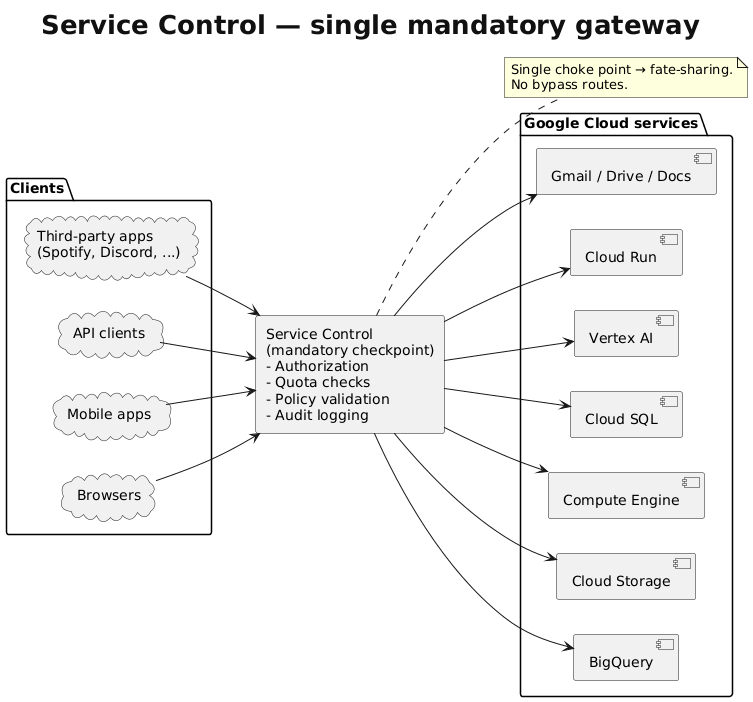](https://substackcdn.com/image/fetch/$s_!Zd0p!,f_auto,q_auto:good,fl_progressive:steep/https%3A%2F%2Fsubstack-post-media.s3.amazonaws.com%2Fpublic%2Fimages%2F47b51211-79b5-4e6a-9502-0ffc52fa1848_753x702.png)Google Service Control

### The hidden bug

On May 29, Google deployed new quota policy checking code to Service Control. The code contained **[a null-pointer vulnerability](https://en.wikipedia.org/wiki/Null_pointer)** in a path that was never exercised during testing. No feature flag protected it, no mechanism to disable the logic without redeploying a new binary.

The bug was simple. The new code failed to validate policy fields before processing them:

[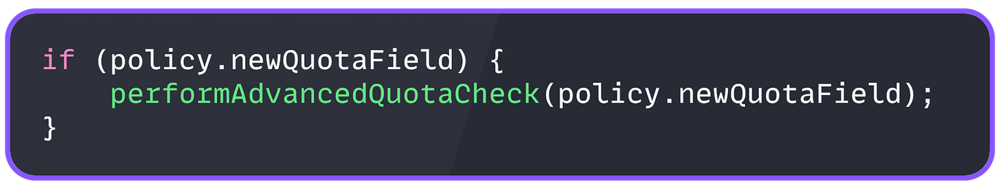](https://substackcdn.com/image/fetch/$s_!nSVK!,f_auto,q_auto:good,fl_progressive:steep/https%3A%2F%2Fsubstack-post-media.s3.amazonaws.com%2Fpublic%2Fimages%2Fc64bddda-9c80-42f0-a094-bfe61cf57543_1773x336.png)

instead of

[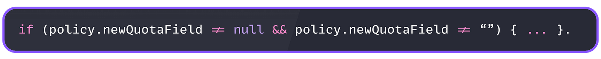](https://substackcdn.com/image/fetch/$s_!MsS7!,f_auto,q_auto:good,fl_progressive:steep/https%3A%2F%2Fsubstack-post-media.s3.amazonaws.com%2Fpublic%2Fimages%2F8981b294-6521-4128-b011-664f32f0bf33_2388x237.png)

Encountering blank values triggered an unhandled exception that crashed the entire Service Control process.

The **bug remained dormant for 14 days** because the policy structure that would have triggered it hadn’t appeared in testing or production. The regional rollout gave false confidence; the code was successfully deployed everywhere because it wasn’t being used.

It is interesting that static analysis missed it, but also code reviews and testing.

### When speed becomes a problem

[Spanner](https://cloud.google.com/spanner) replicates data globally within seconds for strong consistency. This normally ensures authorization decisions remain coherent worldwide. During this outage, it became the mechanism for distributing failure at the speed of light.

The corrupted policy data entered Spanner and reached every region before engineers could intervene. No validation checkpoints existed before global distribution, no schema validation, and no content checks.

The system prioritized consistency and speed over safety, assuming data entering the pipeline would always be valid. This created what ThousandEyes called an “**[unintentional failure vector](https://www.thousandeyes.com/blog/google-cloud-outage-analysis-june-12-2025)**”, a resilience feature that became a pathway for amplifying disruption.

The diagram below shows why instant global replication became a failure amplifier. Note that the same consistency mechanism that makes Google Cloud reliable under normal conditions guaranteed that a single bad data commit would corrupt every region simultaneously.

[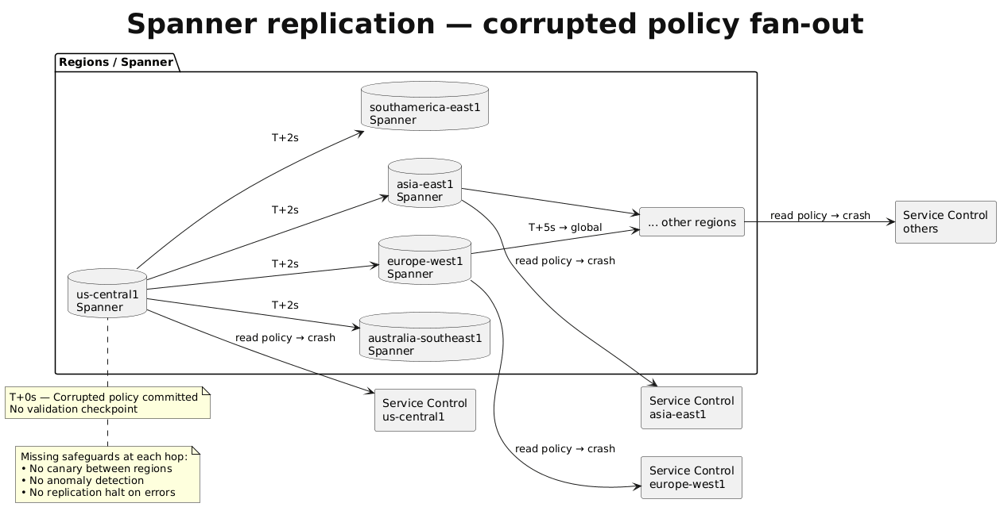](https://substackcdn.com/image/fetch/$s_!CMMI!,f_auto,q_auto:good,fl_progressive:steep/https%3A%2F%2Fsubstack-post-media.s3.amazonaws.com%2Fpublic%2Fimages%2F6abb549b-5118-4f07-a483-fc4d0dd9217a_1258x639.png)Spanner replication

### The error signature

[ThousandEyes monitoring](https://www.thousandeyes.com/blog/google-cloud-outage-analysis-june-12-2025)revealed that different services and regions experienced different error types, and the same request could produce different errors in rapid succession.

HTTP 401 Unauthorized hit Spotify hardest; **authentication succeeded, but authorization failed because corrupted policy data read as “no permissions.”** HTTP 403 Forbidden meant Service Control misinterpreted blank fields as explicit denials. HTTP 500 Internal Server Error indicated mid-authorization crashes. HTTP 503 Service Unavailable was caused by a complete system overload due to crash loops. Timeouts meant instances were completely unresponsive.

The most diagnostic pattern was **error cycling**. Identical requests returned timeouts, then 403s, then 500s, then 401s, with no pattern. This occurred when load balancers distributed requests across Service Control instances that failed independently, each in a different state. The randomness proved this was a distributed authorization problem, not an infrastructure failure.

[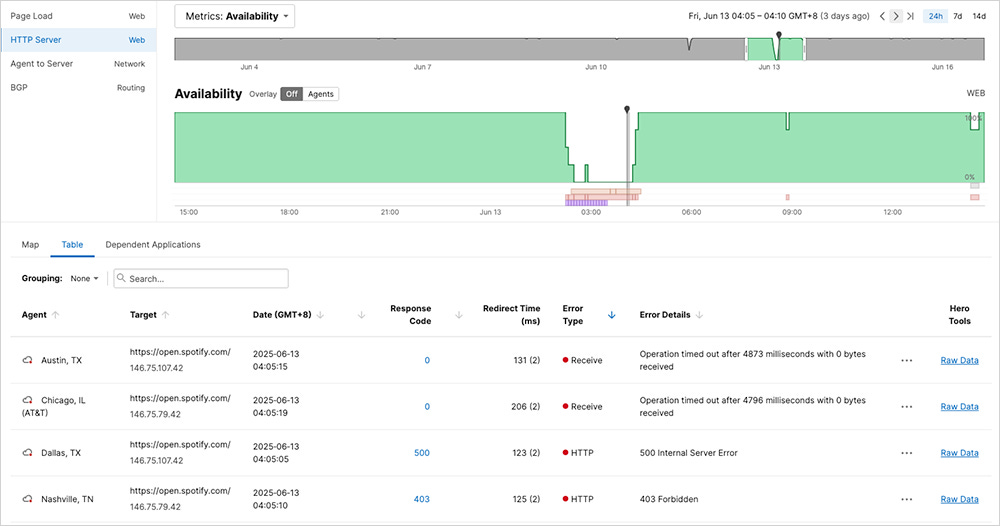](https://substackcdn.com/image/fetch/$s_!VaPE!,f_auto,q_auto:good,fl_progressive:steep/https%3A%2F%2Fsubstack-post-media.s3.amazonaws.com%2Fpublic%2Fimages%2F10aee367-6d2d-4226-80e1-4c35bfe3db8b_1000x526.png)Error response cycling across regions for Spotify during the Google Cloud outage (source: [ThousandEyes](https://www.thousandeyes.com/blog/google-cloud-outage-analysis-june-12-2025))

### The cascading impact

More than 50 Google Cloud services failed across 40+ regions. Google Workspace products went down. Hundreds of third-party applications stopped working.

**Core infrastructure services failed immediately**; IAM couldn’t authorize operations; Cloud Storage denied API access; and Compute Engine’s management plane became unavailable. Running VMs continued because they didn’t need fresh API calls, but nothing new could be created.

Data services saw comprehensive failures. BigQuery couldn’t authorize dataset access. Cloud SQL connections failed. Firestore operations stopped. These failures halted analytics pipelines and prevented applications from reaching their databases.

Vertex AI was completely**halted for over six hours due to complex dependencies.**Developer tools and serverless platforms failed, Cloud Run deployments, Cloud Functions execution, and App Engine access all stopped. These failures hit hundreds of millions of users.

Spotify reported 46,000+ outages, with HTTP 401 errors consistently returned. Discord went down, Shopify degraded, Snapchat couldn’t authenticate, and GitLab CI/CD pipelines stopped. The downstream impact revealed the deep dependency chains in modern cloud architecture.

This was fundamentally an authorization failure, not an authentication failure. Users’ identities verified successfully. Corrupted policy data prevented systems from determining what authenticated users could do.

### What went wrong

Here are some critical failures:

- **No feature flag.** The new quota-checking logic was deployed actively across all regions with no gradual enablement, no canary testing, and no ability to disable it without emergency redeployment. A feature flag could have enabled it for internal projects first, then gradually increased the canary percentages with monitoring.
- **No null check.** The bug was trivial, a missing null check that any programmer could write in seconds. But the consequences were catastrophic because the code assumed data would always be valid.
- **No replication validation.** Spanner’s instantaneous replication had no validation checkpoints. Metadata updates need schema validation, automated smoke tests in canary regions, health checks between propagation stages, and rollback mechanisms. Consistency doesn’t require instant propagation. A staged rollout over minutes, with validation gates, reduces the blast radius.
- **No graceful degradation.** Service Control crashed instead of degrading when it encountered unexpected data. Resilient design would log warnings, fall back to previous known-good policy versions, or implement “fail-open” mode. Circuit breakers could have detected repeated failures and prevented the processing of corrupted data.
- **No randomized backoff.** The us-central1 “herd effect” showed what happens when thousands of instances restart simultaneously. Exponential backoff with jitter is standard: delay = base_delay * 2^attempt + random(0, jitter). This prevents thundering herds and distributes the load during recovery. Its absence turned recovery from minutes into hours.

### The lesson

Distributed systems break globally in seconds but take hours to repair. Breaking is passive; failures cascade automatically. Recovery is active; it requires human intervention, careful coordination, staged rollouts, monitoring at each step, and defensive measures to prevent recovery from causing secondary failures.

The concentration of critical functions in Service Control created a single point of failure despite massive investment in redundancy.**Horizontal scaling means nothing if all instances fail simultaneously from a corrupted global state.** True resilience requires diversity, different systems with different dependencies, different code paths, and different failure modes.

For software engineers, this outage reinforces the basic principles, null checks, error handling, feature flags, and comprehensive testing, which are not optional. The most sophisticated distributed database, the largest cloud infrastructure, and decades of collective engineering experience couldn’t prevent catastrophic failure from a missing null check.

**Reliability is built on layers of defensive practices, each simple in itself but essential when combined.**Skip any one of them, and a minor bug becomes a global disaster.

## 3. A single deployment that made the whole world stop

On July 19, 2024, at 4 AM, our customers started reporting errors. We checked Azure, and SQL databases weren’t responding. The status page showed Central US was down across all three availability zones. Then we realized: this wasn’t just Azure.

8.5 million Windows machines worldwide were stuck in boot loops. [Airlines grounded flights](https://edition.cnn.com/2024/07/18/business/frontier-airlines-microsoft-outage/index.html). Hospitals canceled surgeries, and emergency services went offline.

[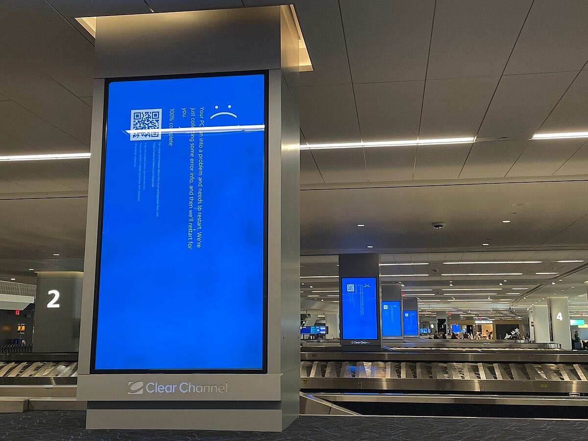](https://substackcdn.com/image/fetch/$s_!XtgF!,f_auto,q_auto:good,fl_progressive:steep/https%3A%2F%2Fsubstack-post-media.s3.amazonaws.com%2Fpublic%2Fimages%2F876ab269-7611-474e-b990-9063b60b0080_1200x900.jpeg)CrowdStrike BSOD at LaGuardia airport, New York (19 July 2024)

### **What actually happened**

[CrowdStrike’s Falcon Sensor](https://www.crowdstrike.com/en-us/products/trials/try-falcon/) runs in kernel mode. That means it operates at the same privilege level as device drivers, below the operating system, with direct hardware access. This positioning lets it detect threats that normal applications can’t see. But kernel code has no safety net. One error crashes the entire system.

Windows requires certification for kernel drivers, but that process takes weeks. CrowdStrike built a workaround: **Channel Files that update threat detection logic without touching the driver itself**. Fast updates, no recertification needed. Channel File 291 was supposed to improve behavioral protection.

Instead,**it tried to read from a NULL memory pointer.**

In C# or Java, this throws an exception that the runtime catches. In C++, running in kernel mode, it triggers an immediate system crash. The machine reboots, loads the driver, hits the same error, and crashes again. Infinite loop.

[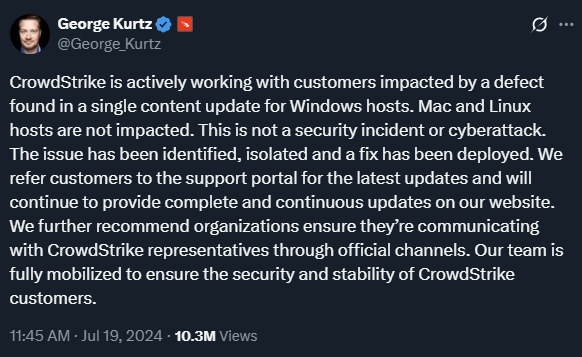](https://substackcdn.com/image/fetch/$s_!eRiE!,f_auto,q_auto:good,fl_progressive:steep/https%3A%2F%2Fsubstack-post-media.s3.amazonaws.com%2Fpublic%2Fimages%2F3864bd18-5b8d-4266-8486-0f87ad81412e_582x357.png)CrowdStrike CEO [statement on X](https://x.com/george_kurtz/status/1814235001745027317?s=61&t=ZwQ3qcmNUcYGEhKedfSy2g)

> [The full CrowdStrike report can be read here.](https://www.crowdstrike.com/en-us/blog/falcon-update-for-windows-hosts-technical-details/)

### **The Timeline**

1. 04:09 UTC: CrowdStrike deploys the update globally. Within minutes, machines start crashing. Because Falcon is a boot-start driver, it loads before Windows; affected machines can’t boot into the OS to receive a fix.
2. 05:27 UTC: CrowdStrike identifies the problem. 78 minutes after deployment.
3. 06:27 UTC: They roll back the update.

But the damage is done. IT teams have to manually fix each machine: boot into Safe Mode, navigate to `C:\Windows\System32\drivers\CrowdStrike`, delete the file matching `C-00000291*.sys`, reboot. For organizations with thousands of machines, this takes days.

[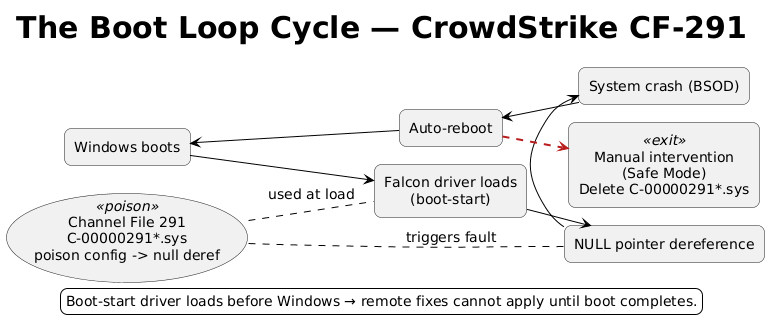](https://substackcdn.com/image/fetch/$s_!O2rt!,f_auto,q_auto:good,fl_progressive:steep/https%3A%2F%2Fsubstack-post-media.s3.amazonaws.com%2Fpublic%2Fimages%2Fe3a73611-aa41-4a9e-b2f0-e9515dc40467_769x333.png)The Boot Loop Cycle

### **The bigger problems**

This exposed three systemic issues.

1. First, **the kernel-mode trap**. Security software needs deep system access to catch sophisticated threats. But that access creates fragility. Microsoft pushes vendors toward user-space solutions, but effective endpoint protection still requires kernel privileges. The industry hasn’t solved this tension.
2. Second, **the certification bypass**. Windows driver certification exists to prevent exactly this kind of failure. But it’s too slow for security software that needs daily updates. CrowdStrike’s Channel Files were a pragmatic workaround that backfired.
3. Third, **the deployment model**. CrowdStrike pushed this update to millions of machines simultaneously, without a gradual rollout. In cloud infrastructure, this would be unthinkable. But endpoint security treats every machine as critical; you can’t leave some exposed while testing. This creates pressure to deploy fast and broadly.

### **What can we learn from this**

- **Test configuration like code.** CrowdStrike’s error wasn’t in their driver; it was in a configuration file. Many teams skip rigorous testing for config because it seems less risky. Wrong. Treat config as code. Run it through the same validation, testing, and review. Write automated tests that catch type mismatches and NULL references.
- **Use staged rollouts everywhere.** Deploy to 1% of machines first. Monitor for crashes. CrowdStrike could have caught this in minutes with a proper canary. The delay would have been hours. The alternative was a global outage.
- **Build an automatic rollback.** When deployment causes crashes, the system should detect the pattern and revert without human intervention. CrowdStrike identified the problem in 78 minutes, but manual intervention was still required on millions of machines.
- **Avoid unmanaged languages when you can**. C and C++ give you control but require perfect discipline. A single NULL check would have prevented this incident. Managed languages like Rust, C#, or Java make entire classes of errors impossible. If you must use C++, run static analyzers that catch NULL dereferences. Use address sanitizers in testing. Require multiple reviews for any pointer operations.
- **Design for recovery.** If your software can brick a system so thoroughly that someone needs physical access to fix it, you’ve created a support nightmare. Build remote recovery mechanisms. Implement version pinning. Create fallback modes that disable problematic components without taking down the entire system.

### **The reality**

CrowdStrike fixed its code, **but the architecture that enabled the failure remains.**Kernel-mode drivers will continue to cause system-wide crashes. Fast-update mechanisms will continue to bypass safety checks. And somewhere, another NULL pointer is waiting.

This wasn’t incompetence. CrowdStrike employs talented engineers.**It was the result of competing pressures: ship fast, maintain security, and work within architectural constraints that make testing hard.** Those pressures haven’t changed.

You can’t eliminate all risks. But you can reduce them. Test everything, including config. Deploy gradually. Use languages that prevent common errors. And when you’re writing code that touches millions of systems, remember:**the cost of being wrong is measured in billions.**

> Check the **[VOID Database of many other incident reports](https://www.thevoid.community/database)**.

## Bonus: When Azure’s safety checks failed

A single configuration mistake took down Azure Front Door for over 8 hours and dragged down dozens of Microsoft services with it.

Yesterday, on October 29, 2025, an invalid config change slipped past Azure’s safety checks and corrupted AFD nodes globally. As nodes failed, traffic shifted to healthy ones, but that overloaded them too. The cascade hit everything from Azure Portal to Entra ID to Databricks.

**15:45 UTC** – Impact begins. AFD nodes start failing.

**16:04 UTC** – Monitoring alerts fire. Investigation starts.

**17:30 UTC** – Microsoft blocks all new config changes.

**17:40 UTC** – Rollback to last known good config begins.

**18:45 UTC** – Manual node recovery starts. Traffic gradually reroutes.

**00:05 UTC** – Incident mitigated. 8 hours, 20 minutes total.

We saw that [Alaska Airlines and Hawaiian Airlines](https://x.com/AlaskaAirNews/status/1983583903064715468) said they were currently experiencing disruptions to key systems, including our websites, due to Azure. If passengers are unable to check in online, the airlines encourage them to visit an agent at the airport to obtain their boarding pass.

The root cause wasn’t human error. A **software defect let the bad config bypass validation entirely.** Microsoft caught it within 20 minutes, blocked all new changes, and started rolling back. But recovery took hours because they had to reload configs across thousands of nodes without triggering another overload.

The incident exposed a gap in Azure’s deployment pipeline. **Their guardrails were in place, but didn’t fire.** Microsoft says they’ve added validation layers and rollback controls, but this is the kind of failure that shouldn’t happen at cloud scale.

Customer config changes are still blocked as of this report. If you’re running production workloads on AFD, that’s worth noting.

Here is **[the preliminary report](https://azure.status.microsoft/en-us/status/history/)**, a full one to follow.

[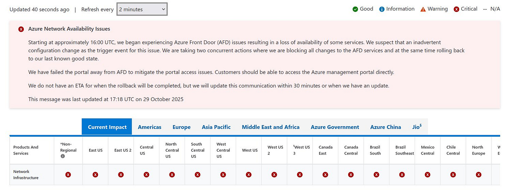](https://substackcdn.com/image/fetch/$s_!hUWM!,f_auto,q_auto:good,fl_progressive:steep/https%3A%2F%2Fsubstack-post-media.s3.amazonaws.com%2Fpublic%2Fimages%2F0649c1d2-79f4-49a2-9524-b1135dde9782_1497x563.jpeg)Azure Dashboard at the time of the outage

---

## **More ways I can help you:**

- [📚](https://www.patreon.com/techworld_with_milan/shop/ultimate-net-bundle-for-2025-1519389?utm_medium=clipboard_copy&utm_source=copyLink&utm_campaign=productshare_creator&utm_content=join_link)**[The Ultimate .NET Bundle 2025](https://www.patreon.com/techworld_with_milan/shop/ultimate-net-bundle-for-2025-1519389?utm_medium=clipboard_copy&utm_source=copyLink&utm_campaign=productshare_creator&utm_content=join_link)** 🆕. 500+ pages distilled from 30 real projects show you how to own modern C#, ASP.NET Core, patterns, and the whole .NET ecosystem. You also get 200+ interview Q&As, a C# cheat sheet, and bonus guides on middleware and best practices to improve your career and land new .NET roles. **[Join 1,000+ engineers](https://www.patreon.com/techworld_with_milan/shop/ultimate-net-bundle-for-2025-1519389?utm_medium=clipboard_copy&utm_source=copyLink&utm_campaign=productshare_creator&utm_content=join_link)**.
- [📦](https://www.patreon.com/techworld_with_milan/shop/premium-resume-package-1721454?utm_medium=clipboard_copy&utm_source=copyLink&utm_campaign=productshare_creator&utm_content=join_link)**[Premium Resume Package](https://www.patreon.com/techworld_with_milan/shop/premium-resume-package-1721454?utm_medium=clipboard_copy&utm_source=copyLink&utm_campaign=productshare_creator&utm_content=join_link) 🆕**. Built from over 300 interviews, this system enables you to craft a clear, job-ready resume quickly and efficiently. You get ATS-friendly templates (summary, project-based, and more), a cover letter, AI prompts, and bonus guides on writing resumes and prepping LinkedIn. **[Join 500+ people](https://www.patreon.com/techworld_with_milan/shop/premium-resume-package-1721454?utm_medium=clipboard_copy&utm_source=copyLink&utm_campaign=productshare_creator&utm_content=join_link)**.
- [📄](https://www.patreon.com/techworld_with_milan/shop/complete-tech-resume-reality-check-311008?utm_medium=clipboard_copy&utm_source=copyLink&utm_campaign=productshare_creator&utm_content=join_link)**[Resume Reality Check](https://www.patreon.com/techworld_with_milan/shop/complete-tech-resume-reality-check-311008?utm_medium=clipboard_copy&utm_source=copyLink&utm_campaign=productshare_creator&utm_content=join_link)**. Get a CTO-level teardown of your CV and LinkedIn profile. I flag what stands out, fix what drags, and show you how hiring managers judge you in 30 seconds. **[Join 100+ people](https://www.patreon.com/techworld_with_milan/shop/complete-tech-resume-reality-check-311008?utm_medium=clipboard_copy&utm_source=copyLink&utm_campaign=productshare_creator&utm_content=join_link)**.
- [📢](https://www.patreon.com/techworld_with_milan/shop/short-linkedin-content-creator-311232?utm_medium=clipboard_copy&utm_source=copyLink&utm_campaign=productshare_creator&utm_content=join_link)**[LinkedIn Content Creator Masterclass](https://www.patreon.com/techworld_with_milan/shop/short-linkedin-content-creator-311232?utm_medium=clipboard_copy&utm_source=copyLink&utm_campaign=productshare_creator&utm_content=join_link)**. I share the system that grew my tech following to over 100,000 in 6 months (now over 255,000), covering audience targeting, algorithm triggers, and a repeatable writing framework. Leave with a 90-day content plan that turns expertise into daily growth. **[Join 1,000+ creators](https://www.patreon.com/techworld_with_milan/shop/short-linkedin-content-creator-311232?utm_medium=clipboard_copy&utm_source=copyLink&utm_campaign=productshare_creator&utm_content=join_link)**.
- [✨](https://www.patreon.com/c/techworld_with_milan)**[Join My Patreon](https://www.patreon.com/c/techworld_with_milan)**[https://www.patreon.com/c/techworld_with_milan](https://www.patreon.com/c/techworld_with_milan)**[Community](https://www.patreon.com/c/techworld_with_milan) and [My Shop](https://www.patreon.com/c/techworld_with_milan/shop)**. Unlock every book, template, and future drop, plus early access, behind-the-scenes notes, and priority requests. Your support enables me to continue writing in-depth articles at no cost. **[Join 2,000+ insiders](https://www.patreon.com/c/techworld_with_milan)**.
- [🤝](https://newsletter.techworld-with-milan.com/p/coaching-services)**[1:1 Coaching](https://newsletter.techworld-with-milan.com/p/coaching-services)**. Book a focused session to crush your biggest engineering or leadership roadblock. I’ll map next steps, share battle-tested playbooks, and hold you accountable. **[Join 100+ coachees](https://newsletter.techworld-with-milan.com/p/coaching-services)**.

---

## **Want to advertise in Tech World With Milan? 📰**

If your company is interested in reaching founders, executives, and decision-makers, you may want to **[consider advertising with us](https://newsletter.techworld-with-milan.com/p/sponsorship-of-tech-world-with-milan)**.

---

## **Love Tech World With Milan Newsletter? Tell your friends and get rewards.**

We are now close to **50k subscribers** (thank you!). Share it with your friends by using the button below to get benefits (my books and resources).

[Share Tech World With Milan Newsletter](https://newsletter.techworld-with-milan.com/?utm_source=substack&utm_medium=email&utm_content=share&action=share)

[Track your referrals here](https://newsletter.techworld-with-milan.com/leaderboard).