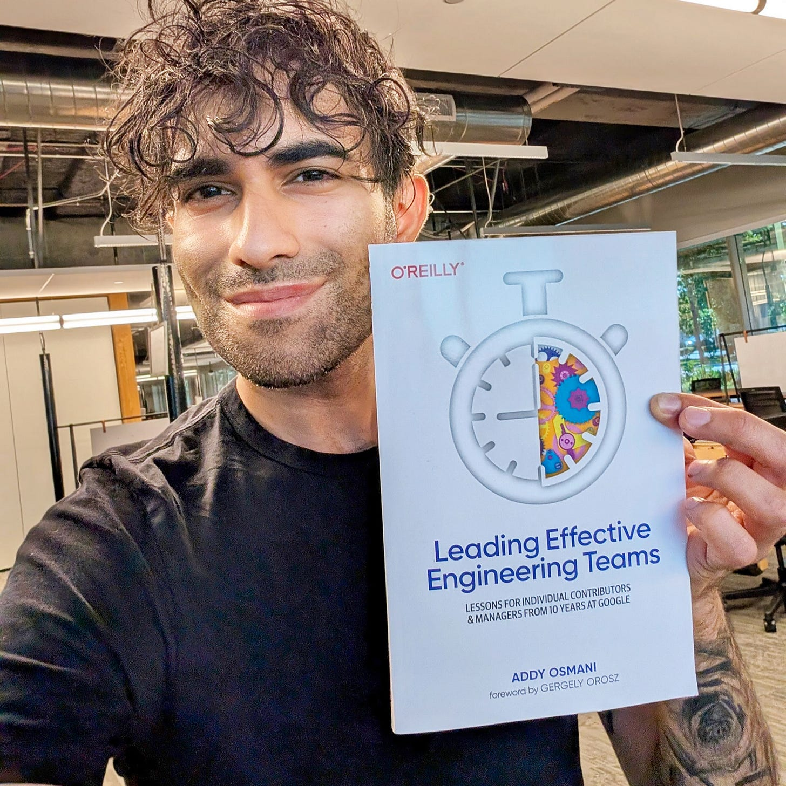
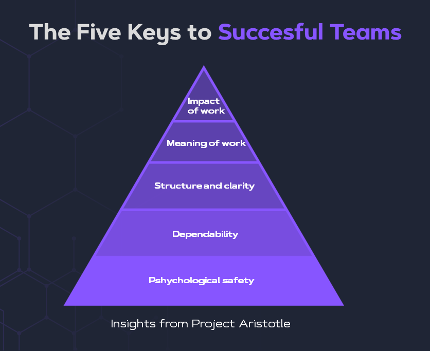
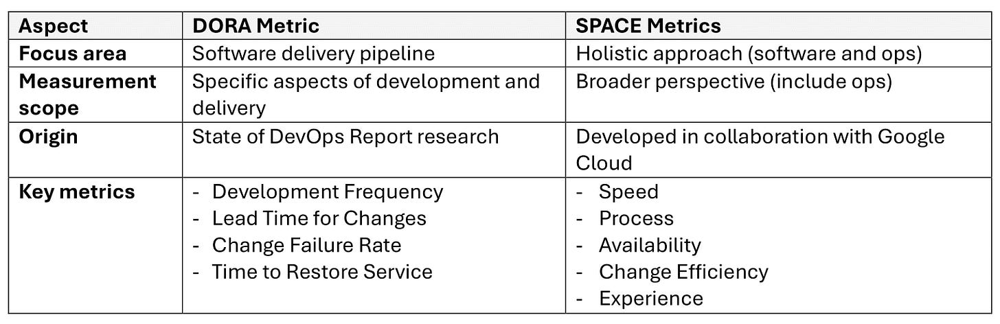
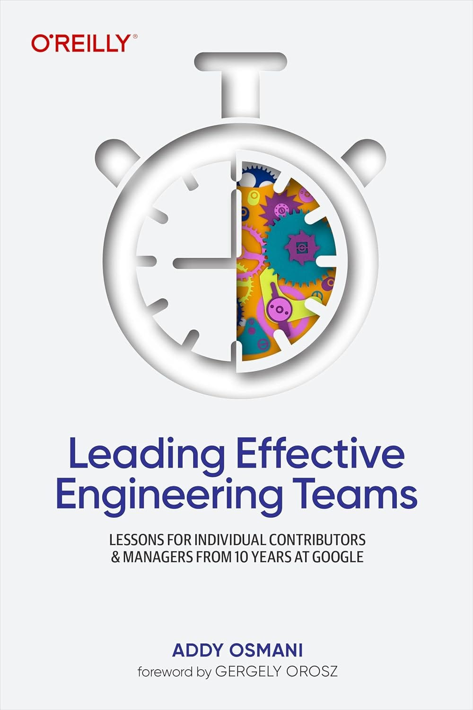

# How Google build great engineering teams?

*An interview with Addy Osmani on Leading Effective Engineering Teams*

Today, we talk with Addy Osmani, the head of Chrome Developer Experience at Google. The main reason for this talk is Addy's new book, called “**[Leading Effective Engineering Teams: Lessons for Individual Contributors and Managers from 10 Years at Google](https://amzn.to/3AGMZqb)”.**

In this issue, we will learn:

1. **Who is Addy?**
2. **What was the reason for writing the book "Leading Effective Engineering Teams"?**
3. **What makes some engineering teams effective?**
4. **How do we build a great team culture?**
5. **Does developer productivity matter?**
6. **What did you learn about leadership from Google?**
7. **What are some bad leadership behaviors?**
8. **What are the most important traits and skills of effective leaders?**
9. **Are 10x programmers real?**
10. **What are some other important aspects of great teams?**

So, let’s dive in.

# **1. Who is Addy?**

I'm Addy Osmani, an Engineering Leader at Google, where I work on Chrome and Web Platform teams. My journey in tech spans over 25 years, during which I've worn many hats - from being an individual contributor to leading diverse teams across various levels. I'm deeply passionate about web development and have authored several books on building large-scale applications and performance.

Throughout my career, I've been fortunate to **contribute to open-source projects and work on developer tools that have (with much credit to my team!) shaped the web development landscape through projects like Chrome DevTools.**My experience at Google has been particularly transformative, allowing me to lead teams pushing the boundaries of what's possible on the web.

But beyond my professional achievements, I'm an ardent believer in the **power of effective leadership to drive innovation and create positive change**. This belief, combined with my experiences and observations, led me to write "[Leading Effective Engineering Teams](https://amzn.to/3AGMZqb)."

> *You can find more details about Addy on his [official site](http://addyosmani.com), [newsletter](https://addyo.substack.com/), [LinkedIn,](https://www.linkedin.com/in/addyosmani/) or [Twitter/X](https://twitter.com/addyosmani). If you’d like to see some of the previous work he and his team have done, you can read more on [Chrome DevTools](https://developer.chrome.com/docs/devtools/news), [Core Web Vitals](https://blog.chromium.org/2023/11/how-core-web-vitals-saved-users-10000.html), [Speedometer,](https://blog.chromium.org/2024/03/speedometer-3-building-benchmark-that.html) and [Chrome Aurora](https://developer.chrome.com/docs/aurora).*

Addy Osmani and his new book “**[Leading Effective Engineering Team](https://amzn.to/3T3X4np)s.”**

# **2. What was the reason for writing the book "Leading Effective Engineering Teams"?**

The genesis of this book lies in a realization I had after years of leading engineering teams: **A significant gap must exist between a great engineer and a great engineering leader.** I've seen brilliant technicians struggle when they step into leadership roles, and I've experienced these challenges firsthand.

I wrote "**[Leading Effective Engineering Teams](https://amzn.to/3T3X4np)**" to bridge this gap. It's the book I wish I had when transitioning into a leadership role. It tries not just to be about theory; it's a practical guide from real-world experiences, both my own and those of other successful leaders I've had the privilege to work with and observe. It’s the culmination of years of notes.

My goal was to **create a comprehensive resource that covers everything from building effective teams to navigating complex leadership challenges**. I wanted to share insights on fostering innovation, managing diverse personalities, and driving high performance in engineering teams.

But more than that, I wanted to **emphasize the human aspect of leadership**. Tech evolves rapidly, but the fundamentals of good leadership—empathy, communication, and vision—remain constant. This book is my attempt to blend these timeless principles with the unique demands of leading in the tech industry.

# **3. What makes some engineering teams effective?**

Engineering teams' effectiveness is more than technical prowess or meeting deadlines. It's a **complex interplay of various factors, including understanding what drives business and user value.** From my experience, the most effective teams share certain key characteristics:

- Firstly, **they have a strong sense of psychological safety**. Team members feel comfortable taking risks, sharing ideas, and even making mistakes without fear of retribution. This fosters innovation and allows for quick learning and adaptation.
- Secondly, **effective teams have clear goals and a shared understanding of success**. They're not just coding; they're solving problems and creating value. This clarity helps in decision-making and prioritization.
- Thirdly, there's a **culture of continuous learning and improvement**. The best teams I've led or observed are always dissatisfied with the status quo and seek ways to enhance their processes, skills, and outcomes.

Yet, what's considered 'effective' can vary based on the organization's goals, the project's complexity, and the team's maturity. However, there are some indicators we can look at:

- **Delivery of high-quality work consistently and on time**
- **High levels of team engagement and low turnover**
- **Ability to adapt to changes and solve complex problems**
- **Positive feedback from stakeholders and users**

Teams operating above this baseline often show exceptional innovation, consistently exceed expectations, and significantly impact the organization's goals.

> *Addy based his writing in Chapter 4 on the Google experience on two projects, **Oxygen** and **Aristotle**. They were two key research initiatives by Google aimed at understanding and fostering high-performing teams.*
> 
> ***[Project Aristotle](https://www.nytimes.com/2016/02/28/magazine/what-google-learned-from-its-quest-to-build-the-perfect-team.html?_r=0)**, launched in 2012, tried to determine what makes the team effective, discovering that psychological safety—the shared belief that the team is safe for interpersonal risk-taking—was the most crucial factor. It also highlighted the importance of dependability, structure and clarity, meaning, and impact.*
> 
> 
> 
> ***[Project Oxygen](https://store.hbr.org/product/google-s-project-oxygen-do-managers-matter/313110?sku=313110-PDF-ENG)** started in 2008, focused on identifying the traits of effective managers, revealing that being a good coach, empowering the team without micromanaging, and creating an inclusive and supportive environment was critical for managerial success.*

Effective teams typically employ a **collaborative approach to decision-making**. They leverage diverse perspectives, use data to inform decisions, and are not afraid to experiment. However, they also know when to defer to expertise and how to make timely decisions even in the face of uncertainty.

# **4. How do you build a great team culture?**

Building a great team culture is both an art and a science. It does not happen overnight but is a continuous process requiring intentional effort and leadership.

In my experience, **trust is the foundation of a great team culture**. Without trust, you can't build psychological safety, which is crucial for innovation and high performance. I've found that **leading by example is key here**. As a leader, when you demonstrate vulnerability, admit mistakes, and show that taking calculated risks is okay, you set the tone for the entire team.

Another crucial aspect is fostering a **sense of purpose**. Teams perform best when they understand the 'why' behind their work. I always strive to connect our day-to-day tasks with the bigger picture, helping team members see how their work impacts users and contributes to the organization's mission.

**Clear communication is also vital**. This means more than conveying information clearly; it also means creating an environment where everyone feels heard. I've implemented practices like regular team retrospectives and open feedback sessions to ensure every voice counts.

**Diversity and inclusion play a significant role, too**. In the book, I share strategies for building diverse teams and creating an inclusive environment where everyone can thrive. It's not just about hiring diverse talent but also about valuing different perspectives and experiences.

Lastly, I believe in**the power of continuous learning and growth**. I encourage my teams to take on challenges, learn from failures, and celebrate successes. This growth mindset is crucial for building a culture of innovation and excellence.

Remember, **culture isn't something you can impose. It's something you nurture**. It's about creating the right conditions and allowing your team to shape and evolve the culture together.

# **5. Does developer productivity matter?**

Developer productivity matters, but it's a nuanced topic beyond simple metrics like lines of code or the number of commits. In "[Leading Effective Engineering Teams,](https://amzn.to/3T3X4np)" I dedicate a significant portion to discussing productivity holistically. A big focus on outcomes (what helps users and the business) over just outputs is valuable. Still, productivity does play a role in understanding how well you’re executing.

I've found that frameworks like **[SPACE](https://newsletter.techworld-with-milan.com/i/115003073/the-space-framework-for-team-productivity)** (Satisfaction, Performance, Activity, Communication, Efficiency) and **[DORA](https://newsletter.techworld-with-milan.com/i/115003073/dora-metrics-for-team-productivity)** (DevOps Research and Assessment) metrics are **invaluable tools for understanding and improving developer productivity**. These frameworks help us move beyond simplistic measures and consider factors like developer satisfaction, communication quality, and the efficiency of our development processes.

However, it's crucial to remember that **these frameworks are tools, not solutions**. The key is using them thoughtfully and with qualitative insights to understand your team's unique context.

In the book, I share strategies for effectively implementing frameworks like them and avoiding pitfalls. For example, I caution against using these metrics punitively or in isolation. Instead, I advocate **using them as conversation starters and guides for continuous improvement**.

Ultimately, developer productivity is about enabling your team to create value efficiently and sustainably. **It's about creating an environment where developers can do their best work**, continuously learn and improve, and derive satisfaction from their contributions. When we focus on these aspects, the traditional productivity metrics often improve as a natural consequence.

DORA vs SPACE Metrics

# **6. What did you learn about leadership from Google?**

My time at Google has been incredibly enriching, offering countless leadership and team management lessons. One of the most impactful learnings has been the **importance of data-driven decision-making**. At Google, we don't just rely on intuition; we back our decisions with data and rigorous analysis.

As for positive leadership behaviors, there are several that I've both observed and tried to embody:

1. **Empowering the team**: Great Google leaders don't micromanage. They set clear objectives and trust their teams to determine the best way to achieve them, fostering ownership and innovation.
2. **Promoting psychological safety**: Leaders here actively work to create an environment where team members feel safe to take risks, voice their opinions, and even fail occasionally. This is crucial for innovation and continuous improvement.
3. **Focusing on impact**: We're encouraged always to consider the user and the broader impact of our work. This helps prioritize efforts and keeps the team motivated.
4. **Continuous learning**: The best leaders I've seen are constantly learning and staying curious about new technologies and methodologies. They encourage this same growth mindset in their teams.
5. **Transparency**: Open and honest communication, even when it's difficult, is highly valued. This builds trust and helps in navigating complex challenges.
6. **Championing diversity and inclusion**: There's a strong emphasis on building diverse teams and creating an inclusive environment where everyone can thrive.

# **7. What are some bad leadership behaviors?**

In my years of experience, I've observed and, admittedly, sometimes exhibited leadership behaviors that can be detrimental to team performance and morale.

**One particularly harmful behavior is micromanagement**. Many new leaders fall into this trap, often wanting to ensure everything is perfect. However, it stifles creativity, erodes trust, and leads to a disengaged team. Instead, I advocate for setting clear expectations and trusting your team to deliver.

Another problematic behavior is "**heroic leadership**," which involves trying to solve every problem yourself. This overwhelms the leader and prevents team members from growing and taking ownership. Effective delegation and empowerment are crucial counterpoints to this tendency.

**Inconsistency in communication or decision-making** can also be highly damaging. When leaders say one thing and do another or frequently change direction without explanation, it creates confusion and erodes trust. Transparency and consistency are key to maintaining team confidence.

Another pitfall is **ignoring or downplaying team conflicts**. While it might seem easier to avoid confrontation, unresolved conflicts can fester and create a toxic team environment. Addressing issues head-on, with empathy and fairness, is essential.

Lastly, a **failure to provide regular, constructive feedback** can severely hamper team growth and performance. Feedback shouldn't just happen during annual reviews; it should be an ongoing process that helps team members understand their strengths and areas for improvement.

It's important to remember that we're all human, and these behaviors often come from a place of good intentions. The key is to be self-aware, open to feedback, and committed to continuous improvement as a leader.

Addy works on Google Chrome browser.

# **8. What are the most important traits and skills of effective leaders?**

Based on my experience and research for "[Leading Effective Engineering Teams](https://amzn.to/3Az9ihk)," I believe several crucial traits and skills set effective leaders apart.

First and foremost is **emotional intelligence**. This encompasses self-awareness, empathy, and the ability to manage one's emotions and those of one's team. In the fast-paced, often high-pressure world of software engineering, emotional intelligence is invaluable for building strong relationships, navigating conflicts, and creating a positive team culture.

**Vision and strategic thinking** are also vital. Effective leaders must see the big picture and chart a clear course for their team. This involves technical knowledge and an understanding of business objectives and market trends.

**Adaptability** is another key trait. Technology evolves rapidly, and effective leaders must be comfortable with change and uncertainty. This doesn't mean constantly chasing the latest trends but having the flexibility to adjust strategies and learn new skills.

**Communication** is, of course, paramount. This includes not just the ability to articulate ideas clearly but also active listening and the skill of tailoring your message to different audiences – whether you're explaining technical details to stakeholders or discussing career growth with a team member.

**Decision-making** is another crucial skill. Effective leaders must gather and analyze information, consider different perspectives, and make timely decisions, even amid ambiguity.

Lastly, I'd emphasize the importance of integrity and authenticity. Trust is the foundation of effective leadership, and it's built through consistent, ethical behavior and genuine interactions.

# **9. Are 10x programmers real?**

From my experience, **there are indeed engineers who can have an outsized impact on a project or team**. However, I'm cautious about the "10x" label, as it often oversimplifies a complex reality.

We often perceive a "10x programmer" as someone with unique skills: deep technical expertise, system-level thinking, excellent problem-solving abilities, and strong communication skills. These individuals can significantly accelerate a project, especially in architecture design or solving complex technical challenges.

However, **the impact of these high performers on team dynamics can be complex.** On the positive side, they can raise the bar for the entire team, sharing knowledge and inspiring others to improve. They often become unofficial mentors, helping to elevate the skills of those around them.

But there are potential downsides, too. If not managed carefully, **the presence of a "10x programmer" can lead to an overreliance on one person**, creating a single point of failure. It can also be demotivating for other team members if they feel they can't measure up.

As a leader, **it's crucial to harness the abilities of your top performers while fostering a collaborative, inclusive environment**. This includes ensuring that high-performers are leveraged for their expertise without becoming bottlenecks, encouraging knowledge sharing, and recognizing the diverse contributions of all team members.

Ultimately, the most successful teams create an environment where everyone can grow and contribute to their fullest potential. While individual brilliance is valuable, team synergy and collective intelligence often lead to the most innovative and sustainable outcomes.

# **10. What are some other important aspects of great teams?**

One crucial point I emphasize is **the importance of continuous learning and adaptation**. The tech landscape is ever-changing, and more than what makes a team effective today might be needed tomorrow.

I also want to stress the **significance of work-life balance and mental health** in tech teams. Our industry often has a culture of long hours and high stress. As leaders, we are responsible for fostering an environment that values well-being and productivity. In the book, I discuss strategies for promoting sustainable work practices and supporting team members' overall health and happiness.

Another key theme is **the power of diversity and inclusion** in driving innovation and problem-solving. I share insights on building truly inclusive teams where diverse perspectives are present, actively valued, and leveraged.

Lastly, I want to mention the **importance of ethical leadership** in tech. As our industry's impact on society grows, we have an increasing responsibility to consider the ethical implications of our work. In the book, I explore how leaders can incorporate ethical considerations into their decision-making processes and instill a sense of responsibility in their teams.

Remember, effective leadership is a journey, not a destination. It requires constant reflection, learning, and growth.

If all of this made you more interested, check the new Addy book:

[Leading Effective Engineering Teams: Lessons for Individual Contributors and Managers from 10 Years at Google](https://amzn.to/3yIACtb)

---

## More ways I can help you

1. **[LinkedIn Content Creator Masterclass ✨](https://www.patreon.com/techworld_with_milan/shop/short-linkedin-content-creator-311232?utm_medium=clipboard_copy&utm_source=copyLink&utm_campaign=productshare_creator&utm_content=join_link).**In this masterclass, I share my proven strategies for growing your influence on LinkedIn in the Tech space. You'll learn how to define your target audience,  master the LinkedIn algorithm, create impactful content using my writing system, and create a content strategy that drives impressive results.
2. **[Resume Reality Check"](https://www.patreon.com/techworld_with_milan/shop/resume-reality-check-311008?source=storefront)**[🚀](https://www.patreon.com/techworld_with_milan/shop/resume-reality-check-311008?source=storefront). I can now offer you a new service where I’ll review your CV and LinkedIn profile, providing instant, honest feedback from a CTO’s perspective. You’ll discover what stands out, what needs improvement, and how recruiters and engineering managers view your resume at first glance.
3. **[Join My Patreon Community](https://www.patreon.com/techworld_with_milan)**: This is your way of supporting me, saying “**thanks,** " and getting more benefits. You will get exclusive benefits, including all of my books and templates (worth $100), early access to my content, insider news, helpful resources and tools, priority support, and the possibility to influence my work.
4. **[Promote yourself to 34,000+ subscribers](https://newsletter.techworld-with-milan.com/p/sponsorship-of-tech-world-with-milan)**by sponsoring this newsletter. This newsletter puts you in front of an audience with many engineering leaders and senior engineers who influence tech decisions and purchases.
5. **1:1 Coaching:** [Book a working session with me](https://newsletter.techworld-with-milan.com/p/coaching-services). 1:1 coaching is available for personal and organizational/team growth topics. I help you become a high-performing leader and engineer 🚀.

---

Thanks for reading Tech World With Milan Newsletter! Subscribe for free to receive new posts and support my work.