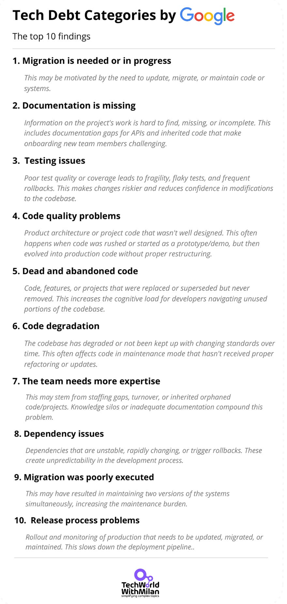
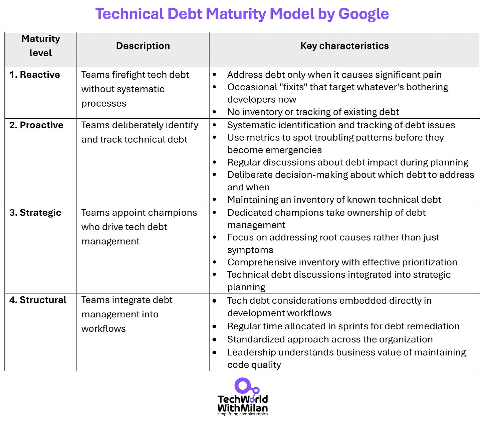
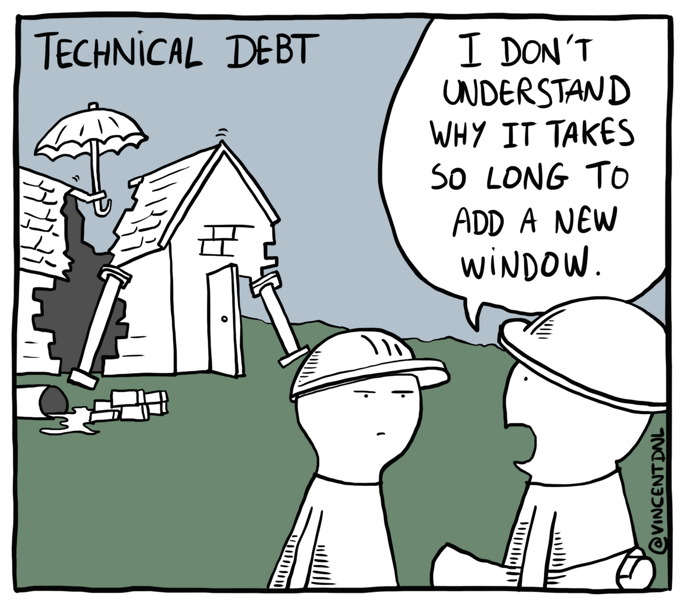

# How Google Measures and Manages Tech Debt

Technical debt has haunted development teams for decades, yet remains surprisingly difficult to explain. Everyone has their definition of Technical Debt. You will probably get three different answers if you ask three people what it is.

Google recently faced this challenge at scale – a substantial percentage of its engineers reported being blocked by “unnecessary complexity and technical debt” in internal surveys. In a paper titled “**[Defining, Measuring, and Managing Technical Debt](https://research.google/pubs/defining-measuring-and-managing-technical-debt/),**” Google Engineers Ciera Jaspan and Collin Green systematically understood this concept that slows down even the most talented engineering teams.

They tried to answer the following questions: *How do you measure something so intangible? And once you identify it, how do you manage it without halting new development?*

This research matters because technical debt is often blamed for productivity issues, but rarely defined or measured with precision. Google's work offers concrete strategies that any engineering organization can adopt.

So, let’s dive in and learn more about their approach.

---

## [Kestra: Stop Duct‑Taping Your Workflows (Sponsored)](https://fnf.dev/3YbeBMQ)

*Still stitching Python scripts, cron jobs, and abandoned DAGs? Fine—until the 2 a.m. page.*

***[Kestra](https://fnf.dev/3YbeBMQ)** brings order. Open-source orchestration turns scattered jobs into one version‑controlled, observable pipeline.*

- *✅ Event‑driven and scheduled runs*
- *✅ Declarative YAML stored in Git*
- *✅ Hundreds of plugins—databases, APIs, AWS, Azure, GCP…*

***How it plays out:**Stripe webhook → enrich with Postgres → load to Snowflake → alert Slack.*

*One YAML file. One commit.*

[Try Kestra](https://fnf.dev/3YbeBMQ)

---

## 1. Definition of Technical Debt

The term "technical debt" [originated with Ward Cunningham in 1992](https://en.wikipedia.org/wiki/Technical_debt), who used the financial debt metaphor to explain trade-offs in software development. As he explained, "*Shipping first-time code is like going into debt. A little debt speeds development so long as it is paid back promptly with a rewrite.*"

Instead of imposing a top-down definition, Google took an empirical approach to defining technical debt. They asked engineers about the types of technical debt they encountered and what mitigations would be appropriate to fix this debt.

Here are the **ten categories from Google’s research**, with brief descriptions:

1. **🔄 Migration needed or in progress** – This could be tied to previous design decisions that worked well before producing problems, such as integration with a third-party service no longer maintained. This debt appears when we must rebuild the system to make it stable and current.
2. **📄 Poor or missing documentation** – Important documentation (such as how the system works or API usage) is hard to find or nonexistent. Lack of clear docs on current behavior or inherited code means developers waste time trying to understand the system.
3. **🧪 Inadequate testing** – Test coverage or quality is lacking. For example, critical areas have no automated tests or use poor test data, leading to fragile builds, flaky test results, and frequent rollbacks of releases.
4. **🪲 Bad code quality** – Code (or overall architecture) wasn’t well-designed – perhaps it was rushed out, hacked as a prototype, or never refactored. The result is messy or inefficient code that’s hard to maintain or scale.
5. **👻 Dead code** – Old code, features, or entire projects remain in the codebase despite being superseded or deprecated. This unused code bloat confuses developers and can cause unexpected side effects. There are open-source tools available to assist you in deleting dead code, but doing so takes time. Be careful when removing dead code in large codebases, as you may mess up something.
6. **🕸️ Code degradation** – The codebase has *gradually decayed* in quality or consistency over time. Parts of the system are outdated relative to current standards or best practices, often due to being in “maintenance mode” for too long without cleanup.
7. **🤷‍♂️ Knowledge gaps** – The team lacks necessary expertise in certain areas of the system. When the original authors leave, the team has to experiment to understand the orphaned code, which slows development.
8. **🔗 Problematic dependencies** - External components or libraries on which the project depends are unstable, rapidly changing, or frequently break your build (causing rollbacks). The debt relies on dependencies that don’t provide a stable foundation.
9. **❌ Failed migrations** – A past migration was poorly executed or left incomplete, resulting in *two co-existing versions* of something that now both require maintenance. This doubles the effort for every change and creates confusion over which path is the “right” one. Another such scenario is when a team expects specific promises to be fulfilled following a migration but subsequently discovers this is not the case.
10. **🐢 Outdated release process**—The build, release, or deployment process (including monitoring in production) is outdated or overly manual. For example, releasing new code requires cumbersome steps or doesn’t adequately catch issues, dragging on productivity.

These categories range from code-level issues to documentation, infrastructure, and team-related debt. Together, they formed Google’s working definition of technical debt in all its forms. Not every team will experience all ten equally – **debt often reflects the context**.

A scrappy new startup, for instance, might have little dead code or code rot yet (everything is new), but may suffer from insufficient tests or release automation. However, a large enterprise or monolithic codebase might struggle with ongoing migrations and outdated components.

## 2. Measuring Technical Debt

Google measures technical debt through a **quarterly engineering survey** of about **one-third of engineers** (roughly one-third responding). They ask engineers specifically about which technical debt categories have hindered their work, not simply what debt exists, but **what debt is actively slowing them down**.

This distinction is crucial, as it acknowledges that **not all technical debt requires immediate attention**. Sometimes, **technical debt exists but doesn't significantly impact productivity**.

The survey responses help Google identify teams struggling with specific types of technical debt. For example, engineers working on machine learning systems face different technical debt challenges than those building back-end services. This allows for targeted interventions based on the toolchain or organizational area.

However, survey-based measures have limitations:

- With **only about 10% of engineers responding each quarter**, confidence intervals can be wide for smaller teams
- **Surveys are lagging indicators** - debt only appears once it's severe enough to hinder developers
- There can be **skepticism about subjective reports** without objective metrics

To address these limitations, Google researchers tried to develop metrics based on engineering log data that could serve as early indicators of technical debt formation. They focused on **three debt types (code degradation, teams lacking expertise, and migrations being needed)**and **explored 117 potential metrics**, such as:

- 📝 Number of "TODOs" in code as an indicator of code degradation
- 👻 Proportion of code written by past team members as a sign of expertise gaps
- 🔄 Frequency of migration-related terms in bug reports

The results were disappointing. **No metric predicted engineer-reported technical debt** - linear regression models explained less than 1% of the variance in survey responses. Even complex random forest models achieved high precision (>80%) but poor recall (10-25%), meaning they could identify some debt-ridden areas but missed many others.

This finding highlights why technical debt is so challenging to measure objectively: **it's not just about a system's current state but also about the relationship between that state and the ideal state engineers want**.

For example, Python 2 code represents technical debt only in a world where Python 3 exists as a preferred alternative - the code itself doesn't change, but the context does.

This insight explains why automated metrics struggled: **many forms of debt are context-dependent and forward-looking** (what *should* we be doing?) **rather than purely about the current code**.

Technical Debt (Author: [Manu Cornet](https://ma.nu/))

### 3. Managing Technical Debt

Defining and measuring tech debt was essential to the research, but the real goal was to **reduce** it. Google formed an internal **Technical Debt coalition** – a cross-functional group of engineers and leaders – to drive company-wide improvements.

This group took a comprehensive approach, addressing process, education, and tooling. Some of the key initiatives included:

- **🗂️ Technical Debt Management Framework**. They built a framework so teams can consistently list their tech debt, judge its impact, assign owners, and track fixes. Debt work is now planned instead of being done at random.
- **🪜 Tech Debt Maturity Model.**The coalition developed a maturity model (with an accompanying self-assessment) to evaluate how systematically a team manages its debt.

The model defines four maturity levels:

1. **🔥 Reactive level** - Teams at this level have no real processes for managing technical debt. They might occasionally tackle debt through focused efforts (like "fixits"), but only respond when problems become severe enough to hinder work. They typically address familiar issues but lack systematic approaches to identify or track debt. Non-technical leaders might not understand tech debt at all until something breaks badly.
2. **📊 Proactive level** - At this level, your team recognizes that technical debt needs systematic attention. They understand that "if you can't measure it, you can't improve it" and actively track metrics related to the application, development workflow, and release processes. You've realized that you need an inventory of technical debt before effectively managing it.
3. **🎯 Strategic level** - The key improvement here is having dedicated champions who take ownership of technical debt management. These champions identify and address root causes rather than just symptoms. They've created a comprehensive inventory of technical debt issues and know how to prioritize the most pressing problems, assigning people to tackle specific items. Tech debt discussions happen during planning, not just when things break.
4. **✅ Structural level** - This is the gold standard. Technical debt considerations are included directly in your development workflow and processes. Both technical and non-technical team members treat debt remediation as a regular part of work, with dedicated time routinely allocated in sprints. The approach is standardized across teams, creating organizational consistency.

Teams can assess where they stand and get guidance on practices to reach the next level.

- **🎓 Education and Evangelism** – The coalition organized training to spread best practices. They held classroom sessions and self-service courses about managing tech debt. They set up internal forums and a talk series (with internal and external speakers) to keep the conversation going. This helped create a shared culture where engineers and managers are aware of tech debt and how to handle it, rather than leaving it as a vague notion.
- **🛠️ Tooling and Indicators** – They built tools to surface potential debt areas – for instance, dashboards highlighting modules with low test coverage, missing documentation, or heavily deprecated dependencies. While the earlier research showed such metrics can’t perfectly identify debt independently, these tools are still helpful. **The intent is to assist teams who*****suspect*****they have an issue tracking their progress** as they improve it. In other words, if a team knows they don’t have proper tests, a coverage tool can show if they’re moving in the right direction after each fix-it effort.

These efforts were supported by leadership, and even incentive changes to encourage tackling debt (for example, recognizing and rewarding improvements in code health, not just feature delivery).

Over several years, Google’s focus on technical debt has paid off. They saw a **substantial drop** in the percentage of engineers reporting that tech debt or overly complicated code was “moderately” or “extremely” hindering their work.

Most Googlers now say technical debt hinders them only *“slightly” or “not at all*.” This was the **most significant positive shift** in any productivity factor observed in the five years since the survey began.

## 4. The right balance

It's important to note that zero technical debt is not the goal at Google or any practical engineering organization. The authors explain that planned tech debt is valuable to real projects.

Google's quarterly survey also asks engineers:

- **To what extent has their team deliberately incurred technical debt recently**
- **How often was this the right decision**
- **How much investment went into reducing existing debt**
- **How well their debt management process works**

These questions recognize that technical debt, like financial debt, can be used strategically. Just as a mortgage allows you to own a home before saving the full purchase price, strategic technical debt can help teams ship features faster when the business context demands it.

The key distinction, drawn from [Martin Fowler's technical debt quadrant model](https://martinfowler.com/bliki/TechnicalDebtQuadrant.html), is between:

1. **Deliberate, prudent debt:** Consciously taken on with a clear understanding of the consequences
2. **Inadvertent, reckless debt:** Accumulated through poor practices or lack of awareness

Google found that strong teams don’t try to avoid tech debt altogether. They accept it when it helps and pay it down with a plan.

Technical Debt Quadrant (Source: [Martin Fowler Blog](http://Technical Debt Quadrant))

## 5. Practical takeaways

Not every organization has Google’s resources or scale, but many of these insights are broadly applicable. **Engineering leaders, CTOs, and senior engineers can borrow these ideas** to balance fast delivery with sustainable code quality better.

Here are some practical takeaways and checklists to consider in your context.

### **Signs of unmanaged Technical Debt**

If you’re not actively managing tech debt, it tends to manifest in revealing ways.

Watch out for these red flags in your team’s day-to-day work:

- **🔥 Frequent firefighting and fragile code.** You’re often in “fix it after it breaks” mode. Production incidents, hotfixes, rollbacks, or flaky tests are common, indicating underlying design or quality issues that were never fully resolved (classic symptoms of debt in testing or code quality).
- **🐢 Slow delivery despite the effort.** New features or changes take longer than they should because developers are wrestling with the existing code. Perhaps each change requires touching a dozen modules or working around outdated constraints. **Tech debt might be the invisible drag when effort doesn’t scale with output**.
- **🙈 Avoidance of certain code areas.** The team has parts of the codebase they dread working on – maybe an old subsystem no one understands (knowledge debt) or a messy tangle of hacks from years ago. If developers say things like “*I have no idea what will happen if we change X*,” that’s a strong sign of unmanaged debt.
- **🤯 Onboarding is painful.** New engineers take a long time to become productive. A common culprit is poor documentation and convoluted setup processes. If documentation is outdated or nonexistent and the only way to learn the system is tribal knowledge, your tech debt (in docs, release process, etc.) undermines team growth. The goal is for engineers to start delivering on the project in the first week.
- **🛠️ Many manual processes.** The engineering workflow has a lot of “glue” work – e.g., manually running deployment steps, handling data migrations by hand, or continuously patching dependency issues. This often points to debt in automation and tooling (for instance, an outdated release pipeline or lack of proper migration tooling).

> ℹ️ **Tech Debt Formula**: Technical Debt = (Remediation cost/Development cost) * 100% (*Ideally should be less than 5%.*)

### **Building the right Technical Debt management culture**

Tackling tech debt isn’t a one-time sprint; it’s an ongoing discipline. Here are some practices to help your team **proactively manage debt**:

- **📋 Acknowledge and inventory debt.** First, make tech debt a visible part of the conversation. Encourage engineers to mention debt issues in planning discussions or retrospectives. Keep a **list of known debt items** in a special Jira board, a wiki, or a “tech debt bucket.” List each debt item so it becomes a straightforward, trackable task.
- **📆 Prioritize and allocate time for debt.** Treat the worst tech debt like you would feature work – prioritize it by impact. Not all debt is equal: some may be relatively harmless to carry for now, while others (e.g., a critical module with no tests) pose high risk and “interest.” Once you identify high-priority debts, **allocate time** to address them. This could mean scheduling a percentage of each sprint for refactoring/cleanup, or periodic “**fix-it weeks**”, dedicated to debt reduction.
- **🎯 Be deliberate when incurring new debt.** Sometimes, taking on technical debt is the right call to hit a deadline or test a market quickly, **if done consciously**. The key is to be deliberate: when you decide to implement a quick-and-dirty solution, document the assumption (e.g., a `// TODO` note with the owner and date or an entry in the debt register) and ideally set a trigger or timeline to revisit it. In a healthy culture, engineers shouldn’t fear admitting “*we’re taking a shortcut here*,” but they should have a plan to address it later.
- **🏆 Invest in process and “champions.”** Consider assigning explicit **ownership to the team for tech debt management**. Google found that teams with a *“strategic”* approach designate champions who drive debt discussions and preventive practices. This could be a rotating role or part of a tech lead’s responsibilities. Also embed debt considerations into existing processes – for example, add a step in code review or design review that asks, “*Does this introduce any new debt or clean up existing debt?*” Over time, these practices normalize debt control as part of the workflow (akin to Google’s *structural* maturity level).
- **📊 Track Technical Debt proactively.** Tools can help by quantifying certain aspects of code health – linters for code smells, test coverage reports, dependency freshness, etc. Use these to your advantage: they can track progress (are we improving?) and catch regressions.
- **🎓 Enable continuous education.** Ensure the team understands *why* technical debt matters – not in abstract terms, but how it directly affects your ability to deliver. Share stories of past incidents caused by debt. Encourage senior engineers to mentor juniors in writing clean, maintainable code (to avoid adding new debt unwittingly).

Finally, as a leader, set the tone that **technical debt is a strategic issue, not a mistake we made.** Every software system will have some debt; it’s often the flip side of delivering quickly. This is especially emphasized when using Agile methods, such as Scrum.

The goal isn’t to eliminate debt (which is impossible anyway) but to **manage it intentionally,** incurring debt when it makes business sense and paying it off regularly before it destroys your team's velocity and delivery potential.

Google found that once teams manage tech debt, developers build more and waste less time fixing broken tests or messy code. Teams that balance speed and quality outpace those that rush and then slow down, fixing mounting tech debt.

Identify tech debt, measure its impact on people, and keep reducing it so your **team can scale smoothly**.

> ➡️ Learn more about how to deal with Technical Debt:
[
Tech World With Milan NewsletterHow To Deal With Technical DebtIn this issue, we are going to talk about the following…Read more3 years ago · 43 likes · 1 comment · Dr Milan Milanović](https://newsletter.techworld-with-milan.com/p/how-to-deal-with-technical-debt?utm_source=substack&utm_campaign=post_embed&utm_medium=web)
> ➡️ Or how to deal with it in legacy projects:
[
Tech World With Milan NewsletterHow to deal with Technical Debt in legacy projects We have all been working on an existing project with many issues. Team members are more or less aware of these issues, which are, to some extent, apparent problems in the development flow. The umbrella term for all of these issues is Technical Debt…Read morea year ago · 58 likes · 5 comments · Dr Milan Milanović](https://newsletter.techworld-with-milan.com/p/how-to-deal-with-technical-debt-in?utm_source=substack&utm_campaign=post_embed&utm_medium=web)
## 6. Conclusion

[Google's research](https://research.google/pubs/defining-measuring-and-managing-technical-debt/) offers several valuable lessons for engineering organizations of all sizes:

1. **Technical debt comes in many forms, and teams should develop a shared vocabulary to discuss it effectively.**
2. **Measuring technical debt remains challenging. Surveys are imperfect but provide more insight than attempting to rely solely on code metrics.**
3. **A systematic approach to debt management gives results, with Google seeing significant improvements in productivity through its framework.**
4. **The goal isn't zero technical debt but deliberate debt management as part of engineering strategy.**

While specific categories of technical debt may vary across organizations, defining, measuring, and actively managing technical debt can benefit any development team.

The most successful organizations don't treat technical debt as an engineering problem—they recognize it as a strategic issue that requires deliberate management.

---

## **🚀 [Land .NET Engineer Roles Faster](https://www.patreon.com/techworld_with_milan/shop/ultimate-net-bundle-for-2025-1519389?utm_medium=clipboard_copy&utm_source=copyLink&utm_campaign=productshare_creator&utm_content=join_link)**

**Grab [my Ultimate .NET Bundle 2025](https://www.patreon.com/techworld_with_milan/shop/ultimate-net-bundle-for-2025-1519389?utm_medium=clipboard_copy&utm_source=copyLink&utm_campaign=productshare_creator&utm_content=join_link)** — 500+ pages packed with modern C#, architecture, and interview prep from 20 years of real-world experience.

**What’s inside:**

- ✅ **.NET Ecosystem Guide** – Understand the entire stack (31 pages)
- ✅ **Why C#** – Deep dive into features, tooling, and market value (60+ pages)
- ✅ **Modern C# v6–13 Overview** – 50+ key features explained simply (51 pages)
- ✅ **Design Patterns in C#** – Learn patterns used in production (53 pages)
- ✅ **200+ Interview Q&A** – From junior to senior roles (122 pages)
- ✅ **2025 .NET Roadmap** – Structured, resource-backed learning (38 pages)
- ✅ **Authentication Masterclass** – Secure apps the right way (86 pages)

🔥 𝗘𝘅𝗰𝗹𝘂𝘀𝗶𝘃𝗲 𝗯𝗼𝗻𝘂𝘀𝗲𝘀 (worth $99):

- 🎁 **ASP.NET Core Best Practices** – Production-ready guidelines (27 pages)
- 🎁 **Middleware Deep Dive** – Master the ASP.NET pipeline (23 pages)
- 🎁 **2025 C# Cheat Sheet** – Your quick coding reference (73 pages)

[Buy bundle](https://www.patreon.com/techworld_with_milan/shop/ultimate-net-bundle-for-2025-1519389?utm_medium=clipboard_copy&utm_source=copyLink&utm_campaign=productshare_creator&utm_content=join_link)

(One-time payment. Lifetime access. Updates are free.)

---

Thanks for reading Tech World With Milan Newsletter! Subscribe for free to receive new posts and support my work.