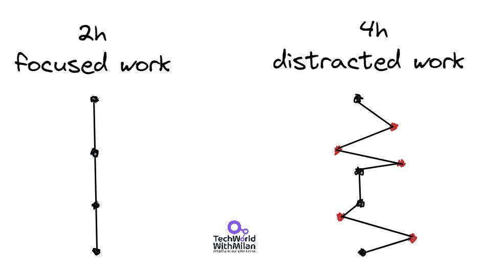
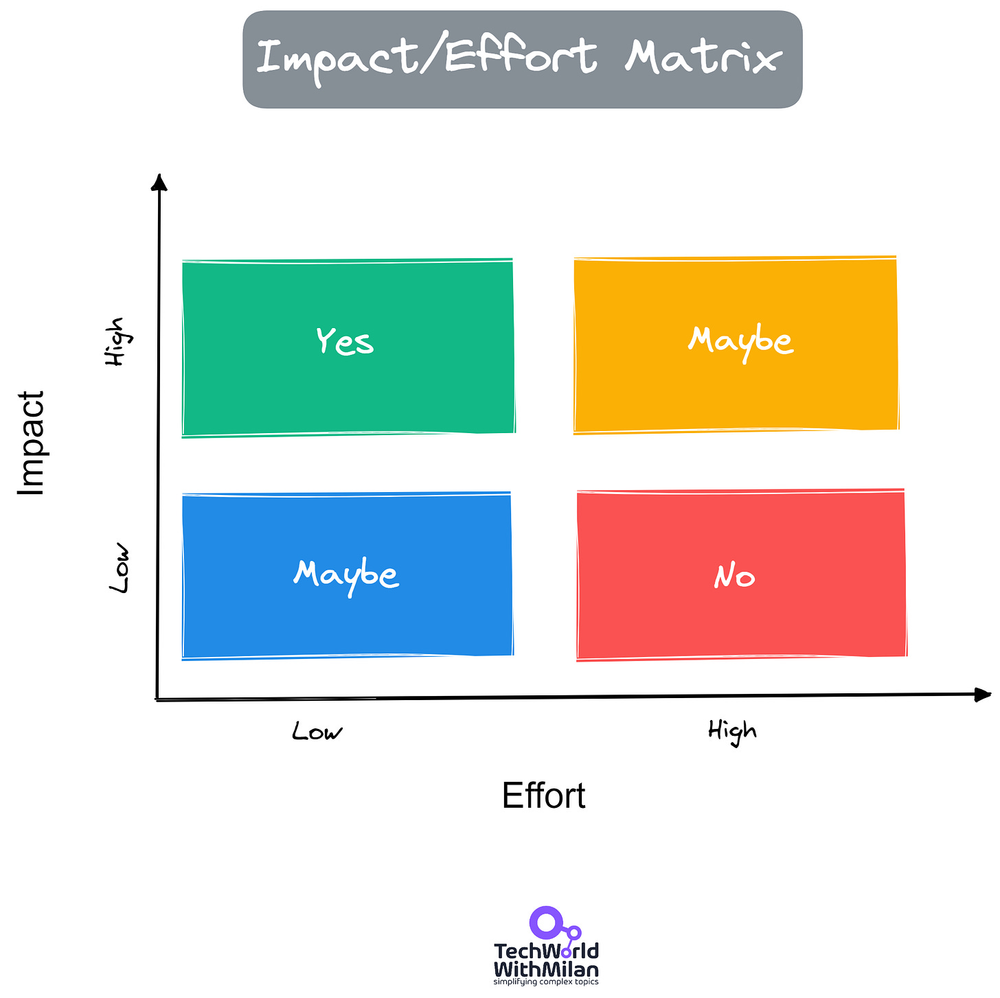
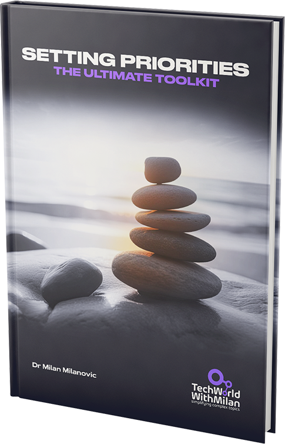
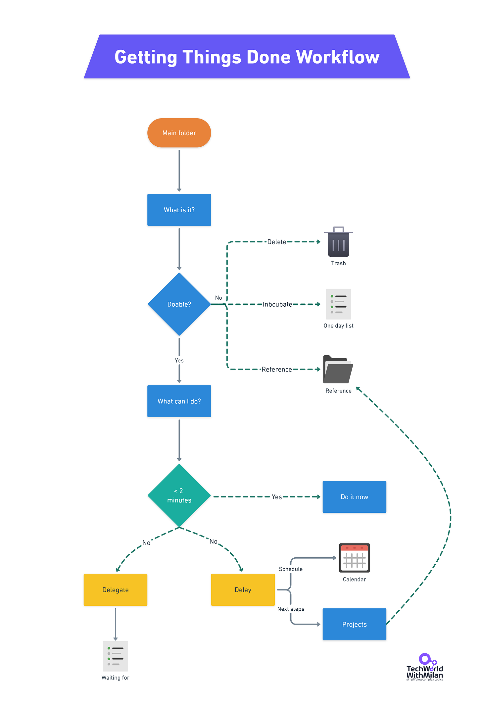
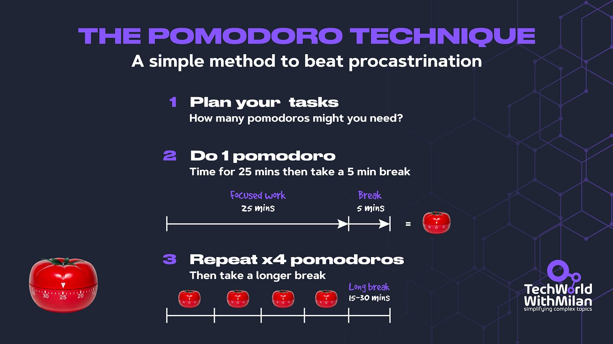
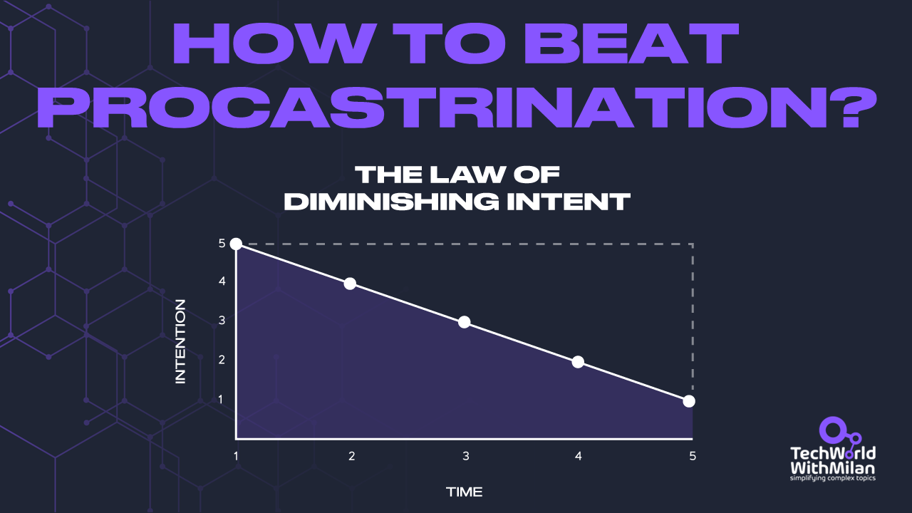
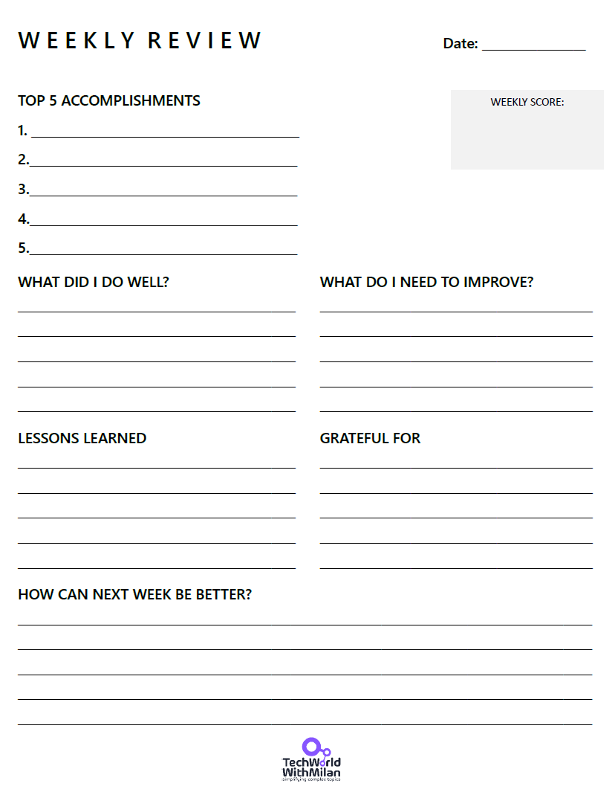
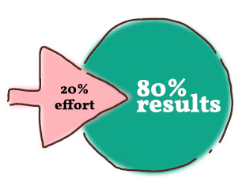
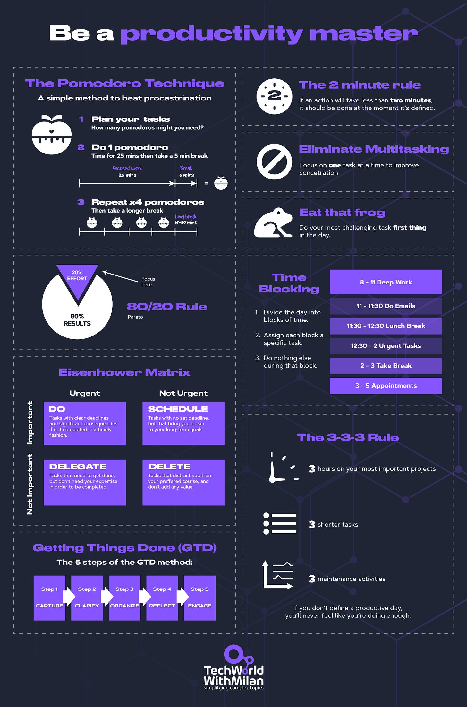

# How to be 10x more productive

*And become top-performer in any job.*

I was always amazed by top performers. I wondered what they do and how they are much better than others. Then, I started researching and talking directly to some of them. I finally managed to get some top performers as my mentors and, in the end, became one of them. I learned that they are not better than others, but they use some techniques that help them achieve more.

Here are some productivity techniques you can use daily to achieve 10x more than you imagined.

# Focus on ONE thing

A primary differentiator between top performers and others is that top performers don’t multitask. [Scientifically](https://health.clevelandclinic.org/science-clear-multitasking-doesnt-work/), our brains cannot multitask; even if we try, we lose significant time concentrating on another task.

We can achieve this by:

1. Picking **one topic at a time** (meaningful to you), i.e., setting one goal for each work block and breaking it into **actionable tasks**.
2. **We should block our time in the calendar**early in the day****when we have the most energy to do something and try to keep our focus on it. **Try not to manage your time; manage your energy**. Enable yourself to have at least 2-3h of in-depth work sessions because you need 20-30mins to get in the flow state (4h is the max you can do in a day).
3. During this time, try to **turn off all notifications and distractions**.
4. **Batch similar tasks** and tackle them collectively.
5. When you finish a job, **reward yourself** with an activity you like (and yes, put this into the calendar too).
6. **Leave the afternoon for meetings** or some other repetitive or administrative tasks.

This single-tasking approach leads to better-quality work and enhanced problem-solving, reduces stress and mental fatigue, and promotes a sense of accomplishment and motivation to maintain productivity throughout the day.

Focused work

# Prioritize tasks by using the Eisenhower Matrix

We need to understand first that **urgent is different from necessary!**

Urgent tasks require immediate attention, and essential tasks mean that those activities have an outcome that leads to us achieving goals. What is necessary here is to make a difference between "urgent" and "important" tasks.

To do this, you can use **The Eisenhower Matrix**. It is a simple decision-making tool that helps you distinguish between important, unimportant, and not urgent tasks. It splits duties into four boxes that rank which studies you should focus on first and which you should delegate or delete.

Dwight D. Eisenhower, the 34th President of the United States and a five-star commander during World War II, first proposed the Eisenhower Matrix. He said, “I have two kinds of problems, the urgent and the important. The urgent are not important, and the important are never urgent.”

Eisenhower's statements inspired Stephen Covey, author of [The 7 Habits of Highly Effective People](https://www.amazon.com/Habits-Highly-Effective-People-Powerful/dp/0743269519), to create the now-famous task management system known as the **Covey Time Management Matrix**. This system offers many benefits, such as increased productivity, clear habits, and better work-life balance.

When you get a task, you put it in one of **the four quadrants**:

1. **Important & Urgent (Do):** This task requires immediate attention, which means "do it now" (e.g., something you can do within 2 minutes). It could be *responding to necessary e-mails, finishing a client project*, escalating in a team, illness, etc.
2. **Important & Not Urgent (Schedule):**These tasks do not have fixed deadlines but help you achieve your long-term goals. Ranking and scheduling these activities, which are usually strategic planning, education, and exercise, is the best use of time.
3. **Not Important & Urgent (Delegate):** These tasks must be done but usually drain your energy. Since they are not important, try to delegate them. Examples include responding to non-important emails*, meal preparation, lengthy phone calls, or meetings with no apparent purpose*. If you make yourself do many urgent but not important things, you can also try to schedule a few hours per week to do them efficiently.
4. **Not Important & Not Urgent (Delete):**these activities only distract you from your goals and do not add anything to your value, e.g., *watching TV, checking Facebook, etc*. Try to limit them.

So, the trick is to focus on the right tasks by prioritizing essential tasks and saying NO to non-important and non-urgent ones.

Eisenhower Matrix

Another framework you can use here is the **[Impact-Effort Matrix](https://asq.org/quality-resources/impact-effort-matrix)**. Here, you prioritize your tasks based on their potential impact and the effort required to implement them. The ability of a course of action to accomplish a specific project aim is often used to assess its impact. The time, money, or other resources necessary to act are measured. The relative result and effort of various acts can be compared using an impact effort matrix to determine which ones are most likely to be successful. When creating a matrix, **we want to focus on things with high impact and low effort**, while we don’t want to do something with increased and low impact.

The Impact/Effort Matrix

Other prioritization methods exist, such as **RICE, ABCDE, and MoSCoW prioritization**. Learn more about prioritization techniques [here](https://www.patreon.com/techworld_with_milan/shop/how-to-set-priorities-e-book-312292):

Setting priorities book

# Stay organized by using the GTD method.

We all need help deciding what to do next and what to prioritize. So here comes the **Getting Things Done (GTD) framework**, developed by David Allen in the 1990s. The main idea behind GTD is that getting your tasks and commitments out of your head and into a trusted system can reduce stress, increase productivity, and free up mental space to focus on more important things.

Here are **the critical components of the GTD system**:

1. **Capture**: This is the process of collecting all things that have your attention. It can be anything from emails, thoughts, ideas, tasks, or projects. The idea is to write it all down in a "trusted system" outside your head to reduce cognitive load.
2. **Clarify**: In this step, you process what you've captured. This involves deciding whether the item is actionable. If it's not actionable, you can discard it, incubate it for potential future action, or file it as a reference. You do it immediately if it's actionable and can be done in less than two minutes. Otherwise, you delegate it or defer it.
3. **Organize**: Once you've determined what to do, you organize those tasks. This might involve assigning them to specific projects, scheduling them in your calendar, or placing them on a "next actions" list.
4. **Reflect**: This involves regularly reviewing your system to ensure it remains up-to-date and aligned with your commitments and goals. Allen suggests a weekly review to clean up, update, and revise your lists.
5. **Engage**: This is the actual doing of the tasks. With a well-organized and updated system, you can confidently choose what to do at any given moment.

In addition, David Allen emphasizes using **context-based lists for your tasks**. For instance, some tasks may be done only on your computer, while others may be done while traveling. By grouping tasks based on context, you can tackle them more efficiently.

So, how it works in practice or by using a tool is to have the following **lists**:

1. **In -**Here, we put all our ideas as they occur. Write down every task, vision, or commitment that comes to mind, whether small or insignificant. When you add items here, ask yourself if this is actionable. If the answer is NO, you should remove it or add it to the **Someday/maybe** list. You can move it to the **Next Actions** list if it's actionable in the physical and visible sense.
2. **Next Actions** - The most crucial section, we have everything you can choose to do at any moment. When determining the next action, consider if it takes less than two minutes. If this is the case, do it immediately (**2-minute rule**). If an effort needs less than **two minutes,** it gives us overhead to track compared to how long it takes. If you need more than 2 minutes, delegate it if possible and put it in the Waiting for a list or your Next actions list if not.

Here, **the Eisenhower matrix can** help you understand what to do immediately, what to delegate, and what to delete.
3. **Waiting for**—This is the list where you put stuff you delegated to others, are waiting to reply to, or have some issue blocking.
4. **Projects**—This is where we put stuff that needs more than one action, so it is a grouping for activities. It is a simple list of projects with two or more steps. Be sure that at least one action from a project is in the Next actions list.
5. **Someday/maybe**—This is where you put your ideas without concrete actions, which you would like to pursue in the future but need more time for now.

You can use any TODO app for this method, such as **[Todoist](https://todoist.com/)**, **[Microsoft To-Do](https://todo.microsoft.com/)**, etc.

Getting Things Done workflow

# How to deal with Parkinson’s Law?

**Parkinson’s Law** states that work expands to fill the time available for completion. Unfortunately, this means we usually **procrastinate** about what we must do to fill our day and even work overtime. So, in the end, we do less than we could.

To combat it, we can use the **Pomodoro Technique**. This simple and effective technique increases productivity and focus by breaking work down into 25-minute intervals, separated by **short breaks**.

There are the steps to use the Pomodoro Technique:

1. **Choose a task to work on**, prioritize your tasks for the day, and select the first. Then, try to “**eat the frog**,” i.e., tackle the most challenging task in the morning.
2. **Set a timer for 25 minutes** and start working on the task.
3. **Work on the task until the timer goes off**. Then, focus on the task at hand until the timer goes off. Avoid distractions during this time, such as checking your phone or browsing the internet.
4. **Take a short break**. When the timer goes off, take a short break for 5 minutes. Use this time to stretch, grab a snack, or do something else that is not work-related.
5. **Repeat**. After the break, set the timer for another 25 minutes and continue working on the task. Repeat this cycle until you have completed four 25-minute intervals, then take a longer break of 15-30 minutes.

We can also use some tools to help us here, such as **[Mariana Timer](https://www.marinaratimer.com/)** or **[Pomello](https://pomelloapp.com/)**.

The Pomodoro Technique

> ### But, Pomodoro is hard!
> 
> *On the critique of this technique, some people say it could be more optimal because it interrupts the flow state, and some tasks need prolonged uninterrupted focus times than 25 minutes. If this is the case with you, you can start similarly to Pomodoro by selecting the task and hitting the stopwatch but working until you feel you need the break. Then, you stop the stopwatch and take a break. Calculate this time as 1/5 of your focused work duration (e.g., if you worked 50 minutes, take a 10-minute break). Set a timer for this break period. Then, repeat the cycle.*

# How to beat Procrastination?

Whatever we want to do, there is always something more substantial. We put it in our TODO list, sometimes with a reminder, and then when it alerts us, we postpone it to another day until we forget it. So, it goes in this direction, a direction of procrastination. Yes, we want to do something about this, but we need to understand better what is happening here and what we can do.

Jim Rohn introduced this term and expanded it with John Maxwell and others. It's called **the Law of Diminishing Intent**: "*The longer you wait to take action, the less likely you are to take action*.” This law is the reason we procrastinate.

So, what are the strategies that we can do to fight it:

1. **If possible, take action immediately**, even if the task is small. Why do we need to do it immediately? Because over time, our intention and motivation for taking action will diminish. Sometimes, we are scared or do not know what the next step should be. Take your time to clarify and make a plan; if you cannot, take the next step; other steps could emerge independently.
2. **Do something small about it today.**Take your time and invest something in your goals because the effort you invest in a task compounds over time (**the law of compounding effort**). So choose a job you want to complete, find the little meaningful peace of work, and do it today.

Why is this also important? When you start to do something, your brain works on it **subconsciously** while walking, sleeping, etc. This is why we have "aha" moments when we expect them. It also motivates us because we feel a sense of progress and are less likely to quit once we invest our time.
3. **Do your most important work first**. If we have many things to do and don't know what to focus on, we can use the Ivy Lee method, a great productivity technique. It works in a way that we select 5-6 tasks to be done and rank them to work on them tomorrow. Then, only work on the first thing until it's finished, then go to another one, etc. At the end of each day, plan for the next day. If we need help with rank, we can use the Eisenhower matrix.

How to beat procrastination?

# Do weekly reviews

We have yearly, monthly, weekly, and even daily goals if we are well organized. We managed to transfer some plans to daily habits, which was the game-changer. Yet, some goals are not worth pursuing, and we are focused on more minor and unimportant tasks or fulfilled with our actions.

The remediation for this is to make weekly adjustments to our work by reusing **the Weekly Reviews** approach.  With Weekly Reviews, we can stop, pause, think about where we are headed, and take control of our TODO list.

A [study from Harvard Business School](https://hbswk.hbs.edu/item/learning-by-thinking-how-reflection-improves-performance) shows that we **learn better if we reflect on what we have already done**. And it is like achieving our goals. By meditating, we move forward faster. With Weekly Reviews, we learn more about ourselves (e.g., at which time of the day you have more energy) and continually improve (we measure and track progress).

There are several ways you can do Weekly Reviews, and this is the one I prefer:

1. **Do Weekly Reviews on Sunday evening** - I usually spend around 20-30mins, and now, I can reflect on a preceding week and plan for the next one. You can choose Friday afternoon or any other time you'd like.
2. **Go through my checklist.** I ask myself different questions, such as: What are my five accomplishments? What did I do well? What do I need to improve? How can I be better next week? For example, can I reorganize my calendar better (e.g., to work in batches)?

What is essential here is to **be objective** as much as possible (try to be unbiased and honest) and **be kind** to yourself. For example, if you missed doing something, don't think bad about yourself; reflect on what went wrong and plan a more productive week.
3. **Start planning the following week** - I check my goals for the next week. What are the top 3 priorities I want to achieve? Is everything I'm doing helping me reach my goals? What are potential roadblocks, and what can I do about them (if there is a blocker, it is a go)? I reuse the GTD method to continue with my plan.

As an extra step you can do, I can recommend **[journaling](https://hbr.org/2017/07/the-more-senior-your-job-title-the-more-you-need-to-keep-a-journal)**. You can do it every day at some fixed time, which will help you discover possibilities, thoughts, and ideas the next time you do Weekly Reviews.

Weekly Review Template

# Some additional considerations

Along with the suggestions above, there are a few more that could be helpful to everyone:

- **Revise the daily schedule the night before** or immediately in the morning. Here, I rank my list and select the one big task I want to achieve tomorrow. Of course, there could be more tasks, but the fewer you have, the better.
- **Don’t just think,** either. We often think about things and do nothing. We need to do things, as this is what counts. Always focus on 20% of things that matter (**Pareto principle**). This can help teams prioritize their efforts, too.

Pareto Principle
- **Say no to everything by default, especially to meetings**—yes, it's hard for large corporations with meeting cultures. Try to mark your sessions as worth it and then decide to go to the next one. Also, do not default to anything that doesn't bring value to your life.
- **Automate everything you can**. Try to use different tools to automate everything you can, especially repetitive tasks.
- **Timeboxing**. If TODO lists or GTD don’t work for you, try timeboxing. It is a calendar-based system. If you have something to do, take some time, e.g., four hours, and put it on the calendar. Try to bundle similar tasks together, reducing the amount of context switching needed between tasks.
- **Try Time-blocking**. Try to divide your calendar by specific tasks, which enable you to be more intentional and avoid distractions. This means you can have fixed or flexible, as well as ad-hoc tasks inside.
- **Use a note-taking system** like [Second Brain](https://www.buildingasecondbrain.com/) to get more organized. You can put stuff you need to remember there and easily find it later.
- **Good sleep and exercise.**Last but not least, this is the thing that can affect productivity the most. Usually, 7-8h of sleep are needed to maintain physical and mental health. Also, try to eat healthily and engage in some physical activities. For example, regular walks can do wonders, as [scientific research shows](https://www.health.harvard.edu/staying-healthy/5-surprising-benefits-of-walking).
- **Do something relaxing**. Try one of the mindfulness techniques, such as meditation. It will help you enter a flow state more quickly and better understand yourself.

---

## Bonus: Ultimate Productivity Cheat Sheet

---

Thanks for reading Tech World With Milan Newsletter! Subscribe for free to receive new posts and support my work.