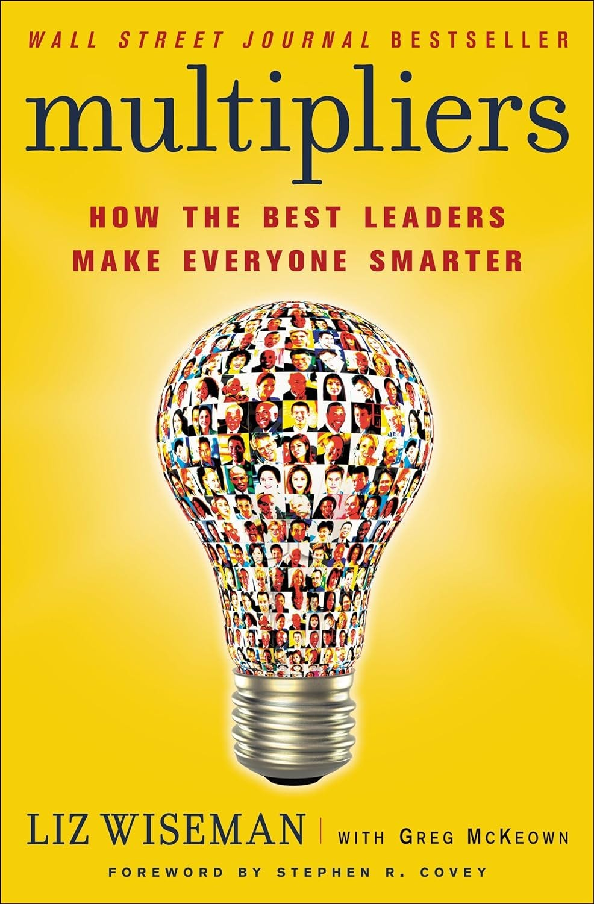
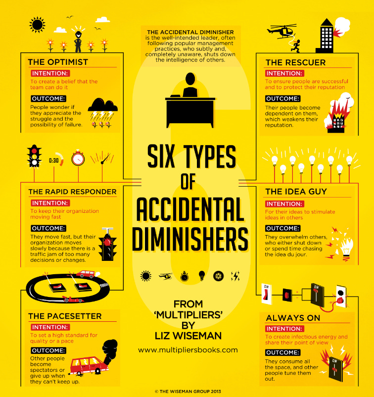

# How to be a multiplier as a leader

In this issue, we will talk about how leaders can get the most out of their teams, inspired by learnings from the book "**[Multipliers: How the Best Leaders Make Everyone Smarter](https://amzn.to/4cxAhs7)**" by [Liz Wiseman](https://thewisemangroup.com/who-we-are/our-team/).

So, let’s dive in.

---

One of my favorite Leadership books is "**[Multipliers: How the Best Leaders Make Everyone Smarter](https://amzn.to/4cxAhs7)**" by [Liz Wiseman](https://thewisemangroup.com/who-we-are/our-team/) and Greg McKeown. This book focuses on how leaders can maximize team potential by multiplying and not diminishing their people.

“Multipliers: How the Best Leaders Make Everyone Smarter,” Liz Wiseman, Greg McKeown

The book's premise is the concept of "Multipliers" versus "Diminishers" leaders.

🔹 **Multipliers** are leaders who use their intelligence to amplify the smarts and capabilities of the people around them. When these leaders walk into a room, light bulbs go on, ideas flow, and problems get solved. They consider people as intelligent and capable of solving problems.

🔸 **Diminishers** are leaders who drain intelligence, energy, and capability from others and always need to be the smartest in the room. They assume even intelligent people need help and exhibit behaviors like empire-building, micro-managing, and being the know-it-all person.

Wiseman's research yielded an [intriguing finding](https://www.huffpost.com/entry/management-skills_b_1416347) in interviews with 150 executives across 35 nations: **leaders categorized as multipliers received twice as much effort from their staff members as those classed as diminishers**. Just 48% of people's "intelligence and capability" were possessed by Diminishers on average.

## Multipliers

There are five types of Multipliers:

1. **The Talent Magnet** - Attracts talented people and uses them to their fullest. Multipliers recognize your assets, draw attention to them, and move aside. Only those who develop empires without using their people are considered diminishers.
2. **The Liberator** - Creates an intense environment that requires people's best thinking. Diminishers are just despots who crush the resistance.
3. **The Challenger**  - Defines opportunities that challenge people to go beyond their knowledge. Diminishers are lone experts who solve problems independently without assistance.
4. **The Debate Maker** - Drives sound decisions through rigorous debate. Diminishers are the only ones who make decisions and exclude others. **This is my favorite!**
5. **The Investor** - Gives others ownership of results and invests in their success. Diminishers are micromanagers who create a unique identity for themselves.

## Diminishers

Even if most leaders don't intend to be diminishers, we need to assess our tendencies to avoid becoming "**accidental diminishers**"—behaviors that could hinder the performance of those around us. Here are a few examples of such behaviors:

- **The Optimist:** This leader focuses on the positive but can downplay challenges and underestimate the intelligence of their team to navigate them. People often wonder if they appreciate the struggle and possibility of failure.
- **The Rapid Responder:** This leader jumps in to solve problems quickly, preventing others from developing their problem-solving skills. They move fast, but the organization moves slowly because of a traffic jam with too many decisions.
- **The Pace-Setter:** This leader sets a high bar and relentlessly pushes the team, potentially causing them to feel overwhelmed and doubt their abilities. This led to the outcome that some people become spectators.
- **The Rescuer:** This leader swoops in to save the day, preventing team members from learning from their mistakes and developing resilience. In such an environment, people become dependent on them, which weakens the organization.
- **The Idea Type:** This leader loves generating ideas but might not involve others, stifling their creativity and sense of ownership. Such behavior usually overwhelms others, who either shut down.
- **Always On:** This leader is constantly connected and expects the same from their team, which can lead to burnout and hinder independent thinking. Team members might experience burnout from feeling pressured to be constantly available.

Six types of Accidental Diminishers (Credits: The Wiseman Group)

## **How can I shift from Diminisher to Multiplier leader?**

Every leader has the opportunity to become a Multiplier rather than a Diminisher. We need to be aware of what we do as multipliers and what we do to diminish our teams. This requires a fundamental shift in leadership style, **moving from a "know-it-all" approach to a "learn-it-all" process**. It's about asking the right questions instead of providing answers (coaching style), fostering healthy debate instead of making autocratic decisions, and giving credit to the team instead of taking it oneself.

**We must seek feedback and understand where we constantly exhibit diminishing behaviors** to ensure we are on the right track**.** We can ask our team to hold us accountable for stopping that behavior, showing vulnerability, and encouraging a psychologically safe environment with this.

The author encourages leaders to conduct a series of practical experiments to pursue Multiplier practices and tackle their vulnerabilities:

- **Speak less**: Leaders should speak less to create space for others to contribute.
- **Ask questions**: Challenge the team with hard questions and allow them to figure out the solutions.
- **Shine a light on others:** Everyone is excellent at something, and you could try experimenting by identifying their good qualities and mentioning them in front of others.
- **Challenge more**: By creating intensity, you can capture people's focus, best efforts, and thoughts.
- **Hold people accountable**: Multipliers should hold their teams accountable because it gives others a sense of agency over their behavior. Also, with this, we believe that our people are intelligent and can rise to the challenge rather than that they can’t possibly figure it out without us.

Note that leaders don't have to be nice. They need to grow talent, challenge them, help them develop, and show them the growth path, even though it won't always be comfortable.

## Bonus: How the Best Leaders Make Everyone Smarter, Liz Wiseman & Greg McKeown (Talks at Google)

---

## More ways I can help you

1. **1:1 Coaching:** [Book a working session with me](https://newsletter.techworld-with-milan.com/p/coaching-services). 1:1 coaching is available for personal and organizational/team growth topics. I help you become a high-performing leader 🚀.
2. **[Promote yourself to 28,000+ subscribers](https://newsletter.techworld-with-milan.com/p/sponsorship-of-tech-world-with-milan)**by sponsoring this newsletter.

---

Thanks for reading Tech World With Milan Newsletter! Subscribe for free to receive new posts and support my work.