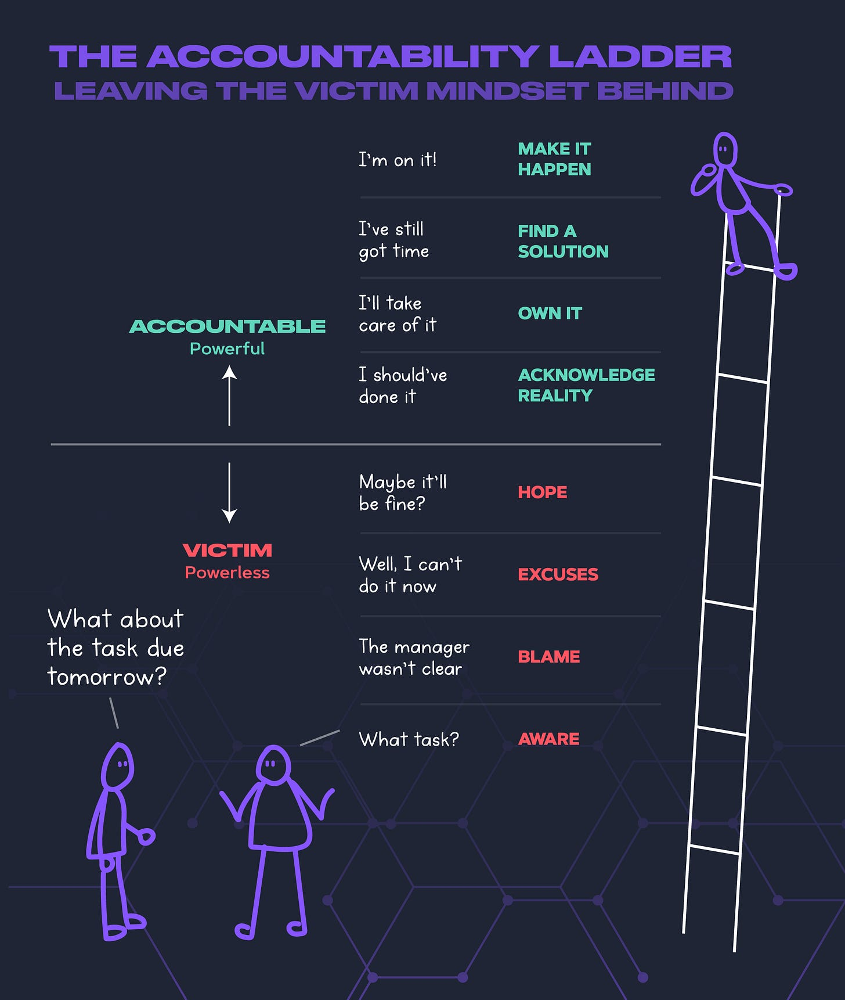
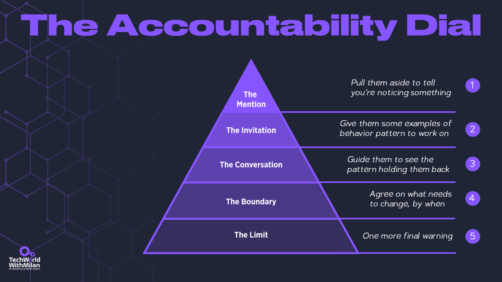

# How to be Accountable?

This week’s issue brings to you the following:

- **How to be accountable**
- **How to hold people accountable**

So, let’s dive in.

---

## How to be accountable?

What differentiates great leaders from others is that they take responsibility for their words, actions, and results. And that is true in bad or good times. Accountability promotes trust, leads to better decision-making, and improves teamwork and collaboration. An accountable leader **takes ownership of their actions and decisions** and is willing to accept the consequences of those decisions. They set clear goals and expectations, take responsibility, and communicate clearly with their team.

Yet, making people accountable is not easy (in Serbian, we don't even have a word for it). We can use **the accountability ladder**, created in 2007 by Bob Gordon, to achieve this. It is a tool that helps leaders to identify their level of accountability, from 1 (the least accountable to 8 (the most accountable):

1. **Unaware**: The individual or organization is unaware of the problem or issue ("I don't know").
2. **Blame others**: The individual or organization recognizes the problem or issue but denies responsibility ("Not my fault").
3. **Make excuses:** The individual or organization accepts responsibility but tries to justify their actions or decisions ("We always done it in this way").
4. **Wait and hope:**The individual or organization apologizes for their actions or decisions but does not take action to correct the problem ("Sorry").
5. **Acknowledge reality:** The individual or organization recognizes the problem or issue, apologizes, and takes steps to correct the problem ("I should have done it").
6. **Own it:** The individual or organization commits to solving the problem or issue and takes action ("I won't do it again").
7. **Find a solution:** The individual or organization commits to solving the problem or issue ("I will do something about it").
8. **Take action:** The individual or organization monitors and improves their actions and decisions to prevent similar problems or issues from occurring in the future ("I'm working on it").

One ability that some people find elusive and challenging to master is accountability. The accountability ladder can then be used to address that. Discussing responsibility with your staff offers you a clear framework to follow and provides them with a concrete example of what being accountable looks like.

> “*Accountability is the glue that ties commitment to the results*.” - Bob Proctor

Being accountable as a professional is one of the **fastest tracks to career improvement**. Being responsible for essential topics in your company/project will enable you to ask for more and be recognized by your superiors.

The Accountability Ladder

Note that **responsibility** and **accountability** are not the same things.

**Responsibility** refers to the duty to complete a task. When you're responsible for something, it's your job to ensure it gets done. This is more about task ownership.****

**Accountability** goes a step further. It's about being answerable for the outcomes. Even if you delegate tasks, you're still accountable for the results.

---

## How do we hold people accountable?

**The Accountability Dial** is a leadership tool that helps managers and leaders hold their team members accountable without micromanagement. Jonathan Raymond, a management coach, developed a step-by-step method for having difficult conversations about performance and behavior in his book “**[Good Authority: How to Become the Leader Your Team Is Waiting For](https://amzn.to/4aVIBkX)**”.

The Accountability Dial consists of five steps:

1. **The Mention**: This is the first step where you pull the team member aside and mention something you've noticed, as close to real-time as possible. You observe with an open mind without assuming why something is happening. This is not a formal meeting but a quick, in-passing statement.

> You'd say, "*Hey Mike, you missed our meeting this morning. Is everything okay?*"
2. **The Invitation:** If the team member hasn't picked up on the thread from the Mention, you give them two to three examples of how this behavior is a pattern or theme they can work on. This is a meeting in a private space and a shift in tone from the Mention.

> You ask questions to gauge their curiosity: "*Mike, I've mentioned your attendance at daily meetings a few times. What is the pattern here?*"
3. **The Conversation:** This is a crucial step in scheduling a meeting to focus entirely on the person. The purpose is to bring home the Mention and the Invitation through impacts. Depending on the team member's actions, this conversation can lead to dramatic personal and professional change or the beginning of the end of their time with your team.

> Here, we express urgency, such as: "*Mike, your absence from important meetings is starting to affect the team. Can we do something about it?*"
4. **The Boundary:** If the team member hasn't made the necessary changes, you need to have a sober and severe conversation that requires them to make a meaningful behavioral change. You need to be transparent that if they can't make the change, they won't be able to continue in their current job.

> You would say: "*If your ability to attend meetings doesn't change, we may have to question your commitment to the role.*"
5. **The Limit:** This is the final step and likely means the end of their time in their current position. This conversation is short and to the point, with no room for discussion or negotiation. Everything that should have been done has been done.

> You would say: "*This is your final warning to improve your meeting attendance*."

The Accountability Dial is a powerful tool for fostering accountability and encouraging growth within a team. Accountability must be done in small, time-consuming acts. We, and all people, want honesty delivered from someone who cares about us.

The Accountability Dial

> *“There was an important job to be done, and Everybody was sure that Somebody would do it.
> 
> Anybody could have done it, but Nobody did it.
> 
> Somebody got angry about that because it was Everybody’s job.
> 
> Everybody thought that Anybody could do it, but Nobody realized that Everybody wouldn’t do it.
> 
> It ended up that Everybody blamed Somebody when Nobody did what Anybody could have done.”*
> 
> - Charles R. Swindoll

---

## More ways I can help you

1. **1:1 Coaching:** [Book a working session with me](https://newsletter.techworld-with-milan.com/p/coaching-services). 1:1 coaching is available for personal and organizational/team growth topics. I help you become a high-performing leader 🚀.
2. **[Promote yourself to 20,000+ subscribers](https://newsletter.techworld-with-milan.com/p/sponsorship-of-tech-world-with-milan)**by sponsoring this newsletter.

---

Thanks for reading Tech World With Milan Newsletter! Subscribe for free to receive new posts and support my work.