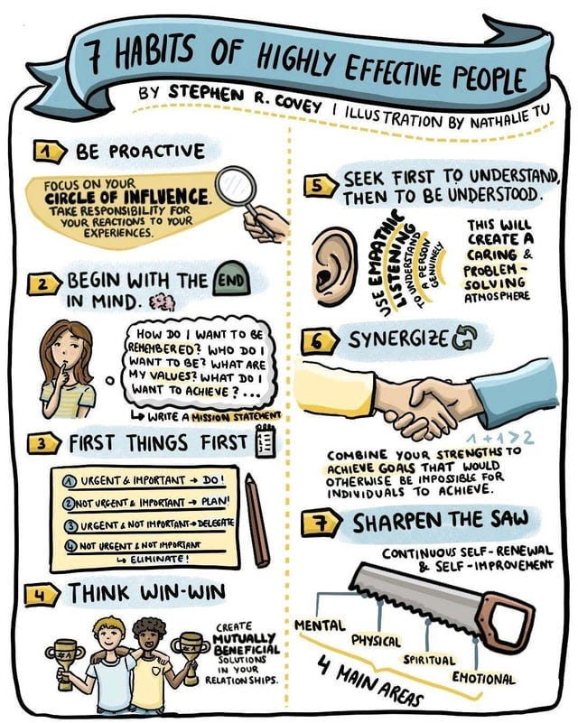
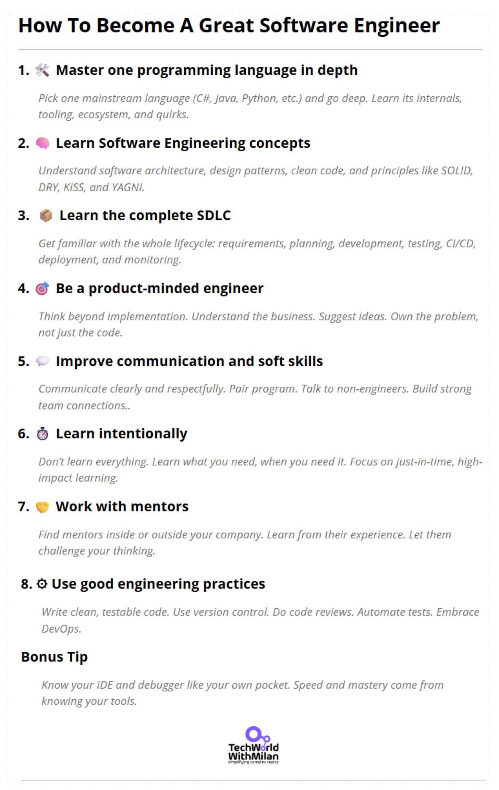

# How to Become a Great Software Engineer

As we all know, being a software engineer takes work. You need to see a lot and constantly improve yourself. Yet, there are many questions and dilemmas, what one should do to become a great one, and what is less critical.

During my 20 years of career in different companies, from startups to large ones with more than 10.000 people, I found what differs between good and great software engineers, and here are recommendations on how to become one:

1. **Master one programming language in-depth**

Take one programming language and go in-depth with it. Learn everything you can and master it. Some good languages you can select today are Python, Java, C#, and Rust.

To be sure which programming languages to learn, check these indexes of popularity:

1. **[PYPL PopularitY of Programming Language Index.](https://pypl.github.io/PYPL.html)**
2. **[TIOBE Index](https://www.tiobe.com/tiobe-index/)**.
3. **[IEEE Spectrum](https://spectrum.ieee.org/top-programming-languages-2022)**.
4. **[Stack Overflow Survey 2023](https://survey.stackoverflow.co/2023/#section-most-popular-technologies-programming-scripting-and-markup-languages)**.
2. **Learn Software Engineering concepts**

When you master a programming language, its syntax, semantics, and constructs, the next thing is to learn different software engineering concepts, such as:

1. Software architecture
2. Software design
3. Algorithms and data structures
4. Design patterns
5. Clean code
6. SOLID, DRY, KISS, and YAGNI principles
7. System Design
8. Data
9. Gitwill
[
Tech World With Milan NewsletterHow to Learn GitIn this issue, we are going to talk about Git, specifically about: How Git works What are some basic Git commands? How to Learn Git Which Git tools exist And as a Bonus, a free Git Cheat Sheet So, let’s start… How Git works Git is a distributed version control tool that facilitates monitoring changes to your code over time. Git makes it simple to track changes…Read more3 years ago · 22 likes · 1 comment · Dr. Milan Milanović](https://newsletter.techworld-with-milan.com/p/how-to-learn-git?utm_source=substack&utm_campaign=post_embed&utm_medium=web)
More on this in the next section.
3. **Learn the complete Software Development LifeCycle (SDLC) process**

Understand the complete software development process, from requirements to deployment. Learn about Agile methodologies, DevOps, and Quality assurance.

And try to work on different projects; on more projects, you work you will learn new stuff and grow.
4. **Be a product-minded engineer**

When working on your project, don't settle just with specs; jump to implement it. Think about other ideas and approach your product manager with them. Try to understand the complete system and how business works. Be an end-to-end product feature owner.
5. **Improve your communication and soft skills**

Be respectful of others, communicate clearly, and be humble. Being kind has no financial cost, but its effects are immeasurable.

Learn to write, learn to present, and speak well. This will make you stand out from the crowd. 

Try pair/mob programming. Talk with people outside engineering, grab a coffee or lunch, or do a hallway chat.
6. **Learn intentionally**

We need to learn, but the trick is when and how. Don't just learn things because this could be more efficient. We need to know intentionally, just before we need it, and this will make the most significant impact.
7. **Work with someone more experienced**

The fastest way to progress in your career is to find a mentor. He can help you find your gaps and show you some new opportunities. A mentor can be found inside an organization or outside (check specialized services, such as [MentorCruise](https://mentorcruise.com/)).

Always try to work with people who you admire and who admire you.
8. **Use good engineering practices**

Learn and follow good practices, such as:

1. Using version control
2. Write your tests correctly (check the test pyramid)
3. Learn how to refactor
4. Learn TDD
5. Code reviews
6. DevOps mindset

Also, learn your IDE and all the essential shortcuts you need. Debugger too.
[
Tech World With Milan NewsletterHigh-Quality Work in Software EngineeringWhen working in software engineering organizations, we try to understand what makes some organizations suitable and what is not. For example, some organizations produce good software, and some do not. We usually need some Agile method, such as Scrum, to use Clean code or even TDD, and we are set to be good. However, things take more work and clarity…Read more3 years ago · 18 likes · Dr. Milan Milanović](https://newsletter.techworld-with-milan.com/p/high-quality-work-in-software-engineering?utm_source=substack&utm_campaign=post_embed&utm_medium=web)
9. **Use productivity techniques**

To be more productive, we need to learn different techniques, such as:

1. Prioritization (check Eisenhower matrix)
2. Time management (check Pomodoro)
3. Concentration (check Deep focus / no distractions)
4. Note-taking (check Notion)

This will help you keep in mind the only important things you need now for the current task. techniques
[
Tech World With Milan NewsletterHow to Be 10x More Productive I was always amazed by top performers. I asked myself what those people do and how they are much better than others. Then I started to research more and talk directly to some of them. I finally managed to get some top performers as my mentors and, in the end, became one of them. I learned that they are not better than others, but they use some technique…Read more3 years ago · 23 likes · 2 comments · Dr. Milan Milanović](https://newsletter.techworld-with-milan.com/p/how-to-be-10x-more-productive?utm_source=substack&utm_campaign=post_embed&utm_medium=web)
10. **Be proactive**

Also, remember to have a can-do attitude and be proactive. —an essential pillar of every great software engineer.

To learn more about it, I recommend the book, “[The 7 Habits of Highly Effective People: Powerful Lessons in Personal Change](https://www.amazon.com/Habits-Highly-Effective-People-Powerful/dp/0743269519)**”.**

7 Habits of highly effective people (Credits: Nathalie Tu)

Ultimately, more is needed, even if we know a lot. What does it take to be a great engineer? It takes time, fails, and experiments. So go and **practice, practice, practice!**

---

## More ways I can help you

1. **[Patreon Community](https://www.patreon.com/techworld_with_milan)**: Join my community of engineers, managers, and software architects. You will get exclusive benefits, including all of my books and templates (worth 100$), early access to my content, insider news, helpful resources and tools, priority support, and the possibility to influence my work.
2. **[Sponsoring this newsletter will promote you to 33,000+ subscribers](https://newsletter.techworld-with-milan.com/p/sponsorship-of-tech-world-with-milan)**. It puts you in front of an audience of many engineering leaders and senior engineers who influence tech decisions and purchases.
3. **1:1 Coaching:** [Book a working session with me](https://newsletter.techworld-with-milan.com/p/coaching-services). 1:1 coaching is available for personal and organizational/team growth topics. I help you become a high-performing leader 🚀.

---

Thanks for reading Tech World With Milan Newsletter! Subscribe for free to receive new posts and support my work.