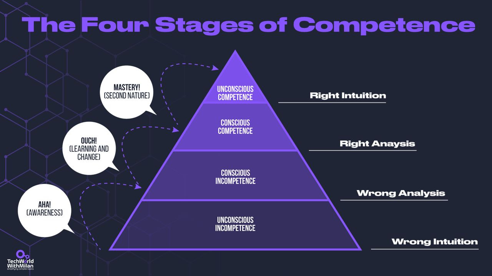
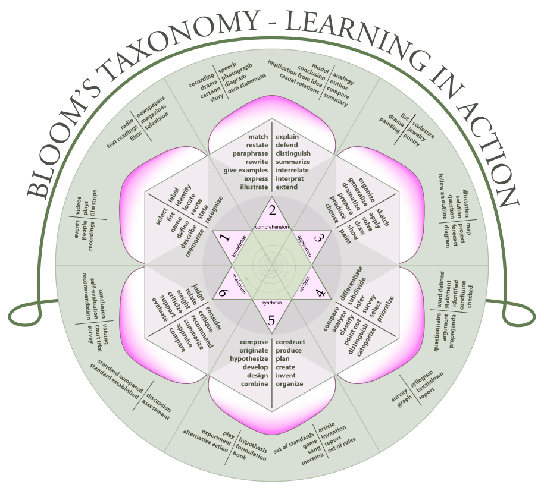
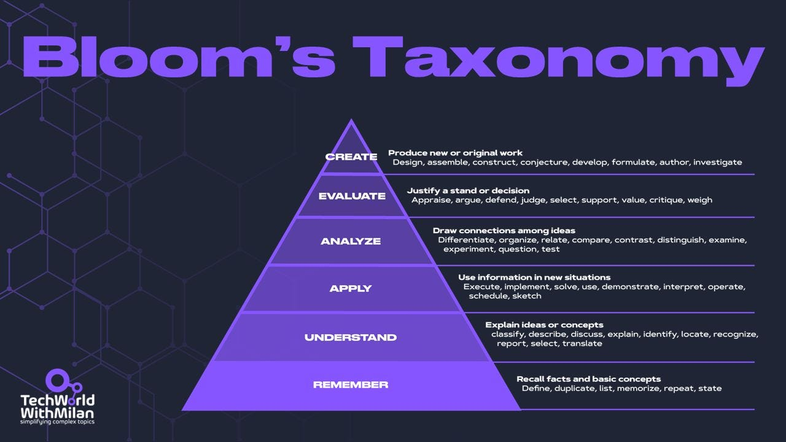

# How to become an expert in anything

Becoming an expert in software engineering or any other field isn't just about combining years of experience or learning the latest frameworks. It’s about navigating a structured journey of skill acquisition and deepening your understanding at every level.

This post delves into two essential frameworks to accelerate your path to expertise: **The 4 Stages of Competence** and **Bloom’s Taxonomy**. The 4 Stages of Competence model illuminates the psychological states we progress through when acquiring a new skill, from ignorance to mastery. Bloom's Taxonomy, on the other hand, provides a hierarchical structure for learning objectives, guiding us from basic recall to complex evaluation and creation.

By understanding these models, you'll gain insights into your learning process and discover strategies to improve your journey from novice to expert in any area of software engineering.

So, let’s dive in.

---

# **4 Stages of Competence**

In the complex world of software engineering, the journey from beginner to expert is challenging. The "4 Stages of Competence" model, created by Noel Burch in the 1970s, is a great framework for understanding this journey. This model describes progressing from incompetence to competence in any skill people go through when learning and mastering a new subject.

Here are the four main   stages:

## Stage 1: Unconscious Incompetence

At this stage, **you don't know what you don't know (unknown unknowns)**. This phenomenon occurs when persons who are bad at a subject have unreasonable confidence in their skills because they are so uninformed about the subject that they are unaware of their poor performance. All they need is the right context to evaluate their abilities. At this level, people tend to have a lot of confidence in themselves, as the [Dunning-Kruger effect](https://newsletter.techworld-with-milan.com/p/how-to-fight-impostor-syndrome) is at its peak, and they think their knowledge of things is good enough. Still, they are unaware that some crucial subjects exist (and usually are hard to grasp).

**👉 For example**, a beginner programmer might not know the importance of version control systems like Git or believe coding is just about writing lines of code.

**➡️ How to progress:** We should ask ourselves, “*What do I need to learn exactly?”*The key to moving past this stage is exposure. Start learning the basics of programming, read about software development practices, and try building simple projects. As you do, you'll realize the depth and breadth of knowledge required in software engineering. **So, just start with the topic!**

## Stage 2: Conscious Incompetence

This is where the real learning begins. At this stage, **you know that you don't know (known unknowns).** You recognize your incompetence and can begin the process of learning. The most important thing here is **identifying what you need to learn to build foundational knowledge**. At this step, you may lose your confidence as you see that there is much to learn, so [Impostor Syndrome](https://newsletter.techworld-with-milan.com/p/how-to-fight-impostor-syndrome) starts to kick in. But, how confident you are is primarily biased because confidence is not the same as knowledge). The most important thing here is to continue in the right direction and**not quit!**

**👉 For example,** after losing some essential code changes or facing difficulty collaborating with a team, the beginner programmer realizes the importance of a version control system but has yet to learn how to use it effectively.

**➡️ How to progress:**Here, we can ask ourselves, *what do I need to learn exactly*, and *how can I do this consistently?* Set specific learning goals, take online courses, contribute to open-source projects, and seek mentorship from more experienced developers. Remember, **every expert was once a beginner.**

## Stage 3: Conscious Competence

The individual has acquired the skill but needs to consciously practice and think about it to perform it well **(know knowns)**. This is the point at which you must reflect carefully about your knowledge and how it should be applied in various contexts. You'll need much mental energy, and the journey will feel slow. However, it indicates that you are familiar enough with the subject to work with it.

**👉 For example**, The programmer has now learned the basics of Git. They can commit changes, create branches, and merge them, but they need to think about each step and might need to refer to documentation or checklists frequently.

**➡️ How to progress:**Here, we can challenge ourselves with the question, *how can I make this effort when doing it?*This is the place where we spend most of our time in life. You can take on challenging projects that push your limits and practice more daily. If you [work consistently on something 1-2 hours daily](https://newsletter.techworld-with-milan.com/i/115140623/how-to-learn-anything-in-hours), you will become very good at it in a few months.

## Stage 4: Unconscious Competence

The skill has become natural to you (**expert level**). They can perform it without thinking about it, like riding a bike.

**👉 For example**, the programmer is now adept at using Git. They can manage complex branching strategies, resolve merge conflicts, and even guide others without considering the steps involved or looking at checklists. This happens at a nearly unconscious level, as you’ve worked enough with Git that your brain unconsciously comes up with the solution.

**➡️ How to progress:**Continuous learning is crucial even at this stage. The only way to get here is to **practice, practice, and practice** your skills until they become natural to you.

The Four Sages of Competence

To move faster between stages, you can use different learning techniques:
[
Tech World With Milan NewsletterHow to Learn Anything EfficientlyThis week’s issue brings to you the following…Read more3 years ago · 58 likes · 3 comments · Dr Milan Milanović](https://newsletter.techworld-with-milan.com/p/how-to-learn-anything-efficiently?utm_source=substack&utm_campaign=post_embed&utm_medium=web)
As you progress through the stages of competence, you encounter **The Expert’s Paradox**, where growing expertise reveals the vastness of what you don’t know. This awareness often triggers impostor syndrome, particularly at the conscious competence stage, where self-doubt and fear of inadequacy prevail despite significant skill. 

To cope with this, **acknowledge that feelings of inadequacy are normal and part of growth**. Regularly reflect on your progress, seek feedback to validate your competence, and mentor others to reinforce your expertise.

Read more about it here:
[
Tech World With Milan NewsletterHow to Fight Impostor Syndrome?The Impostor Syndrome…Read more3 years ago · 41 likes · 1 comment · Dr Milan Milanović](https://newsletter.techworld-with-milan.com/p/how-to-fight-impostor-syndrome?utm_source=substack&utm_campaign=post_embed&utm_medium=web)
## **References:**

1. Burch, N. (1970). **The Four Stages of Learning Any New Skill.** Gordon Training International. This foundational work outlines the four stages of competence: unconscious incompetence, conscious incompetence, conscious competence, and unconscious competence.
2. Broadwell, M. M. (1969). **Management of Training Programs**. New York University. Introduces the four stages of the competence model, termed initially "the four levels of teaching."

---

# How can Bloom’s Taxonomy help you learn software development?

Software development is a complex field that requires a wide range of cognitive skills. By applying **Bloom's Taxonomy**, a framework for adjusting one's progress in learning a new subject, we can create a more structured and effective learning path without relying only on our (usually incorrect) confidence levels. It enables you to climb leaders of this hierarchical model and see past perspectives clearly, which can help you to help others who are stuck on those levels.

It was developed by a group of educators led by **Benjamin Bloom**, an American educational psychologist, and introduced in 1956 in the book *"Taxonomy of Educational Objectives: The Classification of Educational Goals."* Bloom and his colleagues divided learning objectives into three domains: Cognitive (knowledge-based), Affective (emotion-based), and Psychomotor (action-based). The Cognitive domain, which includes the six levels, is the most widely used and is often called "**Bloom's Taxonomy**."

Bloom's taxonomy organized radially (source: [Wikipedia](https://en.wikipedia.org/wiki/Bloom%27s_taxonomy))

The six levels of Bloom's Taxonomy, in order of increasing cognitive complexity, are:

## 1. Remembering

At this level, learners focus on recalling facts, terms, and basic concepts. As a software engineer, you can learn the basics of programming languages, tools, frameworks, libraries, and software development methodologies. You can also memorize critical concepts, terminology, syntax, and best practices.

**👉 For example**, if we want to improve Clean code, you can recall the basic principles of clean code at this level. You might be able to list some key concepts like meaningful variable names, small functions, or the DRY (Don't Repeat Yourself) principle. However, your understanding is limited to memorization without deeper knowledge of all aspects of the Clean Code.

**📌 Tip**: Use flashcards or spaced repetition tools to reinforce your memory of key concepts.

## 2. Understanding

At this level, learners must prove understanding of the material by explaining ideas or concepts in their own words, summarizing, or interpreting information. Develop a deeper understanding of software engineering concepts like algorithms, data structures, design patterns, and architectural styles. If you’re presented with a problem, you should know how to approach it and which direction to take.

**👉 For example**, you now understand the reasons behind clean code practices. You can explain why descriptive variable names are important for readability, how small functions improve maintainability, or how the DRY principle reduces potential bugs. You can interpret clean code guidelines and summarize their benefits but may still struggle to implement them consistently.

**📌 Tip**: Teach the concepts you’ve learned to someone else, or write blog posts explaining them. If you can explain it, you understand it well. [Fenymann technique](https://newsletter.techworld-with-milan.com/i/115140623/how-to-deeply-understand-things) can help here.

Knowing vs Understanding

## 3. Applying

This level involves using knowledge and understanding to solve problems or apply concepts in new situations. Use your knowledge and experience of software engineering principles to develop software applications, solve problems, and implement new features. When you look at the problem, you should know which solution to use, which means you are at this level already.

**👉 For example**, you can implement clean code principles at this stage, such as actively using meaningful variable names, breaking down complex functions into smaller, more manageable ones, and avoiding code duplication. While you may not always choose the optimal solution, you can apply these concepts to new coding problems and improve existing code.

**📌 Tip:** Start with small side projects that allow you to apply new concepts in a real-world scenario. This helps reinforce your learning through practice.

## 4. Analyzing

Analysis involves breaking down complex problems into smaller, more manageable parts. In software development, this means understanding an application's architecture, debugging code, or comparing different algorithms. So, even if we know the problem and solution, we still need to know why. Why is this solution better than the other? Is it the best possible solution? What are the constraints?

**👉 For example**, you can dissect code to identify areas violating clean code principles. You can distinguish between well-crafted and poorly written code, examining how different parts interact and impact overall quality. You might analyze a large function and determine how to break it down effectively or identify unclear code duplication forms.

**📌 Tip:** Regularly perform code reviews and refactor code to improve readability, efficiency, and adherence to best practices.

## 5. Evaluating

At this level, you assess and make judgments about different approaches. You assess the quality, effectiveness, and suitability of software solutions, methodologies, languages, and tools. You also check trade-offs between design decisions, perform a risk analysis, and determine a project's best action.

**👉 For example**, you can critically assess code quality and make good trade-off decisions at this level. You can weigh the benefits of applying a clean code principle against drawbacks like increased complexity or performance impacts. Considering time constraints, team expertise, and long-term maintainability, you might evaluate different refactoring strategies for a legacy code.

**📌 Tip:** Participate in code reviews through open-source contributions or within your team. Critically evaluate both your code and others to improve your decision-making skills.

## 6. Creating

This is the highest level of cognitive skills in Bloom's Taxonomy, where learners are expected to generate new ideas, products, or ways of viewing things by combining or reorganizing existing elements (creation process). Design and implement innovative software solutions, using your knowledge and skills in software engineering to create new products that bring people value.

**👉 For example**, you can now innovate and develop new clean code strategies or patterns at this level. You might create custom linting rules to enforce team-specific clean code standards, design new refactoring techniques for complex legacy systems, or develop teaching materials to help less experienced developers master clean code principles.

**📌 Tip:** At this level, you can design your framework or tool that addresses a specific problem you've encountered in your projects. This will push you to integrate your understanding of various domains and innovate new solutions. Then, share your creations through blogs, talks, or GitHub, inviting feedback that can further refine your work and help you grow as a developer.

Here are some tips on how you can use Bloom's Taxonomy to learn any subject:

**✅ Set clear learning objectives** for yourself or your team that target different cognitive levels.

**✅ Working your way up from the lower levels** is a good strategy. Try to avoid attempting the higher levels before you have mastered the lower levels.

**✅ Encourage collaboration**, self-reflection, and mentorship to support learning and development at all cognitive levels.

✅ As you progress, **put yourself to the test** and climb the levels. Be sure to include more than recalling or comprehending what you studied.

Bloom’s Taxonomy

> ⚠️ **Don’t become an expert begineer**. *An "[expert beginner](https://daedtech.com/how-developers-stop-learning-rise-of-the-expert-beginner/)" has mastered the basics of a field but has stopped learning despite considering themselves an expert. They typically have enough knowledge to solve common problems but lack deeper insights and growth, leading to stagnation.*
> 
> *This often happens when external validation (like job roles or status) reinforces their position, preventing them from realizing their limitations or seeking further improvement. So, continuous learning and feedback loops are important in all phases of a career and growth.*

---

## More ways I can help you

1. **[LinkedIn Content Creator Masterclass ✨](https://www.patreon.com/techworld_with_milan/shop/short-linkedin-content-creator-311232).**In this masterclass, I share my proven strategies for growing your influence on LinkedIn in the Tech space. As one of the top 100 content creators globally, I've expanded my following from 2,000 to over 220,000 in just 6 months and have replicated this success on Twitter. You'll learn how to define your target audience, optimize your profile, master the LinkedIn algorithm, create impactful content using my writing system, utilize essential tools, and create a content strategy that drives impressive results.
2. **[Resume Reality Check"](https://www.patreon.com/techworld_with_milan/shop/resume-reality-check-311008?source=storefront)**[🚀](https://www.patreon.com/techworld_with_milan/shop/resume-reality-check-311008?source=storefront). I can now offer you a new service where I’ll personally review your CV and LinkedIn profile, providing you with instant, honest feedback from a CTO’s perspective. You’ll discover what stands out, what needs improvement, and how recruiters and engineering managers view your resume at first glance. Plus, I’ll share actionable tips to help you shine in the job market and a recommended CV template that effortlessly passes any ATS.
3. **[Patreon Community](https://www.patreon.com/techworld_with_milan)**: Join my community of engineers, managers, and software architects. You will get exclusive benefits, including all of my books and templates (worth 100$), early access to my content, insider news, helpful resources and tools, priority support, and the possibility to influence my work.
4. **[Promote yourself to 34,000+ subscribers](https://newsletter.techworld-with-milan.com/p/sponsorship-of-tech-world-with-milan)**by sponsoring this newsletter. This newsletter puts you in front of an audience with many engineering leaders and senior engineers who influence tech decisions and purchases.
5. **1:1 Coaching:** [Book a working session with me](https://newsletter.techworld-with-milan.com/p/coaching-services). 1:1 coaching is available for personal and organizational/team growth topics. I help you become a high-performing leader 🚀.

---
[https://newsletter.techworld-with-milan.com/p/how-to-become-an-expert-in-anything#poll-203834](https://newsletter.techworld-with-milan.com/p/how-to-become-an-expert-in-anything#poll-203834)Loading...
---

Thanks for reading Tech World With Milan Newsletter! Subscribe for free to receive new posts and support my work.