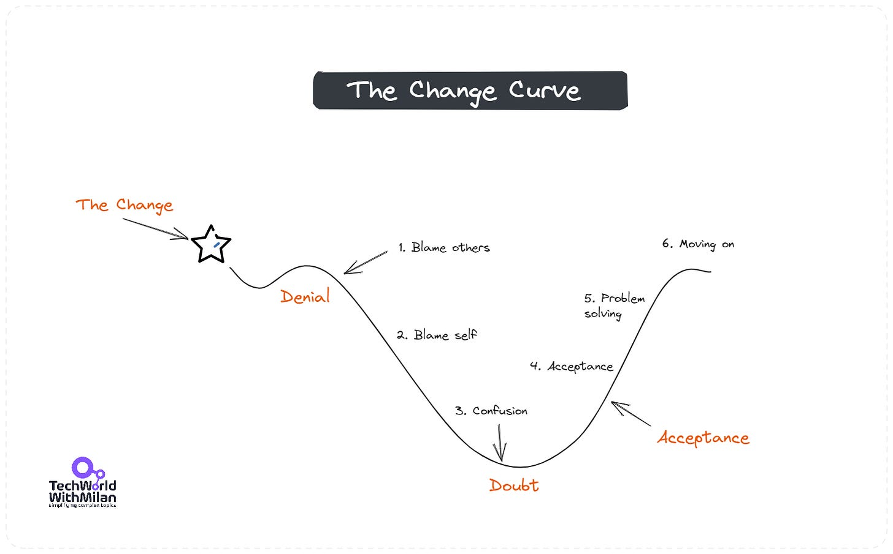
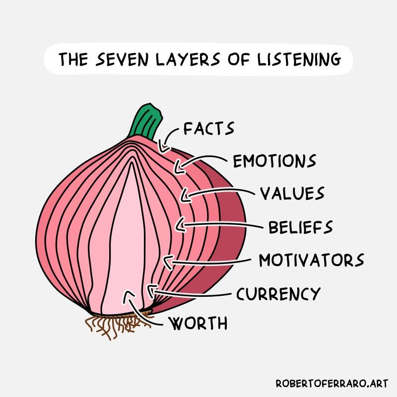
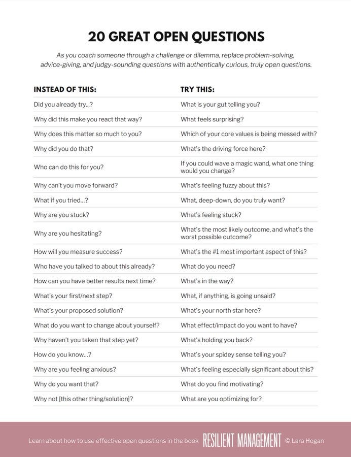

# How to coach people through the Change Curve

Every leader needs two essential skills: **understanding**and **listening to people**. The change curve shows how people react to new situations, while different listening levels help us understand them better and help.

In this post, we'll examine how we can use the change curve to support our people and explore how better listening can improve our understanding of them.

So, let’s dive in.

---

# Coaching people through the Change Curve

**The Change Curve** is a model that describes the typical emotional journey individuals go through when faced with change. Developed by [Elisabeth Kübler-Ross](https://en.wikipedia.org/wiki/Elisabeth_K%C3%BCbler-Ross) in 1969 to represent the stages of grief in terminally ill patients, its principles have been widely applied to understand reactions to change in both personal and organizational contexts.

Understanding the Change Curve can help managers and leaders anticipate how people might react to change, allowing them to provide appropriate support and interventions to ease transitions.

The Change Curve

The stages of the Change Curve are:

1. **Denial**. At this initial stage, people might be in shock or denial about the change. They might believe the change is optional or hope it will disappear.
2. **Self-criticism**. Once the reality of the change starts sinking in, individuals may feel angry or even betrayed. This is especially true if they were not involved in the decision-making process or if the reasons for the change weren't adequately communicated.
3. **Confusion**. At this stage, people might try negotiating or find ways to avoid the change. They might seek compromises or make promises to improve if things revert to how they were. At this stage, individuals often feel overwhelmed, helpless, or saddened by the change. They may become disengaged or demotivated.
4. **Acceptance**. People start to come to terms with the change. They might not be fully on board, but they acknowledge its inevitability and begin to adapt.
5. **Solutions**. As acceptance grows, individuals explore new work methods within the changed environment. They begin to see potential opportunities and solutions.
6. **Commitment**. This is the final stage, where people fully embrace the change, committing themselves to the new direction or state of affairs.

The Change Curve provides a roadmap for organizational changes for leaders and change managers. Recognizing where their team or employees are on the curve allows for better communication strategies, training, and support. For instance, during the early stages of denial and anger, clear and transparent communication about the reasons for the change is crucial.

Leaders should listen to their people, let them vent, keep calm, and not react. They should explain what's going to happen, the business rationale behind the change, and the benefits of the change.

---

# How to listen?

Before we can help people navigate the change curve, we must first listen and understand (this is a rare superpower). This is usually the first step that leaders fail. We tend to listen to reply instead of listening to understand. Active listening is an essential skill of every leader or manager.

> "*The single biggest problem in communication is the illusion that it has taken place*."
> - George Bernard Shaw

👂 There are three levels of listening:

1. **We listen for content**. Here, we notice what is said, such as words, facts, etc.
2. **We listen for structure**. Here, we notice behavior, emotions, etc.
3. **We listen deeply**. Here, we notice the whole picture, including values, beliefs, motivation, etc.

Combining all this, we will connect with people on a deeper level, so they feel like: “Wow, this person understands me, this person values me, I can talk to this person…”.

❔ But, before we can listen, we must know to **ask the right and powerful questions**. Such questions should have a purpose, which usually starts with “*Why would you…?*” Also, we need to know what we want to achieve with our questions, clarify, or continue the conversation.

Ask powerful questions (Credits: Unsplash)

What is most important is to **ask open-ended questions** (which don’t have clear yes/no answers) because those questions give the possibility to the other side to find the correct answer. Some examples of such questions are:

- **What do you want to achieve here?**
- **Why do you think this is happening?**
- **What resources do you need?**
- **Can you tell me more about X?**
- **What else?**
- **What are some areas of improvement?**
- **How can I support you?**

One general advice here is to learn **how to make silence normal**. When you ask a question and get the answer, don’t rush to respond or give an answer. Why? Silence is good because you enable another person to think. If there is no answer within a reasonable time, you can ask for something more.

And remember that **you have two ears and one mouth**. This is not a coincidence!

Think about this before your following conversation.

The seven layers of listening (Credits: Roberto Ferraro)

---

## Bonus: 20 Great Open Questions by [Lara Hogan](https://t.co/VHkCBLKqvN)

---

## More ways I can help you

1. **[Patreon Community](https://www.patreon.com/techworld_with_milan)**: Join my community of engineers, managers, and software architects. You will get exclusive benefits, including all of my books and templates (worth 100$), early access to my content, insider news, helpful resources and tools, priority support, and the possibility to influence my work.
2. **[Promote yourself to 32,000+ subscribers](https://newsletter.techworld-with-milan.com/p/sponsorship-of-tech-world-with-milan)**by sponsoring this newsletter. This newsletter puts you in front of an audience with many engineering leaders and senior engineers who influence tech decisions and purchases.
3. **1:1 Coaching:** [Book a working session with me](https://newsletter.techworld-with-milan.com/p/coaching-services). 1:1 coaching is available for personal and organizational/team growth topics. I help you become a high-performing leader 🚀.

---
[https://newsletter.techworld-with-milan.com/p/how-to-coach-people-through-the-change#poll-196923](https://newsletter.techworld-with-milan.com/p/how-to-coach-people-through-the-change#poll-196923)Loading...
---

Thanks for reading Tech World With Milan Newsletter! Subscribe for free to receive new posts and support my work.