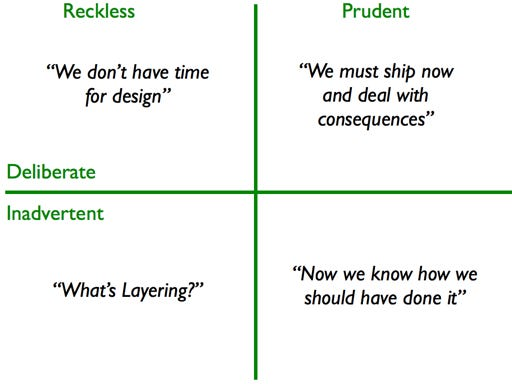
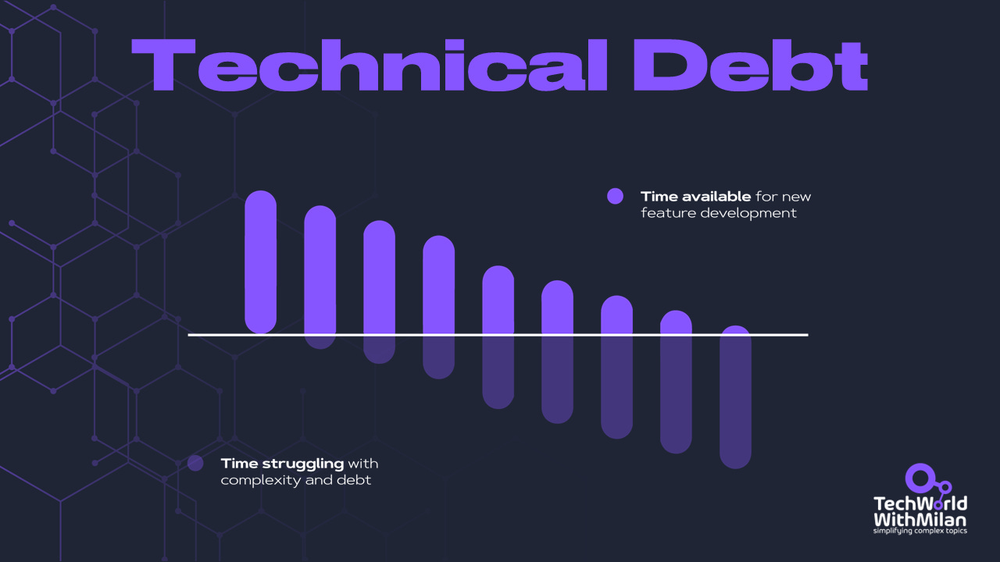
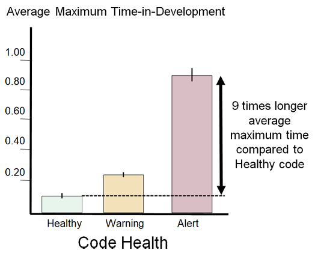
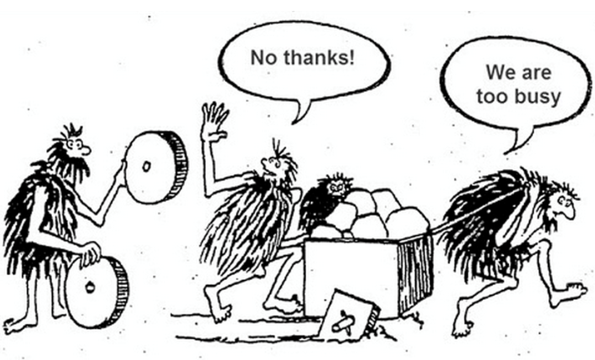
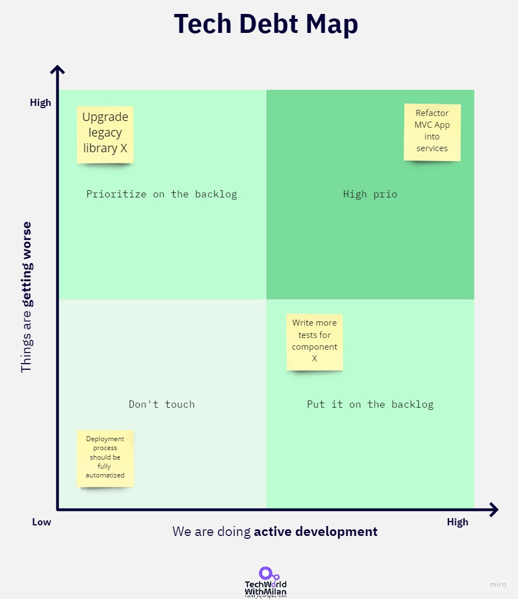
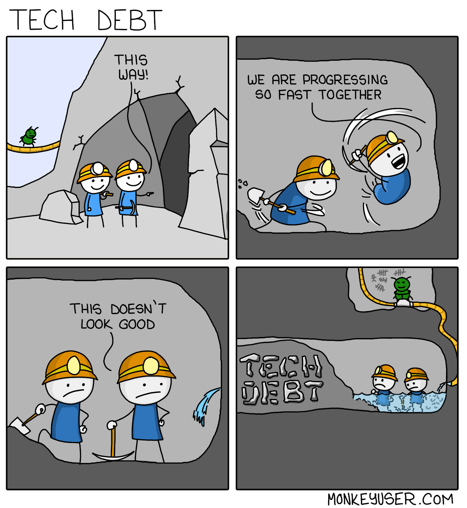
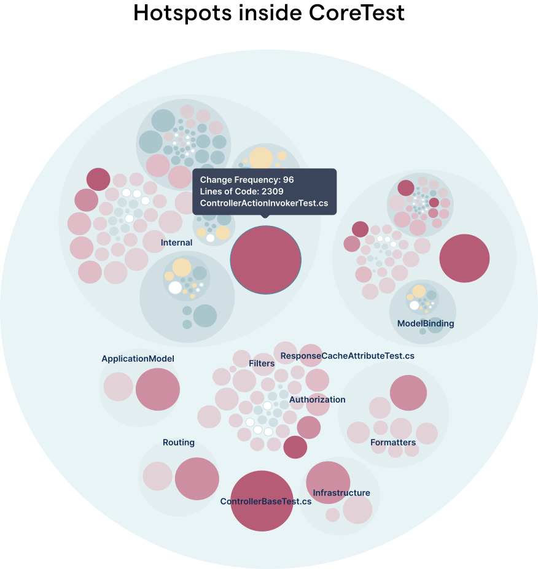
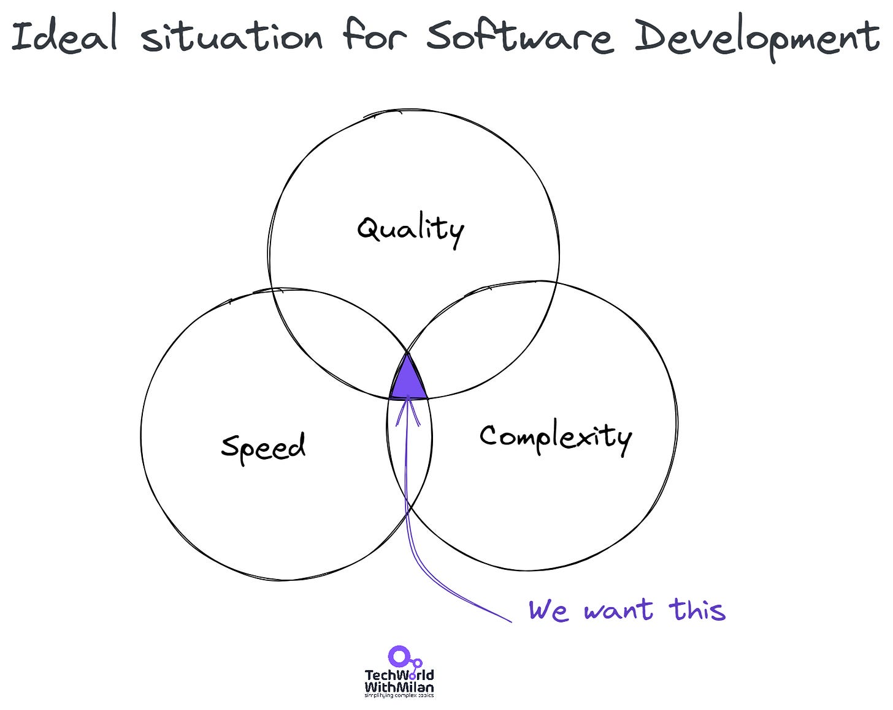

# How to deal with Technical Debt

*...is the answer to why your development is slow!*

Technical debt isn’t just messy code; it’s a latent liability that erodes delivery speed, inflates defect rates, and dulls a team’s competitive edge. Left unchecked, it starves critical features of capacity and forces engineers to trade real innovation for endless firefighting.

Senior engineers and architects carry the mandate to expose, quantify, and systematically retire this debt before it dictates the roadmap. The rest of this guide breaks down the debt landscape, offers hard metrics to measure its weight, and lays out disciplined tactics to convert liabilities into technical wealth.

In this issue, we are going to talk about the following:

1. **What is Technical Debt?** Defines the term, traces its origin, and shows why debt is ultimately a business risk, not just an engineering nuisance.
2. **Types of Technical Debt**. Catalog debt categories (e.g., code quality, testing gaps, coupling, outdated tooling, missing documentation) so teams can target fixes precisely.
3. **How to measure Technical Debt**. Presents actionable metrics, including TDR, complexity scores, defect ratios, coverage, and surveys, that translate vague pain points into complex data.
4. **Strategies to fight Technical Debt**. Details a prioritization workflow, debt mapping, and time-boxed refactoring patterns from “Boy Scout” fixes to dedicated task forces.
5. **A recommended strategy to deal with Technical Debt**. Combines transparency, clear ownership, balanced capacity (10–20 % refactoring), and metric-driven progress tracking into a repeatable playbook.
6. **Tools to track Technical Debt**. Compares general trackers (Jira, spreadsheets) with specialized analyzers like SonarQube and CodeScene, emphasizing integration over tool sprawl.
7. **Keeping Technical Debt low**. Lists preventive practices, sound architecture, ADRs, layered tests, peer reviews, TDD, and continuous delivery, to preserve future velocity.

So, let’s dive in.

## 1. What is Technical Debt?

Technical debt can cause significant frustration and burnout among development teams. Software engineers can be aware of the side effects of technical debt. However, they often need to explain to the product team why quick and easy solutions to coding development are risky.

So, instead of stabilizing the situation, the **business continues to add more features**, and the **technical debt accumulates**. Because of this, we usually say that **technical debt is not a technical problem**. For that reason, every software development team must strive to prevent technical debt from accumulating, so it doesn't result in the worst-case scenario: a project halt.

Ward Cunningham coined the term in 1992 at the OOPSLA conference [1] as a metaphor for developing a software asset. He concluded that the development process leads to new learning, as it depends upon artifacts he coined as technical debt.

Technical debt encompasses**everything that hinders our ability to develop software quickly**. Martin Fowler explains in his **technical debt quadrant** four different pathways that lead to the creation of technical debt [4], but there are more. We can see this, especially with **startup companies** that want to move quickly and don’t prioritize quality initially.

One may **intentionally or unintentionally create technical debt**. Using the Technical Debt Quadrant as an example, Martin Fowler explains:

[Technical Debt Quadrant](https://martinfowler.com/bliki/TechnicalDebtQuadrant.html) [4]

In studies on developer productivity [2], developers are often compelled to introduce new technical debt as **companies prioritize short-term goals over quality, such as introducing new, shiny features**. Yet, Technical Debt not only **impacts** the entire organization but also **affects developers’ happiness, job satisfaction** [3], and **morale**[8].

The main problem with Technical Debt is that **code is an abstract concept**, making it difficult to explain its impact on business and management. Therefore, companies can easily overlook what they don’t see or understand. So, here, we need to be **explicit and visualize our Technical Debt** for the company and management.

Typically, during the development of our software systems, the **capacity available for new features per development cycle decreases**(leading to an increase in lead time) while **complexity builds up**. So, we **spend more time fighting the complexity than developing new features**.

The image below shows how technical debt reduces teams' ability to develop new features.

Over time, the capacity to develop new features decreases

We aim to establish a high-performing organization that will provide us with a competitive advantage, enabling us to be more responsive and innovative. We require a high-quality software development process to accomplish this efficiently.

Technical Debt will occur anyway, yet we need a **strategy** to reduce the creation of new debt while allowing us to reduce existing debt. Investing in this will build **technical wealth** for our company.

## 2. Types of Technical Debt

We usually think that bad code equals Technical Debt, but there’s more to it. There are different types of tech debt:

1. **Code quality** - our code could be clearer to understand. It lacks coding standards, is poorly designed, and is very complex. Additionally, numerous **code comments** explain the functionality of various elements.

Average maximum Time-in-Development for resolving a Jira issue per file [9]
2. **Testing** - we need a proper testing approach (check [the Test Pyramid](https://martinfowler.com/articles/practical-test-pyramid.html)), ranging from unit tests to integration tests to end-to-end (E2E) tests.
3. **Coupling** - between modules that block each other increases the time to deal with such code.
4. **Out-of-date Libraries or Tools** - We are using some legacy libraries or tools that have several issues, such as security vulnerabilities or the inability to update to new technologies and platforms. As developers, we always strive to work with the most up-to-date technologies and efficient tools.
5. **Manual Process** - Some processes in our delivery require automation. There are no automated builds and no CI/CD process in place.
6. **Wrong or no architecture** - we don’t have proper architecture, or it’s just a **big ball of mud**. Our architecture doesn’t reflect what we want to achieve with our system, or it **doesn’t scale well**.
7. **Lack of Documentation** - There is no documentation, or it has not been updated to reflect the system’s current state.
8. **Lack of Knowledge Sharing** - We lack a culture of knowledge sharing, making it difficult for newcomers to get up to speed. We should always document our decisions and specifications during our work.

Additionally, there are more types, including low-value work and issues with monitoring, among others.

Yet, many organizations need more processes and strategies to manage and reduce technical debt, which signifies a **proper engineering culture**.

No time for improvements

## **3. How to Measure Technical Debt?**

When you ask experts how to measure Technical Debt, you will get different answers. Sometimes, it is the opposite. During many years working as a software engineering expert and consultant, I figured out a few practical ways to measure it.

### **Technical Debt Ratio (TDR)**

This compares the cost of fixing technical debt to the original development cost. You can express this in terms of time or money spent. TDR helps get buy-in from business stakeholders by translating technical debt into financial terms.

A ratio of the cost to fix a software system (Remediation Cost) to the cost of developing it (Development Cost). This ratio is called the Technical Debt Ratio (TDR):

**Technical Debt Ratio = (Remediation Cost / Development Cost) x 100%**

We aim to achieve a ratio of 5% or less. If it is higher, the software is in a bad state. This score indicates, in time, how long the engineering team would take to improve their codebase to the desired quality.

> *A ratio between 20% and 50% indicates **significant technical debt**, where remediation costs begin to question the feasibility of continuing without substantial investment in resolving these issues. Projects within this range often require targeted debt reduction strategies to prevent escalation.
> 
> Ratios exceeding 50% often **signal that the cost of fixing the debt is half as much as or even exceeds the initial development cost**. This is typically the threshold at which businesses should seriously consider rewriting or abandoning the project. Yet, before deciding, you need to know a few things, such as the business impact, future-proofing tech, cost-benefit analysis, time to market, etc.*

### **Code Quality Metrics**

Use tools to analyze code complexity, duplication, and violations of coding standards. Metrics like cyclomatic complexity, code churn, depth of inheritance, and lines of code ratio can provide quantitative data on the state of your codebase. Automated tools like SonarQube can analyze code and identify issues like code complexity, potential bugs, and duplication.

### **Defect Ratio and Lead Time**

Track the number of new bugs introduced compared to the number fixed (defect ratio) or the Change Failure Rate in Dora metrics (what percentage of your changes cause a failure). Lead time measures the time to deliver a change. High defect ratios and long lead times can indicate technical debt, resulting in slow and error-prone development. You can create a "tech debt" label for new tickets related to it and use it to measure the technical debt.

### **Code Coverage**

This metric measures the portion of code executed by automated tests. Higher coverage indicates that a more robust codebase is less likely to have hidden technical debt.

### **Surveys**

You can also regularly ask your team members how severe the technical debt in the project is in their view. You can ask them to scale it on a scale of 1 to 10, which doesn't mean much, but if you track it over time, you can see apparent trends.

## 4. Strategies to fight Technical Debt

So, what are some strategies to reduce technical debt? We should all start by prioritizing Technical Debt. First, we must **analyze our development process and codebase to identify bottlenecks** and create a **Technical Debt Map**(as shown in the image below)**.** Then, once we have such a map, we need to review each piece by **identifying the causes**.

Once we have this list, we can review it and assess what happens if we **do nothing** (could it worsen or not), and whether this part of our **system is currently used for new development**and will continue to be used in the future. So when we mark these two things, we can **prioritize** and **keep stuff** with worse tech debt, and we will build on those now and in the future.

Another alternative is to build this map based on the effort and pain involved in fixing issues or using the [RICE Scoring model](https://www.wrike.com/blog/rice-scoring-framework-explained/).

Tech Debt Map

You can also organize a **workshop** or **tech debt retrospective** to build a map. You should also regularly audit debt across all of these categories.

> *Read how [Google measures Technical Debt](https://newsletter.techworld-with-milan.com/i/135566522/defining-measuring-and-managing-technical-debt-at-google).*

## 5. A Recommended Strategy to deal with Technical Debt

One **recommended strategy** to deal with Technical Debt consists of the following steps:

1. We need to be **transparent** about our development, bottlenecks, and why we need to move faster. Then, we need to **summarize this** in a language that allows all stakeholders (engineering and management) to share the same understanding. **Visualizations** help a lot here.
2. Our systems need **clear ownership** and responsibility. Unfortunately, if some parts of our system aren’t functioning correctly, no one notices.
3. We need to prioritize tasks **based on their impact**, as shown on the **Tech Debt Map** above.
4. We must **empower teams** to identify and resolve technical issues in the natural flow of product development. We need a healthy balance between reducing tech debt and adding new functionality with a pragmatic approach. What works well is to continuously invest 10-20% of development time in this area. How you can do this:

1. For **smaller debts** (up to a few hours), do a **refactoring** when you touch it. But, then, let people be [Good Boy Scouts](https://www.oreilly.com/library/view/97-things-every/9780596809515/ch08.html).
2. For **medium debt** (from a day to a few days of work), you can try the following:

1. **Tech Debt Fridays** are working on this exclusively.
2. Mark **tech debt as a feature**, prioritize it, and work on it.
3. For **more significant debt** (from a few weeks to a few months):

1. Take a **fixed time for tech debt.**E.g., take a story and work two days on it.
2. Have a **special task force** (dedicated team) to handle it for some time.
5. Use **metrics**, such as code issues (e.g., using SonarQube) or lead times, to track progress. These metrics can help us make better decisions about addressing technical debt.

## 6. Tools to track Technical Debt

Various tools can track technical debt. However, I recommend always using some existing tools because introducing new ones can be costly. In general, Technical Debt can be followed in the following ways:

1. **Project management tools** include Jira, Asana, GitHub issues, Azure DevOps Board, or more specific tools such as Stepsize, CodeScene,****or **[NDepend](https://www.ndepend.com/)**(for .NET).
2. **Automated code analysis tools—you can use software tools like SonarQube to track and detect code issues, security issues,** or other problems.
3. **Manual tracking method**—here, you can use the most suitable method, such as an Excel table or whatever works for you. It can even be a combination of the above techniques, such as **tracking strategic Technical Debt in Miro**, **tracking tactical Debt in Jira**, and **using metrics from SonarQube**. Just make it accessible and easy to update.

CodeScene for tracking Technical Debt (Credits:  Adam Tornhill/CodeScene)

> 👉 *Learn more about how to use **[CodeScene to deal with Technical Debt](https://newsletter.techworld-with-milan.com/p/how-to-deal-with-technical-debt-in)**.*

## 7. Keeping Technical Debt Low

We want to produce code with **the right speed, quality, and complexity**, not in a quick and dirty way. As software evolves, our systems' architecture becomes increasingly complex, making maintenance more challenging. However, if we started with poor design and code quality, we would be in trouble later.

Our goal is to produce systems that are easy to maintain, allowing us to avoid errors, and that can accommodate issues and further improvements at a low cost. Software architecture and craftsmanship should be appropriately set to achieve this. We want to **balance quality, speed, and complexity**(as shown in the image below).

Yet, the faster we develop new functionalities, the more difficult it is to ensure software quality. Tech debt tends to accumulate, resulting in a slower development process and increased errors. So we want to go slower from the start, which will give **us more speed in the future**.

The ideal situation for software development

The question is how to avoid creating tech debt in the first place. The answer is to have a **high-quality software development process**. Here are some things we can do:

1. **Architect systems** **for the desired outcome**. Involve architects from the start in creating teams by defining their topology [7], because otherwise, Conway’s Law [5][6] will result in our architecture reflecting our organization’s communication channels, rather than the desired architecture.
2. **Write documentation** for all your architectural decisions (ADRs) and technical documentation. Make it easy to find (place it **in the repo** near the code).
3. **Write tests** on all levels of the Testing Pyramid. Aim for 60-80% of code coverage.
4. **Encourage a code review culture**. Involve everyone in code reviews and check for code readability, design, performance, security, testability, and documentation. It is one of the best ways to share knowledge.
5. **Pair Programming** works where one developer writes code while another provides feedback and suggestions. This results in higher code quality; with it implemented, we don’t need code reviews.
6. **Allow developers to refactor**. We should foster a **culture** that allows us to fix technical debt without asking permission, especially if it can be done in a few hours.
7. **Follow codebase standards**, such as design, naming, and architecture. Then, automate this through tools such as linters or your CI/CD process.
8. **TDD (Test-Driven Development)** is a software design process in which each functionality is designed by writing a test and then implementing it correctly.
9. **Write high-quality code**. Educate your developers to have a deep understanding of their programming language and grasp Object-Oriented **(OO) concepts, design patterns, refactoring, clean code principles, architectural patterns and styles, as well as SOLID, YAGNI, KISS, and DRY principles**.
10. **Continuous Delivery**. Code is adjusted in short cycles, so it’s always easy for other team members to verify. This method avoids significant production issues by employing frequent releases and providing fast feedback.

## References

[1] “The WyCash Portfolio Management System.” Ward Cunningham, Addendum to the *Proceedings of OOPSLA 1992*. ACM, 1992.

[2] “[Software Developer Productivity Loss Due to Technical Debt](https://research.chalmers.se/publication/511450/file/511450_Fulltext.pdf), “Besker, T., Martini, A., Bosch, J. (2019).

[3] “[Happiness and the Productivity of Software Engineers](https://www.researchgate.net/publication/332926895_Happiness_and_the_Productivity_of_Software_Engineers),” Daniel Graziotin, Fabian Fagerholm, 2019.

[4] “[Technical Debt Quadrant](https://martinfowler.com/bliki/TechnicalDebtQuadrant.html),” Martin Fowler, 2009.

[5] “Conway’s Law,” https://en.wikipedia.org/wiki/Conway%27s_law.

[6] “Conway’s Law,” https://martinfowler.com/bliki/ConwaysLaw.html.

[7] “[Team Topologies: Organizing Business and Technology Teams for Fast Flow](https://amzn.to/3Jsd7FY),” Matthew Skelton, Manuel Pais, 2019.

[8] “[The influence of Technical Debt on software developer morale](https://www.sciencedirect.com/science/article/abs/pii/S0164121220300674),” Terese Besker, Hadi Ghanbari, Antonio Martini, Jan Bosch, Journal of Systems and Software, Elsevier, 2020.

[9] “[Code Red: The Business Impact of Code Quality– A Quantitative Study of 39 Proprietary Production Codebases](https://arxiv.org/pdf/2203.04374)”, Adam Tornhill, Markus Borg, Conference’17, July 2017, Washington, DC, USA.

---

Thanks for reading Tech World With Milan Newsletter! Subscribe for free to receive new posts and support my work.