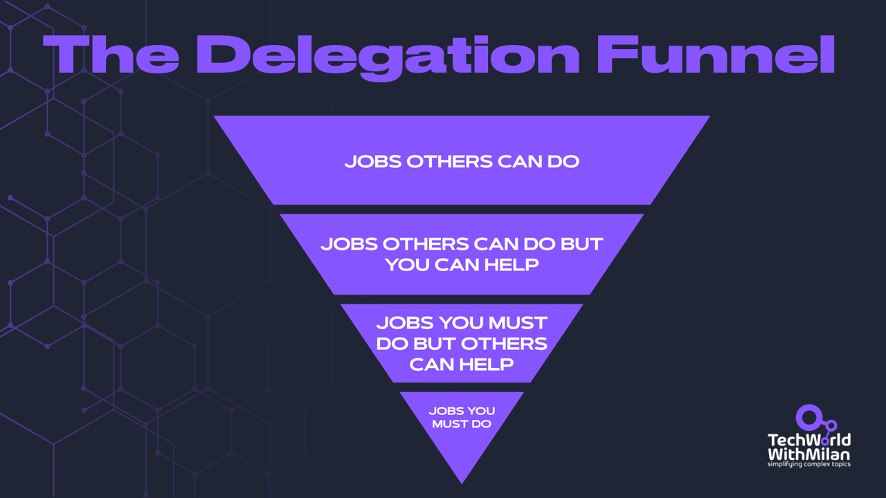
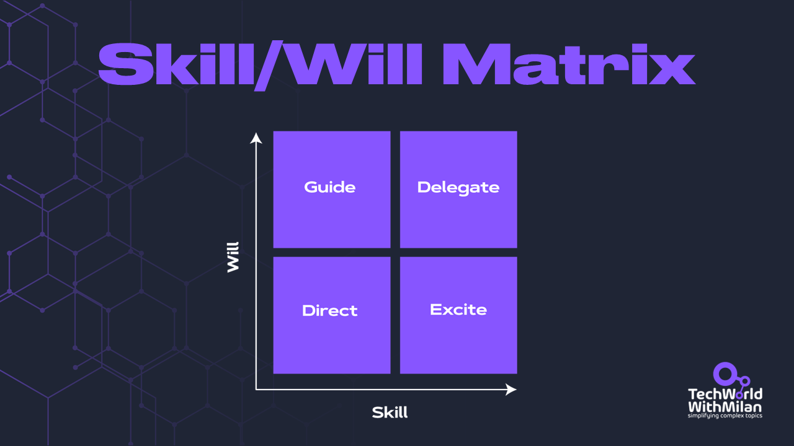

# How to delegate?

*When and why.*

Did you ever feel like your workload keeps piling up, no matter how hard you push through? You're not alone. The key to personal productivity is more straightforward than you think: **effective delegation**. But delegation isn't just about offloading tasks; it's about sharing responsibility, building trust, and growing your team.

This article will explore proper delegation and why it's more than just handing out assignments. We'll dive into common roadblocks that make letting go tough, like thinking, "**I can do it better myself,**" or hesitating to lose control over projects. Plus, we'll introduce practical tools like the **Delegation funnel** and the **Skill/Will Matrix** to help you figure out what to delegate, choose the right people for each task, and adapt your leadership style to match their skills and motivation.

Using these strategies, **you can create an environment where team members grow and take ownership of their work**. This will make you more efficient, boost team morale, and reduce operational risks.

So, let’s dive in.

---

## Why do we need to delegate?

Have you ever wondered what the secret of high achievers and exceptional managers is? It is that they delegate a lot. Delegation is essential as it **allows them to focus on strategic tasks crucial for organizational success and to improve productivity and team growth**. By assigning routine or specialized tasks to team members, managers optimize work, utilize team skills efficiently, and ensure that projects are completed more effectively. They also enable an environment where employees can develop and grow. The benefit of improving operational efficiency and promoting employee growth makes delegation one of the most essential parts of effective leadership and management.

People usually think that assigning a task to someone is delegation, but it is not. You must also**delegate results and decision-making,** which means [accountability](https://newsletter.techworld-with-milan.com/p/how-to-be-accountable) and [autonomy](https://newsletter.techworld-with-milan.com/i/115003073/how-would-you-like-to-motivate-your-team). Then, wait for the results. You will get them, but not in the way you would do it because you need to think about all possible approaches.

Another tricky issue is what to delegate and what not; there is no easy answer. Some **things keep us from delegating**, such as:

- The belief we can do it better
- Difficulty in letting go of control over a task or project.
- The belief is that it will take more time to explain the task than to do it ourselves.
- Concern that delegating might be perceived as neglecting responsibilities.

Yet, if we don't delegate, we can be overwhelmed with work. This can also impact team members' morale by limiting them to acquire new skills and responsibilities. Furthermore, the organization may encounter operational risks by creating single points of failure as we block decisions.

## How to delegate efficiently?

How do we start with delegation? We begin by **trusting our team**. When you say to someone, “*You can do it*,” you empower them to achieve more and even things they thought they were incapable of doing.

To delegate efficiently, you can use a **delegation funnel**. This tool helps managers understand how to delegate tasks effectively by visualizing the gradual transfer of responsibility to team members. It means **you should only do what you’re uniquely able to do better than others and delegate all other stuff**. In other words, think about what you cannot delegate, i.e., what your direct reports need more knowledge or experience. For all other things, you trust and explain what success looks like.

So, a **delegation of one task** could look like the following:

1. **📝 List of all tasks.**Begin by jotting down all the tasks and responsibilities you currently handle. This comprehensive list will be the starting point for applying the delegation funnel.
2. **📤 Apply the delegation funnel to the task**

1. Is this task essential for me to do personally?

- *If yes*, keep it on your plate.
- *If no*, proceed to the next question.
2. Does this task contribute to my core objectives or require my unique expertise?

- *If yes*, consider keeping it.
- *If not*, it's a candidate for delegation.
3. Can someone else perform this task with proper guidance?

- *If yes*, consider delegating.
- *If not*, you may need to retain it or provide training.
4. Will delegating this task benefit a team member's development?

- *If yes*, it's an excellent opportunity to delegate.
5. Is the task recurring or routine?

- *If yes*, delegating can save you time in the long run.
3. **📌 Prioritize a task to delegate**. Delegate tasks that need immediate attention but don't require your direct involvement. If your team is new to delegation, start with less complex tasks. You can use the [Eisenhower matrix](https://newsletter.techworld-with-milan.com/i/115140651/prioritize-tasks-by-using-the-eisenhower-matrix) for prioritization and [other techniques](https://www.patreon.com/techworld_with_milan/shop/how-to-set-priorities-e-book-312292?utm_medium=clipboard_copy&utm_source=copyLink&utm_campaign=productshare_creator&utm_content=join_link).
4. **👥 Select the right person**. Consider the skill/will matrix (check the next section), workload, or development goals when choosing a team member.
5. **🎯 Delegate outcomes, not tasks**. Communicate clearly about desired outcomes, such as success and deadlines, and specify any standards or guidelines that must be followed. We can establish checkpoints for progress by holding regular check-ins to review progress. Also, be sure to give employees responsibility for decisions they must make (**[delegate decision-making](https://hbr.org/2024/09/research-how-to-delegate-decision-making-strategically)**); otherwise, they could consider it unfair.
6. **🤝 Establish proper support and monitoring**. Offer assistance as needed, but allow them space to work independently. Also, don’t forget to give constructive feedback during the process to keep them on track.
7. **🌱 Cultivate a culture of [accountability](https://newsletter.techworld-with-milan.com/p/how-to-be-accountable) in your organization**. Communicate expectations and enable team members to take ownership of their tasks.

Delegation enables us to adopt the **[Servant Leadership model](https://newsletter.techworld-with-milan.com/i/136186554/why-should-you-be-a-servant-leader)**, in which our subordinates are empowered to make decisions and do work without being blocked by waiting for decisions. This approach allows individuals to develop their skills and contributes to a collaborative environment where everyone's contributions are valued.

Of course, **regular check-ins** and controls should be established to get quick updates about the tasks.

The delegation funnel

> Other **delegation models exist**, such as the Situational Leadership Model, the RACI Model (Responsible, Accountable, Consulted, Informed), the Five Degrees of Delegation, the GROW Model (Goal, Reality, Options, Way Forward), and more.

## When to delegate?

One model for delegation is assigning tasks by matching them with skills and motivation. For this, we can use **the Skill/Will Matrix**. It is a tool for determining the best approach to managing and developing team members based on their skills and willingness. Leaders and managers should decide on the most effective leadership style to use with their team members, considering their current level of competence and motivation.

**The Skill/Will Matrix** (also known as the Ability/Willingness Matrix) is a leadership tool used to assess team members based on two key dimensions:

1. **🛠️ Skill** - Their ability/competence to perform a task
2. **🔥 Will** - Their motivation/confidence to complete the task

This creates four quadrants that help managers determine the most appropriate leadership style:

1. **💪 High Skill/High Will**: These employees need little supervision - delegate and empower
2. **😕 High Skill/Low Will**: These employees need motivation and encouragement
3. **🔥 Low Skill/High Will**: These employees need direction and training
4. **🌱 Low Skill/Low Will**: These employees need close supervision and coaching

How can we use this matrix:

1. **🔍 Identify skill and will levels.** Assess the team members' capability, knowledge, and expertise, as well as their motivation and confidence to ask. Based on their skill and will levels, place each team member in one of the quadrants.
2. **🏆 Determine the appropriate Leadership style.**

1. **Direct** (Low Skill/Low Will): Provide clear instructions and supervise.
2. **Guide** (Low Skill/High Will): Offer support and encouragement while building skills.
3. **Delegate** (High Skill/High Will): Give responsibility and trust them to perform.
4. **Excite** (High Skill/Low Will): Motivate and create interest to re-engage them.
3. **📝 Develop an action plan.** Based on the quadrant in which team members are placed, create individualized development, coaching, or mentoring plans.
4. **🔄 Watch and adjust**. Review team members' skills and will levels, and adapt your leadership style.
5. **💬 Provide regular feedback.** Ensure team members know their position on the matrix and provide continuous feedback and recognition to keep them motivated and informed about their progress.

Let’s take three examples of how to use this matrix:

- **🚀 High Skill/High Will**. Let’s say we have a Senior Developer experienced with the code base and tech stack who is excited about working on a new feature. This is a **high-skill/will situation**; the best management style here is **delegating and trusting (full autonomy)**. We can say, “*Here's the new feature requirement. Feel free to make technical decisions and implement them your way. Let's sync up in our weekly meetings for updates.*“
- **👩‍🏫 Low Skill/High Will**. We have a Junior developer who is **low on skill but eager to contribute and learn**. Our approach should be to **guide and teach**. We could say, “*Let's work together on this feature. I'll help you understand our codebase, and you can start implementing the basics. We'll have daily short check-ins to address any questions.*“
- **🧑‍💼 High Skill/Low Will**. If we have someone, let’s say, a senior developer who is excellent at coding abilities and has good technical knowledge but is already **burned out from recent projects** and **shows less enthusiasm** to take on new challenges. Here, we can go with **regular check-ins** focusing on his concerns, connect the work to his career goals, and perhaps offer new challenges or learning opportunities. For example, we can offer something like this: "*Mike, would you be interested in exploring this new caching solution for our service? It could be a great addition to your expertise in performance optimization.*"

## Bonus: The Full Skill/Will Matrix Infographics

---

## More ways I can help you

1. **[LinkedIn Content Creator Masterclass](https://www.patreon.com/techworld_with_milan/shop/short-linkedin-content-creator-311232?utm_medium=clipboard_copy&utm_source=copyLink&utm_campaign=productshare_creator&utm_content=join_link).**In this masterclass, I share my strategies for growing your influence on LinkedIn in the Tech space. You'll learn how to define your target audience, master the LinkedIn algorithm, create impactful content using my writing system, and create a content strategy that drives impressive results.
2. **[Resume Reality Check"](https://www.patreon.com/techworld_with_milan/shop/resume-reality-check-311008?source=storefront)**. I can now offer you a new service where I’ll review your CV and LinkedIn profile, providing instant, honest feedback from a CTO’s perspective. You’ll discover what stands out, what needs improvement, and how recruiters and engineering managers view your resume at first glance.
3. **[Promote yourself to 36,000+ subscribers](https://newsletter.techworld-with-milan.com/p/sponsorship-of-tech-world-with-milan)**by sponsoring this newsletter. This newsletter puts you in front of an audience with many engineering leaders and senior engineers who influence tech decisions and purchases.
4. **[Join my Patreon community](https://www.patreon.com/techworld_with_milan)**: This is your way of supporting me, saying “thanks, " and getting more benefits. You will get exclusive benefits, including all of my books and templates on Design Patterns, Setting priorities, and more, worth $100, early access to my content, insider news, helpful resources and tools, priority support, and the possibility to influence my work.
5. **1:1 Coaching:** [Book a working session with me](https://newsletter.techworld-with-milan.com/p/coaching-services). 1:1 coaching is available for personal and organizational/team growth topics. I help you become a high-performing leader and engineer 🚀.

---

Thanks for reading Tech World With Milan Newsletter! Subscribe for free to receive new posts and support my work.