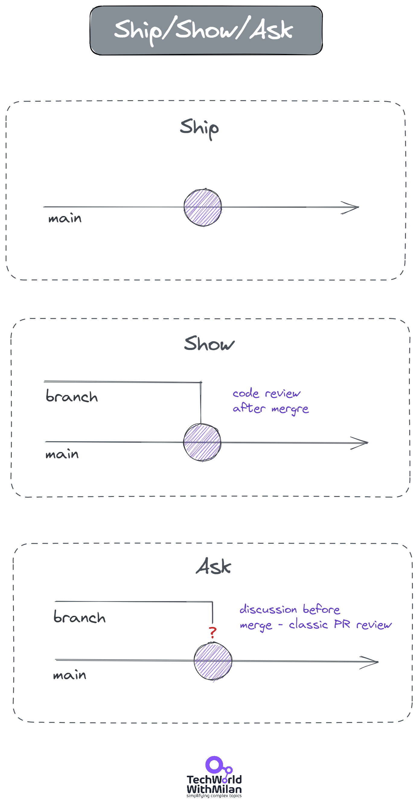

# How To Do Code Reviews Properly

*To improve your software quality process and developer happiness*

## Why Do We Need to Do Code Reviews?

An essential step in the software development lifecycle is code review. It enables developers to enhance code quality significantly. It resembles the authoring of a book. First, the author writes the story, which is edited to ensure no mistakes like mixing up "you're" with "yours." Code review, in this context, refers to examining and assessing other people's code. It is based on **the Pull request model**, popularized by open source.

A code review has different benefits:

- It **ensures consistency in design** and implementation,
- **Optimizes code for better performance**,
- It is an **opportunity to learn**,
- **Knowledge sharing** and mentoring, and
- **Promotes team cohesion**.

## What To Check In Code Reviews?

What should you look for in a code review? There are different things that we could check, from the different **levels of importance** and **possibility of automation**:

Try to look for things such as:

1. **Functionality & Design**- Here, we need to find the answer to questions such as: does this change follow our desired architecture, or does it integrate well with the rest of the system? Does it have high cohesion and low coupling between components? Does it follow sound principles like OO, SOLID, DRY, KISS, YAGNI, and more?
2. **Implementation** - Here, we check if the solution is logically correct (it does change what the developer intended), if this code is more complex than it should be, etc. **Is the code needed?** We also check whether we use good design patterns. And the critical stuff, such as **API entry point**.
3. **Testing** - Here, we check whether all tests pass, do we use unit tests for all code paths and behaviors, and integration tests for ext. systems (DBs, file system, etc.). Do we check all edge conditions and code coverage from 60-80%?
4. **Documentation**- Is our PR description added? Is our solution documented in the README.md in the repo or elsewhere updated?
5. **Code Styles**- Do we follow our project code styles? Do you know if naming is good? Did the developer choose exact names for classes, methods, etc.? Is the code readable?

Code Review Pyramid (based on [the original work](https://www.morling.dev/blog/the-code-review-pyramid/) of Gunnar Morling)

## Some Good Practices When Doing a Code Review

Here are some good practices when doing a code review:

1. **Try to review your code first.**

Before sending a code to your colleagues, try to read and understand it first. Search for parts that confuse you. Seeing your code outside an IDE often helps to view it as something "new" and **avoid operational blindness**.
2. **Write a short description of what has changed.**

This should explain what changes were at a high level and why those changes were made.
3. **Automate what can be automated.**

Leave everything that can be automated to the system, such as checking for successful builds (CI), style changes (linters), automated tests, and static code analysis (e.g., with [SonarQube](https://www.sonarsource.com/products/sonarqube/)). We have integrated it **on the PR level**, so it will run on every PR and give blockers for code merge. This will enable us to remove **unnecessary discussions** and leave room for more important ones.
4. **Do a kick-off for more significant stories with your team members.**

If you are starting to work on something more significant, especially design-wise, try first to **do a kick-off with the code owner** or someone who will be your code reviewer. This will enable an agreement before the implementation and reduce the effort on the PR review level with no surprises.
5. **Don’t rush**

You need to understand what has changed—every line of it. Read multiple times if required, class by class. One should look at **every line of code** that is assigned for review. Some codes need more thought and some less, but it's a decision we must make during a review. Make yourself available for verbal discussion if you need to. Yet, try to make it under one hour. Everything more than this is not effective.
6. **Don’t sit with the author**

Try not to review the code with the author if you’re not working in a pairing mode (check the last section, “Better alternatives to code review”). Why? Because the author can influence the reviewer.
7. **Comment with kindness**

Never mention the person (you), always focus on changes as questions or suggestions, and leave at least one positive comment. Explain the "why" in your words and advise on how to improve it.
8. **Approve PR when it’s good enough.**

Don't strive for perfection, but hold to high standards. Don't be a nitpicker.
9. **Make reviews manageable in size.**

We should limit the number of lines of code for review in one sitting. PR should contain **as few changed files as possible**. I prefer more minor incremental changes to significant sweeping changes. Our brains cannot process so much information at once. The **ideal number of LOC is 200 to 400 lines** of the core at one time, usually 60 to 90 minutes.  If you have an enormous task, refine it into smaller sub-tasks that can be quickly reviewed.
[
I Am Devloper@iamdevloper10 lines of code = 10 issues.

500 lines of code = "looks fine."

Code reviews.9:58 AM · Nov 5, 2013
---
7.99K Reposts · 6.67K Likes](https://twitter.com/iamdevloper/status/397664295875805184)
10. **Use checklists**

Another thing you can do here is to have a **[checklist](https://github.com/mgreiler/code-review-checklist)**, which can be used to go through all aspects of a code review before adding reviewers. We use **[pull request templates](https://learn.microsoft.com/en-us/azure/devops/repos/git/pull-request-templates?view=azure-devops)** in Markdown on Azure DevOps, which are applied to the description field when a pull request is created. E.g.

`Thank you for your contribution to this repo. Before submitting this PR, please make sure the: 

- [ ] Your code builds clean without any errors or warnings 
- [ ] You are using the appropriate design
- [ ] You have added unit tests and are all green`

These templates could be different for a branch or can be optional, too.
11. **Use tools**

For all code reviews, you should use some **tools**, such as **BitBucket, Azure DevOps, GitHub, or GitLab**. For example, **Microsoft** has used an internal tool called **CodeFlow** for years, which supports developers and guides them through all code review steps. It helps during the preparation of the code, automatically notifies reviewers, and has a rich commenting and discussion functionality. In the later years, they switched to GitHub Pull Requests. **Google**is also using two kinds of solutions for code reviews. They use the **[Gerrit code review tool](https://www.gerritcodereview.com/)** for open-source code, yet they use an internal tool called Critique for internal code.

## **How To Enable Continuous Integration with Pull Requests?**

With Pull Requests, we lost the ability to have a proper continuous integration process in a way that **delayed integration due to code reviews**. So here comes a **“Ship/Show/Ask” branching strategy**. The thing is that **not all pull requests need code reviews**.

So, whenever we make a change, we have three options:

- **Ship**- Small changes that don’t need people’s review can be pushed directly to the main branch. We have some build pipelines running on the main brunch, which run tests and other checks, so it is a safety net for our changes. **Some examples are** fixing a typo, increasing the minor dependency version, and updating documentation.
- **Show**- Here, we want to show what has been done. When you have a branch, you open a Pull Request and merge it without a review. Yet, you still want people to be notified of the change (to review it later), but don’t expect essential discussions. **Some examples are** local refactoring, fixing a bug, and adding a test case.
- **Ask**- Here, we make our changes and open a Pull Request while waiting for feedback. We do this because we want a proper review in case we need clarification on our approach. **This is a classical way of making Pull Requests. Examples include** Adding a new feature, major refactoring, and proof of concept.

Ship / Show / Ask branching strategy

## A Better Alternative To Code Reviews

There is another alternative to classic PR reviews that could help you gain more efficiency and speed in your coding process. It is based on a model other than Pull Request, called **Trunk-based development**. Here, you synchronously have code reviews. In this way, all developers work on the mainline branch, **frequently committing to it**. An example of such practice is a **Collaborative programming** approach (Pair and Mob programming), introduced as an **Extreme Programming** technique by Kent Beck in the ‘90s.

**Pair programming and mob programming** are collaborative programming approaches that involve two or more developers working together on a single task, sharing ideas and thoughts while writing code. Here, one developer acts as a **driver** (writes code), while the other plays a **navigator** role (ensures the code accuracy). They **switch** **positions** from time to time during the process.

These methods offer **several benefits** compared to classic code reviews:

- **Real-time feedback**: Pair and mob programming allow developers to receive immediate feedback on their code, enabling them to address issues and improve. This contrasts with classic code reviews, where feedback might be delayed until the code review stage.
- **Enhanced knowledge sharing**: Collaborative programming enables developers to learn from each other's experience and knowledge, leading to better code and skill development. This is particularly helpful when working with new technologies or for newbies. Also, learning is **more easily spread among team members**, reducing the risk of a single developer becoming a bottleneck.
- **Faster problem-solving** encourages developers to work together to solve problems, leading to quicker and more efficient solutions. This can help to reduce development time and improve project outcomes.
- **Increased focus and productivity**: Working closely with another developer can help to maintain focus and reduce distractions.
- **Improved code quality:** When multiple developers work together, they are more likely to catch errors and design issues early in development.

This approach **works best when you have a co-located team of mostly senior developers who must iterate fast**. However, the Pull Request Model works better if you have a team of juniors or have a more complex product where more than one person needs to review the code.

---

Thanks for reading Tech World With Milan Newsletter! Subscribe for free to receive new posts and support my work.