# How to do code reviews with AI tools

Writing code has never been easier, but delivering great software is now more complex than ever. AI tools have pushed our productivity to new levels, allowing developers to write code much faster, teams to ship more features, and delivery to increase.

Yet, beneath this shiny productivity spike, a deeper problem began to emerge: Technical Debt started to rise, as quality and maintainability had quietly become the bottleneck.

Leading engineering teams through the AI-driven shift, I've seen firsthand how easily developers can be overwhelmed by the volume of auto-generated code while vibecoding. Reviewing code thoroughly, spotting bugs, and ensuring architectural rules now set traditional review processes to their limits.

The old ways: manual, detail-oriented reviews by overloaded engineers, which can no longer scale. However, the same AI revolution that has driven our productivity boost also offers tools that can enable efficient code reviews entirely.

In this article, I’ll share how we can leverage AI not only to write more code but to ensure it’s the correct code: cleaner, simpler, and aligned with long-term technical goals.

In this article, we will talk about:

1. **How are we writing software in the age of AI.**AI-driven code generation has dramatically increased developer output. Here, we will examine the current state of AI-assisted coding and how teams are integrating these tools into their everyday workflows.
2. **What is lacking in the current approach**.****As we can see, more code does not necessarily equal better code. We'll examine new challenges, like code duplication, increased churn, and lost architectural clarity, that emerge from AI-assisted development.
3. **How AI tools can improve code reviews**. AI isn't only useful for generating code; it can help during code reviews. I’ll show how teams can automate routine checks, catch common pitfalls early, and free human reviewers to focus on what matters most.
4. **AI code reviews case study**. We will discuss how a new range ot tools, such as CodeRabbit, can improve the situation with a large amount of generated code.
5. **What will be possible?** Looking ahead, AI-powered reviews could fundamentally transform how software development is conducted.
6. **Conclusion.**Here we wrap up with actionable steps for engineering leaders and developers to integrate AI-assisted code reviews effectively, and leave you with reflections on how your team can best adapt to these changes.

So, let’s dive in.

> **Disclaimer***: The article is written in a cooperation with [CodeRabbit](https://coderabbit.link/milan).*

---

## 1. How are we writing software in the age of AI?

The way we write code has changed so fundamentally in the last two years that most teams are still playing catch-up. AI-powered coding tools such as Cursor, Windsurf, Lovable, and GitHub Copilot have accelerated code generation. New pull requests arrive at a rate that would have been unimaginable just a few years ago.

When we examine the numbers,**82% of developers use AI coding tools daily** or weekly ([2025 State of AI code quality](https://www.qodo.ai/reports/state-of-ai-code-quality/)), with 41% of all code now generated by AI. [Google reports that 25% of its new code comes from AI assistance](https://blog.google/inside-google/message-ceo/alphabet-earnings-q3-2024/#search), while [Microsoft's internal AI review system handles over 600,000 pull requests per month](https://devblogs.microsoft.com/engineering-at-microsoft/enhancing-code-quality-at-scale-with-ai-powered-code-reviews/).

This shift happened faster than anyone anticipated. Where developers once carefully crafted each function, **they now prompt, review, and refine**. The old bottleneck, typing speed (remember when we practiced this, right?), vanished overnight. The new bottleneck emerged in an unexpected place:**understanding what the AI produced.**

This explosion in AI-generated code has made **code cheap to create**. Yet, we often forget that **the code is a liability, not an asset**, and the less code we have, the better.

What we can see is that teams report spending **60% of review time building context** for AI-generated code, 10% verifying accuracy due to hallucinations, and only 20% on the review itself.

This inversion of effort signals that something fundamental has broken in our development process. **We optimized for speed but compromised on quality.**

The adoption of AI coding tools is shown in the image below (from the [2025 State of AI code quality](https://www.qodo.ai/reports/state-of-ai-code-quality/)).

[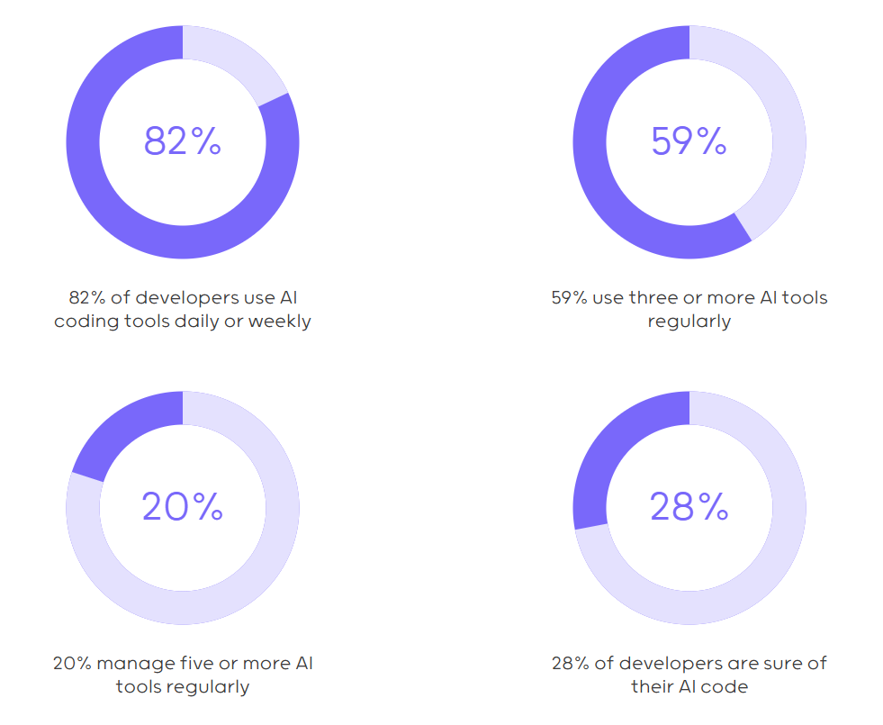](https://substackcdn.com/image/fetch/$s_!Sosq!,f_auto,q_auto:good,fl_progressive:steep/https%3A%2F%2Fsubstack-post-media.s3.amazonaws.com%2Fpublic%2Fimages%2F2332565a-a1b4-4b03-a9e8-f1aa66f72fc9_981x805.png)Adoption is broad, frequent, and multi-tool (Source:[2025 State of AI code quality](https://www.qodo.ai/reports/state-of-ai-code-quality/))

## 2. What is lacking in the current approach?

What we can see is that writing code faster makes us more productive, but the quality of that code is questionable. The entire story of vibecoding is based solely on sheer code production; **no one is discussing code quality, reviews, potential bugs, problems**, or overall Technical Debt increase.

A recent analysis of 211 million lines of code revealed several trends as AI coding tools gained popularity ([GitClear Code Quality Research, 2025](https://www.gitclear.com/ai_assistant_code_quality_2025_research)). It saw a **17.1% jump in copy-pasted code, and duplicate code blocks** became eight times more common in commits.

**For the first time, copy-pasted (AI-generated) lines outpaced the number of lines being refactored for reuse**. This means developers are adding numerous similar lines of code instead of creating shared functions, resulting in a more bloated codebase and increased difficulty in maintaining it.

We also saw another red flag: **code churn** spiked by 26% in the same study (as shown in the image below). About 5.7% of all code changes were revised or deleted within two weeks of being written.

[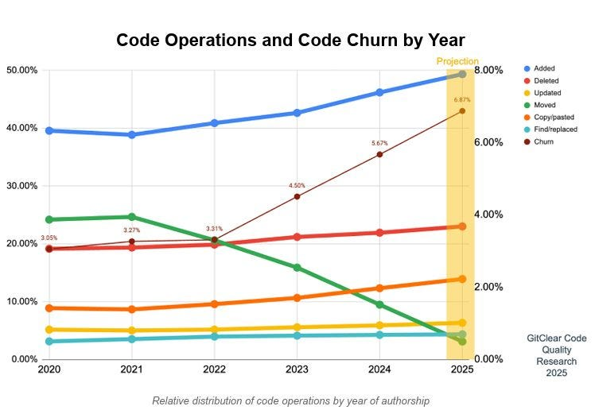](https://substackcdn.com/image/fetch/$s_!URNc!,f_auto,q_auto:good,fl_progressive:steep/https%3A%2F%2Fsubstack-post-media.s3.amazonaws.com%2Fpublic%2Fimages%2F0090c704-4679-4fe0-8d75-a23e438647ca_748x516.jpeg)Code Operations and Code Churn by Year (Source: [GitClear Code Quality Research 2025](https://www.gitclear.com/ai_assistant_code_quality_2025_research))

In other words, more than one in twenty lines of code gets tossed out almost immediately. This suggests that AI-generated code is often not built to last – developers have to rework or clean it up shortly after it’s created.

Why is this happening? One reason is**that AI doesn’t inherently understand your project’s architecture or long-term vision**. LLMs have a short context window, and they struggle with analyzing large codebases. It’s often easier for an AI to insert new code than to find and use existing code.

> *A **context window** is a textual range around a target token that a large language model (LLM)****can process when generating the information.*

So we end up with many near-duplicate functions throughout the codebase (violating the DRY principle). Also, AI-generated code might “work” initially but lack a few essential characteristics, such as proper error handling, clear naming, and thorough testing, which a human would add through careful review and refactoring.

At the same time, **our traditional code review process hasn’t kept pace with this increase in codebase sizes**. Many teams still conduct classic code reviews: a developer opens a pull request, waits for a colleague to manually inspect it, and no code is merged until it passes review.

With 10x more code to review, this approach strains both patience and effectiveness. Reviewers are stuck sifting through masses of changes, often bogged down by trivial issues (like syntax or style tweaks) when their attention should be on bigger design or bug risks.

The result: slower feedback, reviewer fatigue, and sometimes missed problems slipping through.

## 3. How can AI tools improve this?

This is where we can also utilize AI tools, not as a code writer, but as a **code reviewer**. Modern AI review tools are designed to catch issues before they slip through and expedite the entire review process. **Could an AI assistant be the cure for our code review problems?**

AI-powered code reviews can tackle the grunt work first. **They automatically flag duplicate code or bad patterns so humans don’t have to**. For example, an AI reviewer might scan a pull request and point out: “*Hey, these five lines you added look similar to code in Module X – maybe you should reuse it*.” Additionally, it can perform a preliminary version of self-code reviews. This helps to view it as something "new" and **avoid operational blindness**.

It can also enforce your**team’s style guide without a teammate nitpicking line by line**. If you forget to handle a possible null input or misspell a unit test for new logic, the AI can instantly highlight it.

To make it concrete, imagine opening a pull request with 500 lines of changes (hopefully, this doesn’t happen often). An AI review assistant kicks in and, within seconds, you get a report: it summarizes the overall changes in a few bullet points, identifies two functions as nearly duplicates of existing ones, notes no new tests were added for a critical module, and even suggests a couple of edge cases likely to break the latest code. And all of this can happen before a human even starts to review.

By covering these routine checks, AI reviewers **reduce toil** and free up developers to focus on more meaningful feedback. Instead of wasting time on missing semicolons or minor inefficiencies, the human reviewer can focus on whether the solution’s approach is sound and whether the code fits the requirements.

**This makes code reviews faster and more enjoyable**; you get to talk about architecture and clarity rather than counting spaces or parentheses.

[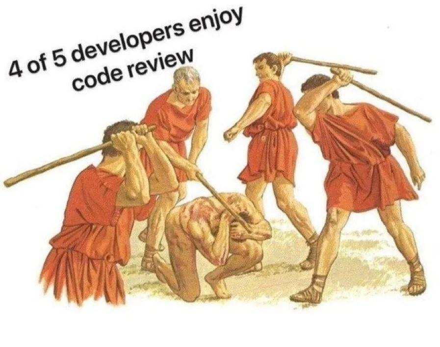](https://substackcdn.com/image/fetch/$s_!7AQR!,f_auto,q_auto:good,fl_progressive:steep/https%3A%2F%2Fsubstack-post-media.s3.amazonaws.com%2Fpublic%2Fimages%2F07b19ee5-5568-40f2-be89-fedc27a55da9_897x708.jpeg)Code reviews can be harsh

AI tools also help **reduce risk** in code reviews. They act as a safety net, especially for teams practicing continuous integration and delivery (CI/CD). Some teams are now comfortable merging code sooner and reviewing it later (“merge first, review after”) because an AI did a first-pass review.

Knowing that an automated assistant checks for obvious mistakes **gives developers** **confidence to deploy faster** – if a bug slips by, the AI likely flags it or a test catches it, and it can be fixed in a follow-up. This enables trunk-based development, and developer velocity increases when people aren’t stuck waiting on a manual review for each small change.

Another benefit is how AI reviews **democratize expertise**. Not all teams have a security guru or performance expert available for each code review; however, an AI model trained on vast code knowledge can identify concerns in those areas.

For instance, it might warn if a piece of code appears vulnerable to SQL injection or if a particular approach could become a scalability bottleneck. It’s like having a virtual expert at your code alongside your teammates.

This doesn’t replace senior engineers, but it augments the whole team’s ability to spot issues beyond their specialty.

> ### **📝 Accountability in code reviews - what research says**
> 
> *A [recent study](https://arxiv.org/pdf/2502.15963) by researchers at the University of Southern Denmark, Aarhus University, and the University of Victoria tackled this question directly:**what happens to accountability when AI enters the code review process?***
> 
> *The study used a two-phase approach specifically designed to overcome the limitations of self-reported data. Phase I interviews captured engineers' stated motivations, while Phase II focus groups observed actual behavior during simulated code reviews.*
> 
> *The researchers configured four different scenarios: testing role hierarchy, public reviews, cross-team reviews, and complex code modules, to understand how accountability persists under various pressures.*
> 
> *The results were interesting. **While engineers consistently reported pride and integrity as drivers in one-on-one conversations, the focus groups showed them actively downregulating these same motivations during collaborative reviews.***
> 
> *Pride became secondary to consensus. Professional integrity shifted from "doing the right thing" to "avoiding defensiveness and engaging constructively with feedback."*
> 
> *This self-regulation process, where individual drivers adapt to enable collective accountability, only happens when humans are watching.*
> 
> *The researchers identified a specific breaking point: **reciprocity**. Peer review works because both author and reviewer become mutually accountable for code quality. When someone approves your code, they're "on the line" too. LLMs can't reciprocate this accountability, which eliminates the social contract that drives collective ownership.*
> 
> *Engineers praised AI feedback quality but remained fundamentally skeptical of contextual understanding. As one noted: "It has no idea in terms of context what it's predicting... And I'm not accountable to it."*
> 
> *From here, the usage of LLM tools for code reviews is suitable in scenarios **to serve as a first-pass reviewer, followed by human input in every review cycle**, especially for larger architectural changes and following team standards.*
> 
> [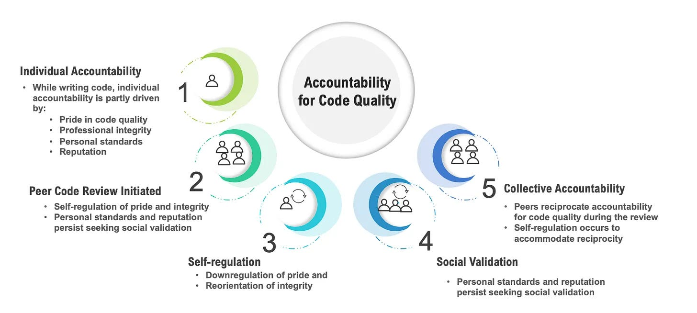](https://substackcdn.com/image/fetch/$s_!njzb!,f_auto,q_auto:good,fl_progressive:steep/https%3A%2F%2Fsubstack-post-media.s3.amazonaws.com%2Fpublic%2Fimages%2Fdb271d1e-e7cc-4c49-9284-92e6f1d75d90_1456x654.png)A framework for understanding accountability, based on findings from Phases I and II of the study

## 4. How to use AI tools for code reviews: An example of CodeRabbit

In practice, developers will find AI review tools helpful. My experimentation with using AI tools such as ChatGPT or Copilot for doing code reviews went like this:

- Tried using multiple AI models to assist in code reviews on a recent project.
- Spent roughly **60% of the time** preparing context for the AI: gathering relevant code snippets, documentation, and explaining the change to the model.
- Spent about **10% of the time** verifying the AI’s suggestions to filter out any hallucinations or incorrect feedback (the AI sometimes flagged issues that weren’t real).
- The remaining **20% of the time** was spent on human code review work, focusing on design decisions, code readability, and final judgment calls.

From here, AI can handle many of the mechanical checks, but it requires setup and oversight. We had to guide the AI and double-check its output, so the process shifted our effort rather than eliminating it.

Still, the net effect was a more thorough review in roughly the same amount of time.

We can significantly improve these tasks by utilizing tools like **[CodeRabbit](https://coderabbit.link/milan)** to enhance productivity, as illustrated in the image below, which highlights specific use cases.

[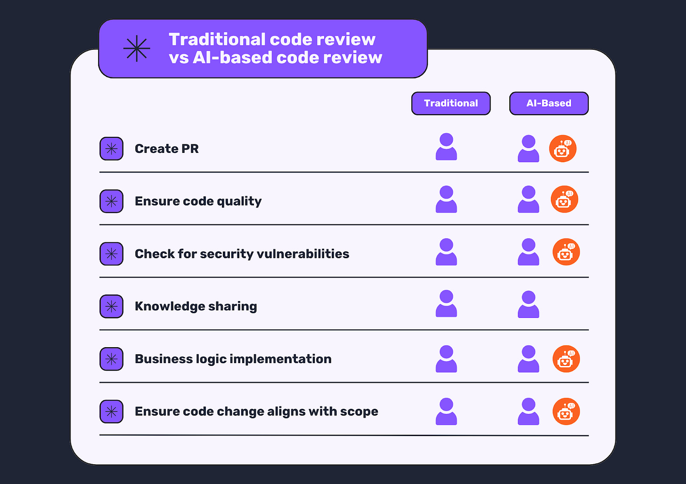](https://substackcdn.com/image/fetch/$s_!lUCj!,f_auto,q_auto:good,fl_progressive:steep/https%3A%2F%2Fsubstack-post-media.s3.amazonaws.com%2Fpublic%2Fimages%2F311b10d8-eb8c-4a33-b2ce-32a58a5e223c_1600x1131.png)Traditional vs AI-based code review

Tools like **[CodeRabbit](https://coderabbit.link/milan)** integrate with GitHub or GitLab and generate AI-driven review comments on your pull requests. They might say, “*This function is quite complex - consider refactoring,*” or ask, “*Can we add input validation here?*”

Having an AI reviewer means you have a tireless assistant who never gets bored with checking even the most minor details.

Here are a few**notable use cases I found [CodeRabbit](https://coderabbit.link/milan) useful**:

### Use case 1: PR summary

One of [CodeRabbit](https://coderabbit.link/milan)’s key features is its ability to generate clear, concise pull request summaries. Now, anyone who needs to check this PR can get out-of-the-box documentation on the work done.

[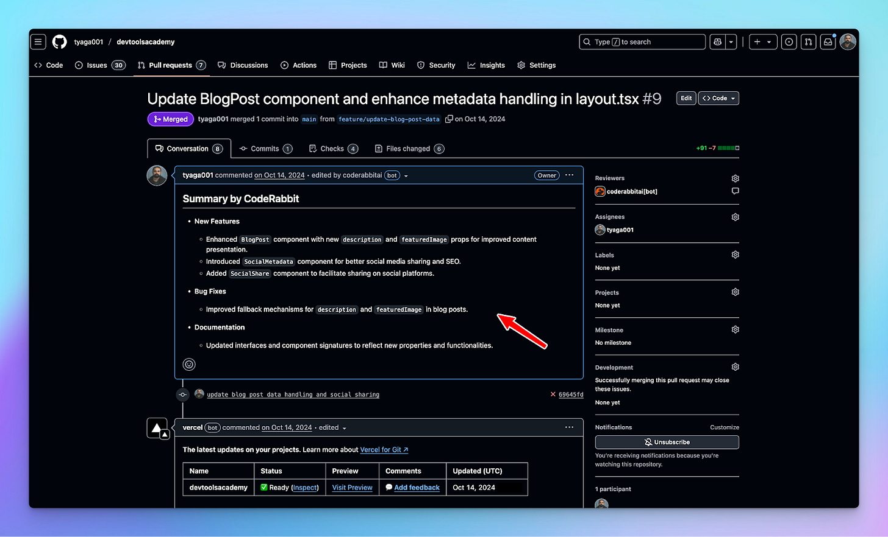](https://substackcdn.com/image/fetch/$s_!CiYu!,f_auto,q_auto:good,fl_progressive:steep/https%3A%2F%2Fsubstack-post-media.s3.amazonaws.com%2Fpublic%2Fimages%2F1db60075-23b3-4b75-948c-6178e6cc24e6_1600x969.png)PR Summaries by [CodeRabbit](https://coderabbit.link/milan)

### Use case 2: Finding security issues

SQL injection is one of the most dangerous security flaws in apps. It happens when attackers trick your database into executing malicious code.

The fix is to use parameterized queries. However, in large codebases, we can easily overlook this. Thankfully, [CodeRabbit](https://coderabbit.link/milan) scans for unsafe query patterns and flags potential issues:

[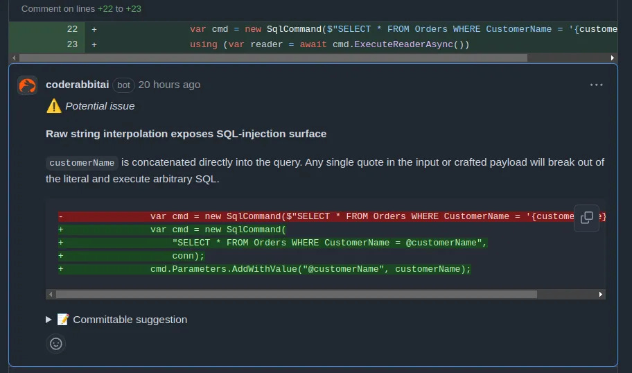](https://substackcdn.com/image/fetch/$s_!CsXd!,f_auto,q_auto:good,fl_progressive:steep/https%3A%2F%2Fsubstack-post-media.s3.amazonaws.com%2Fpublic%2Fimages%2F065be842-f44a-4593-a658-3bc515d7f7e4_912x538.png)Finding security issues with [CodeRabbit](https://coderabbit.link/milan)

### Use case 3: Bad naming

We often see in codebases that developers don’t use different terms for the same concept. For example:

- ❌ createInvoice
- ❌ generateBill
- ❌ makeReceipt

This makes your code inconsistent, which can confuse you and your colleagues.

**Instead, we want to use one word per concept in the entire codebase, like this:**

- ✅ createInvoice
- ✅ createBill
- ✅ createReceipt

**[CodeRabbit](https://coderabbit.link/milan)** flags inconsistent naming, ensuring your code remains clean, consistent, and easy to navigate.

[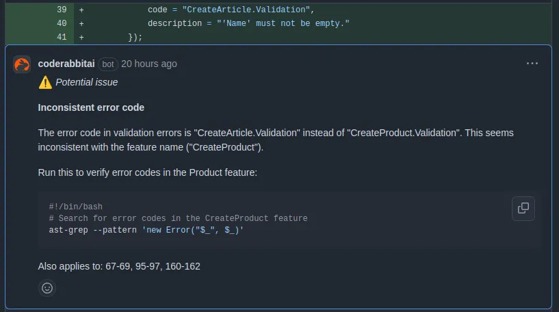](https://substackcdn.com/image/fetch/$s_!grf3!,f_auto,q_auto:good,fl_progressive:steep/https%3A%2F%2Fsubstack-post-media.s3.amazonaws.com%2Fpublic%2Fimages%2Ff0ca2a35-979e-462b-8dc4-917ff3ab585e_817x456.png)Flagging bad names with [CodeRabbit](https://coderabbit.link/milan)

### Use case 4: Missing test cases

Most developers test only the happy paths, but the real bugs hide in edge and corner cases.

[CodeRabbit](https://coderabbit.link/milan) spots missing edge case tests and even suggests what to add. You can reply and let it generate the missing tests for you. This helps boost both code coverage and behavioral confidence in your project.

[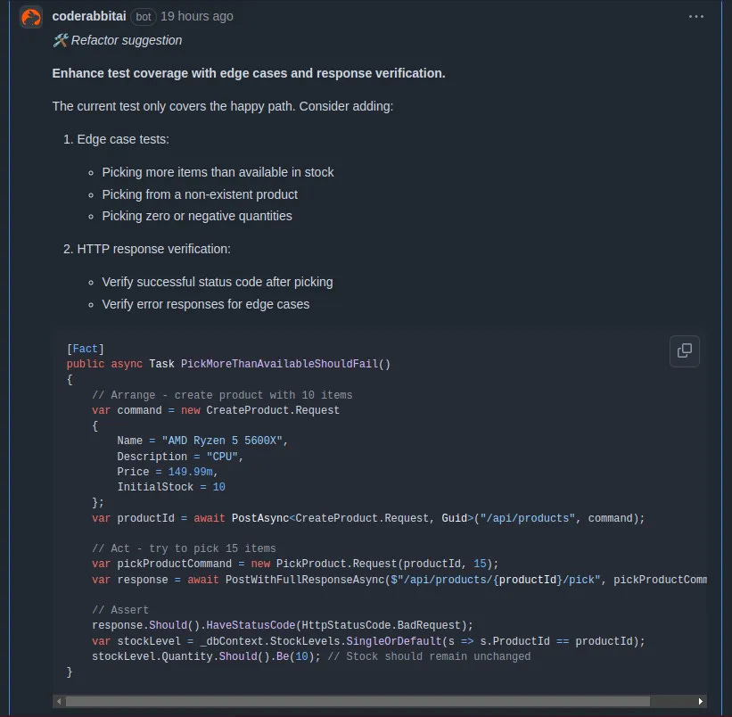](https://substackcdn.com/image/fetch/$s_!RELm!,f_auto,q_auto:good,fl_progressive:steep/https%3A%2F%2Fsubstack-post-media.s3.amazonaws.com%2Fpublic%2Fimages%2Fe16cce09-6373-4d84-afbe-a3c33ab57581_821x804.png)[CodeRabbit](https://coderabbit.link/milan) finds edge cases

In general, [CodeRabbit](https://coderabbit.link/milan) works in both the IDE (VSCode, Cursor, or Winfsurf) and the Git platform. So it is possible to do code reviews on both sides.

[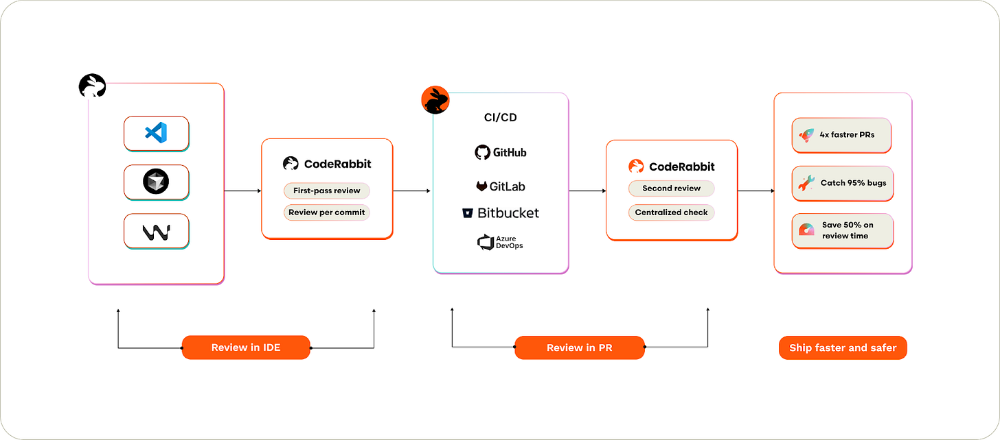](https://substackcdn.com/image/fetch/$s_!SiaE!,f_auto,q_auto:good,fl_progressive:steep/https%3A%2F%2Fsubstack-post-media.s3.amazonaws.com%2Fpublic%2Fimages%2Fea2d1072-0928-4d33-a4d0-929752342bcf_1600x706.png)CodeRabbit integration workflow

## 5. What will be possible?

Taking all into account, the near future of code reviews looks even more interesting. Here are a few things we can expect from AI tools as part of code review in standard development.

As AI tools, such as [CodeRabbit](https://coderabbit.link/milan), accelerate coding, testing, and reviewing in tandem, **we won’t have one part of the pipeline lag**. Code generation might be 10x faster, but code reviews and QA will keep pace because AI will assist at each step. This means fewer backlogs of pull requests waiting for human attention.

**AI will soon be trusted to approve specific, low-risk changes automatically.**For example, a simple documentation fix or a minor code refactor could be merged automatically after an AI review checks it, eliminating the need for human intervention.

Developers can take a leap of faith on these small changes (knowing they can always revert to a bad commit) and save time by not performing detailed reviews.

As AI takes over writing most routine code, **human developers will shift more into the role of curators and architects.** The real value of a senior engineer lies in defining what the software should do and ensuring that the AI-generated parts fit into the bigger picture.

In other words, our “taste” and judgment, selecting the right approach, maintaining code quality, and aligning implementations with business goals, become our key contributions. **While AI handles the “how,” humans will decide the “what” and “why.”**

We may reach a point where AI is more reliable at reviewing code than at writing it from scratch. Evaluating code (checking for errors and comparing it against best practices) is more straightforward to automate than the creative process of design.

So we might trust an AI as a strict code quality gatekeeper even if we wouldn’t trust it to design an entire module solo; in effect, **AI could become the ultimate pair programmer**, becoming very good at catching mistakes and suggesting improvements to whatever code gets written.

[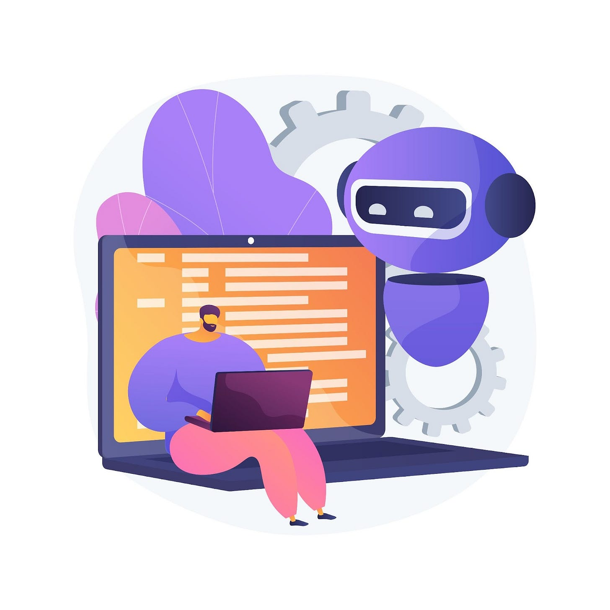](https://substackcdn.com/image/fetch/$s_!oOQQ!,f_auto,q_auto:good,fl_progressive:steep/https%3A%2F%2Fsubstack-post-media.s3.amazonaws.com%2Fpublic%2Fimages%2F2a1909ca-6a93-4584-aa0d-3d8cdf8e1d98_1600x1600.jpeg)Human and AI work together (Source: Freepik)

## 6. Conclusion

AI won’t replace human code reviewers, but it’s certainly changing their job. We can now offload the significant parts of reviews to machines and focus on insights and decisions only humans can make.

Code is cheap to produce now, and quality is the new challenge - but with AI’s help, developers can turn code reviews into a much more efficient process.

So, how to start from here?****Pick a small open pull request from your team and run an AI code review tool, such as CodeRabbit, on it. Identify any issues or suggestions that arise, and discuss the findings with your team.

Track review turnaround time, defect rates reaching production, and developer confidence in shipping changes. These metrics reveal whether AI review truly improves your development process or merely creates the illusion of progress through faster output.

The future belongs to teams that treat AI tools as specialized team members rather than replacements. AI handles systematic analysis at machine speed and scale. Humans provide architectural vision and business context.

Together, they create code more efficiently and effectively than either could alone.

## Bonus: Using a human-in-the-loop approach for reviewing code with AI tools

AI transforms code reviews, but alone, it's imperfect, often flooding reviewers with minor or irrelevant suggestions. Human-only reviews don't scale either, as we have seen. The optimal solution is a **human-in-the-loop approach**: AI handles routine checks, freeing humans to apply their judgment on what truly matters.

This collaboration ensures reviews move quickly without sacrificing quality or context. Humans focus on architectural coherence, strategic alignment, and business logic, while AI rapidly identifies common errors, duplications, and code smells.

To successfully integrate this approach, consider the following framework:

[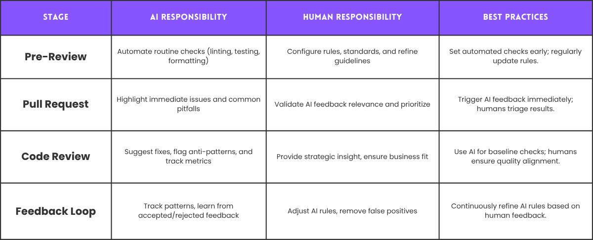](https://substackcdn.com/image/fetch/$s_!iXZd!,f_auto,q_auto:good,fl_progressive:steep/https%3A%2F%2Fsubstack-post-media.s3.amazonaws.com%2Fpublic%2Fimages%2F93c9add9-21b7-458a-bf9d-11ebea234e86_1200x486.png)The human-in-the-loop approach for code reviews

This balanced framework can help teams to integrate AI into code reviews while preserving human judgment and strategic decision-making.

---

## **More ways I can help you:**

- [📚](https://www.patreon.com/techworld_with_milan/shop/ultimate-net-bundle-for-2025-1519389?utm_medium=clipboard_copy&utm_source=copyLink&utm_campaign=productshare_creator&utm_content=join_link)**[The Ultimate .NET Bundle 2025](https://www.patreon.com/techworld_with_milan/shop/ultimate-net-bundle-for-2025-1519389?utm_medium=clipboard_copy&utm_source=copyLink&utm_campaign=productshare_creator&utm_content=join_link)** 🆕. 500+ pages distilled from 30 real projects show you how to own modern C#, ASP.NET Core, patterns, and the whole .NET ecosystem. You also get 200+ interview Q&As, a C# cheat sheet, and bonus guides on middleware and best practices to improve your career and land new .NET roles. **[Join 1,000+ engineers](https://www.patreon.com/techworld_with_milan/shop/ultimate-net-bundle-for-2025-1519389?utm_medium=clipboard_copy&utm_source=copyLink&utm_campaign=productshare_creator&utm_content=join_link)**.
- [📦](https://www.patreon.com/techworld_with_milan/shop/premium-resume-package-1721454?utm_medium=clipboard_copy&utm_source=copyLink&utm_campaign=productshare_creator&utm_content=join_link)**[Premium Resume Package](https://www.patreon.com/techworld_with_milan/shop/premium-resume-package-1721454?utm_medium=clipboard_copy&utm_source=copyLink&utm_campaign=productshare_creator&utm_content=join_link) 🆕**. Built from over 300 interviews, this system enables you to craft a clear, job-ready resume quickly and efficiently. You get ATS-friendly templates (summary, project-based, and more), a cover letter, AI prompts, and bonus guides on writing resumes and prepping LinkedIn. **[Join 500+ people](https://www.patreon.com/techworld_with_milan/shop/premium-resume-package-1721454?utm_medium=clipboard_copy&utm_source=copyLink&utm_campaign=productshare_creator&utm_content=join_link)**.
- [📄](https://www.patreon.com/techworld_with_milan/shop/complete-tech-resume-reality-check-311008?utm_medium=clipboard_copy&utm_source=copyLink&utm_campaign=productshare_creator&utm_content=join_link)**[Resume Reality Check](https://www.patreon.com/techworld_with_milan/shop/complete-tech-resume-reality-check-311008?utm_medium=clipboard_copy&utm_source=copyLink&utm_campaign=productshare_creator&utm_content=join_link)**. Get a CTO-level teardown of your CV and LinkedIn profile. I flag what stands out, fix what drags, and show you how hiring managers judge you in 30 seconds. **[Join 100+ people](https://www.patreon.com/techworld_with_milan/shop/complete-tech-resume-reality-check-311008?utm_medium=clipboard_copy&utm_source=copyLink&utm_campaign=productshare_creator&utm_content=join_link)**.
- [📢](https://www.patreon.com/techworld_with_milan/shop/short-linkedin-content-creator-311232?utm_medium=clipboard_copy&utm_source=copyLink&utm_campaign=productshare_creator&utm_content=join_link)**[LinkedIn Content Creator Masterclass](https://www.patreon.com/techworld_with_milan/shop/short-linkedin-content-creator-311232?utm_medium=clipboard_copy&utm_source=copyLink&utm_campaign=productshare_creator&utm_content=join_link)**. I share the system that grew my tech following to over 100,000 in 6 months (now over 255,000), covering audience targeting, algorithm triggers, and a repeatable writing framework. Leave with a 90-day content plan that turns expertise into daily growth. **[Join 1,000+ creators](https://www.patreon.com/techworld_with_milan/shop/short-linkedin-content-creator-311232?utm_medium=clipboard_copy&utm_source=copyLink&utm_campaign=productshare_creator&utm_content=join_link)**.
- [✨](https://www.patreon.com/c/techworld_with_milan)**[Join My Patreon](https://www.patreon.com/c/techworld_with_milan)**[https://www.patreon.com/c/techworld_with_milan](https://www.patreon.com/c/techworld_with_milan)**[Community](https://www.patreon.com/c/techworld_with_milan) and [My Shop](https://www.patreon.com/c/techworld_with_milan/shop)**. Unlock every book, template, and future drop, plus early access, behind-the-scenes notes, and priority requests. Your support enables me to continue writing in-depth articles at no cost. **[Join 2,000+ insiders](https://www.patreon.com/c/techworld_with_milan)**.
- [🤝](https://newsletter.techworld-with-milan.com/p/coaching-services)**[1:1 Coaching](https://newsletter.techworld-with-milan.com/p/coaching-services)** – Book a focused session to crush your biggest engineering or leadership roadblock. I’ll map next steps, share battle-tested playbooks, and hold you accountable. **[Join 100+ coachees](https://newsletter.techworld-with-milan.com/p/coaching-services)**.

---

## **Want to advertise in Tech World With Milan? 📰**

If your company is interested in reaching an audience of founders, executives, and decision-makers, you may want to **[consider advertising with us](https://newsletter.techworld-with-milan.com/p/sponsorship-of-tech-world-with-milan)**.

---

## **Love Tech World With Milan Newsletter? Tell your friends and get rewards.**

Share it with your friends by using the button below to get benefits (my books and resources).

[Share Tech World With Milan Newsletter](https://newsletter.techworld-with-milan.com/?utm_source=substack&utm_medium=email&utm_content=share&action=share)

[Track your referrals here](https://newsletter.techworld-with-milan.com/leaderboard).