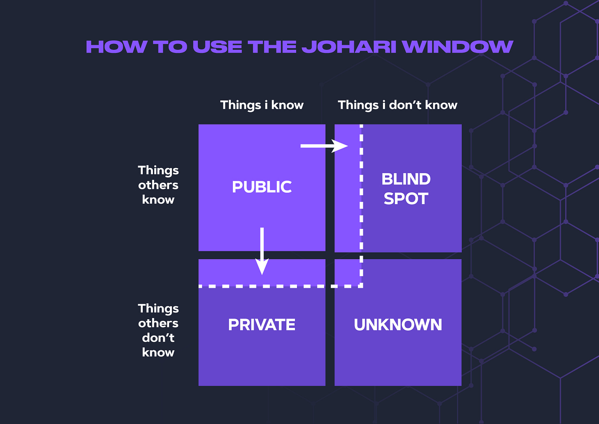
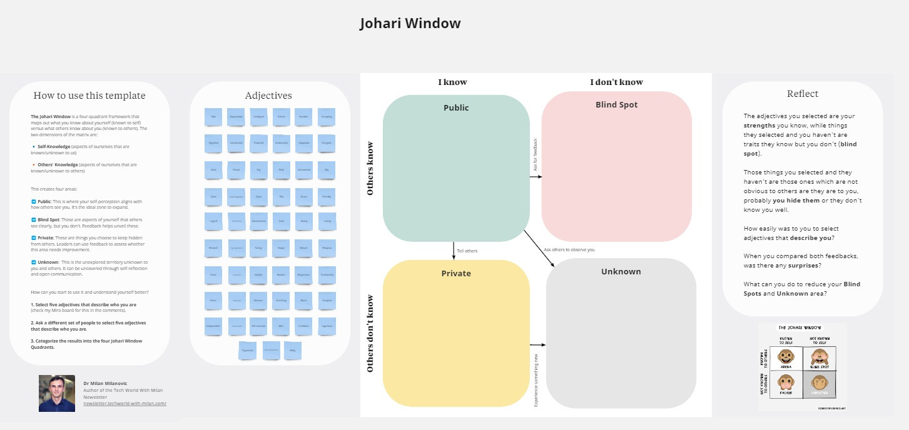
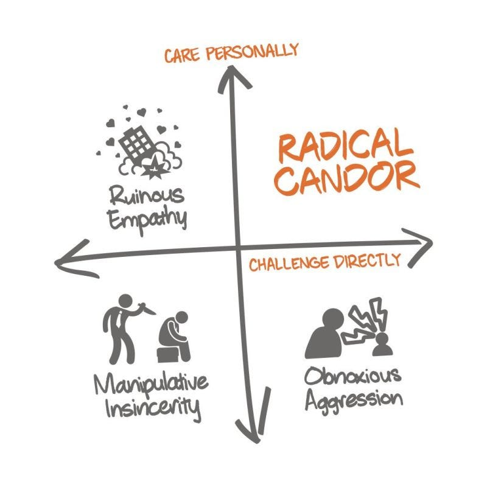

# How to establish a feedback culture

Today, we will learn about feedback culture, why it is the basis of personal and company growth, and how to establish such culture. We will also learn about Johari Window, an excellent tool for learning more about yourself and what Adam Grant thinks about giving and receiving great feedback.

So, let’s dive in.

---

Feedback is one of the most important parts of personal and professional growth. It **helps individuals recognize their strengths, identify areas for improvement, and align their performance with the company's goals**. Also, every real personal growth is based on constructive feedback. When employees receive candid and specific input, they can make informed decisions about their growth trajectories. This, in turn, enables a culture of learning and adaptation, essential for both individual and company-wide progress.

**A company is only as strong as its people**. Investing in a great feedback culture ensures every team member feels valued, heard, and empowered to contribute their best. This not only boosts morale but also enhances productivity.

If we want to establish a proper feedback culture in a company, we need to do a few things:

1. **Understand the importance of feedback:** Start by ensuring everyone understands the value of positive and constructive feedback. It helps individuals grow, fosters better collaboration, and contributes to the company's success.
2. **Create a safe space for feedback**: Feedback can be hard to accept, so ensure your organization has an environment that feels safe for everyone. Ensuring people aren't afraid to give or receive feedback is essential. This includes a culture of respect, where people think they won't be punished for voicing their thoughts.
3. **Practice active listening**: To participate in a feedback culture, we must be good feedback receivers. Part of this involves active listening—receiving feedback, processing it, and asking clarifying questions if needed rather than getting defensive. Encourage this practice in your team.
4. **Develop feedback skills**: Not everyone naturally can give or receive feedback effectively. Consider training or workshops to help your team improve their communication skills, specifically in giving and receiving feedback.
5. **Make feedback a regular process**: Regular, scheduled feedback sessions can help normalize the process and remove some anxiety. Do this at least twice yearly as part of the performance review process. This also keeps lines of communication open.
6. **Promote a growth mindset**: Encourage employees to see feedback as an opportunity to improve rather than criticism. This is key to fostering a culture that values feedback.
7. **Lead by example**: As a leader, make sure you model the behavior you want to see. This means seeking feedback for yourself and delivering it. Try to praise in public but criticize in private.
8. **Constructive feedback**: Ensure feedback is actionable, specific, and focused on behaviors and actions rather than the individual. This makes it more effective and easier to accept and act on. There is no negative feedback, only improving one.
9. **Two-way feedback**: Ensure that feedback isn't just top-down. Encourage employees to give feedback to their peers and their superiors. This creates a more balanced feedback culture.
10. **Focus on actionable feedback**: Feedback should be specific, clear, and actionable. Vague or overly general feedback is not helpful and can be confusing or frustrating.

> *Every feedback is a gift!*

[![A modern office setting with diverse employees engaged in a feedback session. One employee is sitting at a desk, listening attentively while another stands nearby, speaking with a friendly and open expression. On a whiteboard behind them are positive affirmations like 'Growth', 'Teamwork', and 'Success'. Another group in the background is engaged in a 360-degree feedback activity, with individuals writing on sticky notes and placing them on a feedback wall. The atmosphere is collaborative and supportive, with smiles and engaged body language, symbolizing a healthy feedback culture.](images/8751a544-e2bd-4067-bfc5-8f5a6b0782bb_1024x1024.webp)](https://substackcdn.com/image/fetch/$s_!O9V8!,f_auto,q_auto:good,fl_progressive:steep/https%3A%2F%2Fsubstack-post-media.s3.amazonaws.com%2Fpublic%2Fimages%2F8751a544-e2bd-4067-bfc5-8f5a6b0782bb_1024x1024.webp)

---

## How do you use Johari Windows to learn more about yourself?

When I joined a new team, some things began to work incorrectly. Yet, I needed clarification on what the issue was. Luckily, I was part of a team with a great feedback culture, which created the safety of failing and receiving feedback properly.

I received feedback using **the Johari Window technique**, which enabled me to better understand myself and my blind spots. The Johari Window is a communication model developed in the 1950s by two American psychologists, Joseph Luft and Harry Ingham. The name 'Johari' came from joining their first two names.

The Johari Window is a four-quadrant framework that maps out what you know about yourself (known to self) versus what others see about you (known to others). The two dimensions of the matrix are:

- **Self-knowledge** (aspects of ourselves that are known/unknown to us).
- **Others’ knowledge** (aspects of ourselves that are known/unknown to others).

This creates four areas:

➡️ **Public**: This is where your self-perception aligns with how others see you. It's the ideal zone to expand.

➡️ **Blind Spot**: These are aspects of yourself that others see clearly, but you don't. Feedback helps unveil these.

➡️ **Private**: These are things you choose to keep hidden from others. Leaders can use feedback to assess whether this area needs improvement.

➡️ **Unkown**:  This is the unexplored territory unknown to you and others. It can be uncovered through self-reflection and open communication.

Johari Window

How can you start to use it and understand yourself better?

1. **Select five adjectives that describe who you are (check them in the Miro board below).**
2. **Ask a different set of people to select five adjectives that describe who you are.**
3. **Categorize the results into the four Johari Window Quadrants.**
4. **Discuss the results with the people to get more insights.**
5. **Use this input to form an action plan to increase their alignment.**

Note that the adjectives you selected are your strengths, strengths, which you know, while things they selected and you haven't are traits they know, but you don't (blind spot). Those things you selected, which haven't, are not apparent to others but are to you. You probably hide them, or they don't know you well.

What you want to achieve here is:

- **Focus on expanding the open area for yourself and your team members.**
- **Identify the blind spots.**

You usually find that people don't know you or that you don't know yourself. You can also see that your behavior is not aligned with the image you want to project to others.

> *I created a Miro board which you can use to learn more about your self by using the Johari Window technique. You can access it **[here](https://miro.com/app/board/uXjVKJSO7Wg=/?share_link_id=722386491264)**.*
> 
> 

---

## How to give and get constructive feedback

Dr. Adam Grant and Dr. Andrew Huberman [recently discussed](https://www.hubermanlab.com/episode/dr-adam-grant-how-to-unlock-your-potential-motivation-unique-abilities) the value of constructive criticism in the [Hubermanlab podcast](https://www.hubermanlab.com/podcast), delving into the subtleties of psychology and everyday life regarding taking in, analyzing, and acting upon criticism to improve performance and advance.

[Adam Grant](https://adamgrant.net/) is a professor of organizational psychology at The Wharton School of the University of Pennsylvania and a leading expert in motivation, people, and organizational behavior. He has authored many famous books, such as “[Give and Take](https://amzn.to/4aTaWHm)” and “[Think Again](https://amzn.to/3X6TgEL).”

In this episode, he shared three leading suggestions on how to receive and get constructive feedback:

1. **It is not essential if the feedback is positive or negative, but if it focuses on the task or the self.**It's crucial to remember that feedback should be about the task, not the person. If you critique someone's work as 'terrible, 'they're likely to become defensive. However, if you acknowledge their work's good aspects and suggest an improvement, the feedback is more likely to be well-received. So, always direct your feedback towards the task or event, not the individual.
2. **Asking for feedback is not a great way to get people to help you.**When you ask for feedback, you get critics who attack your worst self or cheerleaders who applaud your best self. But you want a coach who can help you become a better version of yourself in the future. You can ask, "Can you give me advice for the next time?" or "What is the one thing I can do better next time?" This statement made Andrew pause, which he rarely does.
3. **Use the second score.**When you receive criticism, consider it your “first score.” For instance, if someone rates your skill at 3 out of 10, that's your initial score. The key is to evaluate then how well you accepted this initial score. You aim for a 'second score' of 10, indicating you've effectively absorbed and acted upon the feedback.

> *One unique way to give feedback to someone, which I recommend, is to challenge that person directly but still show a genuine concern about that person, which is **the Radical Candor** concept. Read more about it **[here](https://newsletter.techworld-with-milan.com/p/are-you-aware-that-you-should-use)**.*
> 
> 

---

## More ways I can help you

1. **1:1 Coaching:** [Book a working session with me](https://newsletter.techworld-with-milan.com/p/coaching-services). 1:1 coaching is available for personal and organizational/team growth topics. I help you become a high-performing leader 🚀.
2. **[Promote yourself to 31,000+ subscribers](https://newsletter.techworld-with-milan.com/p/sponsorship-of-tech-world-with-milan)**by sponsoring this newsletter.

---

Thanks for reading Tech World With Milan Newsletter! Subscribe for free to receive new posts and support my work.