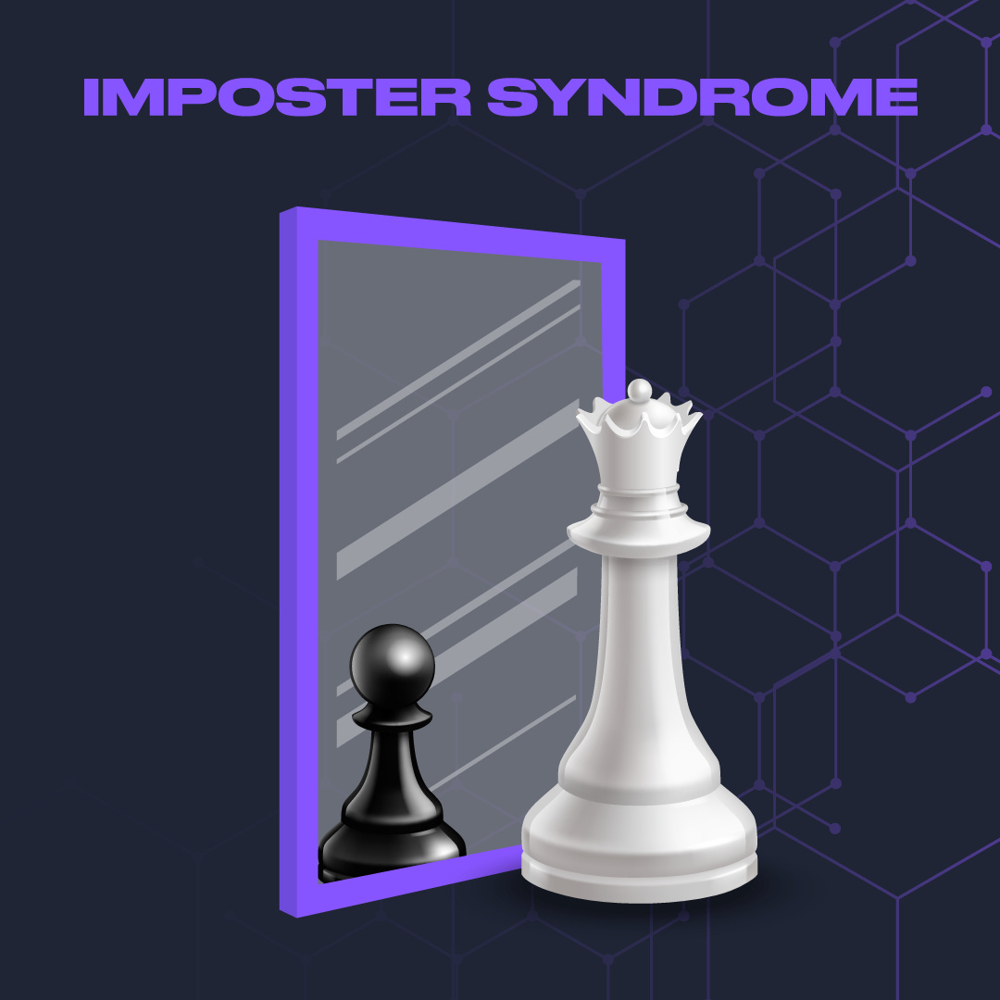

# How to Fight Impostor Syndrome?

*And return your self-esteem as a Software Engineer.*

# The Impostor Syndrome

Everyone in the complex field of software engineering has been hit by impostor syndrome [1] at least once in their career. It is especially felt with high-achievers. Impostor syndrome is the **inability to accept that your daily efforts to learn and advance your talents should make you deserving of attention or keeping your position**. Instead, it could give you the impression that you're deceiving people into thinking you're better at your job than you are (E.g., “I’m not good enough to be a senior engineer.”)—a faker with no right to be there.

While it could make sense at the start of a career, it could be a burden later. Even though you're a senior engineer, **it doesn’t mean you have answers to all questions**. In software engineering, there is often a high level of pressure to perform at a high level, to be productive, and to keep up with new technologies and tools. This can lead to feelings of inadequacy and self-doubt, common symptoms of impostor syndrome.

Additionally, impostor syndrome **can lead to burnout, stress, and anxiety**, seriously affecting a software engineer's physical and mental health. By acknowledging and addressing impostor syndrome, software engineers can boost their confidence, manage stress levels, and develop their skills and knowledge.

# The opposite: The Dunning-Kruger Effect

If we want to understand the Impostor syndrome better, another effect can help, called the **Dunning-Kruger Effect** [2], the cognitive bias of illusory superiority. It is located on the other side of the pendulum. Those who perform poorly on a task tend to **overrate their performance**. The issue is dual since it also has some limitations, and people also need help to accept such restrictions, leading them to overestimate their skills. This effect says that your confidence in your abilities and knowledge declines as you learn more about a subject and, more significantly, become aware of how much more you still need to know.

The Dunning-Kruger Effect

> *Basima Tewfik, a professor of Work and Orientation Studies at MIT Sloan School of Management, [discovered](https://mitsloan.mit.edu/alumni/impostor-syndrome-and-its-surprising-upside) that **individuals who experience impostor syndrome tend to focus on relationships and social interaction to compensate for their perceived inadequacy**. This, however, has a positive interpersonal effect without appearing to affect performance.*

# The More You Know, The More You Realize You Don’t Know

The famous philosopher Aristotle said it. It reflects the concept of intellectual humility and the recognition that **there is always more to learn**. This idea is particularly relevant in the rapidly evolving world of software engineering, where new technologies, tools, and methodologies constantly emerge.

Yet, we tend to **overestimate the extent of our knowledge**, especially when we are beginners in something, as described by the **Dunning-Kruger effect**above. The effect can be compared to a **metaphor of an expanding circle**, where our knowledge is inside the process, while everything we don't know is outside. Yet, as our contact with things we don't yet know increases, we discover more and more things there. As our experience expands, the more things you know, the more you know that you don't know.

Knowledge (inspired by [Steve Smith](https://ardalis.com/the-more-you-know-the-more-you-realize-you-dont-know/))

# How to Deal With The Impostor Syndrome and The Dunning-Kruger Effect

To deal with these biases, we need to develop some **meta-cognitive skills**, such as:

1. **Self-reflection**- The first step in dealing with impostor syndrome is recognizing that you're experiencing it. Be honest about your feelings, and don't be afraid to discuss them with someone you trust.
2. **Taking smart notes** - It's easier to notice gaps in your knowledge when it is visualized. By building this habit, you can identify thought patterns more easily.
3. **Challenging your thoughts**—Impostor syndrome is often driven by negative self-talk and self-doubt. Challenge those thoughts by asking yourself if they're based on fact or perception. Look for evidence that supports your competence and achievements. I think coaching can be helpful here.
4. **Sharing your experience** - Talking about your feelings with others who have experienced impostor syndrome can help you feel less alone. You may also find it helpful to find a mentor or coach who can guide and support you.
5. **You are using second-level thinking**to make decisions. I’d like you to practice thinking about your thought processes and knowledge. Don't just jump to the most obvious conclusion. The thing about your blind spots and what info you are missing is.
6. **Celebrating your success**—It's essential to recognize and celebrate your accomplishments, no matter how small. Remember to acknowledge your achievements and credit yourself for your hard work.
7. **Focusing on learning and growth**—Instead of worrying about perfection, focus on learning and growing. Embrace challenges and view mistakes as opportunities to learn and improve. A growth mindset is essential here.
8. **Seeking feedback** - Actively seek feedback from others, especially those who are more knowledgeable or skilled in a particular area.

Remember **not to compare yourself to others**. Comparing yourself is the source of all unhappiness. Everyone has their path, and you need to follow yours.

> *“Impostor syndrome: “I don't know what I'm doing. It's only a matter of time until everyone finds out."*
> 
> *Growth mindset: "I don't know what I'm doing yet. It's only a matter of time until I figure it out."*
> 
> *The highest form of self-confidence is believing in your ability to learn.”*
> 
> --[Adam Grant](https://substack.com/@adamgrant/note/c-80169746?utm_source=notes-share-action&r=ek5ww)

Learn more about how to make better decisions:
[
Tech World With Milan NewsletterHow to make better decisions with Second-Order ThinkingIn the complex software development and management world, the quality of our thinking often determines the success of our projects and teams. Mental models and cognitive biases are crucial in approaching problems, making decisions, and interacting with others…Read morea year ago · 88 likes · 8 comments · Dr Milan Milanović](https://newsletter.techworld-with-milan.com/p/how-to-make-better-decisions-with?utm_source=substack&utm_campaign=post_embed&utm_medium=web)
### References

1. Kolligian Jr, J., & Sternberg, R. J. (1991). “Perceived Fraudulence in Young Adults: Is There an ‘Imposter Syndrome’?” *Journal of Personality Assessment, 56*(2), 308-326. doi:10.1207/s15327752jpa5602_10
2. Kruger, J., & Dunning, D. (1999). “Unskilled and unaware of it: how difficulties recognizing one’s incompetence lead to inflated self-assessments.” *Journal of personality and social psychology, 77*(6), 1121.

---

## More ways I can help you

1. **[Patreon Community](https://www.patreon.com/techworld_with_milan)**: Join my community of engineers, managers, and software architects. You will get exclusive benefits, including all of my books and templates (worth 100$), early access to my content, insider news, helpful resources and tools, priority support, and the possibility to influence my work.
2. **[Sponsoring this newsletter will promote you to 33,000+ subscribers](https://newsletter.techworld-with-milan.com/p/sponsorship-of-tech-world-with-milan)**. It puts you in front of an audience of many engineering leaders and senior engineers who influence tech decisions and purchases.
3. **1:1 Coaching:** [Book a working session with me](https://newsletter.techworld-with-milan.com/p/coaching-services). 1:1 coaching is available for personal and organizational/team growth topics. I help you become a high-performing leader 🚀.

---

Thanks for reading Tech World With Milan Newsletter! Subscribe for free to receive new posts and support my work.