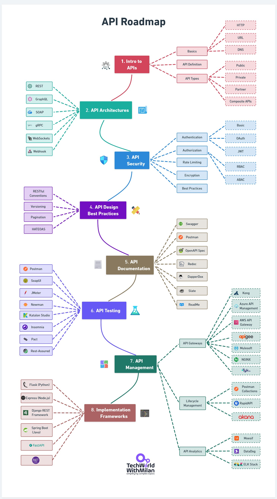
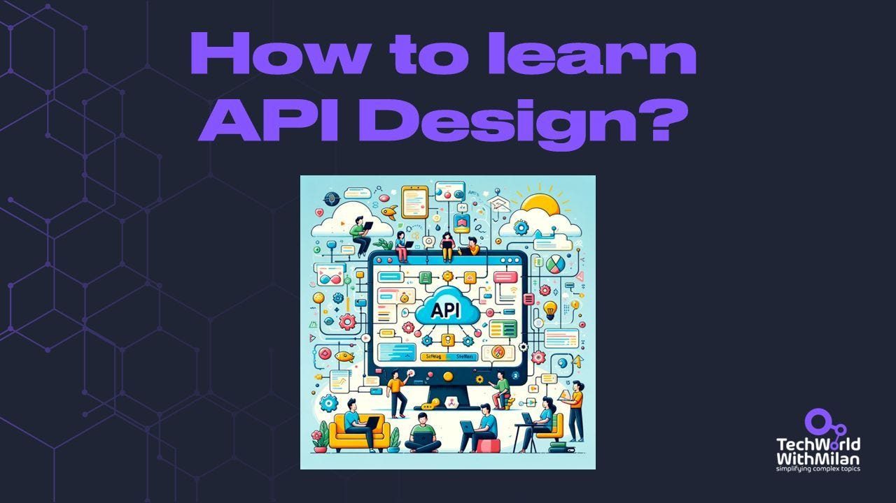
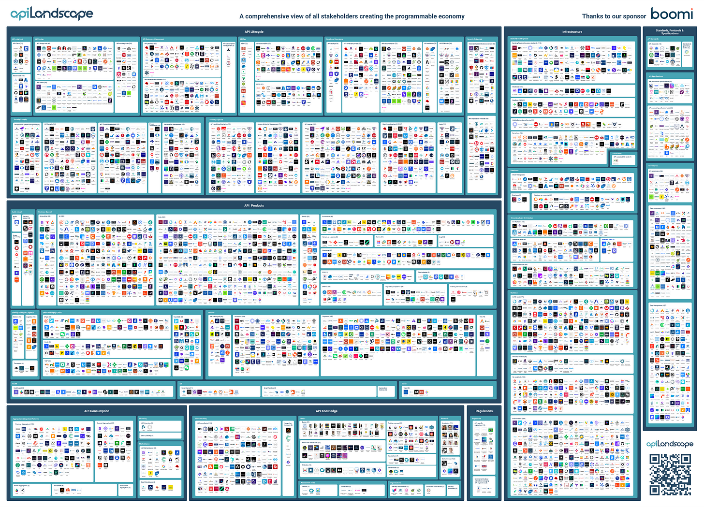
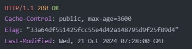
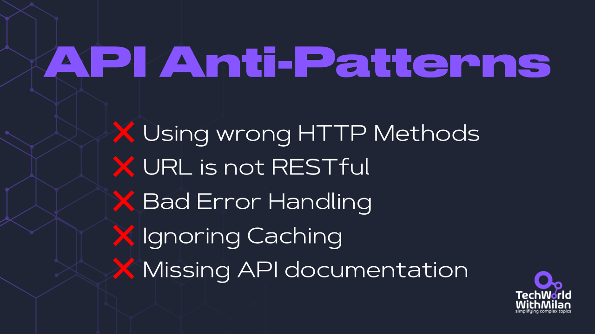

# How to learn API?

*with the list of all important resources you will ever need.*

Our daily work as software engineers involves creating or utilizing these APIs. Creating **well-designed REST APIs is crucial**; not only should they be easy to work with and concise, but they should also be well-designed against misuse to prevent future issues.

In this issue, we explore the art of **API design through a curated selection of resources**, including insightful books, articles, and real-world examples from industry leaders like Stripe and Slack. We'll learn about the proper use of HTTP methods, RESTful URI structures, effective error handling, caching strategies, and the importance of thorough API documentation.

Additionally, we'll present **common API anti-patterns** that often lead to bigger problems later.

So, let’s dive in.

---

## 1. API Roadmap

APIs are among the first things software engineers should learn, well before more complex topics such as distributed systems, cloud computing, and others. They are the basis of all development today, and they will help you understand how software systems work and how to use proper programming languages and frameworks.

Whether you're a beginner or an experienced developer looking to learn about APIs, this API learning roadmap will help you understand the key concepts and technologies.

> ➡️*An API is any defined contract for interaction between software components*

### 1. Introduction to APIs

Before diving deep into API development, it's crucial to understand the fundamentals. This section covers the basic building blocks that form the foundation of API knowledge, from core protocols to different APIs used in modern software development.

- **Basics**: Learn about [HTTP protocol](https://newsletter.techworld-with-milan.com/p/understanding-rest-headers), DNS, URLs, and more.
- **API Definition**: An API is a set of protocols, routines, and tools for building software applications. It specifies how software components should interact.
- **API Types**:

- **🌐 Public APIs**: Open for use by external developers (e.g., Twitter API)
- **🔒 Private APIs**: Used internally within an organization
- **🔑 Partner APIs**: Shared with specific business partners
- **🧩 Composite APIs**: Combine multiple data or service APIs

### 2. API Architectures

Understanding different API architectural styles is essential, as each serves specific use cases and has advantages and trade-offs. These architectures form the core of your API's structure and client interaction.

- **[REST (Representational State Transfer)](https://newsletter.techworld-with-milan.com/p/understanding-rest-headers):** A widely used architectural style for web APIs
- **GraphQL:** A query language for APIs that allows clients to request specific data
- **SOAP (Simple Object Access Protocol)**: A protocol for exchanging structured data
- **gRPC**: A high-performance, open-source framework developed by Google
- **WebSockets**: Enables full-duplex, real-time communication between client and server
- **Webhook**: Allows real-time notifications and event-driven architecture

Learn more about API Architecture types:
[
Tech World With Milan NewsletterWhat are the main API Architecture Styles?In today’s issue, we will discuss the main API architectural styles, their usage, the pros and cons of each style, and recommendations for when to use each style…Read more2 years ago · 43 likes · Dr Milan Milanović](https://newsletter.techworld-with-milan.com/p/what-are-the-main-api-architecture?utm_source=substack&utm_campaign=post_embed&utm_medium=web)
And what are the fundamental differences between them:
[
Tech World With Milan NewsletterWhen to use GraphQL, gRPC, and REST?Building APIs is one of the most important tasks for developers in modern engineering. These APIs allow different systems to communicate and exchange data. While REST has been the de facto standard for implementing APIs for many years, new emerging standards, such as…Read more2 years ago · 60 likes · 2 comments · Dr Milan Milanović](https://newsletter.techworld-with-milan.com/p/when-to-use-graphql-grpc-and-rest?utm_source=substack&utm_campaign=post_embed&utm_medium=web)
### 3. API Security

Security is one of the most critical parts of API development. This section covers essential security concepts and best practices that protect your API from unauthorized access and potential threats while ensuring secure data transmission.

- **Authentication**: Basic, OAuth 2.0, JSON Web Tokens (JWT)
- **Authorization**: Controlling access rights to resources
- **Rate Limiting**: Preventing abuse by limiting the number of requests
- **Encryption**: Protecting data in transit using HTTPS
- **Best practices**: [OWASP Top 10 Security Risks](https://newsletter.techworld-with-milan.com/p/what-are-the-main-api-architecture)

Learn more about OAuth 2.0:
[
Tech World With Milan NewsletterHow does OAuth 2.0 work?You probably already have seen those "Sign in with Google" or "Connect with GitHub" buttons, which enable you to log in and access different services without entering a new set of credentials. Whether logging into a website using your social media account or authorizing a third-party app to interact with your email, OAuth 2.0 is the protocol behind this…Read morea year ago · 69 likes · Dr Milan Milanović](https://newsletter.techworld-with-milan.com/p/how-does-oauth-20-work?utm_source=substack&utm_campaign=post_embed&utm_medium=web)
### 4. API Design Best Practices

Good API design differentiates between an API developers love to use and one they avoid. These best practices have evolved from years of industry experience and help create intuitive, efficient, and maintainable APIs.

- **RESTful conventions**: Using HTTP methods correctly, proper resource naming
- **Versioning**: URI versioning (e.g., /v1/users), Query parameter versioning (e.g., /users?version=1), Header versioning (e.g., Accept: application/vnd.company.v1+json).
- **Pagination**: Efficiently handling large datasets
- **Error Handling**: Proper use of HTTP status codes and informative error messages

- [RFC 7807 - Problem Details for HTTP APIs](https://datatracker.ietf.org/doc/html/rfc7807) (outdated)
- [RFC 9457 - Problem Details for HTTP APIs](https://www.rfc-editor.org/rfc/rfc9457.html) (new version)

Learn more about API Design Best Practices:
[
Tech World With Milan NewsletterREST API Design Best PracticesWhat is API…Read more3 years ago · 9 likes · Dr Milan Milanović](https://newsletter.techworld-with-milan.com/p/rest-api-design-best-practices?utm_source=substack&utm_campaign=post_embed&utm_medium=web)
And what is the API-first approach:
[
Tech World With Milan NewsletterWhat is API-First Development?You probably heard about terms such as API-first, Code-first, and Design-first. Yet, although we as developers are primarily familiar with the Code-first approach to developing APIs, there are also some other approaches…Read more3 years ago · 9 likes · Dr Milan Milanović](https://newsletter.techworld-with-milan.com/p/what-is-api-first-development?utm_source=substack&utm_campaign=post_embed&utm_medium=web)
### 5. API Documentation

Great APIs are only as good as their documentation. This section covers tools and practices for creating clear, comprehensive documentation that makes your API accessible to developers.

- **[Swagger/OpenAPI Specification](https://swagger.io/specification/)**: A standard for describing RESTful APIs
- **[Postman](https://www.postman.com/)**: A popular tool for API development and documentation
- **[ReDoc](https://redocly.com/)**: A tool for generating beautiful API documentation
- **[DapperDox](http://dapperdox.io/)**: is Open-Source and provides rich, out-of-the-box rendering OpenAPI specification.
- **[Slate](https://github.com/slatedocs/slate)**: A popular tool with the project being forked more than 15,000 times.
- **[ReadMe](https://readme.com/)**: Transforms static API documentation into real-time, interactive developer hubs.

### 6. API Testing

Testing ensures your API works as intended and maintains its quality over time. This section explores various testing approaches and tools for validating functionality, performance, and reliability.

- **[Postman](https://www.postman.com/)**: Allows creating and running API tests
- **[SoapUI](https://www.soapui.org/)**: A tool for testing SOAP and REST APIs
- **[JMeter](https://jmeter.apache.org/)**: Used for performance and load testing
- **API Mocking**: Tools like [Mockoon](https://mockoon.com/) or [Postman's mock servers](https://learning.postman.com/docs/designing-and-developing-your-api/mocking-data/setting-up-mock/) for simulating API responses
- **[Pact](https://pact.io/)**: A contract testing tool that ensures APIs and microservices adhere to defined agreements, facilitating reliable integration.
- **[Insomnia](https://insomnia.rest/)**: An open-source, cross-platform API client for designing, debugging, and testing REST, GraphQL, and gRPC APIs.
- **[Rest-Assured](https://rest-assured.io/)**: A Java-based library that simplifies the testing of REST services by providing a domain-specific language for writing tests.
- **[Katalon Studio](https://katalon.com/api-testing)**: A comprehensive test automation tool supporting web, mobile, and API testing with a user-friendly interface and robust features
- **[Newman](https://learning.postman.com/docs/collections/using-newman-cli/command-line-integration-with-newman/)**: A command-line collection runner for Postman, enabling automated and continuous integration of API tests

### 7. API Management

As APIs grow in complexity and usage, proper management becomes crucial. This section covers tools and practices for handling the full lifecycle of APIs, from deployment to monitoring.

- **API Gateways**: [Azure API Management](https://azure.microsoft.com/en-us/products/api-management), [AWS API Gateway](https://aws.amazon.com/api-gateway/), [Kongk](https://konghq.com/), [Apigee](https://cloud.google.com/apigee).
- **Lifecycle Management**: [Postman Collections](https://www.postman.com/collection/), [RapidAPI](https://rapidapi.com/), [Akana](https://www.akana.com/products/api-platform).
- **API Analytics and Monitoring**: [Moesif](https://www.moesif.com/), [Datadog](https://www.datadoghq.com/), [ELK Stack](https://www.elastic.co/elastic-stack) (Elasticsearch, Logstash, Kibana)

### 8. Implementation Frameworks

Choosing the proper framework can significantly impact your API development experience. This section covers popular frameworks across different programming languages, each offering unique features and capabilities.

- **Python**: [Flask](https://flask.palletsprojects.com/), [Django REST framework](https://www.django-rest-framework.org/), [FastAPI](https://fastapi.tiangolo.com/)
- **JavaScript**​: [Express.js](https://expressjs.com/)
- **Java**: [Spring Boot](https://spring.io/projects/spring-boot)
- **.NET**: [ASP.NET Core](https://dotnet.microsoft.com/en-us/apps/aspnet)

API Roadmap

---

## 2. Recommended resources to learn API Design

Most of our daily work as software engineers utilizes or creates REST APIs. APIs are the standard method of communication between systems. Therefore, building REST APIs properly is crucial to avoiding future issues. A well-defined API should be easy to work with, concise, and hard to misuse.

Here are some references that could help you learn API design:

### 1. Books

- **[Designing Web APIs: Building APIs That Developers Love](https://amzn.to/3RjcbHZ)**, Brenda Jin, Saurabh Sahni, Amir Shevat. A comprehensive guide that covers the entire API design lifecycle, from planning to production.
- **[The Design of Web APIs](https://amzn.to/41mGNNh)**, Arnaud Lauret. Focuses on practical approaches to API design with real-world examples and best practices.
- **[Principles of Web API Design](https://amzn.to/3RdN89i)**, James Higginbotham. Explores fundamental principles and patterns for creating sustainable web APIs.
- **[REST In Practice](https://amzn.to/4fTdhVz)**, Jim Webber, Savas Parastatidis, and Ian Robinson, O’Reilly.

### 2. Articles

- Roy Thomas Fielding **[Ph.D. dissertation that introduced REST architectural style](https://ics.uci.edu/~fielding/pubs/dissertation/fielding_dissertation.pdf)** in 2000:
- **[API design guide](https://cloud.google.com/apis/design)** by Google. Official guidelines from Google explaining their approach to API design and best practices.
- **[Microsoft REST API Guidelines](https://github.com/Microsoft/api-guidelines/blob/master/Guidelines.md)**
- **[Learn API Design](https://github.com/dwyl/learn-api-design)** GitHub Repo—a curated collection of resources and tutorials for API design learning.
- **[Zalando RESTful API and Event Guidelines](https://opensource.zalando.com/restful-api-guidelines/)**. Practical guidelines from Zalando's engineering team on building consistent RESTful APIs.
- **[How to design better APIs](https://r.bluethl.net/how-to-design-better-apis)**, by Ronald Blüthl. 15 language-agnostic, actionable tips on REST API design.
- **[How to implement better APIs](https://r.bluethl.net/how-to-implement-better-apis)** by Ronald Blüthl. The Next.js reference implementation.
- **[How to use undocumented web APIs](https://jvns.ca/blog/2022/03/10/how-to-use-undocumented-web-apis/)** by Julia Evans
- **[How to design a RESTful API architecture from a human-language spec](https://www.oreilly.com/content/how-to-design-a-restful-api-architecture-from-a-human-language-spec/)** by Filipe Ximenes and Flávio Juvenal
- **[HATEOAS Driven REST APIs](https://restfulapi.net/hateoas/)**
- **[How We Design Our APIs at Slack](https://slack.engineering/how-we-design-our-apis-at-slack)**, API Design Guidelines You Can Use Today

### 3. Testing APIs

- **[API Testing with Postman](https://www.postman.com/api-platform/api-testing/)** - A comprehensive guide to testing APIs using the popular Postman tool.

### 4. API Security

- **[API Security Checklist](https://github.com/shieldfy/API-Security-Checklist)** - Essential security considerations and best practices for API development.
- **[OWASP Top 10 API Security Risks](https://owasp.org/API-Security/editions/2023/en/0x11-t10/)** – 2023. Current security vulnerabilities and threats specific to APIs.

### 5. API Examples

- **[Stripe API](https://docs.stripe.com/api)** and **[How Stripe Build APIs](https://blog.postman.com/how-stripe-builds-apis/)** - Known for their excellent documentation and developer experience.
- **[Twitter API](https://developer.x.com/en/docs/api-reference-index)** - A widely-used example of REST API implementation at scale.
- **[Twilio API](https://www.twilio.com/docs/usage/api)** - Notable for its consistency and developer-friendly design.
- **[How We Design Our APIs at Slack](https://slack.engineering/how-we-design-our-apis-at-slack/)** - Insights into Slack's API design principles and practices.

### 6. Other

- **[API Patterns](https://api-patterns.org/)** - Common design patterns and architectural approaches for APIs.
- **[API Landscape](https://apilandscape.apiscene.io/)** - Overview of the current API ecosystem and trends.
- **[The state of public API](https://apirank.dev/state-of-public-api-2023/)** - Analysis of current trends and best practices in public API design.
- **[2024 State of the API Report](https://www.postman.com/state-of-api/2024/)** by Postman. Annual report on API industry trends, challenges, and opportunities.

[The API Landscape](https://apilandscape.apiscene.io/)

---

## 3. BONUS: API Anti-patterns

There are design patterns in software design, which are good practices, but we also have anti-patterns. These anti-patterns often seem like good ideas initially, but can lead to different problems over time.

This holds not only for general software design but also in the API world.

Here are some common API anti-patterns we can see in the wild:

### 1. Using the wrong HTTP Methods

If we don't align with RESTful design principles, we may end up with a confusing and unpredictable API.

Here are some examples of such problems:

- Using POST for everything instead ofthe  appropriate GET, PUT, and DELETE methods

- ❌ `POST /updateUser`
- ✅ `PUT /users/{id}`
- Focusing on actions rather than resources

- ❌ `GET /getLatestCheckout`
- ✅ `GET /checkouts/latest`

### 2. URI is not RESTful

There could be multiple issues in this area:

- Inconsistent resource naming (mixing singular/plural)

- ❌ `/user/{id}` vs `/companies`
- ✅ `/users/{id}` and `/companies`
- Mixing verbs and nouns

- ❌ `/createPost` and `/comments`
- ✅ `/posts` and `/comments`

The best practice is to:

- Use consistent plural nouns for collections
- Keep URLs resource-focused, not action-focused
- Maintain consistent casing (preferably kebab-case)

### 3. Bad Error Handling

An example could be generic error messages that always return "An error occurred" instead of "Invalid email format."

Another example is using incorrect or non-standard status codes, such as returning 200 OK for all responses, even when an error occurs. We need to know some major response status codes, but we can also create our own.

Some common mistakes are:

- Generic error messages

- ❌ "An error occurred."
- ✅ "Invalid email format: user@domain missing top-level domain"
- Incorrect HTTP status codes

- ❌ Using 200 OK for errors
- ✅ Using appropriate codes (400 for client errors, 500 for server errors)

Best practices are:

- Use specific, actionable error messages
- Include error codes and documentation references
- Follow HTTP status code conventions:

- 2xx for success
- 4xx for client errors
- 5xx for server errors

### 4. Ignoring caching

We usually don't use any caching mechanism with our REST APIs, even though we have many options. This can degrade application performance.

For example, we can use HTTP caching headers such as ETag, Cache-Control, and Last-Modified to control how clients cache responses, thereby improving application stability and performance.

### 5. Missing API documentation

Proper documentation can help us understand how to interact with our APIs. We want to invest time in creating proper documentation covering all API aspects, including endpoints, parameters, data models, error codes, and examples of typical requests and responses. We can use tools like Swagger (OpenAPI Specification) to generate interactive documentation.

Also, today, we can use **AI tools to generate documentation from your API's codebase or annotations**.

API Anti-patterns

---

Thanks for reading Tech World With Milan Newsletter! Subscribe for free to receive new posts and support my work.