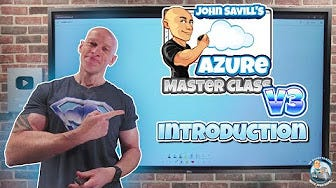
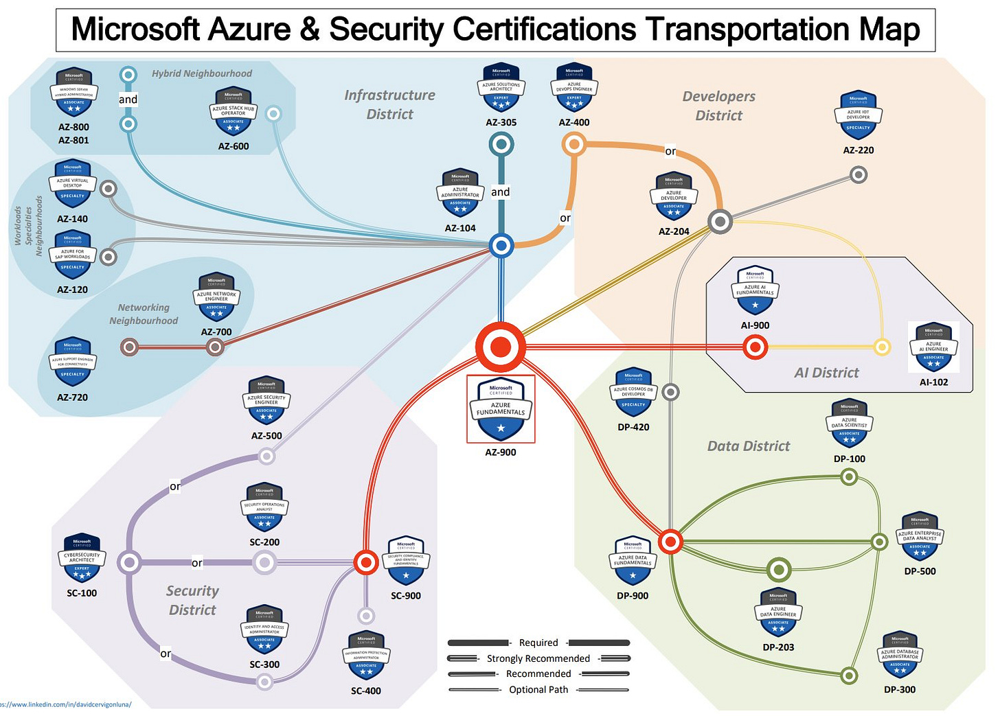
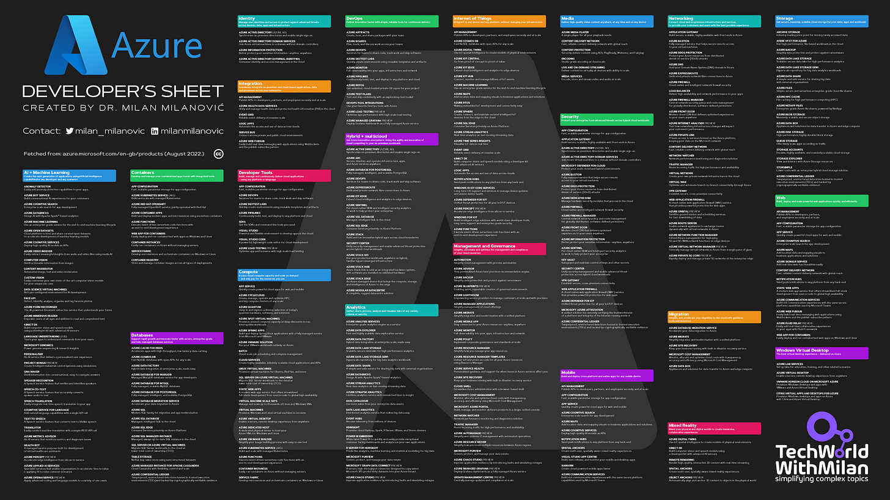
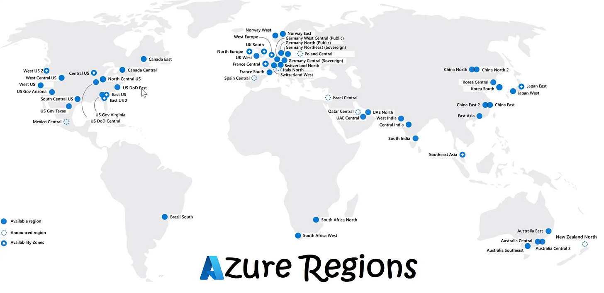
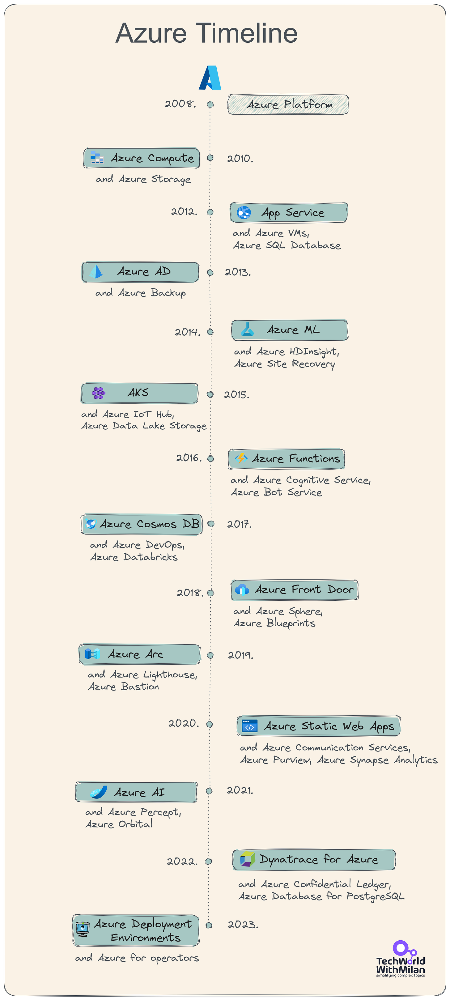

# How to learn Microsoft Azure

*..and stay up to date.*

This week, we talk about the following:

- **How to learn Azure**
- **Certification Tips & Tricks**
- **How to stay up-to-date with Azure**
- **Azure Cheat Sheet**
- **Azure Global Infrastructure**
- **Azure Timeline**
- **Tools & Resources**

Let’s dive in.

---

## How to learn Azure

For most people, the challenge is finding out what they should learn and where they should invest their time. Microsoft has already prepared **certification exams** to guide you through a particular skill or to learn something.

I recommend the **[AZ-900 Microsoft Azure Fundamentals](https://learn.microsoft.com/en-us/certifications/exams/az-900/)** exam for people starting to learn Microsoft Azure. It provides an excellent overview of cloud concepts, Azure services, workloads, security, privacy in Azure, pricing, and support. The main goal here is not to pass the certification exam but to learn; (optionally) passing that exam gives you an extra benefit.

So, how do you start? First, go and open a **[free Azure account](https://azure.microsoft.com/en-us/free/)**. This account includes a limited quantity of free services for 12 months. You can use free services in various configurations to meet your needs within these limits.

You’ll be able to choose which materials you will use to learn. Here we have different possibilities:

- **[Microsoft Learn](https://learn.microsoft.com/en-us/certifications/exams/az-900/)** provides various learning paths depending on a job role or the skills needed. Most of the learning paths offer hands-on learning opportunities, allowing you to develop practical skills through interactive training using free sandboxes.
- **Online tutorials:**

1. Microsoft Azure Fundamentals Certification Course (AZ-900) - Video 3 hours at **freeCodeCamp**: [link](https://www.youtube.com/watch?v=NKEFWyqJ5XA).

2. Or this: Microsoft Azure Fundamentals (AZ-900) Full Course by **Adam Marczak: 40 videos**, 7+ hours:  [link](https://www.youtube.com/playlist?list=PLGjZwEtPN7j-Q59JYso3L4_yoCjj2syrM).

3. The AZ-900 Azure Fundamentals Study Cram is recommended by **John Savill** - Video, 3+ hours: [link](https://www.youtube.com/watch?v=tQp1YkB2Tgss). or the new **[Microsoft Azure Master Class v2](https://www.youtube.com/playlist?list=PLlVtbbG169nGccbp8VSpAozu3w9xSQJoY) (2025)**.

Play all

# **Microsoft Azure Master Class v2**
- **Take online virtual training**, free with a real instructor (2 days x 3.5h): [link](https://www.microsoft.com/en-us/trainingdays/azure).
- **Practice Assessments for Azure Certifications** is a free way to practice for most Microsoft Azure certifications: [link](https://learn.microsoft.com/en-us/certifications/practice-assessments-for-microsoft-certifications).
- **The next step is role-based exams.**

Also, there are multiple options here. One possibility is a **[Guide to Cloud](https://www.youtube.com/c/aguidetocloud)**, which breaks down all the topics and makes short videos. Other ones are channels from [Adam Marczak](https://www.youtube.com/@Azure4Everyone) or [John Savill](https://www.youtube.com/@NTFAQGuy).

After this training, you could try to prepare for Microsoft Exams and **become certified**.

---

## **Microsoft Azure Certification Map**

If you're interested in Azure certifications, this map could be worthwhile. Here is how to read this map:

- **Fundamentals (Red).** These are typically the first steps in the journey. It would be best to start with Azure Fundamentals (AZ-900) and then move to the next one in your area of interest (Districts). Fundamentals certifications do NOT expire, nor are they required to get "Associate" or "Expert" level certifications.
- **“Core” Associate-level certifications** are connected to the Fundamentals stations with a "Strongly recommended" line. These are Administrator (AZ-104), Developer (AZ-204), Data Engineer (DP-203), and Security Operations (SC-200). These certifications demonstrate the critical knowledge that will be beneficial for the courses and certifications in each "District" but are NOT a requirement to get the rest of the "associate" or "specialty" certifications.
- **Expert-level certifications** are required to pass their exam and possess one associate-level certification. Azure Solutions Architect certification (AZ-305 exam) requires passing AZ-104, Azure DevOps Engineer certification (AZ-400 exam) requires passing AZ-104 or AZ-204, and Microsoft Cybersecurity Architect certification (SC-100 exam) also requires passing AZ-500 or MS-500 or SC-200 or SC-300.

Microsoft Azure Certifications Transportation Map (Credits: David Cervigón Luna)

---

## Microsoft Azure Certification Tips & Tricks For New Joiners

If you're new in the journey of getting any of the Azure certifications, take these steps:

1. **Create a certification profile**

Go to any exam page, click the order button, and on the other page, you will be sent to a page where you can start filling out the information. If you have a work account, you should connect it here because your employer might be in some Microsoft programs that offer free vouchers.
2. **Check your Certifications board.**

Go to the **[certifications board page](https://learn.microsoft.com/en-us/users/me/certifications)**, where you can download certificates, access your certification profile, and see your upcoming appointments.
3. **Check the Exam sandbox.**

Here, you can get familiar with how the process looks when you go to the real exam: [https://aka.ms/examdemo](https://aka.ms/examdemo).
4. **Open a Free Azure Account**

For a hands-on experience, you can create a **[free Azure account](https://azure.microsoft.com/en-us/free/),** which gives you 200$ for 30 days and some free services for a year to test things out.
5. **Make an appointment**

You have two options: **online (VUE) or testing center**. The online one is recommended as you can do it from work or home. If you have any issues, contact Microsoft certification support and ask the question **[here](https://trainingsupport.microsoft.com/en-us/mcp/forum?sort=LastReplyDate&dir=Desc&tab=All&status=all&mod=&modAge=&advFil=&postedAfter=&postedBefore=&threadType=All&isFilterExpanded=false&page=1)**. You used to ask the question at the top of the page.

For the testing center, bring **two IDs**, follow the instructions, and arrive half an hour before the start time.

---

## How to stay up-to-date with Microsoft Azure

Microsoft Azure is huge and changes fast! There are more than **200 Azure services**with many features. The rate at which services evolve is fantastic. New services come out constantly and are continually being improved with new features. Microsoft can do this because most services are owned by separate teams that develop functionality.

This high rate of change is great because it provides new ways to solve problems. However, **staying up-to-date** and keeping track of new services and their purposes in Azure requires a lot of work.

So the question is how to stay up-to-date. Here are some essential information sources:

- **[Azure Friday](https://learn.microsoft.com/en-us/shows/azure-friday/)**
- **[Azure This Week](https://learn.acloud.guru/series/azure-this-week)**
- **[Azure Updates](https://azure.microsoft.com/en-us/updates/)**
- **[Azure Charts](https://azurecharts.com/)**
- **[Azure Announcements](https://azure.microsoft.com/en-us/blog/topics/announcements/)**
- **[Azure Blog](https://azure.microsoft.com/en-us/blog/)**
- **[Azure App Service Team Blog](https://azure.github.io/AppService/)**
- **[Azure Global Infrastructure Map](https://infrastructuremap.microsoft.com/)**

Also, check out my **[Azure Developers’ Cheat Sheet](https://github.com/milanm/azure-cheat-sheet)**, which includes all Azure services in PNG/SVG formats (dark and white backgrounds, one or two pages).

Azure Developers Cheat Sheet

---

## Azure Global Infrastructure

Azure now has data centers in over 35 countries and more than 160 locations worldwide. In addition, Microsoft manages more than 200 physical data centers worldwide, each with several connected computer servers. Microsoft divides this collection of data centers**into 78 regions**, each connected by fiber-optic networks and installed within a latency-defined boundary.

Microsoft Azure presently offers 59 regions; another**19 are in the works**, giving the corporation access to 78 regions shortly. Each Azure region contains one to three distinct physical locations called **availability zones** that provide high uptime to safeguard data and applications against data center outages. Currently, **11 availability zones are in use**, and another 51 are in development. This means that by the end of the next few years, 164 availability zones will be operational.

### What is Azure Region?

An Azure region is a collection of data centers inside a perimeter specified by intervals and linked by a specific, low-latency regional network. With individualized pricing and service accessibility, Azure allows clients the freedom to deploy apps wherever needed.

### What is an Availability Zone?

Physically and logically distinct data centers with independent power sources, networks, and cooling make Azure availability zones. They provide a foundation for offering high-availability applications connected to an incredibly low-latency network.

### What is a Data Center?

Azure data centers are distinctive physical structures spread worldwide that house several connected computer servers. An Azure region is what? A collection of data centers connected by a specialized regional low-latency network and placed within a latency-defined perimeter makes up an Azure region.

Azure Regions

---

## A Brief History of Microsoft Azure

Microsoft Azure was first announced on October 28, 2008, as a cloud computing operating system targeted at Businesses and Developers without additional coding. It was initially named Windows Azure, developed in response to competitors like Amazon EC2 and Google App Engine. Windows Azure was built as an extension of Windows NT, marking the beginning of Microsoft's Cloud Platform as a Service (PaaS). The project was internally known by the code name "Project Red Dog."

1. **The first-generation services (2010):**The initial version of Windows Azure had limited services, primarily enabling developers to run ASP. NET web applications and APIs. A year after its release, the SQL Azure relational database and support for other programming languages like Java, PHP, and microservices were announced. By early 2010, Windows Azure became commercially available with added services like .NET Framework 4, OS Versioning, Content Delivery Network (CDN), and Microsoft Azure Service Bus.
2. **The second-generation services (2012)** - With the rise of Open-Source Software (OSS) and the success of Amazon's EC2, Microsoft revamped its cloud service operations. They renamed Windows Azure to "Microsoft Azure" and transformed it from PaaS to Infrastructure as a Service (IaaS), making it an ideal platform for running the Linux Operating System.
3. **Third-generation services (2013)** - Big data, analytics, and the Internet of Things (IoT) marked this era. Microsoft partnered with Hortonworks to offer Azure HDInsight, a managed Apache Hadoop service. They also launched Azure Data Lake Store and Azure Data Lake Analytics and later acquired Revolution Analytics to integrate the R language into the Azure data platform. Microsoft Azure became one of the first cloud service providers to offer an end-to-end connected devices stack, including Event Hub, IoT Hub, Stream Analytics, SQL Database, and Power BI.
4. **The fourth-generation services (2014)** - Microsoft ventured into Machine Learning and Artificial Intelligence, introducing Azure ML Studio, a visual designer for training and deploying ML models. They partnered with companies like Intel, NVIDIA, and Qualcomm to enhance Azure IoT edge with Artificial Intelligence (AI) capabilities.
5. **The present and beyond (2023)** - Microsoft adopted Kubernetes and launched Azure Arc, allowing customers to manage various workloads from a single control plane. Azure offers over 600 services, combining SaaS, PaaS, and IaaS, making it a leading platform in the cloud service industry.

Azure Timeline

---

## Tools & Resources

- **[Azure Service icons](https://learn.microsoft.com/en-us/azure/architecture/icons/)** (SVG format)
- **[Online Azure Diagram tool](https://online.visual-paradigm.com/diagrams/features/azure-architecture-diagram-tool/)**
- **[Azure Design Studio](https://www.azuredesign.app/)**
- **[CloudSkew](https://www.cloudskew.com/)**
- **[Creating Azure diagrams in PowerPoint](https://gregorsuttie.com/2023/01/09/creating-azure-architecture-diagrams-from-scratch-almost/)**
- **[Developer's Guide to Azure, Second Edition](https://clouddamcdnprodep.azureedge.net/gdc/1862177/original)**

---

Thanks for reading the Tech World With Milan Newsletter! Subscribe for free to receive new posts and support my work.