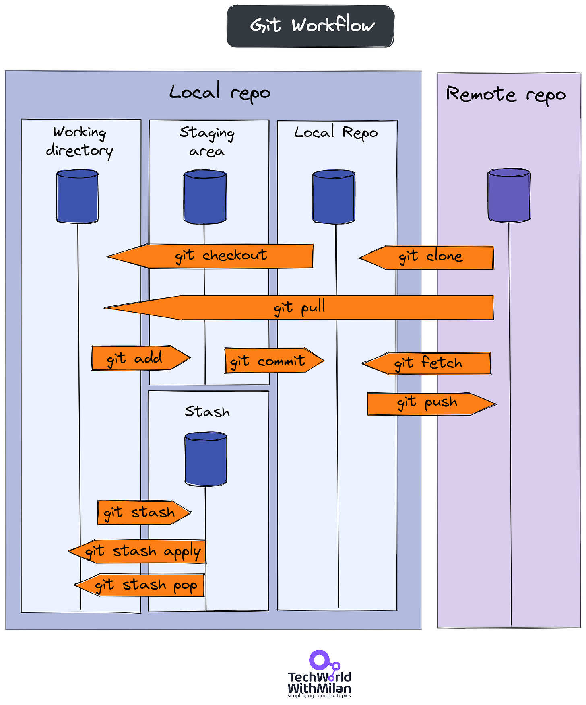
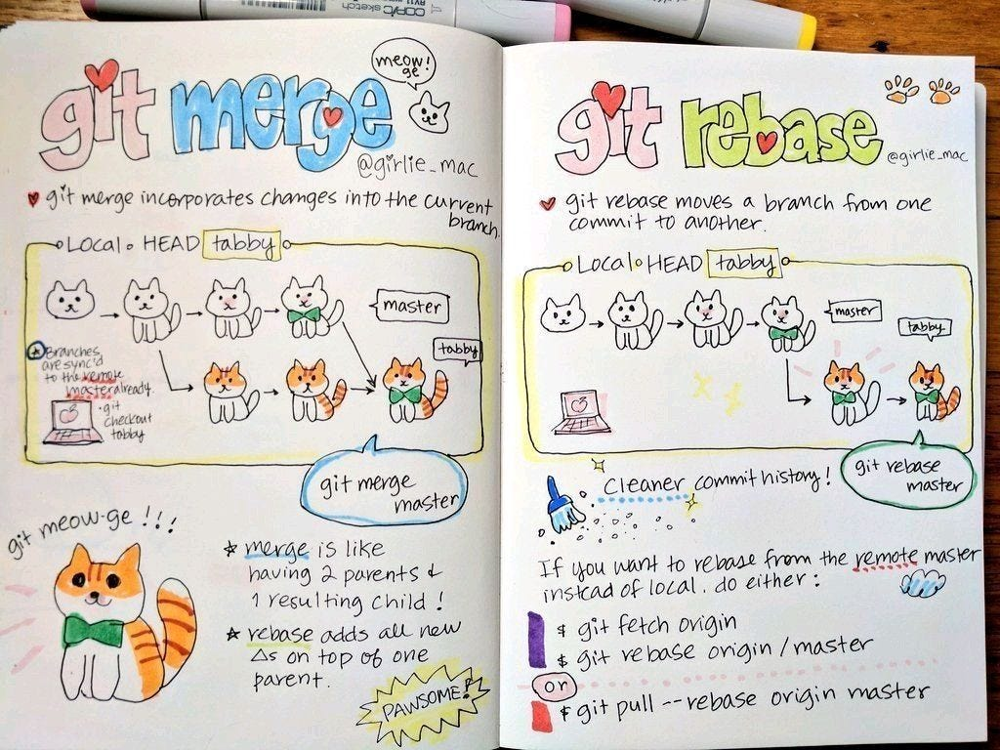
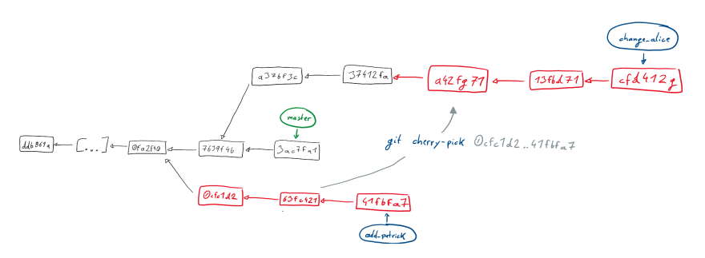
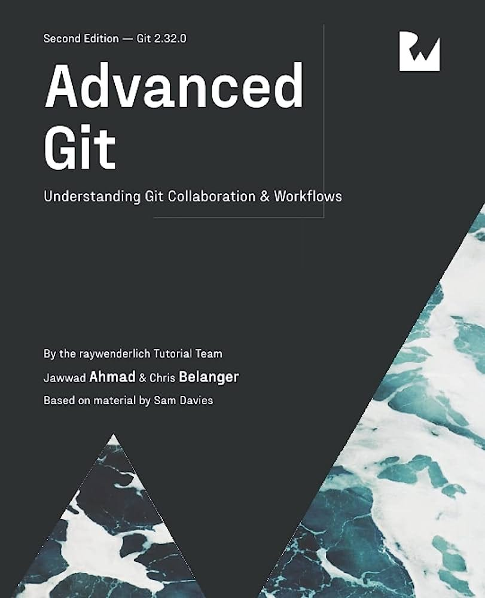
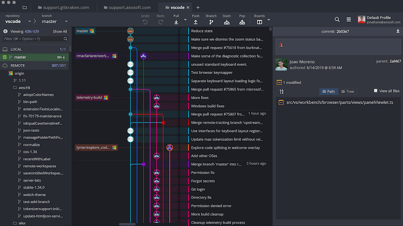
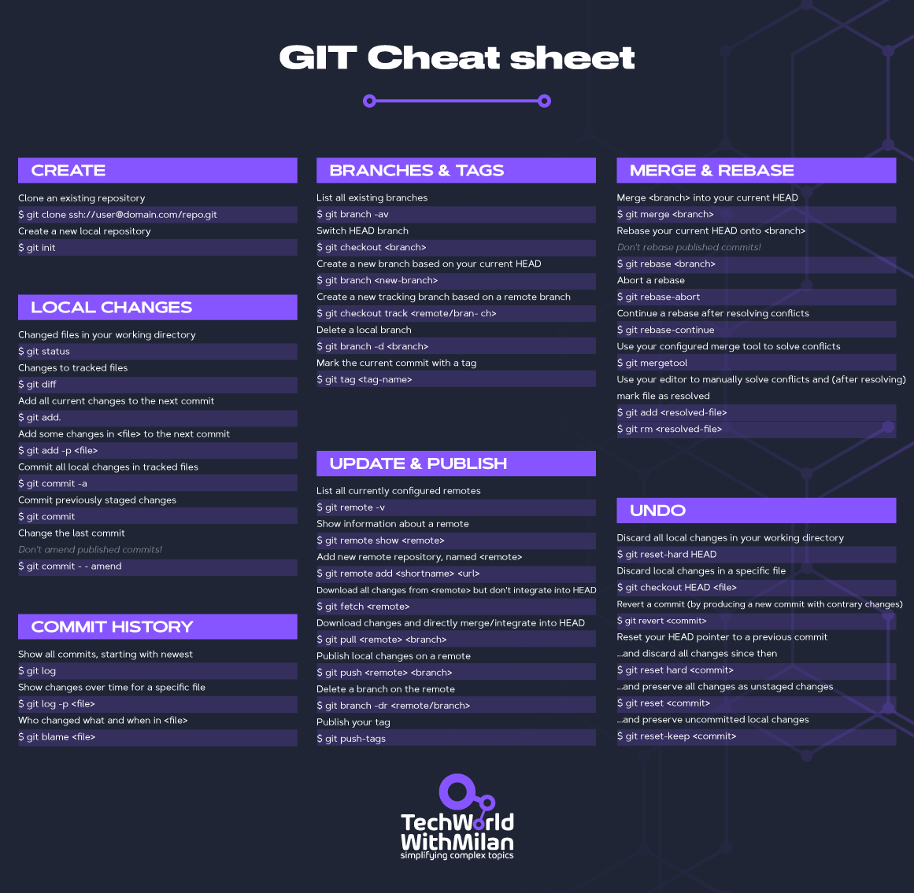

# How to Learn Git

In this issue, we are going to talk about Git, specifically about:

- **How Git works**
- **What are some basic Git commands?**
- **How to Learn Git**
- **Which Git tools exist**
- **And as a Bonus, a free Git Cheat Sheet**

So, let’s start…

## How Git works

[Git](https://github.com/git/git) is a distributed version control tool that facilitates monitoring changes to your code over time. Git makes it simple to track changes to your codebase and collaborate on projects with others. It was authored by Linus Torvalds in 2005 for the development of the **[Linux kernel](https://github.com/torvalds/linux)**, with other kernel developers contributing to its initial development.

It enables us to **track changes in our code and collaborate with others by working independently on a different part of a codebase**. When we say distributed, we may think we have code on two locations, remote server and locally, but the story is more complex.

You can download it and install it from **[this location](https://git-scm.com/)**.

Git has three storages locally: a Working directory, Staging Area, and a Local repository.

1. **Working Directory**

This is where you work and your files live ("untracked"). All file changes here will be marked; if not saved to GIT, you will lose them. The reason is that GIT is not aware of those files.
2. **Staging Area**

When you save your changes with git add, GIT will start tracking and saving your changes with files. These changes are stored in the .git directory. Then, files are moved from Working Directory to Staging Area. Still, if you change these files, GIT will not know about them; you need to tell GIT to notice those changes.
3. **Local Repository**

It is the area where everything is saved (commits) in the .git directory. So, when you want to move your files from Staging Area to Local Repository, you can use the git commit command. After this, your Staging area will be empty. If you want to see what is in the Local repository, try git log.

Git Workflow

## Basic Git commands

Some basic Git commands that every software developer needs to know are:

- **git init**→ Create a new git repo in the directory
- **git branch** → Create a new local branch
- **git checkout** → Switch branches
- **git add** → Add a new file to your staging area
- **git commit** → Adds staged changes to your local repository
- **git pull** → Pull code from your remote repo to your local directory
- **git push** → Push local repository changes to your remote repo
- **git status** → Show which files are being tracked (and untracked)
- **git diff** → See the actual difference in code between your Working Directory and your Staging Area

Basic Git Commands

## How to Learn GIT

Even though I find developers know simple flows with GIT, such as branching, committing, pushing, and fetching, what I find usually is not the ideal **understanding of (advanced) GIT concepts**and how to tackle different situations that could happen in your daily workflow as a developer.

Here are some learning resources I can recommend:

1. **[Learn GIT concepts, not commands article](https://dev.to/unseenwizzard/learn-git-concepts-not-commands-4gjc)**.

An interactive git tutorial meant to teach you how it works, not just which commands to execute.
2. **[Git from the inside-out article](https://codewords.recurse.com/issues/two/git-from-the-inside-out)**

This article focuses on the graph structure that underpins Git and the way the properties of this graph dictate Git’s behavior. Read this if you want to understand what is happening inside GIT.
3. **[Oh Shit, Git?!](https://ohshitgit.com/)**

This is a lovely article explaining to tackle different tricky situations with GIT.
4. **[Pro Git book](https://git-scm.com/book/en/v2)**, written by Scott Chacon and Ben Straub (FREE)

This book covers version control basics, Git basics, branching, and many more topics. Pro Git provides a thorough understanding of all the essential aspects of Git, even for advanced readers.
5. **[Learn Git Branching](https://learngitbranching.js.org/)**

Represent a visual and interactive way to learn GIT. Here you can be challenged with different levels and given step-by-step demonstrations of GIT features.
6. **[Visualizing GIT](http://git-school.github.io/visualizing-git/)**

This website will visualize all of your GIT commands. It is very nice if you want to see graphically what is happening. Also, take a look at **[this one](https://marklodato.github.io/visual-git-guide/index-en.html)**.
7. **[Git Command Explorer](https://gitexplorer.com/)**

This website allows you to find the proper GIT commands without digging through the web.
8. **[Git Purr](https://github.com/girliemac/a-picture-is-worth-a-1000-words/tree/main/git-purr#git-purr---git-explained-with-cats)** - Git Explained with Cats

Teach Git in engaging (or cat-resting) ways.

9. **[Git Immersion](https://gitimmersion.com/index.html)**

It is a guided tour that walks you through the fundamentals of Git by teaching the concepts in Labs. The website provides around 50+ labs.

Git cherry-pick (from the “[Learn GIT concepts, not commands](https://dev.to/unseenwizzard/learn-git-concepts-not-commands-4gjc)” article)
10. **[Advanced Git](https://www.kodeco.com/books/advanced-git/v1.0/chapters/1-how-does-git-actually-work)** book

## Git tools

In addition to Git concepts, there are different valuable tools you can use if you don’t like to work from the command line, like:

- **[GitKraken](https://www.gitkraken.com/)**
- **[SourceTree](https://www.sourcetreeapp.com/)**by Atlassian (creators of Jira, Confluence, and BitBucket)
- **[TortoiseGit](https://tortoisegit.org/),**which integrates into Windows Explorer
- **[SmartGit for Windows](https://www.syntevo.com/smartgit/)**
- **[Git Extensions](https://gitextensions.github.io/)**, a standalone UI tool for managing Git repositories
- **[Beyond Compare](https://www.scootersoftware.com/features.php?zz=features_focused)**, compare files and folders.
- **[Tower Git client](https://www.git-tower.com/windows)**
- **[GitUp for Mac](https://gitup.co/)**
- **[GitBox for Mac](http://www.gitboxapp.com/)**

But all significant new code editors, such as IntelliJ Idea, Visual Studio Code, and others, have integrated Git support and **[GitHub for Desktop](https://desktop.github.com/)** if you’re working with GitHub.

GitKraken Git client

## BONUS: Git Cheat Sheet

Here is a downloadable Git Cheatsheet you can download and use in everyday work with Git.

Git Cheat Sheet

---

Thanks for reading Tech World With Milan Newsletter! Subscribe for free to receive new posts and support my work.